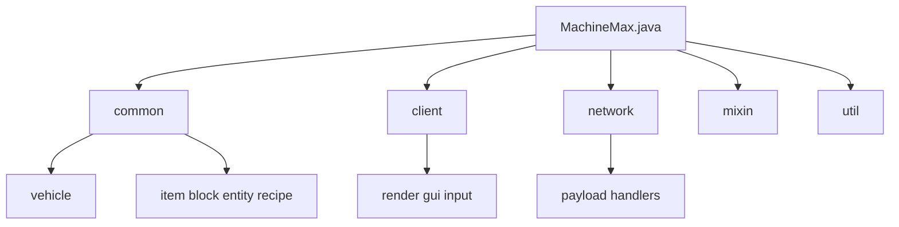
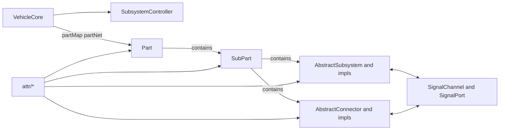

# MachineMax

A NeoForge-based Minecraft vehicle mod featuring component-based assembly, physics-driven locomotion, and subsystem control for vehicle construction and driving.

[中文版](README.md)

***

> Full documentation is available on the [MachineMax Wiki](https://sweetzonzi.github.io/Machine-Max/), including a quick-start guide, system deep-dives, and content pack creation tutorials.

---

## Overview

MachineMax vehicles are assembled from individual parts — engines, cockpits, wheels, chassis, and more — connected through attachment points to form a complete vehicle structure. Parts not only form physical connections but also transmit signals and mechanical energy. The mod uses real-time physics simulation to drive vehicle movement and implements a local height-field smoothing algorithm for Minecraft's block terrain, providing a relatively smooth driving experience on uneven ground.

All part and subsystem definitions are data-driven via JSON configuration files, supporting extension through Content Packs for new parts, subsystems, materials, and recipes — no Java coding required.

---

## Features

- **Component-based assembly**: Parts connect through attachment points, supporting simple connections and advanced joint connections (rotational axes, sliding axes)
- **Real-time physics simulation**: Physics engine independent of Minecraft's main loop, supporting multi-threaded parallel computation
- **Terrain-adaptive smoothing**: LocalHeightField smooths block terrain into a continuous surface, distinguishing hard/soft materials
- **Modular subsystems**: 18 subsystem types covering power, drivetrain, suspension, functional, and other categories, working together through signal and energy networks
- **Data-driven & Content Packs**: JSON configuration extension mechanism based on Spark-Core, supporting complete content definitions for parts, subsystems, materials, recipes, and models
- **Blueprint & Assembly system**: Save vehicle structures, batch manufacturing, survival mode technology research
- **Painting system**: Support for custom color schemes

---

## Quick Navigation

| Goal | Reference |
|------|-----------|
| Quickly build a vehicle | [Creative Mode Vehicle Building](docs/wiki/1-%E5%BF%AB%E9%80%9F%E4%B8%8A%E6%89%8B/1.3-%E5%88%9B%E9%80%A0%E6%A8%A1%E5%BC%8F%E9%80%A0%E8%BD%A6.md) |
| Start in survival mode | [Survival Mode Getting Started](docs/wiki/1-%E5%BF%AB%E9%80%9F%E4%B8%8A%E6%89%8B/1.4-%E7%94%9F%E5%AD%98%E6%A8%A1%E5%BC%8F%E8%B5%B7%E6%AD%A5.md) |
| All tools and items | [Core Items Overview](docs/wiki/1-%E5%BF%AB%E9%80%9F%E4%B8%8A%E6%89%8B/1.5-%E6%A0%B8%E5%BF%83%E7%89%A9%E5%93%81%E4%B8%80%E8%A7%88.md) |
| Official vehicles | [Official Content Pack Vehicles](docs/wiki/1-%E5%BF%AB%E9%80%9F%E4%B8%8A%E6%89%8B/1.6-%E5%AE%98%E6%96%B9%E5%86%85%E5%AE%B9%E5%8C%85%E8%BD%BD%E5%85%B7%E4%B8%80%E8%A7%88.md) |
| Vehicle architecture | [Vehicle Concepts & Hierarchy](docs/wiki/2-%E8%BD%BD%E5%85%B7%E7%B3%BB%E7%BB%9F%E5%AE%8C%E5%85%A8%E6%8C%87%E5%8D%97/2.1-%E8%BD%BD%E5%85%B7%E6%A6%82%E5%BF%B5%E4%B8%8E%E5%B1%82%E7%BA%A7.md) |
| Subsystem reference | [Subsystem Overview](docs/wiki/3-%E5%AD%90%E7%B3%BB%E7%BB%9F%E8%AF%A6%E8%A7%A3/3.1-%E5%AD%90%E7%B3%BB%E7%BB%9F%E6%A6%82%E8%BF%B0.md) |
| Physics & combat | [Friction & Grip](docs/wiki/4-%E7%89%A9%E7%90%86%E4%B8%8E%E6%88%98%E6%96%97%E6%9C%BA%E5%88%B6/4.1-%E6%91%A9%E6%93%A6%E4%B8%8E%E6%8A%93%E5%9C%B0%E5%8A%9B.md) |
| Create your own content pack | [Content Pack Tutorial](docs/wiki/5-%E5%86%85%E5%AE%B9%E5%8C%85%E5%88%B6%E4%BD%9C%E6%95%99%E7%A8%8B/5.1-%E5%86%85%E5%AE%B9%E5%8C%85%E6%80%BB%E8%A7%88.md) |

---

## Wiki Chapter Structure

- **Chapter 1: Quick Start** — New player guide, creative/survival vehicle building, core items, official vehicles
- **Chapter 2: Vehicle System Guide** — Parts, assembly, blueprints, tools
- **Chapter 3: Subsystem Deep Dive** — All 18 subsystem types, functions, and configuration reference
- **Chapter 4: Physics & Combat Mechanics** — Friction, fluid dynamics, armor, damage, collisions, terrain smoothing
- **Chapter 5: Content Pack Creation Guide** — Complete tutorial for UGC authors, from metadata definitions to recipe writing
- **Appendices** — Mod configuration, Create mod compatibility, FAQ

---

## LLM Reference

- [LLM Quickstart Guide](docs/LLM_QUICKSTART.md)

---

## Code Structure

Java source code is located at `src/main/java/io/github/sweetzonzi/machine_max`, organized into the following layers:

| Package | Responsibility |
|---------|---------------|
| `common/` | Server & shared logic: blocks, items, entities, vehicle core, menus, recipes |
| `client/` | Client rendering, input, GUI, HUD |
| `network/` | Payload & network synchronization handling |
| `mixin/` | Mixin injections into vanilla behavior |
| `util/` | Math, controllers, terrain, and general utilities |

### `common/vehicle` Core Domain

`common/vehicle` is the project's core domain, managing vehicle topology, physics objects, subsystems, signal systems, and connector mechanisms.

Key entry points and core classes:

| Class | Description |
|-------|-------------|
| `VehicleCore` | Aggregate root for a single vehicle, managing the part network, lifecycle, mass/position state, structural changes (connect/disconnect) |
| `Part` | Smallest assembly unit, holding multiple SubParts, attachment points, and subsystems |
| `SubPart` | Entity unit participating in physics, collision, animation, and interaction |
| `SubsystemController` | Unified management of tick and lifecycle for all subsystems within a vehicle |
| `subsystem/*` | Power, control, seat, storage, drivetrain, and other functional subsystem implementations |
| `connector/*` | Part-to-part connections, joints, installation checks, and connection state synchronization |
| `signal/*` | Signal channel model between subsystems and attachment points |
| `attr/*` | Resource-driven attribute models (part, connector, subsystem static/dynamic properties) |

Architecture diagram:

#### Sub-package Guide

- `attr/` — Configurable attribute definitions
- `connector/` — Connectors, joints, and attach/detach logic
- `data/` — Persistence and network sync data structures (VehicleData, PartData, etc.)
- `event/` — Vehicle, connector, and sub-part events
- `interact/` — Hitboxes and interaction boxes
- `signal/` — Signal send/receive and channels
- `subsystem/` — Various functional subsystem implementations
- `molang/` — Animation/expression binding bridge

---

## Dependencies

- [Spark-Core](https://github.com/sweetzonzi/Spark-Core) — Content pack loading and data-driven infrastructure
- [Libbulletjme](https://github.com/sweetzonzi/Libbulletjme) — Physics engine wrapper

---

## License

- Mod code is licensed under **GNU General Public License v3 (GPLv3)** — see [LICENSE](LICENSE)
- Documentation and art assets are licensed under **CC BY-NC 4.0** (Attribution-NonCommercial)
