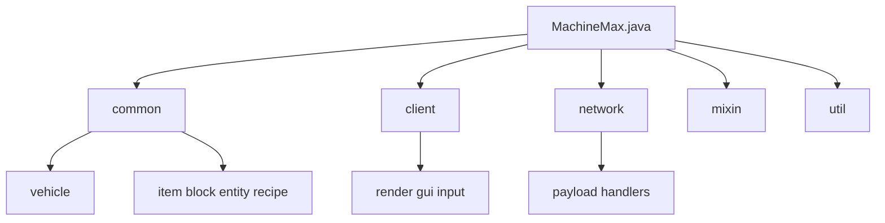
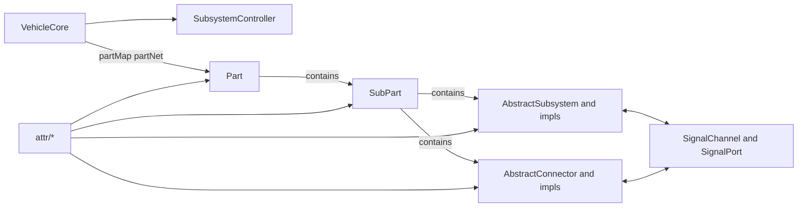

# MachineMax

一个基于 NeoForge 的 Minecraft 载具模组，提供部件化组装、物理驱动与子系统控制的车辆构建与驾驶体验。

> 完整文档请参阅 [MachineMax Wiki](https://sweetzonzi.github.io/Machine-Max/)，内含新手指南、系统详解与内容包制作教程。

---

## 概述

MachineMax 的载具由独立的零件拼接而成——发动机、座舱、车轮、底盘等零件通过连接点组合，形成完整的车辆结构。零件之间不仅形成物理连接，还能传递信号和机械能。模组基于实时物理模拟驱动载具行驶，并针对 Minecraft 方块地形实现了局部高度场平滑算法，使载具在不平整的地形上获得相对平稳的行驶体验。

所有零件和子系统的定义均以数据驱动方式通过 JSON 配置文件实现，支持通过内容包（Content Pack）扩展新的零件、子系统、材料和配方，无需编写 Java 代码。

---

## 功能特性

- **部件化组装**：零件通过连接点拼接，支持简单连接与高级关节连接（旋转轴、滑动轴）
- **实时物理模拟**：独立于 Minecraft 主循环的物理引擎，支持多线程并行计算
- **地形自适应平滑**：局部高度场（LocalHeightField）将方块地形平滑为连续表面，区分硬质/软质材质
- **模块化子系统**：18 种子系统类型，涵盖动力、传动、行驶、功能等类别，通过信号与能量网络协同工作
- **数据驱动与内容包**：基于 Spark-Core 的 JSON 配置扩展机制，支持零件、子系统、材料、配方、模型等完整内容定义
- **蓝图与装配体系统**：保存载具结构、批量制造、生存模式科技研发
- **涂装系统**：支持自定义颜色方案

---

## 快速导航

| 目的 | 参考章节 |
|------|----------|
| 快速搭建一辆载具 | [创造模式造车](docs/wiki/1-快速上手/1.3-创造模式造车.md) |
| 从生存模式开始 | [生存模式起步](docs/wiki/1-快速上手/1.4-生存模式起步.md) |
| 了解所有工具物品 | [核心物品一览](docs/wiki/1-快速上手/1.5-核心物品一览.md) |
| 查看官方提供的载具 | [官方内容包载具一览](docs/wiki/1-快速上手/1.6-官方内容包载具一览.md) |
| 理解载具的构成层级 | [载具概念与层级](docs/wiki/2-载具系统完全指南/2.1-载具概念与层级.md) |
| 了解各类子系统 | [子系统详解](docs/wiki/3-子系统详解/3.1-子系统概述.md) |
| 物理与战斗机制 | [摩擦与抓地力](docs/wiki/4-物理与战斗机制/4.1-摩擦与抓地力.md) |
| 制作自己的内容包 | [内容包制作教程](docs/wiki/5-内容包制作教程/5.1-内容包总览.md) |

---

## Wiki 章节结构

- **第一章：快速上手** — 新手指南，创造/生存模式造车，核心物品一览，官方载具总览
- **第二章：载具系统完全指南** — 零件、拼装、蓝图、工具详解
- **第三章：子系统详解** — 全部 18 种子系统的功能与配置参考
- **第四章：物理与战斗机制** — 摩擦、流体、装甲、伤害、碰撞、地形平滑
- **第五章：内容包制作教程** — 面向 UGC 作者的完整制作指南，从元数据定义到配方编写
- **附录** — 模组配置、Create 模组兼容性、常见问题

---

## LLM 参考

- [LLM 快速导览](docs/LLM_QUICKSTART.md)

---

## 代码结构

Java 主代码位于 `src/main/java/io/github/sweetzonzi/machine_max`，按职责分为以下层级：

| 包 | 职责 |
|----|------|
| `common/` | 服务端与通用逻辑：方块、物品、实体、载具核心、菜单、配方 |
| `client/` | 客户端渲染、输入、GUI、HUD |
| `network/` | Payload 与网络同步处理 |
| `mixin/` | 对原版行为的注入扩展 |
| `util/` | 数学、控制器、地形与通用工具 |

### `common/vehicle` 核心域

`common/vehicle` 是项目的核心域，负责载具拓扑管理、物理对象、子系统、信号系统与连接器机制。

关键入口与核心类：

| 类 | 说明 |
|----|------|
| `VehicleCore` | 单个载具的聚合根，维护部件网络、生命周期、质量/位置状态、结构变化（连接/拆分） |
| `Part` | 组装的最小单元，持有多个 SubPart、连接点与子系统 |
| `SubPart` | 参与物理、碰撞、动画、交互的实体单元 |
| `SubsystemController` | 统一管理载具内全部子系统的 tick 与生命周期 |
| `subsystem/*` | 动力、控制、座位、存储、传动等功能子系统实现 |
| `connector/*` | 部件之间连接、关节、安装判定与连接状态同步 |
| `signal/*` | 子系统与连接点间的信号通道模型 |
| `attr/*` | 由资源定义驱动的属性模型（部件、连接器、子系统静态/动态属性） |

架构关系：

#### 子包导览

- `attr/` — 配置化属性定义
- `connector/` — 连接器、关节与安装/拆卸逻辑
- `data/` — 持久化与网络同步数据结构（VehicleData、PartData 等）
- `event/` — 载具、连接器、子部件事件
- `interact/` — 命中框与交互框
- `signal/` — 信号发送/接收与信道
- `subsystem/` — 各种功能子系统实现
- `molang/` — 与动画/表达式绑定相关桥接

---

## 依赖项目

- [Spark-Core](https://github.com/sweetzonzi/Spark-Core) — 内容包加载与数据驱动基础设施
- [Libbulletjme](https://github.com/sweetzonzi/Libbulletjme) — 物理引擎封装

---

## License

- 模组代码采用 **GNU General Public License v3 (GPLv3)** — 详见 [LICENSE](LICENSE)
- 文档与美术资源采用 **CC BY-NC 4.0**（署名-非商业）
