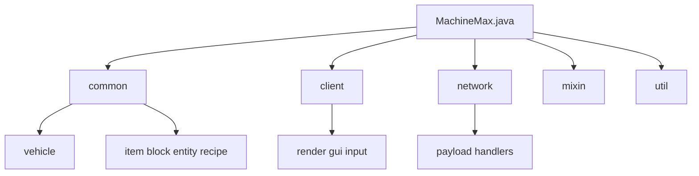
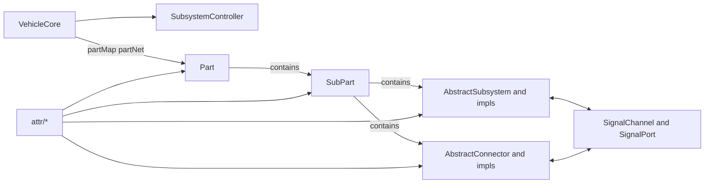

# Machine Max

一个基于 NeoForge 的 Minecraft 载具模组项目，核心玩法围绕“部件化组装 + 物理驱动 + 子系统控制”。

## LLM 快速入口

- [LLM 快速导览](docs/LLM_QUICKSTART.md)

## Java 代码结构总览

Java 主代码位于 `src/main/java/io/github/sweetzonzi/machine_max`，可以按职责分成几层：

- `common/`: 服务端与通用逻辑（方块、物品、实体、载具核心、菜单、配方等）
- `client/`: 客户端渲染、输入、GUI、HUD
- `network/`: Payload 与网络同步处理
- `mixin/`: 对原版行为的注入扩展
- `util/`: 数学、控制器、地形与通用工具

## `common/vehicle` 重点说明

`common/vehicle` 是项目的核心域，负责“载具拓扑 + 物理对象 + 子系统 + 信号系统 + 连接器机制”。

关键入口与核心类：

- `VehicleCore`: 单个载具聚合根，维护部件网络、生命周期 tick、质量/位置状态、结构变化（连接/拆分）
- `Part`: 组装最小单元，持有多个 `SubPart`、连接点与子系统
- `SubPart`: 真正参与物理、碰撞、动画、交互的实体单元
- `SubsystemController`: 统一管理载具内全部子系统的 tick 与生命周期
- `subsystem/*`: 动力、控制、座位、存储、传动等功能子系统实现
- `connector/*`: 部件之间连接/关节/安装判定与连接状态同步
- `signal/*`: 子系统与连接点间的信号通道模型
- `attr/*`: 由资源定义驱动的属性模型（部件、连接器、子系统静态/动态属性）

### 架构关系图

### 子包导览（`common/vehicle`）

- `attr/`: 配置化属性定义
- `connector/`: 连接器、关节与安装/拆卸逻辑
- `data/`: 持久化与网络同步数据结构（VehicleData、PartData 等）
- `event/`: 载具、连接器、子部件事件
- `interact/`: 命中框与交互框
- `signal/`: 信号发送/接收与信道
- `subsystem/`: 各种功能子系统实现
- `molang/`: 与动画/表达式绑定相关桥接

## License

`All Rights Reserved`
