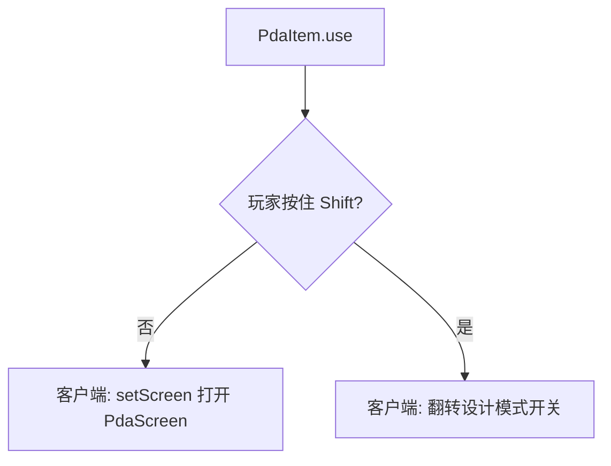
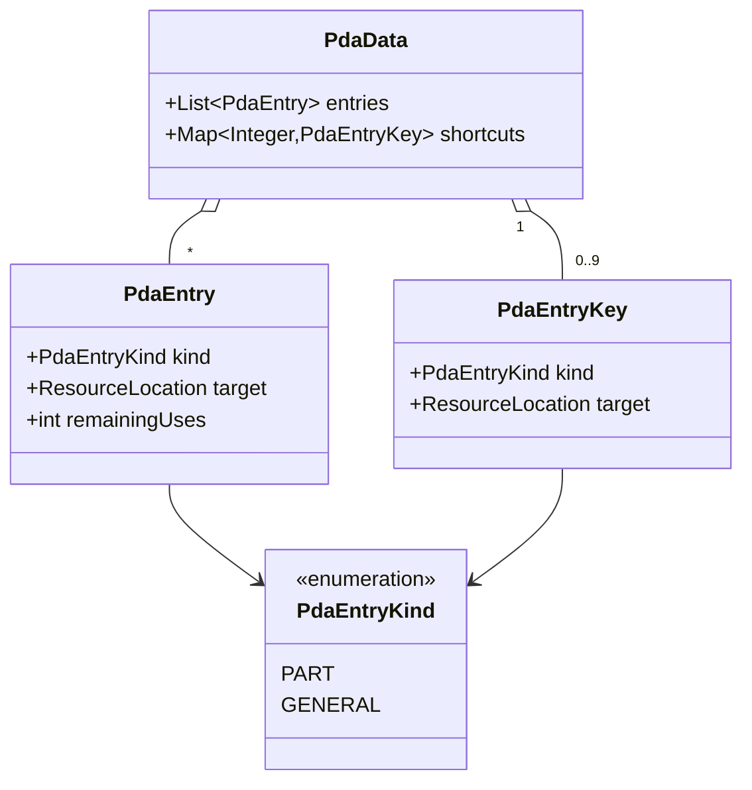
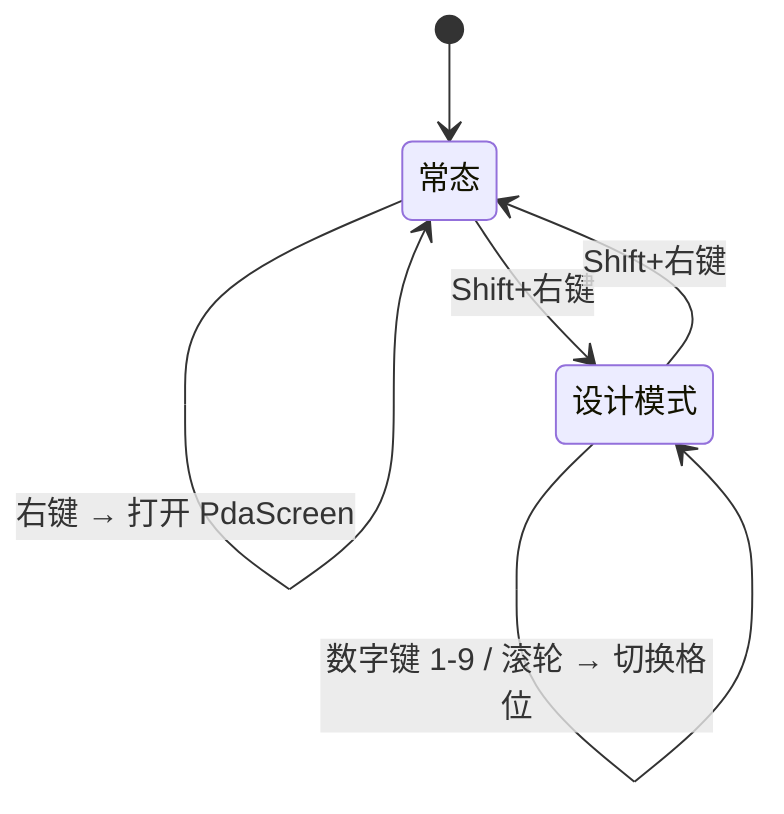
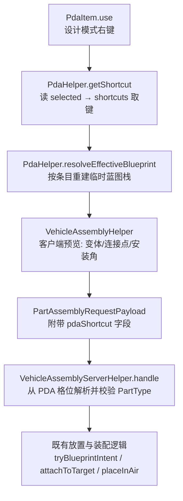

# PDA 蓝图终端：详细设计文档

**文档状态**：设计中（未实施）
**适用版本**：NeoForge 1.21.1 · Machine-Max 1.0.3-beta.6
**编写日期**：2026-09-27

## 0. 本文自包含

阅读本文不需要预先阅读任何其他文档、代码或历史讨论。本文完整描述一个尚未实施的新功能——**PDA 蓝图终端**。第 2 章给出该功能所依赖的现存代码基线及其位置，第 3~8 章给出完整设计，第 9 章给出改动清单。文中出现的"现状"一律指第 2 章描述的代码状态，不指任何历史版本。

配套产物：

| 产物 | 位置 | 用途 |
| --- | --- | --- |
| 接口设计文档 | `docs/PDA蓝图终端-接口设计文档.md` | 类名、方法签名、数据组件、网络包、语言键的精确契约 |
| 静态原型 | `src/main/resources/assets/apricityui/apricity/machine_max/pda/pda_ui_prototype.html` + `pda_ui.css` | 管理界面的外观与绑定交互记录 |
| 实施页 | `src/main/resources/assets/apricityui/apricity/machine_max/pda/pda_ui.html` | 管理界面的真实页面骨架 |
| HUD 原型 | `src/main/resources/assets/apricityui/apricity/machine_max/pda/pda_hotbar_prototype.html` + `pda_hotbar.css` | 设计模式替代快捷栏的外观记录 |
| HUD 实施页 | `src/main/resources/assets/apricityui/apricity/machine_max/pda/pda_hotbar.html` | 替代快捷栏的真实页面骨架 |

## 1. 术语

| 术语 | 含义 |
| --- | --- |
| 制造配方 | 定义"一组原料 → 一个产物 + 耗时"的配方 |
| 零件配方 | 产物是零件的制造配方，除制造机外还参与手动焊接组装与拆卸 |
| 通用制造配方 | 产物不是零件的制造配方，只在制造机中加工 |
| 制造蓝图物品 | 生存模式下代表某个制造配方的蓝图物品，由研究台发放、可被玩家持有 |
| 零件制造蓝图 | 零件配方对应的蓝图物品，可放置为未组装零件、可参与装配 |
| 通用制造蓝图 | 通用制造配方对应的蓝图物品，只有凭证与展示语义 |
| 蓝图条目（条目） | PDA 内部记录的一条已收纳蓝图，由"类别 + 定位"唯一标识 |
| 条目类别 | `PART`（来自零件制造蓝图）或 `GENERAL`（来自通用制造蓝图） |
| 条目定位 | `PART` 类别取物品上的 `part_type` 组件值；`GENERAL` 类别取 `recipe_type` 组件值 |
| 残留次数 | 条目的剩余可使用次数，`-1` 表示无限 |
| 设计模式快捷栏 | PDA 内置的 9 格蓝图选择器，格位序号 0~8 |
| 设计模式 | 一种玩家级输入状态：手持 PDA 时右键按当前格位的蓝图放置零件 |
| 常态 | 设计模式之外的状态 |
| 装配侧 | 焊枪组装/拆卸、撬棍拆除、装配 HUD、装配门禁这一组读配方的地方 |
| 装配资格 | 玩家是否有权推进某个零件的装配，判据集合见第 7 章 |
| 装载期 | 收集配方与零件数据并建立索引的阶段 |

## 2. 现状（基线）

### 2.1 两种被收纳的蓝图物品

| 物品类 | 绝对路径 | 组件 | 能否放置零件 |
| --- | --- | --- | --- |
| `PartFabricatingBlueprintItem` | `common/item/prop/PartFabricatingBlueprintItem.java` | `RECIPE_TYPE` + `PART_TYPE` | 能，实现 `PartAssemblyItem` |
| `FabricatingBlueprintItem` | `common/item/prop/FabricatingBlueprintItem.java` | `RECIPE_TYPE` | 不能，只有凭证与展示语义 |

两种类各自对应的物品 id 为 `machine_max:part_fabricating_blueprint` 与 `machine_max:fabricating_blueprint`；类层次上 `PartFabricatingBlueprintItem extends FabricatingBlueprintItem`，因此判定顺序必须先判子类。

蓝图物品的身份完全由数据组件决定，物品本身没有额外状态：

- 零件制造蓝图：`part_type` 组件即零件类型注册名，见 `PartAssemblyItem.getPartType(ItemStack, Level)`（`common/item/prop/PartAssemblyItem.java`，第 36~46 行）。
- 通用制造蓝图：`recipe_type` 组件指向配方 id，见 `FabricatingBlueprintItem.getProductName(ItemStack)`（同目录，第 56~65 行）。

**蓝图物品在放置零件时不被消耗**。`VehicleAssemblyServerHelper.consumeItem(...)` 只消耗 `PartItem`。

### 2.2 零件放置链路上的两处"手持解析"

放置零件由"客户端装配助手构造请求 → 网络包 → 服务端权威处理"三段组成，其中有两处直接从手持物品解析零件类型：

1. **客户端预览**：`VehicleAssemblyHelper.onClientTick(ClientTickEvent.Pre)`（`common/mech/vehicle/VehicleAssemblyHelper.java`，第 85~117 行）按"主手优先、副手兜底"的顺序找出 `instanceof PartAssemblyItem` 的物品栈，再调用 `PartAssemblyItem.getPartType(stack, level)` 得到当前预览的零件类型。变体自动过滤、连接点循环、安装角等状态都挂在这个解析结果上。
2. **服务端校验**：`VehicleAssemblyServerHelper.handle(Player, PartAssemblyRequestPayload)`（同目录，第 53~94 行）先校验"手持物品解析出的 `PartType` 与请求里的 `registryKey` 一致"，通过后才走 `tryBlueprintIntent` / `attachToTarget` / `placeInAir`。

请求载荷是 `PartAssemblyRequestPayload`（`network/payload/assembly/PartAssemblyRequestPayload.java`），字段包含 `registryKey`、`variant`、`subPart`、`connector`、`hand`、`attachToTarget`、`targetSubPartId`、`targetConnector`、`attachRotation`。

### 2.3 装配资格门禁

`BlueprintAttachment`（`common/attachment/BlueprintAttachment.java`）是玩家科研与装配资格的权威载体，注册为不带任何同步的实体附件之外的可持久化附件（`copyOnDeath = true`）。与本设计相关的三个方法：

- `canAdvanceAssembly(Player, Part)`（第 384~393 行）：判定顺序为"创造模式放行 → 无零件配方放行 → 该零件的研发条目已完成 → 背包中持有对应的零件制造蓝图"。
- `rebuildAvailableRecipes(Player)`（第 443~454 行）：重建 `availableRecipes` 索引。它遍历 `player.getInventory().items`，对每个物品调用 `checkAndRecord`；`checkAndRecord`（第 465~471 行）只接受 `PartFabricatingBlueprintItem`，并以 `part_type` 组件为键写入索引。该方法末尾留有一处 TODO，原文为：

  > `// TODO: 蓝图库检查——计划中的蓝图收纳道具（统一存放玩家的制造蓝图，避免背包被蓝图塞满），实现后需在此扫描该道具内保存的附件信息并一并录入可用配方`

- `hashInventory(Player)`（第 473~479 行）与 `isDirty()`：索引的重建由背包哈希变化驱动，哈希基于 `ItemStack.hashItemAndComponents(stack)`。

### 2.4 现存的研究平板与 AUI 界面范式

`PadItem`（`common/item/prop/PadItem.java`）是一个 `stacksTo(1)` 的物品，`use()` 在服务端向玩家发送 `ResearchScreenOpenPayload` 以打开研究台界面。它在 `common/registry/MMItems.kt` 中的注册代码处于注释状态，物品 id 为 `pad`。

界面框架方面，项目使用 ApricityUI（下称 AUI）：

- 纯 UI 屏基类为 `com.sighs.apricityui.screen.ApricityScreen extends Screen`，页面由 AUI 从 HTML 模板创建。`BlueprintResearchScreen`（`client/render/gui/screen/BlueprintResearchScreen.java`）即此类，其模式为"Java 侧拼 HTML 片段 → `Element.setInnerHTML` 写入容器 → `Element.addEventListener` 挂 Java 监听"，见该文件第 308~338 行。
- AUI 另有基于 `AbstractContainerScreen` 的容器屏（`ApricityContainerScreen` + `ApricityContainerMenu`），可承载真实物品槽位；它的非玩家容器只支持 `player` / `saveddata` / `blockEntity` / `entity` 四种绑定，公开 API 不提供自定义容器数据源。

HTML 模板资源放在 `src/main/resources/assets/apricityui/apricity/` 下，按功能分子目录组织（`machine_max/research/`、`machine_max/vehicle_control/`、`machine_max/pda/`），逻辑路径即相对该根目录的路径，例如研究台页面的逻辑路径为 `machine_max/research/research_ui.html`。

### 2.5 既有的原版输入拦截手段

`RawInputHandler`（`client/input/RawInputHandler.java`）在炮镜模式下已经实现了两类原版输入拦截，是本设计所需输入拦截的现成先例，且在同一代码库中运行：

- `handleMouseScrollInputs(InputEvent.MouseScrollingEvent)`（第 263~270 行）：炮镜模式下调用 `event.setCanceled(true)`，阻止原版滚轮切换快捷栏格；
- `handleVanillaInputs(InputEvent.Key)`（第 560~600 行）：炮镜模式下对 `Minecraft.getInstance().options.keyHotbarSlots[i]` 逐个调用 `consumeClick()` 与 `setDown(false)`（第 592~598 行），阻止原版数字键切换快捷栏格；同一方法还对移动键、背包键、丢弃键、副手交换键做了同样的消化。

拦截能生效的原理：原版 `Minecraft.handleKeybinds()` 以 `consumeClick()` 读取热栏切换意图，而 `InputEvent.Key` 在同一帧内先于它执行，先消费掉 click 即可让原版取不到。

### 2.6 既有的 HUD 拦截与 AUI 叠层机制

**取消原版 HUD 图层**：HUD 的注册与拦截中枢是 `MMGuiManager`（`client/render/gui/MMGuiManager.java`）。

- `registerHud(RegisterGuiLayersEvent)`（第 49 行）用 `registerAboveAll` 依次注册 5 个 `LayeredDraw.Layer`；
- `renderHudEvent(RenderGuiLayerEvent.Pre)`（第 131~149 行）逐层拦截，其中第 144~148 行在座椅不允许使用物品时取消快捷栏图层，即 `if (event.getName() == VanillaGuiLayers.HOTBAR) event.setCanceled(true);`。

也就是说，"取消原版快捷栏"在同一代码库中已有实现，手段是 `RenderGuiLayerEvent.Pre` + `setCanceled(true)`，不需要 Mixin。`RegisterGuiLayersEvent` 只提供 `registerBelowAll` / `registerBelow` / `registerAbove` / `registerAboveAll` 四个注册方法，且禁止注册重名图层，因此"替换快捷栏"由"取消原图层"与"另行绘制替代内容"两件事合成，无法覆盖同名图层。

**AUI 的 HUD 叠层**：AUI 把不依附任何 Minecraft Screen 的 Document 称为 Overlay Document（文档见 AUI 仓库 `docs/guide/overlay-document.md`）。

- 客户端调用 `ApricityUI.createDocument(path)` 创建并注册；
- AUI 自身的 `Client.drawOverlay(RenderGuiEvent.Post)`（AUI 仓库 `targets/neoforge-1.21.1/` 下 `client/Client.java`，第 221~249 行）在 `Minecraft.getInstance().screen == null` 且玩家未按 F1 隐藏 HUD 时，逐帧绘制所有非 `inWorld`、非 `manuallyRendered` 的 Document；
- 绘制时机是 `RenderGuiEvent.Post`，即所有 `LayeredDraw` 图层之后，因此叠层天然位于原版 HUD 之上；
- 该文档给出的 HUD 用法是"普通 Overlay，不开持久化：打开背包自动隐藏，关掉自动回来"。

## 3. 设计目标

| 目标 | 说明 |
| --- | --- |
| G1 | 集中收纳零件制造蓝图与通用制造蓝图，使玩家不必在背包中常驻大量蓝图物品 |
| G2 | 收纳后的蓝图对"使用"完全等价：在 PDA 上选中某条目后放置零件，与直接使用对应蓝图物品的效果一致 |
| G3 | 收纳后的蓝图对"装配资格"完全等价：PDA 放在背包中即计入该蓝图对应的装配资格 |
| G4 | 收纳不可逆：存入 PDA 的蓝图不提供还原为物品的途径，避免"复制蓝图"漏洞 |
| G5 | 收纳无副作用地支持未来的有限次蓝图 |

非目标（明确不做）：

- 不收纳空白蓝图、整机蓝图（`VehicleBlueprintItem`）、装配体收纳物（`AssemblyItem`）。
- 不提供从 PDA 取出蓝图或还原为物品的任何途径。
- 不接管研究台功能；研究台仍只由 `ResearchTableBlock` 打开。
- 不为 PDA 数据提供死亡保护；PDA 是普通物品，会因死亡掉落、可放入容器、可交易。
- 不实现通用制造蓝图的"使用"行为；这类条目只能收纳与展示。

## 4. 物品与数据模型

### 4.1 物品

物品类为 `PdaItem extends Item`（`common/item/prop/PdaItem.java`），注册为物品 id `machine_max:pda`，`Properties().stacksTo(1)`。它只承担蓝图收纳，不向玩家发送 `ResearchScreenOpenPayload`。

`use(Level, Player, InteractionHand)` 的行为分派：



设计模式不限制 PDA 位于哪一只手；格位切换与原版输入拦截见 5.2。

### 4.2 数据模型

PDA 的全部状态存在物品的数据组件里，随物品走：放入容器、丢弃、交易、死亡掉落都自然带上。



- `PdaEntry.kind == PART` 时 `target` 是零件类型注册名（与 `part_type` 组件同值）；`kind == GENERAL` 时 `target` 是配方 id（与 `recipe_type` 组件同值）。
- 条目由 `(kind, target)` 唯一标识，即 `PdaEntryKey`。同一个 `(kind, target)` 在 `entries` 中最多出现一次。
- `shortcuts` 是稀疏映射，键为格位序号 0~8，值为该格位绑定的条目键；键不存在表示该格位为空。限制键域为 0~8 是数据组件的不变量。
- `remainingUses` 为 `-1` 表示无限。当前所有蓝图物品都是无限次，因此新录入的条目恒为 `-1`。

### 4.3 存入规则

对玩家背包中的每一个蓝图物品，按 `§2.1` 的组件解析出 `(kind, target)`，然后：

| PDA 中的现状 | 传入蓝图 | 动作 | 结果 |
| --- | --- | --- | --- |
| 无该条目 | 任意 | 新增条目 | `remainingUses = 传入蓝图的次数` |
| 已有，`remainingUses == -1` | 任意 | **拒绝** | 提示"已收纳"，蓝图留在背包 |
| 已有，`remainingUses > 0` | 有限次数 | 累加 | `remainingUses += 传入蓝图的次数` |
| 已有，`remainingUses > 0` | 无限（`-1`） | 升级 | `remainingUses = -1` |

"传入蓝图的次数"取自蓝图物品自身的次数数据；蓝图物品当前不以任何组件承载次数，故该项恒为 `-1`。这一列留给未来的有限次蓝图。

存入成功的每一张蓝图都从背包中**移除原件**。存入不可逆。

## 5. 交互模型

### 5.1 状态与操作



| 状态 | 操作 | 效果 |
| --- | --- | --- |
| 常态 | 右键 | 客户端打开 `PdaScreen` |
| 常态 | Shift + 右键 | 进入设计模式 |
| 设计模式 | 右键 | 以当前格位的条目作等效蓝图，走既有放置链路 |
| 设计模式 | Shift + 右键 | 退出设计模式 |
| 设计模式 | 数字键 1-9 / 滚轮 | 切换格位，原版热栏切换被屏蔽 |

常态下右键不给提示语失败反馈以外的任何副作用；设计模式下若当前格位为空，或绑定的条目类别为 `GENERAL`，右键均不放置，只给出对应的提示。

### 5.2 格位选择与原版输入拦截

格位序号是设计模式自己的客户端状态，取值 0~8，与 `Player.getInventory().selected` 无关。玩家用两组原生输入切换它，这两组输入对原版的"切换物品栏格"效果同时被屏蔽：

| 输入 | 设计模式下的行为 | 屏蔽方式 |
| --- | --- | --- |
| 滚轮上/下 | 格位序号 +1 / -1，越界环绕 | `InputEvent.MouseScrollingEvent` 中 `event.setCanceled(true)` |
| 数字键 1-9 | 直接选中对应格位 | `InputEvent.Key` 中对 `Minecraft.getInstance().options.keyHotbarSlots[i]` 调用 `consumeClick()` 与 `setDown(false)` |

两个拦截共用同一条件：**本地玩家处于设计模式、手持 PDA、且当前没有打开任何界面**。条件不满足时不得触碰任何原版输入状态。

因为原版热栏切换被吞掉，设计模式下 `Player.getInventory().selected` 保持不变，PDA 位于任一只手都能正常切格位；退出设计模式后滚轮与数字键立即恢复原版行为。

设计模式下只拦截滚轮与数字键 1-9；移动、背包、丢弃、副手交换等按键保持原版行为。

拦截手段所依据的既有实现见 2.5。

### 5.3 状态归属

设计模式开关与当前格位序号都是**玩家级、临时的客户端状态**：不写盘、不参与网络同步，重登后回到常态且格位归 0。服务端不感知"模式"，它只从放置请求里读取格位序号并据此解析蓝图（见第 6 章）。

## 6. 等价使用的间接层

这是"用 PDA"与"用蓝图"完全等价的实现手段。



`PdaHelper.resolveEffectiveBlueprint(ItemStack pdaStack, Level level, int shortcutIndex)` 把格位绑定的条目重建成一个**临时物品栈**：

- `kind == PART` → `new ItemStack(MMItems.PART_FABRICATING_BLUEPRINT)`，写入 `PART_TYPE = target`，并一并写入 `RECIPE_TYPE = target` 对应的零件配方 id（用于名称与图标解析）。
- `kind == GENERAL` → `new ItemStack(MMItems.FABRICATING_BLUEPRINT)`，写入 `RECIPE_TYPE = target`。

临时栈只用于解析：它不进入任何物品栏、不被存档、不被网络同步，因此不构成 G4 所禁止的"反向还原"。当格位为空或条目类别为 `GENERAL` 时返回 `null`。

链路上两处"手持解析"改造为：

- **客户端**：`VehicleAssemblyHelper.onClientTick` 判定手持物品时，若为 `PdaItem` 且处于设计模式，则用 `resolveEffectiveBlueprint` 得到的临时栈参与后续 `PartAssemblyItem.getPartType` 解析。
- **服务端**：`VehicleAssemblyServerHelper.handle` 中"手持物品解析出的 PartType"一步，若手持为 `PdaItem`，改为按 `payload.pdaShortcut()` 从 PDA 解析；解析失败或不一致时中止，与现有校验失败的处置一致。

## 7. 装配资格门禁接入

PDA 放在背包中（不要求手持）即计入其收纳的零件制造蓝图所提供的装配资格，与背包中的蓝图物品行为一致。

接入点是 `BlueprintAttachment.rebuildAvailableRecipes`：在遍历 `player.getInventory().items` 的循环中，对 `PdaItem` 追加一次扫描——取其 `PDA_DATA` 组件，对每个 `kind == PART` 的条目执行与 `checkAndRecord` 相同的索引写入（`MMDynamicRes.getPartRecipe(level, entry.target())` → 写入 `availableRecipes`）。通用（`GENERAL`）条目不入索引。

索引失效无需额外处理：`hashInventory` 已基于 `ItemStack.hashItemAndComponents`，PDA 组件内容变化会改变背包哈希，从而触发 `rebuildAvailableRecipes` 重建。

## 8. 界面设计

### 8.1 技术选型

界面为单个 `PdaScreen extends ApricityScreen`，即与研究台同构的纯 UI 屏。**不采用 AUI 容器屏**，原因是本设计的存入交互（8.2）不需要真实物品槽位：可存入的蓝图由界面主动扫描背包后列出，玩家点击条目上的按钮完成存入，而不是把物品拖进槽位。

### 8.2 布局

```
┌────────────────────────────────────────────────────────────┐
│ 标题栏  蓝图终端            已收纳 12 项 · 无限 10 · 有限 2  │
├────────────────────────────────────────────────────────────┤
│ 设计模式快捷栏     [1][2][3][4][5][6][7][8][9]              │
├───────────────────────────┬────────────────────────────────┤
│ 已收纳                     │ 背包中的蓝图      [一键存入全部]│
│ ▸ 零件 Sd.Kfz.234车体   ∞  │ 零件 Sd.Kfz.234炮塔      存入  │
│ ▸ 零件 Sd.Kfz.234炮塔   ∞  │ 零件 K-17车体          已收纳  │
│ ▸ 零件 Sd.Kfz.234车轮   ∞  │ 通用 钢制板材配方     合并+1  │
├───────────────────────────┴────────────────────────────────┤
│ 提示栏  已选中「Sd.Kfz.234炮塔」，请点击快捷栏位以完成绑定    │
└────────────────────────────────────────────────────────────┘
```

三个区块：

1. **设计模式快捷栏**：9 个格位，格位内显示该格绑定条目的图标；空格位留空。格位角标显示序号 1~9。
2. **已收纳**：`entries` 的列表，每行显示图标、名称（`零件` / `通用` 前缀 + 解析出的名称）、残留次数（`∞` 或数字）。
3. **背包中的蓝图**：扫描 `player.getInventory().items` 得到的蓝图列表，每行右侧按 4.3 的规则给出按钮——可存入显示`存入`；已收纳且无限显示置灰的`已收纳`；已收纳且有限显示`合并 (+N)`。区块标题栏右侧为`一键存入全部`。

### 8.3 绑定交互

绑定操作的两步顺序为**先选条目，再选格位**：

1. 在"已收纳"列表点击一个条目 → 该条目进入"待绑定"高亮态，提示栏显示"已选中「名称」，请点击快捷栏位以完成绑定"。
2. 点击某个格位 → 把该条目写入 `shortcuts[格位]`，覆盖原有绑定，条目退出待绑定态。

本设计同时支持反向操作以兼容习惯：先点格位使其进入"待绑定格位"态，再点条目即绑定到该格位。

解绑：已绑定的格位上显示一个小角标按钮，点击即清除该格位的绑定。

### 8.4 数据刷新

页面在 `tick()` 里比对一段签名（`entries` 内容、`shortcuts` 内容、背包蓝图集合）决定是否重建列表 DOM，模式与研究台的 `researchSignature` 一致。所有会改变 PDA 数据的操作（存入、绑定、解绑）都发往服务端执行，由服务端改写数据组件后触发物品同步，客户端据签名变化重建界面。

### 8.5 设计模式快捷栏的 HUD 渲染

设计模式下原版快捷栏的内容（玩家热栏的 9 格物品）与格位语义已经脱钩：格位由数字键与滚轮选择，而热栏选中序号保持不变。继续显示原版快捷栏会误导玩家，因此把它整体替换为一条蓝图选择条。

**取消原版**：在 `MMGuiManager.renderHudEvent(RenderGuiLayerEvent.Pre)` 已有的拦截逻辑中追加一个条件——本地玩家处于设计模式时，命中的图层名为 `VanillaGuiLayers.HOTBAR` 即取消。手段与该文件既有的座椅分支一致，不引入 Mixin。

**绘制替代**：替代内容是一个 AUI Overlay Document（页面 `machine_max/pda/pda_hotbar.html`，样式 `pda_hotbar.css`，由 `PdaHotbarOverlay` 管理）。选它而不是注册 `LayeredDraw.Layer` 的理由是本设计已经依赖 AUI，而 AUI 的 Overlay 自带：

- 无 Screen 时逐帧自动绘制，打开任意界面时自动隐藏，玩家按 F1 隐藏 HUD 时同步隐藏；
- 绘制时机在所有 `LayeredDraw` 图层之后，天然盖住原版 HUD 的同区域；
- 页面结构与样式用 HTML/CSS 描述，与 `pda_ui.html` 共用同一套写法与资源加载路径。

**外观与占位**：

| 项 | 约定 |
| --- | --- |
| 位置 | 屏幕底部居中，与原版快捷栏占用同一区域 |
| 格位 | 9 格，格边长 20px、格间距 1px；与原版快捷栏同尺寸，因此上方的经验条、下方的生命与饥饿条都不需要额外处理 |
| 选中态 | 当前格位用白色描边加提亮底色标出，对应原版快捷栏的选中高亮 |
| 格位内容 | 该格绑定的条目图标；未绑定的格位留空并弱化描边，序号保留 |
| 不可用格位 | 绑定 `GENERAL` 条目的格位，序号改用琥珀色，提示该条目不可放置 |
| 上方文字 | 一行选中蓝图名，位置相当于原版快捷栏上方的物品名提示 |

**显隐与生命周期**：与 5.3 的模式状态同步。进入设计模式时创建并显示，退出时置为不可见但不销毁，断开连接或回到主菜单时销毁。页面刻意不声明 `aui-mouse-events=intercept`，HUD 不参与任何输入，滚轮与数字键由 5.2 的拦截器独占。

**未采用的方案**：

- 用 `RegisterGuiLayersEvent` 覆盖同名图层——该事件只提供四种注册方法且禁止重名，无法覆盖 `minecraft:hotbar`；
- Mixin 进原版 `Gui` 的快捷栏渲染点——项目当前没有任何针对 `Gui` 的 Mixin，而取消图层已能达成同一效果；
- 常开透明 Screen——会抢占输入焦点，需要自行转发事件，得不偿失。

## 9. 改动清单

| 文件 | 改动 |
| --- | --- |
| `common/item/prop/PadItem.java` | 重命名为 `PdaItem.java`，删除开研究台逻辑，实现 4.1 的分派 |
| `common/item/prop/PdaData.java`（新增） | 4.2 的数据模型与 CODEC |
| `common/item/prop/PdaEntry.java`（新增） | 单条目模型与 CODEC |
| `common/item/prop/PdaEntryKey.java`（新增） | 条目键与 CODEC |
| `common/item/prop/PdaEntryKind.java`（新增） | 条目类别枚举 |
| `common/item/prop/PdaHelper.java`（新增） | `resolveEffectiveBlueprint`、`getShortcut`、条目解析与存入判定 |
| `common/registry/MMItems.kt` | 放开 `pda` 物品注册，工厂改为 `PdaItem()` |
| `common/registry/MMDataComponents.java` | 注册 `PDA_DATA` 数据组件 |
| `common/registry/MMAttachments.kt` | 注册 `PDA_CLIENT_STATE` 附件（设计模式开关 + 当前格位，无序列化） |
| `client/input/PdaInputInterceptor.java`（新增） | 设计模式下拦截滚轮与热栏数字键，并入格位切换 |
| `common/mech/vehicle/VehicleAssemblyHelper.java` | 手持物品为 PDA 且处于设计模式时按 PDA 解析待放置零件 |
| `common/mech/vehicle/VehicleAssemblyServerHelper.java` | 手持物品为 PDA 时按请求中的格位解析并校验 `PartType` |
| `network/payload/assembly/PartAssemblyRequestPayload.java` | 增加 `pdaShortcut` 字段 |
| `network/payload/pda/`（新增） | `PdaDepositPayload`、`PdaBindShortcutPayload` |
| `network/handler/pda/`（新增） | 上述两个载荷的服务端处理器 |
| `network/MMPayloadRegistry.java` | 注册 `pda:1.0.0` 载荷组 |
| `common/attachment/BlueprintAttachment.java` | `rebuildAvailableRecipes` 追加 PDA 条目扫描，替换该处 TODO |
| `client/render/gui/screen/PdaScreen.java`（新增） | 界面装配与绑定交互 |
| `client/render/gui/pda/`（新增） | 列表与快捷栏的 HTML 片段渲染工具 |
| `assets/apricityui/apricity/machine_max/pda/pda_ui.html`（新增） | 真实页面骨架 |
| `assets/apricityui/apricity/machine_max/pda/pda_ui.css`（新增） | 样式 |
| `client/render/gui/MMGuiManager.java` | 设计模式下取消原版快捷栏图层 |
| `client/render/gui/hud/PdaHotbarOverlay.java`（新增） | 管理与切换 AUI 快捷栏叠层文档 |
| `assets/apricityui/apricity/machine_max/pda/pda_hotbar.html`（新增） | 快捷栏叠层页面骨架 |
| `assets/apricityui/apricity/machine_max/pda/pda_hotbar.css`（新增） | 快捷栏叠层样式 |
| `datagen/MMLanguageProviderZH_CN.java`、`MMLanguageProviderEN_US.java` | 物品名、界面文案、提示语 |

## 10. 边界与不变量

- `entries` 中不存在 `(kind, target)` 重复的条目。
- `shortcuts` 的每个键都在 0~8 内，且其值在 `entries` 中必有对应条目；条目被移除时必须同步清除引用它的格位。
- 存入是"移除背包原件 + 写入条目"的原子操作：任一步失败则整体回滚，不产生物品凭空增减。
- 设计模式不影响左键行为；`GENERAL` 条目在设计模式下不产生任何放置行为。
- 输入拦截只在前置条件成立时生效：非设计模式、或手持物品不是 PDA 时，滚轮与数字键的原版行为必须完整保留。
- HUD 叠层不参与输入：`pda_hotbar.html` 不声明 `aui-mouse-events`，鼠标与键盘事件一律由 5.2 的拦截器处理。
- 残留次数扣减尚未接入：当前所有条目恒为 `-1`，扣减路径不可达，实施时预留调用点即可。

## 11. 后续演进

| 方向 | 说明 |
| --- | --- |
| 有限次蓝图 | 蓝图物品以组件承载次数后，4.3 的累加与升级规则生效，同时在放置成功后扣减 1、归零则移除条目并清除其快捷栏引用 |
| 制造台读取 PDA | PDA 作为制造机可用配方的存储介质，使玩家不必在制造机旁单独准备蓝图物品 |
| 稀有蓝图 | 战利品获取、无法研发的蓝图；其条目与现有条目同构，仅次数为有限值 |

---

**修订记录**

| 日期 | 内容 |
| --- | --- |
| 2026-09-27 | 初稿。 |
