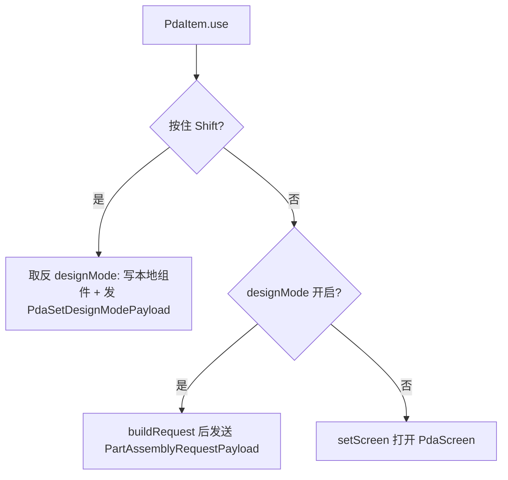
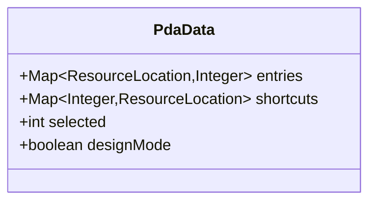
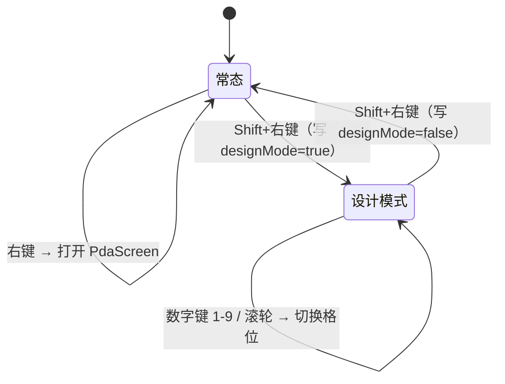
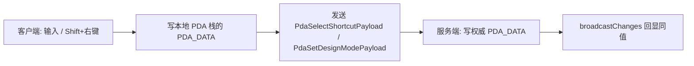
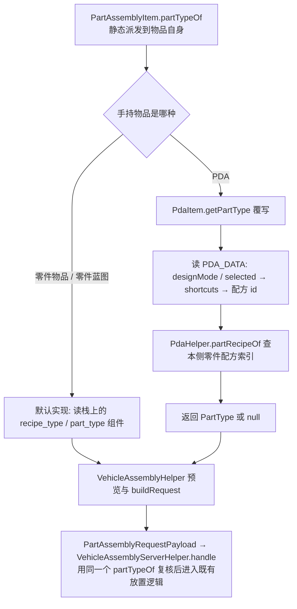

# PDA 蓝图终端：详细设计文档

**文档状态**：设计中（未实施）
**适用版本**：NeoForge 1.21.1 · Machine-Max 1.0.3-beta.6
**编写日期**：2026-09-27

## 0. 本文自包含

阅读本文不需要预先阅读任何其他文档、代码或历史讨论。本文完整描述一个尚未实施的新功能——**PDA 蓝图终端**。第 2 章给出该功能所依赖的现存代码基线及其位置，第 3~8 章给出完整设计，第 9 章给出改动清单。文中出现的"现状"一律指第 2 章描述的代码状态，不指任何历史版本。

配套产物：

| 产物 | 位置 | 用途 |
| --- | --- | --- |
| 接口设计文档 | `docs/PDA蓝图终端-接口设计文档.md` | 类名、方法签名、数据组件、网络包、语言键的精确契约 |
| 静态原型 | `src/main/resources/assets/apricityui/apricity/machine_max/pda/pda_ui_prototype.html` + `pda_ui.css` | 管理界面的外观与绑定交互记录 |
| 实施页 | `src/main/resources/assets/apricityui/apricity/machine_max/pda/pda_ui.html` | 管理界面的真实页面骨架 |
| HUD 原型 | `src/main/resources/assets/apricityui/apricity/machine_max/pda/pda_hotbar_prototype.html` + `pda_hotbar.css` | 设计模式替代快捷栏的外观记录 |
| HUD 实施页 | `src/main/resources/assets/apricityui/apricity/machine_max/pda/pda_hotbar.html` | 替代快捷栏的真实页面骨架 |

## 1. 术语

| 术语 | 含义 |
| --- | --- |
| 制造配方 | 定义"一组原料 → 一个产物 + 耗时"的配方 |
| 零件配方 | 产物是零件的制造配方，除制造机外还参与手动焊接组装与拆卸 |
| 通用制造配方 | 产物不是零件的制造配方，只在制造机中加工 |
| 制造蓝图物品 | 生存模式下代表某个制造配方的蓝图物品，由研究台发放、可被玩家持有 |
| 零件制造蓝图 | 零件配方对应的蓝图物品，可放置为未组装零件、可参与装配 |
| 通用制造蓝图 | 通用制造配方对应的蓝图物品，只有凭证与展示语义 |
| 蓝图条目（条目） | PDA 内部记录的一条已收纳蓝图，即 `entries` 中的一对「配方 id → 残留次数」；不是独立类型 |
| 条目类别 | 条目的派生属性：配方是零件配方则为"零件"，否则为"通用"；不由 PDA 存储 |
| 配方索引 | 本侧（客户端与服务端各一份）的"配方 id → 配方"映射，由装载期构建，统一经 `MMDynamicRes.getAllFabricating(Level)` 访问 |
| 残留次数 | 条目的剩余可使用次数，`-1` 表示无限 |
| 设计模式快捷栏 | PDA 内置的 9 格蓝图选择器，格位序号 0~8 |
| 设计模式 | PDA 的一种状态（存在 `PDA_DATA.designMode`）：开启时右键按当前格位的条目放置零件 |
| 当前格位 | PDA 的选中格位（存在 `PDA_DATA.selected`），取值域 0~8 |
| 常态 | 设计模式之外的状态 |
| 零件来源 | 一次放置请求所依据的零件；由手持物品提供——零件物品与零件蓝图读自身组件，PDA 读当前格位绑定的条目 |
| 装配侧 | 焊枪组装/拆卸、撬棍拆除、装配 HUD、装配门禁这一组读配方的地方 |
| 装配资格 | 玩家是否有权推进某个零件的装配，判据集合见第 7 章 |
| 装载期 | 收集配方与零件数据并建立索引的阶段 |

## 2. 现状（基线）

### 2.1 两种被收纳的蓝图物品

| 物品类 | 绝对路径 | 组件 | 能否放置零件 |
| --- | --- | --- | --- |
| `PartFabricatingBlueprintItem` | `common/item/prop/PartFabricatingBlueprintItem.java` | `RECIPE_TYPE` + `PART_TYPE` | 能，实现 `PartAssemblyItem` |
| `FabricatingBlueprintItem` | `common/item/prop/FabricatingBlueprintItem.java` | `RECIPE_TYPE` | 不能，只有凭证与展示语义 |

两种类各自对应的物品 id 为 `machine_max:part_fabricating_blueprint` 与 `machine_max:fabricating_blueprint`；类层次上 `PartFabricatingBlueprintItem extends FabricatingBlueprintItem`，因此判定顺序必须先判子类。

蓝图物品的身份完全由数据组件决定，物品本身没有额外状态：

- 零件制造蓝图：`part_type` 组件即零件类型注册名，见 `PartAssemblyItem.getPartType(ItemStack, Level)`（`common/item/prop/PartAssemblyItem.java`，第 36~46 行）。
- 通用制造蓝图：`recipe_type` 组件指向配方 id，见 `FabricatingBlueprintItem.getProductName(ItemStack)`（同目录，第 56~65 行）。
- **`part_type` 不是独立信息**：零件配方 id 的 path 形如 `part_fabricating/[子目录/]零件名`，零件 id 由它唯一推导（`PartFabricatingRecipe.partTypeFromRecipeId(ResourceLocation)`，`common/recipe/PartFabricatingRecipe.java`，第 174~187 行）；索引构建期再把同一个零件 id 注入配方实例（`setResolvedProduct`，第 156~171 行）。两处同值，因此 `recipe_type`（配方 id）是蓝图身份的唯一权威，`part_type` 只是它的派生物。这是 4.2"条目只存配方 id"的现状依据。

**蓝图物品在放置零件时不被消耗**。`VehicleAssemblyServerHelper.finishPlacement(...)` 只对 `PartItem` 消耗物品；蓝图与 PDA 不消耗，三者都得到同一份放置音效反馈，但 `ParticleTypes.PORTAL` 粒子只随零件物品发出。

### 2.2 零件放置链路上的两处"手持解析"

放置零件由"客户端装配助手构造请求 → 网络包 → 服务端权威处理"三段组成，其中有两处直接从手持物品解析零件类型：

1. **客户端预览**：`VehicleAssemblyHelper.onClientTick(ClientTickEvent.Pre)`（`common/mech/vehicle/VehicleAssemblyHelper.java`，第 85~117 行）按"主手优先、副手兜底"的顺序找出 `instanceof PartAssemblyItem` 的物品栈，再调用 `PartAssemblyItem.getPartType(stack, level)` 得到当前预览的零件类型。变体自动过滤、连接点循环、安装角等状态都挂在这个解析结果上。
2. **服务端校验**：`VehicleAssemblyServerHelper.handle(Player, PartAssemblyRequestPayload)`（同目录，第 53~94 行）先校验"手持物品解析出的 `PartType` 与请求里的 `registryKey` 一致"，通过后才走 `tryBlueprintIntent` / `attachToTarget` / `placeInAir`。

请求载荷是 `PartAssemblyRequestPayload`（`network/payload/assembly/PartAssemblyRequestPayload.java`），字段包含 `registryKey`、`variant`、`subPart`、`connector`、`hand`、`attachToTarget`、`targetSubPartId`、`targetConnector`、`attachRotation`。

此外，"手持栈 → 零件类型"的翻译只有一个入口：`PartAssemblyItem` 的两个静态方法 `getPartType(ItemStack, Level)` 与 `getRecipeHolder(ItemStack, Level)`（`common/item/prop/PartAssemblyItem.java`，第 36~46 行、第 55~69 行）。两者都按物品栈上的组件解析，全仓库共 5 个调用点：`PartItem` 内 2 处（第 179、196 行）、`VehicleAssemblyHelper.onClientTick`（第 107 行）、`VehicleAssemblyHelper.buildRequest`（第 300 行）、`VehicleAssemblyServerHelper.handle`（第 57 行）。第 6 章把这组入口改为可覆写的实例方法，使 PDA 能以自己的方式回答同一个问题。

### 2.3 装配资格门禁

`BlueprintAttachment`（`common/attachment/BlueprintAttachment.java`）是玩家科研与装配资格的权威载体，注册为不带任何同步的实体附件之外的可持久化附件（`copyOnDeath = true`）。与本设计相关的三个方法：

- `canAdvanceAssembly(Player, Part)`（第 384~393 行）：判定顺序为"创造模式放行 → 无零件配方放行 → 该零件的研发条目已完成 → 背包中持有对应的零件制造蓝图"。
- `rebuildAvailableRecipes(Player)`（第 443~454 行）：重建 `availableRecipes` 索引。它遍历 `player.getInventory().items`，对每个物品调用 `checkAndRecord`；`checkAndRecord`（第 465~471 行）只接受 `PartFabricatingBlueprintItem`，并以 `part_type` 组件为键写入索引。该方法末尾留有一处 TODO，原文为：

  > `// TODO: 蓝图库检查——计划中的蓝图收纳道具（统一存放玩家的制造蓝图，避免背包被蓝图塞满），实现后需在此扫描该道具内保存的附件信息并一并录入可用配方`

- `hashInventory(Player)`（第 473~479 行）：索引的重建由背包哈希变化驱动，哈希基于 `ItemStack.hashItemAndComponents(stack)`；守卫 `isDirty()` 由 `@Getter` 从字段 `dirty`（第 62~63 行）生成，`rebuildAvailableRecipes` 结束时把新哈希写回该字段。

### 2.4 现存的研究平板与 AUI 界面范式

`PadItem`（`common/item/prop/PadItem.java`）是一个 `stacksTo(1)` 的物品，`use()` 在服务端向玩家发送 `ResearchScreenOpenPayload` 以打开研究台界面。它在 `common/registry/MMItems.kt` 中的注册代码处于注释状态，物品 id 为 `pad`。

界面框架方面，项目使用 ApricityUI（下称 AUI）：

- 纯 UI 屏基类为 `com.sighs.apricityui.screen.ApricityScreen extends Screen`，页面由 AUI 从 HTML 模板创建。`BlueprintResearchScreen`（`client/render/gui/screen/BlueprintResearchScreen.java`）即此类，其模式为"Java 侧拼 HTML 片段 → `Element.setInnerHTML` 写入容器 → `Element.addEventListener` 挂 Java 监听"，见该文件第 308~338 行。
- AUI 另有基于 `AbstractContainerScreen` 的容器屏（`ApricityContainerScreen` + `ApricityContainerMenu`），可承载真实物品槽位；它的非玩家容器只支持 `player` / `saveddata` / `blockEntity` / `entity` 四种绑定，公开 API 不提供自定义容器数据源。

HTML 模板资源放在 `src/main/resources/assets/apricityui/apricity/` 下，按功能分子目录组织（`machine_max/research/`、`machine_max/vehicle_control/`、`machine_max/pda/`），逻辑路径即相对该根目录的路径，例如研究台页面的逻辑路径为 `machine_max/research/research_ui.html`。

### 2.5 既有的原版输入拦截手段

`RawInputHandler`（`client/input/RawInputHandler.java`）在炮镜模式下已经实现了两类原版输入拦截，是本设计所需输入拦截的现成先例，且在同一代码库中运行：

- `handleMouseScrollInputs(InputEvent.MouseScrollingEvent)`（第 263~289 行）：炮镜模式下调用 `event.setCanceled(true)`（第 268 行），阻止原版滚轮切换快捷栏格；手持 `PartAssemblyItem` 且按住 Alt 时调用 `cycleAttachAngle` 旋转安装角（第 277~288 行），该分支不检查事件是否已被取消；
- `handleVanillaInputs(InputEvent.Key)`（第 562~602 行）：炮镜模式下对 `Minecraft.getInstance().options.keyHotbarSlots[i]` 逐个调用 `consumeClick()` 与 `setDown(false)`（第 594~599 行），阻止原版数字键切换快捷栏格；同一方法还对移动键、背包键、丢弃键、副手交换键做了同样的消化。

拦截能生效的原理：原版 `Minecraft.handleKeybinds()` 以 `consumeClick()` 读取热栏切换意图，而 `InputEvent.Key` 在同一帧内先于它执行，先消费掉 click 即可让原版取不到。

### 2.6 既有的 HUD 拦截与 AUI 叠层机制

**取消原版 HUD 图层**：HUD 的注册与拦截中枢是 `MMGuiManager`（`client/render/gui/MMGuiManager.java`）。

- `registerHud(RegisterGuiLayersEvent)`（第 49 行）用 `registerAboveAll` 依次注册 5 个 `LayeredDraw.Layer`；
- `renderHudEvent(RenderGuiLayerEvent.Pre)`（第 131~149 行）逐层拦截，其中第 144~148 行在座椅不允许使用物品时取消快捷栏图层，即 `if (event.getName() == VanillaGuiLayers.HOTBAR) event.setCanceled(true);`。

也就是说，"取消原版快捷栏"在同一代码库中已有实现，手段是 `RenderGuiLayerEvent.Pre` + `setCanceled(true)`，不需要 Mixin。`RegisterGuiLayersEvent` 只提供 `registerBelowAll` / `registerBelow` / `registerAbove` / `registerAboveAll` 四个注册方法，且禁止注册重名图层，因此"替换快捷栏"由"取消原图层"与"另行绘制替代内容"两件事合成，无法覆盖同名图层。

**AUI 的 HUD 叠层**：AUI 把不依附任何 Minecraft Screen 的 Document 称为 Overlay Document（文档见 AUI 仓库 `docs/guide/overlay-document.md`）。

- 客户端调用 `ApricityUI.createDocument(path)` 创建并注册；
- AUI 自身的 `Client.drawOverlay(RenderGuiEvent.Post)`（AUI 仓库 `targets/neoforge-1.21.1/` 下 `client/Client.java`，第 221~249 行）在 `Minecraft.getInstance().screen == null` 且玩家未按 F1 隐藏 HUD 时，逐帧绘制所有非 `inWorld`、非 `manuallyRendered` 的 Document；
- 绘制时机是 `RenderGuiEvent.Post`，即所有 `LayeredDraw` 图层之后，因此叠层天然位于原版 HUD 之上；
- 该文档给出的 HUD 用法是"普通 Overlay，不开持久化：打开背包自动隐藏，关掉自动回来"。

## 3. 设计目标

| 目标 | 说明 |
| --- | --- |
| G1 | 集中收纳零件制造蓝图与通用制造蓝图，使玩家不必在背包中常驻大量蓝图物品 |
| G2 | 收纳后的蓝图对"使用"完全等价：在 PDA 上选中某条目后放置零件，与直接使用对应蓝图物品的效果一致 |
| G3 | 收纳后的蓝图对"装配资格"完全等价：PDA 放在背包中即计入该蓝图对应的装配资格 |
| G4 | 收纳不可逆：存入 PDA 的蓝图不提供还原为物品的途径，避免"复制蓝图"漏洞 |
| G5 | 收纳无副作用地支持未来的有限次蓝图 |

非目标（明确不做）：

- 不收纳空白蓝图、整机蓝图（`VehicleBlueprintItem`）、装配体收纳物（`AssemblyItem`）。
- 不提供从 PDA 取出蓝图或还原为物品的任何途径。
- 不接管研究台功能；研究台仍只由 `ResearchTableBlock` 打开。
- 不为 PDA 数据提供死亡保护；PDA 是普通物品，会因死亡掉落、可放入容器、可交易。
- 不实现通用制造蓝图的"使用"行为；这类条目只能收纳与展示。

## 4. 物品与数据模型

### 4.1 物品

物品类为 `PdaItem extends Item implements PartAssemblyItem`（`common/item/prop/PdaItem.java`），注册为物品 id `machine_max:pda`，`Properties().stacksTo(1)`。它承担蓝图收纳，并作为零件来源参与装配；不向玩家发送 `ResearchScreenOpenPayload`。

`use(Level, Player, InteractionHand)` 的行为分派（客户端；服务端不做任何事）：



设计模式不限制 PDA 位于哪一只手；两个状态字段的存放与写入约定见 5.3，格位切换与原版输入拦截见 5.2，`getPartType` 的覆写见第 6 章。

放置预览由两部分合成：预览模型的创建与替换在渲染器（`PartAssemblyRenderer`，按 `PartAssemblyItem.partTypeOf` 的结果决定是否构造、构造哪个变体）；**姿态对齐与瞄准提示在装配助手**——`VehicleAssemblyHelper.onClientTick` 每 tick 在解析出手持物品后调用 `updatePreview`（`common/mech/vehicle/VehicleAssemblyHelper.java`，第 155~219 行），按"瞄准可用连接点 → 对齐到该连接点""否则 → 对齐到视线落点"两种情形摆放模型，并把结果写入动作栏提示。该解析与变体过滤、放置请求用的是同一份"主手优先、副手兜底"结果，因此 PDA、零件物品、零件制造蓝图共用同一条预览路径，预览姿态的更新对象与后端物品始终一致。"填组装进度"的对齐只属于零件物品（服务端只对零件物品走该分支），由 `canFillAssemblyProgress` 按物品类型门控（同文件，第 234~248 行）。

### 4.2 数据模型

PDA 的全部状态存在物品的数据组件里，随物品走：放入容器、丢弃、交易、死亡掉落都自然带上。



- `entries` 是"配方 id → 残留次数"的**有序**映射（`SortedMap`，实现为 `TreeMap`）。配方 id 与蓝图物品的 `recipe_type` 组件同值，它同时就是条目的唯一标识——键唯一与定序都由映射结构保证，不需要额外的不变量、不需要去重步骤，渲染端也不需要排序。
- 定序器是一个显式比较器："配方 id 的字符串序"（`Comparator.comparing(ResourceLocation::toString)`），不依赖 `ResourceLocation` 自身的比较规则。字符串序跨版本与跨侧都稳定，这是 8.4 签名比较成立的前提。
- `shortcuts` 是稀疏映射，键为格位序号 0~8，值为该格位绑定的条目的配方 id；键不存在表示该格位为空。限制键域为 0~8 是数据组件的不变量。它不需要定序：消费方一律按格位序号取值。
- `selected` 是当前格位序号（域 0~8），`designMode` 是设计模式开关。两者是**物品状态**：随数据组件持久化并随网络同步，重登、换维度、丢弃、交易、死亡掉落都自然带上，两端读到同一份值。把它们放在这里而不是客户端字段，正是为了"谁能提供零件来源"这个问题两端能给出同一个答案（第 6 章）。
- `entries` 的值 `-1` 表示无限。当前所有蓝图物品都是无限次，因此新录入的条目恒为 `-1`。
- 数据组件是 `PDA_DATA`，同时声明 `persistent` 与 `networkSynchronized`：前者让四个字段落盘，后者让服务端的权威副本到达客户端。

**条目不是独立类型，就是 `entries` 的一个键值对**。不采用"条目列表"承载：条目去掉类别后只剩"配方 id + 次数"两个字段，用列表装它就要额外维持"键在列表内唯一"这条人工不变量（读入时还得去重合并），而映射的键唯一性是结构性的；顺序也无需在存储层约定。

**不采用"`LinkedHashMap` + 构造后重排"**：产出 `PdaData` 的路径不止编解码一处——`mergeEntry`（存入新配方就是把键追加到末尾）与 `withoutEntry` 同样产出新实例，重排只要漏在一处，迭代顺序就会静默退化成插入序，而症状（列表次序跳动、签名比较频繁失配）很难溯源。把有序性交给映射类型本身，插入即定位，任何路径都无法漏排。代价是"顺序"成为数据契约的一部分：将来若要改展示次序（例如"最近存入在前"），得改数据模型，或在渲染端对副本另行排序。

**条目不存放类别，也不单独存放零件 id**，两者都从配方 id 反查：

| 需要的信息 | 反查方式 | 失效条件 |
| --- | --- | --- |
| 配方 | `MMDynamicRes.getAllFabricating(level).get(recipeId)` | 配方被移除、或装载期校验未通过 → `null` |
| 条目类别 | 上一步结果 `instanceof PartFabricatingRecipe` 即"零件"，否则"通用" | 配方为 `null` 时两者都不是，条目降级为不可用 |
| 零件 id | `PartFabricatingRecipe.getPartType()`（索引构建期已由 `partTypeFromRecipeId(recipeId)` 注入，与配方 id 同源） | 非零件配方时无此项 |

不存这两项的理由：它们与配方 id 是同一个事实的另外两份拷贝，一旦蓝图组件被改写、或配方被数据包替换，拷贝就会与索引失配且无法自愈；只留配方 id 时失配只有一个方向——查不到，据此降级即可（见 4.3 与 10）。反查一律走 `MMDynamicRes` 的本侧索引，不查 `RecipeManager`：这与装配侧既有约定一致（`PartAssemblyItem` 的类注释写明"配方解析一律走本侧零件配方索引，不查 `RecipeManager`"）。

### 4.3 存入规则

对玩家背包中的每一个蓝图物品，先归一为配方 id，再按下表并入。归一顺序与 `PartAssemblyItem.getRecipeHolder(ItemStack, Level)`（`common/item/prop/PartAssemblyItem.java`，第 55~69 行）一致：

1. 有 `part_type` 组件 → 经 `MMDynamicRes.getPartRecipe(level, partType)` 取该配方的 `holder.id()`；
2. 无 `part_type` 但有 `recipe_type` 组件 → 取其值；
3. 两者都取不到 → 不可存入，蓝图留在背包。

归一完成后：

| PDA 中的现状 | 传入蓝图 | 动作 | 结果 |
| --- | --- | --- | --- |
| 无该配方 | 任意 | 新增条目 | `uses = 传入蓝图的次数` |
| 已有，`uses == -1` | 任意 | **拒绝** | 提示"已收纳"，蓝图留在背包 |
| 已有，`uses > 0` | 有限次数 | 累加 | `uses += 传入蓝图的次数` |
| 已有，`uses > 0` | 无限（`-1`） | 升级 | `uses = -1` |

"传入蓝图的次数"取自蓝图物品自身的次数数据；蓝图物品当前不以任何组件承载次数，故该项恒为 `-1`。这一列留给未来的有限次蓝图（届时蓝图物品多一个次数组件，存入路径多取一次该组件即可）。

存入成功的每一张蓝图都从背包中**移除原件**。存入不可逆。

已录入的配方若此后从本侧索引中消失（数据包替换、装载期校验失败），条目**保留但不删除**：列表把它显示为"未知蓝图"，不能作为当前格位的零件来源，也不参与装配门禁。这样数据包回滚或修复后条目可自动恢复可用，不会造成玩家数据永久损失。

## 5. 交互模型

### 5.1 状态与操作



| 状态 | 操作 | 效果 |
| --- | --- | --- |
| 常态 | 右键 | 客户端打开 `PdaScreen` |
| 常态 | Shift + 右键 | 写入 `designMode = true` |
| 设计模式 | 右键 | 以当前格位的条目作为零件来源，走既有放置链路 |
| 设计模式 | Shift + 右键 | 写入 `designMode = false` |
| 设计模式 | 数字键 1-9 / 滚轮 | 切换当前格位，原版热栏切换被屏蔽 |

"常态"与"设计模式"不是两个外部状态机，而是 `PDA_DATA.designMode` 的两种取值；表里的"进入 / 退出"就是对这一个字段的写入（写入约定见 5.3）。

常态下右键不给提示语失败反馈以外的任何副作用；设计模式下若当前格位为空，或绑定的条目不是零件配方（通用条目，或配方已从索引中失效），右键均不放置，只给出对应的提示。

### 5.2 格位选择与原版输入拦截

格位序号是 `PDA_DATA.selected`，取值 0~8，与 `Player.getInventory().selected` 无关。玩家用两组原生输入切换它，这两组输入对原版的"切换物品栏格"效果同时被屏蔽：

| 输入 | 设计模式下的行为 | 屏蔽方式 |
| --- | --- | --- |
| 滚轮上/下 | 当前格位 -1 / +1（与原版热栏同向：上滚取前一格），越界环绕；写本地组件并发送 `PdaSelectShortcutPayload` | `InputEvent.MouseScrollingEvent` 中 `event.setCanceled(true)` |
| 数字键 1-9 | 直接选中对应格位；写本地组件并发送 `PdaSelectShortcutPayload` | `InputEvent.Key` 中对 `Minecraft.getInstance().options.keyHotbarSlots[i]` 调用 `consumeClick()` 与 `setDown(false)` |

两个拦截共用同一条件：**手持 PDA 且该 PDA 的 `designMode == true`、且当前没有打开任何界面**。条件不满足时不得触碰任何原版输入状态。

滚轮不占用 Alt 组合：按住 Alt 时切格位不发生，安装角旋转沿用既有行为（`RawInputHandler` 的 Alt 分支，见 2.5）；两种情形都取消滚轮事件，否则原版热栏切换会与格位切换同时发生。

因为原版热栏切换被吞掉，设计模式下 `Player.getInventory().selected` 保持不变，PDA 位于任一只手都能正常切格位；退出设计模式后滚轮与数字键立即恢复原版行为。

设计模式下只拦截滚轮与数字键 1-9；移动、背包、丢弃、副手交换等按键保持原版行为。

拦截手段所依据的既有实现见 2.5。

### 5.3 状态归属与写入路径

设计模式开关（`designMode`）与当前格位（`selected`）是 `PDA_DATA` 的两个字段，因此它们是**物品状态**：随物品持久化、随网络同步，两端读到同一份值。服务端不解释"模式"的含义，它只需要在处理放置请求时读到同一份数据（第 6 章）。

| 候选载体 | 取舍 |
| --- | --- |
| `PDA_DATA`（采用） | "能提供零件来源"这个问题在客户端与服务端必须得到同一个答案，而 `PartAssemblyItem.getPartType(ItemStack, Level)` 的入参只有物品栈与 `Level`——状态放在栈上，覆写才能回答它。它同时随物品走，重登、换维度、丢弃、交易都不需要额外处理 |
| 客户端静态/实例字段 | `getPartType` 在服务端也会被调用（`VehicleAssemblyServerHelper.handle` 与 `buildRequest` 的校验，见 2.2），客户端字段在服务端不存在；若为此再加一层请求参数，同一个问题就有了两个答案 |
| 实体附件 | 项目现有的 `CONTROL_PREFERENCE` 与 `BLUEPRINT` 附件承载玩家偏好与科研/装配资格；本状态是"这个 PDA 当前指向哪个条目"，语义归属物品而非玩家，且服务端要能读到 |

写入路径：客户端是**预写方**，服务端是权威。两侧都只经 `PdaData.withSelected(int)` / `withDesignMode(boolean)` 构造目标值，保证写进去的内容相同。



| 写入方 | 字段 | 载荷 |
| --- | --- | --- |
| `PdaItem.use` 的 Shift 分支 | `designMode` | `PdaSetDesignModePayload` |
| `PdaInputInterceptor` 的滚轮与数字键 | `selected` | `PdaSelectShortcutPayload` |
| `PdaScreen` 的格位交互 | 不写这两个字段，只写 `shortcuts` | `PdaBindShortcutPayload` |

预写只用于 `selected` 与 `designMode`：`entries` 与 `shortcuts` 的合并与校验规则（4.3、第 7 章）只在服务端执行，客户端等服务端回显。

**设计模式不需要与"是否手持 PDA"做一致性维护**：标志位长在 PDA 自己身上，PDA 不在手时它不产生任何效果——`onClientTick` 找不到提供零件来源的手持物品，`PdaItem.getPartType` 也不会被问到。因此不存在"设计模式已开启但主副手都没有 PDA"的状态，不需要每 tick 判定，也不需要枚举"切格、丢弃、死亡掉落、塞进容器"这些丢失途径。

进出设计模式的入口只有 `PdaItem.use` 的 Shift+右键一处（见 4.1），格位切换的入口只有 5.2 的拦截器一处。

## 6. 零件来源的统一解析

这是"用 PDA"与"用蓝图"完全等价的实现手段：两者都经同一个入口回答"本次放置的是哪个零件"。



改造点：

- **接口**：`PartAssemblyItem.getPartType` 由静态方法改为可覆写的实例方法，原静态方法体成为默认实现；新增静态派发器 `partTypeOf(ItemStack, Level)`，非 `PartAssemblyItem` 返回 `null`。既有的 5 个调用点（2.2 列出）改用它。
- **PDA 覆写**：`PdaItem.getPartType` 读 `PDA_DATA.selected` → `shortcuts` 取配方 id → 经本侧索引取该零件配方的 `getPartType()`。设计模式关闭、格位为空、条目不是零件配方三种情形都返回 `null`。
- **客户端**：`VehicleAssemblyHelper.onClientTick` 与 `buildRequest` 不新增分支——`instanceof PartAssemblyItem` 已匹配 PDA，解析由覆写完成；`buildRequest` 内部"本地状态与手持物品一致"的判定因此对 PDA 天然成立。
- **预览姿态**：预览模型的姿态对齐（瞄准连接点或视线落点）与瞄准提示由 `VehicleAssemblyHelper.updatePreview` 承担，`onClientTick` 每 tick 调用它；预览模型本身的创建与替换由 `PartAssemblyRenderer` 按 `partTypeOf` 的结果完成。PDA 不需要任何专属代码——三种手持物品（PDA、零件物品、零件制造蓝图）共用同一条预览路径（4.1）。
- **服务端**：`VehicleAssemblyServerHelper.handle` 同样不新增分支；它用 `partTypeOf` 从自己的 PDA 副本解析 `heldType`，与请求的 `registryKey` 比对。

放置请求不携带格位序号；`PdaItem.getPartType` 只返回零件类型，不产出也不修改任何物品栈，因此天然满足 G4 的"不可逆"。

## 7. 装配资格门禁接入

PDA 放在背包中（不要求手持）即计入其收纳的零件制造蓝图所提供的装配资格，与背包中的蓝图物品行为一致。

接入点是 `BlueprintAttachment.rebuildAvailableRecipes`：在遍历 `player.getInventory().items` 的循环中，对 `PdaItem` 追加一次扫描——取其 `PDA_DATA` 组件，对 `entries` 的每一项（配方 id → 次数）做一次与 `checkAndRecord` 等价的写入：以该项的键查本侧索引，仅当结果是零件配方且零件 id 非空时，把**零件 id**（不是配方 id）作为键写入 `availableRecipes`（该索引是"零件 id → 零件配方"，与 `checkAndRecord` 的既有键一致）。通用配方与失效配方不入索引。

索引失效无需额外处理：`hashInventory` 已基于 `ItemStack.hashItemAndComponents`，PDA 组件内容变化会改变背包哈希，从而触发 `rebuildAvailableRecipes` 重建。PDA 位于主背包时，切格或开关设计模式也会写入 `selected` / `designMode`，因此同样会改变哈希并触发一次重建——重建是遍历 36 格的定长开销，属预期行为。

## 8. 界面设计

### 8.1 技术选型

界面为单个 `PdaScreen extends ApricityScreen`，即与研究台同构的纯 UI 屏。**不采用 AUI 容器屏**，原因是本设计的存入交互（8.2）不需要真实物品槽位：可存入的蓝图由界面主动扫描背包后列出，玩家点击条目上的按钮完成存入，而不是把物品拖进槽位。

### 8.2 布局

```
┌────────────────────────────────────────────────────────────┐
│ 标题栏  蓝图终端            已收纳 12 项 · 无限 10 · 有限 2  │
├────────────────────────────────────────────────────────────┤
│ 设计模式快捷栏     [1][2][3][4][5][6][7][8][9]              │
├───────────────────────────┬────────────────────────────────┤
│ 已收纳                     │ 背包中的蓝图      [一键存入全部]│
│ ▸ 零件 Sd.Kfz.234车体   ∞  │ 零件 Sd.Kfz.234炮塔      存入  │
│ ▸ 零件 Sd.Kfz.234炮塔   ∞  │ 零件 K-17车体          已收纳  │
│ ▸ 零件 Sd.Kfz.234车轮   ∞  │ 通用 钢制板材配方     合并+1  │
├───────────────────────────┴────────────────────────────────┤
│ 提示栏  已选中「Sd.Kfz.234炮塔」，请点击快捷栏位以完成绑定    │
└────────────────────────────────────────────────────────────┘
```

三个区块：

1. **设计模式快捷栏**：9 个格位，格位内显示该格绑定条目的图标；空格位留空。格位角标显示序号 1~9。
2. **已收纳**：按 `entries` 的迭代顺序渲染（该顺序由数据模型保证：配方 id 字符串序，见 4.2；渲染端不排序），每条按配方 id 经本侧索引反查——是零件配方则显示图标与"零件"前缀，通用配方显示"通用"前缀，反查不到则显示"未知蓝图"并置灰。图标、名称与残留次数（`∞` 或数字）同排。
3. **背包中的蓝图**：扫描 `player.getInventory().items` 得到的蓝图列表，每行右侧按 4.3 的规则给出按钮——可存入显示`存入`；已收纳且无限显示置灰的`已收纳`；已收纳且有限显示`合并 (+N)`。区块标题栏右侧为`一键存入全部`。

### 8.3 绑定交互

绑定操作的两步顺序为**先选条目，再选格位**：

1. 在"已收纳"列表点击一个条目 → 该条目进入"待绑定"高亮态，提示栏显示"已选中「名称」，请点击快捷栏位以完成绑定"。
2. 点击某个格位 → 把该条目写入 `shortcuts[格位]`，覆盖原有绑定，条目退出待绑定态。

本设计同时支持反向操作以兼容习惯：先点格位使其进入"待绑定格位"态，再点条目即绑定到该格位。

解绑：已绑定的格位上显示一个小角标按钮，点击即清除该格位的绑定。

界面里的格位点击只改 `shortcuts`（绑定 / 解绑），不改 `selected`：当前格位只由 5.2 的拦截器切换。绑定与解绑都由服务端执行后回显（见 5.3），界面本身不做预写。

### 8.4 数据刷新

页面在 `tick()` 里比对一段签名（`entries` 内容、`shortcuts` 内容、`selected`、`designMode`、背包蓝图集合）决定是否重建列表 DOM，模式与研究台的 `researchSignature` 一致。所有会改变 PDA 数据的操作（存入、绑定、解绑）都发往服务端执行，由服务端改写数据组件后触发物品同步，客户端据签名变化重建界面。

`selected` 与 `designMode` 由客户端预写（5.3），这两个字段的变化立即反映在签名上，不依赖服务端回显；`entries` 与 `shortcuts` 的变化仍以服务端回显为准。

### 8.5 设计模式快捷栏的 HUD 渲染

设计模式下原版快捷栏的内容（玩家热栏的 9 格物品）与格位语义已经脱钩：格位由数字键与滚轮选择，而热栏选中序号保持不变。继续显示原版快捷栏会误导玩家，因此把它整体替换为一条蓝图选择条。

**取消原版**：在 `MMGuiManager.renderHudEvent(RenderGuiLayerEvent.Pre)` 已有的拦截逻辑中追加一个条件——手持 PDA 的 `designMode` 为 true 时，命中的图层名为 `VanillaGuiLayers.HOTBAR` 即取消。手段与该文件既有的座椅分支一致，不引入 Mixin。取消 `VanillaGuiLayers.HOTBAR` 同时去掉了原版的选中物品名提示层，替代栏自带的蓝图名正好补位。

**绘制替代**：替代内容是一个 AUI Overlay Document（页面 `machine_max/pda/pda_hotbar.html`，样式 `pda_hotbar.css`，由 `PdaHotbarOverlay` 管理）。选它而不是注册 `LayeredDraw.Layer` 的理由是本设计已经依赖 AUI，而 AUI 的 Overlay 自带：

- 无 Screen 时逐帧自动绘制，打开任意界面时自动隐藏，玩家按 F1 隐藏 HUD 时同步隐藏；
- 绘制时机在所有 `LayeredDraw` 图层之后，天然盖住原版 HUD 的同区域；
- 页面结构与样式用 HTML/CSS 描述，与 `pda_ui.html` 共用同一套写法与资源加载路径。

**外观与占位**：

| 项 | 约定 |
| --- | --- |
| 位置 | 屏幕底部居中，与原版快捷栏占用同一区域 |
| 格位 | 9 格，格边长 20px、格间距 1px；与原版快捷栏同尺寸，因此上方的经验条、下方的生命与饥饿条都不需要额外处理 |
| 选中态 | 当前格位用白色描边加提亮底色标出，对应原版快捷栏的选中高亮 |
| 格位内容 | 该格绑定的条目图标，经 AUI 的纹理元素绘制（与研发界面同范式，Java 只写其 `src`）；未绑定的格位留空并弱化描边，序号保留 |
| 不可用格位 | 绑定的条目不是零件配方（通用配方，或配方已从索引中失效）的格位，序号改用琥珀色，提示该条目不可放置 |
| 上方文字 | 一行选中蓝图名，位置相当于原版快捷栏上方的物品名提示 |
| 左上角横幅 | 黑底 + 左侧一条橙竖线的扁平色块（橙取研发/制造菜单的 `#FF6400`），逐行写明「设计模式」「右键 放置零件」「潜行键 + 右键 退出」。位置取左上角，因为原版 HUD 该处本就为空（聊天在左下，状态效果与吐司弹窗在右上），不会与任何原版元素相撞。文案经 `<translation>` 元素取语言键（静态），Java 不写入；横幅的显隐随叠层一同受 `designMode` 控制 |

**显隐与生命周期**：与 PDA 的 `designMode` 同步——为 true 时创建并显示，为 false 或没有手持 PDA 时置为不可见但不销毁（不可见由文档根元素上的 `pda-hotbar-hidden` 类实现），断开连接时销毁。刷新与清理的时机由 `PdaHotbarOverlay` 自身的两个事件处理器承担（`ClientTickEvent.Post` 调刷新、`ClientPlayerNetworkEvent.LoggingOut` 调清理）。页面刻意不声明 `aui-mouse-events=intercept`，HUD 不参与任何输入，滚轮与数字键由 5.2 的拦截器独占。

**未采用的方案**：

- 用 `RegisterGuiLayersEvent` 覆盖同名图层——该事件只提供四种注册方法且禁止重名，无法覆盖 `minecraft:hotbar`；
- Mixin 进原版 `Gui` 的快捷栏渲染点——项目当前没有任何针对 `Gui` 的 Mixin，而取消图层已能达成同一效果；
- 常开透明 Screen——会抢占输入焦点，需要自行转发事件，得不偿失。

## 9. 改动清单

| 文件 | 改动 |
| --- | --- |
| `common/item/prop/PadItem.java` | 重命名为 `PdaItem.java`：删除开研究台逻辑，`implements PartAssemblyItem` 并覆写 `getPartType`，实现 4.1 的 `use` 分派（第 6 章） |
| `common/item/prop/PdaData.java`（新增） | 4.2 的数据模型与 CODEC，含 `selected` / `designMode` 与收口用的 `sanitized()` |
| `common/item/prop/PdaHelper.java`（新增） | 数据组件读写（`getData` / `setData`）、`selectedRecipe` / `getShortcut` / `heldPdaHand`、配方反查（`recipeOf` / `partRecipeOf`）、条目归一（`recipeIdOf`） |
| `common/item/prop/PdaDepositService.java`（新增） | 四个服务端写入方法：`deposit`、`bindShortcut`、`selectShortcut`、`setDesignMode`，每个都写组件并触发物品同步 |
| `common/item/prop/PartAssemblyItem.java` | `getPartType` 改为 `default` 实例方法，新增静态派发器 `partTypeOf`；`getRecipeHolder` 保持静态（第 6 章） |
| `common/item/prop/PartItem.java` | 2 处 `PartAssemblyItem.getPartType(...)` 调用改为实例调用；删除 `inventoryTick`（姿态对齐与瞄准提示迁往 `VehicleAssemblyHelper.updatePreview`，第 6 章） |
| `common/item/prop/PartFabricatingBlueprintItem.java` | 删除 `inventoryTick`（姿态对齐与瞄准提示迁往 `VehicleAssemblyHelper.updatePreview`，第 6 章） |
| `common/registry/MMItems.kt` | 把被注释的 `pad` 注册改为 `pda`，工厂为 `PdaItem()`；`MMCreativeTabs.kt` 中同一物品的注释行一并放行 |
| `common/registry/MMDataComponents.java` | 注册 `PDA_DATA` 数据组件（`persistent` + `networkSynchronized`） |
| `common/attachment/BlueprintAttachment.java` | `rebuildAvailableRecipes` 追加 PDA 条目扫描，替换该处 TODO（第 7 章） |
| `common/mech/vehicle/VehicleAssemblyHelper.java` | `onClientTick` 与 `buildRequest` 的 `getPartType` 调用改为 `partTypeOf`；新增 `updatePreview`（摆放预览模型并写瞄准提示）与 `canFillAssemblyProgress`（零件物品的填进度判据），`onClientTick` 末尾调用前者；不新增字段（第 6 章） |
| `common/mech/vehicle/VehicleAssemblyServerHelper.java` | `handle` 的 `getPartType` 调用改为 `partTypeOf`；不新增分支（第 6 章） |
| `network/payload/pda/`（新增） | `PdaDepositPayload`、`PdaBindShortcutPayload`、`PdaSelectShortcutPayload`、`PdaSetDesignModePayload` |
| `network/handler/pda/`（新增） | 上述四个载荷的服务端处理器 |
| `network/MMPayloadRegistry.java` | 注册 `pda:1.0.0` 载荷组 |
| `client/input/PdaInputInterceptor.java`（新增） | 设计模式下拦截滚轮与热栏数字键：写本地组件并发送 `PdaSelectShortcutPayload` |
| `client/render/gui/screen/PdaScreen.java`（新增） | 界面装配与绑定交互 |
| `client/render/gui/pda/PdaHtml.java`（新增） | 列表行与快捷栏格位的 HTML 片段渲染工具 |
| `client/render/gui/MMGuiManager.java` | 手持 PDA 处于设计模式时取消原版快捷栏图层（8.5） |
| `client/render/gui/hud/PdaHotbarOverlay.java`（新增） | 管理与切换 AUI 快捷栏叠层文档；自行注册 `ClientTickEvent.Post` 与 `ClientPlayerNetworkEvent.LoggingOut` |
| `assets/apricityui/apricity/machine_max/pda/pda_ui.html`（新增） | 管理界面页面骨架 |
| `assets/apricityui/apricity/machine_max/pda/pda_ui.css`（新增） | 管理界面样式 |
| `assets/apricityui/apricity/machine_max/pda/pda_hotbar.html`（新增） | 快捷栏叠层页面骨架 |
| `assets/apricityui/apricity/machine_max/pda/pda_hotbar.css`（新增） | 快捷栏叠层样式 |
| `datagen/MMLanguageProviderZH_CN.java`、`MMLanguageProviderEN_US.java` | 物品名、界面文案、提示语 |

## 10. 边界与不变量

- `entries` 是"配方 id → 残留次数"映射，键由结构保证唯一；条目只存配方 id 与次数，不存零件 id 与类别（4.2）。
- `entries` 的迭代顺序恒为"配方 id 字符串序"，与解码次序、插入次序无关；产出 `PdaData` 的所有路径都必须保持它（4.2、8.4）。
- `entries` 的值域是 `-1`（无限）或正整数：残留次数为 `0` 的条目在收口时被丢弃，因此有效数据里不存在 `0`。
- `selected` 恒在 `0..8`，`designMode` 是布尔；两者随物品持久化并同步，是唯一允许客户端预写的字段（5.3）。
- 配方 id 在本侧索引中查不到时不删除条目：条目降级为不可用（列表显示为未知蓝图、不能作为当前格位的零件来源、不参与装配门禁），数据包恢复后自动重新可用（4.3）。
- `shortcuts` 的每个键都在 0~8 内，且其值在 `entries` 中必有对应条目；条目被移除时必须同步清除引用它的格位。
- 存入是"移除背包原件 + 写入条目"的原子操作：任一步失败则整体回滚，不产生物品凭空增减。
- 设计模式不影响左键行为；不是零件配方的条目（通用配方，或配方已失效）在设计模式下不产生任何放置行为。
- 输入拦截只在前置条件成立时生效：`designMode` 为 false、或手持物品不是 PDA 时，滚轮与数字键的原版行为必须完整保留；滚轮不占用 Alt 组合（5.2）。
- 设计模式不需要"必须手持 PDA"这类一致性维护：它是 PDA 自己的字段，PDA 不在手时它不产生任何效果（5.3）。
- HUD 叠层不参与输入：`pda_hotbar.html` 不声明 `aui-mouse-events`，鼠标与键盘事件一律由 5.2 的拦截器处理。
- 残留次数扣减尚未接入：当前所有条目恒为 `-1`，扣减路径不可达，实施时预留调用点即可。

## 11. 后续演进

| 方向 | 说明 |
| --- | --- |
| 有限次蓝图 | 蓝图物品以组件承载次数后，4.3 的累加与升级规则生效，同时在放置成功后扣减 1、归零则移除条目并清除其快捷栏引用 |
| 制造台读取 PDA | PDA 作为制造机可用配方的存储介质，使玩家不必在制造机旁单独准备蓝图物品 |
| 稀有蓝图 | 战利品获取、无法研发的蓝图；其条目与现有条目同构，仅次数为有限值 |

---

**修订记录**

| 日期 | 内容 |
| --- | --- |
| 2026-09-27 | 初稿。 |
| 2026-09-27 | 设计模式开关与格位序号改为 `VehicleAssemblyHelper` 的客户端实例字段，取消实体附件注册；"手持 PDA"改由 `onClientTick` 每 tick 复验维持（5.3）。 |
| 2026-09-27 | 条目身份收敛为配方 id：取消 `PdaEntryKind` 与 `PdaEntryKey`，类别与零件 id 一律经本侧配方索引反查（4.2、4.3、6、7）。 |
| 2026-09-27 | 条目进一步收敛为映射项：`entries` 由 `List<PdaEntry>` 改为 `Map<ResourceLocation, Integer>`，`PdaEntry` 类型随之取消（4.2、8.2、9、10）。 |
| 2026-09-27 | `entries` 改为有序映射（`SortedMap`，定序器为配方 id 字符串序），顺序由数据类型保证，渲染端不再排序；不采用"`LinkedHashMap` + 构造后重排"（4.2、8.2、10）。 |
| 2026-09-27 | HUD 格位图标由 AUI 纹理元素承载（Java 只写 `src`），叠层显隐由根元素的 `pda-hotbar-hidden` 类控制；界面 HTML 片段渲染收拢到 `PdaHtml`；语言键清单补充标签键与计数键（8.5、9）。 |
| 2026-09-27 | HUD 横幅文案改由 `<translation>` 元素取语言键本地化；橙竖线固定为 3px `#FF6400`（8.5、9）。 |
| 2026-09-27 | `PdaItem` 实现 `inventoryTick`：放置预览的姿态对齐与瞄准提示由物品侧承担，预览模型本体的创建与替换在渲染器（4.1、第 6 章、9）。 |
| 2026-09-27 | `PartAssemblyItem.getPartType` 改为可覆写的实例方法（新增静态派发器 `partTypeOf`），`PdaItem` 覆写它提供当前格位的零件来源；取消"等效蓝图临时栈"与 `resolveEffectiveBlueprint`，放置请求不携带格位序号（第 2、6 章）。 |
| 2026-09-27 | 设计模式开关与当前格位改为 `PDA_DATA` 的字段，客户端预写、服务端权威写入；"手持 PDA"不再需要每 tick 复验（4.2、5.2、5.3、8.4、10）。 |
| 2026-09-27 | `PdaHotbarOverlay` 自行注册 `ClientTickEvent.Post` 与 `ClientPlayerNetworkEvent.LoggingOut`；取消原版快捷栏的判据改为手持 PDA 的 `designMode`（8.5）。 |
| 2026-09-27 | 叠层在屏幕左上角增加常驻的「设计模式」横幅，写明退出方式为潜行键 + 右键（8.5）。 |
| 2026-09-27 | 横幅改为扁平多行样式：黑底 + 左侧橙竖线（橙取研发/制造菜单的 `#FF6400`），并增列「右键 放置零件」（8.5）。 |
| 2026-09-27 | 放置预览的姿态对齐与瞄准提示由三种手持物品的 `inventoryTick` 收敛到 `VehicleAssemblyHelper.updatePreview`（由 `onClientTick` 调用），解析口径与变体过滤、放置请求统一为"主手优先、副手兜底"；"填组装进度"改由 `canFillAssemblyProgress` 按物品类型门控，其判据与服务端填进度分支对齐；蓝图与 PDA 里与 `onClientTick` 重复的内联变体循环删除（4.1、第 6 章、9）。 |
| 2026-09-27 | 滚轮切格方向改为与原版热栏同向（上滚取前一格）；`VehicleAssemblyServerHelper` 的放置音效与物品消耗解耦，蓝图/PDA 成功放置同样播放音效（2.1、5.2）。 |
