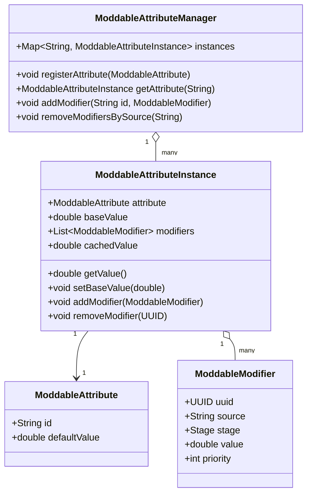
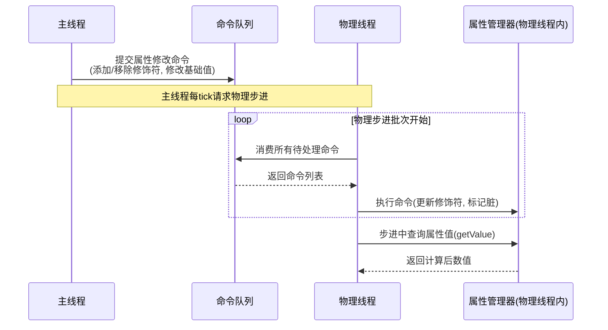

# 模块化属性修饰系统设计文档

## 1. 设计背景与目标

在物理驱动的模块化实体（如载具、机娘素体）中，大量数值参数需要根据零件构成、状态效果、外部Buff等因素动态变化。这些参数涵盖武器伤害、护甲强度、能量输出、零件耐久度等多个维度，且变化来源多样、应用规则各异。原版Minecraft的属性系统（Attribute体系）虽然提供了属性值与修饰符的叠加机制，但其设计绑定于LivingEntity的通用战斗属性，难以直接适配零件和子系统的性能参数，且在计算模型、同步机制及线程安全方面存在限制。

为此，需要设计一套独立于原版Attribute体系、但借鉴其修饰思想的**通用属性修饰系统**。该系统需满足以下核心目标：
- 支持任意自定义数值的动态修饰。
- 提供多个计算阶段，以区分直接加算、百分比加成及最终独立乘区。
- 具备修饰符来源追踪与批量管理能力。
- 适配服务端物理线程与主线程异步协作的架构，确保线程安全。
- 简洁且易于扩展，能同时服务于载具和机娘项目。

## 2. 核心设计思想

该系统的设计核心是将“属性值”与“修饰符”解耦，采用**分层计算模型**。一个属性的最终值由基础值与一系列修饰符通过若干固定阶段计算得出。基础值由零部件定义提供，修饰符则代表各种外部影响。修饰符不直接修改基础值，而是在查询时通过标准化流程汇总，从而避免状态耦合，并允许动态添加或移除。

阶段划分的思想源于游戏数值平衡的常用范式：加法数值提供固定增量，百分比加成实现规模缩放，最终乘区则给予独立调节空间。通过固定这三个阶段，公式保持简洁且可预测，同时足以表达绝大多数游戏内效果。为了进一步降低复杂度，废弃独立的运算类型枚举，直接以阶段定义数值的语义，减少歧义。

在架构层面，系统采用集中管理器模式，每个逻辑单元（如一个MechUnit）持有一个属性管理器，负责该单元所有属性的实例化与修饰符维护。为避免并发冲突，所有写操作通过命令队列转移至物理线程执行，读取仅在物理步进内发生，从而在无锁条件下保证一致性。

## 3. 核心概念与数据结构

系统由四个核心组件构成：属性定义、修饰符、属性实例和属性管理器。其关系如下mermaid类图所示：



### 3.1 属性定义

`ModdableAttribute` 描述一个可修饰属性的元数据，其伪代码定义如下：

```java
class ModdableAttribute {
    final String id;            // 全局唯一标识，如 "mech:weapon_damage"
    final double defaultValue;  // 未修饰时的默认基础值
}
```

属性定义自身不存储当前值或修饰符，仅作为注册键使用。

### 3.2 修饰符

`ModdableModifier` 是一次加成操作的单元，其结构为：

```java
class ModdableModifier {
    final UUID uuid;        // 用于精确移除
    final String source;    // 来源标签，如 "affinity", "buff:adrenaline"
    final Stage stage;      // 应用阶段
    final double value;     // 数值，语义由stage决定
    int priority;           // 阶段内优先级，默认为0
}

enum Stage {
    ADDITIVE,           // 直接加算数值
    MULTIPLICATIVE,     // 百分比，此阶段内相加合并
    FINAL_MULTIPLIER    // 独立乘区百分比，此阶段内叠乘
}
```

废弃独立的操作符字段，阶段已完全定义value的使用方式：
- `ADDITIVE`：value为直接加数（如 +5）。
- `MULTIPLICATIVE`：value为百分比数值（如0.15表示15%），内部累加。
- `FINAL_MULTIPLIER`：value为乘区百分比（如0.05表示5%），内部叠乘。

### 3.3 属性实例与计算模型

每个具体属性值由一个 `ModdableAttributeInstance` 管理，它持有基础值和修饰符列表，并负责缓存计算结果。其伪代码实现如下：

```java
class ModdableAttributeInstance {
    ModdableAttribute attribute;
    double baseValue;
    List<ModdableModifier> modifiers = new ArrayList<>();
    double cachedValue;
    boolean dirty = true;

    double getValue() {
        if (dirty) {
            recalculate();
            dirty = false;
        }
        return cachedValue;
    }

    void recalculate() {
        double additiveSum = 0;
        double multiplicativeSum = 0;
        double finalMultiplier = 1.0;

        // 按阶段分组并排序（按priority）
        for (ModdableModifier mod : getSortedModifiers()) {
            switch (mod.stage) {
                case ADDITIVE:
                    additiveSum += mod.value;
                    break;
                case MULTIPLICATIVE:
                    multiplicativeSum += mod.value;
                    break;
                case FINAL_MULTIPLIER:
                    finalMultiplier *= (1.0 + mod.value);
                    break;
            }
        }
        cachedValue = (baseValue + additiveSum) * (1.0 + multiplicativeSum) * finalMultiplier;
    }

    void setBaseValue(double newBase) {
        this.baseValue = newBase;
        dirty = true;
    }

    void addModifier(ModdableModifier mod) {
        modifiers.add(mod);
        dirty = true;
    }

    void removeModifier(UUID uuid) {
        modifiers.removeIf(m -> m.uuid.equals(uuid));
        dirty = true;
    }
}
```

计算流程可概括为以下mermaid流程图：

```mermaid
flowchart TD
    Start([查询属性值]) --> CheckDirty{缓存有效?}
    CheckDirty -->|是| ReturnCache[返回缓存值]
    CheckDirty -->|否| Init[初始化: A=0, M=0, F=1]
    Init --> Loop[遍历排序后的修饰符]
    Loop --> StageCheck{修饰符阶段}
    StageCheck -->|ADDITIVE| AddA[A += value]
    StageCheck -->|MULTIPLICATIVE| AddM[M += value]
    StageCheck -->|FINAL_MULTIPLIER| MulF[F *= 1 + value]
    AddA --> NextMod{还有修饰符?}
    AddM --> NextMod
    MulF --> NextMod
    NextMod -->|是| Loop
    NextMod -->|否| Calc[计算: (base + A) * (1 + M) * F]
    Calc --> StoreCache[更新缓存, 清除脏标记]
    StoreCache --> ReturnCache
```

该公式保证各阶段间互不干扰，且修饰符添加顺序不改变最终值（同优先级按添加顺序排序）。

### 3.4 属性管理器

`ModdableAttributeManager` 作为容器，为某一逻辑实体维护所有属性实例的映射。其主要接口伪代码：

```java
class ModdableAttributeManager {
    Map<String, ModdableAttributeInstance> instances = new HashMap<>();

    void registerAttribute(ModdableAttribute attr) {
        instances.putIfAbsent(attr.id, new ModdableAttributeInstance(attr, attr.defaultValue));
    }

    ModdableAttributeInstance getAttribute(String id) {
        return instances.get(id);
    }

    void addModifier(String attrId, ModdableModifier mod) {
        ModdableAttributeInstance inst = instances.get(attrId);
        if (inst != null) {
            inst.addModifier(mod);
        }
    }

    void removeModifiersBySource(String source) {
        for (ModdableAttributeInstance inst : instances.values()) {
            inst.modifiers.removeIf(m -> m.source.equals(source));
            inst.dirty = true;
        }
    }
}
```

管理器不关心属性的具体用途，只提供统一的访问与修改管道。

## 4. 线程安全与异步协作

属性系统需要在物理线程中被读取（如计算护甲减免、伤害输出），而修饰符的添加或移除事件通常由主线程产生（如Buff激活、零件更换）。为避免加锁开销，采用命令队列模式保证线程安全。

主线程与物理线程的交互流程如下mermaid序列图所示：



- **写操作**：任何主线程发起的修饰符变更（添加/移除）或基础值修改，均封装为任务，提交至物理线程的命令队列。
- **消费**：物理线程在每一批次步进开始前，消费队列中的所有变更任务，更新对应属性实例，并标记缓存脏。
- **读取**：物理步进中，各子系统直接调用管理器获取最新属性值，此时状态已完全更新且不再并发修改。

此策略确保物理线程始终在单线程内访问属性系统，无需同步原语。如果客户端或UI需要展示属性值，可通过物理线程回传的快照数据获取，接受一帧的延迟。

## 5. 应用示例：伤害计算与Buff交互

以玩家机甲在增益效果下的伤害计算为例。假设存在以下属性：
- `mech:physical_damage`（物理伤害基础值）
- `mech:global_damage_mult`（全局伤害百分比加成）
- `mech:damage_final`（最终独立乘区）

某武器基础伤害为30，装备提供 `ADDITIVE` +5，熟练度提供 `MULTIPLICATIVE` +15%，全面保养Buff提供 `MULTIPLICATIVE` +25%，同时全局伤害加成Buff提供 `FINAL_MULTIPLIER` +5%。

属性管理器内修饰符列表如下：

| 属性ID | 修饰符来源 | 阶段 | 数值 |
|--------|------------|------|------|
| `mech:physical_damage` | 零件基础 | (baseValue) | 30 |
| `mech:physical_damage` | 装备 | ADDITIVE | 5 |
| `mech:physical_damage` | 熟练度 | MULTIPLICATIVE | 0.15 |
| `mech:global_damage_mult` | 全面保养 | MULTIPLICATIVE | 0.25 |
| `mech:damage_final` | 全局Buff | FINAL_MULTIPLIER | 0.05 |

伤害计算伪代码：

```java
ModdableAttributeInstance physDmg = manager.getAttribute("mech:physical_damage");
double damage = physDmg.getValue(); // = (30+5) * (1+0.15) = 40.25

ModdableAttributeInstance globalMult = manager.getAttribute("mech:global_damage_mult");
damage *= (1.0 + globalMult.getValue()); // 若直接读取，globalMult基础值0，修饰符0.25，getValue()=0.25

ModdableAttributeInstance finalDmg = manager.getAttribute("mech:damage_final");
damage *= finalDmg.getValue(); // finalDmg基础值1.0? 注意: 此处应乘以(1 + 修饰符叠加)，但finalDmg本身就是乘区积。
```

为使公式统一，建议将 `mech:damage_final` 的基础值设为1.0，且其修饰符在实例内部的 `recalculate()` 中按 `FINAL_MULTIPLIER` 叠乘。调用 `getValue()` 直接返回最终乘区因子。这样武器系统仅需：

```java
double finalDamage = baseWeaponDamage
    * manager.getAttribute("mech:physical_damage").getValue()
    * manager.getAttribute("mech:global_damage_mult").getValue()
    * manager.getAttribute("mech:damage_final").getValue();
```

当Buff激活时，主线程执行如下伪代码添加修饰符：

```java
void applyFullMaintenance(ModdableAttributeManager mgr) {
    ModdableModifier mod = new ModdableModifier(
        UUID.randomUUID(), "buff:full_maintenance",
        Stage.MULTIPLICATIVE, 0.25, 0);
    mgr.addModifier("mech:global_damage_mult", mod);
}
```

Buff结束时按来源移除：

```java
mgr.removeModifiersBySource("buff:full_maintenance");
```

## 6. 与其他系统的关系

属性系统作为底层数值框架，与多个上层系统交互：
- **零件系统**：零件加载时向管理器注册对应的属性定义，并提供基础值；零件损坏可调整基础值或移除自身提供的修饰符。
- **Buff系统**：Buff激活时创建带来源标签的修饰符并加入管理器，到期时按来源移除。
- **养成系统**：好感度、熟练度通过生成带固定UUID的修饰符，将情感/经验反馈转化为具体数值影响。
- **子系统**：武器、护盾、移动等子系统在计算自身行为参数时，从管理器读取修饰后的属性值，而不再维护独立的属性容器。

这种松耦合设计使得任何新增的影响源只需按照规范生成修饰符即可生效，无需修改子系统逻辑。

## 7. 扩展性与总结

当前三阶段公式可覆盖绝大多数需求，但系统保留扩展能力。若未来需要更复杂的计算（如倒数阶段、条件分支），可通过继承 `ModdableAttributeInstance` 并重写计算方法实现，而不影响修饰符数据结构。此外，通过增加管理器层级（如全局、阵营、区域），可实现多维度的属性同步与叠加。

本系统以简洁的数据模型和明确的阶段划分，为模块化实体提供了统一且高效的数值调节机制。通过将属性计算与修饰符管理解耦，并利用命令队列保证异步线程安全，系统既能满足复杂游戏逻辑的需求，又保持了良好的性能和可维护性。作为载具拼装和机娘养成玩法的数值基石，它为后续的内容扩展奠定了坚实基础。