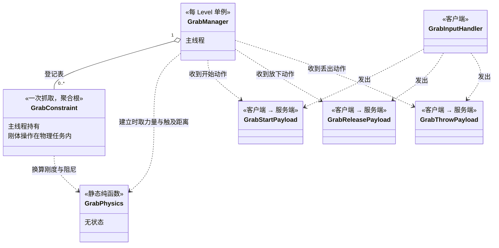
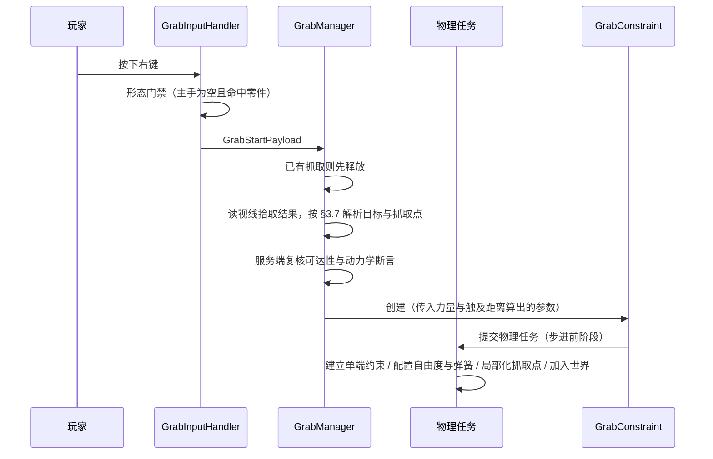
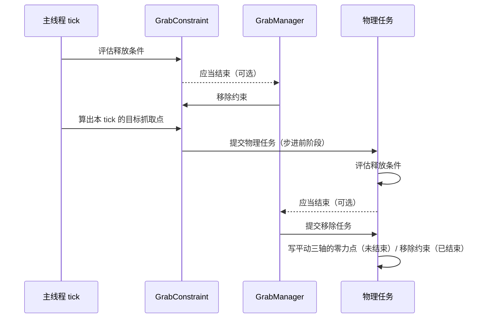
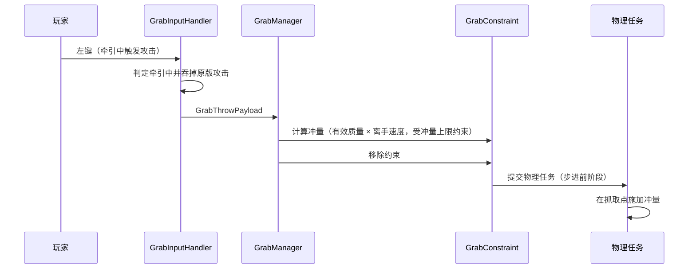

# Machine-Max 抓取系统 — 接口设计

> **状态**：已实现（`common/mech/grab/` 下 `GrabManager`、`GrabConstraint`、`GrabPhysics` 已落地）
> 创建时间：2026-09-19
> 用途：固定本系统的分层、类切分、职责边界与协作契约。
>
> **本文不含方法签名。** 方法签名以 `common/mech/grab/` 下的实现为准；本文只回答"有哪些类、每个类负责什么、谁在什么时机调用谁、状态放在哪里、哪些量跨线程"。方法签名见 `common/mech/grab/` 下的实现。
>
> **依赖声明（单向）**：凡涉及物理量的定义、取值口径、标定条件与理由，一律以 §号引用《抓取系统-详细设计文档.md》（下称"设计文档"）。设计文档不依赖本文。

***

## 阅读顺序

```text
一、类与文件    文件清单、切分依据、职责、刻意不引入的抽象
二、协作契约    抓取、牵引、抛掷、释放四条时序
三、状态归属    每个状态由谁持有、生命周期多长
四、挂载点      接入既有代码的具体位置
五、线程约束    哪些阶段必须在线程边界上
六、待定清单    接口设计必须逐条回答的问题
七、对应关系    本文各节与设计文档的映射
```

***

## 一、类与文件

### 1.1 文件清单

位置：`common/mech/grab/`，与 `projectile/`、`explosion/` 平级——抓取是"对既有刚体施加外力"的独立机制，不属于载具域也不属于子系统域。

| 文件 | 单一职责 | 持有状态 | 线程 |
|---|---|---|---|
| `GrabManager.java` | 每 Level 单例；抓取登记表；目标解析；每 tick 驱动；释放的唯一执行者 | 按玩家 UUID 索引的登记表 | 主线程 |
| `GrabConstraint.java` | 包装单端 `New6Dof`：建立 / 配置 / 零力点写入 / 移除，以及逐物理步的释放判据与脱手防抖计数 | 被抓零件、抓取点局部坐标、命中距离、参数、约束引用、连续计数 | 主线程持有；约束操作与判据在物理任务内 |
| `GrabPhysics.java` | 静态标定量与静态换算：刚度、阻尼、角参数、力与冲量上限；有效力量倍率与触及距离由属性现读（设计文档 §5.2、§5.4） | 无（只有只读的标定量） | 双端只读 |
| `network/payload/grab/GrabStartPayload.java` | 客户端 → 服务端：开始抓取，不带字段 | — | 主线程 |
| `network/payload/grab/GrabReleasePayload.java` | 客户端 → 服务端：放下，不带字段 | — | 主线程 |
| `network/payload/grab/GrabThrowPayload.java` | 客户端 → 服务端：丢出，不带字段 | — | 主线程 |
| `client/input/GrabInputHandler.java` | 右键按下与松开的观察、形态门禁、原版按键拦截与发包 | 无 | 客户端 |
| `common/registry/MMAttributes.java` | 力量属性的注册与挂载 | — | — |

三个载荷**都不携带任何字段**：目标、抓取点、方向、距离与全部受力参数由服务端用真实视线与属性重算（设计文档 §8.5）。三件套命名与既有的 `FabricationStart/Cancel/CollectPayload` 同构。

### 1.2 类图



### 1.3 切分依据

**依据是状态归属**：有独立生命周期的对象成类（`GrabManager`、`GrabConstraint`），无状态的换算成静态纯函数（`GrabPhysics`）。判据与生命周期是同一次抓取的同一条时间线上的两件事，共享同一份状态，因此是 `GrabConstraint` 的方法而不是独立的类。

**目标解析在 `GrabManager` 内**，不单设拾取类：本系统复用玩家身上的视线拾取附件（设计文档 §6.3），`GrabManager` 建立抓取时直接读取它的命中结果，按设计文档 §3.7 的归属规则挑出被抓零件与抓取点。多一层转发没有带来任何可替换性。

**装备复用的落点在属性，不在接口**：徒手与持有装备在机制层完全同构，差别只是有效力量倍率与触及距离的取值。装备通过物品属性修饰器提供加成（设计文档 §5.3），机制层不出现任何物品判断。因此不引入"抓取提供者"一类的接口族；只有当未来某个装备需要改变**行为**而非数值（耗能、蓄力、姿态档位）时，才需要新的扩展点。

**刻意不引入的抽象**：

| 不引入 | 原因 |
|---|---|
| 能力 / 提供者接口族 | 装备的差异目前全部落在属性上（见上一条） |
| 抓取事件总线 | 目前没有第三方订阅者 |
| 目标拾取类 | 拾取结果直接来自玩家身上的既有附件（见上一条） |
| 参数解析类 | 有效倍率是一次属性读取加一次药水查询，实现为静态方法（设计文档 §5.2） |
| 判据类 | 判据与抓取状态同生命周期，随 `GrabConstraint`（见上一条） |
| 双手抓取的 N 条约束结构 | 每个玩家至多一条约束：登记表按玩家 UUID 索引，状态机是单槽的（设计文档 §6.4） |
| 约束对象池 | 释放即销毁（设计文档 §3.6）；是否需要池化由 V6 的实测结论决定（设计文档 §10） |

### 1.4 一条贯穿的分工纪律

**判据只回答"是否应当结束"与"为什么"，释放的执行只有一处：`GrabManager`。** 判据、玩家输入、玩家状态变化、目标失效四条来源都只是请求结束；任何其他路径都不得自行移除约束，否则会出现"约束已从世界移除但登记表仍有记录"这类不一致（设计文档 §3.6）。

***

## 二、协作契约

以下时序只表达**调用顺序与方向**，不表达签名。

### 2.1 建立抓取



**校验失败的任一步都必须回到空闲**，且不留下任何已创建的引擎对象。

### 2.2 牵引中（每主 tick 更新目标点，每物理步判据与写入）



判据与零力点写入都在物理步的步进前阶段完成；**先判据、后写零力点**，避免对已经判定应当释放的抓取再做一次写入。判据每物理步评估一次（设计文档 §6.2、§8.1），只回答"是否应当结束"，释放的执行仍在 `GrabManager`（§1.4）。

### 2.3 抛掷



**顺序不可颠倒**：必须先移除约束再施加冲量。约束处于启用状态时，它会在冲量施加的同一物理步内反向拉扯，抵消掉大部分抛出速度。

### 2.4 释放

```text
判定应当结束 → 在物理任务中移除约束 → 从登记表摘除
```

四条来源（判据、玩家输入、玩家状态变化、目标失效）都只是"请求结束"，由 `GrabManager` 统一执行（§1.4）。约束不跨抓取存活（设计文档 §3.6）。

***

## 三、状态归属

| 状态 | 持有者 | 生命周期 | 说明 |
|---|---|---|---|
| 抓取登记表 | `GrabManager` | 世界加载 → 卸载 | 按玩家 UUID 索引，每个玩家至多一条 |
| 被抓零件与抓取点（刚体局部坐标） | `GrabConstraint` | 建立 → 释放 | 抓取期间不变；局部化与约束创建处在同一物理任务内（设计文档 §3.7） |
| 命中距离 `d` | `GrabConstraint` | 建立 → 释放 | 决定牵引期间的目标抓取点（设计文档 §3.3、§3.4） |
| 眼位、视线与脱手阈值快照 | `GrabManager` | 每主 tick 覆写 | 主线程写入、物理线程只读（设计文档 §3.4） |
| 脱手防抖计数 | `GrabConstraint` | 建立 → 释放 | 按物理步计数（设计文档 §6.2） |
| 约束对象引用 | `GrabConstraint` | 建立 → 释放 | 释放即移除，不跨抓取存活（设计文档 §3.6） |
| 每 tick 的目标抓取点 | 不持有 | 单次主 tick | 由眼位快照与视线算出，立即进物理任务，无需存储 |
| 有效力量与速度倍率 | 不持有 | 单次查询 | 不缓存：属性、装备、药水效果都可能在任何 tick 变化（设计文档 §5.2） |
| 形态门禁的结果 | 不持有 | 单次查询 | 客户端执行、服务端复核，不作为已校验的事实传递（设计文档 §8.5） |
| 牵引中的客户端表现状态 | 客户端 | 当前阶段不存在 | 首期不做跨端表现（设计文档 §8.5） |

***

## 四、挂载点

| 位置 | 做的事情 | 设计文档 |
|---|---|---|
| 客户端输入 | 观察右键的按下与松开（按键状态轮询）；牵引中观察左键 | §7.4、§8.5 |
| 原版按键拦截 | 形态门禁通过时吞掉右键的原版交互触发；牵引中吞掉原版攻击 | §7.4、§8.5 |
| 载荷注册与解析 | 开始 / 放下 / 丢出三个载荷的注册与解析入口 | §8.5 |
| 物理任务提交 | 约束建立、参数写入、抓取点局部化、零力点写入、冲量施加、约束移除的唯一入口 | §8.1 |
| 属性注册与挂载 | 注册 `grab_strength` 并加到玩家实体类型上（缺少挂载这一步，玩家身上取不到该属性） | §5.1 |
| 物品属性修饰器 | 装备通过属性修饰器提供力量加成 | §5.3 |
| 触及距离 | 取自原版 `ENTITY_INTERACTION_RANGE` | §5.4 |
| 语言文件 | 属性名称条目 | §5.1 |
| 客户端表现 | 首期不做跨端表现，客户端按按键状态本地推断 | §8.5、§11 |

**本系统不接入的位置**：零件受伤管线、连接器冲击与完整性、装配与拆卸流程、刚体位姿同步。抓取只对既有刚体施力，同步沿用既有设施。

***

## 五、线程约束

| 阶段 | 线程 | 强制要求 |
|---|---|---|
| 输入承接与意图翻译 | 客户端 | 门禁在客户端执行，但结论不作为已校验事实发出 |
| 目标解析、参数读取 | 主线程（服务端） | 全部权威判定在服务端 |
| 玩家眼位、视线与脱手阈值 | 主线程 | 算好后作为快照传入物理任务（设计文档 §3.4） |
| 读取被抓刚体位姿（主线程侧） | 主线程 | 只能读每 tick 的位姿缓存，禁止裸读原生刚体（见下） |
| 释放判据评估 | 物理线程（服务端） | 每物理步一次，与刚体同线程；只产出"应当结束"（设计文档 §6.2） |
| 约束建立与移除、参数写入、零力点写入、冲量施加 | 物理线程 | 必须经物理任务提交；禁止主线程直接操作刚体 |
| 客户端表现 | 客户端 | 当前阶段不存在 |

**读刚体位姿的取数方式**：主线程直接调用引擎的位姿读取会与物理线程并发（设计文档 §3.4）。主线程侧一律使用每 tick 刷新一次的位姿缓存（`DestroyableRigidObject` 的主 tick 逻辑即走这条路径）；判据在物理步内评估，与刚体同线程，不受这条限制。

**物理任务提交的阶段选择**：所有"每 tick 一次"的操作使用**步进前**阶段。需要特别避免使用"所有阶段"这一取值，它在物理步进前后各执行一次（设计文档 §8.1）。

**零力点写入频率**：主线程每个主 tick 随眼位与视线快照算出目标抓取点，写入在物理步进阶段执行。物理世界一个主 tick 内可能执行多个子步，同一主 tick 内的目标点不变，重复写入是幂等的（设计文档 §8.1）。

***

## 六、待定清单

### 6.1 已定案

| 编号 | 结论 | 依据 |
|---|---|---|
| 会话归属 | 每 Level 单例的 `GrabManager` 持登记表，不挂玩家附件 | §1.1、§三 |
| 约束生命周期 | 每次抓取新建，释放即移除，不复用 | 设计文档 §3.6 |
| 目标解析来源 | 复用玩家身上的视线拾取附件，在 `GrabManager` 内解析 | 设计文档 §3.7 |
| 姿态档位范围 | 首期只实现"自由"档 | 设计文档 §3.5、§11 |
| 触发与结束方式 | 空手右键按下开始、松开放下、牵引中左键丢出，均为瞬时事件，不蓄力 | 设计文档 §7.4、§8.5、§6.4 |
| 触及距离口径 | 射线长度与脱手阈值都取自原版 `ENTITY_INTERACTION_RANGE`：取值相同，职责不同（前者定射线长度，后者是脱手阈值）；持握距离由命中距离给出，余量是 `D − d` | 设计文档 §5.4、§3.3、§3.4 |
| 输入绑定 | 与右键共用，客户端门禁 + 服务端复核 | 设计文档 §8.5 |
| 客户端表现 | 首期不做跨端表现，不引入会话回执载荷 | 设计文档 §8.5、§11 |
| 装备复用落点 | 属性而非接口，机制层不做物品判断 | §1.3 |

### 6.2 仍待定

按依赖顺序排列：前面的答案会约束后面的选项。

| 编号 | 问题 | 可选方向 |
|---|---|---|
| **Q1** | 被抓刚体被移除或失效时，`GrabConstraint` 如何感知？ | 每 tick 有效性检查 / 订阅零件销毁事件 |
| **Q2** | 玩家退出、跨维度、死亡重生三种情况各自清理到哪一层？ | 三处独立处理 / 统一走"玩家状态变化"清理 |
| **Q3** | 允许隔墙牵引吗？ | 允许（简化） / 视线阻断即释放（更真实） |
| **Q4** | 牵引期间受击是否打断？ | 不打断 / 打断（可玩性更强） |
| **Q5** | 脱手阈值的宽容系数与防抖步数是否需要玩家可配置？ | 固定常量 / 客户端配置项 |
| **Q6** | 标定量（`F_ref`、`Δ_ref`、`ω_max`、`ζ`、`r_ref`、`T_ref`/`Δθ_ref`、`ζ_r`、`I_ref`、`V_REF`/`γ`、`N`）放在服务端配置还是代码常量？ | 服务端配置（可调） / 静态常量（简单） |
| **Q7** | 抛掷冲量是否需要在装配体各刚体之间按质量分摊？ | 待 V7 实测（设计文档 §7.3、§10） |

***

## 七、与设计文档的对应关系

本文出现的每一条机制约束，其依据都在设计文档中：

| 本文位置 | 设计文档对应 |
|---|---|
| §1.1 文件清单、§1.3 切分依据 | §3、§5、§6、§7 |
| §1.4 分工纪律 | §3.6、§6.3 |
| §2.1 建立抓取 | §3.2、§3.3、§3.7、§6.3 |
| §2.2 牵引中 | §3.4、§6.2、§6.3 |
| §2.3 抛掷 | §7.1、§7.3、§7.4 |
| §2.4 释放 | §3.6、§6.3 |
| §三 状态归属 | §3.3、§3.6、§4.1、§5.2、§6 |
| §四 挂载点 | §5.1、§5.3、§5.4、§7.4、§8.1 |
| §五 线程约束 | §3.4、§8.1、§8.2 |
| §四 挂载点（输入与网络） | §8.5 网络机制 |
| §六 待定清单 | §9 参数总表、§10 待实测清单 |
