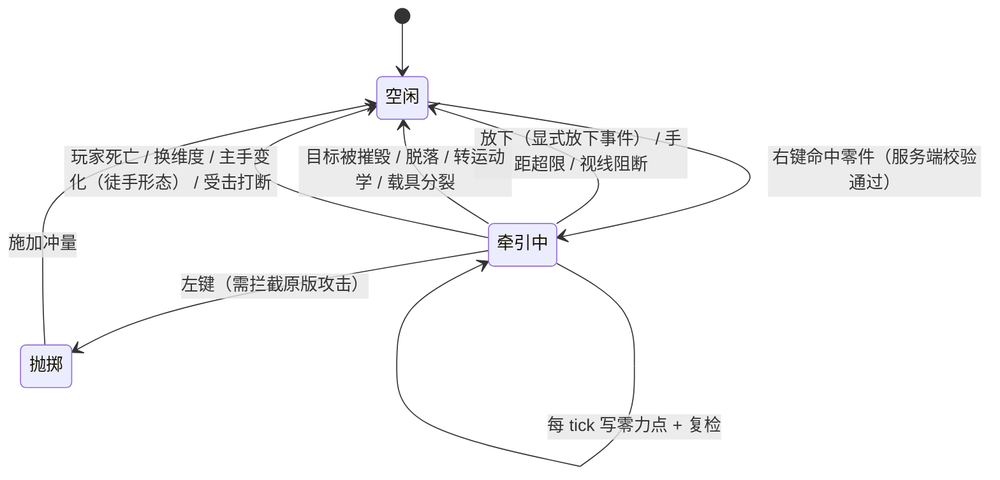

# Machine-Max 抓取系统 — 详细设计

> **状态**：已实现（`common/mech/grab/` 下 `GrabManager`、`GrabConstraint`、`GrabPhysics` 已落地）
> 创建时间：2026-09-19
> 适用对象：玩家对载具零部件施加**连续外力**的能力——抓住、牵引、抛掷，以及它的工具化形态（物理枪 / 重力枪）
>
> **本文自包含**：全部符号、公式与判据均在文内定义，可独立阅读与实现，不要求先读其他文档。
> 文内引用的 `SubPart`、`PhysicsLevel`、`New6Dof`、`LivingEntityEyesightAttachment` 等类型均指仓库中已有的类型，附录 A 给出它们的定位与关键 API 证据。

***

## 阅读顺序

```text
第一部分  基础规则      目标、前提、术语
第二部分  物理模型      单端 6DOF 弹簧约束
第三部分  参数标定      刚度、阻尼、几何力上限、承载能力
第四部分  玩家层        力量属性、脱手判据
第五部分  抛掷          双约束模型、速度与冲量来源、施加方式
第六部分  工程约束      线程、红线、陷阱、网络机制、参数表、实施阶段
附录 A                  证据与既有 API 对照
```

一条贯穿全文的结构约束：**本系统只对既有刚体施加力，不改变装配拓扑。** 装配与拆卸一律走既有的连接器流程，本系统不参与。

***

# 第一部分 基础规则

## §1 目标与范围

### 1.1 目标

让玩家能够像在真实世界里那样，用手对载具零部件施加连续的外力：抓住一个部位拖拽、把零件从坡上拽回来、把东西甩出去，并在物体受地面支撑时推动或拖拽它。载具零部件在服务端是标准动力学刚体，本系统提供的是**玩家侧的作用通道**。

**作用范围由力上限决定**。牵引力的上界是"刚度 × 形变量上界"，形变量的上界由脱手判据给出，因此一套标定同时决定了"能搬多重"与"能推动多重"（§4.3）。基础玩家（无装备无药水）的量级是约 4.5 kN 牵引力上限、约 450 kg 托举上限。据此，本系统的设计目标是：

| 目标 | 基础玩家 | 成长路径 |
|---|---|---|
| **散件**（数十至数百公斤，如轮子、炮管、装甲板） | 提起、搬运、抛掷 | 力量属性与药水抬高力上限，可搬更重的散件 |
| **受地面支撑的载具**（重量由地面承担，弹簧只需克服滚动与摩擦阻力） | 推得动、拖得回，吨位越大越吃力 | 装备与药水加成后余量变大 |
| **轻型载具的悬空部件** | 能托起并摆正 | 力量与装备加成后更轻松 |

把车辆整体搬起来掀翻不在设计目标内：托举上限由 `F_ceiling / g` 决定，基础值为约 450 kg，内容包里的车体与炮塔主体是吨级。两者的取舍与换算见 §4.3。

### 1.2 范围外

| 不做的事 | 原因 |
|---|---|
| 改变装配拓扑（拆下零件、切换父子关系） | 拓扑变更走既有连接器流程；抓取只施加力 |
| 为抓取新建刚体来表示"被抓住的物体" | 约束直接连在既有零部件刚体上 |
| 逐 tick 拆装约束 | 约束在整个抓取期间持有，只在抓取开始时建立一次 |
| 由客户端决定抓取目标、方向与距离 | 全部由服务端用玩家真实视线、位置与属性重算（§8.5） |
| 抓取的工具化形态（物理枪 / 重力枪） | 当前范围是徒手抓取；工具形态的输入通路与产物另行设计 |
| 掀翻吨级载具 | 吨级目标的托举量约为本系统标定的二十倍，与"轻件跟手"的体感目标互斥（§4.3） |

### 1.3 术语

| 术语 | 含义 |
|---|---|
| **被抓刚体** | 抓取点所在的那个零件刚体（`SubPart.body`），是约束的 B 端 |
| **抓取点** | 玩家视线射线与被抓刚体的交点，在刚体局部坐标系中固定；抓取期间不变 |
| **锚点** | "玩家希望抓取点到达的世界坐标"，每个物理 tick 更新；实现方式是写平动自由度的零力点（§3.4） |
| **形变量** `Δx` | 锚点与抓取点之间的世界距离，是弹簧产生力的原因 |
| **手距** `handDist` | 玩家眼位与抓取点之间的世界距离，是脱手判据 |
| **牵引中** | 抓取已建立、约束已加入物理世界、正在每个物理 tick 更新锚点的状态 |
| **被抓装配体** | 被抓刚体所属的装配体（`SubPart.part.assembly`），其总质量参与抛掷计算 |
| **命中距离** `d` | 建立抓取时视线射线命中被抓刚体的距离；物体在牵引期间的稳态位置由它决定（§3.3） |

***

# 第二部分 物理模型

## §2 设计前提

以下四条是后续所有设计成立的基础。每条都给出了它的依据或守卫方式。

| 编号 | 前提 | 依据 / 守卫 |
|---|---|---|
| **P1** | 弹簧在自由度"自由"（下限 > 上限）的轴上正常生效 | Bullet 求解代码中弹簧段与限位分支并列，自由轴照常参与求解（附录 A.1） |
| **P2** | 关节只在服务端加入物理世界 | 与既有连接器的纪律一致；客户端刚体为运动学模式，关节在客户端无意义 |
| **P3** | 被抓刚体在抓取期间必须处于动力学模式 | 单端约束的 javadoc 要求 B 端为 dynamic；抓取前必须断言 |
| **P4** | 客户端可见性由既有位姿同步提供 | 既有同步链路会下发刚体位置、旋转与速度 |

**P3 有两条真实的踩坑路径**：

- **时间窗**：载具在地形尚未就绪的窗口内会被整体临时钉住（平动/转动系数归零）以避免穿透地形。此时抓取必须拒绝或等待。
- **常态**：连接点判定体与交互框刚体**始终**是运动学模式，而二者的碰撞组都被设成可被视线射线命中（它们的设计用途就是供玩家用视线选取）。玩家的射线经常先命中它们。

两条路径的统一守卫是：**抓取前断言被抓刚体 `isDynamic()`**，并在目标解析阶段按 §3.7 的归属规则把命中落到零件自身刚体上。

## §3 约束结构

### 3.1 为什么用约束而不是自己写力

用"每 tick 计算位置误差、再施加力"的做法，平动跟随并不难，但一旦要**保持相对姿态**，就必须自己处理世界系逆惯量张量、抓取点的点速度（`v = v_cm + ω × r`）、以及"施力产生角速度 → 角速度反过来改变抓取点速度"这个必须在同一个积分步内收敛的反馈环。

改用引擎的 6 自由度弹簧约束后：

- 6 个自由度一次性交给求解器，转动与平动的耦合由引擎按有效质量矩阵处理；
- 约束与装配体既有的全部关节在**同一个顺序冲量求解循环**内求解，不会与外层约束网络互相打架；
- 求解器内部是隐式积分（弹簧参与约束求解，而非显式前向积分），刚度稳定性大幅优于手写 PD。

### 3.2 约束类型与坐标系

采用**单端 `New6Dof`**（`btGeneric6DofSpring2Constraint` 的单端形式），A 端为空，代表世界：

```text
A 端 = 世界（frameInA 定义在物理世界坐标系）
B 端 = 被抓刚体（frameInB 定义在其局部坐标系）
```

**frame A 的姿态在创建时固定，且不可在运行期修改**（`rotA`/`rotB` 是私有的最终字段，且关节包内不存在设置帧的方法）。因此创建时把 **frame A 的姿态取世界单位阵**：这样约束的轴向就是世界轴，目标角度即世界系角度，无需任何反解。

**frame A 的位置只在创建时写入**：关节包内没有改写 frame A 位置的公开方法，而 `New6Dof.setPivotInA(Vector3f)` 的原生实现把传入向量写进 frame B 的 origin（B 的局部坐标系），调用前后 frame A 的原点不变（附录 A.1）。锚点跟随因此由 §3.4 的零力点写入实现。

### 3.3 自由度配置

自由度状态由轴的上下限三元组唯一决定：

| 条件 | 状态 |
|---|---|
| `下限 == 上限` | 锁定 |
| `下限 > 上限` | 自由 |
| `下限 < 上限` | 受限（在区间内活动） |

**单端 `New6Dof` 构造后的初始状态是：转动轴自由、平动轴锁定。** 平动轴出厂即为 `0 / 0` 的刚性销钉，必须显式给成自由才能解锁。

**开关弹簧不会改变上下限**：`enableSpring` 只切换该自由度的弹簧开关，不触碰限位。这两件事必须分别设置。

配置如下：

| 自由度 | 配置 | 效果 |
|---|---|---|
| 平动 X/Y/Z | **自由** + 弹簧（刚度 + 阻尼） | 抓取点被弹簧牵引向锚点；无硬限位意味着力恒等于弹簧定律给出的值 |
| 转动 X/Y/Z | 见 §3.5 的四档 | 姿态行为按玩法需要选择 |

```java
// 单端 New6Dof：A 端为世界，frame A 姿态取世界单位阵
// 注意：构造后平动轴处于锁定（下限 == 上限 == 0），必须显式解锁

// 1) 平动轴：设成自由（下限 > 上限），并挂弹簧
for (int i = 0; i < 3; i++) {
    joint.set(MotorParam.LowerLimit, i, +1.0f);   // 下限高于上限 => 自由
    joint.set(MotorParam.UpperLimit, i, -1.0f);
    joint.enableSpring(i, true);                  // 只开关弹簧，不改变上面的上下限
}
// 2) 刚度与阻尼：末位 true 打开引擎自带的限幅（按步长与有效质量裁剪），
//    不打开则必须由调用方自己限幅（§4.1、§4.2）
for (int i = 0; i < 3; i++) {
    joint.setStiffness(i, k, true);               // k = min(F_ref·S_eff/Δ_ref, ω_max²·m)
    joint.setDamping(i, kd, true);                // kd = 2·ζ·√(k·m)
}
// 3) 转动轴：按 §3.5 选档后配置
// 4) 消除初始误差：以当前相对位姿作为平衡位置
joint.setEquilibriumPoint();
```

**步骤 4 给出抓取瞬间的零冲量，持握距离由每 tick 的目标点决定（§3.4）。** `setEquilibriumPoint()` 把"抓取那一刻的偏移"设为弹簧的零力点，因此弹簧在建立约束的同一瞬间不产生力，物体不会弹出去。此后零力点每个物理 tick 被重写为"当前视线方向上距离 `d` 处"，于是：

1. **抓取瞬间零冲量**：平衡位置即当前位置，弹簧在建立约束的同一瞬间不产生力，物体不会弹出去；
2. **手距天然留有余量**：稳态手距恒为 `d`，与瞄准方向无关；而 `d ≤ D`（射线命中它的前提就是长度不超过 `D`），因此脱手判据不会因为"刚好停在阈值上"而误触，余量是固定的 `D − d`（§6.2）；
3. **重新瞄准时物体被拖着走**：锚点随眼位与视线移动，物体跟着移动，而"当前停在多远处"由每 tick 写入的目标点给出，不随视角变化漂移。

`D` 只承担"射线长度"这一个职责，不参与持握距离的计算。`D` 的完整口径见 §5.4，参数表见 §9。

### 3.4 每 tick 的目标点与零力点写入

每个物理 tick 在物理线程内执行一次，是牵引期间唯一的每 tick 操作：

```text
1. 取玩家当前眼位与视线方向（主线程快照，见下）
2. 目标抓取点 = 眼位 + 视线 × 命中距离 d
3. 零力点_i = 目标抓取点_i − frameA原点_i    （i = 0/1/2，逐个写 setEquilibriumPoint）
```

`frameA原点` 是约束创建时写入的 A 端位置，创建后不变；创建时它取"眼位 + 视线 × 射线长度 `D`"。因为 frame A 的姿态取世界单位阵，**零力点的三个分量就是世界轴分量**，所以第 3 步直接写世界坐标之差（附录 A.1）。

**移动目标点为什么写零力点而不是挪 frame A**：弹簧力的来源是"抓取点相对 frame A 原点的当前位移"与零力点之差（附录 A.1），因此"把零力点写到哪里"与"把 frame A 原点挪到哪里"对弹簧是同一件事；而零力点有可用的写入接口，每次只写一个标量，不触发约束重建。

**眼位、视线与脱手阈值必须在主线程快照**：物理线程不读实体状态。主线程每 tick 把眼位、视线方向与当前的脱手阈值（取自 `ENTITY_INTERACTION_RANGE`，§5.4）算好写进会话持有的一份快照，物理任务只读这份快照。因此在一个主 tick 内的多个物理步里写入的是同一个零力点、比较的是同一个阈值（物理步频高于主 tick，§8.1），重复写入是幂等的。

**零点移动同时决定三件事**：物体稳定在视线前方 `d` 处；横向偏移的准星让锚点偏到物体一侧，弹簧把抓取点朝该侧拉，力的作用线不经过质心，于是产生翻滚（抓住质心正前方时作用线近于过质心，物体只平移）；玩家转动视线时物体被拖着跟过去，这份拖动同样作用在抓取点上，因此瞄准的横向偏移会连续地转化为翻滚。（§4.4 的力矩上限与此同源。）

### 3.5 转动轴四档

四种档位按同一套自由度状态三元组配置。**首期只实现"自由"档**，其余三档随实施阶段 E 落地（§11）。

| 档 | 配置 | 行为 | 适用场景 |
|---|---|---|---|
| **自由** | 构造默认（自由） | 物体绕抓取点自然摆动、翻滚 | 通用搬运，最接近"抓着一个点"的真实观感 |
| **锁定** | 下限 = 上限 = 0 | 姿态被刚性固定在约束创建时刻的世界姿态 | 需要"端着"某个零件对齐位置 |
| **软跟随** | 自由或受限 + 弹簧 + 平衡位置 | 物体被弹簧拉向指定目标角度，受力可被外力推开后回位 | 需要姿态跟随视角或缓慢摆正 |
| **硬对齐** | 受限 + 伺服马达 | 物体会主动转到目标角度并抵抗外力 | 零件必须精确对正插槽 |

软跟随档每一 tick 写入三个目标角：

```java
// 转动轴软跟随：目标角度相对 frame A（即世界系）
joint.set(MotorParam.Equilibrium, 3, targetX);
joint.set(MotorParam.Equilibrium, 4, targetY);
joint.set(MotorParam.Equilibrium, 5, targetZ);
```

两个必须注意的性质：

- **软跟随依赖弹簧生效**，因此该档必须显式打开转动轴的弹簧开关（`enableSpring(3..5, true)`）。P1 保证了自由轴上的弹簧可用，但"轴已自由"并不会让开关自动打开。
- **三个转动自由度是带顺序的欧拉分解**，不是三个独立的世界轴。跟单轴（多数情况是偏航）时行为直观；三轴同时给大角度时会互相耦合，接近万向节位置会退化。需要"完全跟随视角"的场合，应由上层先反解出三元欧拉角再写入。

### 3.6 释放与约束生命周期

**释放即销毁**：把约束从物理世界移除并丢弃引用，下一次抓取重新创建一条。

| 环节 | 做法 |
|---|---|
| 建立 | 每次抓取新建一条单端约束，抓取期间由该次抓取独占 |
| 释放 | 从物理世界移除（`removeJoint`）后丢弃引用，本系统不再持有原生对象 |
| 唯一时机 | 释放是唯一的销毁时机；被抓刚体被摧毁或装配体解体时，走同一条释放路径移除 |

**不复用约束对象的三个理由：**

1. **姿态零点不可重置**：约束两端的 frame 姿态在创建时固定、运行期无法修改（§3.2），"零角度"永远钉死在创建那一刻的世界姿态上。跨会话复用会让 §3.5 的锁定档与软跟随档以陈旧的世界姿态为零点。
2. **复用面窄**：B 端 pivot 定义在刚体局部坐标系里，复用只在"同一个零件被反复抓起放下"时才成立。
3. **状态更少**：软禁用对象需要额外的存活判定与销毁路径；"建立即独占、释放即移除"只有一条路径，不存在"约束仍在世界中但登记表已摘除"这类不一致。

建立与销毁都在物理任务内完成，与 §3.4 的零力点写入同一入口。

### 3.7 目标与抓取点的解析口径

视线拾取的结果是一张**命中结果列表**：射线沿途命中的每一个刚体各一条，按命中距离升序排列（物理世界的射线查询返回值即已排序）。列表里的刚体持有者有三类，必须分别处理：

| 射线命中的刚体 | 处理 |
|---|---|
| 零件自身刚体（`SubPart.body`） | 它就是**被抓刚体**，其命中点就是**抓取点** |
| 连接点判定体 / 交互框刚体 | 跳过。二者是常态运动学模式（P3），本身不能被抓；沿列表继续找其所属零件的命中结果 |

**归属规则**：抓取点取"被抓刚体自己的那条命中结果"，而不是射线的最前命中点。否则准星从连接点残端掠过时，抓取点会落在零件前方的空处，弹簧会把零件朝玩家方向拽。列表里没有任何零件自身刚体的命中时，抓取失败。

**局部化的时机**：约束的 B 端 pivot 定义在刚体局部坐标系里，因此"世界命中点 → 局部点"的换算必须与约束创建处在**同一个物理任务内**、用同一时刻的刚体位姿完成。不能在主线程预先换算：主线程读到的位姿可能已经过期，而约束创建那一刻的位姿才是唯一的参照。

***

# 第三部分 参数标定

## §4 刚度、阻尼与力上限

### 4.1 刚度

刚度由两件事共同决定：**玩家能施加多大的力**，以及**不能大到让轻小物体抖动**。取两者的较小值：

```text
k = min( F_ref · S_eff / Δ_ref  ,  ω_max² · m )
```

| 符号 | 含义 | 单位 |
|---|---|---|
| `F_ref` | 参考力（标定量），`S_eff = 1` 时玩家能施加的典型牵引力 | N |
| `S_eff` | 玩家的有效力量倍率，见 §5 | 无量纲 |
| `Δ_ref` | 参考形变量：形变量达到该值时牵引力等于 `F_ref · S_eff` | m |
| `ω_max` | 允许的最大跟随角频率（防抖上限） | rad/s |
| `m` | **被抓刚体自身质量** | kg |

两个分支的物理含义：

- **力受限分支**（`F_ref·S_eff/Δ_ref` 较小）：适用于较重的零件。刚度由"在参考形变处产生参考力"标定，力的语义清晰可预测。
- **频率受限分支**（`ω_max²·m` 较小）：适用于很轻的零件。此时刚度随质量线性下降，保证**跟随角频率恒为 `ω_max`**，轻零件不会被弹簧甩飞或抖振。

两分支的交越质量：

```text
m† = F_ref · S_eff / ( Δ_ref · ω_max² )
```

取 `F_ref = 1500 N`、`Δ_ref = 1.0 m`、`ω_max = 25 rad/s` 时 `m† ≈ 2.4 kg`。`SubPartAttr` 的质量缺省值是 25 kg，内容包里零件的实际质量从几十公斤（轮子一类散件）到数吨（车体、炮塔主体）不等，因此**只有 2.4 kg 以下的极轻件落在频率受限分支，其余全部落在力受限分支**，力量属性在其中起主导作用。

**刚度按被抓刚体自身质量折算**：弹簧的力与跟随频率由该刚体自身的质量与惯量决定，这使"跟手频率"对不同质量的被抓物保持一致。已装配的零件被牵引时还要拖动整个装配体，这份阻力由关节网络承担——**"重物拖不动"的观感来自关节网络，而不是刚度公式**。抛掷的折算口径不同（§7.1 用装配体总质量）。

### 4.1.1 引擎自己的刚度上限，必须一起校核

弹簧求解器在**每次求解时**按有效质量与步长裁剪角频率：

```text
ω_引擎上限 = 1 / (4 · Δt)          Δt = 单个物理步的时长
```

依据是 Bullet 求解代码里的注释——弹簧的采样频率不应快于其角频率的四分之一——对应的裁剪式是 `ks ≤ m / (16 · Δt²)`。阻尼也有对应的裁剪：`kd ≤ m / Δt`（§4.2）。

**步长由物理层的步频给出，与负载调节无关**：项目物理层每主 tick 执行 `dynamicRepeat` 次世界步进，每次的步长固定为标称值（100 Hz，Δt = 0.01 s），`dynamicRepeat` 在负载高时降到 1、低时回升到默认值（§8.1）。也就是说 `Δt` 是常量，负载调节改变的是"每主 tick 模拟多少步"，不改变步长。因此引擎上限也是一个常量：

| 量 | 值 |
|---|---|
| `ω_引擎上限` | 1 / (4 × 0.01) = 25 rad/s |
| 刚度上限 `ks ≤ m / (16 · Δt²)` | 625 · `m` |
| 阻尼上限 `kd ≤ m / Δt` | 100 · `m` |

标称步长下的引擎上限与 §4.1 取的 `ω_max = 25 rad/s` 恰好重合，这意味着 `ω_max` 处在**贴边的位置**（`0.25 < ω · Δt` 取不到，引擎不会替调用方裁剪）。由此有两条纪律：

- **`ω_max` 取 25 rad/s 就等于引擎上限**；想留余量必须把它降到 25 以下，代价是跟随频率随之降低、手感变软；
- 想用引擎的自动裁剪，必须走带限幅开关的写入方法（`setStiffness(dofIndex, k, true)`）。只写参数的写法（`set(MotorParam.Stiffness, i, k)`）**不会打开限幅开关**，引擎不会替调用方裁剪，需要调用方自己按上面的式子限幅。

### 4.2 阻尼

**阻尼参数是阻尼系数（单位 N·s/m），不是阻尼比。** 求解代码把弹簧力项与阻尼力项分开计算：

```text
弹簧力项 = ks · 形变量 · Δt
阻尼力项 = −kd · 相对速度 · Δt
```

`kd` 与速度相乘，因此它是系数。约束类上那个名字里带 "Ratio" 味道的注释（"the desired viscous damping ratio (0→no damping, 1→critically damped)"）与求解代码不符：按该注释填 `1` 并不等于临界阻尼，填 `0.707` 更是接近无阻尼。**判据以求解代码为准**，因为力的量纲只有一个地方能决定。

要把期望的**阻尼比** ζ 换算成写入值，用它与刚度、质量的关系：

```text
kd = 2 · ζ · √( ks · m )
```

| 轴 | 阻尼比 ζ（设计意图） | 说明 |
|---|---|---|
| 平动 X/Y/Z | 0.707 | 略欠阻尼，快速到位且不明显过冲 |
| 转动 X/Y/Z | 0.9 | 偏临界，避免姿态来回摆动 |

| 例子 | 刚度 ks | 写入的阻尼系数 kd（ζ = 0.707） |
|---|---|---|
| 25 kg 零件 | 1500 N/m | 274 N·s/m |
| 1 kg 零件 | 625 N/m | 35 N·s/m |

**ζ 与质量和力量无关，`kd` 不是。** ζ 是无量纲的设计意图，`kd` 才是写入值，因此阻尼必须在刚度算完之后再算（§4.1 的 k 依赖 `S_eff` 与质量）。刚度在抓取时写死（§8.3），阻尼随之一起写死。

**引擎的自动裁剪**：求解器在每次求解时按 `kd ≤ m / Δt` 裁剪阻尼系数（`m` 为该步的有效质量）。这条裁剪与刚度的裁剪（§4.1.1）联合起来，等价于对阻尼比的上限要求 `ζ ≤ 1 / (2 · ω · Δt)`；由于 `ω ≤ 1 / (4Δt)`，只要角频率在引擎上限之内，`ζ` 取到 2 都不会被裁。本节取的 0.707 与 0.9 因此始终生效。

**裁剪是否发生取决于写入方法**：`setDamping(dofIndex, kd, true)` 打开限幅开关，`set(MotorParam.Damping, i, kd)` **不打开**（§4.1.1 是同一条纪律）。项目既有连接器走的是后一条路，因此它在写入前自己按有效质量与步频折算并限幅，这是同一件事的另一种做法——**限幅必须有人做：引擎做（打开开关）或调用方做**。无论哪种，调参期间都要读回实际生效值。

### 4.3 几何力上限与承载能力

**约束没有"最大修正力"参数。** 引擎只在启用马达/伺服时提供 `MaxMotorForce`；纯弹簧模式下力恒等于弹簧定律 `F = k · Δx`，不存在独立的力上限属性。

本系统的力上限因此**由几何涌现**，而不是被限制：

> 形变量 `Δx` 的上界由手距脱手判据给出（§6），因此力的上界是 `k` 乘以该形变上界。

```text
F_ceiling = k · d_break
```

由此得到三个可预算的工程量：

| 量 | 公式 | 含义 |
|---|---|---|
| **力上限** | `F_ceiling = k · d_break` | 单个被抓物体上能施加的最大牵引力 |
| **可静态托住的质量** | `m_hold ≈ F_ceiling / g` | 超过该质量，物体无法被提起（会因下垂触发脱手） |
| **下垂量** | `sag = m · g / k` | 提着物体时，它稳定悬停在锚点下方多远 |

**手距是二者的矢量和**：物体稳定在视线前方 `d` 处，再沿重力方向下垂 `sag`，所以脱手发生在 `|d · 视线 + sag · 重力方向|` 超过 `d_break` 时。水平正对物体瞄准时允许的下垂量约 `√(d_break² − d²)`，略小于 `d_break`；下表按 `m_hold ≈ F_ceiling / g`（`F_ceiling = k · d_break`）作数量级预算，实际托举上限随瞄准方向有百分之几的浮动（示例：`d = 1 m`、`d_break = 3 m` 时约 4%）。

参考取值的数量级（`F_ref = 1500 N`、`Δ_ref = 1.0 m`、`d_break = 3.0 m`、`ζ = 0.707`）：

| 被抓件质量 | k (N/m) | 角频率 (rad/s) | 下垂量 (m) | 说明 |
|---|---|---|---|---|
| 1 kg | 625（频率受限） | 25 | 0.016 | 轻小件，跟手而稳定 |
| 25 kg | 1500 | 7.7 | 0.16 | 典型零件，轻微下沉 |
| 250 kg | 1500 | 2.4 | 1.6 | 明显迟缓，体现"重" |
| 500 kg | 1500 | 1.7 | 3.3 | 超过力上限，托不住，脱手 |

`F_ref = 1500 N` 与 `Δ_ref = 1.0 m` 的取值依据是体感目标：**典型零件（25 kg）下垂约 0.16 m，徒手能托起约 450 kg。** 调整这两个数会同时改变"手感的软硬"和"能搬多重"，它们不是自由参数。

牵引地面支撑的载具（物体重量由地面承担，弹簧只需克服滚动与摩擦阻力）时，判断标准是 `F_ceiling` 与阻力之比。基础数值下 `F_ceiling = 4500 N`，与滚动阻力系数 0.02 的二十吨级载具所需的约 3900 N 处于同一量级——**基础玩家刚好处于"能推动但很吃力"的临界，装备与药水加成后变得轻松。** 这是设计期望的进度感。

**托举与推动是两条不同的能力**，因为前者要承担重量、后者只要克服阻力。这一点决定了 §1.1 的作用范围：

| 目标 | 基础玩家（`S_eff = 1`，`F_ceiling = 4500 N`） | 满装备（`S_eff = 2.15`，约 9.7 kN） |
|---|---|---|
| 散件：轮子一类（数十公斤） | 提起、搬运、抛掷 | 更轻松 |
| 散件：装甲板一类（数百公斤） | 接近上限，能托起但明显下垂 | 可托起 |
| 内容包里的车体 / 炮塔主体（2500 ~ 8500 kg） | **托不起**：`sag = m·g/k` 远超 `d_break`，抓起来即脱手 | 仍不足以托起吨级 |
| 受地面支撑的载具（重量由地面承担） | 二十吨级处于"推得动但吃力"的临界 | 明显轻松 |

因此"把车搬起来掀翻"不在本系统的设计目标内（§1.2）。若日后要覆盖吨级托举，唯一的改法是抬高 `F_ref`：让 8.5 t 的下垂量不超过 `d_break` 需要 `k ≥ 28 kN/m`（即 `F_ref` 提高约 20 倍），要有余量则到 `10⁵ N` 量级（约 60 倍）。这笔交换的代价是**轻件的下垂量随之与质量脱钩**：那时 25 kg 件落在频率受限分支，下垂量恒为 `g / ω_max² ≈ 0.016 m`，与本节前面那张表里的 0.16 m 相差十倍。两组目标互斥，本系统选择前者。

### 4.4 转动轴参数

| 参数 | 值 | 说明 |
|---|---|---|
| 转动角频率 `ω_r` | `0.7 × ω_max` | 姿态比位置略慢，避免被抓物摇摆 |
| 转动阻尼比 `ζ_r` | 0.9 | 偏临界；写入值 `kd_r = 2 · ζ_r · √(k_r · I)`（§4.2） |
| 转动刚度 | `k_r = min( T_ref · S_eff / Δθ_ref , ω_r² · I )` | `I` 见下 |
| 力矩上限 | **不设独立参数** | 力矩上限由 `F_ceiling · r_grip` 自然涌现：抓在质心附近就转不动，抓在边缘才转得动 |

`I` 取该轴上的等效转动惯量：把**世界系逆惯量张量**投影到该轴再取倒数，即 `I = 1 / (轴ᵀ · invI_世界 · 轴)`。用世界系而不是局部系，是因为约束的转动轴就是世界轴（frame A 的姿态取的是世界单位阵，§3.2）；`getInverseInertiaLocal` 的结果要先转到世界系才有意义。项目既有连接器算关节转动惯量用的就是这个口径，可直接借用。

转动的两个参考量按参考臂长 `r_ref` 从平动口径导出：`T_ref = F_ref · r_ref`、`Δθ_ref = Δ_ref / r_ref`，于是 `k_r = k · r_ref²`——转动弹簧就是同一根平动弹簧在参考臂长上的表达（转角 × 臂长 = 弧长）。取 `r_ref = 0.5 m` 时 `T_ref = 750 N·m`、`Δθ_ref = 2.0 rad`。三个转动档位里只有软跟随与硬对齐用得到这些量，首期只实现自由档，转动参数随实施阶段 E 落地（§11）。

**抓在质心上转不动是对的**，它把"想翻转就要抓在边缘"变成了一条自然规律，而不是一条额外规则。

***

# 第四部分 玩家层

## §5 力量属性

### 5.1 属性定义

注册一个玩家属性 `machine_max:grab_strength`：

```java
// 注册方式与项目既有的传统 DeferredRegister 注册类一致
DeferredRegister<Attribute> ATTRIBUTES =
        DeferredRegister.create(Registries.ATTRIBUTE, MachineMax.MOD_ID);

DeferredHolder<Attribute, Attribute> GRAB_STRENGTH = ATTRIBUTES.register(
        "grab_strength",
        () -> new RangedAttribute("attribute.machine_max.grab_strength",
                1.0,    // 默认值：无装备无药水的普通玩家
                0.0,    // 下限
                1024.0) // 上限
                .setSyncable(true));
```

**最关键也最容易漏的一步**：属性注册完成后，必须把它加到玩家实体类型上，否则玩家身上不存在该属性的实例，读取会失败。

```java
// 把属性挂到玩家：缺少这一步，属性只存在于注册表里，玩家身上取不到
@SubscribeEvent
public static void onAttributeModification(EntityAttributeModificationEvent event) {
    event.add(EntityType.PLAYER, GRAB_STRENGTH);
}
```

语言文件需要 `attribute.machine_max.grab_strength` 的中英文条目。

该属性注册类（本文写作 `MMAttributes`）在仓库中尚不存在，需要新建；它属于项目里的传统 `DeferredRegister` 注册类，与 `MMEntities`、`MMDataComponents` 同类，放在 `common/registry` 下。

### 5.2 三层叠加

```text
S_eff  =  ( 1.0  +  Σ 装备加成 )  ×  ( 1 + 0.5 × 力量药水等级 )
          └─ 属性层：原版 Attribute ─┘   └─ 效果层：读时乘法 ─┘
```

- **属性层**承载基础值与装备加成，由原版属性系统累加，装备增减时自动生效。
- **效果层**在读取时乘上力量药水的倍率，**不写入任何持久状态**：不存在需要随效果到期而撤销的中间状态，也不会在跨维度或死亡重生时残留。

读时乘法的实现即一次普通查询：

```java
/** 计算玩家的有效抓取力量倍率：属性层 × 力量药水效果层。 */
public static double grabStrength(Player player) {
    double base = player.getAttributeValue(MMAttributes.GRAB_STRENGTH.get());
    MobEffectInstance strength = player.getEffect(MobEffects.DAMAGE_BOOST);
    double potionFactor = strength == null ? 1.0 : 1.0 + 0.5 * (strength.getAmplifier() + 1);
    return base * potionFactor;
}
```

按此口径，力量药水 I 级使最终力量提高 50%，II 级提高 100%，与"一级增加 50% 最终力量"的目标一致。

### 5.3 装备加成

装备通过物品属性修饰器提供加成，写法与既有物品给玩家加攻击力的方式相同：

| 装备 | 加成 | 效果（`S_eff` 无药水时） |
|---|---|---|
| 机械手套 | `+0.35` | 1.35 |
| 动力外骨骼 | `+0.80` | 1.80 |
| 两者同时装备 | `+1.15` | 2.15 |

加成进入参数的方式是线性的：`S_eff` 翻倍即 `F_ref · S_eff` 翻倍，力上限与可托住的质量随之翻倍，而阻尼比与 `ω_max` 不变。

### 5.4 触及距离

射线长度 `D` 与脱手阈值 `d_break` 都取自原版 `ENTITY_INTERACTION_RANGE`（玩家默认 3.0，范围 0~64，可被装备与药水提升）。

两者取值相同，承担的却是两件事：

| 量 | 作用 |
|---|---|
| `D` | **射线长度**：视线射线最多延伸 `D`，抓取目标与命中距离 `d` 都来自这条射线的命中结果（§3.7） |
| `d_break` | **脱手阈值**：手与抓取点的距离连续超过它即脱手（§6.2） |

复用该属性的好处是语义完全吻合——它本身就是"玩家能触及实体的距离"——并且项目已经在用同一属性决定零件拾取距离。它同时是一条进度轴：**触及距离的提升会同步抬高力上限 `F_ceiling = k · d_break`**。

## §6 脱手判据

### 6.1 两个距离量必须区分

| 量 | 定义 | 角色 |
|---|---|---|
| **形变量** `Δx` | 锚点与抓取点之间的距离 | 力的来源，其稳态值与质量、刚度有关 |
| **手距** `handDist` | 眼位与抓取点之间的距离 | **脱手判据** |

**形变量不能用作脱手判据**：它本身就是弹簧的输出量，玩家只要把准星指向远处，形变量立刻增大，会造成误脱手。而手距表达的是"手离开了物体"——物体被卡住、载具开走、玩家被推开，手距才会增长，这正是需要松开抓握的情形。

### 6.2 判据与防抖

```text
handDist > ENTITY_INTERACTION_RANGE  连续超过 N 个物理步  →  脱手
```

**阈值与持握距离重叠不会造成误脱手**：零力点每物理 tick 都落在"当前视线方向上距离 `d` 处"（§3.4），因此无论玩家怎么转视角，稳态手距恒为 `d`，与瞄准方向无关；而 `d ≤ D = 阈值`（射线能命中它的前提就是长度不超过 `D`），所以物体还在手上时手距必然小于阈值，余量是固定的 `D − d`。手距只有在物体被卡住、载具开走、玩家被推开时才会增长——这正是需要松开的时刻。

连续步数计数用于抑制边界抖动：贴着重力在阈值附近左右移动时不应反复松手。判据本身每物理步评估一次（与刚体同线程，§8.1），只产出"应当结束"，释放的执行见 §3.6。`N` 取 5~10 之间的经验值，按**物理步**计（物理步频高于主 tick，步长恒定，§8.1）。

### 6.3 全部释放条件

任何一个条件成立即释放，缺一不可：

| 类别 | 条件 |
|---|---|
| 玩家输入 | 放下（显式放下事件）、玩家死亡、玩家切换维度、玩家断线（实体销毁）；徒手形态另含"主手非空"（工具形态下主手必然非空，该条不适用） |
| 距离 | 手距连续超过触及距离 |
| 可见性 | 玩家与抓取点之间被方块阻断（可选，取决于是否允许隔墙牵引） |
| 目标状态 | 被抓刚体被摧毁、被抓零件脱落、被抓刚体转为运动学模式 |
| 结构 | 被抓装配体分裂、载具被卸载出当前世界 |
| 反制 | 玩家在牵引期间受到攻击（可选，取决于是否要"被打断"的玩法） |

释放动作统一为"销毁约束并把该玩家从牵引中登记表中摘除"（§3.6）：上表的每一类条件都只是请求结束，由会话管理统一执行，避免出现"约束已从世界移除但登记表仍有记录"的不一致。

### 6.4 状态机



***

# 第五部分 抛掷

## §7 抛掷模型

### 7.1 双约束

抛掷同时受**冲量上限**与**最大离手速度**两个独立限制：

```text
I    = min( I_max , m_eff · v_hand )
Δv   = I / m_eff
```

| 符号 | 含义 | 来源 |
|---|---|---|
| `I_max` | 冲量上限 | `I_ref · S_eff`（肌肉力量） |
| `v_hand` | 最大离手速度 | 由移动速度派生（肌肉收缩速度） |
| `m_eff` | 有效质量 | 被抓装配体的总质量；未装配的零件即自身质量 |

三条推论符合真实直觉：

- **重物**受冲量项限制，`Δv = I_max / m_eff`，越重扔得越慢；
- **轻物**受速度项限制，全部以 `v_hand` 离手——手上的东西不可能比手快；
- **力量药水只抬高 `I_max`**，因此仅扩大可抛掷的质量范围，不改变轻物的离手速度。

两限制的交越质量 `m# = I_max / v_hand`：质量低于 `m#` 的物体受速度限制，高于则受冲量限制。默认标定让 `m#` 落在 30 kg 附近，使典型零件处于"速度与冲量同时接近上限"的区间。

`m_eff` 取装配体总质量而不是被抓刚体质量，因为冲量会顺着关节网络传递到整个装配体：对着二十吨载具的一个小零件施加与一颗螺栓相同的冲量，结果自然应当是天壤之别。

### 7.2 速度来源

```text
S_spd  =  MOVEMENT_SPEED  /  该实体的移动速度基础值
v_hand =  V_REF × S_spd ^ γ
```

- **必须按基础值归一化**：`MOVEMENT_SPEED` 的绝对值不是直观单位，且各版本的基础值发生过变化。用"当前值 / 基础值"得到纯倍率，跨版本、跨实体都稳定。
- 参考取值 `V_REF ≈ 13 m/s`、`γ ≈ 0.7`：迅捷 I 级（速度 +20%）带来约 14% 的抛出速度提升，增幅温和。

两瓶药水的分工因此互不重叠：

| 玩家配置 | 表现 |
|---|---|
| 力量高、速度低 | 能把重装甲板抡出去，但扔石头没有速度优势 |
| 力量低、速度高 | 小件能甩得很快，重物完全扔不动 |
| 两者兼备 | 全质量段都能有效抛掷 |

### 7.3 施加方式

冲量在**抓取点**上施加，而不是在质心上：

```text
body.applyImpulse( 方向 × I ,  抓取点 − 质心 )
```

偏移量按引擎的 `applyImpulse(冲量, 偏移)` 定义给出：偏移是**相对质心**的世界系向量。由此，**抛掷时会自然产生翻滚**——抓着边缘甩出去的东西会转，抓着质心甩出去的不会。这与牵引阶段的"抓点决定力矩"是同一套几何。

**一个必须知道的性质**：`applyImpulse` 只作用于**被抓刚体这一个刚体**，因此该刚体瞬时获得的速度增量是 `I / m_零件`，而 §7.1 的 `Δv = I / m_eff` 描述的是**整个装配体**的平均结果。已装配时两者相差整个质量比：对二十吨载具上的 25 kg 零件施加冲量上限，零件自身瞬间获得十几 m/s，随后被关节网络拽回，整机只挪动一点点。这正是 §7.1 想要的"越重扔得越慢"的观感，代价是连接器要承受一次阶跃冲击。是否需要在装配体各刚体之间按质量分摊冲量以削掉这个瞬态，见 §10 V7。

**不为抛掷开启连续碰撞检测（CCD）**：抛掷速度在几十 m/s 量级，按物理步长换算成单步位移是 0.1~1 m，与零件自身尺寸同量级，穿透风险低；而 CCD 的开启标志是一个"单步位移阈值"，为某个零件打开之后没有自然的关断点——被丢出去的零件会在世界里长期带着这个标志，反复抛掷也没有清理时机。因此本系统在抛掷路径上不写任何 CCD 参数。零件刚体现有的 CCD 扫掠球半径设置不影响这一结论：没有运动阈值时它不生效。

### 7.4 输入冲突

左键在原版是攻击键，牵引中若不处理，会变成"抓着自己抓着的东西打"。

处理方式：客户端在牵引中吞掉原版攻击并发出"丢出"动作。客户端本地的挥手动画不受影响，可作为抛掷的起手表现。

**落点**：原版按键的拦截走原版交互键事件（可取消，并附带关闭挥手），项目里已有在同一事件上拦截攻击、使用与选取的先例。需要注意该事件只在按键**按下**时触发，抓取需要的"松开"要另走按键状态轮询（§8.5）。具体事件与方法名见附录 A.2。

***

# 第六部分 工程约束

## §8 线程与红线

### 8.1 线程与步频

| 阶段 | 线程 | 说明 |
|---|---|---|
| 抓取判定、距离与视线校验、属性读取 | 主线程（服务端） | 权威判定全部在服务端 |
| 玩家眼位与视线的快照 | 主线程 | 物理线程只读快照，不读实体（§3.4） |
| 约束建立与销毁、参数写入、每 tick 零力点写入、释放判据评估 | 物理线程 | 通过物理任务提交进入 |
| 玩家客户端表现（牵引光束、粒子、音效） | 客户端 | 只读既有同步数据 |

物理任务提交使用"物理步进前"阶段。需要特别注意：**"所有阶段"这个取值会在一个 tick 内执行两次**（物理步进前与步进后各一次），对"每 tick 施加一次"的语义必须使用"步进前"。

**物理层的负载调节改变的是每主 tick 的步数，不是步长**：项目物理层每主 tick 执行 `dynamicRepeat` 次步进，步长固定为标称值（100 Hz，Δt = 0.01 s），`dynamicRepeat` 在负载高时降到 1、低时回升到默认值。三处受它影响：

| 受影响项 | 影响 |
|---|---|
| 引擎的刚度与阻尼上限（§4.1.1、§4.2） | 上限只由 `Δt` 决定（分别是 `m/(16·Δt²)` 与 `m/Δt`），降频不改变它们 |
| 脱手判据的连续步数 `N`（§6.2） | 按物理步计数，降频时同一个 `N` 对应更长的真实时间窗 |
| 一次主 tick 内的零力点写入次数 | 由步数决定；同一主 tick 内目标点不变，重复写入是幂等的 |

### 8.2 红线

| 红线 | 内容 |
|---|---|
| 关节归属 | 关节只在服务端加入物理世界 |
| 动力学断言 | 被抓刚体在抓取期间必须是动力学模式（P3） |
| 运动学禁忌 | 不要让参与关节的刚体处于运动学模式（关节两端都是运动学刚体时，多线程构建下步进即崩，根因在岛屿划分，见仓库根 `AGENTS.md`）；本系统以"服务端 + 动力学断言"规避 |
| 主线程禁区 | 禁止在主线程直接读写刚体状态，一律通过物理任务提交 |
| 拓扑禁区 | 抓取不改变装配拓扑，不调用装配与拆卸流程 |

### 8.3 已知陷阱

| 陷阱 | 后果 | 规避 |
|---|---|---|
| 以为 `enableSpring` 会解锁自由度 | 平动轴停留在锁定状态，成为刚性销钉，力无上限 | 显式把平动轴上下限设成"自由" |
| 想用 `setPivotInA` 移动世界侧端点 | 原生实现把传入向量写进 frame B 的 origin（B 的局部坐标系），frame A 原点不变；实测调用后 A 帧原点不变、B 帧原点被写成传入值，刚体被拽向与目标无关的方向 | 移动目标点写平动自由度的零力点（§3.4） |
| 每 tick 写入限位/刚度/阻尼 | 平动轴参数的写入路径是"读取向量、修改、写回"，逐 tick 调用产生分配 | 限位、刚度、阻尼只在抓取时写入一次；每 tick 只写零力点（三个标量，不触发约束重建） |
| 把 §4.2 的阻尼按注释当阻尼比填 | 求解代码把它当系数，填 `0.707` 约等于无阻尼 | 按 `kd = 2 · ζ · √(k · m)` 换算后再写（§4.2） |
| 用只写参数的方法写刚度与阻尼 | 限幅开关不会被打开，引擎不会裁剪，实际生效值可能超出稳定上限（§4.1.1、§4.2） | 用 `setStiffness(dofIndex, k, true)` / `setDamping(dofIndex, kd, true)`；或由调用方自己按上限裁剪 |
| 假设写入的刚度与阻尼即生效值 | 打开限幅开关时，引擎按每步的有效质量与步长裁剪，实际生效值可能小于写入值 | 调参期间读回实际生效值（§4.1.1、§4.2） |
| 假设力量变化即时影响已建立的抓取 | 刚度与阻尼只在抓取时写入一次（本表上一条），力量药水到期不会改变已抓住的物体，只会改变之后建立的抓取与每次抛掷 | 这是当前口径；若要让力量即时生效，必须另定写入口径 |
| 以为射线命中的第一个刚体就是可抓目标 | 连接点判定体与交互框刚体始终是运动学模式且可被射线命中，把首个命中当作被抓刚体会违反 P3 | 按 §3.7 的归属规则解析目标与抓取点 |
| 三轴欧拉角互相耦合 | 想让物体绕某一个轴转，另外两个轴跟着变；某些姿态附近退化 | 跟单轴时直接写；全姿态跟随时由上层反解三元欧拉角 |
| 各轴符号与零点不统一 | 目标角度填正却朝负方向转 | 一次性标定三个转动轴的符号与零点（项目既有代码中已有一根轴需要取负的先例） |

### 8.4 性能

每个牵引中的玩家每物理 tick 产生一次零力点写入（三个标量），代价为常数；约束创建与销毁只发生在抓取开始与结束时。约束数量与"同时抓取的玩家数"成正比，与零件数量无关。

需要关注的是**视觉稳定性**而非开销：质量比极端的组合（例如 3 kg 零件连接在二十吨载具上被猛拽）在软抓取下通常平滑，但高刚度时会看到可见拉伸。这由 `ω_max` 与 `F_ref` 共同决定，属于调参范围。

### 8.5 网络机制

抓取的三个瞬时操作（开始、放下、丢出）由本系统自己的载荷承载，徒手与工具形态共用同一套。相对由原版实体交互通路承载，本方案在四个维度上更省：

| 维度 | 原版实体交互通路 | 本系统的载荷 |
|---|---|---|
| 持续流量 | 按住期间客户端会反复发送互动请求（原版连续操作的重复机制） | 每个边界事件一包，按住期间零流量 |
| 放下延迟 | 没有独立事件，只能靠超时推断，存在若干 tick 的延迟 | 放下是显式事件，延迟为一个收发往返 |
| 对瞄准的依赖 | 客户端停止命中目标即停止发送请求，会被误判为放下 | 会话建立后与准星无关 |
| 与既有交互的耦合 | 每次重复触发都会重新进入实体的交互路径，需要幂等处理并消费事件结果 | 只走本系统的载荷，不触碰实体交互路径 |

Minecraft 的载荷走 TCP，有序且可靠送达，因此显式事件不需要心跳、超时或重发来保证正确性；连接断开时玩家实体被销毁，会话按释放条件清理。

| 载荷 | 方向 | 触发时机 | 服务端的动作 |
|---|---|---|---|
| 抓取动作 | 客户端 → 服务端 | 开始（按下抓取输入） | 校验并建立抓取 |
| 抓取动作 | 客户端 → 服务端 | 放下（松开抓取输入） | 结束抓取 |
| 抓取动作 | 客户端 → 服务端 | 丢出（牵引中触发攻击） | 结束抓取并施加冲量 |
| 会话回执 | 服务端 → 客户端 | 抓取建立或结束 | 供客户端表现使用（当前阶段不启用） |

三个动作各由一个载荷承载（开始、放下、丢出），载荷只携带意图，不携带参数。

**输入门禁**：抓取输入与右键共用。客户端只在"主手为空（徒手形态）或手持对应工具（工具形态），且准星命中零件"时接管右键并吞掉原版交互；其余情况放行给原版。零件实体没有原版交互功能，空手右键它不会触发任何既有行为，因此吞掉这条输入不损失功能；手持物品时一律放行，命名牌、焊接枪等既有交互不受影响。

门禁在**客户端**执行（决定这一下右键归抓取还是归原版），而**服务端复核同一条件**：载荷只表达意图，形态与主手状态由服务端自己读，不把客户端的选择当作已校验的事实。按键的**按下**由原版交互键事件吞掉，**松开**由按键状态轮询（§7.4）。

**抓取点完全由服务端重算**：载荷只表达"开始"这一意图，服务端用玩家真实的视线做物理拾取，得到被抓刚体与抓取点。这样抓取点与抓取约束处于同一坐标系，客户端也无法指定目标或位置。

**服务端→客户端的会话回执在当前阶段不启用**：徒手形态没有需要跨端保持一致的表现（牵引光束属于工具形态），客户端可以按按键状态加本地拾取自行推断，先用它验证物理手感。出现下列任一需求时，才需要引入一条会话回执载荷（字段与注册方式见接口设计文档）：

- 需要区分"抓取失败"与"抓取成功"的反馈；
- 需要牵引表现对其他玩家可见；
- 需要按结束原因（放下、超距脱手、目标被摧毁）区分音效与提示。

**安全口径**：客户端→服务端的载荷只承载意图（触发的是哪一个动作），不携带任何几何参数。抓取目标、抓取点、抛掷方向、抓取距离、形态门禁与全部受力参数，一律由服务端用玩家真实的视线、位置与属性重算，与既有的装配请求处理口径一致。这一条同时排除了"客户端指定远处目标"与"客户端指定超大冲量"两类篡改。

## §9 参数总表

| 参数 | 取值 | 来源 / 是否随力量变化 |
|---|---|---|
| `F_ref` | 1500 N | 标定量；乘以 `S_eff` 后生效 |
| `Δ_ref` | 1.0 m | 标定量 |
| `ω_max`（平动） | 25 rad/s | 常量，防抖上限；与引擎上限 `1/(4Δt)` = 25 rad/s 重合，处在贴边位置（§4.1.1） |
| `ζ`（平动） | 0.707 | 常量，阻尼比（设计意图） |
| `ω_r`（转动） | `0.7 × ω_max` | 常量 |
| `ζ_r`（转动） | 0.9 | 常量，阻尼比（设计意图） |
| `k`（平动） | `min(F_ref·S_eff/Δ_ref, ω_max²·m)` | 派生 |
| `kd`（平动阻尼系数） | `2 · ζ · √(k · m)` | 派生，单位 N·s/m（§4.2） |
| `k_r` / `kd_r`（转动） | `min(T_ref·S_eff/Δθ_ref, ω_r²·I)` / `2 · ζ_r · √(k_r · I)` | 派生（§4.4） |
| `r_ref`（参考抓取臂长） | 0.5 m | 标定量，把平动口径换算到转动（§4.4） |
| `T_ref` / `Δθ_ref`（转动） | 750 N·m / 2.0 rad | 由 `r_ref` 导出：`T_ref = F_ref · r_ref`、`Δθ_ref = Δ_ref / r_ref`（§4.4） |
| `d_break` | `ENTITY_INTERACTION_RANGE` | 属性，默认 3.0；**脱手阈值**（§6.2） |
| `D`（射线长度） | `ENTITY_INTERACTION_RANGE` | 属性，默认 3.0；**射线长度**，决定拾取范围（§5.4） |
| `N`（脱手防抖） | 5 ~ 10 物理步 | 常量 |
| `I_ref` | 390 N·s（`m# · V_REF` ≈ 30 × 13） | 标定量；乘以 `S_eff` 后生效 |
| `V_REF` / `γ` | 13 m/s / 0.7 | 常量 |
| `S_eff` | `(1 + Σ装备) × (1 + 0.5 × 力量等级)` | 派生 |

## §10 待实测清单

以下各项无法通过静态阅读源码确定，需在实现阶段用最小实验确认；每一项都给出了判定方式。

**已由最小实验核实的两条**（`LbjExamples` 的 `New6DofPivotTest`：单端 `New6Dof`、平动三轴弹簧、抓取点取刚体中心、重力关闭）：

| 结论 | 观测 |
|---|---|
| 每物理步写 `setEquilibriumPoint(0..2)` 能把目标点移走，刚体稳定跟随；稳态滞后 `kd · v / k` = 9.9 × 0.6 / 30 = 0.198 m，实测 0.198 m | 跟随误差恒定不发散 |
| `setPivotInA(Vector3f)` 移动不了世界侧端点：调用后 frame A 原点不变，frame B 原点被写成传入值 | 每步调用时刚体与目标的距离单调发散（1.45 → 43+） |

| 编号 | 待确认项 | 判定方式 | 影响 |
|---|---|---|---|
| **V1** | 每 tick 写零力点的平滑性 | 抓取一个静止零件并缓慢平移视角，观察是否出现跳变或持续抖动 | 若不平滑，需引入插值或降低更新频率 |
| **V2** | 在已有大量关节的装配体上建立约束的开销与稳定性 | 抓住多零件载具的末端零件并持续牵引，观察帧率与抖动 | 决定是否需要限制可抓取的目标规模 |
| **V3** | 三个转动轴的符号与零点 | 写入已知目标角，记录零件实际转向 | 决定软跟随档每个轴的取负规则 |
| **V4** | 极端质量比下的可见拉伸量 | 3 kg 零件挂在二十吨级载具上被猛拽，观察形变 | 决定 `ω_max` 取 15 还是 25 |
| **V5** | 引擎自动限幅的实际行为：打开限幅开关后，实际生效的刚度与阻尼与写入值差多少 | 用已知的 `(刚度, 阻尼系数, 质量)` 写入后读回生效值，逐步抬高刚度直到观察到裁剪；并在最低步频下重复一次 | 决定 `ω_max` 能否贴着引擎上限取，或需要留一个固定的安全系数（§4.1.1、§4.2） |
| **V6** | 约束反复创建与销毁的代价 | 连续抓取与释放同一零件数十次，观察单次耗时、原生对象是否累积（内存、物理世界中的关节数） | 决定释放路径是否需要对象池化（§3.6） |
| **V7** | 抛掷冲量施加在单个刚体上的瞬态 | 对二十吨载具上的 25 kg 零件施加冲量上限，观察整机速度增量、零件瞬时速度与连接器完整性变化 | 决定冲量是否需要按质量分摊到装配体各刚体（§7.3） |
| **V8** | 降频（每主 tick 步数降到 1）时的跟随延迟与手感 | 在物理层降频到最低步数时抓取并快速平移视角，观察跟随延迟与抖振 | 与 V4 共同决定 `ω_max` 的最终取值（§4.1.1、§8.1） |

调试期间如需读取约束的实际反力，可开启约束的反馈后读取其单步施加冲量；该能力仅用于标定与诊断，不参与设计逻辑。

## §11 实施阶段

| 阶段 | 内容 | 产出 |
|---|---|---|
| **A. 单端约束原型** | 建立单端弹簧约束、每 tick 写零力点、释放与重新抓取；用最小实验覆盖 V1~V8 | 物理模型可用性结论与标定值 |
| **B. 徒手抓取** | 抓取判定、目标归属（§3.7）、距离与视线校验、脱手判据、释放条件穷举；无工具，仅服务端 | 可玩的核心机制 |
| **C. 力量属性** | 属性注册、挂到玩家、装备加成、力量药水效果层 | 力量成为可成长、可被增益的数值 |
| **D. 抛掷** | 双约束模型、抓取点施力、输入拦截 | 完整的抓-掷循环 |
| **E. 姿态档位** | 转动轴软跟随与硬对齐（对齐装配场景） | 辅助装配能力 |

阶段 A 是唯一的风险集中点；B 之后的所有工作都建立在已验证的物理模型上。

***

# 附录 A 证据与既有 API 对照

本附录记录设计所依赖的引擎与项目事实，供实现时核对。正文不依赖本附录的细节。

### A.1 约束相关

| 事实 | 位置 |
|---|---|
| 单端 `New6Dof` 构造器：A 端为空，frame A 定义在物理世界坐标系 | `com.jme3.bullet.joints.New6Dof`（字段注释与单端构造器） |
| 单端约束创建时会临时移动刚体以满足约束，随后恢复原位 | `New6Dof.createConstraint()` 的单端分支 |
| `setPivotInA(Vector3f)` **不能**移动世界侧端点：原生实现把传入向量写进 frame B 的 origin（`frameB.setOrigin(pivotInA)`），frame A 的原点只在创建时确定 | `com_jme3_bullet_joints_New6Dof.cpp` 的 `setPivotInA`；最小实验 `New6DofPivotTest` |
| 平动自由度的弹簧误差 = 当前相对位移（frame B 原点 − frame A 原点，取在 frame A 基下的分量）− 零力点；frame A 姿态取世界单位阵时零力点的分量就是世界轴分量 | `btGeneric6DofSpring2Constraint.cpp` 的 `calculateLinearInfo()` 与弹簧求解段 |
| frame 的旋转在创建后不可修改（`rotA`/`rotB` 为私有最终字段，且关节包内无设置帧的方法） | `New6Dof` 字段区与 `Constraint` |
| 自由度状态由上下限三元组决定（相等→锁定，下限大于上限→自由，下限小于上限→受限） | Bullet 手册，被 `SixDofJoint` 类注释引用；项目 schema 亦如此描述 |
| 单端构造后的初始状态为"转动自由、平动锁定" | `New6Dof` 单端构造器注释 |
| `enableSpring(int, boolean)` 只切换弹簧开关，不修改上下限 | `New6Dof.enableSpring` |
| 弹簧求解段不受限位状态门控：自由轴（下限 > 上限）上弹簧照常生效，这是 P1 的依据 | `btGeneric6DofSpring2Constraint.cpp` 的弹簧求解段（与限位分支并列的顶层判断） |
| 阻尼参数在求解代码中是**系数**（与相对速度相乘），类注释里却写作"阻尼比" | `btGeneric6DofSpring2Constraint.cpp` 的显式弹簧求解段；`New6Dof.setDamping` 的参数说明（两者口径不同，以求解代码为准） |
| 刚度与阻尼的自动裁剪式：`ks ≤ m/(16·Δt²)`、`kd ≤ m/Δt`，开关于是 `m_springStiffnessLimited` / `m_springDampingLimited` | `btGeneric6DofSpring2Constraint.cpp` 的弹簧求解段（与上一行同一段） |
| 两个限幅开关的默认值均为 `false`（不裁剪），且只有高层写入方法会打开它们 | `btGeneric6DofSpring2Constraint` 与 `btTranslationalLimitMotor2` 的构造默认值；`New6Dof.setStiffness` / `setDamping` 的末位参数 |
| 约束没有"最大修正力"参数；马达/伺服才有 `MaxMotorForce` | `com.jme3.bullet.joints.motors.MotorParam` |
| CCD 的开启条件是"单步位移阈值"（默认 0，即关闭）；只设扫掠球半径不生效 | `btCollisionObject::m_ccdMotionThreshold` 的默认值与注释 |
| `setEquilibriumPoint()` 以当前位姿作为平衡位置 | `New6Dof.setEquilibriumPoint` |
| 平衡位置可按自由度单独写入 | `New6Dof.setEquilibriumPoint(int, float)` |
| 约束从物理世界移除用 `removeJoint`，移除后本系统不再持有该对象 | `PhysicsSpace.removeJoint` |
| 马达/伺服的目标与力上限参数（`ServoTarget`、`TargetVelocity`、`MaxMotorForce`、`Equilibrium` 等） | `com.jme3.bullet.joints.motors.MotorParam` |
| 转动马达的伺服启用与参数写入方法 | `RotationMotor` |
| 约束冲量的读取需要先开启反馈 | `Constraint.getAppliedImpulse`、`setFeedback` |

### A.2 项目侧既有设施

| 设施 | 用途 | 位置 |
|---|---|---|
| 玩家视线拾取：给出被瞄准的零件、命中结果列表与命中点，射线长度取自触及距离属性 | 抓取目标与抓取点来源；命中点与刚体出自同一条射线结果，归属规则见 §3.7 | `common/attachment/LivingEntityEyesightAttachment` |
| 世界点与刚体局部点互转、局部方向转世界方向 | 抓取点的局部化（换算必须与约束创建同处一个物理任务，§3.7） | `util/MMMath.worldPointLocalPos` 等 |
| 物理任务提交（按阶段；Java 侧提交的是返回值可空的回调） | 约束操作与零力点写入的唯一入口 | `PhysicsLevel` / `TaskSubmitOffice`（经 `SparkLevel` 取得） |
| 零件质量来源与部件额外质量 | 有效质量与转动惯量折算 | `common/mech/vehicle/attr/SubPartAttr`、`SubPart` |
| 零件刚体只设置了 CCD 扫掠球半径、没有设置运动阈值 | 说明零件当前的 CCD 实际处于关闭状态，是本系统不为抛掷开启 CCD 的事实依据（§7.3） | `common/mech/vehicle/Part` |
| 原版交互键事件的拦截（可取消 + 关闭挥手） | 牵引期间吞掉攻击、使用与选取（§7.4） | `client/input/RawInputHandler#handVanillaInputs` |
| 装配体总质量 | 抛掷的有效质量（§7.1） | `IPartAssembly.getTotalMass()` |
| 轴上等效转动惯量（世界系逆惯量投影后取倒数） | §4.4 的 `I` 的来源 | `AbstractConnector` 的转动惯量计算方法 |
| 关节刚度与阻尼的写入、按有效质量与步频折算、自限幅 | §4.1.1 / §4.2 要对齐的既有口径（含"限幅必须有人做"的做法之一） | `AbstractConnector#adjustJoint` |
| 物理步频浮动（每主 tick 的步数可升可降，步长恒定） | §8.1 的每主 tick 步数来源 | `PhysicsLevel` 的 `baseStep` / `dynamicRepeat` |
| 单刚体冲量的语义：偏移量相对质心、只作用于该刚体 | §7.3 的口径与瞬态来源 | `PhysicsRigidBody.applyImpulse` |
| 逐物理 tick 施加外力的先例（流体气动力） | 弹簧之外的外部施力写法参考 | `SubPart.prePhysicsTick` |
| 受击冲量与后坐力冲量的施加先例 | 抛掷冲量写法参考 | `SubPart.hurt`、`LauncherSubsystem` |
| 连接器关节的建立与参数写入 | 关节入世界与参数口径参考 | `common/mech/vehicle/connector/AbstractConnector` |
| 制造台与撬棍等物品的服务端处理范式 | 抓取工具物品的实现范式参考 | `common/item/prop` |
| 传统 `DeferredRegister` 注册类 | 属性注册的写法参考 | `common/registry` |
| 物品给玩家加属性的写法 | 装备加成的写法参考 | `common/item/prop/CrowbarItem` |
| 客户端输入的读取与"按下 / 松开"两类事件的既有范式 | 抓取动作载荷的客户端触发来源 | `client/input/RawInputHandler`、`client/input/KeyBinding` |
| 输入门禁的判定参考（读取主手物品与准星目标） | 何时接管右键并吞掉原版交互 | `common/item/ItemInteractHandler` |
| 客户端表现的双端分工（粒子与音效） | 牵引表现的写法参考 | `common/item/prop/WeldingTorchItem` |
| 载荷的注册与处理范式 | 抓取动作载荷与会话回执的注册方式 | `network/MMPayloadRegistry`、`network/payload` |
| 服务端不信任客户端几何参数、自行重算的口径 | 安全口径的写法参考 | `common/mech/vehicle/VehicleAssemblyServerHelper` |
| 未实现的 `PhysGunItem` / `GravityGunItem` 空壳类 | 工具化形态的类名占位（当前范围外） | `common/item/prop` |
