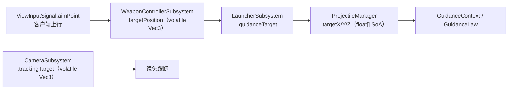
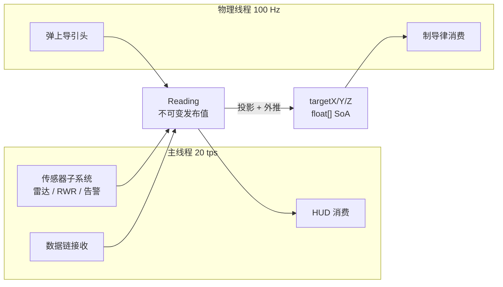
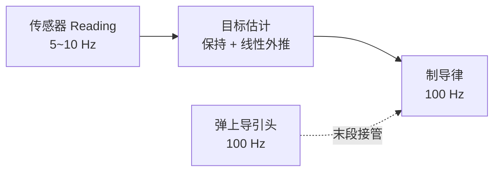

# Machine-Max 感知系统 — Reading 统一对象与目标估计 · 设计（初步）

> **状态**：计划中（未实现；代码中尚无 `Reading` 相关类型）
> **定位**：本文自包含——只读本文即可理解感知对象的形态、职责归属与数据流，不要求先读其他文档。
>
> 本文是**初步设计**：给出对象模型、职责归属与接入点。多传感器融合、电子对抗、比例导引按 §九 排除在本文之外。
>
> 相邻文档（各自负责自己的主题，本文引用而不复制其内容）：
>
> - `docs/plan/进行中/武器系统-组件化投射物与类型体系设计.md` — 投射物类型体系；其 §4.1 `SeekerAttr` 是导引头属性的落点。
> - `docs/plan/已实现/武器系统-制导组件实现备忘.md` — 制导律、SoA 目标数组与服务端权威同步的说明。
> - `docs/wiki/4-物理与战斗机制/4.7-投射物.md` — 投射物的玩家向说明。

---

## 一、问题

导弹制导、车载传感器、HUD 与未来的 AI 都需要"目标信息"，这些需求当前以**裸世界坐标点**表达：



坐标点能表达"在哪"，表达不了下列信息：

| 缺失的信息 | 用途 |
|---|---|
| **是谁** | 同一目标跨 tick 的稳定身份，供 AI、多目标管理与去重 |
| **多可信** | 欺骗、衰减、丢锁的载体 |
| **多新** | 判定陈旧、超时丢锁 |
| **怎么来的** | HUD 符号样式、开发期排查 |
| **多强** | 门限判定与信号强度显示 |

缺少统一对象时，每个新消费者各自造一个"目标信息"结构。本文定义**一个**对象 `Reading` 承担这些字段，作为传感器类信息在系统内的通用货币。

---

## 二、设计立场

三条立场决定后续所有取舍。

**立场 1 — 一律携带绝对位置。**
这是游戏而非仿真：不需要建模"能不能测到"，只需要制造玩家的信息劣势。世界里的每个实体都持有绝对位置，传感器的职责是决定"测得多准、看到哪个、会不会看错"。因此 `Reading` 始终带绝对位置，不设"无位置"分支。

**立场 2 — 退化由拥有该传感器的元件实现，且只实现一次。**
视场门限、方位化、噪声、强度衰减属于"该传感器的物理"，写在产生该 `Reading` 的元件里。消费者只**选字段**，不重算传感器物理。若两个消费者各自把位置转成方位，两处的钳制与噪声略有出入即产生静默不一致。

**立场 3 — 外推属于消费端，融合暂不做。**
消费者按自身需要把低频 `Reading` 外推为高频目标估计（§五）；这是对已给出的估计做预测，不属于立场 2 禁止的"重复实现传感器物理"。多传感器对同一目标的融合（§九）留作未来接缝。

---

## 三、Reading 对象

### 3.1 形态

`Reading` 是**不可变发布值**：构造完成后不再改动，可安全跨线程传递。

```java
/** 传感器类信息的统一发布值（不可变）。 */
public record Reading(
    long   id,               // 稳定身份：同一目标在持续存在期间保持同值
    float  posX, posY, posZ, // 绝对位置（米，世界坐标），始终有效
    float  velX, velY, velZ, // 目标速度估计（m/s），hasVelocity 为假时填 0
    boolean hasVelocity,     // velX/Y/Z 是否可用于外推
    ReadingSource source,    // 信息来源
    float  quality,          // 置信度 0..1；欺骗、衰减、丢锁作用于此
    float  intensity,        // 归一化信号强度 / 信噪比；供门限判定与显示
    long   lastUpdateTick,   // 最后更新时刻（物理步整数计数）
    Handle handle            // 活目标句柄，无则为 Handle.HANDLE_NONE
) {}
```

`id` 由产生者分配，同一产生者在目标持续存在期间保持同值。

### 3.2 字段准入规则

**只放有消费者的字段。** 判定依据是"谁读它"，不是"听起来该有"：

- `intensity`：传感器自己读（门限），HUD 读（信号条）→ 放在对象上。
- 雷达多普勒、红外对比度这类只有本体逻辑使用的量：留在传感器内部，不进 `Reading`。

每加一个传感器就往公共对象加字段，是对象膨胀的起点；字段的准入判据必须固定在"有消费者"上。

### 3.3 原语约束

`Reading` 只放原始类型、枚举、句柄，不放 `Vec3`、`Optional`、`List`、`String`。这类字段会在每次构造时额外分配并破坏逃逸分析，是高频对象唯一真实的分配成本来源。"无句柄"用哨兵 `Handle.HANDLE_NONE` 表达，而非 `Optional`。

`Handle` 是允许的唯一嵌套值类型，它随 `Reading` 一并分配；在 §五 的频率下（每秒数十次量级）可接受。若 `Reading` 将来进入更高频的路径，把 `Handle` 的三个字段平铺进 `Reading` 即可消除该分配。

### 3.4 信息来源

```java
public enum ReadingSource {
    DIRECT,        // 直连真值：获得方直接持有目标，位置与身份无误差
    COMMAND,       // 指令制导：由本载具武器控制器给出的瞄准点
    DATALINK,      // 数据链：由他方载具或第三方转发
    RADAR,         // 主动雷达回波
    INFRARED,      // 被动红外
    RWR,           // 雷达告警：方位类信息
    HIGH_ENERGY    // 高能武器蓄能等强辐射源
}
```

`source` 供 HUD 选择符号样式与开发期排查使用。**它不进入制导与 AI 的判据**——消费端按模态分支意味着每加一种来源都要改所有消费者。

### 3.5 句柄

`Handle` 是对活目标的引用，用于读取当前真值：

```java
/** 活目标句柄：按 kind 择一填写有效字段。 */
public record Handle(HandleKind kind, int objId, @Nullable UUID vehicleUuid) {
    public static final Handle HANDLE_NONE = new Handle(HandleKind.NONE, 0, null);
}

public enum HandleKind {
    NONE,
    DESTROYABLE_OBJECT, // objId = DestroyableObject.getId()
    VANILLA_ENTITY,     // objId = 原版实体 id
    VEHICLE             // vehicleUuid = VehicleCore 的 UUID
}
```

- `DESTROYABLE_OBJECT` —— `DestroyableObject.getId()`，进程内自增、随创建包同步到客户端，覆盖 `SubPart` 与投射物。
- `VANILLA_ENTITY` —— 原版实体 id，覆盖玩家与生物。
- `VEHICLE` —— `VehicleCore` 的 UUID，经 `ObjectManager.getVehicleByUUID` 解析，覆盖整台载具。

两条约束：

1. **句柄优先，位置兜底。** 句柄可在读取时解析为当前真值（`source = DIRECT` 即此形态）；句柄失效或目标离开同步范围时，`Reading` 以最后已知位置独立成立，构成记忆航迹。
2. **句柄不是裸引用。** 跨线程与跨对象销毁周期只传句柄，不传 `SubPart` / `VehicleCore` / `Entity` 引用。

---

## 四、生命周期与线程

`Reading` 的产生与消费跨两类线程：



| 环节 | 线程 |
|---|---|
| 车载传感器产生 `Reading` | 主线程（子系统 tick） |
| 弹上导引头产生 `Reading` | 物理线程 |
| `Reading` → SoA 原语投影与外推 | 物理线程 |
| 制导律消费 | 物理线程 |
| HUD / AI 消费 | 主线程 |

两条硬约束：

- **`Reading` 不进 `GuidanceContext`。** 制导热路径只读扁平原语（`targetX/Y/Z`），与 `GuidanceContext` 的既有设计一致；`Reading` 是其上游表示。
- **不设同步用的 `Reading[]` 数组。** SoA 目标三元组承担热路径投影，`Reading` 对象不进入物理步循环。

---

## 五、两频架构与目标估计

制导要的不是传感频率，而是**目标估计的频率**，两者不必相同：



`ProjectileManager` 的 `targetX/Y/Z` 天然是**零阶保持器**：传感器不更新时，制导每步读到同一坐标。对纯追踪而言，追踪一个冻结的点是收敛的，代价是滞后而非失稳。

在投影步（Launcher → SoA）加入一行线性外推即可压掉大部分滞后：

```text
目标估计 = 最后位置 + 速度估计 × (now − lastUpdateTick)
                        （hasVelocity 为假时退化为零阶保持）
```

滞后量级（目标速度 × 传感周期）与 `9m133_kornet.json` 的战斗部半径对照：

| 传感周期 | 周期 `T_s` | 20 m/s 目标的滞后 | 对照 `near_radius` 2.5 m / `max_radius` 7 m |
|---|---|---|---|
| 5 Hz | 0.2 s | 4 m | 吃掉大半杀伤半径 |
| 10 Hz | 0.1 s | 2 m | 可接受 |
| 20 Hz | 0.05 s | 1 m | 无感 |

该弹 `structural_limit_g` 为 15、`mass` 26 kg、`base_velocity` 50 m/s，可用横向加速度远高于跟踪所需——**终端精度的瓶颈是数据新鲜度，不是机动性。**

丢锁判据：`now − lastUpdateTick` 超过传感器属性给定的超时即视为失效，制导退回纯弹道。时间戳一律用**物理步整数计数**，不用浮点秒——与 `burnTime` 在两端同速率累加同理，避免跨线程漂移。

消费端不按模态分支，但**制导律对采样率的敏感度不同**：纯追踪对低频免疫；比例导引依赖视线角速率，需对低频阶梯做微分，会放大噪声，因此 PN 落地前须先有滤波或足够的估计率。

---

## 六、退化归属

| 行为 | 归属 | 理由 |
|---|---|---|
| 视场门限（目标是否在导引头 FOV 内） | 传感器 / 导引头 | 该传感器的物理 |
| 方位化（RWR 丢弃距离，只保留方向） | 传感器 | 该传感器的物理 |
| 强度衰减、加噪、诱饵判定 | 传感器 | 该传感器的物理 |
| 选择订阅哪个来源 | 消费者 | 消费策略 |
| 低频 → 高频外推 | 消费者 | 各消费者需求不同（HUD 不需要，制导需要） |
| 显示取舍（RWR 只画方位环） | 消费者（显示层） | 表现层决策 |

**RWR 的距离**：其 `Reading` 依立场 1 带绝对位置，显示层选择不画距离。玩家的信息劣势由"界面不呈现"制造，不在数据层制造无位置对象。

---

## 七、与现有代码的接法

| 位置 | 动作 |
|---|---|
| `common/mech/sensor/` | 定义 `Reading`、`ReadingSource`、`Handle` |
| `WeaponControllerSubsystem.targetPosition` | 产出 `source = COMMAND` 的 `Reading` |
| `LauncherSubsystem` 的目标推送 | 以 `Reading` 为输入，投影时按 §五 外推 |
| `ProjectileManager.targetX/Y/Z` | 制导热路径的扁平投影，由 Launcher 在投影时写入 |
| `ProjectileManager.setGuidanceTarget` | 写扁平三元组的入口（objId + 三个坐标） |
| `GuidanceContext` / `GuidanceLaw` | 消费扁平三元组，不涉及 `Reading` |
| `CameraSubsystem.trackingTarget` | 可接入同一 `Reading`，作为其消费方之一 |

`Reading` 若需下发客户端（供 HUD 消费），须可编解码；本文只声明该需求，不定义具体载荷。

---

## 八、命名与位置

- 对象名：**`Reading`**（感知对象）、**`ReadingSource`**（来源）、**`Handle`**（活目标句柄）。
- 包位置：**`common/mech/sensor/`**。
- **不引入第二层融合对象**（`Track` / `Contact`）：在"一律携带绝对位置"下，测量与航迹在数据形态上重合，引入第二层只增加需要跨类型分派的消费者。融合的接缝留在"多来源如何择一"这一步（§九）。

---

## 九、本设计不做

| 项 | 说明 |
|---|---|
| 多传感器融合 / 滤波 / 航迹管理 | 同一目标被多个传感器观测时会出现多条 `Reading`；由消费端按"质量最高 / 最新"择一，专门的融合层留待出现真实需求时引入 |
| 电子对抗与诱饵 | `quality` 与 `source` 是预留的作用点 |
| 被动测向的专用表示 | RWR 依立场 1 携带位置，显示层决定是否呈现距离 |
| 比例导引 / 增广比例导引 | 见 `docs/plan/已实现/武器系统-制导组件实现备忘.md` §十四 |
| 导引头属性落 JSON（`SeekerAttr`） | 见 `docs/plan/进行中/武器系统-组件化投射物与类型体系设计.md` §4.1 |
| HUD / AI 实现 | 本文只定义它们消费的对象 |
| 网络同步载荷 | 只声明 `Reading` 须可编解码 |

---

## 十、升级触发条件

出现下列任一项时，回到本文引入相应机制。

- **第二条真实传感器上线**（`RADAR` / `INFRARED` / `RWR` 中出现第一个）→ 需要来源择一规则。
- **第二个真实消费者上线**（HUD 画多目标 / AI 战术决策）→ 需要稳定的身份与陈旧语义。
- **比例导引落地** → 需要滤波或提高目标估计率。
- **`Reading` 需要下发客户端** → 需要编解码与载荷定义。

---

## 十一、验证要点

- **直连真值路径**：`source = DIRECT` 的 `Reading` 应使制导弹精确指向目标。
- **陈旧判据**：停止推进 `lastUpdateTick` 后，制导弹应在超时后退回纯弹道。
- **外推有效性**：对匀速移动目标，开启外推后的脱靶量应显著小于零阶保持。
- **指令路径一致**：未启用外推时，`source = COMMAND` 的 `Reading` 应使制导弹精确指向瞄准点。
- **线程**：`Reading` 的产生与投影打下线程名日志核对。
- **分配**：连续运行后确认无逐步累积的分配增长（`Reading` 为不可变短命值或低频值）。