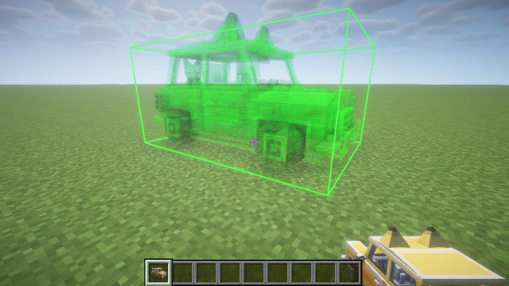
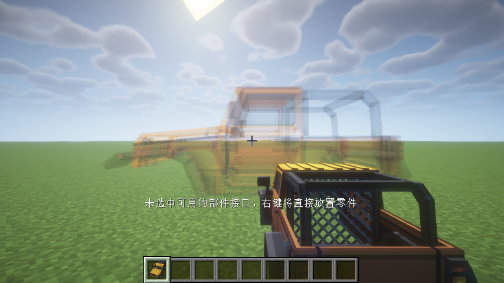
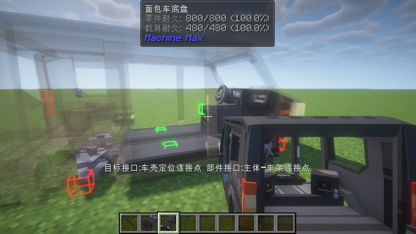
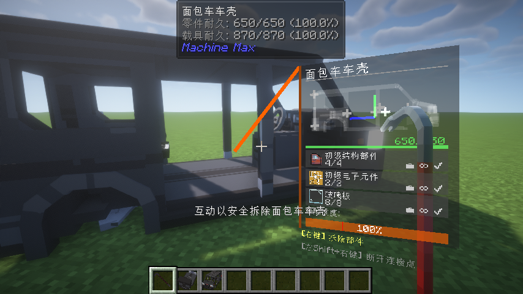

# 1.3 创造模式：五分钟造一辆车

进入创造模式后，你可以跳过收集材料和研发的步骤，直接从物品栏中取出部件或整车开始体验。下面介绍两种造车方式，以及如何拆卸不需要的部件。

## 方法一：直接放出装配体

创造模式物品栏中提供了预组装的装配体（AssemblyItem），它是一个已经拼接好的部件组，通常包含底盘、车轮、发动机、座舱等核心部件，放出即可驾驶。

手持装配体物品，右键单击。如果放置位置没有与其他物体发生碰撞，装配体就会以完整的载具形态出现在世界上。此时靠近座舱按下互动键（默认F）即可上车驾驶。

*图示：手持装配体物品，地面上显示绿色轮廓表示可以放置，右键放出载具。*

## 方法二：从部件开始拼装

如果你希望自己决定载具的结构，可以从创造模式物品栏中取出单个部件（PartItem），逐一拼装。

### 放置第一个部件

手持部件物品，将准星对准地面，屏幕上会显示部件的预览轮廓。右键点击，部件即以独立载具的形式放置到世界中。

*图示：手持底盘部件，地面显示放置预览，右键放置。*

### 拼接更多部件

将另一个部件拿在手中，将视线对准已放置部件上的连接点。屏幕上方会显示当前选中的目标连接点名称和手中部件的接口信息。

- 按下 **C 键**（默认）循环切换当前部件使用的连接点，直到选中合适的接口。
- 按下 **B 键**（默认）以 90 度为步进旋转部件的安装姿态，以适应不同的安装角度。
- 右键确认拼接。如果两个连接点匹配（一方为简单连接点，另一方为高级连接点，或双方均为简单连接点，且部件标签满足要求），部件会自动吸附并完成连接。

*图示：对准底盘上的连接点，按 C 切换接口、按 B 调整角度后右键完成拼接。*

重复以上步骤，依次装上发动机、车轮、座椅等部件，一辆完整的载具就拼装完成了。

> 拼装过程中，手上的部件会实时显示半透明预览轮廓，方便你判断拼接位置和姿态是否正确。

### 基本驾驶操作

载具拼好后，靠近座椅按下互动键（默认 **F**）即可上车。驾驶操作如下：

- **W / S**：前进 / 后退
- **A / D**：左转 / 右转
- **空格键**：手刹（按住时锁定车轮，适合急停或漂移）
- **J**：按住0.5秒下车

## 拆卸部件与断开连接点

如果需要调整载具结构或回收部件，可以使用撬棍（CrowbarItem）。

- **安全拆卸部件**：手持撬棍，视线对准要拆除的部件，右键点击。如果该部件没有与其他部件硬连接，部件会被直接拆下。
- **断开特定连接点**：潜行状态下，将撬棍的准星对准两个部件之间的连接点，右键点击。这会断开该连接点而不会损坏部件，适合在不解体整个部件的情况下移除某个连接。

*图示：手持撬棍对准部件，右键可安全拆下；潜行对准连接点可单独断开接口。*

## 下一步

你已经掌握了创造模式下最基本的造车方法。接下来可以阅读 [1.4 生存模式起步](1.4-生存模式起步.md)，了解在生存模式中如何通过研究和制造获得部件。也可以直接跳转到第二章，深入了解载具的层级结构、部件类型和各个子系统的工作原理。
