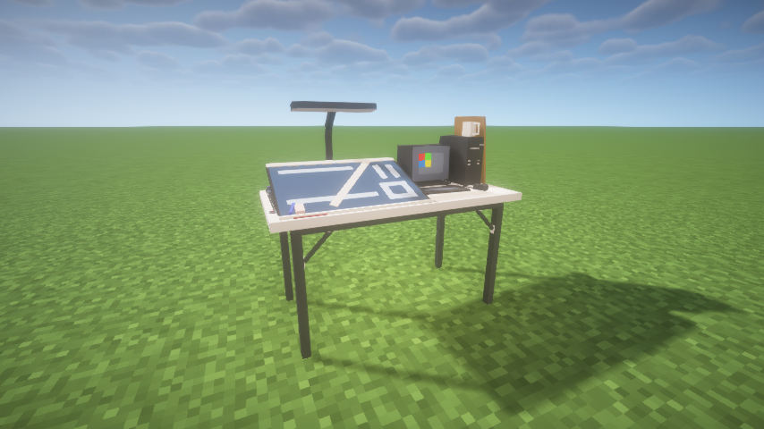
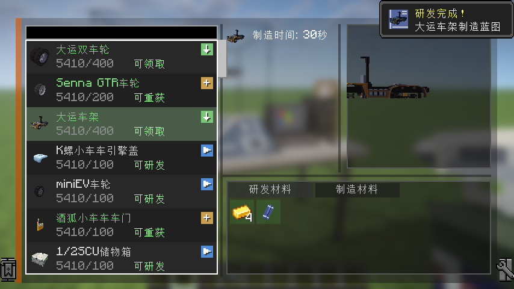
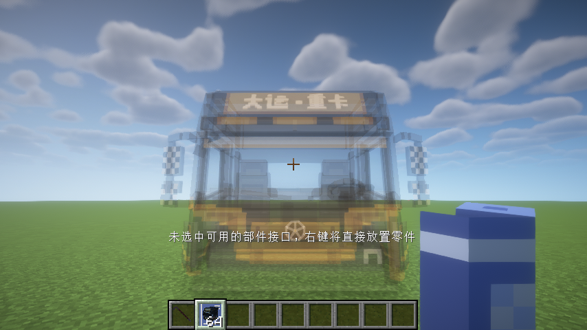
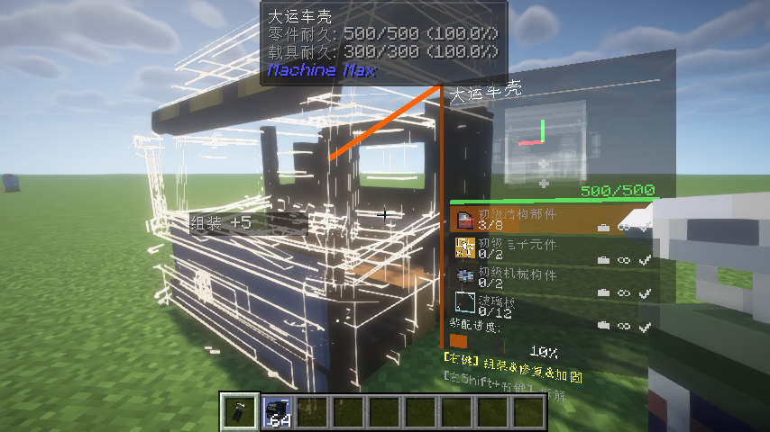

# 1.4 生存模式起步

生存模式下造车需要经历从采集、研发到制造、组装的全流程。本章节按操作顺序说明从零起步的步骤。

## 一、搭建研究台

研究台（ResearchTableBlock）是科技发展的起点。用基础材料合成研究台后，将其放置在地上，右键打开研究界面。

*图示：研究台占用 2×2 的空间，右键任意位置即可使用。*

研究台的 GUI 分为左右两栏：左侧显示科技树与研究项目，右侧显示当前选中的研发项目详情。

## 二、获取研发点

研发点（Research Point，简称 RP）是解锁新技术的货币。以下几种途径可以获得研发点：

- **获得经验**：获得任意原版经验即可获得相应数量的研发点，这是前期最主要的来源。
- **组装部件**：使用焊枪组装部件时会附带产出研发点。
- **维修载具**：对载具进行维修也能获得少量研发点。
- **命中载具**：命中载具也能获得少量研发点。
- **伤害载具**：对载具造成伤害也能获得与伤害等量的研发点。

研发点数量会显示在每个研究条目下，由玩家个人持有，而非储存在研究台中。

## 三、研发项目，解锁制造蓝图

获得足够的研发点和材料后，在研究台左侧选择一个未解锁的项目，点击研究按钮。研究不仅会消耗研发点，还会从你的物品栏中扣除研发所需的**材料**（研究所需的材料和消耗数量会显示在界面右侧）。

*图示：选择项目后消耗研发点和材料完成研究，解锁对应的制造配方。*

研究完成后，你会获得对应部件的**制造蓝图**（FabricatingBlueprintItem）。它是一个蓝色为底的物品，记录了该部件的制造配方。如果蓝图不慎丢失，在研究台左侧找到已完成的项目，点击按钮右侧的回收图标即可**免费重新领取**一份。

## 四、放置制造蓝图

手持制造蓝图，它的用法与创造模式中的零件物品类似：

- 将准星对准已有部件上的连接点，按 **C** 切换接口、按 **B** 调整安装角度，右键即可将蓝图中的部件以**未组装**状态拼接到目标载具上。
- 也可以直接右键地面，将部件作为一个独立的载具放置出来。

此时放置出来的部件组装进度为 0，材料进度也为 0——它只是一个空壳，需要后续投入材料才能逐步完成组装。

*图示：手持制造蓝图，按照与创造模式相同的方式将未组装的部件放置到世界中。*

## 五、使用焊枪组装

焊枪（WeldingTorchItem）是生存模式中最常用的工具，负责组装部件、维修载具和修复连接点。

### 投入材料完成组装

手持焊枪，右键对准需要组装的部件并**长按不松**，焊枪会持续工作：

- **一般状态**（非潜行）：焊枪会自动从你的物品栏中消耗配方所需的材料，逐步提高部件的组装进度。同时焊枪也会自动修复该部件上耐久度不满的零件、子系统和连接点。
- 焊枪工作时会有火花粒子效果和焊接音效作为反馈。

*图示：手持焊枪对准部件，长按右键，焊枪会消耗背包中的材料逐步完成组装。右侧 HUD 显示当前部件的名称、总进度条（橙色线即为功能性阈值）和材料清单。*

### 组装进度与功能性阈值

在手持焊枪或撬棍对准部件时，屏幕左侧会显示一个装配 HUD。HUD 下方是总进度条，其上列出了该部件所需的材料清单以及你背包中已有的数量。

进度条上有一条**橙红色竖线**，代表该部件的**工作阈值**（FunctionalThreshold）。需要注意：

- 组装进度超过橙色线后，该部件即可**正常运作**（例如发动机可以输出动力、灯可以点亮）。
- 不需要把进度填满到 100% 就能使用，这对于材料吃紧的早期生存阶段很有帮助。
- 进度不满的部件耐久度上限会相应降低，使用时需要注意保护。

### 拆解与回收

如果放错了部件或者需要回收材料，可以**潜行**（按住 Shift）后使用焊枪对准已组装的部件，焊枪会逆向工作，逐步拆解部件并返还材料到你的物品栏中。

## 下一步

至此你已经掌握了生存模式从研发到制造再到组装的完整流程。接下来可以阅读第二章，深入了解载具系统中各类部件的功能和拼装技巧。
