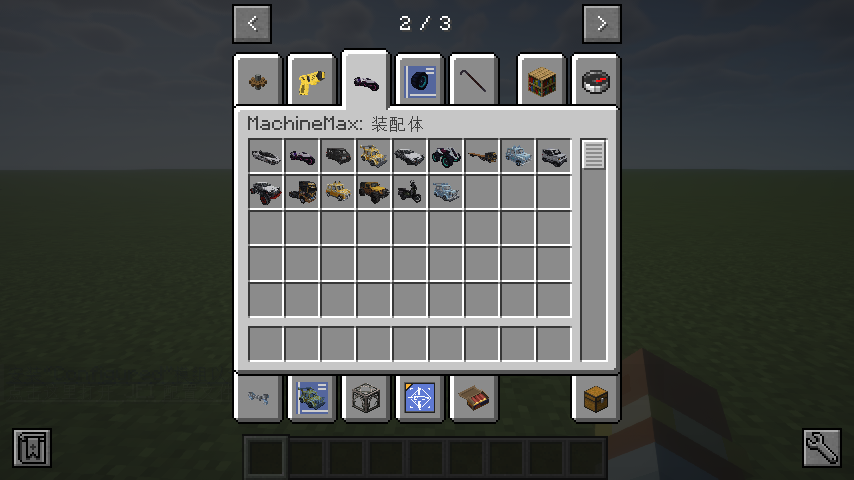

# 1.6 官方内容包载具一览

MachineMax 官方内容包（Machine-Max Official Pack）目前提供了十余款风格各异的载具，涵盖日常代步、越野探险、赛道竞速与重载运输等场景。下表按类别列出所有可用车型。

> 载具的数量和种类会随模组版本持续扩充，以当前安装版本为准。

## 小型车

| 载具名称                      | 说明                                   |
| ------------------------- | ------------------------------------ |
| **酒狐小车车**（Wine Fox）       | 一款设计独特的小型城市代步车，外观时尚可爱，适合在城市中短途出行使用。  |
| **酒狐小车车 GT**（Wine Fox GT） | 酒狐小车车的改装版本，经过 GT 套件升级后越野与赛道性能得到了提升。  |
| **K螺小车车**（Kluo）           | 一款复古风格的紧凑型油改电轿车，尽管续航有限，但加速能力和极速不容小觑。 |
| **K螺小车车 GT**（Kluo GT）     | K螺小车车的 GT 改装版本，操控表现和赛道能力进一步增强。       |
| **宏光 miniEV**             | 上汽通用五菱旗下的四座新能源车，聚焦短途便捷出行场景。          |

## 轿车与跑车

| 载具名称                       | 说明                                                |
| -------------------------- | ------------------------------------------------- |
| **丰田 COROLLA AE86**        | AE86 是丰田出品的经典 FR（前置引擎后轮驱动）紧凑型轿车，以轻量化的车身和出色的操控性著称。 |
| **丰田 COROLLA AE86（全地形改装）** | AE86 的四轮驱动改装版本，换装了更强大的引擎、变速箱和全地形轮胎，越野能力大幅强化。      |
| **迈凯伦 Senna GTR**          | 极致的赛道化超级跑车，采用先进的空气动力学设计，能在高速行驶时产生巨大的下压力。          |

## 越野车

| 载具名称                     | 说明                                      |
| ------------------------ | --------------------------------------- |
| **吉普牧马人**（Jeep Wrangler） | 经典越野车，以强大的越野性能和坚固的车身结构而闻名，适合在各种复杂地形中行驶。 |
| **探路者 R700**             | 一款多功能越野车，专为探险和户外活动设计，具有良好的通过性和可靠性。      |

## 商用车

| 载具名称              | 说明                                    |
| ----------------- | ------------------------------------- |
| **面包车**（Van）      | 以极致可靠性和实用性著称的轻型商用车，适合拉货载物，是创业起步的理想伙伴。 |
| **大运重型卡车**（Dayun） | 重型卡车，具有强大的载重能力和可靠的性能，广泛应用于物流运输。       |
| **大运重型卡车（附半挂拖车）** | 大运重卡的挂车版本，牵引半挂拖车，适合运输大批量货物。           |

## 特殊载具

| 载具名称                   | 说明                                         |
| ---------------------- | ------------------------------------------ |
| **净化（Purge）**（VN）      | 一台高速摩托车，采用极具攻击性的低趴流线造型与双轮驱动结构，能在狭窄巷道中灵活穿梭。 |
| **统领（Sovereign）**（SZN） | 一台重型全地形突击载具，采用棱角切割式车身与宽体化设计，适合在复杂地形下突破行驶。  |

*图示：创造模式物品栏中的装配体标签页，列出了所有官方载具的装配体物品。*

> 在创造模式中，你可以在物品栏的装配体标签页下直接拿到这些载具的装配体。在生存模式中，需要通过研究台解锁对应的制造配方才能获取。关于搭配、改装和载具的详细参数，请参考第二章的各个章节。

## 内容包制作者的参考建议

如果你是内容包作者，打算参考官方载具来学习零件配置，以下几点可供参考：

- **宏光 miniEV** 、**统领（Sovereign）**和 **净化（Purge）** 的零件结构相对简单，使用的子系统种类较少，适合作为入门参考，快速理解零件定义、连接点配置和基本子系统的组合方式。
- **酒狐小车车（Wine Fox）** 和 **K螺小车车（Kluo）** 涉及了绝大部分子系统的功能与高级应用场景，包括复杂的传动链、信号传递、照明系统和可动车门部件等。两款车还拥有细致的分件设计和车损效果（不同部位受损会呈现对应的外观变化），适合作为进阶内容包的参照范例。
- **迈凯伦 Senna GTR** 详细配置了空气动力学特性，适合作为下压力等气动系统相关配置的参考。

