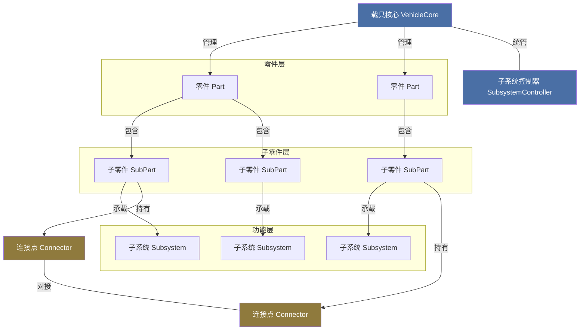

# 2.1 载具概念与层级

在 MachineMax 中，一辆载具不是由单一模型定义的，而是由多个零件（Part）通过连接点组合而成的一个整体。这一章会深入说明载具的组成结构、拼装方法和相关工具的使用方式。作为开篇，本节先介绍载具的几个基本概念和它们之间的层级关系。

## 零件（Part）——组装的基本单元

零件是玩家能够直接操作的组装单元。当你从物品栏中取出一个底盘、发动机或车轮并放置到世界中时，你放置的就是一个零件。每个零件都有属于自己的类型（PartType），类型定义了该零件的基础属性：它对载具总耐久度的贡献系数、受到冲击时的伤害传递系数、正常工作所需的最低组装进度（即功能性阈值），以及该零件拥有哪些变体。

一个零件拥有独立的质量和耐久度，拼装进度决定了它的最大耐久上限——只有完全组装好的零件才能发挥全部的结构强度。零件的耐久度如果归零，该零件就会被摧毁并失去所有功能。实际操作中，你可以通过手持撬棍或焊枪对准零件来查看它的名称、组装进度和当前耐久度等信息。

## 子零件（SubPart）——零件内部的细分组件

子零件是零件内部的细分单元，玩家通常不会直接与子零件进行交互，但它决定了零件具体拥有哪些碰撞体积、外观模型和功能挂载点。一个零件可以包含一个或多个子零件。例如，一个底盘零件可能同时包含底盘主体和保险杠两个子零件，它们共同构成了底盘这个零件的碰撞外形和视觉表现。

每个子零件都可以独立承载碰撞体（决定与外界物体或地形的碰撞判定）、连接点（用于与其他零件对接的接口）、交互判定区域（例如座舱的上车检测范围）和子系统（为载具提供具体的功能）。从物理模拟的角度来看，子零件才是真正参与物理计算的单位——载具的每一个刚体、每一个碰撞体都属于某个子零件。

## 载具核心（VehicleCore）——载具的管理中枢

当一个零件被放置到世界中时，它会自动成为一个独立载具的一部分。每辆载具都有一个载具核心（VehicleCore），它负责管理该载具内部所有零件的连接关系、整体物理模拟、生命值、速度和质量等全局属性。你可以将载具核心理解为载具的"大脑"——它不直接对应某个零件，而是作为整个载具的管理者存在。

当你把一个新零件拼接到已有的载具上时，两个载具的核心会合并成一个，零件的拓扑结构也随之更新。同样，当你用撬棍拆下一个零件时，如果被拆下的零件还带有其他连接的零件，载具就会分裂为两个独立的载具核心。载具核心还会统一管理载具内的所有子系统，协调信号在零件之间的传递以及能量在全车范围内的分配。

## 连接点（Connector）——零件之间的接口

零件与零件之间通过连接点（Connector）对接。连接点分为简单连接点和高级连接点两种。简单连接点只负责提供物理对接；高级连接点除了对接外还可以定义关节属性，例如允许对接后的零件绕某个轴旋转或沿某个方向滑动，从而实现车门开合、悬挂摆动等效果。两个匹配的连接点对接后，零件之间会建立物理约束，同时连接点上还可以附带信号端口和机械能端口，让信号和动力能够跨零件传递。

## 子系统（Subsystem）——功能行为的载体

载具能做什么，取决于它的零件上安装了哪些子系统。子系统是挂载在子零件上的功能模块，发动机能输出动力是因为有引擎子系统，方向盘能控制车轮转向是因为有车辆控制子系统，车灯能发光是因为有照明子系统。子系统通过信号系统接收控制指令，通过能量网获取电力，通过机械能端口传递转速和扭矩。子系统的种类、数量和配置方式共同决定了载具的实际功能表现，这部分内容会在第三章逐一展开。

## 层级关系总结

从玩家视角看，一辆载具的层级结构可以这样理解：最上层是载具核心，它统管整辆车；往下是零件，也就是你在世界中拼装时拿在手里的那些部件；再往内，每个零件由若干子零件构成，子零件承载了碰撞体、模型和功能模块；最底层是子系统，它们挂在子零件上，赋予载具具体的驾驶和功能行为。连接点则横跨在零件之间，将各个零件物理地连接在一起，同时也负责信号和能量的通路。

接下来的几节会分别介绍零件的拼装方法、组装修复流程、零件变体与涂装系统，以及如何用蓝图保存和批量制造载具。
