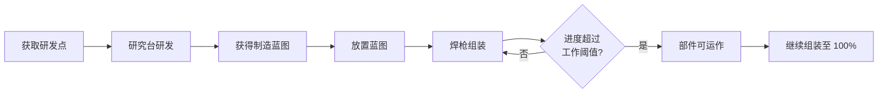
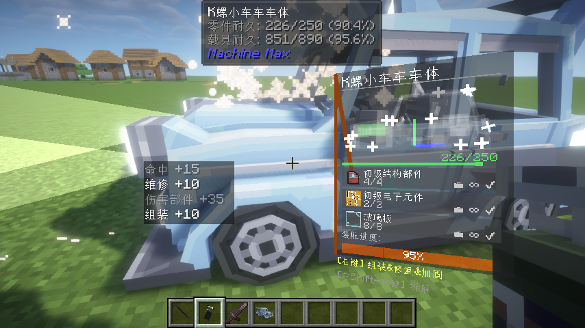

# 2.6 蓝图系统

在前几节中，我们已经介绍了零件拼装、组装修复、变体和涂装。本节聚焦生存模式中和蓝图相关的流程：如何通过研发解锁蓝图、如何领取与重新获取蓝图，以及蓝图在实际造车中的作用。

蓝图系统的核心目标很简单：把“能不能造某个零件”这件事，和玩家的研发进度关联起来。你先通过研究台完成对应研发，随后才能稳定地进入该零件的制造与组装流程。

## 蓝图在生存流程中的位置

对玩家来说，蓝图系统通常出现在下面这条链路中。

先通过战斗、维修、组装或经验获取研发点，再在研究台完成目标项目，获得对应制造蓝图。之后你可以用蓝图放置该零件的未组装形态，并通过焊枪逐步投入材料完成它。

需要区分的是，蓝图负责的是“解锁和承载制造配方”，不是直接给你一件成品零件。即使已经拿到蓝图，放置后的部件仍然要经过组装阶段。

*图示：生存模式下从研发点获取、研究解锁到蓝图放置与组装的基本流程。*

## 研发点获取

研发点（RP）是研究台推进项目时使用的资源。当前版本里，玩家主要会从以下行为中持续获得研发点。

第一类是获取原版经验。经验会直接折算为研发点，是前期最稳定的来源。

第二类是和载具维护有关的操作。使用焊枪推进组装进度，或对受损部件进行维修，都会持续提供研发点。

第三类是与载具交互的战斗行为。命中部件、对部件造成伤害，也会提供一定研发点。

这些来源可以并行积累，不需要固定刷某一种。实际游玩中，边造边修边测试通常就能自然覆盖大部分研发消耗。

*图示：研发点来源提示示例，包含经验、组装、维修与战斗相关来源。*

## 在研究台中解锁蓝图

打开研究台后，左侧是项目列表，右侧是当前项目详情。一个项目能否开始，取决于三个条件是否同时满足：

- 前置项目已完成
- 研发材料齐全
- 研发点达到需求

满足条件后即可开始并完成研究。完成后，该项目会进入“可领取成果”状态。对于蓝图类研发，成果就是对应的制造蓝图。

如果某个项目始终不可用，优先检查前置是否完成；如果显示可研发但无法开始，通常就是研发点或材料不足。

## 蓝图领取与暂存

蓝图研发完成后，成果会先进入研究成果暂存，而不是自动塞入背包。你需要在研究台界面主动点击领取。

领取时如果背包有空间，蓝图会进入背包；如果背包已满，成果会掉落在玩家附近。领取完成后，该项目的暂存成果会被清空。

这个设计的好处是，你可以先把多个项目研发完，再按需要分批领取，不必在研究过程中频繁清背包。

*图示：研究台中蓝图项目的状态、材料需求与研发点需求显示。研发完成后在研究台界面领取蓝图成果。*

## 蓝图重新获取

如果某个项目已经研发完成，但对应蓝图丢失或消耗掉了，可以在研究台里重新获取该项目成果。

重新获取的前提是：

- 该项目已经研发完成
- 当前没有该项目的待领取成果

满足条件后即可再次生成并领取该蓝图。对于玩家来说，这意味着蓝图丢失并不会导致研发进度回退，只需要回到研究台补领即可。

## 蓝图与生存组装的关系

蓝图物品在使用方式上与普通部件物品相似，都可以直接放置或拼接到已有载具上。但蓝图放出的部件是未组装状态，后续仍需焊枪投入材料。

另外，组装修复本身不再要求你必须手持或持有对应蓝图。也就是说，只要目标部件已经在世界中，你就可以继续对它进行组装推进和维修。蓝图更多承担“研发解锁与配方入口”的职责，而不是焊接操作时的硬性门槛。

## 玩家常见建议

在生存流程中，蓝图系统最常见的卡点是“项目可见但推进缓慢”。如果遇到这种情况，通常按下面顺序排查就够了：先看前置，再看研发材料，最后补研发点。

对于常用零件，建议在研发完成后先领取并留存一份蓝图，避免临时要用时来回切研究台。若中途遗失，也可以直接通过重获功能补回，不需要重复研发。

掌握以上流程后，蓝图系统就会变成一个稳定的中枢：它把你的战斗、采集和组装行为沉淀为研发进度，再把研发进度转化为可持续的载具制造能力。
