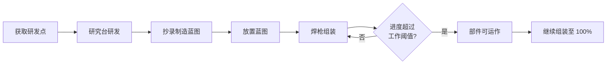
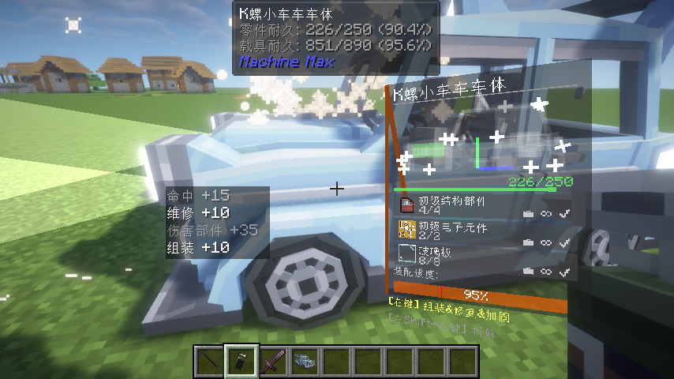

# 2.6 蓝图系统

在前几节中，我们已经介绍了零件拼装、组装修复、变体和涂装。本节聚焦生存模式中和蓝图相关的流程：如何通过研发解锁蓝图、如何抄录蓝图，以及蓝图在实际造车中的作用。

蓝图系统的核心目标很简单：把“能不能造某个零件”这件事，和玩家的研发进度关联起来。你先通过研究台完成对应研发，随后才能稳定地进入该零件的制造与组装流程。

## 蓝图在生存流程中的位置

对玩家来说，蓝图系统通常出现在下面这条链路中。

先通过战斗、维修、组装或经验获取研发点，再在研究台完成目标项目，然后在已完成的项目上抄录出对应制造蓝图。之后你可以用蓝图放置该零件的未组装形态，并通过焊枪逐步投入材料完成它。

需要区分的是，蓝图负责的是“解锁和承载制造配方”，不是直接给你一件成品零件。即使已经拿到蓝图，放置后的部件仍然要经过组装阶段。

```mermaid
flowchart LR
    A[获取研发点] --> B[研究台研发]
    B --> C[抄录制造蓝图]
    C --> D[放置蓝图]
    D --> E[焊枪组装]
    E --> F{进度超过<br>工作阈值?}
    F -->|是| G[部件可运作]
    F -->|否| E
    G --> H[继续组装至 100%]
```

*图示：生存模式下从研发点获取、研究解锁到蓝图放置与组装的基本流程。*

## 两类制造蓝图

制造蓝图物品有两种，都在研究台上抄录产出，但用途完全不同：

| 蓝图物品   | 物品 id                                  | 来源                                         | 用途                              |
| ------ | -------------------------------------- | ------------------------------------------ | ------------------------------- |
| 零件制造蓝图 | `machine_max:part_fabricating_blueprint` | 在 `unlock_recipe` 指向零件配方（`machine_max:part_fabricating`）的已研发条目上抄录 | 可放置为线框零件、可参与装配，是生存流程中造零件的入口     |
| 通用制造蓝图 | `machine_max:fabricating_blueprint`      | 在 `unlock_recipe` 指向通用制造配方（`machine_max:fabricating`）的已研发条目上抄录 | 只有凭证与展示语义，不可放置、不参与装配            |

抄录出哪一种由研发配方的 `unlock_recipe` 决定（写法见 [5.8 研发与制造配方](../5-内容包制作教程/5.8-研发与制造配方.md)）。放入世界、推进组装进度用的是零件制造蓝图；通用制造蓝图只是"已解锁某条通用制造配方"的凭证。

## 研发点获取

研发点（RP）是研究台推进项目时使用的资源。当前版本里，玩家主要会从以下行为中持续获得研发点。

第一类是获取原版经验。经验会直接折算为研发点，是前期最稳定的来源。

第二类是和载具维护有关的操作。使用焊枪推进组装进度，或对受损部件进行维修，都会持续提供研发点。

第三类是与载具交互的战斗行为。命中部件、对部件造成伤害，也会提供一定研发点。

这些来源可以并行积累，不需要固定刷某一种。实际游玩中，边造边修边测试通常就能自然覆盖大部分研发消耗。

*图示：研发点来源提示示例，包含经验、组装、维修与战斗相关来源。*

## 在研究台中解锁蓝图

打开研究台后，界面分为「研发」与「蓝图库」两个标签页。研发标签页左侧是按组组织的可折叠研发树（组头显示组名与「已完成数 / 总数」，组内条目按前置关系缩进），右侧是选中条目的详情。一个项目能否开始，取决于三个条件是否同时满足：

- 前置项目已完成
- 研发材料齐全
- 研发点达到需求

满足条件后即可开始并完成研究。完成后该项目被登记为已完成，其对应的制造蓝图即可通过抄录获得（见下文「抄录蓝图」）。

如果某个项目始终不可用，优先检查前置是否完成；如果显示可研发但无法开始，通常就是研发点或材料不足。

## 研发完成登记

完成一个研发项目只做三件事：消耗研发材料、扣除研发点、把该项目登记为已完成。研发本身不产出任何物品，登记完成后，该项目对应的制造蓝图才可以通过抄录获得。

## 抄录蓝图

在研发标签页选中一个已完成的蓝图研发条目，点击行内的「取出」按钮（下箭头图标）即可产出该条目对应的制造蓝图。

取出会抄录一份蓝图并消耗 1 张空白蓝图（`machine_max:empty_blueprint`），产出的蓝图直接进入背包；背包放不下时掉落在脚下。背包里没有空白蓝图时，该按钮为禁用状态。

同一条目可以反复取出，每次各消耗 1 张空白蓝图。蓝图丢失不会导致研发进度回退，补一张空白蓝图再取一次即可。

## 蓝图与生存组装的关系

蓝图物品在使用方式上与普通部件物品相似，都可以直接放置或拼接到已有载具上。但蓝图放出的部件是未组装状态，后续仍需焊枪投入材料。

另外，推进组装受研发门禁约束：满足下列任一条件时才可推进——处于创造模式、该零件没有零件配方、该零件的研发已完成、或玩家持有该零件的零件制造蓝图。蓝图在这里承担“研发解锁与配方入口”的职责。

## 玩家常见建议

在生存流程中，蓝图系统最常见的卡点是“项目可见但推进缓慢”。如果遇到这种情况，通常按下面顺序排查就够了：先看前置，再看研发材料，最后补研发点。

对于常用零件，建议在研发完成后抄录并留存一份蓝图，避免临时要用时来回切研究台。若中途遗失，补一张空白蓝图再抄录一次即可。

掌握以上流程后，蓝图系统就会变成一个稳定的中枢：它把你的战斗、采集和组装行为沉淀为研发进度，再把研发进度转化为可持续的载具制造能力。
