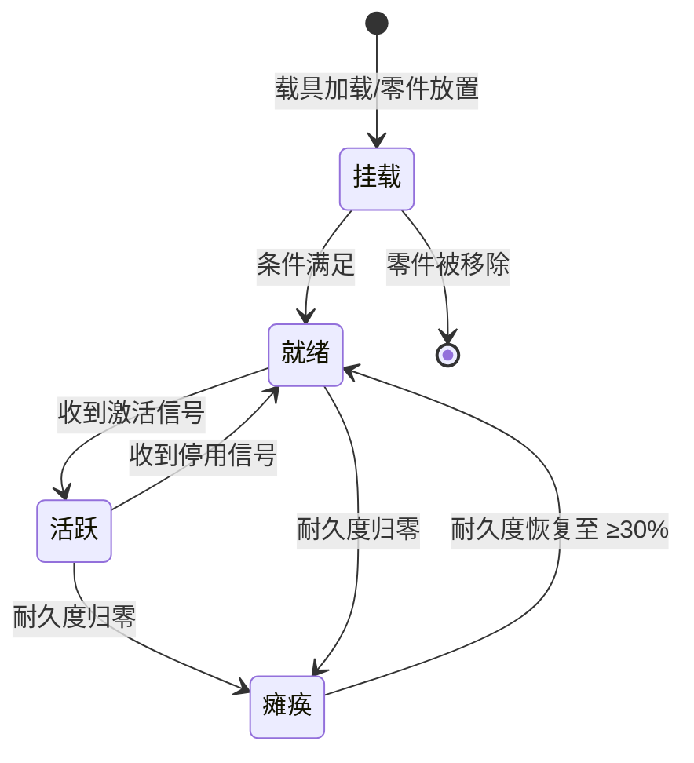
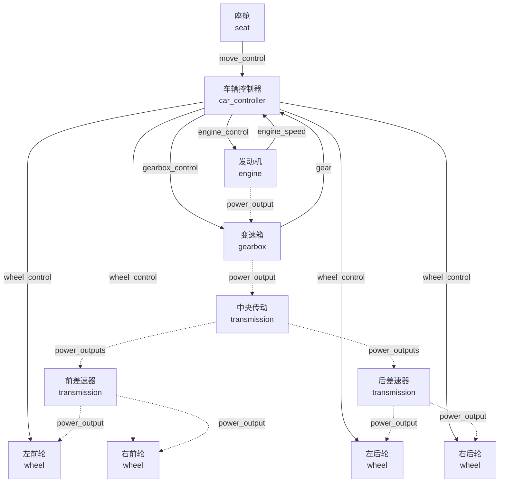

# 3.1 子系统概述

子系统是赋予载具实际功能的核心机制。一辆载具能跑、能转向、能亮灯、能开火，不是因为零件本身有什么特殊能力，而是因为零件内部的子零件上挂载了对应的子系统。本章作为子系统详解的开篇，先介绍子系统的整体概念、分类方式、配置机制和生命周期，后续各节再逐一展开每类子系统的具体行为。

## 什么是子系统

子系统是挂载在子零件（`SubPart`）上的功能模块。在载具层级中，它处于最底层——比零件、子零件更小，是真正执行功能的单元。每个子系统只做一件事：发动机子系统负责输出动力，变速箱子系统负责换挡调速，轮胎子系统负责驱动和转向，座椅子系统负责提供乘员位置和输入信号。

从实现角度看，子系统的行为由其 **type**（行为类别）和 **definition**（具体型号参数）共同决定：

- **type** 决定子系统“做什么”——是发动机还是变速箱、是轮胎还是摄像头。type 由模组内置定义，内容包作者不能新增 type，只能从已有类型中选择。
- **definition** 决定“做成什么样”——某款 V8 发动机的具体功率曲线、某款变速箱的各挡减速比、某款轮胎的最大驱动力。definition 指向 `subsystems/` 模块中的一个 JSON 文件，内容包作者通过创建新的 definition 文件来定制自己的子系统型号。

可以理解为：**type = 类，definition = 该类的配置化实例模板**。

## 子系统类型一览

截至当前版本，MachineMax 共内置 18 种子系统 type。按功能领域分为以下六类，与本章后续各节一一对应：

| 类别       | type 值                             | 说明              | 详见                     |
| -------- | ---------------------------------- | --------------- | ---------------------- |
| **动力系统** | `machine_max:engine`               | 内燃机，消耗燃料输出机械能   | [3.2 动力系统](3.2-动力系统.md) |
|          | `machine_max:motor`                | 电动机，消耗电力输出机械能   |                        |
|          | `machine_max:battery`              | 电池，储存和吞吐电力      |                        |
| **传动系统** | `machine_max:gearbox`              | 变速箱，提供多级减速比与换挡  | [3.3 传动系统](3.3-传动系统.md) |
|          | `machine_max:transmission`         | 传动装置，将动力按权重分流至多个输出端 |                        |
| **行驶系统** | `machine_max:wheel`                | 轮胎（轮毂电机），驱动滚动与转向 | [3.4 行驶系统](3.4-行驶系统.md) |
|          | `machine_max:car_controller`       | 车辆控制器，处理驾驶输入与车辆姿态 |                        |
|          | `machine_max:motorbike_controller` | 摩托车控制器，含倾斜与平衡修正   |                        |
| **功能系统** | `machine_max:seat`                 | 座舱，提供乘员位置与输入信号输出  | [3.5 功能系统](3.5-功能系统.md) |
|          | `machine_max:joint`                | 驱动机构，驱动连接点各轴运动    |                        |
|          | `machine_max:turret`               | 炮塔驱动，控制炮管旋转与俯仰   |                        |
|          | `machine_max:turret_controller`    | 炮塔控制器，协调炮塔瞄准与开火  |                        |
|          | `machine_max:lighting`             | 照明，提供体积光视觉效果     |                        |
|          | `machine_max:item_storage`         | 物品存储，可指定行列数的容器   |                        |
|          | `machine_max:camera`               | 摄像头，提供可被引用的视角    |                        |
|          | `machine_max:javascript`           | 脚本，执行自定义 JS 逻辑   |                        |
|          | `machine_max:signal_convert`       | 信号转换器，转译和延迟信号    |                        |
| **其他**   | `machine_max:basic`                | 基础子系统，无功能，仅作伤害弱点 |                        |

> 信号系统（[3.6 信号系统](3.6-信号系统.md)）和能量系统（[3.7 能量系统](3.7-能量系统.md)）虽然也由 `SubsystemController` 统一管理，但它们不属于某一类具体的子系统 type，而是横跨所有子系统的共享基础设施。信号端口和能量端口可以挂载在任意子系统的实例上，负责不同子系统之间的信息与能量传递。

## 静态属性与动态属性

每个子系统实例由两层配置共同定义：静态属性（型号参数）和动态属性（连接关系）。这两层职责分离的设计使得同一型号的子系统可以复用在多个零件上，只在需要不同连接关系时单独调整。

### 静态属性：定义“是什么”

静态属性保存在内容包的 `subsystems/` 模块中，以 JSON 文件的形式存在。文件路径决定了它的注册名（`命名空间:文件名`），零件通过 `definition` 字段引用该注册名。静态属性中包含的参数全部属于该型号的固有特征——改变后会影响所有引用此型号的实例。

所有子系统类型共享一组公共基础字段（`basic_durability`、`pass_damage`、`limit_damage`、`hidden`）和公共音效字段（`sounds`），在此基础上每种 type 拥有自己的专属参数。例如发动机有 `max_power` 和 `max_torque`，变速箱有 `ratios` 和 `switch_time`，轮胎有 `roll` 和 `steering` 轴参数。

### 动态属性：定义“连到哪”

动态属性直接写在零件 JSON 的子零件 `subsystems` 字段中，属于内联配置。它主要定义该子系统实例在本零件内部的连接关系：

- 发动机/电机的 `power_output` 指向本零件内的变速箱或其他动力消耗端；
- 变速箱的 `power_output` 指向传动装置或轮胎；
- 座舱的 `move_outputs` 指定移动输入信号发送给哪个控制器；
- 控制器的 `engine_outputs`、`wheel_outputs` 等指定各类指令的接收目标；
- 轮胎的 `connector` 指定它驱动哪个连接点的滚动和转向。

简而言之：**静态定义“是什么”，动态定义“连到哪”**。静态属性可由多个零件共用，动态属性随每个零件的实际安装位置独立配置。

> 静态属性和动态属性的完整字段参考见 [5.5 子系统定义](../5-内容包制作教程/5.5-子系统定义.md)。

## 子系统生命周期

每个子系统实例从创建到销毁经历以下阶段：

### 挂载与就绪

子系统随零件被放置或载具被加载而创建，此时子系统完成挂载（`onAttach`），向能量网注册自己的生产者/消费者身份。子系统是否能进入工作状态取决于以下条件是否全部满足：

- 子系统自身未被标记为摧毁（`isDestroyed() == false`）；
- 所属子零件未被摧毁；
- 所属零件的组装进度（assembling progress）达到零件类型定义的功能阈值（`functional_threshold`，默认 30%）；
- 子系统收到激活标记（`DATA_ACTIVE == true`）。

其中前三条为客观硬件条件，第四条由信号系统或其他子系统控制。

### 活跃与停用

当上述四个条件同时满足时，子系统进入活跃状态，执行其核心功能逻辑（如发动机开始响应油门输入、轮胎开始驱动转动）。当激活标记被置为 `false`（例如玩家下车后控制器发出停用信号）时，子系统进入停用状态（`onDisabled`），保留所有状态数据但停止功能输出。

### 耐久度与瘫痪

子系统拥有独立耐久度（`basic_durability`），每次受到伤害时扣除相应数值。当耐久度降至 0 时，子系统被摧毁（`onDestroyed`），进入瘫痪状态并触发摧毁音效。

瘫痪后，子系统停止一切功能行为。如果所属零件后续被修复（例如通过焊枪恢复组装进度），子系统的耐久度也会随之恢复。当耐久度恢复到最大值的 30% 以上时，子系统自动脱离瘫痪状态，重新回到就绪状态。

### 伤害传导

子系统的 `pass_damage` 和 `limit_damage` 两个公共字段控制伤害向载具本体的传导方式：

- `pass_damage = true`（默认）：子系统受到的伤害传递给所属零件/载具；
- `pass_damage = false`：伤害完全由子系统自身吸收；
- `limit_damage = true`：传递的伤害值不超过子系统当前剩余耐久度。

## 子系统间的协作

子系统不是孤立的——它们通过信号系统和能量系统相互协作，形成完整的动力链和控制链。

### 信号传递

信号是子系统间传递控制指令和状态反馈的载体。座舱将玩家的移动输入（WASD）广播为 `move_control` 信号，控制器接收后产生 `engine_control`、`wheel_control`、`gearbox_control` 等指令信号，分发给各执行子系统。同时，发动机将当前转速以 `engine_speed` 信号反馈给控制器，变速器将当前挡位以 `gear` 信号上报，形成闭环。

信号可以通过连接点跨越零件边界——连接点上的 `signal_targets` 定义了跨零件的信号转发规则，使前车的控制器能够将指令传递到后车的发动机。

### 能量传递

能量传递分为两个独立网络：

- **电力网（EnergyGrid）**：全载具共享的电力总线，自动平衡发电、用电和储能。发动机（带动发电机）、电池、电动机之间通过电力网交换能量，内容包作者无需手动配置连接关系。
- **机械能（MechPower）**：通过 `power_output` 字段指定的目标逐级传递。发动机 → 变速箱 → 传动装置 → 差速器 → 轮胎，形成一条机械能流，每一级可以改变转速和转矩。连接点上的 `power_target` 字段使机械能可以跨零件传递。

### 典型动力链

以下是一个完整的四轮载具动力链路，展示了各子系统之间的信号与能量流向。实线表示信号传递，虚线表示机械能传输：

## 本章结构导读

本章后续各节按功能领域分组，从玩家和 UGC 作者的视角介绍各类子系统的作用和行为：

- **[3.2 动力系统](3.2-动力系统.md)**：发动机、电动机和电池的功率输出特性，以及它们与机械能/电力网络的关系。
- **[3.3 传动系统](3.3-传动系统.md)**：变速箱的挡位逻辑与换挡策略，传动装置的差速锁模式与动力分流。
- **[3.4 行驶系统](3.4-行驶系统.md)**：轮胎的滚动驱动与转向伺服，车辆控制器和摩托车控制器的驾驶逻辑与辅助功能。
- **[3.5 功能系统](3.5-功能系统.md)**：座舱、驱动机构、炮塔、照明、物品存储、摄像头、脚本、信号转换器等辅助功能子系统。
- **[3.6 信号系统](3.6-信号系统.md)**：信号与信号端口的类型、信号频道的命名与路由规则、跨零件信号传递机制。
- **[3.7 能量系统](3.7-能量系统.md)**：电力网的总线平衡策略，机械能的逐级传递与变换。

如需查阅各子系统类型的完整配置字段，请参考 [5.5 子系统定义](../5-内容包制作教程/5.5-子系统定义.md)。
