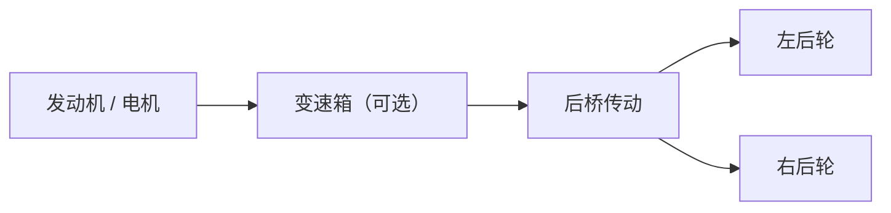
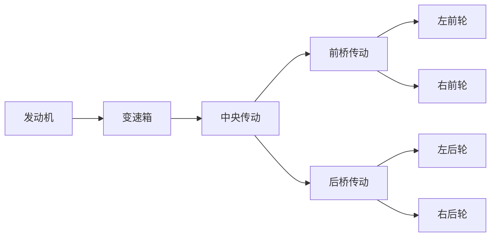
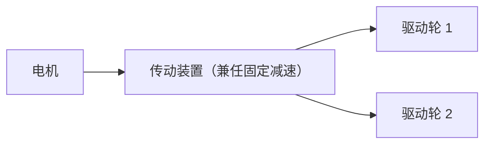

# 3.3 传动系统

传动系统负责把动力系统产出的机械能，整理成适合轮端使用的形式。对玩家来说，它决定一辆车是“起步有劲还是高速省转”、是“转弯顺畅还是容易打滑”；对内容包作者来说，它则决定动力链如何从发动机或电机一路连接到各个驱动轮。

在 MachineMax 中，传动系统主要由两类子系统组成：

- **变速箱（`gearbox`）**：负责挡位、减速比、离合和换挡节奏。
- **传动装置（`transmission`）**：负责把输入动力分配给多个输出端，并决定是否使用差速锁。

这两者通常连续出现，构成一条完整的机械能路径：**发动机 / 电机 → 变速箱 → 传动装置 → 轮端**。其中变速箱偏向“调速”，传动装置偏向“分流”。

## 传动系统的职责

如果动力系统解决的是“有没有动力”，那么传动系统解决的就是“这份动力以什么转速、什么扭矩、送到哪几个输出端”。

具体来说，传动系统承担三件事：

- 把动力源的高转速、低扭矩，转换为轮端更容易利用的低转速、高扭矩；
- 在前进、倒车、起步、巡航等不同工况下切换合适的挡位；
- 在多个输出端之间分配动力，例如左右后轮、前后桥，或更复杂的多级传动结构。

这意味着一辆车即便发动机参数完全一样，只要变速比、驱动桥布局或差速锁策略不同，实际开起来也会明显不同。

## 变速箱：决定动力如何“变速”

变速箱子系统的核心作用，是用不同挡位的减速比，在同一动力源上制造出不同的输出特性。

### 挡位与减速比

每个挡位都对应一个传动比。一般可以这样理解：

- **低挡位（大减速比）**：轮端扭矩更大，适合起步、爬坡、低速脱困；
- **高挡位（小减速比）**：输出转速更高，适合中高速巡航；
- **倒挡（负传动比）**：用于反向输出动力；
- **空挡或离合断开**：动力链暂时不把扭矩传给后级。

在 MachineMax 的实现里，变速箱会把当前挡位与 `final_ratio` 共同换算为实际使用的总减速比。对 UGC 作者来说，这意味着：

- `ratios` 决定各挡位之间的相对疏密；
- `final_ratio` 决定整套变速箱的整体“短”或“长”。

如果一辆车整体“起步太肉、极速太高”，通常先检查 `final_ratio`；如果只是某几个挡位衔接不顺，再调整 `ratios` 的分布会更直接。

### 离合与换挡

变速箱不只是一个纯数学倍率。它还维护当前挡位、离合状态，以及一次换挡需要多长时间完成。

对玩家而言，比较直观的表现有两点：

- 换挡时会有短暂的动力中断；
- 在停车、起步或手动操作离合时，动力链可能暂时不向车轮传递扭矩。

这也是 `switch_time` 会直接影响驾驶手感的原因。时间太长，车辆换挡时会显得迟缓；时间太短，则会削弱手动挡与自动挡之间的节奏差异。

### 自动换挡与手动换挡

传动系统本身只负责“能切到哪个挡”，真正决定何时换挡的，通常是行驶系统中的车辆控制器。当前实现中，车辆控制器会根据：

- 当前车速；
- 当前输出轴转速；
- 发动机或电机在不同转速下的可用扭矩；
- 玩家当前希望前进、倒车还是制动；

来选择更合适的挡位。

因此，深度玩家在调校或比较车型时，可以把换挡表现理解为“动力曲线”和“挡位设计”共同作用的结果，而不是单独由某一个字段决定。

## 传动装置：决定动力如何“分流”

如果说变速箱解决的是“一路输入如何调成合适的输出”，那么传动装置解决的就是“这一路输出之后，接下来要分给谁”。

最常见的用法有三种：

- **左右轮分流**：把动力分给左、右驱动轮，构成最基本的车桥差速器；
- **前后桥分流**：把动力分给前桥和后桥，形成中央传动结构；
- **多级分流**：先由中央传动分给前后桥，再由前后桥各自分给左右轮。

在内容包结构上，`transmission` 的 `power_outputs` 就是这一层拓扑的核心。它不是“控制信号路由”，而是**机械能路由**。

### 输出减速比的作用

`power_outputs` 中每个目标除了“指向谁”，还带一个数值作为该输出端的减速比。

这个数值的常见用途包括：

- 对左右轮使用相同数值，表示标准等比分流；
- 对前后桥使用略有差异的数值，用于补偿轮径、桥比或结构差异；
- 在纯电车型中，把它当作固定终传比使用，直接从电机输出到驱动轮。

官方内容包里就能看到两种典型结构：

- **AE86**：发动机 → 变速箱 → 后桥传动 → 左右后轮，属于传统后驱结构；
- **Mini EV**：电机 → 传动装置 → 左右后轮，不经过独立变速箱，更接近单速减速器。

这说明 `transmission` 不一定只扮演“差速器”这一种现实原型。对内容包作者而言，它更像是一个通用的多路机械能分配节点。

## 差速器与差速锁

传动装置最关键的行为差异，是它究竟按“开放差速器”工作，还是按“差速锁”工作。

### 开放差速器

在开放差速器模式下，多个输出端允许存在转速差。它更适合铺装路面正常转弯，因为内外侧车轮不需要被强行约束为同一转速。

玩家能感受到的特点通常是：

- 转弯更自然；
- 高附着地面上更稳定；
- 当某个驱动轮明显更容易空转时，动力利用率可能下降。

### 差速锁

在差速锁模式下，系统会尽量约束各输出端保持接近的转速。这更适合低附着地形、脱困或需要稳定双轮驱动的场景。

对应的驾驶表现通常是：

- 低速脱困能力更强；
- 某个轮端打滑时，另一侧更容易分到可用动力；
- 在高附着地面或紧凑弯道中，转向阻力和推头倾向可能更明显。

### 自动与手动差速锁

`transmission` 支持多种差速锁策略：

- `false`：始终按开放差速器工作；
- `true`：始终锁止；
- `auto`：根据输出端转速差自动启用；
- `manual`：通过信号输入控制开关。

对 UGC 作者来说，这里要注意一个边界：

- `diff_lock` 决定的是**传动行为**；
- 具体“什么时候给出开关指令”，则属于信号系统和控制器设计的问题。

如果目标是做面向普通公路驾驶的乘用车，`auto` 往往更稳妥；如果目标是做越野车、工程车或需要明确玩法操作的载具，`manual` 会更容易做出区分度。

## 传动链的常见结构

从玩家和 UGC 作者最常接触的角度，实际可以把传动链概括为以下几种结构。

### 后驱

最简单也最常见的结构之一：

特点是结构清晰，调校重点集中在后桥输出和后轮抓地力上。官方 AE86 的动力链就属于这一类。

### 前驱

结构与后驱类似，只是把输出端改到前桥。对内容包作者而言，重点不是“名字叫前驱”，而是确认 `power_outputs` 最终连到的是前轮对应的轮端子系统。

### 四驱 / 多级传动

当一个传动节点不足以表达结构时，可以把多个 `transmission` 串起来：

这种写法的好处是职责清晰，后续也更容易单独调整前后桥的减速比或差速锁策略。

### 单速电驱

纯电车型不一定需要独立的多挡变速箱。只要电机本身的转速范围足够宽，就可以直接：

这类结构更适合轻型电动车、小型车或不强调换挡体验的内容包。

## 对深度玩家有用的观察点

如果你主要从驾驶和调校角度理解传动系统，以下几个现象最值得留意：

- **起步无力但高速轻松**：通常意味着整体传动比偏长。
- **中段掉转、换挡后动力衔接差**：通常意味着挡位间隔过大，或换挡时机与发动机扭矩区间不匹配。
- **转弯时明显拖拽、推头**：通常意味着差速锁介入过早，或本就采用了偏强的锁止策略。
- **单轮打滑后车辆不走**：通常是开放差速器结构在低附着场景下的典型表现。

这些现象不一定说明“子系统坏了”，更多是在提示当前动力曲线、减速比和驱动布局之间是否匹配。

## 对内容包作者有用的设计要点

如果你的目标是搭一条稳定、容易维护的动力链，通常建议先把结构画清楚，再写 JSON。

### 先确认谁负责“调速”，谁负责“分流”

推荐把职责拆开：

- 需要多挡体验时，用 `gearbox` 处理挡位变化；
- 需要把动力送往多个轮端时，用 `transmission` 处理分流；
- 纯电单速结构可以省略 `gearbox`，但仍建议保留 `transmission` 作为输出汇分节点。

这样做的好处是后续调参时更容易判断问题出在哪一层。

### 保持输出拓扑清晰

建议按真实动力流向命名和组织子系统，例如：

- `engine`
- `gearbox`
- `center_transmission`
- `front_diff`
- `rear_diff`
- `left_rear_wheel_driver`

即使注册名可以自定义，也最好让名称本身能看出上下游关系。这样在编写 `power_output` 和 `power_outputs` 时，不容易接错目标。

### 不要把 3.3 和 5.5 的职责混在一起

本节讲的是“传动系统为什么这样设计、开起来会怎样、拓扑应该怎么理解”。

而在实际制作内容包时，你还需要回到 [5.5 子系统定义](../5-内容包制作教程/5.5-子系统定义) 对照字段：

- 变速箱静态参数看 `final_ratio`、`ratios`、`switch_time`；
- 传动静态参数看 `diff_lock`、`diff_lock_sensitivity`、`auto_diff_lock_threshold`；
- 动态连接关系看 `power_output` 和 `power_outputs`。

前者帮助你建立正确的结构认知，后者负责把这些结构落实到 JSON。

## 一个最小可用的理解框架

如果你只想先抓住最关键的部分，可以把 MachineMax 的传动系统理解成下面这句话：

> **变速箱负责选挡和调节总传动比，传动装置负责把机械能送到正确的输出端，并决定这些输出端在转速差出现时是否被锁在一起。**

理解了这层关系，再去看具体车型或 `5.5` 中的字段表，阅读成本会低很多。
