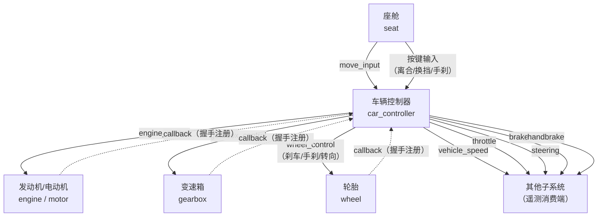

# 3.4 行驶系统

行驶系统负责将驾驶者的操作意图转化为载具的实际运动，并维持载具的姿态稳定。它不产生动力，也不调节传动比，而是在动力和传动系统完成"产生并整理机械能"之后，承担"把这份机械能作用到地面，同时让车辆按驾驶者意图转向和保持平衡"的最终执行职责。

在 MachineMax 中，行驶系统由三种子系统组成：

- **轮胎（`wheel`）**：轮毂电机，驱动单个轮端的滚动与转向，是机械能的最终消费者。
- **车辆控制器（`car_controller`）**：四轮及以上载具的驾驶中枢，接收玩家输入并协调油门、制动、转向、换挡和漂移。
- **摩托车控制器（`motorbike_controller`）**：继承车辆控制器逻辑，额外增加倾斜平衡与低速推车功能。

这三者的典型协作方式是：**控制器收取座舱发出的移动输入 → 控制器计算油门/制动/转向指令并分发给各轮胎和变速箱 → 轮胎通过驱动连接点旋转来推动载具行驶**。其中控制器是"大脑"，轮胎是"手脚"。

## 轮胎：机械能的最终消费者

轮胎子系统（`wheel`）是载具与地面交互的末端执行器。它挂载在子零件上，通过驱动一个高级连接点（`AdvancedConnector`）的旋转轴来模拟轮胎的滚动与转向。每个轮胎子系统控制一个连接点，因此一辆四轮载具通常需要四个独立的 `wheel` 子系统实例。

### 滚动轴与转向轴

轮胎子系统控制连接点的两个旋转轴：

- **X 轴（滚动轴 `roll`）**：对应轮胎的旋转滚动。系统根据收到的驱动力矩信号（或机械能）设定目标转速，在驱动/制动/手刹三种状态之间切换。
- **Y 轴（转向轴 `steering`）**：对应轮胎的水平转向。系统以伺服模式工作——收到目标角度信号后，以预设的最大角速度转动到目标位置。

两轴的驱动参数各自独立配置，定义在静态属性中：

| 轴     | 参数                | 含义                                    | 默认值        |
| ------ | ----------------- | --------------------------------------- | ------------ |
| 滚动轴  | `max_drive_force` | 最大驱动力矩（N·m）。信号值乘以该值得到实际驱动力矩  | `10000.0`    |
|        | `max_brake_force` | 最大常规制动力矩（N·m）                      | `3500.0`     |
|        | `max_hand_brake_force` | 最大手刹制动力矩（N·m）                     | `0.0`        |
|        | `max_rpm`         | 最大转速（RPM）                                  | `30000`      |
| 转向轴  | `max_force`       | 最大转向力矩（N·m）                        | `2000.0`     |
|        | `max_speed`       | 最大转向角速度（°/s）                        | `180`        |

> 手刹制动力矩（`max_hand_brake_force`）默认为 `0.0`，意味着如果不在轮胎定义中显式配置该值，该轮胎将不参与手刹制动。在典型前驱布局中，通常只给后轮配置手刹制动力矩；在全轮手刹场景中则需要为全部轮胎配置。

### 驱动力来源

轮胎获取驱动力的来源有两类，按优先级排列：

1. **机械能（MechPower）**：当轮胎的 `power_input`（动态属性中通过连接点间接配置）收到机械能时，系统将收到的功率除以当前转速得到扭矩，直接作为驱动力矩作用于滚动轴。这是动力链传递的自然结果——发动机或电机经由变速箱、传动装置一路传到轮胎。
2. **直驱信号（MoveInputSignal）**：如果轮胎的 `control_inputs` 频道上收到 `MoveInputSignal` 类型信号（通常是座舱直接发出的移动输入），则将其前进分量（`moveInput[2]`，范围 0\~100）直接映射为驱动力矩。这种模式跳过了动力系统和传动系统，适用于简易载具或测试场景。

无论何种来源，驱动力矩最终会被限制在 `[-max_drive_force, max_drive_force]` 范围内，然后减去制动和手刹力矩，作为净驱动力矩施加到滚动电机上。

### ABS 防抱死制动

轮胎子系统内置了可选的 ABS 功能，通过以下静态参数控制：

| 字段                    | 含义                                     | 默认值  |
| ----------------------- | ---------------------------------------- | ------ |
| `abs_enabled`           | 是否启用 ABS                              | `false` |
| `abs_target_slip_ratio` | 目标滑移率（制动力的峰值区间）              | `0.15`  |
| `abs_wheel_radius`      | 计算滑移率时使用的轮胎半径（m）             | `0.3`   |

当 ABS 启用且车速大于 2 m/s 时，系统计算当前滑移率：`滑移率 = |车速 − 轮速| / (min(车速, 轮速) + 0.1)`。若滑移率超过目标值，系统按比例降低刹车力以避免轮胎抱死。

ABS 的目标滑移率通常设在 0.10\~0.20 之间（对应 10%\~20% 滑移）。值越小刹车越保守（更不易抱死但制动距离延长），值越大刹车越激进。关闭 ABS 时轮胎抱死后侧向抓地力消失，载具将无法转向。

### 信号输入与输出

轮胎的信号输入采用优先级机制：`control_inputs` 列表定义了多个接收频道名，系统按顺序查找第一个有非空信号的频道作为控制输入。如果收到的是 `WheelControlSignal`（控制器发出的结构化车轮指令），则直接解析其中的刹车、手刹和转向控制量。如果收到 `MoveInputSignal`，则自动转换为对应的车轮控制量。

轮胎向外输出两类信号（通过动态属性的 `roll_speed_outputs` 和 `steering_angle_outputs` 字段指定目标）：

- **滚动速度信号**：反馈 X 轴相对角速度（°/s），可用于转速表、牵引力控制等下游子系统。
- **转向角度信号**：反馈 Y 轴相对角度（rad），可用于 HUD 显示或高级控制逻辑。

## 车辆控制器：行驶中枢

车辆控制器（`car_controller`）是四轮及以上载具的核心控制子系统。它与座舱直接通信，将玩家的 WASD 输入转化为对各执行子系统的指令信号，协调油门、制动、转向、换挡和手刹。

### 转向控制

控制器采用 **阿克曼转向几何**（Ackermann Steering）计算每个轮胎的转向角度。阿克曼转向的核心思想是：车辆转弯时，所有车轮应绕同一个瞬时转向中心旋转，内侧轮的转向角度需要大于外侧轮，以避免轮胎侧滑。

计算过程中涉及以下关键参数：

- **`min_steering_radius`**：最小转向半径（m）。当方向盘打死时车辆能达到的最小转弯半径。

实际转向角度的计算还与当前车速挂钩——系统通过 `lateral_acceleration` 映射表确定当前车速下的最大可用侧向加速度，然后反推出实际转向半径（`r = v² / a`）。当计算半径小于 `min_steering_radius` 时，以最小转向半径为准。这种机制自然地实现了"高速时自动限制转向角度，防止侧翻或不稳定"。

`lateral_acceleration` 是一个速度-加速度映射表（键为车速 km/h，值为最大侧向加速度 m/s²），可仅提供一个常数（所有速度下相同限制），也可提供多组键值对形成速度相关的限制曲线。

### 自动换挡逻辑

控制器内建了基于输出轴扭矩最大化的自动换挡算法。当 `manual_gear_shift` 为 `false`（默认）时，控制器在每个物理 tick 执行以下决策：

1. 根据当前变速箱输出轴转速，遍历所有可用挡位的减速比，预测挂入每个挡位后的发动机转速。
2. 查询发动机/电机在该预测转速下的净扭矩（输出扭矩 − 内部阻力），乘以该挡位的减速比得到输出轴扭矩。
3. 选择输出轴扭矩最大的挡位作为目标挡位。
4. 通过滞回比较（新挡位扭矩优势小于 5% 时保持原挡位）和单次最多跳一挡的限制，避免频繁跳挡和换挡冲击。

这套算法等价于"在每个车速下选择使发动机功率最大化的挡位"：低挡位放大扭矩但限制车速，高挡位释放车速但扭矩放大不足。算法会自动在两者之间找到最佳平衡。

对纯电动车（仅有电动机、无发动机），方向过滤被绕过——电动车不依赖负传动比实现倒车，而是由电动机反转直接驱动（电动机油门范围为 −1\~1）。

### 制动与手刹

控制器的制动策略围绕行车状态分为几个情景：

- **前进方向输入不为零且与行驶方向一致**：正常加速行驶，制动为零。
- **前进方向输入与行驶方向相反**：视为主动减速/倒车意图，施加 100% 制动。
- **前进方向输入为零且低速（< 1 m/s）**：自动施加制动和手刹以停稳车辆（当 `auto_hand_brake` 为 `true` 时）。
- **前进方向输入为零且中高速**：不自动制动，允许车辆滑行。
- **无输入信号**：拉手刹，防止车辆溜动。

手刹支持两种操作模式：**按住触发**（按键持续按下时生效）和**切换触发**（每次按键切换手刹状态），通过不同的按键绑定支持。

### 漂移机制

控制器内置了漂移检测与辅助系统，由 `drift_assist` 字段控制（默认开启）。漂移的触发分为两种情况：

1. **自然漂移**：车辆侧滑角（`driftRad`，即局部速度的横向分量与纵向分量之比的反正切）超过 5° 且车速大于零时，自动进入漂移状态。当侧滑角回落至 3° 以下时自动退出。
2. **手刹起漂**：当玩家拉起手刹（手刹值 > 0.5）且车速足够时，漂移控制强制激活。

漂移状态激活后，控制器执行以下行为：

- 使用 PD 控制器计算漂移转向指令（`driftControl`），使车身角速度逼近由 `max_drift_angular_velocity` 映射表确定的目标角速度。
- 对前轴外侧车轮施加**反打方向**（与过弯方向相反的角度，约为漂移角的 50%），用于维持车身姿态。
- 对后轴车轮不再施加转向角度（由 `driftSteering` 方法中的 `pivot.z <= steeringCenter.z` 判断决定），模拟后驱车漂移时前轮反打、后轮固定的经典姿态。
- 漂移权重（`driftWeight`）从正常控制到漂移控制平滑过渡，避免状态切换时的突兀转向。

`max_drift_angular_velocity` 映射表（键为车速 km/h，值为最大漂移角速度 °/s）允许内容包作者在不同速度段定制漂移的手感：低速时可设较大值使漂移更灵活，高速时降低以防止失控。

### 离合器与手动干预

即使设置为自动换挡（`manual_gear_shift = false`），玩家仍可通过按键手动干预：

- **升挡/降挡按键**：手动发出升挡或降挡指令后，控制器在 3 秒内暂停自动换挡。
- **离合器按键**：手动踩离合时断开动力传递（调用变速箱 `setClutched(false)`）。

这为深度玩家保留了在关键时刻手动超控换挡的能力。

### 信号收发图

控制器是信号系统中最繁忙的节点，其信号流向如下：

控制器的动态属性中，`control_outputs` 为必填项，指定统一控制输出频道。控制器通过握手机制自动发现并绑定受控的发动机、变速箱和轮胎——当这些子系统通过反馈频道向控制器注册时，控制器自动在 `control_outputs` 指定的频道上向其下发控制指令。`speed_outputs`、`throttle_outputs`、`steering_outputs`、`brake_outputs`、`handbrake_outputs` 为可选项，提供了遥测数据的广播出口。

## 摩托车控制器：倾斜与平衡

摩托车控制器（`motorbike_controller`）继承车辆控制器的全部逻辑，增加了以下摩托车特有行为：

### 与车辆控制器的关键区别

| 特性         | 车辆控制器                        | 摩托车控制器                               |
| ------------ | --------------------------------- | ----------------------------------------- |
| 转向计算     | 标准阿克曼转向（仅 `roll=0`）      | 阿克曼转向（考虑当前车身倾斜角 `roll`）       |
| 漂移         | 支持漂移检测与辅助                  | 始终关闭漂移（`driftWeight = 0`）           |
| 低速行为     | 不额外施加力                        | 直接沿车身前向施加推力（`moveInput[2] × 5N`）|
| 平衡修正     | 无                                | 双环 PID 平衡控制                            |
| 停车姿态     | 无要求                             | 自动维持停车倾斜角                            |

摩托车控制器的静态属性在 `car_controller` 基础上增加三个字段：

| 字段                            | 含义                                             | 默认值  |
| ------------------------------- | ------------------------------------------------ | ------ |
| `max_angle`                     | 最大倾斜角度（°）。超过此角后系统不再修正姿态       | `30.0`  |
| `parking_angle`                 | 停车时的目标倾斜角（°）。停车后车身向此角度靠拢     | `5.0`   |
| `correction_force_multiplier`   | 修正力倍率。整体缩放平衡调节力的强度                | `1.0`   |

### 平衡修正系统

摩托车控制器的核心是平衡修正算法。当有玩家乘坐、车速低于 2 m/s（低速）或车身倾斜角未超过 `max_angle`（不认为已失控）时，系统会持续施加力矩以维持车身姿态。

修正系统采用**双环 PID 架构**：

- **外环（角度环）**：输入为目标倾斜角与当前倾斜角的差值，输出目标角速度。P 增益约 0.1。
- **内环（角速度环）**：输入为目标角速度与当前角速度的差值，输出控制力矩。P 增益约 500。

目标倾斜角由物理计算得出：`targetRoll = atan(v² / (g × turnRadius))`，即车辆在给定车速和转弯半径下自然平衡所需的角度。这个角度被限制在 `[-0.8 × maxAngle, +0.8 × maxAngle]` 范围内，为系统留出安全裕量。

在基础 PID 输出之上，系统还叠加了两个补偿项：

1. **重力矩补偿**：`mass × gravity × height × sin(roll)`，用于抵消车身倾斜时重力产生的自然倾覆力矩。
2. **向心力补偿**：`mass × v² / turnRadius × height × cos(targetRoll)`，用于抵消转弯时向心力对车身产生的额外倾覆力矩。

当车辆停稳且无人驾驶时（车速 < 0.5 m/s，倾斜角 < `10 + 1.5 × parking_angle`），系统切换到**停车姿态保持模式**。此模式使用一个独立的低增益 PID 控制器（P 增益约 15），目标角度为 `parking_angle`，仅当摩托车连接了至少两个轮胎时才生效。

### 阿克曼转向的摩托车适配

摩托车控制器的阿克曼转向计算与车辆版本有一个重要差异：在计算转向角度时，纵向偏移量（`deltaForward`）会乘以 `cos(roll)` 因子。这意味着当摩托车倾斜时，前轮的有效纵向力臂会随倾斜角的余弦减小，转向变得更为保守。这种物理上的修正使高速压弯时的转向手感更接近真实摩托车。

### 低速直驱

摩托车在低速（< 2 m/s）时还额外施加一个沿车身前向（Z 轴负方向）的力：`5N × moveInput[2]`。这一力直接作用于刚体质心，不经过轮胎力学路径，作用类似于玩家用脚推车——确保极低速下即使动力系统尚未充分介入，摩托车也能缓慢移动。

## 轮胎数量与控制器行为的交互

车辆控制器在握手阶段（`handShake`）通过回调机制自动发现并注册所有与本载具相连的轮胎、发动机/电机和变速箱。AutoShift 算法中关于纯电动车的判断（`engineCount == 0 && motorCount > 0`）直接依赖此注册结果，因此如果载具在运行时轮胎数量发生变化（如轮胎被击毁），发动机和变速箱的注册列表会同步更新。

## 对深度玩家的观察要点

- **转向半径随速度自动增大**：即使方向键打到底，高速时实际转向角度也会减小——这是 `lateral_acceleration` 映射表在起作用。如果一辆车高速入弯时总感觉"转向不足"，可能不是转向参数有问题，而是侧向加速度限制偏低。
- **制动力分配**：常规制动力矩（`max_brake_force`）对所有配有此值的轮胎生效，手刹制动力矩（`max_hand_brake_force`）需单独配置。如果拉手刹后感觉制动力矩不足，检查各轮是否配置了 `max_hand_brake_force`。
- **换挡滞回**：控制器自动换挡时，新挡位扭矩优势低于当前挡位的 5% 时会拒绝切换，且每次最多跳一挡。因此从深踩油门到完成最优换挡，可能需要经历多次升挡——这不是 bug，而是防止频繁跳挡的滞回策略。
- **ABS 与制动距离**：开启 ABS 后紧急制动距离会略长于抱死状态，但能保留转向能力。内容包中需要根据车型用途权衡 ABS 开关（越野车可能更适合关闭 ABS，公路车建议开启）。
- **漂移入门**：手刹 + 方向是最可靠的起漂方式。漂移辅助（`drift_assist`）开启后系统自动维护反打方向和角速度，关掉则需要玩家完全手动控制车身姿态。

## 对内容包作者的实战要点

### 先完成动力链再调行驶系统

行驶系统的参数调校强烈依赖前端的动力系统和传动系统已经确定。建议的调试顺序是：

1. 先确保发动机/电机能正常输出动力。
2. 再确保变速箱和传动装置能把动力正确分配到目标轮胎。
3. 最后调行驶系统——轮胎的驱动力矩上限、转向特性、ABS 参数等。

### 转向中心的自动计算

车辆控制器不需要手动配置转向中心位置。系统会在车辆组装完成后自动计算：

- **X 坐标**：非转向轮枢轴的 X 均值（左右对称中心），全轮转向时回退到全部车轮的均值。
- **Z 坐标**：非转向轮枢轴的 Z 均值（后轴位置），全轮转向时回退到全部车轮的几何中心。
- **Y 坐标（仅摩托车）**：`avg(枢轴 Y) - avg(轮胎半径)`，即接地高度。用于平衡控制中的重力矩补偿计算。

判断"车轮是否可转向"的依据是连接点关节的 Y 轴旋转自由度范围：如果上下限之差大于约 1e-4 弧度（即连接点允许绕 Y 轴转动），则视为转向轮，否则视为非转向轮。

如果发现实际转向行为异常（如左右不对称），应检查各轮胎连接点的关节属性是否正确配置了转向轴的限位范围。

### 轮胎的 `max_speed` 与 `max_force` 的配合

`max_speed` 赋正值的场景通常出现在摩托车中，用于在特定轮速下削减驱动力矩以防止倾覆。

### 摩托车控制器需要轮胎配合

摩托车控制器的停车姿态保持仅在连接了两个以上轮胎时生效。此外，`max_speed`（滚动轴角速度上限）和 `max_hand_brake_force` 是摩托车轮胎中的关键参数——后者用于在停车状态下提供手刹锁定。

`correction_force_multiplier` 的值越大平衡修正越"硬"，适合重型巡航车或高速稳定性需求；值越小修正越"软"，适合轻型越野摩托车或追求压弯手感的车型。

### 与 5.5 的对接

本节描述的是行驶系统的行为逻辑和参数含义，实际创建子系统定义时需要对照 [5.5 子系统定义](../5-内容包制作教程/5.5-子系统定义.md)：

- 轮胎静态参数看 `roll`、`steering`、`abs_enabled`、`abs_target_slip_ratio`、`abs_wheel_radius`；
- 轮胎动态属性看 `connector`（指定驱动哪个连接点）、`roll_speed_outputs`、`steering_angle_outputs`；
- 车辆控制器静态参数看 `min_steering_radius`、`lateral_acceleration`、`max_drift_angular_velocity`、`manual_gear_shift`、`auto_hand_brake`、`drift_assist`；
- 摩托车控制器静态参数在车辆控制器基础上增加 `max_angle`、`parking_angle`、`correction_force_multiplier`；
- 控制器动态属性看 `control_outputs`（统一控制输出频道）以及各遥测输出映射。
