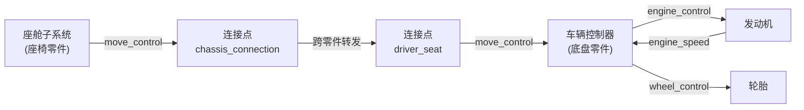
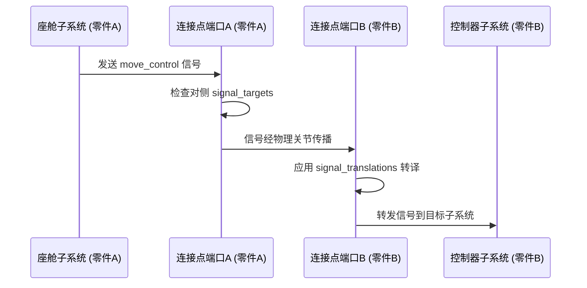
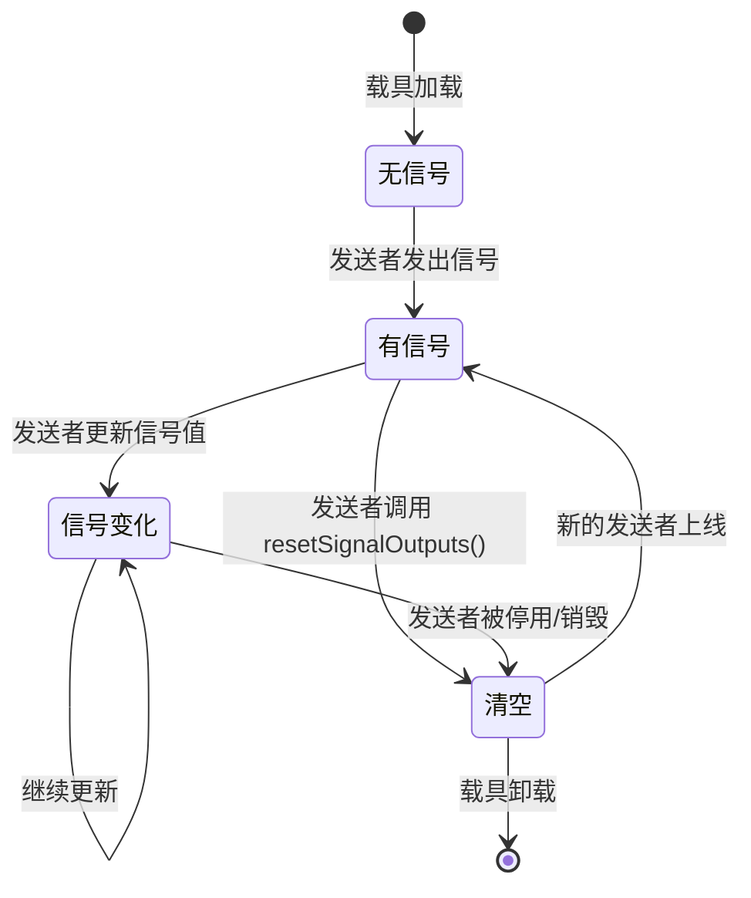

# 3.6 信号系统

信号系统是连接载具所有子系统的通信网络。如果说动力系统提供功率、传动系统传递功率、行驶系统消耗功率，那么信号系统决定"何时发多少力、谁分到多少、往哪个方向"。对深度玩家而言，理解信号系统有助于排查"为什么上车后动不了""为什么灯不亮""为什么挂挡没反应"等问题；对 UGC 作者而言，信号系统的配置决定了座舱、控制器、发动机、轮胎之间能否正确协作。

与动力系统、传动系统、行驶系统不同，信号系统**不是一种子系统 type**，而是横跨所有子系统的共享基础设施。任何子系统都可以发送和接收信号——座舱发送玩家的移动输入，控制器接收后产生发动机和轮胎指令，发动机将当前转速反馈回控制器，形成闭环。

## 信号系统解决什么

在拼装载具时，玩家将不同零件用连接点对接起来。仅靠连接点的物理关节只能保证零件相对位置正确，不能保证功能连通——发动机和轮胎物理上连在一起了，但控制器还不知道轮胎在哪、轮胎也不知道该听谁的。

信号系统的职责就是取代"硬连线"，让控制器和各个执行器通过配置化的频道名称实现灵活的发布-订阅通信。它的核心能力包括：

- **零件内信号路由**：座舱的输入信号发给谁、控制器的指令下达到哪里，均由 JSON 配置决定；
- **跨零件信号传递**：连接点上的信号端口在零件对接时自动连通，前车的控制器可以向后车发动机发送指令；
- **信号转译**：不同来源的信号可以统一到同一频道名（例如左右前后四个车门的交互信号统一为 `interact`），降低接收端的解析成本；
- **信号存储与 Molang 查询**：载具级信号存储使动画系统可以读取当前车速、油门、挡位等运行时数据。

## 核心概念

### 信号（Signal）

信号是子系统间传递的数据包。当前版本包含以下信号类型：

| 信号类型                 | 用途       | 数据内容                            |
| -------------------- | -------- | ------------------------------- |
| `MoveInputSignal`    | 移动输入     | WASD 方向与按键冲突状态                  |
| `RegularInputSignal` | 常规按键输入   | 按键类型（离合器、升降挡、手刹等）与按下持续 tick 数   |
| `WheelControlSignal` | 车轮控制指令   | 刹车力度（0\~1）、手刹力度（0\~1）、期望转向角（弧度） |
| `MotorControlSignal` | 关节电机控制指令 | 各轴速度与位置目标                       |
| `InteractSignal`     | 交互事件     | 触发交互的实体                         |
| `EmptySignal`        | 空信号      | 用于重置/清空信号输出                     |

> 信号类型由模组内置，UGC 作者无法新增信号类型。但通过自定义信号频道名，同一类型的信号可以在不同的语义上下文中使用（例如 `wheel_control` 和 `steering_control` 都可以承载 `WheelControlSignal`）。

### 信号频道（SignalChannel）

信号频道是命名通信链路。频道名决定了信号的语义——`engine_control` 频道承载发动机油门指令，`wheel_control` 频道承载车轮刹车与转向指令，`engine_speed` 频道承载发动机转速反馈。

一个频道允许多个发送者同时写入，接收端通过 `getFirstSignal()` 获取第一个有效值。在大多数场景中，每个频道只有一个发送者（例如每台发动机独占一个 `engine_control` 频道），多发送者的场景主要用于信号回调和聚合。

### 信号发送者与接收者（ISignalSender / ISignalReceiver）

任何子系统都可以成为信号发送者或接收者，甚至同时兼任两者——例如车辆控制器既接收座舱的 `move_control`，又向发动机发送 `engine_control`。

- **发送者**维护一个目标映射表：`频道名 → 接收者列表`。发送信号时，指定频道名和信号值，信号被推送到所有注册的接收者。
- **接收者**维护自己的信号输入频道表：`频道名 → SignalChannel`。当信号到达时，接收者的 `onSignalUpdated` 方法被调用，由子系统自行决定如何处理。

此外，发送者还支持**回调注册**——发动机可以在运行时将自己动态注册到控制器的 `engine_control` 频道上，实现自动发现和控制绑定，无需 UGC 作者手动罗列每个发动机名称。

### 信号端口（SignalPort）

信号端口是挂在连接点上的特殊收发器，负责跨零件信号转发。当两个连接点对接时，对侧的信号端口自动激活，将本侧指定频道的信号转发到对侧。

信号端口的两个关键配置：

- **`signal_targets`**：定义本端口接收哪些信号以及转发给谁。目标可以是本零件内的子系统名、连接点名、`"part"`（所属零件）、`"vehicle"`（载具级）或 `"subpart"`（所属子零件）。
- **`signal_translations`**：信号频道转译规则。例如将 `interact_left_front_door` 转译为 `interact`，使接收端不需要关心具体是哪个门被触发。

## 零件内信号路由

零件内信号路由由两部分配置共同完成：发送方的 `*_outputs` 字段和连接点的 `signal_targets` 字段。

### 子系统间的直接信号路由

以 AE86 底盘为例，座舱座椅位于一个独立零件中，控制器和发动机位于底盘零件中。座舱通过连接点的信号端口将 `move_control` 信号转发给底盘上的控制器：



在底盘零件的 JSON 中，控制器通过 `engine_outputs`、`wheel_outputs`、`gearbox_outputs` 分别将指令发送给本零件内的对应子系统：

```json
"subsystem.machine_max.car_controller": {
  "type": "machine_max:car_controller",
  "definition": "machine_max:ae86_car_controller",
  "engine_outputs": {
    "engine_control": ["subsystem.machine_max.engine"]
  },
  "wheel_outputs": {
    "wheel_control": ["subsystem.machine_max.left_front_wheel_driver", "..."]
  },
  "gearbox_outputs": {
    "gearbox_control": ["subsystem.machine_max.gearbox"]
  }
}
```

发送字段的格式为 `频道名 → [目标子系统名列表]`。同一频道可以发送给多个目标（例如一个控制器指令同时发送给四个轮胎驱动子系统）。

### 控制器自动发现

车辆控制器（`car_controller`）和摩托车控制器（`motorbike_controller`）采用回调机制自动发现受控的发动机、变速箱和轮胎。当发动机通过 `speed_outputs` 将 `engine_speed` 信号发送给控制器时，控制器在接收到信号的同时将发动机注册到自己的控制列表中，此后通过 `addCallbackTarget` 自动下发 `engine_control` 指令。

对于 UGC 作者来说，这意味着通常**不需要手动在控制器的** **`engine_outputs`** **中逐个列出所有发动机名称**——只要发动机的 `speed_outputs` 指向了控制器，控制器就会自动控制它。变速箱和轮胎同理。

### 连接点的信号转发

连接点既可以作为零件间信号传递的桥梁，也可以作为零件内子系统间的路由节点。在底盘 JSON 中，`driver_seat` 连接点配置了信号转发目标：

```json
"connector.machine_max.driver_seat": {
  "locator": "DriverSeat",
  "definition": "machine_max:fixed_up",
  "signal_targets": {
    "move_control": ["subsystem.machine_max.car_controller"],
    "regular_control": ["subsystem.machine_max.car_controller"]
  }
}
```

这里 `signal_targets` 表示：当此连接点的信号端口收到 `move_control` 频道的信号时，转发给本零件内的 `car_controller` 子系统。由于此连接点与座椅零件上的对应连接点对接，座椅发出的信号会沿物理连接传播到达这里。

## 跨零件信号传递

跨零件信号传递的完整流程如下：



当两零件对接后，对侧的信号端口会收到 `onConnectorAttach` 事件，立即将已缓存的信号推送一次，确保新拼接的零件不会错过当前状态。当连接断开时（`onConnectorDetach`），接收端的对应频道被清空，防止残留信号影响后续运行。

### 信号转译

信号转译解决"不同来源、相同含义"的信号统一问题。以 AE86 车壳为例，四个车门各有独立的交互判定区和信号频道（`interact_left_front_door`、`interact_right_front_door` 等），但座舱只需要知道"有人点了交互"，不需要区分是哪个门。因此底盘连接点上配置了转译规则：

```json
"connector.machine_max.hull": {
  "locator": "Hull",
  "definition": "machine_max:fixed_up",
  "signal_targets": {
    "interact_left_front_door": ["connector.machine_max.copilot_seat"],
    "interact_right_front_door": ["connector.machine_max.driver_seat"],
    "interact_left_back_door": ["connector.machine_max.back_seat"],
    "interact_right_back_door": ["connector.machine_max.back_seat"]
  }
}
```

而在座椅零件的接收侧：

```json
"connector.machine_max.chassis_connection": {
  "locator": "AttachPoint",
  "definition": "machine_max:fixed_down",
  "signal_translations": {
    "interact_left_door": "interact",
    "interact_right_door": "interact",
    "interact_left_front_door": "interact",
    "interact_right_front_door": "interact",
    "interact_left_back_door": "interact",
    "interact_right_back_door": "interact"
  },
  "signal_targets": {
    "interact": ["subsystem.machinemax.seat"]
  }
}
```

`signal_translations` 将各种具体车门信号统一映射为 `interact`，再由 `signal_targets` 转发给座椅子系统。这种设计使座舱不需要修改就能兼容不同车门数量的车型。

### 交互盒与信号转发

交互判定区（`InteractBox`）也可以配置 `signal_targets`，将玩家的交互操作直接转化为信号。例如车门的交互盒在玩家点击时将交互事件发送给对应的连接点：

```json
"interact_boxes": {
  "interact.machine_max.left_front_door": {
    "bone": "LeftFrontDoorInteractZone",
    "signal_targets": {
      "interact_left_front_door": ["connector.machine_max.chassis_connection"]
    },
    "interact_mode": "fast"
  }
}
```

交互盒支持逻辑条件判断（`condition` 字段）：`AND`（所有信号同时存在）、`OR`（任意信号存在）、`NOR`（无信号时触发，默认）等，用于实现更复杂的交互逻辑。

## 常用信号频道参考

以下列出 MachineMax 中预定义的信号频道名称及其语义：

| 频道名               | 方向           | 信号类型                 | 含义                    |
| ----------------- | ------------ | -------------------- | --------------------- |
| `move_control`    | 座舱 → 控制器     | `MoveInputSignal`    | 玩家移动输入（WASD、空格、Shift） |
| `regular_control` | 座舱 → 控制器     | `RegularInputSignal` | 常规按键（离合器、升降挡、手刹、灯光等）  |
| `aim_control`     | 座舱 → 控制器/炮塔  | `MoveInputSignal`    | 瞄准输入                  |
| `engine_control`  | 控制器 → 发动机    | 浮点数（0\~100）          | 油门开度                  |
| `wheel_control`   | 控制器 → 轮胎     | `WheelControlSignal` | 刹车、手刹、转向角度            |
| `gearbox_control` | 控制器 → 变速箱    | `EmptySignal`        | 换挡指令（结合回调确定具体挡位）      |
| `engine_speed`    | 发动机 → 控制器    | 浮点数                  | 当前发动机转速（rpm）          |
| `motor_speed`     | 电动机 → 控制器    | 浮点数                  | 当前电动机转速（rpm）          |
| `gear`            | 变速箱 → 控制器/载具 | 字符串                  | 当前挡位名称                |
| `vehicle_speed`   | 控制器 → 载具     | 浮点数                  | 当前车速（m/s）             |
| `throttle`        | 控制器 → 载具     | 浮点数（0\~1）            | 当前油门位置                |
| `brake`           | 控制器 → 载具     | 浮点数（0\~1）            | 当前刹车力度                |
| `steering`        | 控制器 → 载具     | 浮点数（-1\~1）           | 当前转向角度                |
| `handbrake`       | 控制器 → 载具     | 布尔值                  | 手刹状态                  |
| `interact`        | 交互盒 → 子系统    | `InteractSignal`     | 交互事件                  |
| `occupied`        | 座舱 → 载具      | 布尔值                  | 座位占用状态                |

> 以上频道名为模组约定，但并非强制。UGC 作者可以自定义频道名，只需确保发送端和接收端使用的频道名一致即可。建议在自定义频道名时保持 `小写_下划线` 的命名风格，与官方频道名一致。

## 信号的生命周期



每个 tick 开始时，所有发送者先调用 `resetSignalOutputs()` 将输出清空为 `EmptySignal`，然后根据当前状态重新写入信号值。这保证了上一 tick 的残留信号不会影响当前 tick 的判断——如果某个子系统被停用，它的信号自然就消失了。

信号频道中的值不跨 tick 自动保留。如果某个接收者需要在跨 tick 期间记住信号值（例如 Molang 动画查询当前挡位），应读取 `SubsystemController` 的 `signalStorage`——它是一个持久化的信号存储区，信号值在其中保留直到被显式更新。

## 玩家视角：常见信号问题排查

### 上车后无法控制车辆

最常见的原因是信号链路中断。排查顺序：

1. **座舱是否正确接入控制链**：检查座椅子系统的 `move_outputs` 是否指向了正确的连接点，且该连接点的 `signal_targets` 是否将 `move_control` 转发给了控制器。
2. **连接点是否正确对接**：使用撬棍右键连接点查看其对接状态。未对接到位或类型不匹配的连接点不会建立信号连接。
3. **控制器是否存活**：检查控制器子系统是否未损坏。如果控制器的耐久度归零，载具将失去所有驱动控制，即使发动机、变速箱和轮胎都完好。

### 灯不亮

照明子系统需要通过信号或直接激活来点亮。检查：

- 照明子系统的 `definition` 是否配置了正确的光照参数；
- 如果照明由信号控制（例如通过 `regular_control` 的 `TOGGLE_LIGHT` 按键），确认信号路径是否通畅；
- 光照本身是纯客户端效果，确认客户端渲染设置未关闭相关选项。

### 某些功能在跨零件时失效

跨零件信号传递依赖连接点的 `signal_targets` 配置。如果前车控制器向后车发动机发送指令但后车不响应，检查：

- 连接点的 `signal_targets` 中是否包含对应频道；
- 如果频道名在不同零件中不同，是否配置了 `signal_translations` 来统一名称；
- 连接点是否因为损坏或其他原因断开（此时信号端口会自动断开并清空对侧缓存）。

## UGC 设计建议

### 信号命名规范

建议保持以下命名惯例，以降低与其他内容包的兼容风险：

- **控制类信号**：`xxx_control`（如 `engine_control`、`wheel_control`、`steering_control`）；
- **状态反馈信号**：`xxx_speed`、`xxx_state`、`gear` 等，使用描述当前状态的名词；
- **交互类信号**：以 `interact_` 为前缀（如 `interact_door`、`interact_trunk`）；
- **自定义信号**：使用 `your_mod:xxx` 格式来避免与未来官方新增频道冲突。

### 调试信号链路

信号链路配置的常见调试流程：

1. 确认发送端的 `*_outputs` 字段中频道名和目标名拼写正确；
2. 确认接收端的 `control_inputs` 或其他输入字段中频道名与发送端一致；
3. 如果是跨零件信号，确认两侧连接点的 `signal_targets` 形成了完整的传播路径；
4. 如果使用了 `signal_translations`，确认源频道名和目标频道名均正确。

### 信号转译的最佳实践

- **转译规则配置在接收侧**：信号转译应配置在接收信号的连接点上（即 `signal_translations` 放在对侧连接点的 JSON 中），而不是发送侧。这与官方内容包的做法一致，也使信号更易于维护。
- **转译为通用名**：将具体语义的信号转译为通用名（如 `interact_left_door` → `interact`），使接收端无需感知信号来源细节。
- **不要创建过于复杂的转译链**：一次转译足以解决大多数场景。如果需要 A → B → C 的二次转译，说明信号架构可能需要重新设计。

### 使用载具级信号存储

如果希望在 Molang 动画中查询信号值（例如根据车速切换车轮旋转速度、根据挡位显示仪表板），不要在每帧重新解析子系统的信号频道，而是将信号输出配置为同时发送到 `"vehicle"` 目标。控制器示例：

```json
"speed_outputs": {
  "vehicle_speed": ["subpart", "vehicle"]
},
"throttle_outputs": {
  "throttle": ["subpart", "vehicle"]
},
"brake_outputs": {
  "brake": ["subpart", "vehicle"]
}
```

在 Molang 表达式中通过 `vehicle_binding` 查询对应信号值即可获得当前车速、油门、刹车等数据。

### 避免过度耦合

尽管信号频道名可以任意定义，建议每个频道保持单一的语义。例如不要将 `engine_control` 同时用于发动机油门和灯光开关——虽然技术上可行，但会让内容包的维护和复用变得困难。当需要一对多控制时（例如一个按键同时激活多个灯光），使用多个独立的频道名，在发送端重复发送。

***

- 上一节：[3.5 功能系统](3.5-功能系统.md)
- 下一节：[3.7 能量系统](3.7-能量系统.md)
- 相关参考：[5.4 连接点定义](../5-内容包制作教程/5.4-连接点定义.md) / [5.5 子系统定义](../5-内容包制作教程/5.5-子系统定义.md)

