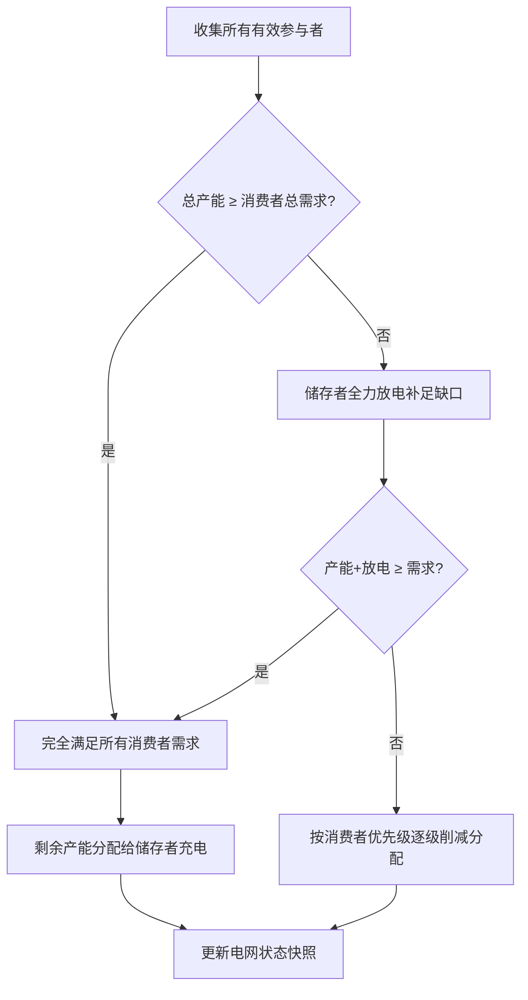
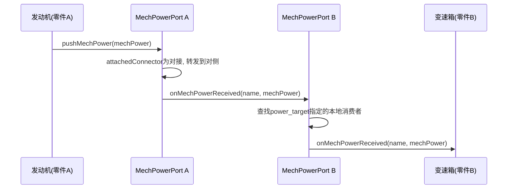
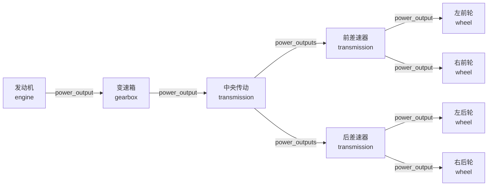

# 3.7 能量系统

能量系统是载具内部两套相互独立的能量管理基础设施——电力网络（EnergyGrid）和机械能网络（MechPower）。它们与信号系统类似，不属于某一类具体的子系统 type，而是横跨所有子系统的共享基础设施。任何子系统都可以通过实现对应的接口来参与能量网络的供需。

对深度玩家而言，理解能量系统有助于判断"为什么电动机突然没力了""电池为什么不充电""跨零件动力为什么传不过来"等问题；对 UGC 作者而言，能量系统的配置决定了载具的动力能否正确、高效地从源头传导到最终执行器。

## 能量系统解决什么

在动力系统中，发动机输出扭矩、电动机消耗电力——这些行为在单个零件内部运作良好。但一辆完整的载具往往由多个零件拼装而成：发动机可能在底盘零件中，轮胎可能在悬架零件中，电池可能在后备箱零件中。如何让前车的电力传输到后车的电动机？如何让发动机的动力跨越连接点到达另一端的轮胎？

能量系统提供了两套答案：

- **电力网络**：全载具共享的总线架构，自动完成发电、用电和储能的供需平衡，UGC 作者无需手动配置任何传播路径。
- **机械能网络**：逐级传递的点对点链路，通过 `power_output` 字段指定目标，配合连接点上的 `power_target` 实现跨零件接力。

## 电力网络：全载具共享的总线

电力网络是一套"总线模式"的电力管理机制。所有挂载到载具上的电力相关子系统——无论是生产者、消费者还是储存者——都在同一张网上运行。每个物理 tick，电网自动结算一次供需平衡。

### 三种角色

电力网络上的参与者分为三类：

| 角色       | 接口                   | 行为                         | 典型子系统             |
| -------- | -------------------- | -------------------------- | ----------------- |
| **生产者**  | `IEnergyProducer`    | 向电网提供电力，声明自身产能             | 电动机（再生发电时）        |
| **消费者**  | `IEnergyConsumer`    | 从电网取电，声明自身电力需求，支持优先级       | 电动机（驱动时）          |
| **储存者**  | `IEnergyStorage`     | 同时是生产者和消费者，根据自身储能状态充放电      | 电池               |

储存者是一个特殊角色——它同时实现了 `IEnergyProducer` 和 `IEnergyConsumer` 两个接口，可以根据当前储能状态动态切换角色：

- 当储能低于 99% 时，储存者以消费者身份向电网申报充电需求（需求功率 = `max_charge_rate`）；
- 当储能高于 0 时，储存者以生产者身份向电网申报放电能力（产能功率 = `max_discharge_rate`）。

一个载具内可以存在多个储存者（例如多块电池分布在不同零件中），电网会自动汇总所有储存者的充放电能力并统一调度。

### 每 tick 结算流程

电网的结算遵循"优先满足消费者，盈余充给储存者，不足由储存者补足"的策略：



关键细节：

- **优先级机制**：每个消费者可以声明自己的优先级（`getPriority()`，0.0\~1.0，默认 1.0）。当电力不足时，低优先级的消费者会先被削减分配，高优先级消费者优先满足。这使 UGC 作者可以确保关键系统（如驱动电动机）在电力紧张时比次要系统（如照明、雷达）优先获得供电。
- **储能放电限速**：储存者每个 tick 的实际放电量受自身当前储能限制——即使 `max_discharge_rate` 很高，如果储能已接近耗尽，它也无法提供更多瞬时功率（`实际放电功率 ≤ 当前储能 × tps`）。
- **电网状态快照**：每 tick 结算后，电网更新 `totalProduction`、`totalConsumption`、`totalStoredEnergy` 等快照值，供 HUD 显示或脚本查询。

### 当前版本适用范围

截至当前版本，模组内置的电力生产者和消费者主要包括：

- **电动机**：驱动时作为消费者取电；被外力拖动（下坡/减速）时作为生产者向电网回馈电能（再生发电）。
- **电池**：作为储存者，在电力盈余时充电、在电力不足时放电。
- **脚本子系统**：可通过 API 读取电网状态和电池电量，实现自定义逻辑。

目前独立的发电机（如内燃机驱动的交流发电机）和专用用电器（如雷达、主动防御系统、大功率照明）尚未完全实装。因此，在当前版本中，电力网络的核心场景是**电动机驱动 + 电池缓冲 + 再生发电回收**的纯电/混合动力链路。

### 脚本查询接口

脚本子系统（`machine_max:javascript`）可以通过 `SubsystemController` 获取电网实例，进而查询以下信息：

| 查询内容            | 方法                                         | 说明              |
| --------------- | ------------------------------------------ | --------------- |
| 总发电功率           | `energyGrid.getTotalProduction()`          | 当前所有生产者输出的总功率 (W) |
| 总耗电功率           | `energyGrid.getTotalConsumption()`         | 当前所有消费者消耗的总功率 (W) |
| 电网总储能           | `energyGrid.getTotalStoredEnergy()`        | 所有储存者当前储能之和 (J)  |
| 电网最大储能          | `energyGrid.getMaxStoredEnergy()`          | 所有储存者容量上限之和 (J)  |
| 电力是否充足          | `energyGrid.isPowerSufficient()`           | 总产能 ≥ 总需求时为 true |
| 某消费者满足率         | `energyGrid.getSupplyRatio(consumer)`      | 0.0\~1.0，需求被满足的比例 |
| 即时可用储能          | `energyGrid.getAvailableEnergy()`          | 可用于瞬时的总储能 (J)    |
| 消耗指定能量          | `energyGrid.consumeEnergy(requested)`      | 瞬时扣减储能，返回实际消耗量   |
| 补充指定能量          | `energyGrid.addEnergy(energy)`             | 按剩余容量比例分配，返回实际补充量 |

其中 `consumeEnergy` 和 `addEnergy` 是即时操作，不依赖每 tick 的电网结算，适合用于武器开火（瞬时大功率消耗）或外部能量源（如太阳能板）等场景。

## 机械能网络：逐级传递的动力链路

机械能网络是动力从发动机/电动机逐级传递到轮胎的路径。与电力网络的总线模式不同，机械能采用**点对点逐级传递**的方式——每一级明确指定下一级的目标。

### MechPower 数据

机械能的核心数据结构是 `MechPower`，它只包含两个字段：

| 字段      | 含义      | 单位      |
| ------- | ------- | ------- |
| `power` | 机械功率    | kW      |
| `speed` | 转速      | rad/s   |

通过功率和转速可以推导出扭矩（扭矩 = 功率 / 转速），因此这两个字段完整描述了机械能的状态。每一级接收者在收到 `MechPower` 后，可以根据自身特性改变转速和扭矩——例如变速箱通过减速比降低转速、提高扭矩，差速器通过分流权重将功率分配到不同输出端。

### 零件内的机械能传递

机械能的传递路径由两组配置共同决定：

- **生产者的 `power_output`**：定义机械能发送给本零件内的哪些目标。目标可以是子系统名或连接点名。例如发动机的 `power_output` 指向变速箱：
  ```json
  "subsystem.machine_max.engine": {
    "type": "machine_max:engine",
    "definition": "machine_max:ae86_engine",
    "power_output": ["subsystem.machine_max.gearbox"]
  }
  ```

- **连接点的 `power_target`**：定义本连接点收到的机械能应转发给本零件内的哪个目标。这是跨零件机械能传递的入口配置。例如底盘上的连接点 `rear_connection` 收到后桥传来的机械能，通过 `power_target` 转发给传动装置：
  ```json
  "connector.machine_max.rear_connection": {
    "locator": "RearAttach",
    "definition": "machine_max:fixed_up",
    "power_target": "subsystem.machine_max.rear_transmission"
  }
  ```

### 机械能端口：跨零件接力

`MechPowerPort` 是挂在连接点上的机械能接收器。当两个连接点对接后，机械能端口自动连通。它的工作原理如下：



具体过程：

1. 发动机通过 `pushMechPower` 向 `power_output` 指定的目标发送机械能。如果目标是本零件内的连接点，机械能被推送到该连接点的 `mechanicalEnergyPort`；
2. 连接点的 `MechPowerPort` 检查是否有对接的连接点（`attachedConnector`）。如果有，将机械能转发到对侧连接点的 `mechanicalEnergyPort`；
3. 对侧的 `MechPowerPort` 根据自身 `power_target` 字段查找本地接收者——可以是子系统名或另一个连接点名（用于进一步接力）；
4. 最终接收者（如变速箱、传动装置、轮胎）的 `onMechPowerReceived` 方法被调用，完成一级传递。

### 转速反馈

机械能链路不仅是单向的——它还支持转速反馈。接收者将自身的实际转速通过反馈链路传回生产者，使生产者能够感知负载状态：

- 发动机/电动机通过 `collectFeedbackSpeeds` 收集所有已连接消费者的转速；
- 系统计算所有反馈转速的平均值，用于耦合扭矩补偿——当发动机转速高于负载转速时施加驱动力矩使其匹配；
- 当存在转速反馈时，发动机/电动机的实际转速以 95% 内部 + 5% 外部的比例向负载转速靠拢，防止空载时转速无限升高。

这意味着：如果 `power_output` 链路中断（例如连接点未对接到位），发动机不仅无法将动力传输到轮胎，还会因为缺少转速反馈而处于空载状态——转速可能异常升高而无法正常工作。

### 典型机械能链路

以下是一个四驱载具的完整机械能链路，展示从发动机到四个轮胎的逐级传递：



每经过一级，机械能的转速和扭矩都可能发生变换：

- **变速箱**：通过减速比降低转速、提高扭矩（低速挡）或提高转速、降低扭矩（高速挡）。
- **传动装置/差速器**：按权重将输入功率分流到多个输出端，同时支持差速锁模式（强制输出端转速一致）。
- **轮胎**：将机械能转化为对地面的驱动力。

## 双网对比

电力网络和机械能网络虽然都负责能量管理，但设计理念截然不同：

| 特性     | 电力网络                     | 机械能网络                |
| ------ | ----------------------- | -------------------- |
| 拓扑模式   | 总线（全载具共享一张网）            | 点对点链（逐级指定目标）         |
| 配置复杂度  | 几乎无需手动配置（自动注册+结算）        | 需要逐级配置 `power_output` |
| 跨零件传播  | 自动（所有同网参与者无需关心物理位置）      | 依赖连接点的 `power_target` |
| 能量变换   | 无变换（电能即电能）              | 每级可变换转速/扭矩（减速比、分流权重）  |
| 反馈机制   | 无实时反馈（通过满足率查询快照）         | 有转速反馈（耦合扭矩补偿）        |
| 适用场景   | 电动机驱动、电池管理、辅助用电         | 内燃机/电动机 → 传动 → 轮胎   |
| 当前完成度  | 基础框架可用，发电机/用电器待实装       | 完整可用                |

> 二者并非互斥——一辆载具可以同时拥有电力网络和机械能网络。例如混动载具中，内燃机通过机械能网络驱动轮胎，同时带动发电机向电力网络供电；电动机从电力网络取电，也通过机械能网络驱动轮胎。两个网络在同一辆载具上独立运行，互不干扰。

## 对深度玩家的观察点

如果你主要从使用体验来理解能量系统，可以重点观察以下问题：

- **电动机突然没力**：如果油门踩到底但电动机输出明显下降，检查电池电量——电池储能过低时放电功率受 `max_discharge_rate` 和当前储能双重限制，可能已无法满足电动机的满功率需求。同时检查电动机的满足率——如果多个大功率设备同时运行，电力网络可能已进入优先级分配模式。
- **电池不充电**：电池充电有两个前提条件：(1) 储能低于 99%；(2) 电力网络存在剩余产能。如果电池始终不充电，可能是当前没有可用的电力生产者（如电动机未进入再生发电状态），或者所有产能已被消费者占满。
- **跨零件动力不畅**：如果载具含有拼装结构（如拖车、半挂），但拖车上的车轮不转动，检查连接点的 `power_target` 是否配置正确，以及整个机械能链路是否形成了完整的从动力源到轮胎的传递路径。
- **空载轰鸣**：如果发动机在无负载时转速异常飙升，很可能是因为机械能链路中断——检查 `power_output` 目标是否可及、连接点是否对接到位。
- **再生发电的实用场景**：在长下坡路段，电动机的再生发电可以将重力势能回收为电能存入电池。如果电池已满（储能接近上限），再生发电将无法继续充入，此时需要额外的制动方式（如机械刹车）来控制车速。

## UGC 设计建议

### 电力网络配置要点

电力网络的优势在于"几乎不需要配置"——只要子系统正确实现了对应的能源接口，挂载后就会自动注册到电网。UGC 作者在设计时主要关注以下几点：

- **电池参数的三维平衡**：`max_stored_energy`（总容量）、`max_charge_rate`（充电速度）和 `max_discharge_rate`（放电速度）共同决定了电池的实际效用。三者不宜简单等比例放大——一块超大容量但充放电都很慢的电池适合作为"续航电池"，而一块小容量但高倍率充放电的电池适合作为"爆发电池"（如应对武器系统的瞬时大功率需求）。
- **消费者优先级设定**：如果载具中有多个电力消费者，应明确各系统的优先级。建议将驱动电动机设为最高优先级（默认 1.0），辅助系统（照明、雷达等）设为较低优先级，确保电力紧张时载具仍能保持基本机动能力。
- **再生发电效率**：电动机的 `generator_efficiency` 默认 0.85，意为回收 85% 的制动能量。提高此值可增强制动能量回收能力，但也会使电动机在发电模式下的阻力更接近真实值，影响驾驶手感。

### 机械能链路配置要点

- **链路必须完整**：从动力源（发动机/电动机）到最终执行器（轮胎）的 `power_output` 链必须步步相接，不能有断层。建议在规划阶段画出类似上文的链路流程图，逐级确认。
- **跨零件连接点必须设置 `power_target`**：如果机械能需要跨越零件边界，接收侧连接点的 JSON 中必须包含 `power_target` 字段，指向本零件内应接收机械能的子系统。缺少此配置将导致机械能在连接点处中断。
- **`power_target` 与 `signal_targets` 独立配置**：连接点上的信号端口和机械能端口是两套独立的系统，互不依赖。即使信号传递正常，机械能传递仍需要独立的 `power_target` 配置。反之亦然。
- **差速器输出端的命名**：传动装置（`transmission`）的 `power_outputs` 字段支持多输出、多权重配置。在命名多个输出端时，建议使用描述性的目标名（如 `subsystem.machine_max.front_left_wheel` 而非缩写），提高可读性和可维护性。
- **测试空载行为**：在设计阶段，可以临时断开机械能链路的末端（如不连接轮胎），观察发动机/电动机在无反馈时的转速行为是否符合预期。如果空载转速过高，可以增大 `damping_factors` 的内部阻力系数来限制。

### 内容包中的连接点配置示例

以下是一个连接点的完整 JSON 配置示例，同时包含信号端口和机械能端口：

```json
"connector.machine_max.rear_drivetrain": {
  "locator": "RearAttachPoint",
  "definition": "machine_max:fixed_up",
  "power_target": "subsystem.machine_max.rear_differential",
  "signal_targets": {
    "wheel_control": ["subsystem.machine_max.car_controller"]
  },
  "signal_translations": {}
}
```

其中 `power_target` 指定了本连接点收到的机械能将转发给名为 `rear_differential` 的子系统。

### 能量相关的 Molang 查询

`vehicle` Molang 绑定对象直接暴露了电网状态属性，可在动画和 HUD 中使用，无需通过脚本中转：

| 属性                | 类型     | 说明                 |
| ----------------- | ------ | ------------------ |
| `vehicle.energy`     | double | 载具能量网当前总储能（J）      |
| `vehicle.max_energy` | double | 载具能量网最大总储能（J）      |

上述属性适用于动画控制器、HUD 文本和碰撞条件表达式。它们在每帧 `update` 时通过 `EnergyGrid.getTotalStoredEnergy()` 和 `EnergyGrid.getMaxStoredEnergy()` 实时刷新。

```molang
// 电量百分比（用于仪表盘指针旋转或 HUD 显示）
vehicle.energy / vehicle.max_energy

// 低电量警告（电量低于 10% 时触发）
vehicle.energy < vehicle.max_energy * 0.1 ? 1.0 : 0.0

// 将电量注入零件动画变量
v.energy_percent = vehicle.energy / vehicle.max_energy
```

> 如需在 Molang 中读取特定消费者的电力满足率或执行复杂的能量调度逻辑，仍建议使用脚本子系统（`machine_max:javascript`）调用 `EnergyGrid` API，将计算结果写入 `signalStorage` 后通过 `vehicle.get()` 查询。常规的仪表盘电量显示直接用 `vehicle.energy` / `vehicle.max_energy` 即可满足需求。

---

- 上一节：[3.6 信号系统](3.6-信号系统.md)
- 下一节：[3.8 武器系统](3.8-武器系统.md)
- 相关参考：[5.4 连接点定义](../5-内容包制作教程/5.4-连接点定义.md) / [5.5 子系统定义](../5-内容包制作教程/5.5-子系统定义.md)
