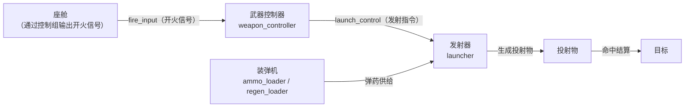

# 3.8 武器系统

武器相关子系统是 MachineMax 在版本迭代中逐步实装的新功能模块。目前已有四种子系统类型（武器控制器、发射器、装弹机和再生装弹机），辅以瞄准镜子系统和数据驱动的投射物系统，构成从目标选择、弹药管理到弹丸出膛与命中结算的完整火力链路。

对玩家来说，武器系统带来的是载具不再只靠碰撞伤人的战斗方式。对内容包作者来说，武器系统引入了一套与动力链并列的新配置维度：弹种设计、弹药供给策略、开火时序和后坐力管理。

> 本章聚焦子系统层面的行为说明。投射物的弹道参数、穿深模型和命中处理流程在内容包 JSON 中定义，第四章的装甲与伤害系统负责结算。投射物系统基于 BallisticsFramework 弹道 API 运行，弹药供给通过 `IAmmoConsumer` / `IAmmoSupplier` 接口在装弹机与发射器之间传递。

## 武器控制链概览

武器系统的四种子系统通过信号和弹药接口协同工作，形成一条两端分别接在"玩家意图"和"目标命中"上的控制链：

其中的关键分工是：武器控制器判断"现在能不能开火、该不该开火"；装弹机负责"有没有弹药、轮到哪一发"；发射器负责"把弹药变成投射物推出去"；投射物系统负责"飞过去、打中、算伤害"。四者各有边界，信号链路将它们串在一起。

## 武器控制器：火力指挥中枢

武器控制器（`weapon_controller`）在功能定位上与车辆控制器类似——它不直接产生破坏，而是接收目标坐标和开火信号，协调炮塔驱动、瞄准镜和发射器之间的指令传递。它通常挂载在炮塔座圈或武器站所在的零件上，通过信号系统向发射器下达开火指令，同时根据炮塔当前方位和俯仰角判断射击窗口是否就绪。

对深度玩家来说，武器控制器的存在意味着载具的火力不再只是"右键发射"——射击窗口、炮塔限位和弹种选择都是需要实际操作才能处理的战术要素。对上弹节奏、单发/连发模式、不同弹种的弹道差异等细节的管理，也由武器控制器居中调度。

## 发射器：弹丸出膛的末端执行器

发射器（`launcher`）是武器链的末端——它代表炮闩、导弹挂架、火箭发射管或多管机炮挂点等弹丸投射装置。发射器本身不管理弹药、不判断开火时机；它的职责是从装弹机获取弹药、从武器控制器接收发射指令，然后将弹药以数据驱动的方式生成投射物到世界中。

发射器支持以下关键配置：

- **后坐力吸收比例**：控制开火时后坐力有多少被载具本体吸收、有多少转化为零件位移。高比例的载具在连续射击时车身抖动更明显，但开火感更强；低比例则适合需要稳定瞄准的精密射击平台。
- **投射物类型引用**：通过静态属性指向 JSON 中定义的投射物类型（弹种），决定生成的是高速穿甲弹、低速爆炸弹还是曳光弹等。
- **射速控制**：发射器内建射击间隔，防止在武器控制器发出连续开火信号时以不受控的速率发射。

## 装弹机：弹药供给、装填模式与弹序管理

装弹机（`ammo_loader`）管理弹药从弹舱到发射器的全流程。它的核心职责包括弹药存储、装填时序控制和弹序循环三项，并通过一个关键开关——`roundByRound` 参数——支持两种截然不同的装填模式。

### 两种装填模式

装弹机通过静态属性 `roundByRound` 区分工作方式，这使得同一个子系统类型能够模拟从单发火炮到链式机炮的多种武器风格。

**逐发装填模式（`roundByRound = true`）**——模拟火炮、坦克主炮等大口径武器。每发射一发后，装弹机进入装填间隔，经过 `reloadTimeTicks` 时间后下一发弹药才准备就绪。在此期间发射器无法再次开火。装填间隔模拟的是炮闩开锁、退壳、从弹舱取弹、压入炮膛、闭锁的完整机械周期。这种模式下，射速完全由装填时间决定——大威力主炮通常有较长的装填时间，形成"高伤害、低射速"的节奏。

**弹链/弹匣模式（`roundByRound = false`）**——模拟机炮、链式机枪等弹链供弹武器。日常射击中每发弹药瞬时就绪，发射器可以连续射击。装填时间仅在**切换供弹来源**时生效——例如从一个弹药架换到另一个弹药架时需要短暂的换弹链延迟。这种模式适合需要高射速压制的轻武器（如 M2 勃朗宁、加特林），连续射击感强，但弹药消耗也快。

> 对于内容包作者来说，`roundByRound` 是塑造武器性格的第一道开关。想让玩家感受到 T-34 坦克那种"开炮后等待装弹手塞入下一发"的节奏感，用逐发装填；想让玩家体验机关炮扫射的快感，用弹链模式。

### 弹药存储与级联供给

装弹机自身维护一个内部弹舱（`magazine_capacity`），作为弹药的物理载体。弹舱中的每发弹药可以是不同投射物类型——内容包作者可以定义从穿甲弹、高爆弹到烟雾弹的混合弹链。弹药兼容性在**发射时逐发校验**：发射器取到弹药后会检查自身是否能接受该弹种，若不兼容则跳过该发继续尝试下一发。

装弹机还支持**级联供给**：一个装弹机可以同时是弹药消费者（从上游弹舱取弹）和供给者（向下游发射器供弹）。这使得大型载具可以实现多级弹药管理——例如一个车体主弹仓（容量大、装填慢）向自动装弹机（容量小、装填快）供弹，再由自动装弹机向炮闩供弹，形成两级装填体系。

### 弹序循环

装弹机支持多种弹序策略：顺序循环（如 AP → HE → AP → HE）、单发复装（发射后重新装填同类型弹药），或按固定弹链表逐一递进。弹序循环在内容包中通过配置定义，使作者可以精确控制每一发弹药的出膛顺序。

## 再生装弹机：能量武器、街机弹药与双模式再生

再生装弹机（`regen_loader`）是装弹机的替代方案，专为不需要实体弹药的武器设计。与常规装弹机"消耗实体弹药才能发射"的模式不同，再生装弹机通过内置的再生逻辑恢复弹药容量，发射器仅在有可用容量时才能开火。

与装弹机的 `roundByRound` 对应，再生装弹机通过 `regenRoundByRound` 参数区分两种再生策略：

**随打随产模式（`regenRoundByRound = true`）**——每消耗一发弹药后立即开始再生这一发，经过 `regen_per_minute` 定义的速率恢复。适合能量武器（激光电容、等离子炮）：每次射击后电容自动充电，连续发射速度由充电速率决定。每再生一发可从电力网消耗 `energy_cost_per_round` 能量。

**整弹仓再生模式（`regenRoundByRound = false`）**——弹仓**完全打空**后才触发再生，经过一段冷却时间后一次性回满至 `magazine_capacity`。适合街机风格武器：例如六联装导弹架全部发射后进入冷却，冷却完成后六枚导弹同时重新生成，期间玩家无需回基地补弹。`regen_per_minute` 在此模式下的语义为"每分钟可完成多少次完整装填"，总能量成本在回满时一次性扣除。

> 整弹仓再生模式下，弹仓若剩一发未打完则永远不会触发再生——这是有意设计，迫使玩家清空弹仓才能获得满弹奖励。若希望支持"不满即补"行为，将 `regenRoundByRound` 设为 `true` 即可。

再生装弹机使内容包作者可以设计从"缓慢充能的能量炮"到"快速重生的街机导弹"、从"依赖能量网的电容器"到"冷却驱动的免费弹药"等不同手感的武器供给方案。

## 武器链中的信号流

武器系统各组件通过以下信号频道通信：

| 频道名 | 方向 | 说明 |
|--------|------|------|
| `fire_input_p1` | 控制组 → 武器控制器 | 玩家开火意图（来自鼠标左键等按键绑定） |
| `launch_control` | 武器控制器 → 发射器 | 开火许可与弹种选择指令 |
| `ammo_state` | 装弹机 → 武器控制器 | 当前弹药余量、装填进度反馈 |
| `target_coords` | 瞄准镜/炮塔 → 武器控制器 | 目标位置坐标，用于弹道计算和射击窗口判定 |

武器控制器的动态属性定义了输入和输出信号频道，内容包作者需要在零件 JSON 中将这些频道正确串联。例如，炮手座位的控制组预设（`default_gunner`）将鼠标左键绑定到 `fire_input_p1` 频道，武器控制器监听同一频道以接收开火指令。

## 对深度玩家的观察点

- **弹药耗尽是一等威胁**：装弹机弹药打光后，即使武器控制器和发射器完好，载具也失去了火力。长途作战中应关注弹舱余量。
- **后坐力改变瞄准**：连射时后坐力会逐渐改变炮管朝向，需要手动修正或等待炮塔稳定。后坐力吸收比例越高，这种效应越明显。
- **装填节奏决定火力密度**：装填间隔是武器链的瓶颈——提升发射器射速不能超过装弹机的装填速率。
- **再生装弹机的战术取舍**：能量武器在连续发射中可能耗尽储能，需要等待再生。在储能见底的瞬间被敌人逼近是常见死法。

## 对内容包作者的配置指引

### 规划武器链

建议从载具定位出发，反向确定武器配置：

1. 确定载具的战术角色：狙击型（单发大威力）、压制型（连射）、街机型（快速再生弹药）。
2. 选择发射器数量与位置：主炮、副炮、机枪挂点等。
3. 配置对应的装弹机或再生装弹机：决定弹药再生/装填模式。
4. 设置武器控制器与信号链路：确保座舱控制组正确输出开火信号。

### 与信号系统、控制组的配合

武器系统高度依赖信号和控制组——玩家开火不是由"右键"硬编码触发，而是通过控制组中的按键绑定将特定按键映射到 `fire_input` 频道。内容包作者需要在座椅子系统的 `control_group_preset` 中引用合适的控制组预设（如炮手使用 `default_gunner`），或在内容包的 `control_groups/` 目录下自行定义。

关于控制组预设的完整配置格式，见 [5.9 辅助模块](../5-内容包制作教程/5.9-辅助模块.md) 中的控制组预设定义一节。

### 投射物类型的定义

发射器类型通过 `definition` 字段引用投射物类型定义（位于内容包的 `projectiles/` 模块），控制弹道参数（初速、质量、阻力系数、穿深基数等）。投射物系统使用 Structure of Arrays 架构在物理线程中运行，命中后通过 BallisticsFramework 的 `BFDamageApi.hurt()` 进入穿深判定与伤害结算。

---

- 上一节：[3.7 能量系统](3.7-能量系统.md)
- 下一节：[4.1 摩擦与抓地力](../4-物理与战斗机制/4.1-摩擦与抓地力.md)
- 相关参考：[5.9 辅助模块](../5-内容包制作教程/5.9-辅助模块.md) / [5.5 子系统定义](../5-内容包制作教程/5.5-子系统定义.md)
