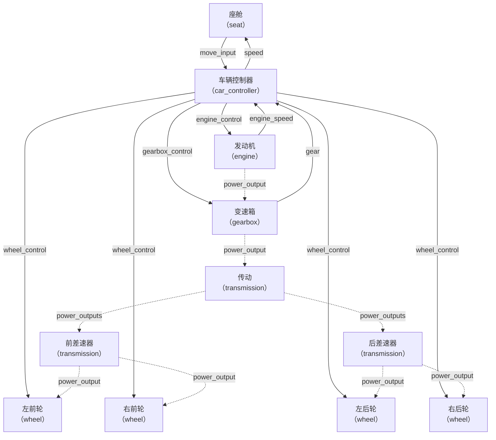

# 5.5 子系统定义

子系统是赋予零件实际功能的核心机制。每个子系统通过"型号定义 + 实例配置"两层结构完成注册：**静态属性**（通过 `subsystems/` 模块定义某类子系统的型号参数）和**动态属性**（在零件 JSON 的子零件 `subsystems` 字段中内联配置，指定该零件实例挂载哪个型号的子系统以及信号路由目标）。

本章面向 UGC 作者，按子系统类型逐类说明静态属性的可配字段以及动态属性中需要额外指定的实例化参数。

在阅读本章之前，建议先完成：

- [5.3 零件定义](5.3-零件定义.md)中关于子零件结构、碰撞箱、交互判定区等内容的理解；
- [5.4 连接点定义](5.4-连接点定义.md)中关于信号传输目标（`signal_targets`）和机械能传输（`power_target`）的概念；
- 第三章各子系统详解可在需要深入了解具体行为时参考。

## type 与 definition 的职责分离

子系统采用两层引用机制：

- **`type`**：决定子系统的"行为类别"（如 `machine_max:engine` 表示这是一台发动机）。type 由模组内置，UGC 作者不能新增 type，只能选用已有的。
- **`definition`**：决定该行为类别下的"具体型号参数"（如某款 V8 发动机的功率曲线、怠速转速等）。`definition` 指向 `subsystems/` 模块中的一个 JSON 文件，UGC 作者通过创建新的 definition 文件来定制自己的子系统型号。

可以理解为：`type` = 类，`definition` = 该类的配置化实例模板。

***

## 静态属性（subsystems/ 模块）

静态属性定义某一类子系统的型号参数，存放在内容包的 `subsystems/` 模块目录下。多个零件可以通过 `definition` 字段引用同一个静态定义，实现型号复用。

### 文件位置

子系统静态定义 JSON 放在内容包对应的命名空间目录下：

```
spark_modules/
└── my_pack/
    └── my_mod/
        └── subsystems/
            ├── engine_v8.json
            ├── seat_single.json
            └── battery_large.json
```

每个文件名（不含扩展名）即为该子系统定义的内部 ID。模组加载时，以 `命名空间:文件名` 的格式注册（如 `my_mod:engine_v8`），后续在零件 JSON 中通过 `definition` 字段以此格式引用。

> `subsystems/` 目录下的 JSON 文件可以任意嵌套子文件夹来组织（如 `subsystems/engines/v8.json`），但注册名仅取文件名（不含扩展名和路径），即 `my_mod:v8`。嵌套路径仅用于作者自行分类，不影响注册结果。

### type 分发

`subsystems/` 下的每个 JSON 文件通过内置的 `type` 字段区分子系统类型。不同类型的子系统拥有完全不同的参数集合，由模组根据 type 字段自动匹配对应的反序列化逻辑。所有子系统类型如下：

| type 值                             | 含义       | 说明                            |
| ---------------------------------- | -------- | ----------------------------- |
| `machine_max:basic`                | 基础子系统    | 无实际功能，仅作为可破坏弱点向零件传导伤害         |
| `machine_max:engine`               | 发动机子系统   | 内燃机，提供机械能，需燃料                 |
| `machine_max:motor`                | 电动机子系统   | 电机，提供机械能，需电力，可反向发电            |
| `machine_max:gearbox`              | 变速箱子系统   | 变速器，提供多级减速比，支持自动/手动换挡         |
| `machine_max:car_controller`       | 车辆控制子系统  | 处理驾驶输入信号，辅助变速箱与轮胎的协调控制        |
| `machine_max:motorbike_controller` | 摩托车控制子系统 | 摩托车特有控制逻辑，如倾斜角度限制与平衡修正        |
| `machine_max:transmission`         | 传动子系统    | 将输入动力按权重分流至多个输出端，支持差速锁        |
| `machine_max:joint`                | 驱动机构子系统  | 驱动高级连接点的各轴运动，支持平动与旋转伺服        |
| `machine_max:wheel`                | 轮胎子系统    | 轮毂电机，驱动 X 轴旋转与 Y 轴转向伺服，支持 ABS |
| `machine_max:seat`                 | 座椅子系统    | 提供乘员乘坐位置、视角与输入信号输出            |
| `machine_max:battery`              | 电池子系统    | 储存电力，支持充放电                    |
| `machine_max:lighting`             | 照明子系统    | 提供客户端体积光视觉效果                  |
| `machine_max:item_storage`         | 物品存储子系统  | 可存储物品的容器，指定行列数                |
| `machine_max:camera`               | 摄像头子系统   | 提供视角（可被其他系统引用以获取画面）           |
| `machine_max:javascript`           | 自定义脚本子系统 | 执行 JavaScript 脚本，实现自定义逻辑      |
| `machine_max:turret_controller`    | 炮塔控制子系统  | 控制炮塔的位置、角度与开火                 |
| `machine_max:turret`               | 炮塔驱动子系统  | 驱动炮塔的 X/Y 轴旋转伺服               |
| `machine_max:signal_convert`       | 信号转换器子系统 | 将输入信号转译为其他名称，并支持信号延迟          |

### 公共基础字段（BasicAttr）

所有子系统类型共享一组基础属性，定义子系统的耐久度、伤害传导和可见性：

| 字段                 | 类型  | 必需 | 默认值     | 说明                                                                  |
| ------------------ | --- | -- | ------- | ------------------------------------------------------------------- |
| `basic_durability` | 浮点数 | 否  | `20.0`  | 子系统自身耐久度。归零后子系统瘫痪。详见 [5.3 零件定义 > 关于 share\_durability](5.3-零件定义.md) |
| `pass_damage`      | 布尔值 | 否  | `true`  | 是否将受到的伤害传递给子系统持有者（通常为载具）。设为 `false` 时伤害由子系统完全吸收                     |
| `limit_damage`     | 布尔值 | 否  | `false` | 是否限制传递的伤害值不超过子系统当前剩余耐久度。例如子系统剩余 20 耐久，受到 40 伤害时，只传递 20 给持有者         |
| `hidden`           | 布尔值 | 否  | `false` | 是否在 HUD 等处隐藏子系统的显示。常用于纯粹提供模型部位损坏差分的无功能子系统                           |

### 公共音效字段（BasicSoundAttr）

所有子系统均支持以下基础音效配置：

| 字段                     | 类型   | 必需 | 默认值 | 说明        |
| ---------------------- | ---- | -- | --- | --------- |
| `sounds.on_destroyed`  | 音效事件 | 否  | 空音效 | 子系统被摧毁时播放 |
| `sounds.on_activate`   | 音效事件 | 否  | 空音效 | 子系统激活时播放  |
| `sounds.on_deactivate` | 音效事件 | 否  | 空音效 | 子系统停用时播放  |

> 音效事件的格式为 `namespace:path`，如 `machine_max:subsystem.gearbox.clutch_in`。音效资源需放置在内容包的 `sounds/` 目录下，并遵循 Minecraft 原版音效注册规范。

***

### 子系统各类型静态属性详解

以下按子系统类型逐类列出除公共字段外的特定参数。

#### 基础子系统（basic）

基础子系统无额外参数，仅包含公共基础字段和公共音效字段。它没有实际功能逻辑，主要用于：

- 作为载具的可破坏弱点部位（如油箱、弹药架）；
- 提供模型部位损坏的视觉差分控制。

```json
{
  "basic_durability": 50.0,
  "pass_damage": true,
  "limit_damage": true,
  "hidden": true,
  "sounds": {
    "on_destroyed": "my_mod:subsystem.weak_point.explode",
    "on_activate": "minecraft:empty_sound",
    "on_deactivate": "minecraft:empty_sound"
  }
}
```

#### 发动机子系统（engine）

| 字段                      | 类型       | 必需 | 默认值                                  | 说明                                                          |
| ----------------------- | -------- | -- | ------------------------------------ | ----------------------------------------------------------- |
| `max_power`             | 浮点数      | 是  | —                                    | 最大功率（kW）                                                    |
| `max_torque`            | 浮点数      | 是  | —                                    | 最大扭矩（N·m）                                                   |
| `idle_rpm`              | 浮点数      | 否  | `500.0`                              | 怠速转速（rpm）。低于此值时发动机会熄火                                       |
| `idle_rpm_torque_ratio` | 浮点数      | 否  | `0.333`                              | 怠速扭矩比（0\~1）。怠速时扭矩占最大扭矩的比例                                   |
| `max_torque_rpm`        | 浮点数      | 否  | `5200.0`                             | 峰值扭矩对应转速（rpm）                                               |
| `red_line_rpm`          | 浮点数      | 否  | `7500.0`                             | 红线转速（rpm）。超过此值发动机有损坏风险                                      |
| `red_line_torque_ratio` | 浮点数      | 否  | `0.9`                                | 红线扭矩比（0\~1）。红线转速处的扭矩占最大扭矩的比例                                |
| `inertia`               | 浮点数      | 否  | `10.0`                               | 发动机系统转动惯量（kg·m²）。越大响应越迟钝                                    |
| `four_stroke`           | 布尔值      | 否  | `true`                               | 是否为四冲程发动机。设为 `false` 则为二冲程                                  |
| `cylinder_count`        | 整数       | 否  | `4`                                  | 气缸数。影响音效合成的点火频率                                             |
| `damping_factors`       | 浮点数数组    | 否  | `[20.0, 0.1, 0.00005]`               | 发动机各阶阻力系数，分别为常数项、一次项、二次项……递增（N·m/(rad/s)^n）。顺序索引越高对应转速的幂次越高 |
| `control_inputs`        | 字符串数组    | 否  | `["engine_control", "move_input"]` | 油门控制信号的接收频道名，优先级从高到低。系统按顺序查找第一个有值的信号作为油门输入                  |
| `sounds.working_sounds` | 字符串到音效事件 | 否  | `{}`                                 | 自定义工况音效映射。键为转速（如 `"800"`、`"3000"`），值为对应音效。不为空时覆盖模组自动合成的音效   |

```json
{
  "basic_durability": 200.0,
  "pass_damage": true,
  "limit_damage": false,
  "hidden": false,
  "max_power": 350.0,
  "max_torque": 520.0,
  "idle_rpm": 650.0,
  "idle_rpm_torque_ratio": 0.3,
  "max_torque_rpm": 4800.0,
  "red_line_rpm": 8000.0,
  "red_line_torque_ratio": 0.85,
  "inertia": 8.0,
  "four_stroke": true,
  "cylinder_count": 8,
  "damping_factors": [15.0, 0.08, 0.00003],
  "control_inputs": ["engine_control", "move_input"],
  "sounds": {
    "on_activate": "my_mod:subsystem.engine.start",
    "on_deactivate": "my_mod:subsystem.engine.stop",
    "on_destroyed": "my_mod:subsystem.engine.explode",
    "working_sounds": {}
  }
}
```

#### 电动机子系统（motor）

| 字段                      | 类型       | 必需 | 默认值                                                   | 说明                                                        |
| ----------------------- | -------- | -- | ----------------------------------------------------- | --------------------------------------------------------- |
| `particle_locator`      | 字符串      | 否  | `""`                                                  | 粒子定位器名称。模型中的同名定位器将作为电机运转时的粒子发射点                           |
| `max_power`             | 浮点数      | 是  | —                                                     | 最大功率（kW）                                                  |
| `max_torque`            | 浮点数      | 否  | `100.0`                                               | 最大扭矩（N·m），通常在低转速时达到                                       |
| `red_line_rpm`          | 浮点数      | 否  | `10000.0`                                             | 红线/最高转速（rpm）                                              |
| `red_line_power_ratio`  | 浮点数      | 否  | `0.8`                                                 | 红线转速处的功率占峰值功率的比例（0\~1）。控制高转速区功率衰减程度。真实永磁同步电机通常约 0.7\~0.85 |
| `inertia`               | 浮点数      | 否  | `10.0`                                                | 电机系统转动惯量（kg·m²）                                           |
| `damping_factors`       | 浮点数数组    | 否  | `[10.0, 0.1, 0.00005]`                                | 电机系统各阶阻力系数，同发动机                                           |
| `generator_efficiency`  | 浮点数      | 否  | `0.85`                                                | 发电效率（0\~1）。电机反转（被外力拖动）时将机械能转换为电能时的效率                      |
| `control_inputs`        | 字符串数组    | 否  | `["motor_control", "engine_control", "move_input"]` | 油门控制信号的接收频道名，优先级从高到低                                      |
| `sounds.working_sounds` | 字符串到音效事件 | 否  | `{}`                                                  | 自定义工况音效映射，同发动机。不为空时覆盖模组自动合成的音效                            |

```json
{
  "basic_durability": 150.0,
  "max_power": 250.0,
  "max_torque": 400.0,
  "red_line_rpm": 12000.0,
  "red_line_power_ratio": 0.8,
  "inertia": 6.0,
  "damping_factors": [10.0, 0.08, 0.00003],
  "generator_efficiency": 0.9,
  "control_inputs": ["motor_control", "move_input"],
  "sounds": {
    "on_activate": "my_mod:subsystem.motor.start",
    "on_deactivate": "my_mod:subsystem.motor.stop",
    "on_destroyed": "my_mod:subsystem.motor.destroy"
  }
}
```

#### 变速箱子系统（gearbox）

| 字段                  | 类型    | 必需 | 默认值                               | 说明                                        |
| ------------------- | ----- | -- | --------------------------------- | ----------------------------------------- |
| `final_ratio`       | 浮点数   | 否  | `10.0`                            | 最终减速比，用于整体缩放所有挡位的减速比                      |
| `ratios`            | 浮点数数组 | 否  | `[-3.5, 3.5, 2.5, 1.7, 1.4, 1.1]` | 各挡减速比，升序排列。负值表示倒挡。索引 0 为倒挡，索引 1 起为一挡、二挡…… |
| `switch_time`       | 浮点数   | 否  | `0.3`                             | 换挡所需时间（秒）。期间离合断开，动力不传递                    |
| `control_inputs`    | 字符串数组 | 否  | `["gearbox_control"]`             | 换挡控制信号的接收频道名                              |
| `sounds.clutch_in`  | 音效事件  | 否  | 默认音效                              | 离合接入时播放的音效                                |
| `sounds.clutch_out` | 音效事件  | 否  | 默认音效                              | 离合断开时播放的音效                                |
| `sounds.gear_up`    | 音效事件  | 否  | 默认音效                              | 升挡时播放的音效                                  |
| `sounds.gear_down`  | 音效事件  | 否  | 默认音效                              | 降挡时播放的音效                                  |

```json
{
  "basic_durability": 120.0,
  "final_ratio": 9.5,
  "ratios": [-4.0, 4.0, 2.8, 1.9, 1.4, 1.0, 0.75],
  "switch_time": 0.25,
  "control_inputs": ["gearbox_control"],
  "sounds": {
    "clutch_in": "my_mod:subsystem.gearbox.clutch_in",
    "clutch_out": "my_mod:subsystem.gearbox.clutch_out",
    "gear_up": "my_mod:subsystem.gearbox.up",
    "gear_down": "my_mod:subsystem.gearbox.down"
  }
}
```

#### 车辆控制子系统（car\_controller）

| 字段                           | 类型     | 必需 | 默认值                | 说明                                                                          |
| ---------------------------- | ------ | -- | ------------------ | --------------------------------------------------------------------------- |
| `min_steering_radius`        | 浮点数    | 否  | `5.0`              | 最小转向半径（m）                                                                   |
| `lateral_acceleration`       | 浮点数或对象 | 否  | 预设曲线               | 横向加速度上限与车速的关系。单值时使用恒定值；也可用键值对指定速度-加速度曲线（键为车速 km/h，值为最大横向加速度 m/s²）。超过上限时触发漂移 |
| `max_drift_angular_velocity` | 浮点数或对象 | 否  | 预设曲线               | 最大漂移角速度与车速的关系。同 `lateral_acceleration`，可以为单值或曲线。控制漂移时的旋转速率，单位°/s                  |
| `manual_gear_shift`          | 布尔值    | 否  | `false`            | 是否启用手动换挡。为 `true` 时系统不自动换挡，由输入信号控制                                          |
| `auto_hand_brake`            | 布尔值    | 否  | `true`             | 是否在无驾驶输入时自动拉手刹                                                              |
| `drift_assist`               | 布尔值    | 否  | `true`             | 是否启用漂移辅助。开启后系统在高速过弯时辅助车辆维持漂移姿态                                              |
| `control_inputs`             | 字符串数组  | 否  | `["move_input"]` | 驾驶控制信号的接收频道名                                                                |
| `sounds.handbrake_on`        | 音效事件   | 否  | 默认音效               | 手刹拉起时播放的音效                                                                  |
| `sounds.handbrake_off`       | 音效事件   | 否  | 默认音效               | 手刹释放时播放的音效                                                                  |

```json
{
  "basic_durability": 100.0,
  "min_steering_radius": 4.5,
  "lateral_acceleration": {
    "0": 9.8,
    "60": 11.0,
    "120": 9.0
  },
  "max_drift_angular_velocity": {
    "0": 172,
    "60": 286,
    "120": 143
  },
  "manual_gear_shift": false,
  "auto_hand_brake": true,
  "drift_assist": true,
  "control_inputs": ["move_input"],
  "sounds": {
    "on_activate": "my_mod:subsystem.controller.start",
    "on_deactivate": "my_mod:subsystem.controller.stop"
  }
}
```

#### 摩托车控制子系统（motorbike\_controller）

继承车辆控制子系统的所有字段，额外增加以下摩托车特有参数：

| 字段                            | 类型  | 必需 | 默认值    | 说明                                  |
| ----------------------------- | --- | -- | ------ | ----------------------------------- |
| `max_angle`                   | 浮点数 | 否  | `30.0` | 最大倾斜角度（°）。超过此角度视作失去平衡，不再修正姿态        |
| `parking_angle`               | 浮点数 | 否  | `5.0`  | 停车时的目标倾斜角度（°）                       |
| `correction_force_multiplier` | 浮点数 | 否  | `1.0`  | 修正力倍率。整体缩放摩托车控制系统的平衡调节力。小于 1 使修正更柔和 |

```json
{
  "basic_durability": 100.0,
  "min_steering_radius": 3.5,
  "max_angle": 28.0,
  "parking_angle": 6.0,
  "correction_force_multiplier": 1.1,
  "auto_hand_brake": false,
  "drift_assist": false,
  "control_inputs": ["move_input"]
}
```

#### 传动子系统（transmission）

| 字段                         | 类型    | 必需 | 默认值             | 说明                                                               |
| -------------------------- | ----- | -- | --------------- | ---------------------------------------------------------------- |
| `diff_lock`                | 枚举字符串 | 否  | `"auto"`        | 差速锁模式。可选值：`"true"`（常锁）、`"false"`（常开）、`"auto"`（自动）、`"manual"`（手动） |
| `diff_lock_sensitivity`    | 浮点数   | 否  | `1.0`           | 差速锁灵敏度。增大该值使差速锁响应更快（仅 `"auto"` 或 `"manual"` 模式有效）                |
| `auto_diff_lock_threshold` | 浮点数   | 否  | `10.0`          | 自动差速锁阈值（%）。当输出端反馈转速差距百分比超过此值且 `diff_lock` 为 `"auto"` 时自动锁止       |
| `control_inputs`           | 字符串数组 | 否  | `["car_control"]` | 手动差速锁控制信号接收频道名（仅 `"manual"` 模式有效）                              |

```json
{
  "basic_durability": 80.0,
  "diff_lock": "auto",
  "diff_lock_sensitivity": 0.8,
  "auto_diff_lock_threshold": 15.0,
  "control_inputs": ["car_control"]
}
```

#### 驱动机构子系统（joint）

驱动机构子系统通过驱动高级连接点各轴的运动来实现旋转/平动功能，如炮塔旋转、机械臂伸缩等。其轴属性 `axes` 使用 `MotorAttr` 结构。

| 字段               | 类型  | 必需 | 默认值 | 说明                                       |
| ---------------- | --- | -- | --- | ---------------------------------------- |
| `locator`        | 字符串 | 是  | —   | 被控制的连接点 Locator 名称。模型中的同名定位器将被系统识别为驱动目标  |
| `rotation_order` | 字符串 | 是  | —   | 旋转顺序，指定多轴旋转时的欧拉角应用顺序。如 `"YXZ"`、`"ZYX"` 等 |
| `axes`           | 对象  | 是  | —   | 各轴驱动参数。键为轴名（见下表），值为 `MotorAttr` 对象       |

**轴名列表**：

| 键    | 含义      | 单位 |
| ---- | ------- | -- |
| `x`  | X 轴平动   | 米  |
| `y`  | Y 轴平动   | 米  |
| `z`  | Z 轴平动   | 米  |
| `xr` | 绕 X 轴旋转 | 度  |
| `yr` | 绕 Y 轴旋转 | 度  |
| `zr` | 绕 Z 轴旋转 | 度  |

**MotorAttr 字段**：

| 字段                       | 类型        | 必需 | 默认值  | 说明                                                         |
| ------------------------ | --------- | -- | ---- | ---------------------------------------------------------- |
| `lower_limit`            | 浮点数       | 否  | —    | 关节位置下限。规则同 [5.4 连接点定义 > 关节限位规则](5.4-连接点定义.md)              |
| `upper_limit`            | 浮点数       | 否  | —    | 关节位置上限，规则同上                                                |
| `equilibrium`            | 浮点数       | 否  | —    | 平衡位置。关节在无驱动力作用时趋向恢复到的目标位置                                  |
| `stiffness`              | 浮点数       | 否  | —    | 刚度系数。越大关节抵抗变形的力越强                                          |
| `damping`                | 浮点数       | 否  | —    | 阻尼系数。越大关节运动的能量耗散越快                                         |
| `needs_power`            | 布尔值       | 是  | —    | 是否需要机械能输入。设为 `true` 时只有收到机械能（通过连接点的 `power_target`）才能产生驱动力 |
| `max_force`              | 浮点数       | 是  | —    | 最大驱动力（平动轴 N）或最大驱动力矩（旋转轴 N·m）。由输入信号值乘以该值得到实际驱动力/力矩          |
| `max_brake_force`        | 浮点数       | 是  | —    | 最大制动力/制动力矩。当无驱动输入时施加，用于减速制动                                |
| `max_speed`              | 浮点数       | 是  | —    | 最大速度（m/s）或最大角速度（°/s）。速度到达此值后驱动力/力矩开始衰减至零                   |
| `target_speed_inputs`    | 字符串数组     | 是  | —    | 目标速度信号的接收频道名，优先级从高到低。信号值范围应在 -1\~1，负值表示反向                  |
| `target_position_inputs` | 字符串数组     | 否  | `[]` | 目标位置信号的接收频道名，优先级从高到低。用于伺服模式，信号值范围应在 -1\~1 或绝对角度值           |
| `speed_outputs`          | 字符串到字符串数组 | 否  | `{}` | 速度反馈信号的发送频道与目标                                             |
| `position_outputs`       | 字符串到字符串数组 | 否  | `{}` | 位置反馈信号的发送频道与目标                                             |

```json
{
  "basic_durability": 80.0,
  "locator": "TurretBase",
  "rotation_order": "YXZ",
  "axes": {
    "yr": {
      "lower_limit": -180.0,
      "upper_limit": 180.0,
      "stiffness": 500,
      "damping": 30,
      "needs_power": true,
      "max_force": 20000,
      "max_brake_force": 5000,
      "max_speed": 90,
      "target_speed_inputs": ["turret_yaw"],
      "target_position_inputs": ["turret_yaw_pos"],
      "speed_outputs": {"turret_yaw_speed": ["local", "global"]},
      "position_outputs": {"turret_yaw_angle": ["local", "global"]}
    },
    "xr": {
      "lower_limit": -10.0,
      "upper_limit": 45.0,
      "needs_power": true,
      "max_force": 15000,
      "max_brake_force": 3000,
      "max_speed": 45,
      "target_speed_inputs": ["turret_pitch"],
      "target_position_inputs": ["turret_pitch_pos"]
    }
  }
}
```

#### 轮胎子系统（wheel）

轮胎子系统为轮毂电机，驱动轮胎绕 X 轴旋转（滚动）与 Y 轴旋转（转向）。其静态属性分为滚动轴和转向轴两套参数。

| 字段                      | 类型    | 必需 | 默认值                                 | 说明                      |
| ----------------------- | ----- | -- | ----------------------------------- | ----------------------- |
| `control_inputs`        | 字符串数组 | 否  | `["wheel_control", "move_input"]` | 车轮控制信号的接收频道名，优先级从高到低    |
| `abs_enabled`           | 布尔值   | 否  | `false`                             | 是否启用 ABS 防抱死制动          |
| `abs_target_slip_ratio` | 浮点数   | 否  | `0.15`                              | ABS 目标滑移率，控制在峰值制动力的滑移范围 |
| `abs_wheel_radius`      | 浮点数   | 否  | `0.3`                               | ABS 计算使用的轮胎半径（m）        |
| `sounds.brake_on`       | 音效事件  | 否  | 默认音效                                | 刹车启用时播放的音效              |
| `sounds.brake_off`      | 音效事件  | 否  | 默认音效                                | 刹车释放时播放的音效              |

**滚动轴（roll）参数**：

| 字段                  | 类型  | 必需 | 默认值       | 说明                                        |
| ------------------- | --- | -- | --------- | ----------------------------------------- |
| `max_drive_force`   | 浮点数 | 否  | `10000.0` | 最大驱动力矩（N·m）。信号值乘以该值得到实际驱动力矩             |
| `max_brake_force`   | 浮点数 | 否  | `3500.0`  | 最大常规制动力矩（N·m）                            |
| `max_hand_brake_force` | 浮点数 | 否  | `0.0`     | 最大手刹制动力矩（N·m）                            |
| `max_rpm`           | 浮点数 | 否  | `30000.0` | 最大转速（RPM）                                      |

**转向轴（steering）参数**：

| 字段          | 类型  | 必需 | 默认值      | 说明                                        |
| ----------- | --- | -- | -------- | ----------------------------------------- |
| `max_force` | 浮点数 | 否  | `2000.0` | 最大转向力矩（N·m）。由输入信号值乘以该值得到实际力矩              |
| `max_speed` | 浮点数 | 否  | `180`    | 最大转向角速度（°/s）                              |

```json
{
  "basic_durability": 150.0,
  "control_inputs": ["wheel_control", "move_input"],
  "roll": {
    "max_drive_force": 8000,
    "max_brake_force": 4000,
    "max_hand_brake_force": 1500,
    "max_rpm": 30000.0
  },
  "steering": {
    "max_force": 1800,
    "max_speed": 143
  },
  "abs_enabled": true,
  "abs_target_slip_ratio": 0.12,
  "abs_wheel_radius": 0.35,
  "sounds": {
    "brake_on": "my_mod:subsystem.wheel.brake_on",
    "brake_off": "my_mod:subsystem.wheel.brake_off"
  }
}
```

#### 座椅子系统（seat）

| 字段                 | 类型    | 必需 | 默认值         | 说明                                                |
| ------------------ | ----- | -- | ----------- | ------------------------------------------------- |
| `block_damage`     | 布尔值   | 否  | `false`     | 是否拦截所有命中并阻止伤害转嫁到乘客。设为 `true` 时伤害由座椅子系统（及所属零件）完全吸收 |
| `render_passenger` | 布尔值   | 否  | `true`      | 是否渲染乘客实体。设为 `false` 时乘客不可见但仍在座位上                  |
| `passenger_scale`  | 三维向量  | 否  | `[1, 1, 1]` | 乘客模型的缩放比例。可用于匹配座舱内部空间尺寸                           |
| `allow_use_items`  | 布尔值   | 否  | `false`     | 是否允许乘客在乘坐时使用手持物品                                  |
| `view_inputs`      | 字符串数组 | 否  | `[]`        | 视角控制信号的接收频道名。用于在多个座舱间切换视角或接收视角调整指令                |

**视角配置（views）**：

| 字段                    | 类型     | 必需 | 默认值            | 说明                             |
| --------------------- | ------ | -- | -------------- | ------------------------------ |
| `enable_first_person` | 布尔值    | 否  | `true`         | 是否启用第一人称视角                     |
| `first_person_hud`    | 资源路径数组 | 否  | `[]`           | 第一人称下叠加的 HUD 资源列表              |
| `first_person_offset` | 三维向量   | 否  | `[0, 0, 0]`    | 第一人称视角点相对于模型定位器的偏移（m）          |
| `enable_third_person` | 布尔值    | 否  | `true`         | 是否启用第三人称视角                     |
| `third_person_hud`    | 资源路径数组 | 否  | `[]`           | 第三人称下叠加的 HUD 资源列表              |
| `third_person_offset` | 三维向量   | 否  | `[0, 0.75, 0]` | 第三人称摄像机相对于模型定位器的偏移（m）          |
| `follow_vehicle`      | 布尔值    | 否  | `true`         | 摄像机是否跟随载具运动。`false` 时摄像机固定在世界中 |
| `focus_on_center`     | 布尔值    | 否  | `true`         | 摄像机是否始终朝向载具中心                  |
| `distance_scale`      | 浮点数    | 否  | `1.1`          | 第三人称摄像机距离倍率。值越大镜头越远            |
| `min_pitch`           | 浮点数    | 否  | `-70.0`        | 最小俯仰角（°）。限制摄像机向下看的最大角度         |
| `max_pitch`           | 浮点数    | 否  | `45.0`         | 最大俯仰角（°）。限制摄像机向上看的最大角度         |
| `yaw_limit`           | 浮点数    | 否  | `90.0`         | 水平视角限制（°）。限制摄像机左右旋转的最大角度       |

```json
{
  "basic_durability": 50.0,
  "block_damage": false,
  "render_passenger": true,
  "allow_use_items": false,
  "views": {
    "enable_first_person": true,
    "first_person_offset": [0.3, 0.5, -0.2],
    "enable_third_person": true,
    "third_person_offset": [0, 2.0, -3.0],
    "follow_vehicle": true,
    "focus_on_center": true,
    "distance_scale": 1.2,
    "min_pitch": -60.0,
    "max_pitch": 50.0,
    "yaw_limit": 80.0
  }
}
```

#### 电池子系统（battery）

| 字段                   | 类型  | 必需 | 默认值       | 说明        |
| -------------------- | --- | -- | --------- | --------- |
| `max_stored_energy`  | 浮点数 | 否  | `50000.0` | 最大储能容量（J） |
| `max_charge_rate`    | 浮点数 | 否  | `1000.0`  | 最大充电功率（W） |
| `max_discharge_rate` | 浮点数 | 否  | `2000.0`  | 最大放电功率（W） |

```json
{
  "basic_durability": 200.0,
  "pass_damage": true,
  "limit_damage": false,
  "max_stored_energy": 100000.0,
  "max_charge_rate": 2000.0,
  "max_discharge_rate": 5000.0
}
```

#### 照明子系统（lighting）

| 字段           | 类型     | 必需 | 默认值               | 说明                                                         |
| ------------ | ------ | -- | ----------------- | ---------------------------------------------------------- |
| `light_type` | 枚举字符串  | 否  | `"beam"`          | 灯光类型。可选值：`"beam"`（光束/射灯）、`"point"`（点光源/泛光灯）                |
| `range`      | 浮点数    | 否  | `16.0`            | 光照范围（m）。超出此距离的光线不渲染                                        |
| `color`      | RGB 数组 | 否  | `[255, 255, 255]` | 灯光颜色，格式为 `[R, G, B]`，每个通道 0\~255                           |
| `intensity`  | 浮点数    | 否  | `1.0`             | 光照强度（0\~1）。1 为最亮                                           |
| `beam_angle` | 浮点数    | 否  | `24.0`            | 光束角度（°），仅 `"beam"` 类型生效。例如 `24` 表示张角 24° 的锥形光束。取值范围 0\~179 |

```json
{
  "basic_durability": 30.0,
  "hidden": false,
  "light_type": "beam",
  "range": 32.0,
  "color": [255, 220, 150],
  "intensity": 0.9,
  "beam_angle": 30.0
}
```

#### 物品存储子系统（item\_storage）

| 字段        | 类型 | 必需 | 默认值 | 说明                                     |
| --------- | -- | -- | --- | -------------------------------------- |
| `rows`    | 整数 | 否  | `3` | 存储行数。总槽位数 = 行数 × 列数。最小值均为 1            |
| `columns` | 整数 | 否  | `9` | 存储列数。例如 `rows=3, columns=9` = 27 格存储空间 |

```json
{
  "basic_durability": 80.0,
  "pass_damage": true,
  "rows": 6,
  "columns": 9
}
```

#### 摄像头子系统（camera）

摄像头子系统无额外静态参数，仅包含公共基础字段和公共音效字段。其功能由动态属性中引用的 `definition` 决定视角配置。

#### 自定义脚本子系统（javascript）

| 字段       | 类型  | 必需 | 默认值  | 说明                                    |
| -------- | --- | -- | ---- | ------------------------------------- |
| `script` | 字符串 | 否  | `""` | JavaScript 脚本内容或脚本文件路径。脚本应遵循模组提供的 API |

```json
{
  "basic_durability": 50.0,
  "script": "// 自定义逻辑代码"
}
```

> 脚本子系统的 API 详见 [5.10 Molang表达式](5.10-Molang表达式.md) 中的脚本相关参考。

***

## 动态属性（零件 JSON 内联）

动态属性在每个零件 JSON 的子零件 `subsystems` 字段中内联配置，决定该零件实例挂载哪个型号的子系统以及信号的输入/输出目标。

### 在零件 JSON 中的位置

子系统定义位于子零件的 `subsystems` 字段下，是一个以子系统名为键的键值对集合：

```json
"sub_parts": {
  "main_body": {
    ...
    "subsystems": {
      "subsystem.my_mod.engine": {
        "definition": "my_mod:engine_v8",
        "power_output": "gearbox",
        "speed_outputs": {
          "engine_speed": ["global", "local"]
        }
      },
      "subsystem.my_mod.driver_seat": {
        "definition": "my_mod:seat_single",
        "locator": "DriverSeat",
        "move_outputs": {
          "move_input": ["subsystem.my_mod.controller"]
        }
      }
    }
  }
}
```

每个子系统实例的键为该子系统的唯一名称（推荐格式：`subsystem.命名空间.描述性名称`），值为其动态属性对象。

### 通用动态字段

所有子系统类型共用以下动态字段：

| 字段           | 类型   | 必需 | 默认值 | 说明                                                     |
| ------------ | ---- | -- | --- | ------------------------------------------------------ |
| `definition` | 资源路径 | 是  | —   | 引用 `subsystems/` 模块中定义的子系统型号，格式为 `namespace:file_name` |

### 各子系统动态属性

以下列出除 `definition` 外各子系统类型在动态属性中需要额外配置的字段。

#### 发动机（engine）/ 电动机（motor）

| 字段              | 类型          | 必需        | 默认值                                        | 说明                                           |
| --------------- | ----------- | --------- | ------------------------------------------ | -------------------------------------------- |
| `power_output`  | 字符串         | 是（发动机/电机） | —                                          | 机械能输出目标。填写本零件内的其他子系统名称（如 `"gearbox"`）。留空则不输出 |
| `speed_outputs` | 字符串到字符串数组对象 | 否         | `{"engine_speed": ["global", "local"]}` | 转速反馈信号的发送频道与目标。键为频道名，值为目标列表                  |

```json
{
  "definition": "my_mod:engine_v8",
  "power_output": "gearbox",
  "speed_outputs": {
    "engine_speed": ["local", "global"]
  }
}
```

#### 变速箱（gearbox）

| 字段             | 类型          | 必需 | 默认值                                | 说明                                |
| -------------- | ----------- | -- | ---------------------------------- | --------------------------------- |
| `power_output` | 字符串         | 是  | —                                  | 机械能输出目标，指向传动或直接指向轮胎等动力消耗端         |
| `gear_outputs` | 字符串到字符串数组对象 | 否  | `{"gear": ["local", "global"]}` | 挡位反馈信号的发送频道与目标。输出当前所处的挡位索引供其他系统使用 |

```json
{
  "definition": "my_mod:gearbox_6mt",
  "power_output": "transmission",
  "gear_outputs": {
    "gear": ["local", "global"]
  }
}
```

#### 车辆控制（car\_controller）/ 摩托车控制（motorbike\_controller）

控制器采用统一的 `control_outputs` 频道，通过握手机制自动发现并绑定受控的发动机、变速箱和轮胎——当这些子系统通过信号反馈频道（如 `engine_speed`）注册到控制器时，控制器自动在 `control_outputs` 指定的频道上向其下发控制指令。通常不需要手动在 `control_outputs` 中逐个列出所有目标名称。

| 字段                  | 类型          | 必需 | 默认值                                         | 说明           |
| ------------------- | ----------- | -- | ------------------------------------------- | ------------ |
| `control_outputs`   | 字符串到字符串数组对象 | 是  | —                                           | 统一控制输出频道，通过握手机制自动发现受控子系统 |
| `speed_outputs`     | 字符串到字符串数组对象 | 否  | `{"vehicle_speed": ["local", "global"]}` | 车速反馈信号的发送目标  |
| `throttle_outputs`  | 字符串到字符串数组对象 | 否  | `{"throttle": ["local", "global"]}`      | 油门反馈信号的发送目标  |
| `steering_outputs`  | 字符串到字符串数组对象 | 否  | `{"steering": ["local", "global"]}`      | 转向反馈信号的发送目标  |
| `brake_outputs`     | 字符串到字符串数组对象 | 否  | `{"brake": ["local", "global"]}`         | 制动反馈信号的发送目标  |
| `handbrake_outputs` | 字符串到字符串数组对象 | 否  | `{"handbrake": ["local", "global"]}`     | 手刹反馈信号的发送目标  |

> 目标列表的写法与连接点 `signal_targets` 相同，可指向子系统名、连接点名、`"local"` 或 `"global"`。详见 [5.4 连接点定义 > 信号传输目标](5.4-连接点定义.md)。

```json
{
  "definition": "my_mod:car_controller_default",
  "control_outputs": {
    "engine_control": ["subsystem.my_mod.engine"],
    "wheel_control": ["subsystem.my_mod.left_wheel", "subsystem.my_mod.right_wheel"],
    "gearbox_control": ["subsystem.my_mod.gearbox"]
  }
}
```

#### 传动（transmission）

| 字段              | 类型        | 必需 | 默认值 | 说明                                         |
| --------------- | --------- | -- | --- | ------------------------------------------ |
| `power_outputs` | 字符串到浮点数对象 | 是  | —   | 功率输出目标及其减速比。键为目标子系统名（或其他传动子系统名），值为该输出端的减速比 |

```json
{
  "definition": "my_mod:transmission_awd",
  "power_outputs": {
    "front_diff": 1.0,
    "rear_diff": 1.1
  }
}
```

此例中，输入的动力被等权重地分流至 `front_diff` 和 `rear_diff`（两个下级传动子系统），`rear_diff` 的减速比比前轴略大以补偿后轮直径差异。

#### 驱动机构（joint）/ 轮胎（wheel）

| 字段                              | 类型           | 必需 | 默认值  | 说明                                                          |
| ------------------------------- | ------------ | -- | ---- | ----------------------------------------------------------- |
| `locator`（joint）                | 字符串          | 是  | —    | 被控制的连接点 Locator 名称                                          |
| `rotation_order`（joint）         | 字符串          | 是  | —    | 旋转顺序                                                        |
| `axes`（joint）                   | 轴到 MotorAttr | 是  | —    | 各轴驱动参数，结构与静态属性中的 `axes` 相同                                  |
| `connector`（wheel）              | 字符串          | 是  | —    | 被控制的连接点名称。填写连接点的全名（如 `"connector.my_mod.left_front_wheel"`） |
| `roll_speed_outputs`（wheel）     | 字符串到字符串数组对象  | 否  | `{}` | 滚动速度反馈信号的发送目标                                               |
| `steering_angle_outputs`（wheel） | 字符串到字符串数组对象  | 否  | `{}` | 转向角度反馈信号的发送目标                                               |

```json
{
  "definition": "my_mod:wheel_standard",
  "connector": "connector.my_mod.left_front_wheel",
  "roll_speed_outputs": {
    "wheel_speed_fl": ["local", "global"]
  },
  "steering_angle_outputs": {
    "steer_angle_fl": ["local", "global"]
  }
}
```

#### 座舱（seat）

| 字段                      | 类型          | 必需    | 默认值  | 说明                                       |
| ----------------------- | ----------- | ----- | ---- | ---------------------------------------- |
| `locator`               | 字符串         | **是** | —    | 乘坐位置的 Locator 名称。模型中的同名定位器定义了玩家乘坐时的位置和朝向 |
| `move_outputs`          | 字符串到字符串数组对象 | 否     | `{}` | 移动输入信号的发送目标（WASD、鼠标等）                    |
| `aim_outputs`           | 字符串到字符串数组对象 | 否     | `{}` | 视角/瞄准信号的发送目标                             |
| `regular_outputs`       | 字符串到字符串数组对象 | 否     | `{}` | 常规按键信号的发送目标（交互、跳跃等）                      |
| `passenger_num_outputs` | 字符串到字符串数组对象 | 否     | `{}` | 乘客数量信号的发送目标                              |

```json
{
  "definition": "my_mod:seat_single",
  "locator": "DriverSeat",
  "move_outputs": {
    "move_input": ["subsystem.my_mod.controller"]
  },
  "regular_outputs": {
    "interact": ["subsystem.my_mod.interact_handler"],
    "jump": ["subsystem.my_mod.jump_handler"]
  },
  "passenger_num_outputs": {
    "occupied": ["global"]
  }
}
```

#### 照明（lighting）

| 字段        | 类型  | 必需 | 默认值  | 说明                                    |
| --------- | --- | -- | ---- | ------------------------------------- |
| `locator` | 字符串 | 否  | `""` | 发光点的 Locator 名称。模型中的同名定位器定义了体积光的位置和朝向 |

```json
{
  "definition": "my_mod:headlight",
  "locator": "LeftHeadlight"
}
```

<br />

### 动态参数与静态参数的关系

动态参数（零件 JSON 内联）与静态参数（`subsystems/` 模块）的职责不同：

- **静态参数**：定义子系统型号的"固有属性"，如发动机的功率曲线、变速箱的减速比。这些参数在创建型号时确定，不随具体安装位置变化。
- **动态参数**：定义子系统实例的"连接关系"，如发动机的机械能输出指向哪个变速箱、座舱的移动输入发送给哪个控制器。这些参数随零件的具体安装方式不同而需要独立配置。

简而言之：**静态定义"是什么"，动态定义"连到哪"**。

***

## 信号目标（signal\_targets）说明

子系统动态属性中多处出现的信号目标对象（如 `engine_outputs`、`speed_outputs`、`move_outputs`）均采用与连接点动态属性相同的格式：键为信号频道名，值为目标列表。目标列表支持以下写法：

| 目标写法                | 含义         |
| ------------------- | ---------- |
| `"subsystem.子系统全名"` | 本零件内的指定子系统 |
| `"connector.连接点全名"` | 本零件内的其他连接点 |
| `"local"`         | 本零件自身      |
| `"global"`         | 当前载具       |

```json
"engine_outputs": {
  "engine_control": ["subsystem.my_mod.engine"],
  "engine_status": ["local", "global"]
}
```

此例中 `engine_control` 信号发送到名为 `subsystem.my_mod.engine` 的子系统，`engine_status` 信号发送到所属子零件和整个载具。

信号频道的连通规则（信号源如何产生、如何跨连接点转发等）已在 [5.4 连接点定义](5.4-连接点定义.md) 的信号传输部分详细说明。

***

## 子系统间的典型拓扑

以下是一个完整动力链的子系统拓扑示例，帮助理解各子系统之间的信号与能量流向。实线箭头表示信号传递，虚线箭头表示机械能传输：



> 座椅子系统也可直接将 `move_outputs` 信号发送给发动机和轮胎子系统，绕过车辆控制器。但车辆控制器提供了转向几何、自动换挡、漂移辅助等高级功能，推荐在涉及多轮载具时使用。

***

## 与 5.4 连接点中 signal\_targets 的区别

在 [5.4 连接点定义](5.4-连接点定义.md) 中，连接点的 `signal_targets` 和 `signal_translations` 定义了**跨零件**的信号传递路径——信号通过连接点从一个零件流入另一个零件。

而本章子系统的动态属性中的输出目标（如 `engine_outputs`、`move_outputs`、`speed_outputs` 等）定义的是**同一零件内部**的信号路由——子系统收到输入后，将输出信号发送给本零件内的其他子系统或载具。

两条路径协同工作，构成完整的信号网络：外部信号经连接点进入零件 → 内部信号路由分发给各子系统 → 子系统的输出经连接点传出至对侧零件。

***

## 内容包创建子系统型号的步骤

1. 在 `subsystems/` 目录下创建一个 JSON 文件；
2. 填写公共基础字段（`basic_durability`、`pass_damage` 等）；
3. 根据目标 type 填写该类型的特定参数；
4. 在零件的 `sub_parts > subsystems` 中，指定 `definition` 引用刚创建的型号，并填写动态连接参数（如 `power_output`、信号输出目标等）；
5. 进游戏验证功能是否正常。

> 若子系统支持自定义音效，建议在测试阶段暂时留空 `working_sounds`，使用模组自动合成的默认音效。确认参数与行为无误后再添加自定义音效。`turret_controller`、`turret`、`signal_convert` 三个类型的动态属性尚未完全实现（静态属性已可用），使用前请关注模组的更新说明。

