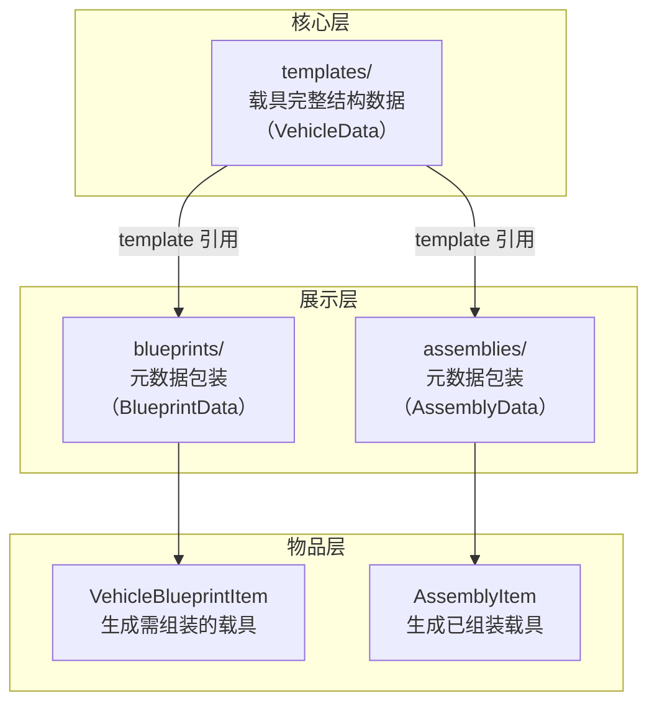

# 5.7 模板、蓝图与装配体

模板、蓝图和装配体是内容包中控制"如何将一组零件作为整体生成到世界"的三种数据模块。三者构成一个层次化引用关系：模板定义载具的完整结构数据（零件、子零件实例、位置、连接关系等），蓝图和装配体各自引用一个模板并提供展示元数据（图标、描述、缩尺比），最终以不同物品形式出现在创造模式物品栏中。

本章面向 UGC 作者，说明这三种模块的文件格式、字段含义以及三者之间的关系。阅读本章前，建议已完成：

- [5.3 零件定义](5.3-零件定义.md) — 理解零件的结构层级
- [5.4 连接点定义](5.4-连接点定义.md) — 理解连接点的命名与属性
- [5.5 子系统定义](5.5-子系统定义.md) — 理解子系统的型号注册方式

## 三者关系概述



- **模板**（`templates/`）是唯一承载载具实际结构数据的模块。一个模板包含该载具的所有零件实例、子零件的位置与旋转、连接关系、AABB 包围盒、生命值等信息。
- **蓝图**（`blueprints/`）与**装配体**（`assemblies/`）均为模板的轻量包装，各自记录图标路径、描述文本路径等展示元数据，并通过 `template` 字段指向模板。
- 蓝图物品右键使用后生成一个**组装进度为零**的载具，结构已就位但需焊枪组装后才能激活功能；装配体物品右键使用后生成一个**已完成组装**的载具，无需额外组装步骤。详见 [2.7 载具保存与收纳](../2-载具系统完全指南/2.7-载具保存与收纳.md)。

> 在创造模式物品栏中，装配体标签页和蓝图标签页均直接遍历所有已加载的模板并生成对应物品。`blueprints/` 和 `assemblies/` 模块的 JSON 文件主要用于研发系统（蓝图研发配方）中提供定制的图标与描述信息。如果内容包不涉及研发配方，可以只编写 `templates/` 模块。

---

## 模板（templates/）

模板定义载具的完整结构数据，本质上是一个 `VehicleData` 对象的 JSON 序列化结果。模板被加载后存入全局注册表，供蓝图、装配体以及游戏内的载具保存/加载机制引用。

### 文件位置

模板 JSON 放在内容包对应命名空间下的 `templates/` 目录中：

```
spark_modules/
└── my_pack/
    └── my_mod/
        └── templates/
            ├── my_sports_car.json
            └── my_truck.json
```

每个文件名（不含扩展名）作为该模板的注册 ID（如 `my_mod:my_sports_car`）。子文件夹嵌套仅用于作者自行分类，不影响注册结果。

### 模板的获取方式

模板 JSON 结构复杂（包含所有零件实例的精确 3D 位置和旋转四元数），通常不建议手写。推荐通过以下途径获得：

- **空白载具蓝图导出**：使用空白蓝图（Empty Blueprint）右键已拼装的载具，输入名称后，载具的结构数据会以 JSON 格式保存到 `.minecraft/saved_blueprints` 目录下。将该 JSON 文件复制到内容包的 `templates/` 目录即可作为模板使用。详见 [2.7 载具保存与收纳](../2-载具系统完全指南/2.7-载具保存与收纳.md)。
- **基于官方模板修改**：以官方内容包中的模板文件为基础，调整个别字段（如零件耐久度、初始贴图等）。

### VehicleData 顶层字段

模板 JSON 对应 `VehicleData` 的反序列化结构。以下逐字段列出：

| 字段            | 类型         | 必需 | 默认值        | 说明                                                         |
| --------------- | ----------- | ---- | ------------ | ----------------------------------------------------------- |
| `name`          | 字符串       | 否   | `"Vehicle"`  | 载具名称。显示在蓝图/装配体物品的物品名中                                |
| `uuid`          | 字符串       | **是** | —           | 载具的唯一标识符。在生成实物时会被替换为新的 UUID，模板中的值仅用于零件间连接关系的参照     |
| `pos`           | 三维向量数组  | **是** | —           | 载具原点在世界中的参考位置。格式 `[x, y, z]`                               |
| `min`           | 三维向量数组  | 否   | `[0,0,0]`   | AABB 包围盒的最小角坐标（相对于 `pos`）。用于碰撞预检和预览框绘制               |
| `max`           | 三维向量数组  | 否   | `[0,0,0]`   | AABB 包围盒的最大角坐标（相对于 `pos`）                                    |
| `hp`            | 浮点数       | **是** | —           | 载具总生命值                                                       |
| `parts`         | 对象         | **是** | —           | 零件字典。键为零件 UUID 字符串，值为该零件的 `PartData` 对象。详见下文            |
| `connections`   | 对象数组     | **是** | —           | 连接关系列表。每个元素为 `ConnectionData` 对象，描述一对已对接的连接点。详见下文     |

### PartData（零件数据）

`parts` 字典中每个零件的值对象包含以下字段：

| 字段                            | 类型      | 必需 | 默认值        | 说明                                                      |
| ------------------------------- | ------- | ---- | ------------ | -------------------------------------------------------- |
| `registry_key`                  | 资源路径  | **是** | —           | 零件类型注册 ID，指向 `parts/` 模块中定义的零件类型。格式 `namespace:name`   |
| `name`                          | 字符串    | **是** | —           | 该零件实例的自定义名称                                               |
| `uuid`                          | 字符串    | **是** | —           | 该零件实例的唯一标识符。用于连接关系中定位零件                              |
| `variant`                       | 字符串    | **是** | —           | 变体名称，对应零件定义中 `variants` 字段的键（如 `"left"`、`"default"`）      |
| `custom_recipe`                 | 资源路径  | 否   | `machine_max:missingno` | 自定义制造配方 ID。指定后该零件实例使用此配方而非默认配方                    |
| `assembling_progress`           | 浮点数    | 否   | `1.0`       | 组装进度（0~1）。`1.0` 表示已完成组装。蓝图物品生成的零件强制为 0，装配体物品生成的零件强制为 `1.0`       |
| `material_assembling_progress`  | 整数      | 否   | `99999`     | 材料供给进度（打螺丝阶段）。通常无需手动设置                                |
| `render_wireframe`              | 布尔值    | 否   | `true`      | 是否渲染线框。组装完成前通常为 `true`                                    |
| `sub_parts`                     | 对象      | **是** | —           | 子零件字典。键为子零件名称（如 `sub_part.machine_max.main`），值为 `SubPartData` |

### SubPartData（子零件数据）

子零件是物理模拟的最小单元。每个子零件记录以下字段：

| 字段               | 类型            | 必需 | 默认值         | 说明                                                    |
| ------------------ | --------------- | ---- | ------------- | ------------------------------------------------------ |
| `id`               | 整数            | **是** | —            | 子零件运行时 ID（物理引擎分配），模板中通常无需关注                      |
| `durability`       | 浮点数           | 否   | `3.4e+38`    | 子零件当前耐久度。不填则为满耐久                                     |
| `pos_rot_vel_vel`  | 对象            | **是** | —            | 子零件的位置、旋转、线速度、角速度。详见下文                             |
| `texture_name`     | 字符串           | 否   | `"default"`  | 当前使用的贴图名称，对应零件定义中 `textures` 字段的键                    |
| `connector_data`   | 字符串到 NBT 的对象 | 否   | `{}`         | 连接点运行时数据。键为连接点名称，值通常只含 `integrity`（当前结构完整度）       |
| `subsystem_data`   | 字符串到 NBT 的对象 | 否   | `{}`         | 子系统运行时数据。键为子系统名称，值包含 `durability`、`Items` 等状态数据      |

#### pos_rot_vel_vel 子字段

| 字段           | 类型          | 说明                                   |
| -------------- | ------------ | ------------------------------------- |
| `position`     | `[x,y,z]`    | 子零件在世界空间中的位置（m）                  |
| `rotation`     | `[x,y,z,w]`  | 子零件的旋转四元数                          |
| `linear_vel`   | `[x,y,z]`    | 子零件的线速度（m/s）。模板中通常为极小值或零         |
| `angular_vel`  | `[x,y,z]`    | 子零件的角速度（rad/s）。模板中通常为极小值或零       |

### ConnectionData（连接数据）

`connections` 数组中的每个元素描述一对已完成对接的连接点：

| 字段                     | 类型    | 说明                                                       |
| ------------------------ | ------ | --------------------------------------------------------- |
| `partUuidA`              | 字符串  | 高级连接点（母口）所在零件的 UUID                                    |
| `subPartNameA`           | 字符串  | 高级连接点所在子零件的名称                                         |
| `advConnectorName`       | 字符串  | 高级连接点名称（如 `connector.machine_max.upper_engine`）          |
| `posRotA`                | 对象    | 高级连接点当前的世界位置和旋转                                      |
| `partUuidS`              | 字符串  | 简单连接点（公口）所在零件的 UUID                                    |
| `subPartNameS`           | 字符串  | 简单连接点所在子零件的名称                                         |
| `simplePointConnectorName`| 字符串  | 简单连接点名称                                                  |
| `posRotS`                | 对象    | 简单连接点当前的世界位置和旋转                                      |

每条连接记录中 `posRotA` 和 `posRotS` 各包含 `position`（`[x,y,z]`）和 `rotation`（`[x,y,z,w]`）两个子字段。

### 模板 JSON 结构总览（简化示例）

以下为一个模板 JSON 的简化结构示意（省略了大量零件和连接数据）：

```json
{
  "name": "AE86",
  "uuid": "00000000-0000-0000-0000-000000000001",
  "pos": [-160.0, -59.0, -15.0],
  "min": [-3.24, -1.43, -1.52],
  "max": [3.24, 1.43, 1.52],
  "hp": 1000.0,
  "parts": {
    "part-uuid-1": {
      "registry_key": "my_mod:chassis",
      "name": "底盘",
      "uuid": "part-uuid-1",
      "variant": "default",
      "custom_recipe": "my_mod:chassis_recipe",
      "assembling_progress": 1.0,
      "render_wireframe": false,
      "sub_parts": {
        "sub_part.my_mod.main": {
          "id": 99,
          "durability": 400.0,
          "pos_rot_vel_vel": {
            "position": [0.0, 0.0, 0.0],
            "rotation": [0.0, 0.0, 0.0, 1.0],
            "linear_vel": [0.0, 0.0, 0.0],
            "angular_vel": [0.0, 0.0, 0.0]
          },
          "texture_name": "print.my_mod.red",
          "connector_data": {},
          "subsystem_data": {}
        }
      }
    }
  },
  "connections": [
    {
      "partUuidA": "part-uuid-1",
      "subPartNameA": "sub_part.my_mod.main",
      "advConnectorName": "connector.my_mod.front_engine",
      "posRotA": {
        "position": [1.5, 0.0, 0.0],
        "rotation": [0.0, 0.0, 0.0, 1.0]
      },
      "partUuidS": "part-uuid-2",
      "subPartNameS": "sub_part.my_mod.main",
      "simplePointConnectorName": "connector.my_mod.chassis_connection",
      "posRotS": {
        "position": [1.5, 0.0, 0.0],
        "rotation": [0.0, 0.0, 0.0, 1.0]
      }
    }
  ]
}
```

---

## 蓝图（blueprints/）

蓝图 JSON 是 `BlueprintData` 的序列化结果，用于向载具蓝图物品提供展示元数据。蓝图物品右键使用后生成一个**组装进度为零**的载具（所有零件结构就位，需焊枪组装后才能激活功能）。

### 文件位置

```
spark_modules/
└── my_pack/
    └── my_mod/
        └── blueprints/
            ├── my_sports_car.json
            └── my_truck.json
```

### BlueprintData 字段

| 字段                | 类型      | 必需 | 默认值               | 说明                                            |
| ------------------- | ------- | ---- | ------------------- | ---------------------------------------------- |
| `$schema`           | 字符串    | 否   | —                   | JSON Schema 引用路径，供编辑器提供智能提示                |
| `template`          | 资源路径  | **是** | —                   | 引用的模板注册 ID，格式 `namespace:name`。如 `"my_mod:my_sports_car"` |
| `tooltip`           | 资源路径  | 否   | `minecraft:missingno` | 蓝图物品的悬浮描述文本路径。指向 `tooltips/` 模块中的 HTML 描述文件      |
| `icon`              | 资源路径  | 否   | `minecraft:missingno` | 蓝图物品在物品栏中的图标路径，格式 `namespace:textures/...`           |
| `render_background` | 布尔值    | 否   | `true`              | 是否在图标后方渲染蓝图背景纹理                                  |

### 示例

```json
{
  "$schema": "../docs/zh_cn/schemas/blueprint.schema.json",
  "template": "my_mod:my_sports_car",
  "tooltip": "my_mod:my_sports_car.html",
  "icon": "my_mod:textures/icon/sports_car.png",
  "render_background": true
}
```

### 蓝图物品的游戏行为

- 创造模式物品栏中，蓝图标签页自动遍历所有已加载模板并生成蓝图物品。
- 手持蓝图物品右键时，系统检测目标位置的碰撞，若无障碍则生成一个组装进度为零的载具，需使用焊枪投入材料完成组装。
- 手持蓝图物品时，客户端会渲染一个半透明的载具 3D 预览框（绿色表示可放置，红色表示被阻挡）。
- 物品名称取自模板的 `name` 字段。

---

## 装配体（assemblies/）

装配体 JSON 是 `AssemblyData` 的序列化结果，用于向装配体物品提供展示元数据。装配体物品右键使用后生成一个**已完成组装**的载具（无需焊枪投入材料即可直接使用）。

### 文件位置

```
spark_modules/
└── my_pack/
    └── my_mod/
        └── assemblies/
            ├── my_sports_car.json
            └── my_truck.json
```

### AssemblyData 字段

| 字段        | 类型      | 必需 | 默认值               | 说明                                            |
| ---------- | ------- | ---- | ------------------- | ---------------------------------------------- |
| `$schema`  | 字符串    | 否   | —                   | JSON Schema 引用路径                               |
| `template` | 资源路径   | **是** | —                   | 引用的模板注册 ID。格式同蓝图                                  |
| `tooltip`  | 资源路径   | 否   | `minecraft:missingno` | 装配体物品的悬浮描述文本路径，同蓝图                              |
| `icon`     | 资源路径   | 否   | `minecraft:missingno` | 装配体物品在物品栏中的图标路径                                 |
| `scale`    | 浮点数     | 否   | `35.0`              | 模型缩尺比的分母（1:scale）。仅影响 3D 预览的尺寸，不影响实际生成的载具       |

### 示例

```json
{
  "$schema": "../docs/zh_cn/schemas/assembly.schema.json",
  "template": "my_mod:my_sports_car",
  "tooltip": "my_mod:my_sports_car.html",
  "icon": "my_mod:textures/icon/sports_car.png",
  "scale": 35.0
}
```

### 装配体物品的游戏行为

- 创造模式物品栏中，装配体标签页自动遍历所有已加载模板并生成装配体物品。
- 手持装配体物品右键的行为与蓝图物品类似，均检测碰撞、渲染预览框，但生成的载具**所有零件处于完全组装状态**，可直接使用。
- 生成时播放传送门粒子效果，消耗 1 个物品。

---

## 三者配合工作流

典型的内容包制作流程中，三者的协作关系如下：

1. **编写零件定义**（`parts/`、`connectors/`、`subsystems/`、`materials/`），在创造模式中拼装出一台完整的载具。
2. **使用空白蓝图导出模板**（`templates/`）：手持空白蓝图右键已拼装的载具，保存得到 JSON 文件，将其放入内容包的 `templates/` 目录。此文件包含了所有零件的精确 3D 位姿和连接关系。
3. **编写蓝图 JSON**（`blueprints/`），引用步骤 2 的模板，指定蓝图物品的图标和描述。玩家使用蓝图生成的载具组装进度为零，需焊枪组装。
4. **编写装配体 JSON**（`assemblies/`），引用步骤 2 的模板，为装配体物品配置展示元数据。通常与研发配方配合使用，使玩家在生存模式通过研发解锁并制造装配体。
5. **编写研发与制造配方**（`recipe/`），将蓝图/装配体与研究台和制造台关联。详见 [5.8 研发与制造配方](5.8-研发与制造配方.md)。

> 如果内容包不涉及生存模式研发流程，可以只编写 `templates/` 模块。创造模式物品栏会自动为每个模板生成对应的蓝图物品和装配体物品。

---

## 下一步

- [5.8 研发与制造配方](5.8-研发与制造配方.md) — 了解如何将蓝图和装配体与研究台/制造台关联
- [5.9 辅助模块](5.9-辅助模块.md) — 了解 `tooltips/` 模块中 HTML 描述文件的编写方式，以及自定义 HUD 和色彩合集
