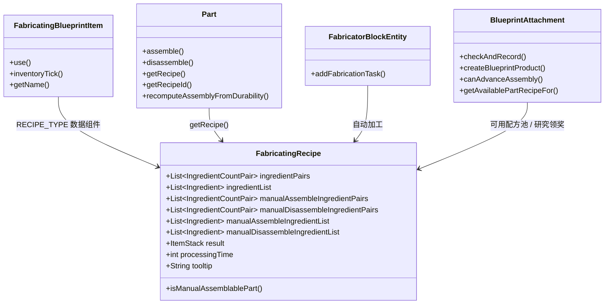
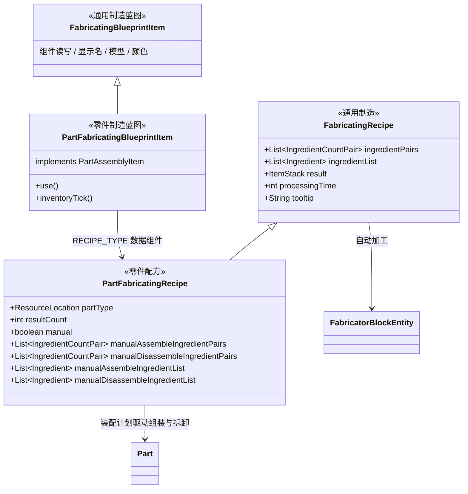

# 制造蓝图：配方与物品拆分设计

**文档状态**：审阅中（尚未实施）
**适用版本**：NeoForge 1.21.1 · Machine-Max 1.0.3-beta.6
**编写日期**：2026-09-17

## 0. 本文自包含

阅读本文不需要预先阅读任何其他文档、代码或历史讨论。文中出现的每个现存类、物品 id、JSON 字段与调用点，都在第 2 章给出位置；第 4 章给出改动清单；第 5 章给出改造后的 JSON 形态。全文出现的"当前"均指第 2 章所描述的代码库状态。

## 1. 术语

| 术语 | 含义 |
| --- | --- |
| 制造配方 | 定义"一组原料 → 一个产物 + 耗时"的配方 |
| 通用制造配方 | 产物不是零件的制造配方，只在制造机中加工 |
| 零件配方 | 产物是零件的制造配方，除制造机外还参与手动焊接组装与拆卸 |
| 装配计划 | 由配方参数派生出的两份清单：手动组装材料清单、手动拆卸返还清单 |
| 装配侧 | 焊枪组装/拆卸、撬棍拆除、装配 HUD、装配门禁这一组读配方的地方 |
| 制造侧 | 制造机按配方自动加工这一条路径 |
| 制造蓝图物品 | 生存模式下代表某个制造配方的蓝图物品，可被研究台发放、可被玩家持有 |
| 通用制造蓝图 | 通用制造配方对应的蓝图物品，只有凭证与展示语义 |
| 零件制造蓝图 | 零件配方对应的蓝图物品，可放置为未组装零件、可参与装配 |
| 载具蓝图物品 | 代表整台载具/装配体方案的蓝图物品，id 为 `machine_max:vehicle_blueprint`，与本文讨论的对象无关 |
| 材料进度 | `Part.materialProgress`，已投入的材料件数，上限等于组装材料清单长度 |
| 组装进度 | `Part.assemblingProgress`，取值 0~1，决定零件最大耐久、质量与线框渲染 |
| 线框 | 组装进度为 0 的零件形态，重力为正常值的 10% |
| 制造机 | 由 `FabricatorBlockEntity` 实现的方块机器，按配方自动加工 |
| 装载期 | 收集配方与零件数据并建立索引的阶段：服务端在数据包重载时由 `MMDynamicRes.DataPackReloader` 执行，客户端在收到配方同步包时由 `RecipesUpdatedEvent` 处理器执行 |

## 2. 现状（基线）

### 2.1 类结构



上述类的位置：

- `common/recipe/FabricatingRecipe.java`
- `common/item/prop/FabricatingBlueprintItem.java`
- `common/mech/vehicle/Part.java`
- `common/block/fabricator/FabricatorBlockEntity.java`
- `common/attachment/BlueprintAttachment.java`

### 2.2 一个配方类承担三种场景

以下三种行为全部读取同一个 `FabricatingRecipe` 实例：

1. 制造机自动加工：`FabricatorBlockEntity.addFabricationTask(Player, FabricatingRecipe)`
2. 手动焊枪组装：`WeldingTorchItem` → `Part.assemble(Container, float)`
3. 手动焊枪拆卸：`WeldingTorchItem` → `Part.disassemble(Container, float)`

场景 2 与 3 的准入条件是运行时判据 `FabricatingRecipe.isManualAssemblablePart()`，其实现为"配方产物带有 `machine_max:part_type` 数据组件"。

### 2.3 配方内的两组字段

| 字段组 | 字段 | 消费者 |
| --- | --- | --- |
| 制造组 | `ingredientPairs`、`ingredientList`、`result`、`processingTime`、`tooltip` | 制造机、JEI 配方页、研究台预览 |
| 装配组 | `manualAssembleIngredientPairs`、`manualDisassembleIngredientPairs`、`manualAssembleIngredientList`、`manualDisassembleIngredientList` | 焊枪组装/拆卸、装配 HUD、撬棍、蓝图材料控件 |

装配组字段是构造期由制造组派生出的量：组装清单按 `ceil(原料数量 / result.count)` 展开，拆卸清单按 `floor(原料数量 / result.count)` 展开（展开逻辑见 `FabricatingRecipe` 构造器）。

### 2.4 装配侧调用点

| 调用点 | 位置 | 读取内容 |
| --- | --- | --- |
| 焊枪组装 | `common/mech/vehicle/Part.java` `assemble()` | `isManualAssemblablePart()`、`getManualAssembleIngredientList()`、`getProcessingTime()` |
| 焊枪拆卸 | `common/mech/vehicle/Part.java` `disassemble()` | `isManualAssemblablePart()`、`getManualDisassembleIngredientList()` |
| 材料进度钳制 | `common/mech/vehicle/Part.java` `setMaterialProgress()` | `isManualAssemblablePart()`、组装清单长度 |
| 耐久重算 | `common/mech/vehicle/Part.java` `recomputeAssemblyFromDurability()` | 同上 |
| 装配 HUD 三维 | `client/render/gui/hud3d/AssemblyHud3D.java` | `getManualAssembleIngredientPairs()`、`getAvailablePartRecipeFor()` |
| 装配 HUD | `client/render/gui/hud/AssemblyHud.java` | `getManualAssembleIngredientPairs()` |
| 线框/进度显示 | `common/mech/vehicle/SubPart.java` | `isManualAssemblablePart()`、组装清单长度 |
| 装配门禁 | `common/attachment/BlueprintAttachment.java` `canAdvanceAssembly()` | `part.getRecipeId()`、研发记录、可用配方池 |
| 耐久反推 | `common/mech/vehicle/VehicleAssemblyServerHelper.java` `restoreAssemblyStateFromDamage()` | `isManualAssemblablePart()`、组装清单长度 |
| 撬棍拆除 | `common/item/prop/CrowbarItem.java` | `isManualAssemblablePart()`、组装清单长度 |
| 蓝图材料控件 | `client/render/gui/renderable/BlueprintMaterialWidget.java` | `isManualAssemblablePart()`、组装清单 |

装配 HUD 的两处（`AssemblyHud`、`AssemblyHud3D`）判 `part.getRecipe() instanceof FabricatingRecipe`；`Part.assemble()`、`Part.disassemble()`、`Part.setMaterialProgress()`、`Part.recomputeAssemblyFromDurability()`、`SubPart` 维修、`VehicleAssemblyServerHelper.restoreAssemblyStateFromDamage()`、`CrowbarItem`、`BlueprintMaterialWidget` 各自携带一次 `isManualAssemblablePart()` 守卫；装配门禁 `BlueprintAttachment.canAdvanceAssembly()` 的准入判据是 `part.getRecipe() == null`，不读该守卫。

### 2.5 注册、索引与资源

| 项目 | 当前取值 | 位置 |
| --- | --- | --- |
| 配方 type / serializer | `machine_max:fabricating` | `common/registry/MMResources.kt` |
| 制造蓝图物品 id | `machine_max:fabricating_blueprint` | `common/registry/MMItems.kt` |
| 物品类 | `FabricatingBlueprintItem` | `common/item/prop/FabricatingBlueprintItem.java` |
| 全配方索引 | `MMDynamicRes.ALL_FABRICATING_RECIPES`：`HashMap<ResourceLocation, RecipeHolder<FabricatingRecipe>>` | `external/MMDynamicRes.java` |
| 零件配方索引 | `MMDynamicRes.PART_RECIPES`：`HashMap<ResourceLocation, LinkedHashSet<RecipeHolder<FabricatingRecipe>>>` | 同上 |
| 制造配方 → 研发配方反查 | `MMDynamicRes.RESEARCH_BY_FABRICATING_RECIPE` | 同上 |
| 零件类型注册表 | `MMDynamicRes.PART_TYPES`（客户端）、`MMDynamicRes.SERVER_PART_TYPES`（服务端），注册 id 取"内容包 namespace + 零件 JSON 文件名" | `common/resource/modules/PartModule.kt` |
| 蓝图物品标签 | `c:blueprints`，含 `machine_max:empty_blueprint`、`machine_max:vehicle_blueprint`、`machine_max:fabricating_blueprint` | `src/main/resources/data/c/tags/item/blueprints.json` |
| 语言键 | `item.machine_max.fabricating_blueprint` | `datagen/MMLanguageProviderZH_CN.java`、`datagen/MMLanguageProviderEN_US.java`，生成物在 `src/generated/resources/assets/machine_max/lang/` |
| 创造栏条目 | `MACHINE_MAX_FABRICATING_BLUEPRINT_TAB` 动态填充 `machine_max:fabricating_blueprint` 的每种零件变体 | `common/registry/MMCreativeTabs.kt` |
| JEI 子类型解释器 | 对 `machine_max:fabricating_blueprint` 注册 `buildFabricatingBlueprintSubtypeKey` | `client/compat/jei/MMJeiPlugin.java` |
| JEI 分类图标 | `FabricatingRecipeCategory` 使用 `machine_max:fabricating_blueprint` 作为图标 | `client/compat/jei/category/FabricatingRecipeCategory.java` |
| JEI 研究奖励展示 | `BlueprintResearchRecipeCategory` 使用 `machine_max:fabricating_blueprint` 构造奖励预览 | `client/compat/jei/category/BlueprintResearchRecipeCategory.java` |

### 2.6 装配进度模型

- 材料进度上限 = 手动组装清单长度。
- 组装进度上限 = `materialProgress / 清单长度`，即"材料没到位时进度涨不上去"。
- 零件耐久比例经 `Part.getMaterialTierByDurabilityRatio(float, int)` 映射为材料档位，该映射只下调材料进度、不上调；耐久比例取所有 SubPart 的最大值。
- `manualAssembleIngredientList` 为空（配方存在、可手动组装、折算后清单长度为 0）时，`assemble()` 直接按 `step = progress / processingTime` 涨组装进度。
- 零件不存在有效配方时，`assemble()` 走无材料需求分支、按 `progress * 0.01` 涨组装进度，`recomputeAssemblyFromDurability()` 直接把组装进度设为耐久比例。官方内容包里 `machine_max:ae86_armor` 属于这种无配方零件（63 个零件中唯一没有制造配方的）。
- 配方存在但产物不带 `part_type` 组件（即 `isManualAssemblablePart()` 为假）时，`assemble()` 与 `disassemble()` 都不改变任何进度并返回 `false`。官方内容包的 62 个制造配方产物都带该组件，这一情形只可能由外部内容包产生。
- 组装进度归零的零件进入线框形态。

### 2.7 单零件多配方的现状机制

当前允许同一个零件类型对应多条制造配方，实现分散在以下位置：

| 机制 | 位置 |
| --- | --- |
| 一对多索引 | `MMDynamicRes.PART_RECIPES`：`Map<零件类型, LinkedHashSet<配方>>`，装载时按产物 `part_type` 累加 |
| 零件上的"当前配方"字段 | `Part.customRecipe`，默认值 `FabricatingRecipe.EMPTY` |
| 配方解析双路径 | `Part.getRecipe()`：`customRecipe` 有效则用它，否则回退到"零件注册名 = 配方 id"；`Part.getRecipeId()` 与 `PartData.resolveRecipeId()` 提供同一规则的纯函数版本 |
| 存档 | `PartData.customRecipe`，并写入 `VehicleData`；非法值在校验时记为问题项 |
| 网络同步 | `PartChangeRecipePayload`（服务端广播 → 客户端写入 `Part.customRecipe`），注册于 `MMPayloadRegistry` |
| 运行时切换入口 | `VehicleAssemblyServerHelper.cycleRecipe()`，由 `RegularInputPayload` 的按键分支触发；前置守卫是材料进度与组装进度都必须为 0 |
| 放置/拼装时传递配方 | `VehicleAssemblyServerHelper` 在放置与拼装路径上把物品的 `RECIPE_TYPE` 组件写入 `Part.customRecipe` |
| 门禁按配方 id | `BlueprintAttachment.canAdvanceAssembly()` 读取 `part.getRecipeId()` 后反查研发记录与可用配方池 |
| 可选配方列表 | `BlueprintAttachment.getAvailablePartRecipeFor()` 返回集合，供 `AssemblyHud3D` 的配方列表与 `cycleRecipe` 使用 |

官方内容包的实际分布：`Machine-Max_Official_Pack` 共 62 个制造配方，其中 61 个与零件类型一一对应；`recipe/van_chassis.json` 的产物组件写为 `machine_max:wine_fox_hull`，与 `recipe/wine_fox_hull.json` 指向同一个零件类型，构成一处非预期的多配方。

### 2.8 内容包与文档

- 零件数据由 `PartModule` 按文件加载，注册 id 为"内容包 namespace + 零件 JSON 文件名"，即零件身份本身就来自目录与文件名。
- 制造配方 JSON 共 62 个，全部位于 `src/main/resources/spark_modules/Machine-Max_Official_Pack/machine_max/recipe/` 根目录，`type` 均为 `machine_max:fabricating`，全部为零件配方。该目录下另有 `research/`（62 个蓝图研发配方）与 `assembly/`（8 个 `minecraft:crafting_shapeless`，产物为 `machine_max:assembly`）两个子目录，与制造配方无关（第 4 章阶段 1 只迁移根目录的这 62 个文件）。其余内容包（`machine_max.builtin`、`sdkfz`、`Machine-Max_Pack_Template`）只提供 schema 文档，不含制造配方。
- 每个官方零件配对的研发配方放在同包的 `recipe/research/` 下，`unlock_recipe` 写完整制造配方 id（例如 `machine_max:ae86_chassis`），消耗 `c:empty_blueprint` 标签物品。
- schema 文件：`docs/zh_cn/schemas/recipe/fabricating_recipe.schema.json` 与对应的 `en_us` 版本，在官方包、builtin、模板三处各有一份。
- 相关教程章节：`docs/wiki/5-内容包制作教程/5.8-研发与制造配方.md`、`docs/wiki/2-载具系统完全指南/2.3-组装修复.md`、`docs/wiki/2-载具系统完全指南/2.6-蓝图系统.md`、`docs/wiki/附录/A.3-常见问题.md`。

## 3. 目标设计

### 3.1 类结构



### 3.2 配方层

**基类 `FabricatingRecipe`**（type `machine_max:fabricating`）

基类只包含制造组字段，以及完整的 `Recipe<FabricatingInput>` 契约（`matches` / `assemble` / `canCraftInDimensions` / `getResultItem` / `getSerializer` / `getType`）；装配组字段归入子类，装配准入判据改为"索引命中"（见后文子类说明）。制造机、JEI 配方页、研究台预览按基类类型工作。

基类的 `result` 字段在构造期校验数量落在 1~99；字段本身在子类场景下可变：子类构造期先落占位产物（`machine_max:part`，数量取 `resultCount`，不带数据组件），索引构建期由注入方法把组件补齐为 `machine_max:part_type`。基类的 `getResult()` 与 `getResultItem(HolderLookup.Provider)` 直接返回该字段，子类与消费方都不需要覆盖或额外解析。

**子类 `PartFabricatingRecipe extends FabricatingRecipe`**（type `machine_max:part_fabricating`）

| 字段 | 类型 | 来源 |
| --- | --- | --- |
| `manual` | boolean | JSON 选填，缺省 `true` |
| `resultCount` | int | JSON 的 `result.count`，缺省 `1` |
| `partType` | `ResourceLocation` | 由配方 id 推导，索引构建期注入（双端各一次），JSON 与网络码表都不写 |
| 四个装配字段 | 列表 | 构造期由 `manual` 与 `resultCount` 派生 |

子类不提供 `isManualAssemblablePart()`，两个判据分开表达：

- **该配方参与装配**：由类型与索引命中表达——`part.getRecipe()` 返回的实例即 `PartFabricatingRecipe`（装配侧索引只收这类配方），各调用点判"索引命中"，不判产物的数据组件；
- **能否用原材料装配**：由 `manual()` 表达。它的消费点是组装/拆卸清单的构造（第 3.2 节表格）与需要区分"用原料 / 用产物"的展示文案；逐个展开清单的界面（如 `BlueprintMaterialWidget`）直接读清单内容，不需要另判 `manual()`。

`manual = false` 的零件仍可焊接推进组装进度，只是材料取自本配方产物（第 3.5 节），因此 `manual()` 不能当作"该零件能否装配"的门。

产物由 `partType` 与 `resultCount` 构造，不依赖配方 JSON：构造期先落占位形态（物品取 `machine_max:part`，数量取 `resultCount`），索引构建期把 `machine_max:part_type` 组件补为 `partType`。物品实例与数据组件都是静态注册引用，构造产物不需要 `registryAccess`，因此 `getResult()` 与 `getResultItem(HolderLookup.Provider)` 共用同一个字段，不需要各自的构造逻辑。

写入该字段的动作集中在注入方法（`setResolvedProduct(ResourceLocation partType)` 之类），只在索引构建期调用一次；字段改写发生在主线程，与第 3.7 节的约束一致。消费方只读返回的实例，不修改它（现状 `getResultItem()` 返回的也是共享实例）。注入同时把产物的 `DataComponents.MAX_STACK_SIZE` 写成该零件类型的 `getMaxStackSize()`，使制造机产出与创造栏、撬棍产出的零件物品携带同一组组件，并与第 3.3 节的产物数量上限校验同口径。

`partType` 由 `partTypeFromRecipeId(ResourceLocation)` 推导：取配方 id 的 path 最后一段作为零件 id 的 path，namespace 保持不变（与第 3.3 节约定一致）。该函数只在持有 `RecipeHolder` 的 id 时调用，注入 `partType`、补齐产物组件与建索引是同一次遍历：

- 服务端：`MMDynamicRes.DataPackReloader.apply`，遍历配方时按 `recipeHolder.id()` 注入；
- 客户端：`RecipesUpdatedEvent`，遍历事件携带的 `RecipeManager` 时按 `recipeHolder.id()` 注入。

codec 不参与推导：`RecipeHolder` 的 id 与配方实例是分开编码的（`RecipeHolder.STREAM_CODEC` 先写 id 再写配方），解码期实例内部拿不到自己的 id。未注入的实例（重载窗口内、校验失败后仍留在 `RecipeManager` 里的实例）持占位产物：数量正确、`machine_max:part_type` 为空。依赖该组件的读取点（tooltip 的零件标签、装配候选、JEI 子类型）对空组件走既有的 null 分支；索引与列表不靠"产物是否为空"来过滤，而是按第 3.3 节的校验结果排除失败配方。

`manual` 对装配计划的作用：

| `manual` | 组装清单 `manualAssembleIngredientList` | 拆卸清单 `manualDisassembleIngredientList` |
| --- | --- | --- |
| `true` | 每种原料重复 `ceil(原料数量 / resultCount)` 次 | 每种原料重复 `floor(原料数量 / resultCount)` 次 |
| `false` | 产物物品 1 个 | 产物物品 1 个 |

`manual: false` 时清单中的"产物物品"即本配方产物（`machine_max:part` 加 `machine_max:part_type` 组件）的单件形态，实现上使用 NeoForge 的 `DataComponentIngredient` 宽松匹配。该清单长度恒为 1，与 `resultCount` 无关。

**注册**：`MMResources.kt` 新增两组 recipeType 与 recipeSerializer：id `fabricating` 对应 `FabricatingRecipe`，id `part_fabricating` 对应 `PartFabricatingRecipe`。两类配方的读取统一走第 3.7 节的入口。

### 3.3 零件配方的目录与命名约定

| 约定 | 内容 |
| --- | --- |
| 目录 | 文件必须位于内容包的 `recipe/part_fabricating/` 下，允许再分子目录 |
| 文件名 | 不含扩展名的文件名（只取最后一段，忽略子目录）等于零件 id 的 path。子目录不参与零件 id 的构成，与零件自身一致（零件文件可位于 `parts/<系列>/` 下，id 只取文件名） |
| namespace | 文件所在 namespace 等于零件 id 的 namespace |
| 配方 id | 由上述约定确定为 `<namespace>:part_fabricating/[子目录/]<文件名>` |
| 产物声明 | JSON 只写 `result.count`，产物由 `partType` 与 `resultCount` 构造 |

内容包支持在同一包内放置多个 namespace 的内容，因此"配方与其零件同 namespace"是对作者的硬约束，不构成组织上的限制。

零件 id 与零件配方 id 都取自文件名的最后一段，因此同一 namespace 下两个不同子目录里的同名零件 JSON 会落到同一个零件 id（后加载者覆盖前者），并共享同一条零件配方。内容包内出现同名零件文件属于冲突配置，需要作者避免。

装载期校验只依据配方 id 与配方实例：原版加载不会把源文件路径交给监听器，因此"目录归属"等价于"配方 id 的 path 以 `part_fabricating/` 开头"，"类型归属"等价于"id 前缀存在但 `type` 不是 `machine_max:part_fabricating`"。零件存在性查 `SERVER_PART_TYPES`（服务端注册表）。

| 校验 | 失败条件 |
| --- | --- |
| 目录归属 | `type` 为 `machine_max:part_fabricating` 但配方 id 的 path 不以 `part_fabricating/` 开头 |
| 类型归属 | 配方 id 的 path 以 `part_fabricating/` 开头但 `type` 不是 `machine_max:part_fabricating` |
| 零件存在性 | 由 namespace 与文件名（最后一段）拼出的零件 id 不在 `SERVER_PART_TYPES` 中 |
| 装配侧唯一性 | 同一个零件 id 出现第二条零件配方 |
| 产物数量 | `result.count` 小于 1 或超过该零件的 `getMaxStackSize()` |

校验依赖零件注册表已就绪，而零件数据由 Spark 内容包模块加载、配方由原版数据包装载，两者不属于同一阶段：装载配方时若 `SERVER_PART_TYPES` 为空，则跳过"零件存在性"校验并记录到日志，后续阶段不补做。

校验失败即记入 `MMDynamicRes` 的错误列表并在玩家侧提示，同时该配方不进入任何索引（客户端索引与服务端索引都按校验结果显式排除），其产物停留在占位形态。制造机建任务时同样按服务端索引校验配方 id（第 3.7 节），因此被排除的配方无法经制造机产出。

校验通过后，零件 id 在索引构建期被注入配方实例的 `partType` 字段，产物组件的补齐同步完成（双端各一次，见第 3.2 节）。注入与建索引是同一次遍历，构建完成后配方实例视为只读。

### 3.4 通用制造配方

| 项目 | 规则 |
| --- | --- |
| 目录 | 不限 |
| `result` | 完整填写物品 id、数量与数据组件 |
| 与配方 id 的关系 | 无关联，产物由 `result` 决定 |
| 索引 | 进入 `ALL_FABRICATING_RECIPES`，不进入装配侧索引 |

### 3.5 行为规格

| 场景 | `manual: true` | `manual: false` |
| --- | --- | --- |
| 组装材料 | 折算后的原料清单 | 产物物品 1 个 |
| 焊枪组装 | 消耗原料，材料进度限制组装进度 | 消耗 1 个产物物品后材料进度满，组装进度仍需按 `time` 持续焊接推进 |
| 焊枪反向 | 按比例返还原料 | 按材料进度返还：材料进度为 0 时不返还、只降组装进度；材料进度为 1 时返还 1 个产物物品并回到 0 材料进度线框 |
| 撬棍拆除 | 按材料进度生成带损伤的部件物品 | 按材料进度生成物品：材料进度为 0 时生成带损伤的部件物品（材料上限为 1，损伤编码为 `DataComponents.MAX_DAMAGE = 1`、`DataComponents.DAMAGE = 1`），材料进度为 1 且组装进度为 1 时生成完整部件物品 |
| 材料进度上限 | 折算后清单长度 | 1 |
| 耐久归零 | 材料档位下调，损失已投入材料 | 所有 SubPart 耐久归零时材料进度掉到 0，已投入的产物物品不返还；存在任一有耐久的 SubPart 时材料进度保持 |
| 蓝图物品 | 零件制造蓝图，可放置为线框 | 零件制造蓝图，可放置为线框 |

材料进度为 0 的线框零件用撬棍拆除得到的是带损伤部件物品，重新放置后材料进度仍为 0，推进组装需要重新投入材料：`manual: false` 时需再投入 1 个产物物品，`manual: true` 时需重新投入原料。材料进度已满但焊接未完成时拆除得到的是完整部件物品，重新放置即为已组装零件——两种 `manual` 取值共用这一行为。

`manual: false` 下的耐久映射与上表一致：材料总量为 1 时，`getMaterialTierByDurabilityRatio(ratio, 1)` 在 `ratio > 0` 时返回 1、在 `ratio == 0` 时返回 0，与"无配方零件"分支 `setAssemblingProgress(durabilityRatio)` 的函数形状相同，因此不需要为这类配方增加特殊分支。

### 3.6 物品层

| 项 | `FabricatingBlueprintItem`（通用制造蓝图） | `PartFabricatingBlueprintItem`（零件制造蓝图） |
| --- | --- | --- |
| 物品 id | `machine_max:fabricating_blueprint` | `machine_max:part_fabricating_blueprint` |
| 语言键 | `item.machine_max.fabricating_blueprint` | `item.machine_max.part_fabricating_blueprint` |
| 组件 | 读 `machine_max:recipe_type` 解析显示名与模型 | 读 `machine_max:part_type` 得显示名与图标；`machine_max:recipe_type` 供装配门禁、JEI 子类型与研发界面使用 |
| `PartAssemblyItem` | 不实现 | 实现 |
| 放置与连接点预览 | 无 | `use()`、`inventoryTick()` |
| 装配候选 | 不参与 | 参与 |
| 创造栏 | 不加入 | `MACHINE_MAX_FABRICATING_BLUEPRINT_TAB` 动态填充，每个零件条目写入 `part_type` 与该零件配方 id 的 `recipe_type` |
| 合成标签 `c:blueprints` | 包含 | 包含 |

基类承载的成员：数据组件读写、`getName()`（产物名 + 蓝图名）、`createItemAnimatable()`（蓝图模型与图标）、`getColor()`、`appendHoverText()` 的通用部分。子类承载的成员：`PartAssemblyItem` 的放置与预览逻辑、零件标签 tooltip。

零件制造蓝图同时写入 `machine_max:recipe_type`（第 3.3 节约定的配方 id）与 `machine_max:part_type`：显示名、图标与 tooltip 的零件标签读 `part_type`，不需要经配方解析；`recipe_type` 供装配门禁、JEI 子类型与研发界面使用。两类蓝图物品都在 `MMItems` 的客户端扩展注册列表内（`regCustomModel`），否则物品没有自定义模型。

通用制造蓝图的来源有两种：研究台完成通用研究后的奖励，以及未来制造机门禁功能的钥匙（见 3.9）。它不可放置、不进创造栏、不参与装配候选。

### 3.7 索引、读取入口与生命周期

索引分成客户端与服务端两份独立容器，命名沿用零件类型注册表的既有命名方式（第 2.5 节：无前缀为客户端、`SERVER_` 前缀为服务端）。

| 索引 | 客户端 / 服务端 | 内容与消费者 |
| --- | --- | --- |
| 全配方索引 | `ALL_FABRICATING_RECIPES` / `SERVER_ALL_FABRICATING_RECIPES`，`HashMap<ResourceLocation, RecipeHolder<FabricatingRecipe>>` | 两类配方的并集（通用配方全部 + 通过校验的零件配方）；JEI 全配方展示、制造机配方列表、研发反查、tooltip |
| 零件配方全集 | `ALL_PART_FABRICATING_RECIPES` / `SERVER_ALL_PART_FABRICATING_RECIPES`，`HashMap<ResourceLocation, RecipeHolder<PartFabricatingRecipe>>` | 零件配方全集，供研发反查与"配方 id → 零件"反查 |
| 装配侧零件 → 配方 | `PART_RECIPES` / `SERVER_PART_RECIPES`，`HashMap<ResourceLocation, RecipeHolder<PartFabricatingRecipe>>`，键为零件 id | 装配侧全部调用点 |
| 零件 → 研发配方 | 仅服务端 `SERVER_RESEARCH_BY_PART`，`HashMap<ResourceLocation, ResourceLocation>`，键为零件 id，值为研发配方 id | 装配门禁 |
| 配方 → 研发配方 | 仅服务端 `SERVER_RESEARCH_BY_FABRICATING_RECIPE` | 装配门禁的反向查询 |

索引本身就是"全部可制造配方"的权威来源：凡需要该集合的地方（制造机配方列表、JEI 配方注册、研发界面与 tooltip 的配方反查）都经统一入口 `getAllFabricating(Level)` 取其并集，入口内部按 `level.isClientSide()` 选择容器（`PartType.get(Level, ResourceLocation)` 即在 `PART_TYPES` 与 `SERVER_PART_TYPES` 之间作同样选择），不需要各自处理两组 recipeType，读取方不经 `RecipeManager`。装配侧另有 `getPartRecipe(Level, ResourceLocation)`，按零件 id 返回单条零件配方；服务端独占的两条索引由服务端代码直接读 `SERVER_` 容器。

装配侧以零件 id 为唯一键，零件不携带"当前配方"状态，配方由装配侧索引一次求出。`Part.getRecipe()` 查本侧装配侧索引，索引未命中（该零件没有零件配方，或索引尚未重建的窗口内）时返回 `null`，此时 `assemble()` 走无材料需求分支。制造机按玩家选择的配方 id 建任务（`FabricatingMenu.startFabrication` 已经持有该 id），产物由配方自身决定，机器不需要"当前配方"状态；建任务前该 id 必须在 `SERVER_ALL_FABRICATING_RECIPES` 中命中，未命中即拒绝，使第 3.3 节的校验排除同时作用于界面与服务端。同一零件类型存在多条通用制造配方（各自产物完整声明）在制造侧是允许的。

#### 索引的生命周期

| 侧 | 建索引与注入 | 清空 | 数据源 |
| --- | --- | --- | --- |
| 服务端 | `MMDynamicRes.DataPackReloader.apply` | 同一个监听器的 `apply`，先清后填，与填充同一阶段 | `serverResources.getRecipeManager()` |
| 客户端 | `client/event/ClientRecipeIndexHandler` 订阅的 `RecipesUpdatedEvent`（`EventPriority.HIGHEST`） | 同一处理器订阅的 `ClientPlayerNetworkEvent.LoggingOut` | 事件携带的 `RecipeManager` |

服务端 `apply` 的遍历顺序固定为：先遍历两类制造配方（注入 `partType`、补齐产物组件、建全配方索引与装配侧索引），再遍历研发配方，用注入后的零件 id 建"零件 → 研发配方"索引。客户端处理器的 `EventPriority.HIGHEST` 用于保证 JEI 等按默认优先级订阅 `RecipesUpdatedEvent` 的消费方读到已建好的索引。

三条约束：

1. **空表等于未就绪，不作为缓存结果保留。** 客户端存在"世界已建立、配方包未处理"的窗口（`ClientLevel` 构造期就发布 `LevelEvent.Load`，配方包在其后处理）；服务端存在"清空完成、填充未完成"的窗口。两处都要求把空表视作未就绪，而不是"该侧没有配方"。
2. **构建只发生在本侧的主线程。** 客户端索引由 `RecipesUpdatedEvent`（主线程）写入并整体重建，服务端索引由 `apply`（主线程）写入并整体重建；读取点全部在主线程（HUD 与渲染、`Part.assemble`/`disassemble`、`SubPart.repair`、撬棍、耐久反推）。配方实例的 `partType` 注入与产物组件补齐也只在这两个时点进行。两侧容器互相独立，清空只作用于本侧容器；后台的 `prepare` 阶段不触碰索引。
3. **跨端、跨重载的比较一律用配方 id。** 客户端与服务端的 `RecipeHolder` 实例不同，客户端每次收到配方包都会产生一批新实例，同一 id 在两侧容器中因此可能是不同实例；`RecipeHolder.value()` 的引用比较在任何一处都不成立（`RecipeHolder` 自身的 `equals`/`hashCode` 按 id 实现，可用于集合去重），读取方只读本侧容器。

### 3.8 蓝图获取与装配候选

- 研究领奖：`BlueprintAttachment.createBlueprintProduct(ResourceLocation)` 的参数是研发配方 id；它经 `BLUEPRINT_RESEARCH_RECIPES` 取出 `BlueprintResearchRecipe`，再看 `unlock_recipe` 指向的制造配方实例类型——`PartFabricatingRecipe` 产出零件制造蓝图（写入 `machine_max:recipe_type` 与 `machine_max:part_type`），`FabricatingRecipe` 产出通用制造蓝图（只写 `machine_max:recipe_type`）。研发配方可以解锁任意一种制造配方，因此 `unlock_recipe` 一律写完整配方 id。
- 可用配方池：`BlueprintAttachment.checkAndRecord()` 的判据是"物品为零件制造蓝图"，索引键取物品的 `machine_max:part_type`（与配方实例的 `partType` 同值，第 3.6 节）；持有通用制造蓝图不进入装配候选。
- 装配候选：玩家持有零件制造蓝图即视为可用；判定依据是物品的 `part_type` 与目标零件一致。
- 装配门禁：`canAdvanceAssembly(Player, Part)` 由零件 id 反查 `SERVER_RESEARCH_BY_PART`，命中已完成的研发即放行；无研发条目时放行，避免内容包漏配导致零件无法装配。
- 创造模式：装配侧兜底来源是本侧"零件 → 配方"索引，因此天然只含零件配方。

### 3.9 未实装项

通用制造蓝图作为制造机门禁钥匙的能力（持有或放入制造机才允许制造对应配方）不在本次范围内。制造机通过 `FabricatingMenu.startFabrication(ResourceLocation, Player)` 按配方 id 启动加工，只校验该 id 命中服务端制造索引（第 3.7 节），不校验蓝图中介。实装该能力时改动点为 `FabricatingMenu` 与 `FabricatorBlockEntity`，物品层与配方层已为它预留了类型与索引。

## 4. 变更清单

第 2 章给出下表各项的基线状态。

### 阶段 1：配方层拆分

| 文件 | 改动 |
| --- | --- |
| `common/recipe/FabricatingRecipe.java` | 保留制造组字段与配方契约；装配组字段移出，`isManualAssemblablePart()` 删除，装配准入改由"索引命中"判定 |
| `common/recipe/PartFabricatingRecipe.java` | 新建：`manual`（配 `manual()`）、`resultCount`、`partType` 与产物组件（索引构建期按配方 id 注入并补齐）、四个装配字段与派生逻辑、独立 `Serializer` 与 `getType()` 覆盖；构造期落占位产物以通过基类校验 |
| `common/registry/MMResources.kt` | 新增 `part_fabricating` 的 recipeType 与 recipeSerializer |
| `spark_modules/Machine-Max_Official_Pack/machine_max/recipe/*.json`（根目录 62 个） | 移入 `recipe/part_fabricating/`，`type` 改为 `machine_max:part_fabricating`，`result` 精简为只含 `count`；其中 `van_chassis.json` 的原料表与 `wine_fox_hull.json` 相同，迁移后按文件名归属 `machine_max:van_chassis`，需按该零件重写原料 |
| `part_fabricating_recipe.schema.json`（官方包、`machine_max.builtin`、模板包各一份 zh_cn 与 en_us） | 新增零件配方 schema：目录与命名约定、`manual`、`result` 仅含 `count`；文件置于各包的 `docs/<lang>/schemas/recipe/` 下 |

### 阶段 2：装配侧单配方模型与装载期校验

| 文件 | 改动 |
| --- | --- |
| `external/MMDynamicRes.java` | 索引按逻辑侧拆成两份容器：客户端 `ALL_FABRICATING_RECIPES`、`ALL_PART_FABRICATING_RECIPES`、`PART_RECIPES`，服务端为对应的 `SERVER_` 前缀版本，另有仅服务端的 `SERVER_RESEARCH_BY_PART` 与 `SERVER_RESEARCH_BY_FABRICATING_RECIPE`；入口 `getAllFabricating(Level)` / `getPartRecipe(Level, ResourceLocation)` 按 `level.isClientSide()` 分流；全配方索引改为两类配方的并集且只收通过校验的零件配方；装配侧索引由集合改为单条；新增第 3.3 节的五项校验；`apply` 内按配方 id 注入 `partType` 与产物 `MAX_STACK_SIZE`，按"先制造配方、后研发配方"的顺序建索引，清空与填充同在 `apply`（`prepare` 阶段不触碰索引） |
| `common/mech/vehicle/Part.java` | `getRecipe()` 改查本侧装配侧索引（未命中返回 `null`）；移除 `customRecipe` 字段与 `getRecipeId()`；装配准入判据由 `isManualAssemblablePart()` 改为"索引命中"，`manual()` 只在材料清单语义处读取 |
| `common/mech/vehicle/data/PartData.java` | 移除 `customRecipe` 字段、codec 项与 `resolveRecipeId()` |
| `common/mech/vehicle/data/VehicleData.java` | 移除 `customRecipe` 的写入与校验 |
| `common/item/prop/PartAssemblyItem.java` | `getRecipeHolder()` / `getPartType()` 的配方解析改查本侧零件配方索引，删除"组件的配方 id → `RecipeManager` → 产物组件"的回退路径 |
| `network/payload/assembly/PartChangeRecipePayload.java` | 删除 |
| `network/MMPayloadRegistry.java` | 注销该载荷 |
| `common/mech/vehicle/VehicleAssemblyServerHelper.java` | 移除 `cycleRecipe()`、放置/拼装路径上的 `customRecipe` 传递；`restoreAssemblyStateFromDamage()` 的判据改为装配侧索引命中 |
| `network/payload/RegularInputPayload.java`、`client/input/RawInputHandler.java`、`client/input/KeyBinding.java`、`util/data/KeyInputMapping.java` | 移除配方切换的按键分支、键位钩子与键位注册，删除 `CYCLE_PART_RECIPES` 枚举项 |
| `common/attachment/BlueprintAttachment.java` | 可用配方池改按物品 `part_type` 记录单条配方；门禁改用 `SERVER_RESEARCH_BY_PART`；`getAvailablePartRecipeFor()` 返回单条 |
| `client/render/gui/hud3d/AssemblyHud3D.java`、`client/render/gui/hud/AssemblyHud.java` | 移除可选配方列表与配方切换提示的渲染分支；`instanceof FabricatingRecipe` 的模式匹配改为 `PartFabricatingRecipe` |
| `client/event/ClientRecipeIndexHandler.java` | 新建：以 `EventPriority.HIGHEST` 订阅 `RecipesUpdatedEvent` 重建客户端索引（按配方 id 注入 `partType` 与产物组件），订阅 `ClientPlayerNetworkEvent.LoggingOut` 只清客户端容器 |
| `client/render/gui/renderable/RecipeListWidget.java`、`client/compat/jei/MMJeiPlugin.java` | 配方枚举改走 `getAllFabricating(Level)`（客户端索引） |
| `common/block/fabricator/FabricatorBlockEntity.java`、`common/menu/FabricatingMenu.java` | 建任务改用入参配方 id，删除按实例身份反查 id 的扫描；建任务前校验该 id 命中 `SERVER_ALL_FABRICATING_RECIPES` |
| `client/render/gui/screen/BlueprintResearchScreen.java`、`util/TextUtil.java` | 按配方 id 反查配方时改查本侧全配方索引 |
| `common/mech/vehicle/SubPart.java`、`common/item/prop/CrowbarItem.java`、`client/render/gui/renderable/BlueprintMaterialWidget.java` | 装配组字段访问与判据改为 `PartFabricatingRecipe` + 装配侧索引；`CrowbarItem` 生成的零件物品只写 `part_type`，不写 `RECIPE_TYPE` |

### 阶段 3：`manual: false` 行为

| 文件 | 改动 |
| --- | --- |
| `common/recipe/PartFabricatingRecipe.java` | `manual: false` 时组装/拆卸清单构造为产物单件，使用 `DataComponentIngredient`；组装与拆卸沿用第 3.5 节表格的算法，材料进度为 0 时不返还 |
| `common/mech/vehicle/Part.java` | 焊枪组装与反向拆卸沿用现有逻辑（材料进度限制、返还按清单长度折算），不新增 `manual: false` 分支 |
| `common/item/prop/CrowbarItem.java` | 拆除沿用现有逻辑（按材料进度生成完整或带损伤的部件物品），不新增 `manual: false` 分支 |

三处改动都只依赖"装配侧索引命中"这一准入判据与清单内容，`manual()` 不参与准入判断。

### 阶段 4：物品层与资源

| 文件 | 改动 |
| --- | --- |
| `common/item/prop/FabricatingBlueprintItem.java` | 抽为基类：保留组件、显示名、模型、颜色等通用逻辑，`PartAssemblyItem` 实现与放置/预览逻辑移出；`getName()`、`createItemAnimatable()`、零件标签 tooltip 改读 `part_type` |
| `common/item/prop/PartFabricatingBlueprintItem.java` | 新建：继承基类并实现 `PartAssemblyItem`，承载放置、连接点预览、瞄准提示、零件标签 tooltip |
| `common/registry/MMItems.kt` | `FABRICATING_BLUEPRINT` 指向通用蓝图；新增 `PART_FABRICATING_BLUEPRINT`（id `part_fabricating_blueprint`）指向零件蓝图，并把新物品加入 `regCustomModel` 的客户端扩展注册列表 |
| `common/registry/MMCreativeTabs.kt` | `MACHINE_MAX_FABRICATING_BLUEPRINT_TAB` 的图标与动态填充改用零件蓝图，条目写入的 `recipe_type` 改为第 3.3 节的新配方 id；`MACHINE_MAX_PART_TAB` 的零件条目只写 `part_type`，不写 `recipe_type`；通用蓝图不加入任何创造栏 |
| `common/attachment/BlueprintAttachment.java` | `createBlueprintProduct()` 按配方类型分流产出物品，零件蓝图同时写入 `recipe_type` 与 `part_type`；`checkAndRecord()` 的判据按第 3.8 节收紧 |
| `data/c/tags/item/blueprints.json` | 新增 `machine_max:part_fabricating_blueprint` |
| `datagen/MMLanguageProviderZH_CN.java`、`datagen/MMLanguageProviderEN_US.java` | 新增 `item.machine_max.part_fabricating_blueprint` 语言键；`item.machine_max.fabricating_blueprint` 的文案用于通用蓝图；删除 `key.machine_max.assembly.cycle_recipe` 与 `hud.key.machine_max.cycle_recipe` |
| `client/compat/jei/MMJeiPlugin.java` | 为两类蓝图各注册子类型解释器 |
| `client/compat/jei/category/BlueprintResearchRecipeCategory.java` | 奖励预览按配方类型选择蓝图物品 |
| `client/compat/jei/category/FabricatingRecipeCategory.java` | 图标沿用 `machine_max:fabricating_blueprint`（通用蓝图） |
| `spark_modules/Machine-Max_Official_Pack/machine_max/recipe/research/*.json`（62 个） | `unlock_recipe` 改为新配方 id（`machine_max:part_fabricating/<零件名>`） |

### 阶段 5：内容包与文档

| 文件 | 改动 |
| --- | --- |
| `spark_modules/Machine-Max_Official_Pack/.../docs/*/schemas/recipe/` | schema 与阶段 1 同步 |
| `spark_modules/machine_max.builtin/.../docs/*/schemas/recipe/` | 同上 |
| `spark_modules/Machine-Max_Pack_Template/.../docs/*/schemas/recipe/` | 同上，并加入目录与命名约定的说明 |
| `docs/wiki/5-内容包制作教程/5.8-研发与制造配方.md` | 两类配方的 type、目录约定、`manual` 字段、折算规则、`unlock_recipe` 写法 |
| `docs/wiki/2-载具系统完全指南/2.3-组装修复.md` | 组装与拆卸材料来源、`manual: false` 的组装路径 |
| `docs/wiki/2-载具系统完全指南/2.6-蓝图系统.md` | 两类蓝图物品的区分 |
| `docs/wiki/附录/A.3-常见问题.md` | 两类蓝图物品对比表 |
| `docs/蓝图库-玩家设计保存与取用设计.md` | 同步配方解析、装配门禁与材料清单的表述（该文档现依赖 `PartData.customRecipe`、`Part.getRecipeId()`、"零件注册名 = 配方 id"） |
| `docs/手动零件组装客户端权威重构计划.md` | 同步配方切换入口相关表述（该文档现依赖 `cycleRecipe`） |
| `AGENTS.md` | 同步 `network/payload/` 与 `assembly/` 子目录的载荷计数（随 `PartChangeRecipePayload` 删除） |
| `docs/glossary.md` | 新增两类配方与两类蓝图物品条目 |
| `src/generated/resources/assets/machine_max/lang/` | 由 `./gradlew runData` 重新生成 |

## 5. JSON 形态

通用制造配方（目录不限，产物完整）：

```json
{
  "$schema": "../docs/zh_cn/schemas/recipe/fabricating_recipe.schema.json",
  "type": "machine_max:fabricating",
  "ingredients": [
    { "ingredient": { "item": "minecraft:iron_ingot" }, "count": 4 }
  ],
  "result": { "id": "machine_max:structural_component_1", "count": 1 },
  "time": 100,
  "description": "recipe.machine_max.structural_component_1.desc"
}
```

零件配方（位于 `recipe/part_fabricating/`，文件名即零件 id 的 path）：

```json
{
  "$schema": "../../docs/zh_cn/schemas/recipe/part_fabricating_recipe.schema.json",
  "type": "machine_max:part_fabricating",
  "manual": true,
  "ingredients": [
    { "ingredient": { "item": "machine_max:structural_component_1" }, "count": 8 },
    { "ingredient": { "item": "machine_max:power_component_1" }, "count": 2 }
  ],
  "result": { "count": 1 },
  "time": 60
}
```

上例的文件路径为 `recipe/part_fabricating/my_chassis.json`，其配方 id 为 `machine_max:part_fabricating/my_chassis`，产物为 `machine_max:part` 加组件 `machine_max:part_type = machine_max:my_chassis`。`part_type` 不写进 JSON，由配方 id 在索引构建期推导注入（第 3.2 节）。

零件配方（`manual: false`，装配材料为本配方产物整件）：

```json
{
  "$schema": "../../docs/zh_cn/schemas/recipe/part_fabricating_recipe.schema.json",
  "type": "machine_max:part_fabricating",
  "manual": false,
  "ingredients": [
    { "ingredient": { "item": "minecraft:netherite_ingot" }, "count": 4 }
  ],
  "result": { "count": 1 },
  "time": 400
}
```

`manual` 选填，缺省 `true`；`result.count` 选填，缺省 `1`。省略这两个字段的零件配方与上例第一段等价。`manual: false` 的配方在装配侧以本配方产物（`machine_max:part` 加 `part_type`）作为唯一材料，材料数量恒为 1 件，`result.count` 只影响制造机的产出数量；`manual: true` 时 `result.count` 参与组装清单（`ceil`）与拆卸清单（`floor`）的折算（第 3.2、3.5 节）。

研发配方指向零件配方（`unlock_recipe` 写完整配方 id）：

```json
{
  "$schema": "../../docs/zh_cn/schemas/recipe/blueprint_research_recipe.schema.json",
  "type": "machine_max:blueprint_research",
  "research_cost": 120,
  "research_ingredients": [
    { "ingredient": { "tag": "c:empty_blueprint" }, "count": 1 }
  ],
  "icon": "machine_max:textures/icon/ae86/ae86_chassis_icon.png",
  "description": "research.machine_max.ae86_chassis_blueprint.desc",
  "unlock_recipe": "machine_max:part_fabricating/ae86_chassis"
}
```

## 6. 兼容性与迁移

| 影响面 | 说明 | 处理 |
| --- | --- | --- |
| 内容包制造配方 | 零件配方的 `type` 取值为 `machine_max:part_fabricating` 且必须位于 `recipe/part_fabricating/` 下，通用制造配方取值为 `machine_max:fabricating` 且目录不限 | 官方包 62 个文件随本次改动一并更新；外部内容包需按第 5 章改写 |
| 配方 id | 零件配方 id 形如 `machine_max:part_fabricating/<零件名>` | 研发配方的 `unlock_recipe` 随之更新；官方包 62 个研发配方同步 |
| 存档中的零件状态 | 零件的"当前配方"字段从存档结构中消失 | 开发阶段接受；装载时该字段被忽略 |
| 存档中的蓝图物品 | 物品 id `machine_max:fabricating_blueprint` 代表通用制造蓝图；存档中存在的同名物品按通用蓝图解释，其 `RECIPE_TYPE` 指向零件配方时，显示名与子类型走通用蓝图的兜底分支 | 开发阶段不迁移；将来若要迁移，需按第 3.3 节的命名约定把旧配方 id `<ns>:<零件名>` 推导为新 id `<ns>:part_fabricating/<零件名>`，再按配方类型换成对应蓝图物品 |
| 语言键 | 零件蓝图使用新键 `item.machine_max.part_fabricating_blueprint` | 由 datagen 生成 |
| 蓝图标签 | `c:blueprints` 增加零件蓝图 id | 随阶段 4 更新 |
| `van_chassis.json` | 该文件的原料表与 `wine_fox_hull.json` 相同；产物由文件名决定，因此迁移后它归属 `machine_max:van_chassis`，与 `wine_fox_hull` 的配方各指向不同零件 | 按 `van_chassis` 重写原料表；产物绑定由文件名与 namespace 决定，`result` 不声明产物类型 |
| 装载失败提示 | 校验失败会记入 `MMDynamicRes` 错误列表并展示给玩家 | 无需额外处理，按提示修正内容包 |

## 7. 验收清单

客户端（`./gradlew runClient`）：

1. 创造栏中存在零件制造蓝图条目（按零件类型逐个列出），不存在通用制造蓝图条目。
2. 手持零件制造蓝图可放置为线框零件；线框对准连接点时可显示连接提示。
3. `manual: true` 的零件：焊枪消耗原料推进组装进度；撬棍按材料进度拆出带损伤的部件物品。
4. `manual: false` 的零件：未喂入产物物品时组装进度不推进；玩家背包内有该零件产物物品时，焊枪将其消耗并填满材料进度，随后组装进度随焊接时间推进至 1。
5. `manual: false` 的零件在材料进度已满时用焊枪反向操作，回到 0 材料进度线框并返还 1 个产物物品；材料进度为 0 时反向操作只降组装进度，不返还物品。
6. `manual: false` 的线框零件（材料进度 0）用撬棍拆除，获得带损伤的部件物品（`DataComponents.MAX_DAMAGE = 1`、`DataComponents.DAMAGE = 1`），重新放置后材料进度仍为 0，需要再投入 1 个产物物品才能推进；材料进度满且组装完成的零件拆除后获得完整部件物品。
7. 被打光耐久的 `manual: false` 零件回到 0 材料进度线框，需要重新投入 1 个产物物品。
8. 装配界面没有配方切换入口，同一零件只按唯一配方组装。
9. 研究台完成零件研发后领取到零件制造蓝图；JEI 的制造配方分类与研发分类显示正常，蓝图物品在 JEI 中按零件的不同区分子类型。
10. 制造机放入原料后按配方产出，产物数量遵循 `result.count`，通用制造配方的产物按 `result` 声明的完整内容产出。

无配方零件：

- `machine_max:ae86_armor`（官方包中唯一没有制造配方的零件）：焊枪不消耗材料即可把组装进度推进至 1；组装未完成时用撬棍拆除不产出物品，组装完成后拆除获得完整部件物品。

联机（专用服务器 + 客户端，客户端索引由配方同步包填充）：

- 进服后制造机配方列表、JEI 制造配方分类、装配 HUD 的材料清单显示正常。
- 客户端执行 `/reload` 后上述界面仍正常；换服或退回标题界面后不显示上一个服务器的配方。
- 单机世界中执行 `/reload` 后，客户端索引与服务端索引各自重建、互不清空：界面（制造机列表、JEI、装配 HUD）与服务端装配门禁同时正常。

装载期校验（构造临时内容包验证）：

11. 零件配方放在 `recipe/` 根目录下时报错。
12. 通用制造配方放在 `recipe/part_fabricating/` 下时报错。
13. 零件配方指向未注册的零件 id 时报错。
14. 同一零件出现第二条零件配方时报错。
15. 零件配方的 `result.count` 为零或超过零件堆叠上限时报错。
16. 被校验排除的配方不出现在制造机配方列表与 JEI 制造分类中；用改造过的客户端提交该配方 id 也无法建任务。

数据生成：`./gradlew runData` 后确认语言文件包含两类蓝图的语言键。

游戏测试：项目没有单元测试目录，`./gradlew runGameTestServer` 用于 NeoForge 运行时游戏测试；本次改动的验证范围限于本章列出的手测项。

## 8. 风险与开放问题

1. 62 个官方零件配方与 62 个研发配方需要成对更新，任何一侧遗漏都会表现为"零件无有效配方"或"研发解锁后领不到蓝图"，验收第 3、9 项覆盖该风险。
2. `partType` 与产物组件在索引构建期注入，配方实例在此之前持占位产物（`machine_max:part_type` 为空）。客户端存在"世界已建立、配方包未处理"的窗口，服务端存在"清空完成、填充未完成"的窗口，两处都要求把空表视为未就绪（第 3.7 节），否则会把空索引当成已就绪状态。
3. 零件与配方的 namespace 硬约束要求作者把两者放在同一 namespace 下。内容包支持多 namespace，因此该约束不限制内容组织，但作者需要遵循。
4. `manual: false` 的组装材料由产物物品自身充当，同一零件类型在装配侧只有一个配方，因此材料与零件的确定绑定成立。
5. 通用制造蓝图的制造机门禁功能未实装，其物品在生存流程中只能通过通用研究获得。
6. 客户端索引的数据来源有两条路线：按配方 id 自行推导（本次采用），或让 `StreamCodec` 携带 `part_type`。后者使配方实例自描述，第三方直接从客户端 `RecipeManager` 读取时也完整，代价是网络码表多一个字段、需要在 JSON 与网络两份 codec 之间保持派生值一致。本次不采用，保留为可选项。
7. 客户端索引与 JEI 的配方注册都挂在 `RecipesUpdatedEvent` 上，索引构建必须排在 JEI 之前（第 3.7 节的 `EventPriority.HIGHEST`）。若将来 JEI 改用别的事件或提高自身优先级，需要重新确认该次序，否则 JEI 制造分类可能在部分进服流程中注册成空表。
8. 索引拆成两侧容器后，每个读取点都要按所在侧选择容器。漏改表现为单机正常、专用服务器上界面或门禁数据为空，验收的联机一节覆盖该风险。
9. 零件 id 与零件配方 id 都取自文件名的最后一段，同一 namespace 下的同名零件文件会互相覆盖（第 3.3 节），需要作者避免。

## 9. 修订记录

| 日期 | 内容 |
| --- | --- |
| 2026-09-17 | 初稿：确立配方层与物品层的拆分形态、`manual` 语义、id 分配、五阶段实施清单 |
| 2026-09-17 | 确立零件配方的目录与命名约定、产物由装载期注入构造、装配侧退回单配方模型、五项装载期校验，并同步阶段 1-5 的改动项 |
| 2026-09-17 | 审阅定稿：`partType` 注入点由配方装载期移入索引构建期（服务端 `DataPackReloader.apply`、客户端 `RecipesUpdatedEvent`），并明确 codec 不参与推导；产物在构造期落占位形态、索引构建期补齐 `part_type` 组件，基类校验与 `getResult()`/`getResultItem()` 均不改动；配方读取统一走 `getAllFabricating(RecipeManager)` 并集入口，`ALL_FABRICATING_RECIPES` 定为两类配方的并集；新增索引生命周期与主线程约束；`manual` 两种取值在材料进度为 0 时共用现有拆除与返还逻辑；补齐装载期校验的判定依据与失败处置、客户端索引与物品层漏项 |
| 2026-09-17 | 审阅修订：`getAllFabricating` 的数据源改为索引本身（含校验过滤），制造机建任务按服务端索引校验配方 id；索引拆成客户端（无前缀）与服务端（`SERVER_` 前缀）两份容器，入口按 `level.isClientSide()` 分流，清空与填充合并到 `apply`；装配准入判据由产物组件改为索引命中，`manual()` 只用于材料清单语义；补 `createBlueprintProduct` 的组件写入与产物 `MAX_STACK_SIZE`；补键位链路、`CrowbarItem`、`MMCreativeTabs`、`PartAssemblyItem`、两份既有设计文档等改动项 |
