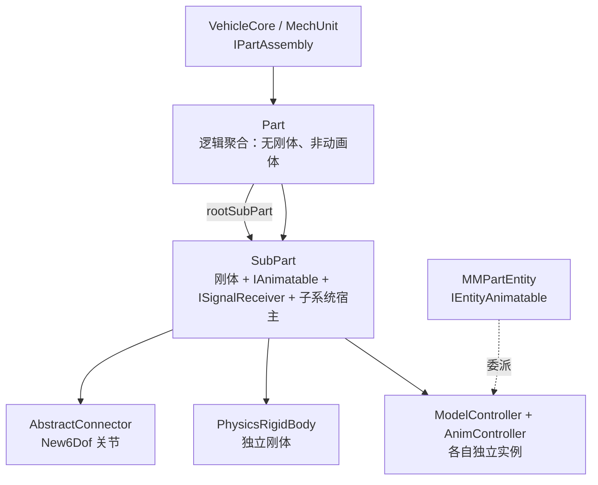
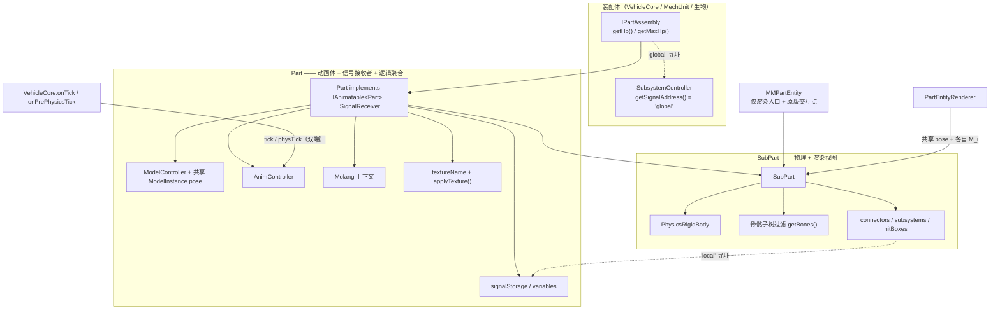
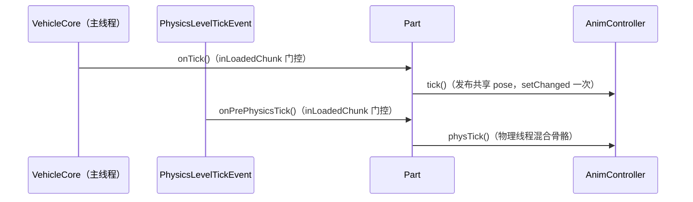
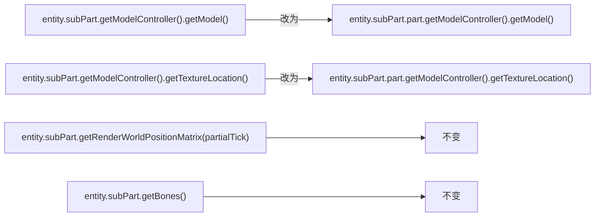
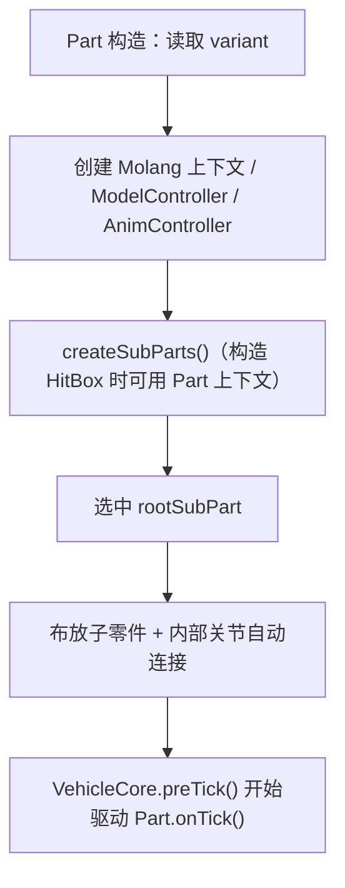

# 动画系统-Part 作为动画体重构设计

> **状态**：已按 P0–P6 实施并通过构建验证
> **日期**：2026-09-08
> **范围**：把"动画体（Animatable）"从 `SubPart` 上移到 `Part`，并相应调整渲染、tick、Molang、涂装、信号寻址与内容包命名约束。
> **源码依赖**：Spark-Core（动画引擎）、Machine-Max（Part / SubPart / 渲染 / 信号）。
> **关联文档**：[动画系统-事件触发动画设计.md](./动画系统-事件触发动画设计.md)、[载具概念与层级](./wiki/2-载具系统完全指南/2.1-载具概念与层级.md)

---

## 1. 背景与动机

当前 `SubPart` 同时承担三种角色：

1. **物理单元**——每个 SubPart 持有独立的 Bullet 刚体，SubPart 之间用 `New6Dof` 关节连接；
2. **骨骼切分单元**——`start_bone` / `end_bones` 把同一份模型互斥切分成若干骨骼子树；
3. **动画体**——`SubPart implements IAnimatable<SubPart>`，各自持有 `ModelController` / `AnimController`。

角色 1、2 由物理与渲染需求决定，是正确的；角色 3 是历史选择，而不是最优解。原因：

- 模型与动画资源的粒度本来就是 **Part**（`VariantAttr.model` / `animations` 定义在变体上）；
- 一个 Part 的 N 个 SubPart 会各自新建一份**整模型**的 `ModelInstance`（含全部骨骼的 `ModelPose`），并各自对整骨架混合一次动画，即 **N 倍内存与 N 倍求值**；
- 各 SubPart 的 `AnimController` 独立计时、独立 LOD 跳帧，**同一 Part 内的动画没有时间同步保证**。

对载具而言，实际内容包中绝大多数 Part 只有一个 SubPart（`sub_part.machine_max.main`），问题被掩盖；多 SubPart 只出现在炮塔（`k17_turret` 的 `main` / `gun` / `left_atgm` / `right_atgm`、`sdkfz234_turret` 的 `main` / `barrel` / `gun_shield`）。

面向未来的机甲（机娘）场景，需求是"**以关键帧动画驱动关节电机的目标位置**"，即整机一套时间轴采样骨骼姿态再映射到关节。这要求动画体具备"整个模型一套动画状态"的语义，SubPart 粒度无法满足。

## 2. 目标与非目标

**目标**

- 动画体上移到 `Part`：`Part implements IAnimatable<Part>`，独占 `ModelController` / `AnimController` / 共享 `ModelInstance` / Molang 上下文；
- `SubPart` 只保留物理、骨骼切分、子系统宿主、渲染视图等职责；
- 动画 tick 唯一化：每个 Part 每帧只混合一次共享 pose；
- 涂装统一到 Part 级；
- 信号寻址重划：`local`（Part）/ `global`（装配体）；
- Molang 命名空间改为 `local`（动画体）/ `global`（所属装配体）；
- 建立 **Part 内名称唯一性约束**，使 Part 级按名寻址（Molang / 信号）无歧义。

**非目标（本期）**

- 关键帧动画 → 关节目标位置的桥接子系统（后续阶段）；
- Assembly（`MechUnit`）级全身动画层（后续阶段）；
- 预览链路（`PartAnimatable` / `SubPartAnimatable` / `VehicleAnimatable`）的收敛——本期后置，但**必须保证其行为不被破坏**；
- 自定义控制组持久化（现状 `AbstractControllableSubsystem.loadData` 已禁用 NBT 加载，从注册表读取预设，本期不动）。

## 3. 改造前现状（代码核验）

### 3.1 层级与职责



- `Part` 仅为逻辑聚合，**不实现 `IAnimatable`**、无刚体（[Part.java](../src/main/java/io/github/sweetzonzi/machine_max/common/mech/vehicle/Part.java#L58-L81)）。
- `SubPart implements IAnimatable<SubPart>, ISignalReceiver`，持有独立 `ModelController` / `AnimController` / `signalStorage`（[SubPart.java](../src/main/java/io/github/sweetzonzi/machine_max/common/mech/vehicle/SubPart.java#L104-L122)）。
- `SubPart` 之间用 `New6Dof` 连接（[AbstractConnector.java](../src/main/java/io/github/sweetzonzi/machine_max/common/mech/vehicle/connector/AbstractConnector.java#L267-L277)）。

### 3.2 资源粒度在 Part

| 资源 | 定义位置 | 证据 |
|---|---|---|
| 模型 | `VariantAttr.model` | [VariantAttr.java](../src/main/java/io/github/sweetzonzi/machine_max/common/mech/vehicle/attr/VariantAttr.java#L22-L26) |
| 贴图表 | `VariantAttr.textures` | 同上 |
| 动画集 | `VariantAttr.animations` | 同上 |
| 子零件结构 | `VariantAttr.subParts` | 同上 |

SubPart 构造时统一使用 `new ModelIndex("part", part.variant.getModel())`，动画集取 `part.variant.getAnimations()`（[SubPart.java](../src/main/java/io/github/sweetzonzi/machine_max/common/mech/vehicle/SubPart.java#L155)、[SubPart.java](../src/main/java/io/github/sweetzonzi/machine_max/common/mech/vehicle/SubPart.java#L313-L322)）。

骨骼互斥切分由 `SubPartAttr.getBones` / `filterBones` 与 `VariantAttr.computeAutoEndBones` 完成（[SubPartAttr.java](../src/main/java/io/github/sweetzonzi/machine_max/common/mech/vehicle/attr/SubPartAttr.java#L342-L409)、[VariantAttr.java](../src/main/java/io/github/sweetzonzi/machine_max/common/mech/vehicle/attr/VariantAttr.java#L109-L131)）。

### 3.3 渲染链路与数学事实

1. 整个 Part 共用**同一套模型空间**：`OBone.applyTransformWithParents` 从模型根累乘到目标骨骼，`OBone.render` 再把结果乘进 poseStack，因此 **poseStack 必须停在"模型原点"**（[OBone.kt](../Spark-Core/src/main/kotlin/cn/solarmoon/spark_core/animation/model/origin/OBone.kt#L104-L124)、[ModelRenderHelper.kt](../Spark-Core/src/main/kotlin/cn/solarmoon/spark_core/animation/renderer/ModelRenderHelper.kt#L50-L59)）。
2. 骨骼的**静态模型空间摆位**（pivot + 静态 rotation）包含在 `BonePose.getLocalTransformMatrix` 中，动画只叠加增量（[BonePose.kt](../Spark-Core/src/main/kotlin/cn/solarmoon/spark_core/animation/model/BonePose.kt#L45-L52)）。
3. 每个 SubPart 的锚矩阵 = **Part 模型原点世界矩阵 × 该 SubPart 刚体在模型空间中的相对运动**：`M_i = COM_i_world · inverse(MassCenter_i)`（[SubPart.java](../src/main/java/io/github/sweetzonzi/machine_max/common/mech/vehicle/SubPart.java#L1257-L1259)、[DestroyableObject.java](../src/main/java/io/github/sweetzonzi/machine_max/common/mech/DestroyableObject.java#L314-L317)）。静止时所有 `M_i` 相等。
4. 当前每个 SubPart 各自渲染的合成为：`world = M_i × 祖先骨骼链 × 本子树骨骼链`。

**结论**：SubPart 之间共享模型空间，唯一差异是锚矩阵 `M_i`。因此"共享一份 `ModelPose`、各 SubPart 仍用自己的 `M_i` 渲染自己的骨骼子树"是**数学等价**的改造，不引入任何视觉变化。

### 3.4 动画 tick 通道与唯一性约束

- Spark-Core 的 `AnimApplier` 按 `IEntityAnimatable` 实体逐个驱动：物理线程 `physTick()`、主线程 `tick()`（[AnimApplier.kt](../Spark-Core/src/main/kotlin/cn/solarmoon/spark_core/animation/anim/AnimApplier.kt#L13-L36)）。
- `MMPartEntity` 目前实现 `IEntityAnimatable`，并把控制器委派给 `subPart`（[MMPartEntity.java](../src/main/java/io/github/sweetzonzi/machine_max/common/entity/MMPartEntity.java#L544-L547)）。
- **约束一**：`PartEntityRenderer extends GeoEntityRenderer<MMPartEntity>`，而 `GeoEntityRenderer<T> where T : IEntityAnimatable<T>`（[GeoEntityRenderer.kt](../Spark-Core/src/main/kotlin/cn/solarmoon/spark_core/animation/renderer/GeoEntityRenderer.kt#L13)）。若 `MMPartEntity` 退出 `IEntityAnimatable`，渲染器必须改为直接继承 `EntityRenderer`。
- **约束二**：`AnimController.tick()` 会对共享 pose 逐骨骼调用 `setChanged()`（[AnimController.kt](../Spark-Core/src/main/kotlin/cn/solarmoon/spark_core/animation/anim/AnimController.kt#L158-L172)），而 `setChanged()` 把 `oLocalTransform = localTransform`（[BonePose.kt](../Spark-Core/src/main/kotlin/cn/solarmoon/spark_core/animation/model/BonePose.kt#L32-L35)）。若同一共享 pose 被多个控制器 tick，**第二次调用会抹掉插值差值**。因此共享 pose 必须只有唯一发布者。

`Part` 已有现成的双线程驱动入口：主线程 `Part.onTick()`、物理线程 `Part.onPrePhysicsTick()` / `onPostPhysicsTick()`，由 `VehicleCore` 分别在主 tick 与 `PhysicsLevelTickEvent` 中调用（[VehicleCore.java](../src/main/java/io/github/sweetzonzi/machine_max/common/mech/vehicle/VehicleCore.java#L382-L423)、[ObjectManager.java](../src/main/java/io/github/sweetzonzi/machine_max/common/mech/ObjectManager.java#L240-L254)）。

### 3.5 Molang 现状

- `MechMolangContext extends SparkMolangContext<IAnimatable<SubPart>>`，绑定 `subpart.*` / `vehicle.*`（[MechMolangContext.java](../src/main/java/io/github/sweetzonzi/machine_max/common/mech/molang/MechMolangContext.java#L30-L200)）。
- 动画关键帧表达式通过**动画体自身的上下文**求值（[JSMolangValue.kt](../Spark-Core/src/main/kotlin/cn/solarmoon/spark_core/js/molang/JSMolangValue.kt#L49-L53)）。
- Molang 上下文**不止用于动画**：
  - `HitBox` 条件在构造期编译、在物理刻求值，均使用 SubPart 上下文（[HitBox.java](../src/main/java/io/github/sweetzonzi/machine_max/common/mech/vehicle/interact/HitBox.java#L29-L42)）；
  - HUD 在玩家乘坐时委派给 SubPart 上下文（[GuiAnimatable.java](../src/main/java/io/github/sweetzonzi/machine_max/client/render/renderable/GuiAnimatable.java#L102-L108)）。
- 内容包实际使用的方法（非文档、非 schema）仅：`connector_rotation`、`connector_offset`、`has_connector`、`subsystem_active`、`subsystem_destroyed`，以及 `vehicle.get` / `vehicle.get_str`。

### 3.6 信号与存储现状

- `ISignalReceiver` 仅要求 `getName()` 与 `getSignalInputChannels()`，其余为默认实现（[ISignalReceiver.java](../src/main/java/io/github/sweetzonzi/machine_max/common/mech/signal/ISignalReceiver.java#L10-L21)）。
- 实现者：`SubPart`、`SubsystemController`（经 `ISignalBus`）、`SignalPort`、`AbstractSubsystem`、`InteractBox`。
- `sendSignalToTarget` 对 `"subpart"` / `"vehicle"` 做特殊解析，并按 `instanceof` 写入对应存储（[ISignalSender.java](../src/main/java/io/github/sweetzonzi/machine_max/common/mech/signal/ISignalSender.java#L130-L159)）；目标名解析在同一 SubPart 的「子系统 ∪ 交互区 ∪ 连接点」命名空间内进行（[ISignalSender.java](../src/main/java/io/github/sweetzonzi/machine_max/common/mech/signal/ISignalSender.java#L221-L248)）。
- 信号存储已是两级：装配体级 `SubsystemController.signalStorage`、零件级 `SubPart.signalStorage`（[SubsystemController.java](../src/main/java/io/github/sweetzonzi/machine_max/common/mech/subsystem/SubsystemController.java#L25)、[SubPart.java](../src/main/java/io/github/sweetzonzi/machine_max/common/mech/vehicle/SubPart.java#L120)）。
- **Java 侧存在硬编码默认目标名** `["subpart","vehicle"]` / `["vehicle"]`（子系统静态属性、控制绑定、GUI 动作、客户端面板）。

### 3.7 涂装现状

- 纹理名 `SubPart.textureName` 存在 SubPart 上，`SubPart.switchTexture` 改 `ModelController.textureLocation` 并广播 `PartPaintPayload(subPartId, textureName)`（[SubPart.java](../src/main/java/io/github/sweetzonzi/machine_max/common/mech/vehicle/SubPart.java#L227-L241)）。
- 客户端由 `subPartId` 经 `ObjectManager.getDestroyableObject` 反查 `SubPart`（[PartPaintPayload.java](../src/main/java/io/github/sweetzonzi/machine_max/network/payload/assembly/PartPaintPayload.java#L41-L49)）。
- 调用点：`SprayCanItem` 直接读 `SubPart.textureName` 并调用 `SubPart.switchTexture`（[SprayCanItem.java](../src/main/java/io/github/sweetzonzi/machine_max/common/item/prop/SprayCanItem.java#L45-L51)）；`Part` 反序列化时逐 SubPart 调 `switchTexture`（[Part.java](../src/main/java/io/github/sweetzonzi/machine_max/common/mech/vehicle/Part.java#L145)）。

### 3.8 命名现状（唯一性作用域为 SubPart）

- 数据模型：连接点/子系统是 **per-SubPart Map**；`Part.allConnectors` / `externalConnectors` 用 **`Pair(subPartName, connectorName)`** 复合键，即**当前明确允许跨 SubPart 重名**（[Part.java](../src/main/java/io/github/sweetzonzi/machine_max/common/mech/vehicle/Part.java#L281-L282)、[VariantAttr.java](../src/main/java/io/github/sweetzonzi/machine_max/common/mech/vehicle/attr/VariantAttr.java#L147-L175)）。
- 插件校验作用域也是 per-SubPart（[naming.js](../../Machine-Max_BlockbenchPlugin/src/core/naming.js#L68-L100)），`collectIssues` 无跨 SubPart 重名检查（[validation.js](../../Machine-Max_BlockbenchPlugin/src/mode/validation.js#L182-L260)）。
- 连接点默认名由 locator 名生成 `connector.<ns>.<snake(locator)>`（[naming.js](../../Machine-Max_BlockbenchPlugin/src/core/naming.js#L34-L56)），对称子零件极易撞名。
- 实测：全库仅 `k17_turret`（4 子零件）与 `sdkfz234_turret`（3 子零件）为真·多子零件 Part，且二者命名**已天然全局唯一**；其余为单子零件（多 occurrence 来自多变体）。因此唯一性作用域必须是**单变体内的 Part**，不能是 part 类型全局（否则 `van_seat` 等多变体复用同名会被误判）。

## 4. 设计决策

| 项 | 决策 | 理由 |
|---|---|---|
| 动画体归属 | `Part implements IAnimatable<Part>` | 与 `VariantAttr` 的模型/动画粒度对齐，消除 N 倍重复 |
| 渲染入口 | 各 `MMPartEntity` 仍各自渲染自己的 SubPart | 剔除、淡入、受击、销毁、内构等按 SubPart 的现有逻辑完全不动 |
| 变换 | 每 SubPart 各自 `getRenderWorldPositionMatrix` | 数学等价，改动最小 |
| 动画 tick | `MMPartEntity` 退出 `IEntityAnimatable`，由 `VehicleCore` 驱动 Part；**双端都跑** | 保证共享 pose 唯一发布者；服务端动画未来要驱动物理 |
| 游离 Part | 不 tick（不加入任何装配体的 Part 无动画需求） | 避免为无渲染对象做骨骼混合 |
| 涂装 | 贴图/方法/字段上移到 Part；网络仍以 `subPartId` 寻址，经引用取 Part | 省带宽；Part 内部无需知道玩家瞄准的是哪个 SubPart |
| 信号寻址 | `"local"` = Part、`"global"` = 装配体；接口方法改名 `getSignalAddress()` | 与"频道名/目标名"区分，语义为"路由中的寻址名" |
| Molang | `local.*` = Part，`global.*` = 装配体；**纯前缀重命名**，不新增子零件参数 | 动画体是 Part；"整体"不一定是载具（也可能是机甲/生物） |
| 名称唯一性 | 单变体内，连接点 / 子系统 / 交互区名**唯一**；`local` / `global` 为保留地址 | Part 级按名寻址必须无歧义；同一动画时间轴只能唯一指向一个关节 |
| 迁移 | 一次性切换，不留兼容层；旧存档涂装回落默认 | 避免长期双轨 |
| 预览链路 | 后置 | 不参与世界内渲染，降低本轮风险 |

## 5. 目标架构



## 6. 详细设计

### 6.1 数据归属

| 类 | 新增 | 移除 / 调整 |
|---|---|---|
| `Part` | `ModelController`、`AnimController`、Molang 上下文、`variables`（与 `signalStorage` 同表）、`signalStorage`、`signalInputChannels`、`textureName`、`getBones()`（整模型骨骼，供后续关节采样）、`playAnim(String)`、`applyTexture(String)`、`getSignalAddress()`（返回 `"local"`） | 实现 `IAnimatable<Part>`、`ISignalReceiver` |
| `SubPart` | —— | 移除 `IAnimatable`、`ISignalReceiver`、`modelController`、`animController`、`molangContext`、`textureName`、`switchTexture`、`playAnim`、`signalStorage`、`signalInputChannels`；保留刚体、连接点、子系统、命中框、`attr.getBones(variant)`、`getRenderWorldPositionMatrix()`、`getWorldPositionMatrix()`（来自 `DestroyableObject`） |
| `PartData` | `texture_name`（默认 `"default"`） | —— |
| `SubPartData` | —— | 移除 `texture_name` |

`Part` 实现 `IAnimatable<Part>` 的映射：

| 接口成员 | Part 实现 |
|---|---|
| `animatable` | `this` |
| `animLevel` | `level`（需显式实现，字段名为 `level`） |
| `defaultModelIndex` | `new ModelIndex("part", variant.getModel())` |
| `animController` / `modelController` | 字段 |
| `variables` | Part 级 Molang 变量表（与 `signalStorage` 同表，`ConcurrentHashMap`） |
| `getWorldPositionMatrix` / `getRenderPosition` | 转发 `rootSubPart` |
| `getMolangContext` | Part 级 Molang 上下文 |

### 6.2 动画 tick



- `Part.onTick()` → `animController.tick()`；`Part.onPrePhysicsTick()` → `animController.physTick()`；
- **双端都跑**（不加 `level.isClientSide()` 判定）：服务端共享 pose 虽不渲染，但状态机 / Molang 需读取，且未来动画要驱动物理；
- `SubPart.postTick()` 中的 loop 自动播放逻辑上移到 `Part.onTick()`，**保持客户端限定**（与现状一致），保证每 Part 只进入一次；
- `Part.playAnim(name)` 取代 `SubPart.playAnim`；
- `MMPartEntity` 不再实现 `IEntityAnimatable`，`PartEntityRenderer` 改为 `extends EntityRenderer<MMPartEntity>`（渲染器已自行 override `render` / `shouldRender` / `getTextureLocation`，所用 `getBlockLightLevel` / `getSkyLightLevel` 均来自 `EntityRenderer`）；
- **加载门控**：`Part.onTick()` 与 `Part.onPrePhysicsTick()` **必须同时**以 `inLoadedChunk` 门控（当前 `onPrePhysicsTick` 未门控）。若只门控主线程，会出现"物理线程持续写 `internalTransform`、主线程不 `setChanged()` 发布"，导致渲染冻结；
- **游离 Part 不 tick**：不加入任何装配体的 Part（无 `VehicleCore.preTick()` 遍历）不参与动画，符合"无动画需求"的约定。

### 6.3 渲染

`PartEntityRenderer.render` 仅改数据来源，其余（刚体锚矩阵、骨骼过滤、线框 / 淡入 / 受击闪白 / 销毁着色 / 内构查看）不变：



需同步替换的**活体 `SubPart`** 调用点：

- [PartEntityRenderer.java](../src/main/java/io/github/sweetzonzi/machine_max/client/render/renderer/PartEntityRenderer.java#L56-L77)
- [VehicleInspectorRenderer.java](../src/main/java/io/github/sweetzonzi/machine_max/client/render/renderer/VehicleInspectorRenderer.java#L136-L176)
- [DistantVehicleRenderer.java](../src/main/java/io/github/sweetzonzi/machine_max/client/render/renderer/DistantVehicleRenderer.java#L106-L147)
- [AssemblyHud3D.java](../src/main/java/io/github/sweetzonzi/machine_max/client/render/gui/hud3d/AssemblyHud3D.java#L418)

> **注意**：[PartAssemblyRenderer.java](../src/main/java/io/github/sweetzonzi/machine_max/client/render/renderer/PartAssemblyRenderer.java#L121-L129) 与 [CustomModelItemRenderer.java](../src/main/java/io/github/sweetzonzi/machine_max/client/render/renderer/CustomModelItemRenderer.java#L165-L177) 使用的是 **`SubPartAnimatable`（预览链路，自带独立 `ModelController`）**，**不得改动**。

### 6.4 涂装（Part 级统一）

- `SubPart.textureName` / `SubPart.switchTexture` 上移到 `Part`；
- `ModelController.setTextureLocation` 作用在共享 `ModelInstance` 上，天然 Part 级统一；
- **网络寻址不变**：`PartPaintPayload(subPartId, textureName)` 继续用 `subPartId`；携带的是**玩家实际瞄准的那个 SubPart 的 id**（任意 SubPart 均可，服务端/客户端都经 `subPart.part` 取得 Part）；
- **广播上移到调用方**，`Part` 只做纯本地状态变更：

```text
Part.applyTexture(String name)          // 纯状态：textureName + setTextureLocation（不广播）
SprayCanItem: part.applyTexture(name)
              + PacketDistributor.send(..., new PartPaintPayload(targetedSubPart.getId(), name))
PartPaintPayload.handle: subPart.part.applyTexture(name)
Part(PartData) 反序列化: applyTexture(...)（assembly 尚未绑定，天然不广播）
```

- 持久化：`SubPartData.texture_name` 迁移到 `PartData.texture_name`（一次性，**无兼容层**；旧存档的涂装回落默认贴图）；
- `SubPartData.STREAM_CODEC` 目前是**无条件** `readUtf()`，删除字段时 encode/decode 两端必须同步，否则整包错位；
- 遗漏调用点：`SprayCanItem`（读 `textureName`、循环切换逻辑）、`SubPartData(SubPart)`、`PartData(Part)`、`SubPart.switchTexture` 的"单纹理变体提前返回"逻辑（迁移到 Part）。

### 6.5 信号

#### 6.5.1 接口改名与寻址名

`ISignalReceiver.getName()` 改为 **`getSignalAddress()`**（`getName()` 保留给身份/翻译用途，不反向替换）：

| 实现者 | `getSignalAddress()` |
|---|---|
| `Part` | `"local"` |
| `SubsystemController` | `"global"` |
| `SignalPort` | 连接点名 |
| `AbstractSubsystem` | 子系统名 |
| `InteractBox` | 交互区名 |

调用点仅 3 处：[ISignalSender.java](../src/main/java/io/github/sweetzonzi/machine_max/common/mech/signal/ISignalSender.java#L172)（`sendSignalToTargetWithCallback`）、[ISignalSender.java](../src/main/java/io/github/sweetzonzi/machine_max/common/mech/signal/ISignalSender.java#L215)（`setTargetFromNames` 建表）、[InteractBox.java](../src/main/java/io/github/sweetzonzi/machine_max/common/mech/vehicle/interact/InteractBox.java#L143)。

> 改名后 `getTargets()` 的键自然变为 `"local"` / `"global"`，可**删除** [ISignalSender.java](../src/main/java/io/github/sweetzonzi/machine_max/common/mech/signal/ISignalSender.java#L134-L143) 的按类型扫描兜底，改为由发送者直接解析：`"local"` → `getSubPart().part`，`"global"` → `assembly.getSubsystemController()`。
>
> `getName()` 退出接口后仅用于日志 / 身份（例如 `SubsystemController.getName()` 仍返回 `"subsystemController"`），**不参与任何路由**；路由一律使用 `getSignalAddress()`。

#### 6.5.2 存储写入抽象

`sendSignalToTarget` 现有的 `instanceof SubsystemController` / `instanceof SubPart` 分支（[ISignalSender.java](../src/main/java/io/github/sweetzonzi/machine_max/common/mech/signal/ISignalSender.java#L147-L151)）改为 **`ISignalReceiver`** 的接口默认方法：

```java
default Map<String, Object> getSignalStorage() { return null; }
```

`Part` / `SubsystemController` 覆写返回各自存储；发送端只做一次 null 判断。这样信号核心不再依赖具体类型。

#### 6.5.3 目标名重划

| 旧名 | 新名 | 写入位置 |
|---|---|---|
| `"subpart"` | `"local"` | `Part.signalStorage`（发送者所在 Part） |
| `"vehicle"` | `"global"` | `SubsystemController.signalStorage`（装配体） |

`"local"` / `"global"` 为**保留地址**，不得用作连接点 / 子系统 / 交互区名（见 6.7）。

> `"local"` 的语义从"宿主 SubPart"上移为"宿主 Part"。多 SubPart 的 Part 中，不同子零件输出同名频道会互相覆盖；需要按子零件区分时应使用独立频道名（`local.subpart_get` 已随 `SubPart.signalStorage` 一并移除）。
>
> **目标解析作用域（本期不变）**：[`setTargetFromNames` / `getReceiversFromNames`](../src/main/java/io/github/sweetzonzi/machine_max/common/mech/signal/ISignalSender.java#L204-L248) 仍只在**发送者所在 SubPart** 内解析子系统 / 交互区 / 连接点，因此本期跨 SubPart 的目标名仍解析不到（发送者与目标同属一个 SubPart 时行为不变）。
>
> **TODO（后续）**：若要让信号也享受 Part 级唯一寻址，需把上述建表改为聚合整个 Part 的所有 SubPart（复用 6.7 的 Part 级 owner 索引）。本期不实现。

#### 6.5.4 迁移范围（**不只是 JSON**）

| 位置 | 内容 |
|---|---|
| 内容包 `spark_modules/**/*.json` | `signal_targets` / `*_outputs` / `control_groups` 中的 `"subpart"` / `"vehicle"` |
| 子系统静态属性 | [CarControllerSubsystemAttr](../src/main/java/io/github/sweetzonzi/machine_max/common/mech/subsystem/attr/dynamic_attr/CarControllerSubsystemAttr.java#L35-L39)、[MotorSubsystemAttr](../src/main/java/io/github/sweetzonzi/machine_max/common/mech/subsystem/attr/dynamic_attr/MotorSubsystemAttr.java#L29)、[EngineSubsystemAttr](../src/main/java/io/github/sweetzonzi/machine_max/common/mech/subsystem/attr/dynamic_attr/EngineSubsystemAttr.java#L28)、[MotorbikeControllerSubsystemAttr](../src/main/java/io/github/sweetzonzi/machine_max/common/mech/subsystem/attr/dynamic_attr/MotorbikeControllerSubsystemAttr.java#L23-L27)、[GearboxSubsystemAttr](../src/main/java/io/github/sweetzonzi/machine_max/common/mech/subsystem/attr/dynamic_attr/GearboxSubsystemAttr.java#L36) 的默认目标列表 |
| 控制绑定 / GUI 动作 | [ControlBinding](../src/main/java/io/github/sweetzonzi/machine_max/common/mech/control/ControlBinding.java#L27-L60)、[AbstractGuiAction](../src/main/java/io/github/sweetzonzi/machine_max/common/mech/control/AbstractGuiAction.java#L24-L30)、`GuiPulseAction` / `GuiSliderAction` / `GuiToggleAction` 的默认 `targets` |
| 客户端 GUI | [ControlDataAccessor](../src/main/java/io/github/sweetzonzi/machine_max/client/render/gui/panel/ControlDataAccessor.java#L113)、[PanelConfigEditor](../src/main/java/io/github/sweetzonzi/machine_max/client/render/gui/panel/PanelConfigEditor.java#L1030) 的硬编码 `"vehicle"` |
| 文档 | `ISignalBus` / `SubsystemController` 等 javadoc 中的 `"vehicle"` 说明 |

> **无需存档迁移**：`AbstractControllableSubsystem.loadData` 的 NBT 加载已被注释禁用（[AbstractControllableSubsystem.java](../src/main/java/io/github/sweetzonzi/machine_max/common/mech/subsystem/AbstractControllableSubsystem.java#L401-L410)），控制组每次从注册表预设读取，存档中残留的目标名不参与加载。

### 6.6 Molang `local` / `global`

`MechMolangContext` 泛型改为 `IAnimatable<Part>`，命名空间重划：

| 命名空间 | 含义 | 示例 |
|---|---|---|
| `local.*` | 当前动画体（Part） | `local.durability`、`local.max_durability`、`local.is_destroyed`、`local.get('channel')`、`local.get_str('channel')` |
| `local.<name>(...)` | Part 内按名寻址（连接点 / 子系统） | `local.connector_rotation('connector.machine_max.left_front_wheel', 1)`、`local.has_connector(...)`、`local.subsystem_active('subsystem.machine_max.motor')`、`local.subsystem_destroyed(...)` |
| `global.*` | 所属装配体 | `global.hp`、`global.max_hp`、`global.energy`、`global.max_energy`、`global.get('key')`、`global.get_str('key')` |

> Molang 前缀支持简写（Spark-Core `@QueryBinding.aliases`）：现有 `subpart` 简写为 `spt`、`vehicle` 简写为 `veh`。迁移时**全称与简写一并处理**（`subpart.*` / `spt.*` → `local.*`，`vehicle.*` / `veh.*` → `global.*`）。新版如需简写，必须在此登记并纳入残留检查。

**要点**

- **纯前缀重命名**：连接点 / 子系统查询保留原方法名与签名，不新增子零件参数。前提是 6.7 的名称唯一性约束；
- `local.durability` / `local.max_durability` / `local.is_destroyed` **统一取 `rootSubPart`**（Part 自身无单耐久）。注意 `Part.getSharedDurability()` / `getSharedMaxDurability()` 在 `shareDurability=false` 时恒为 0，且在 `shareDurability=true` 的多 SubPart Part 上其值 ≠ `rootSubPart`，因此此处明确定义为**以 `rootSubPart` 代表 Part 耐久**，不取聚合值；`Part.destroyed` 仅作内部聚合标志，不对外暴露；
- `local.get` / `local.get_str` 读取 `Part.signalStorage`；`local.subpart_get` / `subpart_get_str` **移除**（`SubPart.signalStorage` 已删除，内容包未使用）；
- `global` 复用 `SubsystemController.signalStorage`（现有装配体级存储），无需新增；
- `global.hp` 需要 `IPartAssembly` 暴露 `getHp() / getMaxHp()`（`VehicleCore` 已有实现，`MechUnit` / 生物可复用）；
- 现有"玩家 → 座椅 → SubPart"的回退路径改为解析到 `Part`；
- **HitBox**：`MolangContextRegistry.compile/evaluate` 改用 Part 上下文（因名称唯一，`subsystem_destroyed` 等解析结果等价）；
- **GuiAnimatable（HUD）**：委派改为 `part.getMolangContext()`；
- **初始化顺序**：`Part` 必须在 `createSubParts()` 之前创建 `ModelController` / `AnimController` / Molang 上下文（`ModelController` 构造即读 `defaultModelIndex`；`HitBox` 构造期即需 Part 上下文）；
- **上下文共享（本期）**：暂用单一共享上下文；`reset()` 会改写上下文状态，当前依赖"同线程顺序调用"。已记 TODO：若未来 HUD / 状态机与物理线程并发加剧，再拆"只读查询上下文 / 带 animTime 的求值上下文"。

### 6.7 名称唯一性约束与校验

Part 级按名寻址要求名字在 Part 内唯一（Molang 本期即为 Part 级；信号侧的 Part 级解析见 6.5.3 TODO）；否则同一动画时间轴无法唯一指向某个关节，`local.connector_rotation('elbow', 1)` 之类表达式将产生歧义（且 `HashMap` 遍历顺序不确定）。

**约束**

| 维度 | 规定 |
|---|---|
| 作用域 | **单个 variant 的 `sub_parts` 集合**（不是 part 类型全局，避免多变体复用同名被误判） |
| 对象 | 连接点名、子系统名、交互区名（三者共用信号命名空间，见 6.5.3），**Part 内唯一** |
| 保留地址 | `"local"` / `"global"`（以及旧名 `"subpart"` / `"vehicle"`）不得作为上述名称 |
| 不涉及 | `hit_box` 名（按骨骼名索引，仅 SubPart 内部使用，Molang 不查询）；子零件名（Map key，天然唯一） |

**校验位置与方式**

- 在 `VariantAttr` 构造期校验（数据加载期，C/S 两侧都从资源加载，失败即可暴露），风格与现有 `model_not_found` / `missing_textures` / `empty_collision_shape` 一致；
- 同时**预计算并缓存 Part 级 owner 索引**（名字 → 所属 `SubPartAttr`），供 `Part` 构造时直接建 `Map<String, AbstractConnector>` / `Map<String, AbstractSubsystem>`，Molang 查询 O(1)；
- 错误信息新增可翻译键（如 `error.machine_max.part.duplicate_connector_name`），须包含**重复名 + 两个冲突的子零件名 + 变体名**；
- `Part` 构造期可选加一条廉价断言（只读预计算结果，不重复扫描）。

**插件配套**

- [naming.js](../../Machine-Max_BlockbenchPlugin/src/core/naming.js#L68-L127)：connector / subsystem / interact_box 的唯一性作用域从 `subPartKey` 提升到 variant，`ensureUniqueName` 同步；
- [validation.js](../../Machine-Max_BlockbenchPlugin/src/mode/validation.js#L131-L268)：`collectIssues` 增加跨 SubPart 重名检测（error 级）与保留地址检测。

**现状核验**：现有内容仅 `k17_turret` / `sdkfz234_turret` 为多子零件，二者已合规，**迁移无破坏**；旧存档以 `Pair(subPartName, connectorName)` 为键，不重名即可正常加载。

### 6.8 网络载荷

| 载荷 | 调整 |
|---|---|
| `PartPaintPayload` | 字段不变（`subPartId` + `textureName`），处理端改为 `subPart.part.applyTexture` |
| `SubPartSyncPayload` | 不变（仍是 SubPart 的刚体/耐久同步） |
| `LevelVehicleDataPayload` / `PartData` | 增加 `texture_name` 字段；`SubPartData` 移除该字段（两端同步） |

### 6.9 初始化顺序与生命周期



- `Part` 的动画相关成员必须先于 `createSubParts()` 初始化；
- `MMPartEntity` 退出 `IEntityAnimatable` 后，`getAnimatable()` / `getAnimController()` / `getVariables()` 成为死代码，一并清理；
- 已核验：Spark-Core 的 `ModelIndexSyncPayload` / `AnimStopPayload` **只有注册、没有发送方**，移除 `IEntityAnimatable` 风险低。

## 7. 实施步骤

| 阶段 | 内容 | 关键文件 |
|---|---|---|
| P0 数据归属 | `Part` 实现 `IAnimatable<Part>` 并持有模型/动画/Molang；`SubPart` 移除对应成员；纹理上移 | `Part.java`、`SubPart.java`、`PartData.java`、`SubPartData.java` |
| P1 tick 唯一化 | `Part.onTick/onPrePhysicsTick` 驱动动画（双端、双侧门控）；自动播放与 `playAnim` 上移；`MMPartEntity` 退出 `IEntityAnimatable`；`PartEntityRenderer` 改继承 | `Part.java`、`SubPart.java`、`MMPartEntity.java`、`PartEntityRenderer.java`、`VehicleCore.java` |
| P2 渲染 | 渲染器与其余活体调用点改读 Part 的 `ModelController` | 6.3 列出的渲染类 |
| P3 信号 | `getSignalAddress()` 改名；`getSignalStorage()` 抽象；`"local"`/`"global"` 解析与存储；`SubPart` 剥离 `ISignalReceiver`；Java 侧默认目标名与客户端 GUI 改写 | `ISignalReceiver.java`、`ISignalSender.java`、`SubPart.java`、`Part.java`、`SubsystemController.java`、子系统 `attr`、`control/*` |
| P4 Molang | 上下文泛型改 Part；`local` / `global` 绑定；`local.durability` 取 rootSubPart；HitBox / GuiAnimatable 切换上下文；`IPartAssembly` 补 HP 接口 | `MechMolangContext.java`、`HitBox.java`、`GuiAnimatable.java`、`IPartAssembly.java`、`VehicleCore.java` |
| P5 名称唯一性 | `VariantAttr` 校验 + owner 索引；插件 `naming.js` / `validation.js` 配套；i18n 错误键 | `VariantAttr.java`、`naming.js`、`validation.js`、`MMLanguageProvider*` |
| P6 一次性迁移 | 内容包 Molang 表达式（`subpart.*` / `spt.*` / `vehicle.*` / `veh.*` → `local.*` / `global.*`）、信号目标名（含 Java 默认值）、schema 与 wiki 文档同步 | `spark_modules/**/*.json`、`docs/wiki/**`、`docs/**` |

> 上述阶段均已落地，构建验证通过。

## 8. 验收清单

- [x] 单 SubPart Part 视觉零回归（贴图、淡入、线框、受击闪白、销毁着色）；
- [x] 多 SubPart Part（`k17_turret`：`main` / `gun` / `left_atgm` / `right_atgm`）关节运动视觉零回归；
- [x] 同一 Part 的动画求值次数由 N 降为 1（可通过统计 `physTick` / `blendBone` 调用次数验证）；
- [x] 渲染插值正常（确认共享 pose 只有唯一发布者，无 `setChanged()` 重复调用）；
- [x] 涂装切换（`SprayCanItem`）在多 SubPart Part 上整件一致生效，且以**被瞄准的 SubPart** 寻址可正确定位到 Part；
- [x] `local` / `global` 表达式在现有内容包中等价替换后表现一致；
- [x] 信号 `"local"` / `"global"` 在子系统默认输出、控制绑定、客户端 GUI 默认值中全部生效；
- [x] 名称唯一性校验：构造重复名变体时数据加载期报错，且错误信息可定位到两个子零件；插件在编辑期拦截；
- [x] 全库不再残留 `subpart.*` / `spt.*` / `vehicle.*` / `veh.*` Molang（含简写），以及 `"subpart"` / `"vehicle"` 信号目标名（含 Java 默认值与客户端 GUI）。

## 9. 风险

| 风险 | 说明 | 缓解 |
|---|---|---|
| 退出 `IEntityAnimatable` 的连带影响 | Spark-Core 的 `ModelIndexSyncPayload` / `AnimStopPayload` / 状态机 `ParticleAction` / `SoundAction` 均以 `IEntityAnimatable` 为条件 | 已核验前两者无发送方；内容包未使用 `.animation_controllers.json` |
| 共享 pose 的发布者不唯一 | 多控制器 `tick()` 会抹掉插值差值 | 渲染验收项明确检查；`SubPart` 不再持有 `AnimController` |
| 门控不一致导致渲染冻结 | 主线程 tick 门控而物理线程 physTick 不门控 | 6.2 明确两侧同时门控 |
| 共享 Molang 上下文线程安全 | Part 级单一上下文被物理线程动画/HitBox 与主线程状态机/HUD 共用，`reset()` 会改写状态 | 本期共享；已记 TODO 拆分只读上下文 |
| 名称唯一性破坏第三方内容包 | 重名变体会在数据加载期报错 | 保留名 + 明确错误信息；不自动改名（会破坏存档 `Pair` 引用） |
| `local` 频道在多 SubPart 下互相覆盖 | 不同子零件输出同名频道会覆盖 | 文档说明；需要区分时使用独立频道名 |
| 存档格式变更 | `texture_name` 从 `SubPartData` 迁到 `PartData` | 一次性切换，旧字段按默认值忽略（旧涂装回落默认） |

## 10. 后续（不在本期）

1. **关键帧动画 → 关节目标**：新增采样子系统，读取 Part 共享 `ModelPose` 中骨骼姿态，经坐标/单位/符号换算后写入 `New6Dof.ServoTarget`；需补 `MotorAttr` 的动画映射字段、平移轴控制、控制权仲裁。
2. **Assembly 级动画层**：机甲全身关键帧需要统一时间轴，`Part` 级作为局部覆盖层。
3. **预览链路收敛**：`PartAnimatable` / `SubPartAnimatable` / `VehicleAnimatable` 改为 Part 级共享 pose，消除与世界内渲染的双实现。
4. **Molang 上下文拆分**：视并发压力，将"只读查询上下文"与"带 animTime 的求值上下文"分离。
5. **信号目标解析上移到 Part**：`setTargetFromNames` / `getReceiversFromNames` 目前只在发送者所在 SubPart 内解析；待需要跨 SubPart 按名寻址时，改为聚合整个 Part（复用 6.7 的 Part 级 owner 索引）。详见 6.5.3 TODO。

## 附录 A：Molang 迁移映射表

| 旧（SubPart 作用域） | 新（Part 作用域） | 说明 |
|---|---|---|
| `subpart.durability` / `spt.durability` | `local.durability` | 取 `rootSubPart` |
| `subpart.max_durability` | `local.max_durability` | 取 `rootSubPart` |
| `subpart.is_destroyed` | `local.is_destroyed` | 取 `rootSubPart` |
| `subpart.has_connector(name)` | `local.has_connector(name)` | 按名在 Part 内寻址（唯一） |
| `subpart.connector_offset(name, axis)` | `local.connector_offset(name, axis)` | 同上 |
| `subpart.connector_rotation(name, axis)` | `local.connector_rotation(name, axis)` | 同上 |
| `subpart.has_subsystem(name)` | `local.has_subsystem(name)` | 同上 |
| `subpart.subsystem_durability(name)` | `local.subsystem_durability(name)` | 同上 |
| `subpart.subsystem_max_durability(name)` | `local.subsystem_max_durability(name)` | 同上 |
| `subpart.subsystem_active(name)` | `local.subsystem_active(name)` | 同上 |
| `subpart.subsystem_destroyed(name)` | `local.subsystem_destroyed(name)` | 同上 |
| `subpart.get(channel)` | `local.get(channel)` | 读 `Part.signalStorage` |
| `subpart.get_str(channel)` | `local.get_str(channel)` | 同上 |
| `subpart.subpart_get(name, channel)` | —— | 移除（`SubPart.signalStorage` 已删除） |
| `vehicle.durability` / `veh.durability` | `global.hp` | 需 `IPartAssembly.getHp()` |
| `vehicle.max_durability` | `global.max_hp` | 需 `IPartAssembly.getMaxHp()` |
| `vehicle.energy` / `vehicle.max_energy` | `global.energy` / `global.max_energy` | 装配体能源网格 |
| `vehicle.get(key)` / `vehicle.get_str(key)` | `global.get(key)` / `global.get_str(key)` | 读装配体存储 |
