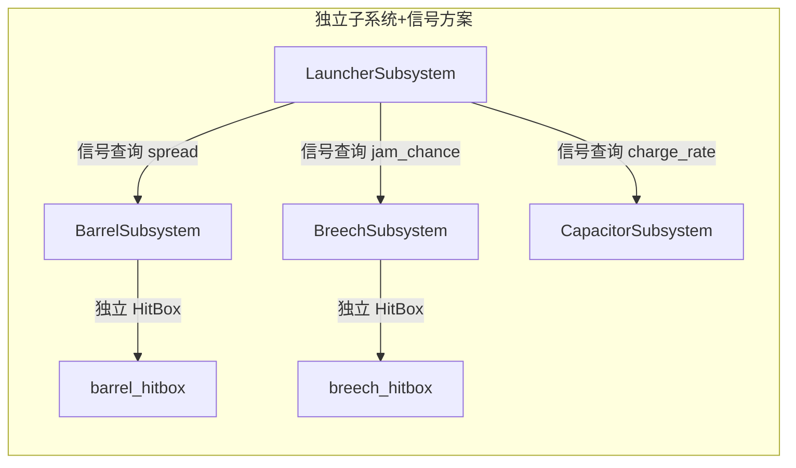

# 子系统：模块化损坏与子模块设计

> **状态：** 草案 v4，供审阅  
> **日期：** 2026-07-26  
> **修订记录：**
> - v2 — 修正 onDestroyed 生命周期断裂、onHurt 绕过 passDamage、移除过度包装的 effects 系统
> - v3 — 引入 ModuleAttr 层级（公共字段 + 专有字段）、耐久度权重替代绝对值、Codec 类型派发
> - v4 — 废弃 max/min 线性插值对，改用 damaged/destroyed 双值 + decay_power 衰减曲线；增加"子模块 vs 独立子系统+信号握手"对比分析；抽取 shouldDestroy/shouldRecover/onRecovered 到 AbstractSubsystem，移除 pendingDestroy，补回 IModularSubsystem 和 routeDamage/routeRepair 实现

---

## 1. 背景与动机

### 1.1 当前架构局限

当前子系统（`AbstractSubsystem`）采用**单一耐久度模型**：子系统只有一个 `durability` 值，归零后整体摧毁，功能完全失能。伤害由 `HitBox` 修正后直接扣减子系统耐久度。

```
HitBox (多) ──N:1──> AbstractSubsystem (单)
                         │
                         └── 单一 durability → 二元状态（正常/摧毁）
```

### 1.2 问题场景

以火炮为例，现实中有以下独立损坏维度：

| 受损部位 | 功能影响 | 战术意义 |
|----------|----------|----------|
| **炮管** (barrel) | 散布增大、初速下降，但仍可击发 | 机炮载具面对重型坦克的核心战术——打坏炮管后绕侧 |
| **炮闩** (breech) | 卡壳概率增加、归零后无法击发甚至炸膛 | 打击炮塔后部的收益 |
| **电容** (capacitor, 可选) | 蓄力时间延长、最大功率下降 | 针对电磁炮类武器的反制手段 |

当前架构下，这些都被一个 `LauncherSubsystem` 的单一耐久度表达为"能用/不能用"，无法支撑精细战术。

### 1.3 可推广场景

模块化不仅适用于发射器。以下子系统同样受益于分离的功能模块：

| 子系统 | 模块 | 功能影响 |
|--------|------|----------|
| **Engine** (内燃机) | `radiator` | 散热效率下降 → 逐步过热 → 功率衰退 |
| **Motor** (电动机) | `radiator` | 扭矩随温度下降 |
| **Battery** (电池) | `radiator` | 放电倍率受限 |
| **Gas Turbine** (燃气轮机, 未来) | `compressor`, `turbine`, `combustor` | 各模块独立影响功率曲线、熄火风险 |

**过度设计的警示线**：模块化有价值当且仅当——不同模块的损坏产生**质上不同**的功能影响，而非仅仅是**量上衰减**。发动机气缸/活塞的损坏仅是功率 × (n−1)/n，不应模块化。

---

## 2. 架构设计

### 2.1 总览

```
┌──────────────────────────────────────────────────────┐
│                  AbstractSubsystem                    │
│  durability (float)  ← 不模块化的子系统使用此值      │
│  shouldDestroy()     ← 可覆写：durability ≤ 0        │
│  shouldRecover()     ← 可覆写：durability ≥ 30%      │
│  onRecovered()       ← 可覆写：恢复回调（空实现）     │
└──────────┬──────────────────────┬────────────────────┘
           │                      │
  不实现 IModularSubsystem   实现 IModularSubsystem
  (行为不变, 零改动)         (耐久度 = baseDurability)
                              │
                    ┌─────────┴──────────┐
                    │  IModularSubsystem │ ← 接口（契约）
                    │  routeDamage()     │
                    │  routeRepair()     │
                    │  getModule(name)   │
                    └─────────┬──────────┘
                              │
                    ┌─────────┴──────────┐
                    │  ModularSubsystem  │ ← 抽象类（默认实现）
                    │  extends BasicSub  │
                    │  defineModules()   │
                    └─────────┬──────────┘
                              │
              ┌───────────────┼───────────────┐
              │               │               │
     LauncherSubsystem  EngineSubsystem  MotorSubsystem
     模块: barrel/       模块: radiator   模块: radiator
     breech/capacitor
```

### 2.2 四层分类

| 层 | 类型 | 职责 |
|----|------|------|
| **AbstractModuleAttr** | 抽象类（记录公共字段） | `durability_weight`（耐久权重）、`critical`（是否关键）。类似 `BasicAttr` 的角色。 |
| **具体 ModuleAttr** | 各子系统自行定义的子类 | 如 `BarrelModuleAttr`（散布/初速参数）、`BreechModuleAttr`（纯 critical 模块，无专有字段）。Codec 派发实现 JSON 校验。 |
| **SubModule** | 纯数据土类 | 运行时状态：当前耐久度、是否摧毁。NBT 序列化。**不含行为逻辑。** |
| **IModularSubsystem + ModularSubsystem** | 接口 + 抽象类 | 伤害/修复路由、聚合耐久覆写。不覆写 onTick()，仅覆写 `shouldDestroy()` / `shouldRecover()` / `onRecovered()` |

### 2.3 设计要点

- **耐久度权重，而非绝对值。** 子系统整体耐久度由 `BasicAttr.basicDurability` 决定。各模块声明 `durability_weight`，实际最大耐久度 = `basicDurability × (weight / totalWeight)`。用户不需要手动确保权重和为 1.0。
- **ModuleAttr 支持专有字段。** 炮管的散布参数与散热器的散热效率参数语义完全不同，各模块类型定义自己的 record/类，Codec 派发保证 JSON 校验类型安全。用户不会为不存在的模块写字段。
- **Codec 16 字段限制不成问题。** 因为每种模块类型是独立的 record，各有自己的 Codec。不会出现一个大一统的 record 塞所有模块类型字段。

### 2.4 功能衰减公式：damaged/destroyed 双值 + 衰减曲线

模块的功能衰减借鉴 HitBox `ArmorAttr` 中已有的衰减模型（`decay_rha` / `decay_power`），并针对子模块的特殊语义做了两处关键调整：

**① 战损 (damaged) 与摧毁 (destroyed) 分离**

炮管被命中 → 耐久下降但未归零 → 性能渐降（战损）。炮管耐久归零 → 结构破坏（炸成喇叭花）→ 性能悬崖式崩坏。这是**质变而非量变**，不能通过连续曲线表达。因此每个功能属性拆为两个值：

| 状态 | 耐久 | 含义 | 示例（散布乘数） |
|------|------|------|------------------|
| 完好 | 100% | 正常性能 | 1.0x |
| 战损极限 | → 0% (但 > 0) | 磨损/损坏到极限，但结构仍完整 | 2.0x |
| 摧毁 | = 0% | 结构破坏，质变 | 8.0x |

**② 衰减曲线对齐 HitBox**

战损区间的渐变使用与 HitBox `ArmorAttr` 相同的幂函数公式。满耐久值隐式为乘数 1.0：

```
// 销毁时直接返回 destroyedValue（质变悬崖）
if (durabilityRatio <= 0f) return destroyedValue;

// 战损区间：damagedValue + (1.0 - damagedValue) × durabilityRatio^decayPower
return damagedValue + (1.0f - damagedValue) * (float) Math.pow(durabilityRatio, decayPower);
```

`decayPower` 由各模块按需定义（如 `BarrelModuleAttr` 自带该字段）。不需要衰减曲线的模块（如炮闩）可完全不涉及此参数。

| decayPower | 行为 | 适用场景 |
|-----------|------|----------|
| `1.0` | 线性衰减 | 不推荐（无趣） |
| `2.0`（默认） | 抛物线：高耐久几乎无感，低耐久加速恶化 | 通用 |
| `5.0+` | 急速阶跃，接近二值 | 硬核——轻微损伤不影响，但濒毁时剧变 |

**③ 为什么不用独立子系统 + 信号通信？**

另一种候选方案是将炮管、炮闩、电容建模为独立子系统，通过信号系统（`ISignalSender/Receiver`）与发射器通信。审议结论：**不采用。** 详见附录 B。

---

## 3. 核心类型定义

### 3.1 AbstractModuleAttr（模块公共字段基类）

参考现有架构中 `BasicAttr` 记录公共字段的模式。

```java
/**
 * 模块静态属性基类——定义所有模块共有的字段。
 * <p>
 * 类似于 {@code BasicAttr} 在子系统层级承担的角色：各模块类型继承此类，
 * 添加自己的专有字段。
 *
 * @param durabilityWeight  耐久度权重。模块的 maxDurability = basicDurability × (weight / totalWeight)
 * @param critical          是否关键模块。归零 → 子系统整体摧毁，触发 onDestroyed
 */
public abstract class AbstractModuleAttr {
    private final float durabilityWeight;
    private final boolean critical;

    protected AbstractModuleAttr(float durabilityWeight, boolean critical) {
        this.durabilityWeight = durabilityWeight;
        this.critical = critical;
    }

    public float durabilityWeight() { return durabilityWeight; }
    public boolean critical() { return critical; }

    /** 返回此模块类型的 MapCodec，用于派发 */
    public abstract MapCodec<? extends AbstractModuleAttr> codec();

    /** 返回类型标识字符串（如 "barrel"、"breech"），用于 Codec dispatch */
    public abstract String type();
}
```

### 3.2 LauncherSubsystem 模块类型示例

衰减公式详见 2.4 节。每个模块类型按需决定是否使用 damaged/destroyed 双值衰减。`SubModule` 提供通用 `computeDecayMultiplier()` 工具方法（见 3.3 节），各 ModuleAttr 子类自行调用。

```java
// —— 炮管模块属性 ——
public class BarrelModuleAttr extends AbstractModuleAttr {
    /** 模块级衰减曲线指数（仅炮管需要，其他模块可不定义） */
    private final float decayPower;
    // 散布：damaged（战损极限）/ destroyed（摧毁）
    private final float damagedSpread, destroyedSpread;
    // 初速：damaged / destroyed
    private final float damagedMuzzleVelocity, destroyedMuzzleVelocity;

    public static final MapCodec<BarrelModuleAttr> CODEC = RecordCodecBuilder.mapCodec(instance -> instance.group(
        Codec.FLOAT.optionalFieldOf("durability_weight", 1.0f).forGetter(AbstractModuleAttr::durabilityWeight),
        Codec.BOOL.optionalFieldOf("critical", false).forGetter(AbstractModuleAttr::critical),
        Codec.FLOAT.optionalFieldOf("decay_power", 2.0f).forGetter(BarrelModuleAttr::decayPower),
        Codec.FLOAT.optionalFieldOf("damaged_spread", 2.0f).forGetter(BarrelModuleAttr::damagedSpread),
        Codec.FLOAT.optionalFieldOf("destroyed_spread", 8.0f).forGetter(BarrelModuleAttr::destroyedSpread),
        Codec.FLOAT.optionalFieldOf("damaged_muzzle_velocity", 0.7f).forGetter(BarrelModuleAttr::damagedMuzzleVelocity),
        Codec.FLOAT.optionalFieldOf("destroyed_muzzle_velocity", 0.1f).forGetter(BarrelModuleAttr::destroyedMuzzleVelocity)
    ).apply(instance, BarrelModuleAttr::new));

    /** 根据耐久比例计算散布乘数。委托 SubModule.computeDecayMultiplier() */
    public float getSpreadMultiplier(float durabilityRatio) {
        return SubModule.computeDecayMultiplier(durabilityRatio, damagedSpread, destroyedSpread, decayPower);
    }

    public float getMuzzleVelocityMultiplier(float durabilityRatio) {
        return SubModule.computeDecayMultiplier(durabilityRatio, damagedMuzzleVelocity, destroyedMuzzleVelocity, decayPower);
    }

    @Override public MapCodec<? extends AbstractModuleAttr> codec() { return CODEC; }
    @Override public String type() { return "barrel"; }
}

// —— 炮闩模块属性 ——
// 无专有字段。其存在意义仅在于：critical=true → 摧毁时触发子系统整体 onDestroyed。
// 炮闩自身不包含卡壳/炸膛等额外逻辑。当前版本 LauncherSubsystem 也不实现卡壳——摧毁后
// 子系统 isActive() 直接返回 false，发射器自然无法开火。
public class BreechModuleAttr extends AbstractModuleAttr {

    public static final MapCodec<BreechModuleAttr> CODEC = RecordCodecBuilder.mapCodec(instance -> instance.group(
        Codec.FLOAT.optionalFieldOf("durability_weight", 1.0f).forGetter(AbstractModuleAttr::durabilityWeight),
        Codec.BOOL.optionalFieldOf("critical", true).forGetter(AbstractModuleAttr::critical)
    ).apply(instance, BreechModuleAttr::new));

    @Override public MapCodec<? extends AbstractModuleAttr> codec() { return CODEC; }
    @Override public String type() { return "breech"; }
}

// —— 电容模块属性（可选，用于磁轨炮等蓄力武器） ——
public class CapacitorModuleAttr extends AbstractModuleAttr {
    private final float decayPower;
    private final float damagedChargeRate, destroyedChargeRate;
    private final float damagedMaxPower, destroyedMaxPower;

    public static final MapCodec<CapacitorModuleAttr> CODEC = RecordCodecBuilder.mapCodec(instance -> instance.group(
        Codec.FLOAT.optionalFieldOf("durability_weight", 1.0f).forGetter(AbstractModuleAttr::durabilityWeight),
        Codec.BOOL.optionalFieldOf("critical", false).forGetter(AbstractModuleAttr::critical),
        Codec.FLOAT.optionalFieldOf("decay_power", 2.0f).forGetter(CapacitorModuleAttr::decayPower),
        Codec.FLOAT.optionalFieldOf("damaged_charge_rate", 0.5f).forGetter(CapacitorModuleAttr::damagedChargeRate),
        Codec.FLOAT.optionalFieldOf("destroyed_charge_rate", 0.0f).forGetter(CapacitorModuleAttr::destroyedChargeRate),
        Codec.FLOAT.optionalFieldOf("damaged_max_power", 0.7f).forGetter(CapacitorModuleAttr::damagedMaxPower),
        Codec.FLOAT.optionalFieldOf("destroyed_max_power", 0.0f).forGetter(CapacitorModuleAttr::destroyedMaxPower)
    ).apply(instance, CapacitorModuleAttr::new));

    public float getChargeRate(float durabilityRatio) {
        return SubModule.computeDecayMultiplier(durabilityRatio, damagedChargeRate, destroyedChargeRate, decayPower);
    }

    public float getMaxPower(float durabilityRatio) {
        return SubModule.computeDecayMultiplier(durabilityRatio, damagedMaxPower, destroyedMaxPower, decayPower);
    }

    @Override public MapCodec<? extends AbstractModuleAttr> codec() { return CODEC; }
    @Override public String type() { return "capacitor"; }
}

// —— Codec 派发 ——
/** Launcher 子系统模块的 Codec 派发 */
public static final Codec<AbstractModuleAttr> LAUNCHER_MODULE_CODEC = Codec.STRING.dispatch(
    AbstractModuleAttr::type,
    type -> switch (type) {
        case "barrel"    -> BarrelModuleAttr.CODEC;
        case "breech"    -> BreechModuleAttr.CODEC;
        case "capacitor" -> CapacitorModuleAttr.CODEC;
        default -> throw new IllegalArgumentException("未知的发射器模块类型: " + type);
    }
);

/** LauncherSubsystemStaticAttr 中：modules 字段的 Codec */
public static final Codec<Map<String, AbstractModuleAttr>> MODULES_CODEC =
    Codec.unboundedMap(Codec.STRING, LAUNCHER_MODULE_CODEC);
```

**关键点：**
- 每个模块按需决定是否使用 damaged/destroyed 双值 + decay_power。炮闩作为纯 critical 模块无衰减逻辑——摧毁后 `isModularDestroyed()` 返回 true，子系统 `shouldDestroy()` 自然触发 `onDestroyed()`。
- `SubModule.computeDecayMultiplier()` 是纯工具方法，不强制任何模块使用。
- `decay_power` 是模块专有字段（如 Barrel、Capacitor），不在 `AbstractModuleAttr` 中。

### 3.3 SubModule（运行时状态容器）

```java
/**
 * 子模块——子系统内部可独立受损的功能单元。
 * <p>
 * 纯状态容器，管理运行时耐久度。功能衰减逻辑由各子系统根据
 * {@link #getDurabilityRatio()} + 对应 ModuleAttr 的专有字段自行计算。
 * <p>
 * 模块的 maxDurability 由 ModularSubsystem 在初始化时根据 durabilityWeight 计算：
 * {@code maxDurability = basicDurability × (weight / totalWeight)}。
 */
public class SubModule {
    private final String name;
    private final AbstractModuleAttr attr;
    private final float maxDurability;   // 由 ModularSubsystem 初始化时计算
    private float durability;
    private boolean destroyed;

    public SubModule(String name, AbstractModuleAttr attr, float maxDurability) {
        this.name = name;
        this.attr = attr;
        this.maxDurability = maxDurability;
        this.durability = maxDurability;
    }

    public float getDurabilityRatio() {
        return destroyed ? 0f : Math.clamp(durability / maxDurability, 0f, 1f);
    }

    /**
     * 通用衰减插值工具方法。
     * <p>
     * 耐久 = 0 → 返回 destroyedValue（质变悬崖）。<br>
     * 耐久 > 0 → damagedValue + (1.0 - damagedValue) × ratio^decayPower。<br>
     * 满耐久隐式值为 1.0（乘数恒等式）。
     * <p>
     * 各 ModuleAttr 子类按需调用。
     *
     * @param ratio          耐久比例 [0, 1]
     * @param damagedValue   战损极限乘数（耐久→0 但未归零）
     * @param destroyedValue 摧毁乘数（耐久归零）
     * @param decayPower     衰减曲线指数（>1 先硬后脆）
     */
    public static float computeDecayMultiplier(float ratio, float damagedValue, float destroyedValue, float decayPower) {
        if (ratio <= 0f) return destroyedValue;
        return damagedValue + (1.0f - damagedValue) * (float) Math.pow(ratio, decayPower);
    }

    /** 受到伤害。返回实际扣血量。摧毁仅设置 destroyed 标志，不触发回调——由 shouldDestroy() 在 onTick 中统一判定。 */
    public float applyDamage(float amount) {
        if (destroyed || amount <= 0f) return 0f;
        float actual = Math.min(amount, durability);
        durability -= actual;
        if (durability <= 0f) {
            durability = 0f;
            destroyed = true;
        }
        return actual;
    }

    /** 接受修复。返回实际修复量。 */
    public float applyRepair(float amount) {
        if (amount <= 0f) return 0f;
        float capacity = maxDurability - durability;
        if (capacity <= 0f) return 0f;
        float actual = Math.min(amount, capacity);
        durability += actual;
        if (destroyed && durability > 0f) destroyed = false;
        return actual;
    }

    public boolean isDestroyed() { return destroyed; }
    public String getName() { return name; }
    public AbstractModuleAttr getAttr() { return attr; }
    public float getDurability() { return durability; }
    public float getMaxDurability() { return maxDurability; }

    // NBT: save / load (略)
}
```

### 3.4 IModularSubsystem（模块化子系统接口）

```java
/**
 * 模块化子系统契约。
 * <p>
 * 实现此接口的子系统将其耐久度拆分为多个可独立受损的 SubModule。
 * ModularSubsystem 提供默认实现。
 */
public interface IModularSubsystem {
    /** 将伤害路由到指定模块（或按比例分摊）。 */
    void routeDamage(@Nullable String moduleName, float amount);

    /** 将修复路由到指定模块（或按比例分摊）。 */
    void routeRepair(@Nullable String moduleName, float amount);

    /** 获取指定名称的模块，不存在返回 null。 */
    @Nullable SubModule getModule(String name);

    /** 所有模块的聚合当前耐久度。 */
    float getAggregatedDurability();

    /** 所有模块的聚合最大耐久度。 */
    float getAggregatedMaxDurability();

    /** 是否存在至少一个 critical 模块被摧毁。 */
    boolean isModularDestroyed();
}
```

### 3.5 AbstractSubsystem 改造：抽取 shouldDestroy / shouldRecover / onRecovered

为支持 ModularSubsystem 无需覆写 `onTick()`，将 `AbstractSubsystem.onTick()` 中硬编码的 `durability <= 0` 和 `durability >= 0.3*max` 抽取为可覆写方法：

```java
// === AbstractSubsystem.onTick() ===

public void onTick() {
    tickCount++;
    if (!getLevel().isClientSide()) {
        boolean dataDestroyed = synchedData.get(DATA_DESTROYED_ID);

        if (!dataDestroyed && shouldDestroy()) {
            synchedData.set(DATA_DESTROYED_ID, true);
            onDestroyed();
        } else if (dataDestroyed && !getOwner().getSubPart().isDestroyed()
                   && !shouldDestroy() && shouldRecover()) {
            synchedData.set(DATA_DESTROYED_ID, false);
            onRecovered();
        }
    }
    if (!getSubPart().getLevel().isClientSide()) syncToClient();
}

/** 是否需要判定为摧毁。默认耐久 ≤ 0。模块化子系统覆写以检查 critical 模块状态。 */
protected boolean shouldDestroy() {
    return getDurability() <= 0;
}

/** 是否已恢复到可运转状态。默认耐久 ≥ 30%。模块化子系统覆写以检查所有 critical 模块。 */
protected boolean shouldRecover() {
    return getDurability() >= getMaxDurability() * 0.3f;
}

/** 从摧毁状态恢复时的回调。默认空实现，子类覆写用于重新注册能源网等业务逻辑。
 *  注意：DATA_DESTROYED_ID 由 onTick() 框架层管理，回调中不需设置。 */
protected void onRecovered() {}
```

**设计原则**：
- `synchedData.set(DATA_DESTROYED_ID, ...)` 由 `onTick()` 框架层统一管理，与 `onDestroyed()` 对称
- `shouldDestroy()` / `shouldRecover()` 是纯判断方法，不包含副作用
- `onRecovered()` 只做业务逻辑（能源网注册、音效等），不管理同步数据

### 3.6 ModularSubsystem（简化后——不再覆写 onTick）

```java
public abstract class ModularSubsystem extends BasicSubsystem implements IModularSubsystem {
    protected final Map<String, SubModule> modules = new LinkedHashMap<>();

    /** 子类实现：声明此子系统的模块定义（name → AbstractModuleAttr）。 */
    protected abstract Map<String, ? extends AbstractModuleAttr> defineModules();

    @Override
    public void onInit() {
        super.onInit();
        var defs = defineModules();
        if (defs != null && !defs.isEmpty()) {
            float totalWeight = (float) defs.values().stream()
                .mapToDouble(AbstractModuleAttr::durabilityWeight).sum();
            float baseDurability = attr.getStaticAttribute().getBasicDurability();

            defs.forEach((name, modAttr) -> {
                float modMaxDurability = baseDurability * (modAttr.durabilityWeight() / totalWeight);
                modules.put(name, new SubModule(name, modAttr, modMaxDurability));
            });
        }
    }

    // ——— 覆写 shouldDestroy / shouldRecover / onRecovered，不再覆写 onTick ———

    /**
     * 摧毁判定：任一 critical 模块被摧毁 → 子系统整体摧毁。
     * <p>
     * isModularDestroyed() 直接检查模块当前 destroyed 状态。
     * 模块在 SubModule.applyDamage() 中设置 destroyed=true（可能发生在物理线程），
     * 下一 tick 的 onTick()（主线程）调用 shouldDestroy() 时自然反映最新状态。
     * 与现有子系统 "durability ≤ 0 → shouldDestroy()" 的模式一致，无需额外标志位。
     */
    @Override
    protected boolean shouldDestroy() {
        if (modules.isEmpty()) return super.shouldDestroy();
        return isModularDestroyed();
    }

    /**
     * 恢复判定：所有 critical 模块耐久比例 ≥ 30% → 子系统恢复运转。
     * <p>
     * 30% 阈值提供防抖——防止战斗中 1 点修复即复活，确保恢复有实质性维修投入。
     */
    @Override
    protected boolean shouldRecover() {
        if (modules.isEmpty()) return super.shouldRecover();
        return modules.values().stream()
            .filter(m -> m.getAttr().critical())
            .noneMatch(m -> m.isDestroyed() || m.getDurabilityRatio() < 0.3f);
    }

    /** 恢复回调：重新注册能源网。子类可覆写以播放修复音效等。 */
    @Override
    protected void onRecovered() {
        if (getOwner() != null) {
            getOwner().getEnergyGrid().addConsumer(this);
        }
    }

    // ——— 聚合覆写 ———

    /** 子系统耐久度 = 各模块耐久度之和。与 baseDurability 不一定相等（因模块受损程度不同）。 */
    @Override
    public float getDurability() {
        return modules.isEmpty() ? super.getDurability() : getAggregatedDurability();
    }

    /** 子系统最大耐久度 = basicDurability（等于各模块 maxDurability 之和）。 */
    @Override
    public float getMaxDurability() {
        return modules.isEmpty() ? super.getMaxDurability() : getAggregatedMaxDurability();
    }

    // ——— onHurt：复制 passDamage/limitDamage 后路由到模块 ———
    // 伤害传递完全沿用现有子系统 passDamage 策略，见 5.1/5.2 节。

    @Override
    public void onHurt(SubPartDamageEvent.Pre event) {
        if (!attr.getStaticAttribute().getBasicAttr().passDamage()) {
            event.setCanceled(true);
            return;
        }
        if (event.getDamageAmount() > getDurability()
            && attr.getStaticAttribute().getBasicAttr().limitDamage()) {
            event.setDamageAmount(getDurability());
        }

        String moduleName = event.getHitBox() != null
            ? event.getHitBox().getAttr().getModule() : null;
        routeDamage(moduleName, event.getDamageAmount());
        // 不调用 super.onHurt() —— 伤害已由子模块消费
    }

    // ——— routeDamage / routeRepair（实现见 5.1/5.2 节） ———

    @Override
    public void routeDamage(@Nullable String moduleName, float amount) {
        if (moduleName != null && !moduleName.isEmpty()) {
            SubModule target = modules.get(moduleName);
            if (target != null) {
                target.applyDamage(amount);
                return;
            }
            MachineMax.LOGGER.warn("模块 '{}' 不存在于子系统 '{}'，回退按比例分摊", moduleName, getName());
        }
        // 未指定或不存在：按最大耐久比例分摊
        // 分母为所有模块（含已摧毁）——已摧毁模块仍占据体积、吸收动能，但伤害不产生新效果
        float totalMax = getAggregatedMaxDurability();
        if (totalMax <= 0) return;
        for (SubModule m : modules.values()) {
            if (!m.isDestroyed()) {
                float share = amount * (m.getMaxDurability() / totalMax);
                m.applyDamage(share);
            }
        }
    }

    @Override
    public void routeRepair(@Nullable String moduleName, float amount) {
        if (moduleName != null && !moduleName.isEmpty()) {
            SubModule target = modules.get(moduleName);
            if (target != null) {
                target.applyRepair(amount);
                return;
            }
        }
        // 未指定：按受损比例分摊到所有模块（含已摧毁——否则已摧毁模块永远无法通过溅射修复恢复）
        float totalLost = 0;
        for (SubModule m : modules.values())
            totalLost += m.getMaxDurability() - m.getDurability();
        if (totalLost <= 0) return;
        for (SubModule m : modules.values()) {
            float lost = m.getMaxDurability() - m.getDurability();
            if (lost > 0) m.applyRepair(amount * (lost / totalLost));
        }
    }

    // ——— 网络同步 / 持久化 (略) ———
}
```

**设计要点**：
- `shouldDestroy()` 直接检查 `isModularDestroyed()`（模块当前状态），不使用 pending 标志位。模式与现有子系统 `durability ≤ 0` 一致。
- `routeDamage()` / `routeRepair()` 实现见上方代码，与 5.1/5.2 节公式一致。
- 若所有模块 `critical=false`，`isModularDestroyed()` 始终为 false，子系统耐久可归零但永不触发 `onDestroyed()`。这是有意设计——"性能极差但未彻底损坏"。

---

## 4. JSON 配置示例

### 4.1 LauncherSubsystem（完整火炮）

```jsonc
// LauncherSubsystemStaticAttr
{
  "type": "launcher",
  "basic_durability": 1000,     // ← 子系统总耐久度
  "fire_rate": 600,
  "velocity_multiplier": 1.0,
  "modules": {
    "barrel": {
      "type": "barrel",              // ← Codec 派发键
      "durability_weight": 0.5,      // 占 50%
      "critical": false,
      "decay_power": 2.0,            // 模块级衰减曲线指数
      "damaged_spread": 2.0,         // 战损极限：散布 ×2
      "destroyed_spread": 8.0,       // 摧毁悬崖：散布 ×8（炸膛）
      "damaged_muzzle_velocity": 0.7,
      "destroyed_muzzle_velocity": 0.1
    },
    "breech": {
      "type": "breech",
      "durability_weight": 0.3,      // 占 30%
      "critical": true               // 摧毁 → 子系统整体 onDestroyed
    },
    "capacitor": {
      "type": "capacitor",
      "durability_weight": 0.2,      // 占 20%
      "critical": false,
      "decay_power": 2.0,
      "damaged_charge_rate": 0.5,
      "destroyed_charge_rate": 0.0,  // 摧毁：完全无法蓄力
      "damaged_max_power": 0.7,
      "destroyed_max_power": 0.0
    }
  }
}
```

计算：
- totalWeight = 0.5 + 0.3 + 0.2 = 1.0
- barrel.maxDurability = 1000 × 0.5 = 500
- breech.maxDurability = 1000 × 0.3 = 300
- capacitor.maxDurability = 1000 × 0.2 = 200

**衰减轨迹示例**（barrel 散布，decay_power=2.0）：

```
耐久 100% → 1.0x    正常
耐久  50% → 1.5x    轻微战损（抛物线：前段平坦）
耐久  10% → 1.98x   严重战损，但炮管结构仍完整
────────────────────────── 质变悬崖
耐久   0% → 8.0x    炸成喇叭花，弹丸偏到姥姥家
```

### 4.2 LauncherSubsystem（简单火炮，无电容）

```jsonc
{
  "type": "launcher",
  "basic_durability": 800,
  "fire_rate": 300,
  "modules": {
    "barrel": {
      "type": "barrel",
      "durability_weight": 0.6,
      "critical": false,
      "decay_power": 2.0,
      "damaged_spread": 2.0,
      "destroyed_spread": 5.0,
      "damaged_muzzle_velocity": 0.6,
      "destroyed_muzzle_velocity": 0.2
    },
    "breech": {
      "type": "breech",
      "durability_weight": 0.4,
      "critical": true
    }
    // 没有 capacitor 条目 —— 不写就是不存在
  }
}
```

### 4.3 LauncherSubsystem（最简形式，不声明 modules）

```jsonc
{
  "type": "launcher",
  "basic_durability": 500,
  "fire_rate": 600,
  "velocity_multiplier": 1.0
  // 不声明 modules → 退化为传统单一耐久度行为
}
```

### 4.4 EngineSubsystem（后续阶段）

```jsonc
{
  "type": "engine",
  "basic_durability": 600,
  "modules": {
    "radiator": {
      "type": "radiator",
      "durability_weight": 1.0,
      "critical": false,
      "decay_power": 2.0,
      "damaged_cooling_efficiency": 0.5,
      "destroyed_cooling_efficiency": 0.0
    }
  }
}
```

### 4.5 HitBox 声明

```jsonc
{
  "barrel_hitbox": {
    "type": "cylinder",
    "subsystem": "main_gun",
    "module": "barrel",       // ← 指向模块名，伤害路由到炮管模块
    "material": "steel_gun",
    "thickness": 80
  },
  "breech_hitbox": {
    "type": "cube",
    "subsystem": "main_gun",
    "module": "breech",
    "material": "steel_gun",
    "thickness": 120
  },
  "gun_body": {
    "type": "cube",
    "subsystem": "main_gun",
    // 未指定 module → 伤害按最大耐久比例分摊到所有未摧毁模块
    "material": "steel_gun",
    "thickness": 60
  }
}
```

---

## 5. 伤害与修复路由规则

### 5.1 伤害路由

```
HitBox.specifiedModule
    │
    ├─ 非空字符串
    │   ├─ 存在于 modules ──> 该模块全额扣血
    │   └─ 不存在 ──────────> 按比例分摊 + 日志 WARN
    │
    └─ null / 空字符串
        ├─ 子系统 implements IModularSubsystem ──> 按最大耐久比例分摊（分母含已摧毁模块，见 5.2）
        └─ 否则 ──> 走现有路径（子系统整体扣耐久，行为不变）
```

### 5.2 分摊策略设计决策

**采用**：按**最大耐久度**比例分摊，分母为**所有模块（含已摧毁）**。

```
moduleDamage = damage × (module.maxDurability / totalMaxDurability)
```

**理由**：
- 最大耐久度通常映射物理体积——炮管 500 maxHP 比炮闩 300 maxHP 体积更大，承受更多溅射伤害符合直觉。
- 分母含已摧毁模块：已破坏部件仍占据物理空间、吸收动能，但其分配到的伤害被浪费（不产生新损害）。物理直觉：打一个已经炸烂的炮闩，子弹穿过去打在后面的东西上。但从游戏性角度，这也意味着摧毁一个模块后，剩余模块的溅射分摊伤害会减少——摧毁模块相当于"吸收了"伤害。
- 精确打击应使用 `module` 字段指定目标（如打击炮闩的 HitBox），溅射则按体积比例分配。

### 5.3 修复路由（焊枪）

```
焊枪目标 HitBox.specifiedModule
    │
    ├─ 非空 ──> 定向修复指定模块
    └─ 空 ────> 按受损比例分摊到所有未满耐久模块
         分摊公式: moduleRepair = repair × (moduleLostDurability / totalLostDurability)
```

### 5.4 边界情况

| 情况 | 行为 |
|------|------|
| 所有模块已摧毁 + 未指定 module 的 HitBox 被击中 | 伤害不分配。可通过 overkill 回调触发弹药殉爆。 |
| 指定了不存在的 module 名 | 回退按比例分摊 + 日志 WARN（Blockbench 插件校验可预防）。 |
| 某 critical 模块归零但其他模块完好 | 模块 `destroyed=true` → `isModularDestroyed()` 返回 true → 下 tick `shouldDestroy()` 返回 true → `onTick()` 调用 `onDestroyed()`，子系统整体摧毁。 |
| 某 non-critical 模块归零 | 仅该模块对应的功能衰减生效，子系统整体正常运行。 |
| 模块定义为空（`defineModules()` 返回空 Map） | 退化为普通 BasicSubsystem 行为。 |
| HitBox 指定 module 且伤害量超过该模块剩余耐久 | 超出部分不传递到其他模块（与现有非模块化子系统行为一致：耐久归零后多余伤害无额外效果）。 |
| 所有模块摧毁后修复所有 critical 模块至 ≥ 30% | `shouldRecover()` 返回 true → `onTick()` 设置 `DATA_DESTROYED_ID = false` + 调用 `onRecovered()`。30% 阈值防止战斗中 1 点修复即复活。 |

---

## 6. ModuleAttr 类型一览（计划）

| 模块类型 | 所属子系统 | 专有字段 | 说明 |
|----------|-----------|----------|------|
| `barrel` | Launcher | `damaged/destroyed_spread`, `damaged/destroyed_muzzle_velocity`, `decay_power` | 炮管精度与初速——战损渐降 + 摧毁悬崖 |
| `breech` | Launcher | （无专有字段） | 炮闩。仅作为 critical 模块存在——摧毁 → 子系统整体 onDestroyed |
| `capacitor` | Launcher | `damaged/destroyed_charge_rate`, `damaged/destroyed_max_power`, `decay_power` | 电磁炮蓄力机构（可选），摧毁后完全失效 |
| `radiator` | Engine | `damaged/destroyed_cooling_efficiency`, `decay_power` | 散热效率衰减（后续阶段） |
| `radiator` | Motor | `damaged/destroyed_cooling_efficiency`, `decay_power` | 电机散热衰减（后续阶段） |
| `radiator` | Battery | `damaged/destroyed_discharge_limit`, `decay_power` | 放电倍率限制（后续阶段） |

**字段命名规律**：每个功能属性 X 拆为 `damaged_X`（耐久→0 但未归零）和 `destroyed_X`（耐久归零）。`decay_power` 是模块专有字段，由需要的模块自行定义。满耐久值隐式为乘数 1.0。

**注意**：`radiator` 同时出现在多个子系统中，字段语义不同但类型标识相同。每个子系统在自己的 Codec 派发上下文中定义自己的 `RadiatorModuleAttr`，不会冲突。

---

## 7. LauncherSubsystem 使用示例

```java
@Override
protected Map<String, AbstractModuleAttr> defineModules() {
    return attr.staticAttribute.getModules(); // 从 JSON 反序列化
}

private void fireSingle(ProjectileType type) {
    SubModule barrel = getModule("barrel");
    SubModule breech = getModule("breech");
    SubModule capacitor = getModule("capacitor");

    // ① 炮闩：critical 模块，摧毁时 ModularSubsystem.onTick() 自动触发 onDestroyed()
    //    发射器在 isActive() 检查中自然被阻止。无需额外处理。

    // ② 炮管参数修正（damaged → 战损渐降, destroyed → 摧毁悬崖）
    float spreadMult = 1.0f;
    float velMult = attr.staticAttribute.getVelocityMultiplier();
    if (barrel != null) {
        BarrelModuleAttr barrelAttr = (BarrelModuleAttr) barrel.getAttr();
        spreadMult = barrelAttr.getSpreadMultiplier(barrel.getDurabilityRatio());
        velMult *= barrelAttr.getMuzzleVelocityMultiplier(barrel.getDurabilityRatio());
    }

    // ③ 电容蓄力（destroyed → 完全无法蓄力）
    float chargeRate = 1.0f;
    float maxPower = 1.0f;
    if (capacitor != null) {
        CapacitorModuleAttr capAttr = (CapacitorModuleAttr) capacitor.getAttr();
        chargeRate = capAttr.getChargeRate(capacitor.getDurabilityRatio());
        maxPower = capAttr.getMaxPower(capacitor.getDurabilityRatio());
    }

    // ④ 执行发射（使用 spreadMult, velMult, chargeRate, maxPower）
}
```

---

## 8. HitBoxAttr 变更

```java
/** 子系统内部模块名，如 "barrel"、"breech"、"radiator"。空字符串 = 作用于子系统整体 */
@Getter
private final String module;
```

Codec 中 `optionalFieldOf("module", "")`。

---

## 9. 网络同步与持久化

采用 NBT 批量同步，每个 ModularSubsystem 使用 1 个 EntityDataAccessor&lt;CompoundTag&gt; 覆盖所有模块状态。SubModule.save()/load() 自管理序列化，与持久化格式一致。

---

## 10. 四层耐久度认知成本分析

| 层 | 含义 | 玩家感知 |
|----|------|----------|
| Vehicle | 载具整体结构 | "车没散架" |
| SubPart | 零部件装甲 | "打这面钢板多厚？" |
| Subsystem | 功能单元 | "炮坏了、发动机坏了" |
| SubModule | 功能子单元 | "炮管弯了但还能打" |

SubModule 透明可选的——不声明 `modules` = 没有这一层。War Thunder 已教育市场。

---

## 11. 修正汇总

| # | 问题 | 修正方案 |
|---|------|----------|
| 2.1 | onDestroyed 生命周期断裂 | `SubModule.onDestroyedCallback` → `volatile pendingDestroy` → `onTick()` 延迟触发 `onDestroyed()` |
| 2.2 | passDamage/limitDamage 被绕过 | `ModularSubsystem.onHurt()` 显式复制逻辑，不调用 `super.onHurt()` |
| 2.3 | 伤害分摊公式 | 按**最大耐久度**比例分摊。精确打击用 `module` 标签 |
| 2.4 | effects 过度包装 | **移除。** 各模块类型定义自己的专有 `ModuleAttr` 字段，Codec 派发校验 |
| 3.1 | 模块耐久度绝对值 → 权重 | `durability_weight` 占 `basicDurability` 比例。`maxDurability = basicDurability × weight/totalWeight` |
| 3.2 | JSON 缺少类型安全校验 | `AbstractModuleAttr` 层级 + Codec dispatch，每种模块类型的字段独立校验 |
| 3.3 | 用户不应为不存在的模块写字段 | 每个子系统只声明自己有的模块条目。Codec map 按需反序列化 |
| 4.1 | max/min 线性插值无法表达摧毁质变 | 改用 `damaged_X` + `destroyed_X` 双值模型。耐久 = 0 直接返回 destroyed 值（悬崖），耐久 > 0 走衰减曲线 |
| 4.2 | 每个属性的曲线参数冗余 | `decay_power` 是模块专有字段（如 Barrel、Capacitor），不强制所有模块。`SubModule.computeDecayMultiplier()` 提供工具方法 |
| 4.3 | 字段命名暗示"磨损"但实际只有战损 | `worn` → `damaged`。当前无磨损机制（仅 HitBox 命中造成伤害），不引入额外系统 |
| 4.4 | ModularSubsystem 覆写 onTick() 与 AbstractSubsystem 耦合过紧 | 抽取 `shouldDestroy()` / `shouldRecover()` / `onRecovered()` 到 AbstractSubsystem。ModularSubsystem 仅覆写此三个方法，不再覆写 onTick() |
| 4.5 | 恢复时缺少回调 | 新增 `onRecovered()` 回调，默认重新注册能源网。`DATA_DESTROYED_ID` 由 onTick() 框架层统一管理 |
| 4.6 | 伤害传递策略未明确 | **完全沿用现有 passDamage。** 所有模块摧毁后子系统视为 destroyed，行为与现有非模块化子系统一致 |
| 4.7 | IModularSubsystem 接口定义丢失 | 补回完整接口 |
| 4.8 | pendingDestroy 永不重置导致无法恢复 | **移除 pendingDestroy。** `shouldDestroy()` 直接检查 `isModularDestroyed()`（模块当前 destroyed 状态），与现有子系统 `durability ≤ 0` 模式一致，无需额外标志位 |
| 4.9 | routeDamage/routeRepair 缺少实现 | 补回完整实现，与 5.1/5.2 节公式一致 |
| 4.10 | 全模块 critical=false 时永不摧毁未说明 | 明确为有意设计——"性能极差但未彻底损坏" |
| 4.11 | routeRepair 过滤已摧毁模块导致无法修复 | 移除 `!m.isDestroyed()` 过滤。`SubModule.applyRepair()` 内部已正确处理已摧毁状态 |
| 4.12 | routeDamage 分母含已摧毁模块未明确 | 5.2 节明确：分母为所有模块（含已摧毁）最大耐久度之和。已摧毁模块按比例分配的伤害被浪费——物理直觉：已破坏部件仍占据体积、吸收动能 |

---

## 12. 实施路径

| 阶段 | 内容 | 涉及文件 |
|------|------|----------|
| **第一阶段** | `AbstractModuleAttr` + `SubModule` + `IModularSubsystem` + `ModularSubsystem` + `HitBoxAttr.module` | 新建 ~4 个文件，修改 HitBoxAttr.java |
| | `BarrelModuleAttr`, `BreechModuleAttr`, `CapacitorModuleAttr` + Codec dispatch | ~3 个文件 |
| | `LauncherSubsystem` 迁移为 `extends ModularSubsystem` | LauncherSubsystem.java, LauncherSubsystemStaticAttr.java |
| | 焊枪修复逻辑适配 + Blockbench 插件 module 字段 | 焊枪代码, MachineMax_BlockbenchPlugin |
| **第二阶段** | `RadiatorModuleAttr` (Engine/Motor/Battery) | ~3 个文件 |
| **第三阶段** | GasTurbineSubsystem + 其模块类型 | 新文件 |

---

## 13. 待审阅决策

| # | 问题 | 建议 |
|---|------|------|
| 1 | `AbstractModuleAttr` 做抽象类还是接口？ | 抽象类。类似 `AbstractSubsystemStaticAttr` 的模式，公共字段 + `codec()/type()` + 通用 `computeMultiplier()` 方法。 |
| 2 | `durability_weight` 的总和是否强制为 1.0？ | **不强制。** 自动归一化：`maxDurability = basicDurability × weight / sumWeights`。用户无需心算比例。 |
| 3 | ModuleAttr 类型是全局注册还是各子系统内聚？ | **各子系统内聚。** `barrel` 只存在于 Launcher 的 Codec 派发上下文中。不同子系统可以有同名但不同字段的模块类型。 |
| 4 | `critical` 默认值？ | 炮闩默认 `true`，炮管/电容默认 `false`，散热器默认 `false`。各 ModuleAttr 子类自定默认值。 |
| 5 | 未指定 module 时按最大耐久度比例分摊？ | 是。最大耐久映射物理体积，见 5.2 节。 |
| 6 | 网络同步方案？ | NBT 批量同步，1 个 DataAccessor。 |
| 7 | 功能衰减用 damaged/destroyed 双值 + decay_power？ | **是，但按需使用。** `SubModule.computeDecayMultiplier()` 提供工具方法。`decay_power` 是模块专有字段（如 Barrel、Capacitor）。炮闩作为纯 critical 模块无衰减逻辑。 |
| 8 | 是否拆分水平/垂直散布？ | **第一版不拆分。** 统一用 `damaged/destroyed_spread` 单一字段。未来如需拆分再加 `_h` / `_v` 后缀，向后兼容。 |
| 9 | 是否需要独立的磨损（wear）机制？ | **当前不做。** 所有伤害来自 HitBox 命中。`damaged` 表示战损极限状态，不暗示磨损来源。将来若引入持续使用磨损，可复用同一套衰减公式。 |
| 10 | 摧毁后伤害传递策略？ | **沿用 passDamage。** 与现有非模块化子系统一致：所有模块摧毁 = 子系统 destroyed，后续命中行为由 passDamage 决定。不新增模块级伤害传递规则。 |
| 11 | 修复阈值是否保留 30%？ | **保留。** 所有 critical 模块 ≥ 30% 判定恢复。在自动修复场景提供防抖——防止 1 点修复即复活。 |

---

## 附录 B：子模块 vs 独立子系统+信号握手 对比分析

### B.1 替代方案描述

另一种候选设计是将炮管、炮闩、电容建模为独立子系统（各自注册 `SubsystemType`、拥有独立 HitBox 和生命周期），通过现有信号系统（`ISignalSender/Receiver` + `SignalChannel`）与发射器通信：



发射器 `fireSingle()` 中通过信号通道读取炮管子系统提供的精准度、从炮管子系统的 locator 处生成弹丸。

### B.2 维度对比

| 维度 | 子模块（本文方案） | 独立子系统+信号 |
|------|-------------------|-----------------|
| **新增 SubsystemType** | 0 | 3（barrel, breech, capacitor） |
| **新增文件数** | ~5（ModuleAttr 子类 + SubModule + ModularSubsystem） | ~18+（每子系统 × 6 类：StaticAttr, DynamicAttr, 子系统类, Codec, 注册, 信号协议） |
| **JSON 配置** | 1 个文件，模块内联 | 2~4 个独立 JSON + 信号连线配置 |
| **伤害路由** | `HitBox.module="barrel"` 直达 | 各子系统自有 HitBox，天然隔离 |
| **状态读取** | `barrel.getDurabilityRatio()` 同步直接调用 | 需每 tick 信号轮询或事件推送，存在时序不确定性 |
| **生命周期** | 模块随父系统摧毁而消失 | 各自独立，需处理"炮管炸了但炮还在"的边界情况 |
| **可复用性** | 炮管逻辑绑定 Launcher | BarrelSubsystem 理论上可被任意武器类型查询 |
| **运行时替换** | 不支持 | 理论支持（断开/重连连接器） |
| **信号开销** | 零 | 每 tick N 次信号读写 |

### B.3 结论：不采用独立子系统方案

核心原因：

1. **物理真实性**：炮管、炮闩是同一武器的组成部分，不是独立实体。建模为信号通信的对等方是过度解耦——现有 `CarController → Engine/Motor` 信号链路之所以合理，是因为控制器和发动机确实是物理上可分离的功能单元。

2. **"额外连接"的场景被高估**：玩家不会手动把炮管"连接"到发射器——炮管就是炮的一部分。War Thunder 等游戏中这是自动的。把必然 1:1 的关系建模为信号连接，增加认知负担和配置出错可能。

3. **信号系统不是为紧密耦合的功能衰减设计的**：现有信号系统的优势在于松耦合事件通知（按键→控制→动力），而非实时状态查询。发射器发射时需要的精度/初速是确定性、零延迟的同步值，直接方法调用最合适。

4. **子系统类型命名空间污染**：`SubsystemTypes` 当前 22 个条目均代表独立功能域。增加 barrel/breech/capacitor 会模糊边界。

5. **唯一例外场景**——"不同物理模型的炮管作为可更换零件"——可通过在 `BarrelModuleAttr` 中增加 locator 引用字段来覆盖，无需完整独立子系统。

---

## 附录 C：审议结论汇总

### C.1 伤害传递

**结论**：完全沿用现有 `passDamage` 策略。

`ModularSubsystem.onHurt()` 在路由到模块前先检查 `passDamage`/`limitDamage`。所有模块摧毁后子系统视为 destroyed，后续命中行为与现有非模块化子系统完全一致——伤害是否穿透给 SubPart 由子系统自身的 `BasicAttr.passDamage` 决定，无需新增规则。

### C.2 修复阈值

**结论**：保留 30% 阈值。

`shouldRecover()` 默认 `durability >= 0.3 × maxDurability`。模块化子系统覆写为"所有 critical 模块耐久比例 ≥ 30%"。30% 提供防抖——避免战斗中 1 点修复即复活，确保恢复有实质性维修投入。

### C.3 shouldDestroy / shouldRecover / onRecovered 抽取

**结论**：抽取到 AbstractSubsystem，ModularSubsystem 不再覆写 onTick()。

`shouldDestroy()` / `shouldRecover()` 是纯判断方法，无副作用。`onRecovered()` 只做业务逻辑。`synchedData.set(DATA_DESTROYED_ID, ...)` 由 `onTick()` 框架层统一管理，与 `onDestroyed()` 保持对称。
