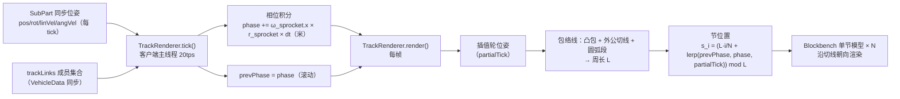

# 履带系统：物理实现设计文档

> **状态：** 草案 v2，供审阅
> **日期：** 2026-08-15
> **修订记录：**
>
> - v1 — 汇总前期讨论结论：星形 GearJoint 角速度耦合方案、btGearConstraint 源码语义考证、符号约定、装配模型
> - v2 — 决议开放问题：SubPart 持有 TrackLink 反向引用，损毁/拆卸时禁用约束（非移除）；有效轮数 < 2 或主动轮失效则整条履带掉落；弃用裙板 hitbox；TrackLink 统一摩擦覆盖与装甲层（耐久/材料/厚度），履带存活期间命中优先扣减履带耐久
> - v3 — 修正装配模型：履带**不作为 Part**；履带为独立物品（非 PartItem），`TrackLink` 为 VehicleCore 级关系+状态对象（VehicleCore 持有履带列表）；成员轮子为常规 SubPart、归属既有 Part；掉落仅解散 TrackLink 并归还履带物品，轮子留在原处
> - v4 — 审阅修订：崩溃根因确认为"两运动学体间关节"（与加入顺序无关，更正 AbstractConnector 旧注释）；GearJoint 轴为 body-local 且自动跟随刚体姿态（无需运行时更新轴）；有效成员计数含主动轮；成员归属变化（销毁/拆卸/分裂）统一走 TrackLink 刷新方法；TrackAttr 装甲字段集 = MaterialAttr.armor() 且不绑定子系统；trackLinks 序列化恒为列表（可空）
> - v5 — 新增第 8 章"渲染实现"（从 7.3 登记中独立出来）：包络线 + 固定数量履带节均匀排列；全部客户端本地计算（零新增同步）；节数 N 由周长/每节长推导且装配期固定；带速相位双值插值（prevPhase/phase）由 TrackRenderer.tick 积分；履带节用 Blockbench 单节模型
> - v5.1 — 审阅修订（8.3）：共线退化**不能**兜底为胶囊体（"两端半圆 + 两条直线"仅在等半径下成立，半径不同时公切线倾斜、圆弧段小于半圆）；改为凸包算法**保留共线点**，共线/非共线统一走一般化外公切线流程；补充外切线取外侧、轮间无重叠/包含假设
> - v5.2 — 审阅修订（5.3 扩展为"摩擦与音效覆盖"）：履带音效复用同一查询入口（subPart.trackLink + isWheelSurface）做替换语义——`roll` 滚动音效替换 `getTireRollSound`（初版单音效，不按地面材质细分），命中音效随 7.2 伤害路由替换 HitBox 材质；clank 节拍声（频率 = v_belt/linkLength）初版不做，后续事件节流加入；TrackAttr 增加 `sounds`
> - v5.3 — 审阅修订（4.3/7.3）：负重轮悬挂与 GearJoint **约束层面正交解耦**（平动 vs 旋转约束行、GearJoint 不关心轮心位置）；正交成立前提写入装配配置规范——悬挂走平动轴、禁止滚动轴弹簧（旋转悬挂初版不支持）、连接器锚点过轮心；载荷→阻力→负载为预期行为。7.3 该待议项关闭
> - v5.4 — 审阅修订（4.3）：撤掉"禁止滚动轴弹簧"的绝对表述——**摇臂悬挂可用多个 SubPart 组合实现且不影响履带**（摆臂↔车体连接器 A 的 X 轴配旋转弹簧、负重轮↔摆臂连接器 B 的 X 轴放行滚动；GearJoint 轴 body-local 自动跟随姿态，只约束自转角速度）。原则改为：滚动自由度 GearJoint 独占、悬挂自由度落其他刚体；支撑锚点在轮轴

***

## 1. 背景与动机

### 1.1 现状：轮式驱动管线

Machine-Max（NeoForge 1.21.1）是数据驱动的载具组装模组。载具拓扑为三层：

```
VehicleCore（聚合根，partNet 图）
  └── Part（部件容器，可共享耐久度）
        └── SubPart（零件实体，每个 SubPart 一个 Bullet 刚体，Spark-Core 集成）
```

- **物理引擎**：Spark-Core 1.0.1031 内嵌 LibbulletJME（jMonkeyEngine 的 Bullet 封装，native 侧为 Bullet 3，源码位于 `Libbulletjme/src/main/native/bullet3/`）。
- **连接器**：`AbstractConnector`（成对概念），关节为 `New6Dof`，默认 6 轴全锁（`adjustJoint`）；`AdvancedConnector` 支持每轴弹簧/阻尼/限位。
- **轮式驱动链**：`Engine/Motor`（IMechPowerProducer）→ `Gearbox` → `Transmission`（多输出、开放差速/差速锁、每输出独立减速比）→ `WheelDriverSubsystem` → 轮子连接器关节的滚动轴 `RotationMotor`（RotationOrder.XZY，0 轴=滚动，1 轴=转向伺服）。
- **接地摩擦**：`CollisionHandler.setupFriction` 按接触部位所属 HitBox 材质逐接触设置 `friction`/`rollingFriction`/`spinningFriction`/`restitution`；轮面接触由 `SubPart.isWheelSurface()`/`getWheelRadius()` 判定，配合滑移曲线（`DynamicUtil.calculateSlipScale`）计算驱动力。
- **线程模型**：主线程（20tps）与物理线程（Bullet 步进）分离；物理体操作必须经 `getPhysicsLevel().submitImmediateTask(PPhase...)`。
- **同步模型**：每个 SubPart 每 tick 经 `SynchedEntityData` 同步 pos/rot/linVel/angVel（`DestroyableRigidObject.postTick`）；客户端刚体为运动学模式（`SubPart` 构造器 `setKinematic(true)`），只吃服务端同步位姿；**关节仅在服务端加入物理世界**（`AbstractConnector.addToLevel`）。

目前仅支持轮式载具，尚无履带。

### 1.2 需求与范围

| 需求 | 说明                          |
| -- | --------------------------- |
| 驱动 | 主动轮（sprocket）输出扭矩，经"履带"驱动整车 |
| 承重 | 负重轮组承载车重、接地滚动               |
| 转向 | 双履带差速转向（skid steer）         |
| 组装 | 履带以独立物品形式存在，玩家无需逐个安装负重轮     |

**范围界定**：本文档讨论**物理实现**、**渲染实现**（第 8 章）与**音效覆盖**（5.3）。

**约束**：不得破坏现有组装模型（连接器对偶、partNet 拓扑、耐久度传递）；必须遵循线程/同步纪律；规避已知崩溃（见 3.3）。

***

## 2. 方案总览与关键决策

### 2.1 核心思路

履带 = **1 个主动轮 + N 个负重轮**，全部为独立 SubPart 刚体（复用轮式管线的碰撞、摩擦、同步设施），通过 **btGearConstraint（LibbulletJME** **`GearJoint`）** 做角速度耦合：

```
v_belt = ω_sprocket × r_sprocket = ω_road_i × r_road_i
   ⇒  ω_road_i = ω_sprocket × r_sprocket / r_road_i
```

即"多轮按半径比同步角速度"近似履带带速守恒。

- **拓扑为星形**：每个负重轮分别与主动轮建立一条 GearJoint。装配 UX 上玩家**顺次选择** SubPart（首个选中的视为主动轮），但运行时约束是星形而非链式（理由见 4.1）。
- 传动比为静态（轮半径静态），装配时自动推导，无需手配。
- **TrackLink 还承担三层非约束职责**：整条履带的耐久度（装甲层）、接地摩擦（覆盖成员轮子的材质摩擦）、断带/掉落状态机。详见第 7 节。

### 2.2 方案对比与决策记录

| 方案                        | 描述                               | 结论                      |
| ------------------------- | -------------------------------- | ----------------------- |
| **A. GearJoint 星形耦合（选定）** | btGearConstraint 速度行耦合角速度        | 采用。求解器内双边速度行，动量交换，无额外同步 |
| B. 软耦合（代码修正力矩）            | prePhysicsTick 施加限幅纠偏力矩          | 备选。仅当需要"皮带滑移柔量"时采用      |
| C. 单刚体履带                  | 整条履带 = 1 个 SubPart + 复合碰撞形状，直接施扭 | 备选。内容包级低配降级路径，同步量最小     |

**决策记录（含前期的错误类比更正）**：

1. 早期曾以"`MotorSubsystem.coupleTorque` 停车振荡"反对硬约束。**该类比不成立，已撤回**：`coupleTorque` 是 `onPrePhysicsTick` 中 PD 控制器施加于引擎标量转速 ODE 的修正力矩（控制回路问题：无死区、无饱和的 PD 在停车点 hunting）；btGearConstraint 是**求解器内迭代求解的双边速度行**，做的是两刚体间的角动量交换。二者机制不同，失败模式不可迁移。
2. GearJoint 的真实代价是**无限刚度皮带**（负重轮与主动轮之间零滑移柔量）。对履带而言，"锁死主动轮 → 全组锁死"是真实履带的保真行为（锁链滑移），不是缺陷。若后续需要"负重轮可相对带速滑移"（打滑柔量），再引入方案 B。
3. 服务端单边物理（客户端关节不求解）是既有架构的既定模式（连接器关节本就如此），不构成问题。
4. 方案 C 在"密集件量/同步压力优先"时更优，但与方案 A 共用同一套 JSON 声明面，可作为内容包级变体。

### 2.3 装配模型：履带不作为 Part

- 履带**不是 Part**：成员轮子（主动轮/负重轮）是普通 SubPart，归属其所在的常规 Part（如车体、悬挂件），连接器/耐久度/同步走既有管线，**所有权完全不变**。
- 履带以**独立物品**形式存在（**非 PartItem**），作用于整辆载具：应用时在 `VehicleCore` 中注册一个 `TrackLink`；**VehicleCore 持有履带列表**（如 `List<TrackLink>`）。
- `TrackLink` 是纯**关系 + 状态**对象：成员引用（SubPart）、GearJoint 组、履带耐久/装甲/摩擦、断带状态。成员可来自载具的任意 Part（同一装配上下文即可）。
- 履带掉落/解散只意味着 TrackLink 销毁 + 履带物品归还掉落，**轮子 SubPart 留在原 Part 上**（自由滚）。
- 存档：TrackLink 状态随 `VehicleData` 序列化（成员标识 + 耐久/断带），GearJoint 与反向引用为运行时对象，加载时重建。

***

## 3. btGearConstraint 的代码层语义（源码考证）

> 结论均有代码支撑，路径引用以本机源码树为准：
>
> - Java 侧：`Spark-Core/src/main/java/com/jme3/bullet/joints/GearJoint.java`（jMonkeyEngine 2022-2023 版权，Spark-Core 内嵌副本）
> - C++ 侧：`Libbulletjme/src/main/native/bullet3/BulletDynamics/ConstraintSolver/btGearConstraint.cpp/.h`
> - 求解器：同目录 `btSequentialImpulseConstraintSolver.cpp`

### 3.1 行构造

```cpp
void btGearConstraint::getInfo1(btConstraintInfo1* info) {
    info->m_numConstraintRows = 1;
    info->nub = 1;
}

void btGearConstraint::getInfo2(btConstraintInfo2* info) {
    globalAxisA = m_rbA.getWorldTransform().getBasis() * m_axisInA;
    globalAxisB = m_rbB.getWorldTransform().getBasis() * m_axisInB;
    info->m_J1angularAxis = globalAxisA;            // J1 = a_A（世界系）
    info->m_J2angularAxis = m_ratio * globalAxisB;  // J2 = ratio·a_B（世界系）
    // 不写 m_rhs（约束误差），不写 limit
}
```

求解器侧 `convertJoint` 将该行初始化为 `lowerLimit = -INF`、`upperLimit = +INF`，RHS 保持 0。因此这是**单条双边速度行**：

```
ω_A · a_A + ratio · (ω_B · a_B) = 0
```

- **纯速度约束**：无位置误差项 → 轮相位漂移无界。对履带无物理意义（只有带速守恒有意义），可接受。
- **无能量注入**：双边速度行按冲量公式交换两刚体角动量，能量中性。

### 3.2 求解器行为

- 该行属于 `m_tmpSolverNonContactConstraintPool`，**参与每次 solver iteration**（与接触行同批迭代）。
- **无 warm starting**：`convertJoint` 每帧 `m_appliedImpulse = 0.f` 清零；warm start 仅发生在接触行（从 manifold 缓存读取 `cp.m_appliedImpulse × warmstartingFactor`）。
- 双运动学体保护：`jacDiagABInv` 计算有除零保护（`fsum > SIMD_EPSILON ? sorRelaxation/sum : 0.f`），不会 NaN。

### 3.3 对本项目的含义（纪律要求）

1. **仅服务端入世界**：btGearConstraint 要求至少一个刚体为动力学模式；客户端刚体全 kinematic。沿用连接器关节的既有惯例（服务端才 `addJoint`）。
2. **已知崩溃纪律**（已实测确认根因）：
   - **两运动学体间关节 = 崩溃**：Bullet 不支持两个运动学刚体之间的 Joint 约束，会导致物理线程崩溃（AGENTS.md 已探明；`AbstractConnector.addToLevel` 的"双端均为动力学即崩"旧注释为笔误，v4 已更正）。**与加入顺序无关**，"顺序 addToLevel"仅为历史临时对策，非根因修复。
   - 履带 GearJoint 的两刚体在服务端均为**动力学**模式（客户端 kinematic 且关节不入世界），不触发该崩溃。
   - 禁止以运动学模式制动刚体，使用 `speedFactor`。
   - GearJoint 的增删同样必须走 `submitImmediateTask(PPhase.PRE/ALL)`。
3. 无新增同步：耦合是纯服务端计算，负重轮旋转经既有 SubPart 位姿同步到达客户端。

***

## 4. 约束拓扑与传动比

### 4.1 星形拓扑、顺次选择 UX

- **装配标记**（蓝图声明或物品使用阶段）：在载具上顺次点击 SubPart——**第 1 个选中 = 主动轮**，其后为负重轮（顺次仅决定成员与顺序，用于 UX 展示）。
- **运行时约束**：生成 N 条 GearJoint（主动轮 → 每个负重轮），星形。

| 拓扑 | 约束数 | 稳态等价性 | 有限迭代收敛           | 单轮损毁鲁棒性      |
| -- | --- | ----- | ---------------- | ------------ |
| 星形 | N   | 等价    | 各轮独立对主动轮，误差不沿链累积 | 移除损毁轮约束不影响其余 |
| 链式 | N   | 等价    | 误差沿链逐级累积，末端略差    | 中间轮断开会把链拆成两段 |

星形在收敛与损毁隔离上都更优，约束数相同，故选星形。

- **成员约束**：成员为载具内既有 SubPart，可来自不同 Part（同一装配上下文，TrackLink 为 VehicleCore 级）；半径从 `SubPart.getWheelRadius()`（attr 现有轮半径表）读取。

### 4.2 传动比与符号约定（关键陷阱）

带速守恒给出比值大小：

```
|ratio| = r_road / r_sprocket      （A = 主动轮，B = 负重轮）
```

代入行语义 `ω_A·a_A + ratio·(ω_B·a_B) = 0`：两轴同向（都取轮体局部 +X）时，同向滚动要求两端投影同号，故 **ratio 必须为负**：

```java
new GearJoint(sprocketBody, roadBody,
              Vector3f.UNIT_X, Vector3f.UNIT_X,
              -(r_road / r_sprocket));   // 符号不能丢
```

或等价地保持 ratio 为正、将 B 端轴反向。二选一；符号写反的表现为两轮反向拉扯、接地啸叫、动力抵消。

半径静态 → ratio 静态，装配时一次推导即可（`setRatio` 也可运行时修改，预留半径变体）。

### 4.3 轴对齐与连接器自由度

- GearJoint 的轴为 **body-local（相对刚体局部系）**：构造参数 `axisInA/axisInB` 取刚体局部坐标；native `getInfo2` 每帧以 `m_rbA.getWorldTransform().getBasis() × axisInA` 转世界系——**轴自动跟随刚体姿态**，负重轮悬挂引起的姿态变化无需运行时更新轴（`setAxisA/B` 仅用于装配期修正）。
- 全项目约定：所有轮胎滚动轴 = 轮体局部 +X（与 WheelDriver 的 XZY 序 0 轴、blockbench x+ 朝右约定同源）。装配时一次推导 ratio 与 axis；阶段 1 验证马达驱动轴（关节帧 X）与 GearJoint 读取轴（body-local X）在世界系对齐（轮式载具能正常驱动即隐含满足）。
- **负重轮连接器必须放行滚动轴**：`AbstractConnector.adjustJoint` 默认 6 轴全锁（LowerLimit/UpperLimit = 0），负重轮所属 Part 的连接器 JSON（`JointAttr`）需把滚动轴配为自由（无上下限、无弹簧），否则连接器关节与 GearJoint 在同一自由度上冲突。
- **悬挂与 GearJoint 正交（v5.3/v5.4 决议，约束层面无相互作用）**：GearJoint 只耦合角速度、不关心轮心位置，悬挂行程不影响带速守恒（`ω·r` 不变）；其轴为 body-local、自动跟随刚体姿态，支撑结构的摆动不影响自转角速度耦合。核心原则：**负重轮自身的滚动自由度必须纯放行（GearJoint 独占）；悬挂自由度必须落在"其他刚体"上**，两种悬挂均满足：
  1. **平动悬挂**：负重轮直接连车体，连接器**平动轴**（Y）配弹簧/阻尼，滚动轴（X 旋转）放行。
  2. **摇臂悬挂（旋转弹簧）**：摆臂作**独立 SubPart**——摆臂↔车体连接器 A 的 X 轴配弹簧/阻尼（悬挂、限位），负重轮↔摆臂连接器 B 的 X 轴放行（滚动）。旋转弹簧作用在摆臂刚体、滚动在负重轮刚体，自由度分离，不影响 GearJoint。
  - **装配规范**：负重轮与支撑之间的连接器锚点应位于**轮轴**上，避免偏置力矩干扰自转（多轮拉扯）。
  - 悬挂压缩 → 接地载荷变化 → 各轮接触阻力变化 → GearJoint 汇入主动轮负载，属**动力学预期行为**，无需处理。
- **WheelDriver 仅装在主动轮**的连接器上；其马达目标速度的方向、符号必须与 GearJoint 一致，避免马达与齿轮行互相拉扯。

***

## 5. 与既有管线的集成

### 5.1 动力链

```
Engine/Motor → Gearbox → Transmission → WheelDriver（主动轮连接器滚动轴）
                                          │
                                          └─ GearJoint×N ── 负重轮组
```

齿轮行把负重轮动量耦合进主动轮负载：负重轮接地阻力 → 主动轮转速下降 → `WheelDriver.getFeedbackSpeed()` → 上游反馈回路 → 引擎加扭。能量自动回流，无需特殊记账。

### 5.2 差速转向

- 左/右主动轮各一个 `WheelDriverSubsystem`；`TransmissionSubsystem` 双输出驱动（已有每输出减速比、开放差速/差速锁能力，`diffLock` 可模拟"闭锁转向"）。
- 新增 `TrackControllerSubsystem`（或在 `CarControllerSubsystem` 增加 TRACK 模式）：`MoveInputSignal → 左侧 = 油门 + 转向偏置，右侧 = 油门 − 转向偏置`，输出两个 `WheelControlSignal`。
- `VehicleCore.ControlMode` 增加 `TRACK` 枚举值。

### 5.3 摩擦与音效覆盖（v5.2 扩展）

- 沿用 `CollisionHandler`：轮面接触判定（`isWheelSurface`）+ 滑移曲线（`calculateSlipScale`）。
- **履带组接触的摩擦以 TrackLink 为准**：接触属于履带成员且为轮面时，`setupFriction` 用 TrackAttr 的摩擦参数**替换** HitBox 材质参数（`replace` 语义）。查询入口即 `subPart.trackLink` 反向引用，无需额外注册表。
- **不引入履带裙板 hitbox**（已决议）：连续接地面由负重轮组近似，不再加无驱动碰撞体。由此 `anisotropicFriction` 的 body 级状态竞争问题自然消失——每个 SubPart 只属于一条履带，同一刚体上所有履带接触的摩擦值一致，不会互相覆盖。
- 负重轮自身 HitBox 的 `rollingFriction` 建议配 0（滚动速度由带速耦合决定），履带组滚阻由 TrackAttr 统一声明。
- **履带音效覆盖（v5.2 决议）**：音效与摩擦同源，复用同一查询入口（`subPart.trackLink` + `isWheelSurface`），在既有两条音效管线上做**替换**语义：
  - **滚动持续音效**：`CollisionEffectManager.getFrictionSound` 在接触属于履带成员且为轮面时返回 TrackAttr 的 `roll` 音效（替换 `getTireRollSound` 的橡胶声，改用金属履带声）；淡入淡出、材质切换、速度驱动音量/音高的既有机制不变。
  - **命中音效**：履带装甲层吸收命中（见 7.2 伤害路由）时，用 TrackAttr 的 `hit_un_pen`/`hit_pen`（替换 `HitBox.getHitPenSound`/`getHitUnPenSound` 的 HitBox 材质音效）。
  - 初版 `roll` 为**单个音效**（履带声以金属板为主，地面材质差异弱于轮胎）；后续如需按地面材质细分，将 `roll` 扩展为 map。
  - **履带节拍击声（clank，频率 = v_belt/linkLength）**：最具辨识度但事件频率高（每秒 3\~8 次），初版**不做**，后续以事件节流方式加入。

### 5.4 线程与同步

- GearJoint 仅服务端；客户端负重轮 kinematic，吃服务端同步位姿（既有 SubPart 同步管线，零新增同步流量）。
- 生命周期遵循连接器关节同款纪律（顺序 addToLevel、submitImmediateTask 增删）。

***

## 6. 数据与序列化（框架草案）

### 6.1 履带物品/蓝图声明（草案）

- **履带物品**（非 PartItem）携带 TrackAttr 属性模板：

```json
{
  "durability": 600.0,
  "min_effective_wheels": 2,
  "armor": {
    "rha": 30.0,
    "angle_effect": true,
    "decay_rha": 0.5,
    "unpen_power": 0.6,
    "modifiers": { }
  },
  "friction": {
    "anisotropic": [0.9, 0.9, 1.0],
    "rolling": 0.05,
    "spinning": 0.0,
    "restitution": 0.0
  },
  "sounds": {
    "roll": "part.track.roll",
    "hit_un_pen": "part.track.hit_up_pen",
    "hit_pen": "part.track.hit_pen"
  }
}
```

- `sounds`：履带音效覆盖（见 5.3）——`roll` 为滚动持续音效（替换 `getTireRollSound`）；`hit_un_pen`/`hit_pen` 为命中音效（替换 HitBox 材质，随 7.2 伤害路由生效）。

- **成员绑定**：运行时由玩家顺次选择（物品使用流程），或蓝图静态声明：

```json
{
  "sprocket": "drive_sprocket",
  "road_wheels": ["road_1", "road_2", "road_3", "road_4", "road_5", "road_6"]
}
```

- `sprocket`：首个选中的 SubPart 名。
- 物品应用流程：手持履带物品对载具上的 SubPart 顺次点击（首个 = 主动轮）→ 在 `VehicleCore.trackLinks` 注册 TrackLink；蓝图载具由蓝图 JSON 直接声明成员名（跳过选择）。
- 传动比**不声明**，运行时由 `getWheelRadius()` 自动推导。
- `armor` 字段集复用 `HitBoxAttr` 的材质装甲定义（`MaterialAttr.armor()`：rha/angleEffect/decay_rha/unpen_power/三类 DamageModifier），**不绑定子系统**（HitBoxAttr 的 subsystem 关联对履带不适用）；无 `armor_level` 命名字段（ArmorLevel 由 RHA 推导）。

### 6.2 运行时结构（草图）

```
VehicleCore.trackLinks: Map<String, TrackLink>   # 履带列表（按名索引）

TrackLink（VehicleCore 级关系+状态对象：无独立刚体、无所有权）
  ├── sprocket: SubPart          # 首个选中成员（所属 Part 不变）
  ├── roadWheels: List<RoadWheel>
  │     └── { subPart: SubPart, gearJoint: GearJoint, ratio: float, enabled: boolean }
  ├── durability / broken        # TrackAttr 耐久与断带状态（累加器模式更新，主线程处理）
  ├── armor / friction           # TrackAttr 装甲层与接地摩擦
  └── item 标识                  # 对应履带物品（解散时归还掉落）

SubPart.trackLink: TrackLink     # 反向引用（可空）。装配接线写入；
                                 # 销毁/摩擦/伤害三条路径共用这一个查询入口
```

- 生命周期：统一由 `refreshMembers()` 驱动（销毁路径 → `SubPart.destroy()` 入口回调；拆卸/分裂路径 → `VehicleCore` 结构变更后调用，见 7.1），先禁用失效成员的 GearJoint，再计数决定是否解散整条履带。
- 存档：TrackLink 随 `VehicleData` 序列化（成员 SubPart 标识 + `durability`/`broken`）；GearJoint 与反向引用为运行时对象，加载时在部件与连接关系重建**之后**按成员标识重建。
- `VehicleData.trackLinks` 恒为列表（可为空）：JSON Codec 用 `listOf().fieldOf("trackLinks")`，STREAM_CODEC 直接 `writeCollection` 编码列表长度；空列表不影响网络传输。

***

## 7. 损毁/拆卸与装甲层（已决议）

### 7.1 SubPart 损毁/被拆卸

**机制：禁用约束，而非移除。**

- `Constraint.setEnabled(false)` 直通 native `btTypedConstraint::setEnabled`，GearJoint 直接继承。
- 求解器对禁用约束**完全跳过**：`btSequentialImpulseConstraintSolver.cpp` 行 1320-1328，`!isEnabled()` 时 `m_numConstraintRows = 0`，不构造行、不查刚体。因此**禁用约束即使其刚体已移出世界也绝对安全**，无需 remove/add 的线程顺序纪律与 native 重建，恢复时可逆（重新 `setEnabled(true)`）。
- **顺序要求**：必须在成员刚体移出世界**之前**禁用。`SubPart.destroy()` 入口先调 `trackLink.onMemberDestroyed(this)`（内部经 `submitImmediateTask(PPhase.PRE)` 执行 `setEnabled(false)`），再走既有销毁流程。
- **反向引用**：`SubPart` 增加可空字段 `trackLink`，装配接线时写入；销毁、摩擦、伤害三条路径共用这一个查询入口，无需 VehicleCore 扫描。
- 单轮拆卸：v1 维持内部连接器 `internal` 语义（玩家不可单独拆轮），摧毁路径不受限。

**整条履带掉落规则：**

- 有效成员 = 未摧毁的 SubPart 成员（**计数含主动轮**）。
- **主动轮失效，或有效成员总数（含主动轮）<** **`min_effective_wheels`（默认 2）→ TrackLink 解散，履带掉落为物品**。默认值 2 即"主动轮 + 至少 1 个负重轮"。
- 轮子 SubPart 仍属各自 Part：被摧毁的轮走普通 SubPart 销毁流程；存活的轮留在原处自由滚。
- 解散通知沿用既有拆卸通知模式（`PartRemovePayload` 类或专用 `TrackLinkSyncPayload`），无新机制。

**成员归属变化的统一入口（销毁 / 拆卸 / 分裂收敛）：**

- `TrackLink` 暴露单一刷新方法（如 `refreshMembers()`）：重算有效成员 → 对失效成员禁用对应 GearJoint（`setEnabled(false)`，经 `submitImmediateTask(PPhase.PRE)`）→ 按上述规则判定是否解散。
- 销毁路径：`SubPart.destroy()` 入口调 `trackLink.onMemberDestroyed(this)`。
- 拆卸/分裂路径：`VehicleCore.detachConnections`/`removePart` 使某 Part 离开装配后，对相关 TrackLink 调 `refreshMembers()`——**成员离开装配即视为失效（即使 SubPart 未销毁）**，防止 GearJoint 跨装配体残留耦合（载具分裂后主动轮与负重轮分属两个 VehicleCore 的场景）。

**与"履带装甲层"的区分（两层独立规则，勿混）：**

| 层                 | 事件          | 后果                                             |
| ----------------- | ----------- | ---------------------------------------------- |
| 履带装甲耐久（TrackAttr） | 归零 = **断带** | 禁用全部 GearJoint，轮子自由滚，TrackLink 仍在（单侧失驱/拖行），可修复 |
| 轮子 SubPart        | 摧毁 = 计数     | 有效成员 < 2 或主动轮失效 → **TrackLink 解散、履带物品掉落**      |

### 7.2 摩擦覆盖与履带装甲层

**摩擦覆盖：**

- TrackAttr 声明整组接地摩擦（`anisotropic`/`rolling`/`spinning`/`restitution`），接触属于履带成员且为轮面时**替换** HitBox 材质参数（见 5.3）。不引入裙板 hitbox。

**履带装甲层（借鉴 HitBox 思路）：**

- TrackAttr 增加 `durability` + `armor`（rha/armor\_level/跳弹/钝伤参数，字段集照搬 HitBoxAttr）+ 材质信息。
- **伤害路由**：带履带的 SubPart 被命中且履带未摧毁时——
  - BF 协议方法代理：`getRHA/modifyPenetration/isArmorPenetrated/resolvePenetration/calculateFinalDamage` 在履带存活期间全部以 TrackAttr 装甲层结算；
  - `hurt()` 中伤害扣减 TrackLink 耐久（累加器模式，主线程处理），跳过 SubPart 自身耐久、HitBox 子系统伤害与连接点冲击分配；
  - 履带摧毁后恢复原管线（各自受击）。
- **穿透语义 = 前置吸收层，不穿透**：BallisticsFramework 为单区结算（每次解析一个装甲区），且履带无碰撞形状（已决议不要 hitbox），因此"击穿履带后继续伤害轮子"的分层穿透不成立——命中在履带存活期间由履带吸收，履带摧毁后才轮到轮子。若未来要分层穿透，需给履带加碰撞形状，与当前决议互斥。
- **断带**：履带耐久归零 → 禁用全部 GearJoint（轮子自由滚），TrackLink 保留并进入失驱状态；焊接修复（复用 `repair` 管线，`trackLink.repair(amount)`）恢复耐久后重新启用约束。
- 同步：TrackLink 的 `durability`/`broken` 状态经 VehicleCore 同步通道发送（扩展 `VehicleStatusSyncPayload` 或专用 `TrackLinkSyncPayload`）；客户端轮子视觉由同步位姿自然呈现（无驱即停转）。
- 事件：履带吸收命中时触发新事件 `TrackDamageEvent.Pre/Post`（沿用 SubPartDamageEvent 模式），效果/音效走既有碰撞效果管线。

**待确认小项（暂按推荐值入档）：**

1. TrackAttr `armor` 字段集完全复用 HitBoxAttr（推荐：是，抽公共材质定义）。
2. 断带后额外拖拽阻力：v1 仅失驱 + 常量滚阻（推荐）。
3. TrackLink 耐久修复走 `SubPart.repair` 的独立参数（推荐，不占用 connector 修复通道）。

### 7.3 其他待议

- ~~负重轮悬挂（连接器弹簧）与 GearJoint 的相互作用~~ —— 已决议（见 4.3）：约束层面正交解耦；滚动自由度 GearJoint 独占、悬挂自由度落其他刚体（平动弹簧或独立摆臂旋转弹簧）、支撑锚点在轮轴。
- 履带音效——见 5.3（v5.2 起纳入本文档范围；clank 节拍声后续以事件节流加入）。
- 履带板渲染——见第 8 章（v5 起纳入本文档范围）。

***

## 8. 渲染实现：包络线与履带节（v5 新增）

> 本节讨论履带**渲染**。渲染与物理解耦：包络线、履带节、带速相位全部为**客户端本地计算**，**零新增同步流量**。

### 8.1 问题陈述与约束

- 负重轮与车体之间是**弹簧阻尼连接器**，负重轮世界位姿动态变化（悬挂压缩/回弹）——包络线不能由装配期静态布局推导，必须由**实时轮位姿**计算。
- 履带**不是 Part、无独立实体**（见 2.3）——不能走 `PartEntityRenderer`（每个 SubPart 一个 `MMPartEntity` 的既有管线），需要独立的渲染挂载点。
- **零新增同步**：轮子位姿/角速度已随既有 `SynchedEntityData` 管线同步（`DestroyableRigidObject.postTick`），客户端据此本地计算一切。
- **插值**：渲染位姿用 `SubPart.getRenderWorldPositionMatrix(partialTick)`（`SubPartAnimatable.oldTransform/transform` 插值）；带速相位用**双值插值**（前一刻相位 / 本刻相位）。

### 8.2 方案总览



- 履带节不是实体：不注册 `MMPartEntity`，不产生任何同步量。
- 数据流完全单向：同步位姿 → tick 积分相位 → render 采样渲染。

### 8.3 包络线计算（2D 几何）

所有轮子滚动轴平行于全局 X（约定见 4.3），履带是平面结构，因此包络线是 **YZ 平面 2D 问题**：

1. 取各成员轮世界圆心（插值位姿平移的 y/z 分量），投影到**履带中心平面**（X 取成员轮 X 均值）。
2. 圆心做**凸包**（monotone chain **保留共线点**，O(n log n)）。
3. 凸包上相邻两轮：取**外公切线**（带在外侧）；每轮贡献一段**贴轮圆弧**（与前轮上切点 → 与后轮上切点）。
4. 包络线 = 交替的直线段 + 圆弧段，**可解析求总周长 L**。

**退化与取值：**

- **共线（关键修正）**：全部轮心共线时凸包退化为两点——**不能**兜底为胶囊体（"两端半圆 + 上下两条直线"仅在**等半径**下成立）；半径不同时相邻圆的外公切线**倾斜**（与圆心连线夹角 `α = asin(|Δr|/d)`），圆弧段小于半圆。正确做法：凸包算法**保留共线点**（monotone chain 变体不剔除共线中间点），共线时自然退化为"沿直线有序的点列"，相邻圆对仍走一般化外公切线公式（自带半径差处理），非共线/共线**统一流程、无需特判**。
- **外切线选择**：相邻两圆有两条外公切线，按凸包定向（逆时针）取**外侧**那条，保证带始终在轮子外侧。
- **重叠/包含**：初版假设轮间无重叠/包含（物理碰撞保证不相交），否则切线公式退化，后续再兜底。
- **被包住的轮**：悬挂压缩时某轮可能被凸包内吞（如托带轮），凸包算法自动跳过它，初版接受（轮不贴带时带不贴轮）。
- **半径**：一个 SubPart 可挂多个 wheel shape，包络线半径取 `max(SubPart.getWheelRadius())`。
- **宽度**：履带宽度取 `max(wheelHalfWidth)` 或 TrackAttr 显式 `trackWidth`。

### 8.4 履带节放置与带速相位

**节数推导（N）：**

- `N = round(L₀ / linkLength)`，`linkLength` 为 TrackAttr 声明的**每节长度（米）**。
- **推导时机**：装配/成员变更时按基准周长 L₀ 推导一次，**运行中固定**。若每帧 `round(L/linkLength)`，周长随悬挂连续变化会导致 N 周期性跳变 ±1、节分布整体重排（pop/闪烁）。
- 周长变化由**节间距自适应**吸收（间距 = L/N，均匀拉伸/收缩），初版接受。

**节位置（均匀分布模型）：**

```
s_i = (L·i/N + phase) mod L，朝向 = 包络线切线方向
```

**带速相位（phase，单位：米 = 沿弧长偏移）：**

- `TrackRenderer.tick()`（客户端 20tps）对每条履带：`prevPhase = phase; phase += ω_sprocket.x × r_sprocket × dt`。
- 带速来自**主动轮同步角速度**（`angVel.x`，滚动轴），符号约定与 GearJoint 一致（见 4.2），否则倒车动画反向。
- 渲染时 `phase_render = lerp(prevPhase, phase, partialTick)`——`prevPhase/phase` 双值插值，与 `SubPartAnimatable.oldTransform/transform` 同构。
- **断带**（履带耐久归零，见 7.2）：GearJoint 全禁用 → 轮自由滚、无带驱动 → 相位停止积分，履带静止，视觉天然正确。

**后续优化（非初版）：**

- 固定节距模型 `s_i = (i·linkLength + phase) mod L`：周长变小 → 节重叠/松弛（更真实），但引入尾段缺口与节 pop，留待后续。

### 8.5 渲染挂载与模型

**挂载点：`TrackRenderer extends VisualEffectRenderer`**（与 `DistantVehicleRenderer`/`VehicleInspectorRenderer` 同款机制）：

- `getRenderStage() = AFTER_ENTITIES`（实体之后，深度测试让履带自然盖在轮子外侧）。
- `render()`：遍历 `ObjectManager.clientAllVehicles` → 每辆车的 `trackLinks` → 成员轮插值位姿 → 包络线 → N 节位姿 → 渲染。
- 不侵入 `PartEntityRenderer`（其被 `DistantVehicleRenderer` 等旁路，塞进去会漏渲染）。

**履带节模型：Blockbench 单节模型。**

- 每节一个模型（`ModelIndex` + `ModelRenderHelperKt`），节之间留**小间隙**吸收弯曲段（圆弧）的接缝误差。
- 内容包可定制节模型/贴图（TrackAttr 声明），与现有 Part 模型管线同源。

### 8.6 数据补充（TrackAttr）

| 字段 | 说明 |
| -- | -- |
| `linkLength` | 每节长度（米），节数推导用 |
| `trackWidth` | 履带宽度（可选，缺省取成员轮 `max(wheelHalfWidth)`） |
| 节模型 / 贴图 | Blockbench 单节模型路径与贴图 |
| `sounds` | 履带音效覆盖（见 5.3）：`roll` 滚动音效 + `hit_un_pen`/`hit_pen` 命中音效 |

- `length`/`N`/`phase` 为**客户端渲染状态**（TrackRenderer 持有，如 `Map<TrackLink, TrackRenderState>`），**不入 `VehicleData`**（服务端无渲染需求，避免跨层污染与无谓同步）。

### 8.7 里程碑

1. 单侧 2 轮：包络线（直线段）验证 + 相位滚动动画 + 前进/后退方向。
2. 5\~7 轮 + 悬挂压缩：包络线跟随、共线/内吞退化兜底、N 稳定性。
3. 断带/拆卸视觉 + 双履带差速转向动画方向。

***

## 9. 实施计划

| 阶段 | 内容                                      | 验证点                |
| -- | --------------------------------------- | ------------------ |
| 1  | 单侧 2 轮垂直切片：GearJoint 创建、符号/轴对齐、负重轮滚动轴放行；两动力学体 GearJoint 长时间步进稳定性（崩溃根因已确认为双运动学，服务端不受影响） | 主动轮转 → 负重轮同速滚，无啸叫，长时间稳定  |
| 2  | 接入 WheelDriver + Transmission 双输出差速转向   | 直线/原地转向/制动         |
| 3  | 扩到 5\~7 负重轮                             | 迭代收敛、停车锁链、爬坡       |
| 4  | 落地第 7 节决议：约束禁用、有效轮计数掉落、摩擦覆盖、履带装甲层       | 断带失驱、履带物品掉落、履带吸收命中 |
| 5  | 内容包接入（sdkfz 等）+ 履带物品绑定/顺次选择 UX          | 装配体验               |
| 6  | 落地第 8 节渲染：包络线 + 履带节 + 相位动画           | 履带随悬挂滚动、带速动画方向正确、无节 pop |

***

## 10. 参考

| 主题                    | 位置                                                                                             |
| --------------------- | ---------------------------------------------------------------------------------------------- |
| GearJoint（Java 封装）    | `Spark-Core/src/main/java/com/jme3/bullet/joints/GearJoint.java`                               |
| btGearConstraint（C++） | `Libbulletjme/src/main/native/bullet3/BulletDynamics/ConstraintSolver/btGearConstraint.cpp/.h` |
| 求解器行构造/迭代             | 同目录 `btSequentialImpulseConstraintSolver.cpp`（`convertJoint`、warm start 路径、行 1320-1328 禁用约束跳过） |
| 约束启停                  | `Constraint.setEnabled`（Spark-Core joints，native `btTypedConstraint::setEnabled`）              |
| 连接器关节与默认锁轴            | `AbstractConnector.adjustJoint` / `addToLevel`（仅服务端入关节注释）                                      |
| 部件拆卸管线                | `VehicleCore.removePart` / `disconnect`（分裂与 PartRemovePayload）                                 |
| 载具序列化                 | `VehicleData`（TrackLink 状态随载具存档，成员以 SubPart 标识引用）                                              |
| 装甲材质字段集               | `HitBoxAttr`（rha/跳弹/钝伤参数，TrackAttr 借鉴）                                                         |
| 轮式驱动                  | `WheelDriverSubsystem`（XZY 序、rolling=0 轴、steering=1 轴）                                         |
| 差速器                   | `TransmissionSubsystem`（开放差速/差速锁、每输出减速比）                                                       |
| 接地摩擦                  | `CollisionHandler.setupFriction` + `DynamicUtil.calculateSlipScale`                            |
| 同步模型                  | `DestroyableRigidObject.postTick`（每 tick 同步 pos/rot/linVel/angVel）                             |
| 位姿插值                  | `SubPartAnimatable`（oldTransform/transform + `getRenderWorldPositionMatrix(partialTick)`）        |
| 渲染挂载点                 | `VisualEffectRenderer` + `RenderLevelStageEvent`（`DistantVehicleRenderer`/`VehicleInspectorRenderer` 同款） |
| 载具客户端遍历               | `ObjectManager.clientAllVehicles`                                                              |
| 已知问题                  | `AGENTS.md`（多线程物理+关节崩溃；两运动学体关节；coupleTorque 禁用记录）                                              |

