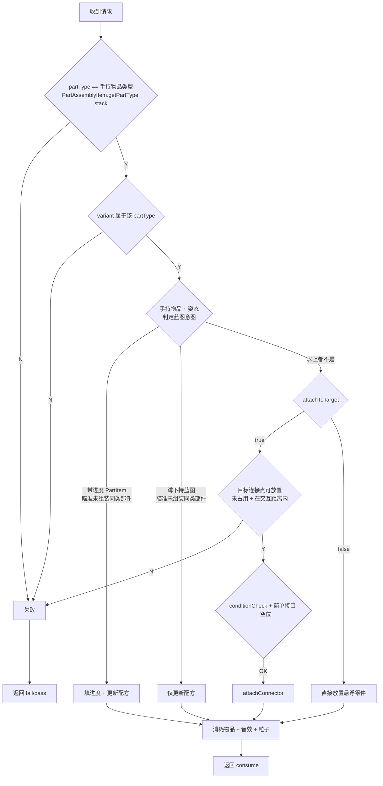

# 手动零件组装：客户端权威化重构计划

> 状态：**待审阅**
> 分支：1.21.1 · 模组：Machine-Max
> 相关模块：`common/attachment/VehicleAssemblyAttachment`、`common/item/prop/{PartItem,FabricatingBlueprintItem}`、`client/render/renderer/PartAssemblyRenderer`、`network/payload/assembly/*`

---

## 1. 背景与问题

当前手动零件组装（右键放置零件 / 装配到载具接口）把**装配状态**（部件 type、变体、连接点、旋转角度）放在**服务端权威**的 `VehicleAssemblyAttachment` 实体附件里，每次循环切换后由服务端通过 `PlayerPartAssemblyCacheSyncPayload` **全量回发**到客户端用于渲染预览。

这条链路存在以下问题：

1. **预览与放置变换来源不同**：预览用 [PartItem.inventoryTick L139-147](file:///d:/Files/Project_MinecraftMods/Machine-Max/src/main/java/io/github/sweetzonzi/machine_max/common/item/prop/PartItem.java#L139-L147) 的 `targetConnector.mergeTransform(...)`，依赖服务端回发的 `offset/quaternion`；放置却用 [assembly L274](file:///d:/Files/Project_MinecraftMods/Machine-Max/src/main/java/io/github/sweetzonzi/machine_max/common/attachment/VehicleAssemblyAttachment.java#L274) 的 `part.externalConnectors.get(connectorName)` + `attachRotation`。两条路径只要一处漂移即导致**方向不符**。
2. **服务端权威带来往返延迟**：预览始终落后服务端一拍，快速切换时出现时序错乱。
3. **每 tick 状态竞争**：[onTick L97-108](file:///d:/Files/Project_MinecraftMods/Machine-Max/src/main/java/io/github/sweetzonzi/machine_max/common/attachment/VehicleAssemblyAttachment.java#L97-L108) 每 tick 根据视线自动 `cycleVariants`，会与用户手动切换互相覆盖。
4. **状态冗余**：`VehicleAssemblyAttachment` 同时存 `offset`、`quaternion`、`attachRotation`，而放置只需 `attachRotation`。

## 2. 目标与约束

**目标**：把"装配预览 + 装配选择状态"下沉到**客户端本地**（所见即所得、零往返延迟），服务端只在**放置时收包并做权威校验**。

**约束 / 已确认的设计决策**：
- ✅ **自动过滤功能必须保留**：自动循环切换成符合条件的变体 / 连接点（玩家对准接口时自动挑可用组合）。
- ✅ 双端**零件定义严格同步**（连接点、模型结构一致），因此**不需要**对"零件定义的几何结构 / locator 变换一致性"做深校验。
- ✅ 客户端请求**携带目标连接点**；服务端只做**轻量校验**（`partType` 与手持物品一致、目标连接点未被占用、位于交互距离内），**不做射线复核**；不满足则失败。
- ✅ `attachToTarget` 用于区分**安装到现有部件的连接点**（`true`）与**凭空新放置悬浮零件**（`false`）；瞄准的 subpart 没有可用连接点时为 `false`。
- ✅ **请求载荷不携带放置意图字段**：蓝图意图（填进度 / 仅改配方）由服务端按**手持物品 + 姿态 + 视线目标**判定。
- ✅ 客户端状态用**普通单例类**（非 attachment），服务端**不再持有装配状态**。
- ✅ **蓝图填进度能力**，拆为两条服务端分支：
  - 手持**带进度的 `PartItem`** 且瞄准同类型未组装部件 → **填进度 + 更新配方**；
  - **蹲下持 `FabricatingBlueprintItem`** 且瞄准同类型未组装部件 → **仅更新配方**（不消耗物品）。
- ✅ 只需要一个**玩家可自定义的安装角度 `attachRotation`**，不再需要 `offset`/`quaternion` 网络传递（预览姿态由客户端本地从模型 locator 重算）。
- ✅ **`ENTITY_EYESIGHT` 保留不动**（其他系统仍依赖）；但**放置校验不再依赖它**，仅按目标连接点的占用与交互距离判定。

## 3. 架构方案

### 3.1 客户端：装配选择状态单例 `VehicleAssemblyHelper`

- **位置**：`io.github.sweetzonzi.machine_max.common.mech.vehicle`，单例类 `VehicleAssemblyHelper`（靠近其服务的 `Part`/`VariantAttr` 域）。
- **彻底移除**服务端侧的 `VehicleAssemblyAttachment` 附件（`VEHICLE_ASSEMBLY`）。客户端状态由该单例承载，风格对齐已有的 `VisualEffectHelper` 全局静态缓存。
- 原因：客户端只有 local player 参与预览，一份就够；服务端不再持有装配状态，避免两端各初始化一份废对象；无需 `hasData/setData` + 每 tick 事件。
- 生命周期：由 `ClientTickEvent.Pre` 中的状态演化负责清理（手持非装配物品、换维度/断线重连/死亡时重置），**不依赖渲染器**。

`VehicleAssemblyHelper` 字段：

| 字段 | 类型 | 说明 |
|------|------|------|
| `partType` | `PartType` | 手持物品解析出的部件类型 |
| `variantName` | `@Nullable String` | 当前选中的变体 |
| `connectorName` | `@Nullable Pair<String,String>` | 当前选中的**部件对外连接点**（子部件名 + 连接点名） |
| `hand` | `InteractionHand` | 当前 `partType` 解析来源的手（主/副手）。随请求一并上报，避免服务端主/副手判定错位 |
| `attachRotation` | `float` | **安装角**（玩家可自定义，服务端仅归一化到 `[0,360)`，**不限制 90° 倍数**，为任意角度安装预留）。两种用法：安装到连接点时绕连接点装配法线旋转；凭空放置时等价于 `rotateY(attachRotation - entity.getYRot())` |

> 说明：`offset/quaternion` 不再作为持久状态，但预览仍需要它们。`VehicleAssemblyHelper` 需提供**本地重算方法**（等价于现 `VehicleAssemblyAttachment.reCalculateOffset()`，从 `OModel` / `VariantAttr.getSubParts().get(...).getLocatorTransforms()` 推导），供渲染端 `calculateExtraTransform(..., offset, quaternion, attachRotation)` 使用。

方法（保留自动过滤，拆成"判定"与"演化"）：

- **判定（公共纯逻辑，两端复用）** → 静态/实例方法：
  - `boolean connectorMatches(AbstractConnector target, PartType type, String variant)` —— 目标接口是否接受该变体（`conditionCheck`）。
  - `boolean partConnectorMatches(ConnectorAttr attr, AbstractConnector target, PartType type, String variant)` —— 部件对外连接点是否与目标接口可配对（简单接口 + 条件）。
- **演化（客户端本地）** → `cycleVariant()` / `cycleConnector()` / `cycleAttachAngle(boolean add)`，内部用上述判定**自动替换**掉不符合的变体/连接点。
- **`cycleRecipe()` 不在客户端**：它改的是共享世界状态 `Part.customRecipe` 并需广播全维度，仍走"客户端发包 → 服务端处理"（见 §5）。
- 触发：按键（客户端本地直接演化）+ 每 tick 状态演化（原 `VehicleAssemblyAttachment.onTick` 的客户端部分搬到本地）。
- **tick 宿主不在渲染器**：`PartAssemblyRenderer` 只消费状态，不承载组装逻辑。状态演化挂在 `ClientTickEvent.Pre`（`VehicleAssemblyHelper` 内静态订阅，`@EventBusSubscriber(value = Dist.CLIENT)` 门控），负责：解析手持物品 → `partType`/`hand`、清空非装配物品时的状态、视线对准目标接口时的自动过滤。

### 3.2 网络：`PartAssemblyRequestPayload`（客户端 → 服务端）

新增一个客户端 → 服务端载荷（客户端发送 → 服务端处理），字段：

| 字段 | 类型 | 说明 |
|------|------|------|
| `registryKey` | `ResourceLocation` | 部件类型 key |
| `variant` | `String` | 变体名 |
| `subPart` / `connector` | `String` / `String` | **部件对外连接点**（`partConnectorName`）的两个分量 |
| `hand` | `InteractionHand` | 使用的手；服务端据此取对应 `ItemStack`，避免主/副手判定错位 |
| `attachToTarget` | `boolean` | 是否**安装到现有部件的连接点**（`false` = 凭空新放置悬浮零件） |
| `targetSubPartId` | `int` | 目标连接点所在 `SubPart` 的持久 id（`DestroyableObject.getId()`），仅 `attachToTarget` 时有意义 |
| `targetConnector` | `String` | 目标连接点名称，仅 `attachToTarget` 时有意义 |
| `attachRotation` | `float` | **安装角** |

- **请求不携带放置意图字段**：蓝图意图由服务端按手持物品 + 姿态 + 视线目标判定（见 §3.3 / §3.4）。
- **目标连接点的网络标识**：`(targetSubPartId, targetConnector)` —— 与现有 [ConnectorSyncPayload](file:///d:/Files/Project_MinecraftMods/Machine-Max/src/main/java/io/github/sweetzonzi/machine_max/network/payload/ConnectorSyncPayload.java#L19) 相同的引用方式（`SubPart extends DestroyableObject` 有持久 `getId()`；客户端眼睛命中的物理体 owner 即客户端侧 `SubPart`，可直接取 id）。服务端据此定位接口，仅做**占用 + 交互距离**校验（不做射线复核）。
- 注册到 `MMPayloadRegistry` 的 **`input:1.0.0`** 协议组（本质是玩家输入动作；`sync` 组目前只有 `playToClient` + 一个 `commonToServer`，语义不符），使用 `MainThreadPayloadHandler`（遵守网络 AGENTS.md：全部处理器在主线程）。
- **不携带 `offset`/`quaternion`**。

### 3.3 服务端：`assembly` 改为接收"放置请求"

把 `assembly(Level, LivingEntity, ItemStack, Part)` 重构为接收请求：

```java
public InteractionResultHolder<ItemStack> assembly(Level level, LivingEntity entity, ItemStack stack,
                                                   PartAssemblyRequestPayload request)
```

服务端处理流程（复用现 `assembly` / `attachConnector` 逻辑，替换状态来源；**蓝图判定优先于 attach/place**）：



> **零件构造与进度还原也随 `assembly` 迁入服务端处理器**：服务端按 `request.hand` 取 `ItemStack`，用 `request.registryKey` + `request.variant` 构造 `Part`，并**必须**复刻现 [PartItem.use L74-79](file:///d:/Files/Project_MinecraftMods/Machine-Max/src/main/java/io/github/sweetzonzi/machine_max/common/item/prop/PartItem.java#L74-L79) 的两步 —— `part.customRecipe = stack.get(RECIPE_TYPE)` 与 `restoreAssemblyStateFromDamage(stack, part)`（从物品耐久组件反推材料/装配进度）。缺此两步"带进度 PartItem 填进度"将永远填 0。
>
> **副作用随 `assembly` 一并迁入服务端处理器**：成功路径需在处理器内完成与现 `PartItem.use()` 等价的处理 —— `PartItem` 消耗 1 个物品并播放 `item.part.placed` 音效（现 [PartItem.java L80-L85](file:///d:/Files/Project_MinecraftMods/Machine-Max/src/main/java/io/github/sweetzonzi/machine_max/common/item/prop/PartItem.java#L80-L85)），放置/填进度时发送 `ParticleTypes.PORTAL` 粒子（现 `assembly` 内部）。`FabricatingBlueprintItem` 路径不消耗物品。

### 3.4 服务端校验清单（聚焦，不做深几何校验）

- **`partType == 手持物品类型`**：防作弊换物品（`PartAssemblyItem.getPartType(stack, level)`；`stack` 取 `request.hand` 对应手）。
- **`variant` 属于该 `partType`**：保证变体合法。
- **`subPart/connector`（部件对外连接点）属于该变体的对外连接点**：`VariantAttr.getPartOutwardConnectors().containsKey(...)`。
- **蓝图意图（优先判定，不依赖请求字段）**：以服务端自身 `eyesight.getSubPart()` 为蓝图目标，按手持物品 + 姿态分流（此路径沿用现有视线判定，**不随决策 8 放宽**）：
  - 手持带进度的 `PartItem` 且目标未组装（`assemblingProgress==0 && materialProgress==0`）、类型/变体一致 → 填进度 + 更新配方；
  - 蹲下持 `FabricatingBlueprintItem` 且目标未组装、配方不同 → 仅更新配方。
- **目标连接点**（仅 `attachToTarget == true`），**轻量校验、不做射线复核**：
  - `getDestroyableObject(targetSubPartId)` 解析成功且 `connectors.get(targetConnector)` 存在、**未占用**（`!hasPart()`）；
  - **位于交互距离内**：目标连接点位置到玩家眼睛的距离 ≤ `ENTITY_INTERACTION_RANGE`；
  - `conditionCheck(partType, variant)` + 简单接口配对判定（沿用现有逻辑）。
- **`attachRotation` 合法**：仅做 `Math.floorMod(attachRotation, 360)` 归一化（容忍负值），**不限制为 90° 倍数**（为将来支持任意角度安装预留）。
- **`attachToTarget == false`** → 直接放置分支：位置用服务端 `level.clip` 在交互范围内计算；**只做占用复核**（落点/待放置包围盒不与已有刚体重叠），**不做射线复核**。

> 说明：**不**校验 locator / 模型几何变换一致性（双端零件定义严格同步）。服务端放置姿态直接由 `part.externalConnectors.get(partConnectorName)` + `attachRotation` 计算，与客户端预览按同一模型数据推导，天然一致。

## 4. 网络协议变更

| 变更 | 说明 |
|------|------|
| 新增 `PartAssemblyRequestPayload` | 客户端 → 服务端，携带上文字段 |
| 注册协议组 | `PartAssemblyRequestPayload` 注册到 `input:1.0.0`（玩家输入动作） |
| 废弃 `PlayerPartAssemblyCacheSyncPayload` | 不再需要服务端全量回发装配状态 |
| `RegularInputPayload.CYCLE_PART_RECIPES` 仍由服务端处理 | `cycleRecipe` 改的是共享世界状态（`Part.customRecipe`）并广播全维度，因此保持客户端发包 → 服务端处理 |

## 5. 涉及文件清单

| 文件 | 动作 |
|------|------|
| `common/mech/vehicle/VehicleAssemblyHelper.java`（新建） | 客户端装配选择状态单例 + 自动过滤判定/演化 + 本地 `offset/quaternion` 重算；含 `PartAssemblyRequestPayload` 构造辅助；**含 `ClientTickEvent.Pre` 静态订阅（`Dist.CLIENT` 门控）负责每 tick 状态演化与清理** |
| `common/item/prop/PartItem.java` | `use` 改用请求包（客户端发包、服务端由处理器处理）；`inventoryTick` 预览改读 `VehicleAssemblyHelper`（去掉对 `VEHICLE_ASSEMBLY` 的依赖）；`restoreAssemblyStateFromDamage` 迁往服务端处理器/共享工具 |
| `common/item/prop/FabricatingBlueprintItem.java` | 同上；蓝图/填进度分支走请求（服务端判定意图）；**L131-135 的 `RegularInputPayload(CYCLE_PART_VARIANTS)` 改为本地 `VehicleAssemblyHelper.cycleVariants()`** |
| `common/attachment/VehicleAssemblyAttachment.java` | **移除**；其 `assembly` / `cycleRecipe` 逻辑迁往服务端处理器/新工具类 |
| `common/registry/MMAttachments.kt` | **移除 `VEHICLE_ASSEMBLY`**（保留 `ENTITY_EYESIGHT`） |
| `network/payload/RegularInputPayload.java` | 移除 `ADD/SUB_PART_ATTACH_ANGLE`、`CYCLE_PART_CONNECTORS`、`CYCLE_PART_VARIANTS` 四个分支（改由客户端本地演化）；`CYCLE_PART_RECIPES` 分支仍由服务端处理 |
| `client/input/RawInputHandler.java` | 上述四个键位改为直接调用 `VehicleAssemblyHelper.cycle*()`（不再发包）；**滚轮分支 L275-288 的 `ADD/SUB_PART_ATTACH_ANGLE` 发包同样改为本地调用**；`CYCLE_PART_RECIPES` 仍发 `RegularInputPayload` |
| `util/data/KeyInputMapping.java` | 四个枚举值（`ADD/SUB_PART_ATTACH_ANGLE`、`CYCLE_PART_CONNECTORS`、`CYCLE_PART_VARIANTS`）在分支删除后失去用途：保留（低风险）或一并清理，实施时明确 |
| `network/payload/assembly/PlayerPartAssemblyCacheSyncPayload.java` | **移除** |
| `network/payload/assembly/PartAssemblyRequestPayload.java`（新建） | 新请求载荷 |
| `network/MMPayloadRegistry.java` | 注册新载荷；移除旧同步载荷注册 |
| `client/render/renderer/PartAssemblyRenderer.java` | 改读 `VehicleAssemblyHelper`（去掉 `player.getData(VEHICLE_ASSEMBLY)`）；**仅消费状态构建/清理 `VisualEffectHelper.partToPlace`，不承载组装逻辑** |

> `MMAttachments.kt` 另见 §7。

## 6. 风险与权衡

- **自动过滤迁移客户端**：`cycle*` 原本依赖服务端每 tick 状态，现改为客户端本地演化。演化宿主为 `ClientTickEvent.Pre`（非渲染器，逻辑与渲染解耦），需确保"对准接口自动换变体/连接点"在客户端同样触发（用本地 `eyesight`），否则体验回退。
- **客户端可信度**：虽聚焦校验，`attachRotation`、`variant`、`attachToTarget` 仍是客户端输入，需范围/存在性校验，防恶意发包；**蓝图意图不信任客户端**，由服务端自行判定。
- **手部一致性**：`use()` 的 `usedHand` 可能为副手，请求需携带 `hand`，服务端据此取 `ItemStack`，避免主/副手判定错位。
- **放置点占用 / 距离校验**：服务端不做射线复核，只校验目标连接点未被占用且在交互距离内。放置瞬间若该接口刚被其他玩家占用、或玩家已远离，则失败，需给出反馈。
- **客户端误报 `attachToTarget == false`**：若客户端在已有可用接口时误报 `false`，服务端会走悬浮放置分支；该分支只做**占用复核**（落点不与已有刚体重叠），不做射线复核，属可接受的信任边界。
- **`cycleRecipe` 由服务端处理**：它改的是共享世界状态 `Part.customRecipe` 并广播 `PartChangeRecipePayload`，需保持客户端发包 → 服务端处理。
- **蓝图填进度的双端一致**：填进度/改配方同样受"视线看中蓝图部件"约束，服务端以自身 `eyesight.getSubPart()` 复核。

## 7. 设计决策

1. `VEHICLE_ASSEMBLY` 附件彻底移除，装配选择状态由客户端 `VehicleAssemblyHelper` 承载（见 §3.1）。
2. 蓝图填进度能力：手持带进度的 `PartItem` → 填进度 + 更新配方；蹲下持 `FabricatingBlueprintItem` → 仅更新配方（见 §3.4）。
3. `VehicleAssemblyHelper` 落位 `common/mech/vehicle/VehicleAssemblyHelper.java`。
4. 放置失败反馈（接口被占用 / 超出交互距离）本阶段仅给消息提示，专用 HUD 不做，记为后续工作。
5. 请求载荷不携带放置意图字段：蓝图意图由服务端按手持物品 + 姿态 + 视线目标判定（见 §3.2 / §3.4）。
6. `cycleRecipe` 由服务端处理：它改的是共享世界状态并广播，不走客户端本地演化（见 §3.1 / §5）。
7. 物品消耗 / 音效 / 粒子随 `assembly` 一并迁入服务端处理器（见 §3.3）。
8. 服务端校验保持**轻量**：`partType` 与手持物品一致 + 目标连接点未占用 + 位于交互距离内，**不做射线复核**（见 §3.4）。
9. `attachToTarget == false` 的悬浮放置分支只做**占用复核**，不做射线复核（见 §3.4）。
10. 客户端每 tick 状态演化挂在 `ClientTickEvent.Pre`（`Dist.CLIENT` 门控），**不放在渲染器**（见 §3.1）。
11. `PartAssemblyRequestPayload` 注册到 `input:1.0.0` 协议组（见 §3.2）。
12. `attachRotation` 服务端**不校验 90° 倍数**，仅归一化到 `[0,360)`；为将来支持任意角度安装预留（见 §3.4）。

### 后续工作（不在本阶段）

- **装配 HUD**：显示可用连接点及其名称、类型等，替代/增强现有 `PartItem.inventoryTick` 的消息逻辑。属独立 UI 任务，待本重构落地后另行规划。

## 8. 验收标准

- 客户端预览与放置结果方向一致（持同一物品、同一变体、同一连接点、同一安装角度）。
- 右键装到对准的接口：预览为绿色可放置时，放置后落在该接口，位置方向正确，且消耗 1 个零件并播放音效。
- 放置瞬间目标接口已被占用、或玩家已超出交互距离 → 放置失败且给出反馈，不落错位；仅视线移开但接口仍空置且在距离内 → 允许放置到该接口。
- `attachToTarget == false`（无可用连接点）→ 直接放置悬浮零件，方向随 `attachRotation`。
- 手持带进度的 `PartItem` 右键未组装同类部件 → 填进度 + 更新配方；蹲下持 `FabricatingBlueprintItem` 右键 → 仅更新配方且不消耗物品。
- 切换配方后其他玩家可见（走 `PartChangeRecipePayload` 广播），退出重进不回滚。
- 副手使用零件时同样能正确放置 / 填进度（`hand` 字段生效）。
- 服务端可拒绝伪造 `partType`（换成非手持物品类型）的请求。
- 移除 `VEHICLE_ASSEMBLY` 后，`ENTITY_EYESIGHT` 仍正常工作。
