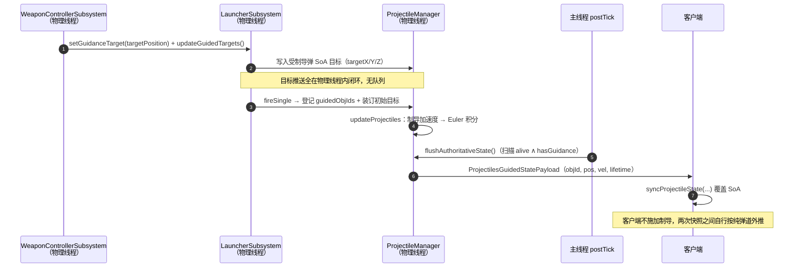

# Machine-Max 武器系统 — 制导组件（Guidance）· 实现备忘

> 定位：本文件是**实现备忘**，不是设计文档。字段语义、组件划分、默认行为一律以既有设计文档为准，本文只引用、不复制；凡本文只给结论的地方，都能在下列文档中找到出处。
>
> 上游设计（下称简称）：
>
> - 《武器系统-组件化投射物与类型体系设计.md》——**投射物设计**：类型体系 §二、`BallisticProjectileType` §三、行为组件 §四（`SeekerAttr` §4.1、`GuidanceAttr` §4.2、组件运行时 §4.5、默认行为 §4.6）、管理器对应 §六、文件布局 §八、示例 §9.1、路线 §十 阶段 I
> - 《武器系统-碰炸引信与爆炸战斗部实现备忘.md》——**上一阶段备忘**：本阶段的直接前置，其 `warheads` 的字段/注册/主线程冲刷形态是本阶段的模板
> - 《武器系统-爆炸系统接口设计.md》——**爆炸接口**：本阶段仅复用其既有起爆路径，不做改动
>
> 相关现行实现：`docs/wiki/4-物理与战斗机制/4.7-投射物.md`。

---

## 一、本阶段目标

一发带 `guidance` 的飞行弹丸出膛后，由发射方的**武器控制器持续提供目标点**，弹上按**纯追踪律**解算指令法向加速度，经**结构过载 / 气动过载 / 转率**三重限幅后扭转速度矢量，直至命中、丢失目标或寿命耗尽。

首期是"无线电指令制导 / 坐标制导"的最小闭环：**导引头退化为"目标点由载具提供"**，制导律退化为"朝目标点转"，其余（锁定、视场、抗干扰、比例导引）全部不做。

---

## 二、范围

### 2.1 范围内

1. **`guidance` 可选字段**（`BallisticProjectileType`）：缺省 = 无制导。现有内容包 JSON **零改动**。
2. **`GuidanceLaw` 自描述接口 + `GUIDANCE_LAW_CODEC` 注册表**：首期唯一实现 `machine_max:pure_pursuit`。
3. **可用过载包线**：结构上限 + 气动上限（随速度平方变化，含高度衰减），以及诱导阻力与转率钳制（见 §七，**此为本备忘新增，设计文档 §4.2 未覆盖**）。
4. **目标来源**：复用 `WeaponControllerSubsystem.targetPosition`（即瞄准点），由武器控制器每物理步推送给在飞制导弹。
5. **制导弹的服务端权威同步**：新增位姿快照包；客户端**不对制导弹施加制导**。
6. **制导弹的区块预加载降级**。

### 2.2 范围外（本阶段不做）

| 项 | 设计出处 | 说明 |
| --- | --- | --- |
| `SeekerAttr`（导引头 JSON） | 投射物设计 §4.1 | 首期目标点恒由武器控制器提供，等价于 `COMMAND` 导引头的最小形态；无 FOV / 锁定距离 / 跟踪角速率 / 抗诱饵需求，故不落 JSON 字段 |
| PN / APN / 前置追逐 | 投射物设计 §4.2 | 首期只有纯追踪一条律 |
| 发射时锁定 / 发射后数据链 的区分 | 投射物设计 §4.2 | 首期统一为"持续推送瞄准点" |
| 真实锁定、视场门限、目标丢失/重捕、诱饵 | 投射物设计 §4.1 | — |
| 激光半主动 / 红外 / 雷达等物理导引头 | 投射物设计 §4.1 | — |
| Owner 归属（`BallisticProjectile` 加 owner 字段） | 投射物设计 §十 阶段 H | 首期用 objId 列表建立"发射器 → 制导弹"关联，不引入 owner |
| 滚动重算的区块预加载 | 本文 §十一 | 首期用直线降级 |
| 制导弹的 HUD / 遥测 / 剩余过载显示 | — | — |
| 多段点火 / 推力曲线 | — | 首期推进只有单段恒推力（`external.thrust`：`force` + `duration` + `ignition_delay`），无推力曲线、无多次点火 |

---

## 三、本阶段决策

| 决策 | 内容 |
| --- | --- |
| 挂载 | 走设计路径：`guidance` 挂在 `BallisticProjectileType` 上，与 `warheads` 同级、可选、缺省 `null` |
| 律的形态 | **自描述接口 + 注册表**（与上一阶段 `WorldEffect` 同构），而非设计文档 §4.2 的 `record + enum`；理由：各律自由参数不同（纯追踪要 `turn_gain`，PN 要导航增益 `N`），枚举无法承载 |
| 限幅模型的归属 | 限幅与律**解耦**：`limits` 是跨律共享的整块配置，与律的算法参数同级、随律一起序列化；律只负责出"无约束指令"，限幅由 `GuidanceLaw.computeAcceleration` 默认方法统一施加 |
| 目标语义 | 目标是一个**世界坐标点**（不是实体）；可能每物理步移动；首期所有由同一发射器打出的制导弹共享同一瞄准点 |
| 目标装订 | 发射时用"上一次推送到的瞄准点"装订初值；此后由武器控制器**每物理步覆盖** |
| 客户端一致 | **服务端权威**：客户端不对制导弹施加制导；服务端每 tick 同步位姿/速度/寿命，客户端在两次快照之间按纯弹道插值推进（见 §十） |
| 制导失效 | 无目标（NaN）、速度过小、已对准 → 本步不给指令，交回弹道（与投射物设计 §4.6"无 seeker → 纯弹道"一致） |
| 线程 | 制导的读目标、算指令、写 SoA **全部在物理线程内闭环**，不引入跨线程队列（依据见 §九、§十） |

---

## 四、命名

- 律接口：**`GuidanceLaw`**；首期实现：**`PurePursuitGuidance`**（注册名 `machine_max:pure_pursuit`）。
- 限幅参数：**`AuthorityLimits`**——律的一个字段（缺省 `AuthorityLimits.DEFAULT`）。`guidance` 整块即 `GuidanceLaw` 的 dispatch 结果，不存在 `GuidanceAttr` 之类的包装类型，JSON 中也无 `law` 这一层。
- 每步计算上下文：**`GuidanceContext`**。
- 字段名：**`guidance`**；注册表：**`GUIDANCE_LAW_CODEC`**。
- 同步包：**`ProjectilesGuidedStatePayload`**。

---

## 五、文件与类布局

### 5.1 新增

```
common/mech/projectile/component/guidance/GuidanceLaw.java          ← 接口（含限幅解算默认方法）+ 聚合 CODEC
common/mech/projectile/component/guidance/AuthorityLimits.java      ← 三重限幅参数（record）
common/mech/projectile/component/guidance/GuidanceContext.java      ← 展平上下文
common/mech/projectile/component/guidance/PurePursuitGuidance.java  ← 首期唯一实现（turn_gain + limits）
network/payload/projectile/ProjectilesGuidedStatePayload.java       ← 服务端→客户端位姿快照
```

### 5.2 改造

- **`BallisticProjectileType`**：CODEC 增加 `guidance`（可选，缺省 `null`）；当前字段计数 11，仍远低于 16 上限。新增 `@Nullable GuidanceLaw getGuidance()` 与 `boolean hasGuidance()`。
- **`ExternalProperties`**：新增可选 `thrust` 子对象（`ThrustProperties`：`force` / `duration` / `ignition_delay`，缺省 `NONE` = 无推力）。`BallisticProjectileType` 加委托 `getThrust()` / `hasThrust()`。推力沿**速度矢量**施加（弹轴 ≈ 速度的近似），只增速率、不改方向。
- **`MMDataRegistries.kt`**：增 `GUIDANCE_LAW_CODEC` 注册表（与 `WORLD_EFFECT_CODEC` 逐字同构）。
- **`MMCodecs.kt`** 的 `reg()`：增一行 `event.register(MMDataRegistries.GUIDANCE_LAW_CODEC.key(), id("pure_pursuit")) { PurePursuitGuidance.CODEC }`，紧挨现有 `blast` 那一行。
- **`ProjectileManager`**：
  - SoA 增 `targetX / targetY / targetZ` 三个 `float[]`（见 §八）。
  - SoA 另增 `burnTime`（`float[]`，已飞行秒数，推进计时）；**不能复用 `lifetime`**——服务端 20Hz 减 1、客户端外推 100Hz 减 1，两端速率不一致，`burnTime` 两端都按 0.01s 步长累加才对齐。
  - `updateProjectiles` 在 Euler 积分前插入制导加速度项与推进段项。
  - `clientExtrapolate`（客户端独立的一套积分）同样插入推进段项，**燃烧窗口与服务端完全一致**，否则服务端加速、客户端不加速会导致渲染脱节。
  - `preloadTrajectoryTerrain` 对制导弹走直线降级（见 §十一）。
  - `postTick()` 增 `flushAuthoritativeState()`：广播集合 = 制导弹。
  - 复用既有 `syncProjectileState(objId, pos, vel, life)`（语义完全吻合）作为客户端落地入口。
- **`WeaponControllerSubsystem`**：`onPrePhysicsTick()` 在瞄准/开火之后，向受控发射器推送目标（见 §九）。
- **`LauncherSubsystem`**：维护本发射器打出的制导弹 objId 列表；`fireSingle` 内登记新弹并装订初始目标。
- `ProjectileModule.kt` 加载入口不变；`BallisticProjectile.getProjectileType()` 已能取到 `guidance`，无需另加访问路径。

### 5.3 调用方处理规则

- 新增字段可选且缺省 `null`，**所有现有调用方无需改动**。
- `ProjectilesSpawnPayload` 不改：制导弹的位姿由新的快照包持续覆盖，生成包仍只负责"创建 + 初速"。
- `ProjectilesHitPayload` 不改：命中/销毁语义与现有完全一致。

---

## 六、JSON 形状

```json
{
  "type": "ballistic",
  "tags": ["missile", "command_guided"],
  "max_lifetime": 25.0,
  "bullet_num": 1,

  "external": {
    "...": "不变",
    "thrust": { "force": 2600.0, "duration": 3.0, "ignition_delay": 0.3 }
  },
  "terminal": { "...": "不变" },

  "guidance": {
    "type": "machine_max:pure_pursuit",
    "turn_gain": 3.0,
    "limits": {
      "structural_limit_g": 30.0,
      "lift_coefficient_max": 1.5,
      "reference_area": 0.5,
      "induced_drag_coefficient": 0.10,
      "max_turn_rate_dps": 600.0
    }
  },

  "warheads": [ { "type": "machine_max:blast", "...": "不变" } ],
  "visual": { "...": "不变" },
  "sounds": { "...": "不变" }
}
```

- `guidance` 整块可选；缺省 → 纯弹道。
- `guidance` 的形状与 `warheads` 元素一致：`type` 直接与律的自由参数、`limits` 平级，由 `type` 分派到对应律的 Codec，无 `law` 这一层嵌套。
- `limits` 整块可选；缺省取 §7.6 的默认值。
- `guidance.type` 必填——没有律就没有制导；未注册的名字由 `CODEC` 分派抛错，由内容包加载器记录为加载错误（与 `ProjectileType.CODEC` 的未知 `type` 同一处理路径）。
- `external.thrust` 整块可选；缺省 = 无推力（纯弹道），现有内容包零改动。燃烧窗口为 `[ignition_delay, ignition_delay + duration)`，段内加速度 `F / m` 沿速度方向。投射物只有一套半隐式 Euler 积分运动模型，全部弹种都走这条积分，因此推力项对全部弹种生效。

---

## 七、制导物理（本备忘新增）

> 设计文档 §4.2 只给了 `max_lateral_acceleration` 一个常量上限。本阶段把它替换为**随速度与高度变化的可用过载包线**，并补上诱导阻力闭环。

### 7.1 符号

| 符号 | 含义 | 来源 |
| --- | --- | --- |
| `p`, `v` | 位置（m）、速度（m/s），`v̂ = v/|v|` | SoA |
| `T` | 目标点（世界坐标） | SoA 目标数组 |
| `r = T − p`, `r̂ = r/|r|` | 视线矢量 / 单位视线 | 本步计算 |
| `θ = acos(clamp(v̂·r̂, −1, 1))` | 航向误差（rad） | 本步计算 |
| `n̂ = normalize(v̂ × r̂)` | 转弯轴（指向应转向一侧） | 本步计算 |
| `ρ(h)` | 归一化空气密度，海平面（y=62）为 1.0 | `ProjectileManager.createDensityFunction()` |
| `m`, `S` | 质量（kg）、参考面积（m²） | `external.mass`、`limits.reference_area` |
| `g0` | 9.81 m/s² | 常量 |

### 7.2 纯追踪指令

```
ω_cmd = turn_gain · θ                     // 一阶航向控制，单位 1/s
a_cmd = (n̂ · ω_cmd) × v                   // 幅值 |a_cmd| = ω_cmd · |v|，方向垂直于 v
```

即"把速度矢量朝视线方向转"，增益越大越贴视线。

### 7.3 三重限幅

```
n_struct  = limits.structural_limit_g
n_aero(v) = ½·ρ(h)·v²·Cl_max·S / (m·g0)           // 气动可用过载，∝ v²
n_avail   = min(n_struct, n_aero(v))
a_avail   = n_avail · g0

|ω| := min( |ω_cmd| , a_avail / |v| , ω_max )      // ω_max = max_turn_rate_dps · π/180
a_cmd := 该 ω 对应的加速度（幅值 = |ω|·|v|）
```

- 两条过载上限取小：**低速段由气动主导**（`n_aero → 0`），高速段由结构主导。
- 两线交点即**角点速度**——以最少速度换最大过载的点，是配平的强指标。
- `a_avail / |v|` 与 `ω_max` 必须**同时**取小：前者是过载包线，后者是低速数值守卫（见 §7.5）。
- `ρ(h)` 高空衰减 → 高空机动性天然变差，无需额外机制。

### 7.4 诱导阻力（能量陷阱）

```
n     = |a_cmd| / g0                              // 限幅后的实际过载
Cl    = n · m · g0 / (½·ρ·v²·S)                   // 达到该过载所需的升力系数
Cd_i  = k · Cl²                                   // k = limits.induced_drag_coefficient，0 = 关闭
a_ind = Cd_i · ½·ρ·v²·S / m                       // 方向沿 −v̂
```

含义：拉满过载 → `Cl` 升高 → 诱导阻力增大 → 掉速 → `n_aero(v)` 进一步下降，形成"越拉越拉不动"的正反馈。这正是 §7.3 那条包线的动力学闭环，必须与包线一起做才有意义。

### 7.5 积分顺序与数值守卫

在 `ProjectileManager.updateProjectiles` 的 Euler 积分**之前**插入：

```
1. type = typeCache[typeIndex[i]]
2. if type.hasGuidance() 且目标有效（targetX[i] 非 NaN）:
     a_guide = 按 §7.2–§7.4 算出的合加速度（含 a_ind 的 −v̂ 分量）
   否则 a_guide = 0
3. 现有重力 + 阻力积分（不改）
4. 位置积分（不改）
```

制导只是**追加一个加速度项**，不改变既有积分结构。

守卫：

- `|v| < 1 m/s` → 本步不给指令（`a/v` 发散）。
- `|v̂ × r̂| < ε`（已对准或完全反向）→ 本步不给指令。
- `|r| < ε` → 视为到达，不给指令。
- `max_turn_rate_dps` 缺省 600（100 Hz 下 ≈ 6°/步）。

### 7.6 默认参数

| 字段 | 默认 | 说明 |
| --- | --- | --- |
| `structural_limit_g` | `30.0` | 弹体/挂架结构上限 |
| `lift_coefficient_max` | `1.5` | 最大升力系数（含舵面） |
| `reference_area` | 弹体截面积 `π·r²` | 有翼/有舵弹需显式给定（通常远大于弹体截面） |
| `induced_drag_coefficient` | `0.10` | `k`，`0` = 关闭诱导阻力 |
| `max_turn_rate_dps` | `600.0` | 转率硬钳 |
| `turn_gain`（律内） | `3.0` | 单位 1/s |

### 7.7 施加方式

§7.2–§7.4 的解算结果只有一个施加点：**指令加速度作为独立加速度项并入 SoA 的半隐式 Euler 积分**（积分顺序见 §7.5），与重力、阻力、推力在同一趟里写完。

投射物的运动完全由这套 SoA 积分决定，没有 Bullet 动力学刚体、也没有姿态：速度矢量即弹道，因此不存在中心力提交、按速度刷新姿态或刚体位姿回写这类环节，权威快照也只需携带位置与速度（见 §10.3）。

---

## 八、运行时状态与 SoA 布局

### 8.1 新增数组

```java
public float[] targetX, targetY, targetZ;   // 目标点世界坐标；NaN = 无目标
```

- **不新增 `guided[]` 布尔数组**："是否制导"由 `typeCache[typeIndex[i]].hasGuidance()` 判定——`clientExtrapolate` 与 `updateProjectiles` 均已持有 `type` 引用，零额外成本。
- **不新增视线历史数组**：纯追踪不需要；将来 PN 需要 `λ̇` 时再加（见 §十四）。
- 目标数组**只在服务端有意义**；客户端不读（见 §十）。
- `NaN` 作为"无目标"哨兵，避免再加一个布尔数组。

### 8.2 必须同步维护的三处

> 违反任一处即 SoA 数据错位（参见 `common/mech/projectile/AGENTS.md` 反模式）。

| 位置 | 操作 |
| --- | --- |
| `addProjectileInternal` | 写入初始目标（无目标填 `Float.NaN`） |
| `swapRemove(index)` | 把 `last` 位置的三项搬到 `index` |
| `ensureCapacity(newCap)` | `Arrays.copyOf` 三项 |

---

## 九、目标来源与装订

### 9.1 目标点从哪来

现成基础设施已足够，**不需要新建瞄准/锁定系统**：

- `WeaponControllerSubsystem.targetPosition`（`volatile Vec3`）就是瞄准点，来源是 `ViewInputSignal.aimPoint`（`readInputSignals()`），而 `ViewInputSignal` 由客户端 `ViewInputPayload` 上行注入。
- `WeaponControllerSubsystem.onPrePhysicsTick()` 已经每物理步解析目标、驱动炮塔、并给发射器下发 `FireCommand`——**在同一方法内追加"向发射器推送制导目标"即可**。

### 9.2 发射器侧的关联与推送

`LauncherSubsystem` 新增：

```java
private final List<Integer> guidedObjIds;          // 本发射器打出的制导弹 objId
private volatile Vec3 pendingGuidanceTarget;       // 武器控制器每物理步写入
```

- `fireSingle(...)`：`type.fire(...)` 返回 `List<BallisticProjectile>` 后，按 `type.hasGuidance()` 过滤，把 `objId` 登记入 `guidedObjIds`，并把 `pendingGuidanceTarget` 作为**初始目标**写入 SoA（为 `null` 时填 `NaN`）。
- `updateGuidedTargets()`：剔除已死条目（`ProjectileManager.containsProjectile(objId)` 为假即移除），把当前目标写入每个存活制导弹的 SoA 目标。
- `WeaponControllerSubsystem.onPrePhysicsTick()` 尾部：对每个受控发射器 `setGuidanceTarget(targetPosition)` + `updateGuidedTargets()`。

### 9.3 线程与降级

- `WeaponController.onPrePhysicsTick` 与 `Launcher.onPrePhysicsTick` **同为物理线程回调** → 目标推送是对 SoA 的**物理线程写入**，无需队列、无需 volatile 以外的同步。
- 子系统 tick 顺序不保证：若 `Launcher` 先于 `WeaponController` 被 tick，新弹会在**下一物理步**才拿到目标，首步仅沿出膛方向飞——影响可忽略。
- **退化路径**：无武器控制器驱动（脚本、调试自动开火、直接 `FireCommand`）→ 目标为 `NaN` → 制导弹走纯弹道。符合投射物设计 §4.6"无 seeker → 纯弹道"。

---

## 十、线程与同步

### 10.1 方案选择

| 维度 | 同步目标位置（客户端复现制导） | **同步位姿速度（服务端权威）** |
| --- | --- | --- |
| 带宽 | 3 float/发 | 6 float + 1 int/发 |
| 客户端需知道 | 目标点 + 全部制导参数 + 每条律的算法 | 无 |
| 未来加 PN / 导引头 | 客户端必须逐条复现；PN 依赖视线历史、导引头依赖 FOV/能量门限 → **必然静默漂移** | 不影响 |
| 制导状态（丢锁、重捕） | 双端各持一份，易不一致 | 只在服务端 |
| 失败模式 | 双端逻辑不同 = 长期视觉漂移，难定位 | 快照覆盖，单调可验证 |
| 非制导弹种 | 不变 | 不变 |

**选后者**。制导弹数量是个位数量级（与 30mm 炮弹不是一个量级），带宽完全可接受；换来的是"律怎么改客户端都不用动"。

### 10.2 数据流



### 10.3 `ProjectilesGuidedStatePayload`

- 条目：`(int objId, double posX/Y/Z, double velX/Y/Z, int lifetime)`；不带姿态——投射物没有姿态参与解算（§7.7）。
- 发送：`ProjectileManager.postTick()` 中 `flushAuthoritativeState()`，位置在 `flushPendingDetonations()` 之后、`postTickAndSync()` 之前；`PacketDistributor.sendToPlayersInDimension`（与既有包一致；后续可收窄为附近玩家）。广播集合 = 制导弹。
- 接收：客户端 handler 调 `ProjectileManager.syncProjectileState(objId, pos, vel, life)`——该方法语义完全吻合，无需新建。
- `lifetime` 一并携带：客户端在两次快照之间自行外推并每 tick 多次递减寿命，需要服务端值兜底。

### 10.4 客户端行为

- `clientExtrapolate()` 对制导弹**不施加制导**（无需任何新增分支）；制导弹在客户端按纯弹道在两次快照之间推进，快照每 tick 覆盖 pos/vel/lifetime。
- 单步误差上界 = 一个物理步内的制导偏转 `½·a·dt²`（30 g、50 ms ≈ 0.4 m），下一快照即纠正，**不累积**；渲染平滑由 `DestroyableObject.getWorldPositionMatrix(partialTick)` 的 `oldTransform → transform` lerp 提供，无需新渲染代码。
- 网络延迟表现为"沿航迹约一步的落后"，对平滑转弯的目标不可见。

### 10.5 零回归

无制导的弹种不进入 `flushAuthoritativeState` 的广播集合，客户端行为不受影响。

---

## 十一、区块预加载降级

- 现状：`ProjectileManager.preloadTrajectoryTerrain` 用 `RealisticTrajectory.forwardSolve` 做纯弹道正解，按到达 tick 预约区块加载，保证射线能检测到地形刚体。
- 问题：制导弹会拐弯，正解轨迹 ≠ 实际航迹。
- **降级**：对 `type.hasGuidance()` 的投射物，改用"沿**出膛方向**直线推进 + Y 方向余量"的预测；预测步长、`yPadding` / `leadTicks` / `holdTicks` / 区块上限均不变，越界即停。出膛方向通常已大致指向瞄准点，早期飞行覆盖率足够。
- **后续**：滚动重算——每 N tick 用当前位速重做一次短程预测（见 §十四）。

---

## 十二、实现步骤

1. **律与配置类型**：新增 `GuidanceLaw`（含限幅解算默认方法）/ `AuthorityLimits` / `GuidanceContext` / `PurePursuitGuidance`；`MMDataRegistries.kt` 增 `GUIDANCE_LAW_CODEC`；`MMCodecs.kt` 增 `pure_pursuit` 注册行。
2. **字段接入**：`BallisticProjectileType` CODEC 增 `guidance`（可选，缺省 `null`），并加 `getGuidance()` / `hasGuidance()`。
3. **SoA 扩展**：`ProjectileManager` 增 `targetX/Y/Z`，并在 `addProjectileInternal` / `swapRemove` / `ensureCapacity` 三处同步维护。
4. **制导积分**：在 `updateProjectiles` 的 Euler 积分前插入 §7.5 的加速度项；`preloadTrajectoryTerrain` 加直线降级分支。
5. **目标推送**：`LauncherSubsystem` 加 `guidedObjIds` / `pendingGuidanceTarget` / `updateGuidedTargets()`，`fireSingle` 内登记并装订初值；`WeaponControllerSubsystem.onPrePhysicsTick()` 尾部推送。
6. **同步包**：新增 `ProjectilesGuidedStatePayload` 与客户端 handler；`ProjectileManager.postTick()` 增 `flushAuthoritativeState()`。
7. **内容包示例**：为一支导弹类弹药补 `guidance`（纯追踪 + 双限幅），并配 `warheads`。

---

## 十三、验证要点

- **向后兼容**：无制导的弹种不进入权威快照广播集合，客户端行为不受影响。
- **低速约束**：把初速调到角点速度以下，导弹明显拉不动杆、脱靶——确认气动上限生效。
- **结构上限**：高速段可用过载被截平在 `structural_limit_g`，不再随速度增长。
- **能量陷阱**：把 `induced_drag_coefficient` 调大，长时间满过载追踪后速度显著下降，进而更难转弯。
- **目标移动**：武器控制器持续改瞄准点，在飞导弹跟随修正。
- **制导失效**：无武器控制器驱动时，制导弹走纯弹道。
- **客户端一致**：服务端与客户端的弹道目视一致；关掉同步包后客户端应明显偏离（验证同步确实在生效）。
- **线程**：目标推送与制导积分均可在物理线程打下线程名日志核对。
- **预加载**：制导弹飞向远处目标时不出现"穿地"（地形刚体已预约加载）。

---

## 十四、相邻但不在本阶段的待办

- **比例导引 / 增广比例导引**：需要每发的**视线角速度历史**（SoA 再加 `losX/Y/Z` 或 `losRate`），并引入 `N` 增益；`GuidanceLaw` 接口无需改动。
- **`SeekerAttr` 落地**：视场门限、锁定距离、跟踪角速率、目标丢失/重捕；届时 `seeker` 决定"目标点是否有效、是否更新"，`guidance` 只消费结果。
- **滚动区块预加载**：制导弹每 N tick 按当前位速重算短程预测。
- **Owner 归属**：投射物带 owner 后，可做发射后不管的自身过滤、以及多目标分配（一枚弹一个目标而非共享瞄准点）。
- **多段点火 / 推力曲线 / 末端机动发动机**：首期推进只有单段恒推力（`external.thrust`，沿速度矢量、只增速率），多段、推力递减曲线与末端机动发动机待后续。
- **同步包收窄**：从"维度内全广播"改为"附近玩家广播"。
