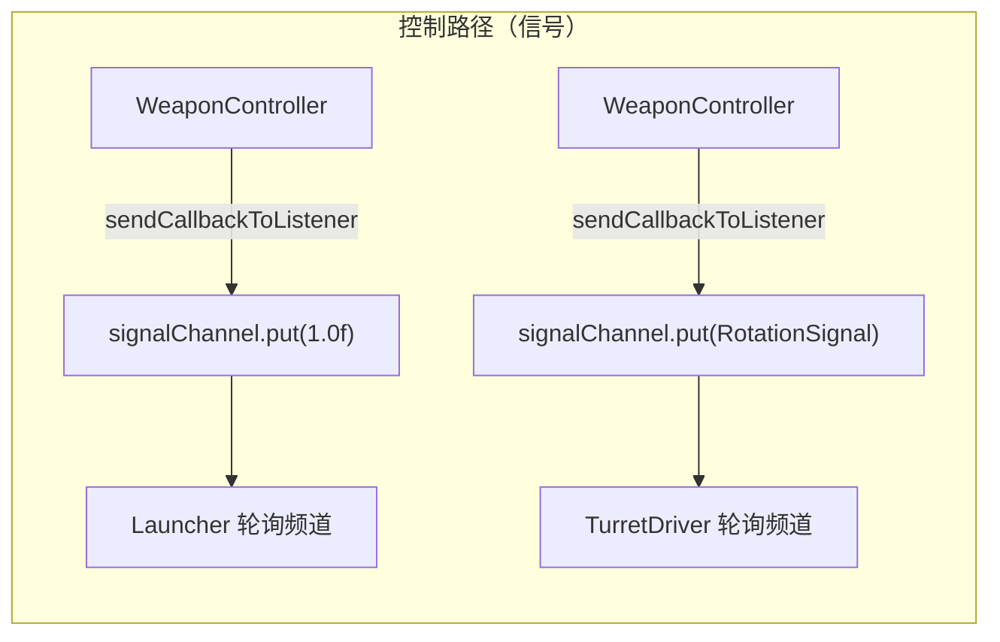
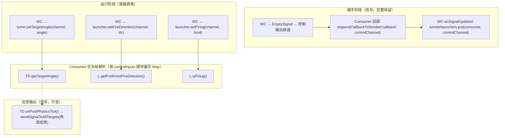
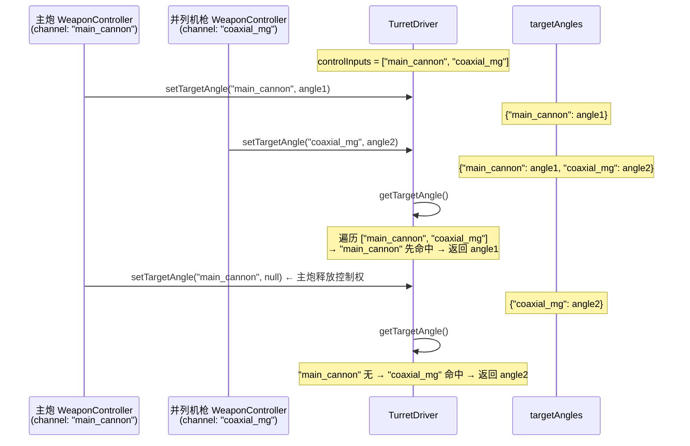

# Machine-Max 武器系统 — 发射器与控制器直接调用重构设计

> 状态：设计阶段
> 创建时间：2026-07-11
> 关联文件：
> - `WeaponControllerSubsystem.java`
> - `LauncherSubsystem.java`
> - `TurretDriverSubsystem.java`
> - `LauncherSubsystemStaticAttr.java`
> - `TurretDriverSubsystemStaticAttr.java`

## 一、背景与动机

### 1.1 当前问题

`WeaponControllerSubsystem` 通过握手（handshake）发现同载具内的 `TurretDriverSubsystem` 和 `LauncherSubsystem`，建立一对多绑定关系。握手后持有直接引用（`Map<LauncherSubsystem, String>` / `Map<TurretDriverSubsystem, String>`），但后续控制仍通过信号系统——`sendCallbackToListener` 发送 `RotationSignal` / `1.0f` / `EmptySignal`，消费者侧轮询 `controlInputs` 频道做语义解析。

```
WeaponController.onPrePhysicsTick()
  → sendCallbackToListener(channel, turret, RotationSignal)
  → sendCallbackToListener(channel, launcher, 1.0f / EmptySignal)
```

问题：

| 问题 | 说明 |
|------|------|
| **绕路** | Controller 持有 Consumer 直接引用，却通过信号系统兜一圈传简单值（boolean / Vector3f）。通道名在握手阶段已经确定，此后的开火/停火本质上就是 `setFiring(true/false)`，不需要信号语义 |
| **类型失语** | `1.0f` / `EmptySignal` 作为开火/停火的信号是约定而非类型约束——不经代码审查无法知道"往这个频道写 1.0f 即开火" |
| **延迟（Turret路径）** | WC 写信号 → TD 轮询频道 — 均在物理线程同一 tick，消除信号通道开销后更直接 |
| **延迟（Launcher路径）** | WC 物理线程写 → Launcher 主线程 `onTick` 读 — tick 边界不变。Map 方案**不能消除此延迟**（弹药消耗涉及物品增减，必须在主线程执行，开火判定无法下移到 `onPrePhysicsTick`），价值在于消除信号间接性 |

> 注：当前信号方案已通过 `controlInputs` 列表顺序正确实现了多控制器优先级（Consumer 遍历频道时先命中者胜出）。Map 方案保留了相同语义——仍按 `controlInputs` 顺序遍历 Map，优先级不变。Map 的价值不在于"修复优先级"，而在于消除信号通道的间接性。

### 1.2 动机：机娘 / 人形角色武器支持

`LauncherSubsystem` 的弹道方向目前严格绑定 locator 的世界朝向。对于载具，炮塔旋转间接改变 locator 朝向，这很自然。但机娘角色的武器 locator 绑在手臂骨骼上，由动画驱动，无法精确指向瞄准点。

需要一种"近似瞄准"机制：发射器尽可能向期望方向开枪，但受最大修正角度约束。载具火炮设 0° 保持拟真，机娘武器设 5°~15° 模拟枪口指向能力。

## 二、设计目标

1. **直接调用替代信号**：WeaponController 对 TurretDriver / Launcher 的控制从 `sendCallbackToListener` 改为直接方法调用
2. **Map 优先级模型**：Consumer 维护 `ConcurrentHashMap<String, T>`，按 `controlInputs` 声明的频道顺序解析优先级——后来者不能抢先进者
3. **发射方向修正**：Launcher 新增 `maxCorrectionAngleDeg`（静态属性）和 `preferredFireDirection`（运行时），开火时按锥角 clamp
4. **握手保留**：握手机制完整保留——它是拓扑发现层，与后续控制方式正交
5. **向后兼容**：`controlInputs` JSON 字段保留，既用于握手频道名也用于优先级顺序

## 三、架构变更

### 3.1 变更前



### 3.2 变更后



## 四、Consumer 侧 Map 优先级模型

### 4.1 核心思想

`controlInputs` JSON 数组的声明顺序 = 优先级从高到低。Consumer 维护 `ConcurrentHashMap<String, T>`，**遍历 `controlInputs` 列表时先命中者胜出**。



- **释放控制权**：Controller 调用 `setXxx(channel, null)` / `setFiring(channel, false)` → Consumer 内部调 `ConcurrentHashMap.remove(channel)`，而非 `put(channel, null)`，确保条目完全移除、后续低优先级频道可接管
- **EmptySignal 触发释放**：Controller 的 `aimInputs` / `fireInputs` 频道收到 `EmptySignal` 代表上游无控制指令（如乘员离开座位），Controller 应调用 `releaseAllControl()` 释放所有已绑定 Consumer，而非继续发送"停火"命令。这一语义与当前 `resetSignalOutputs()` 一致
- **失效时释放**：Controller `!isActive()` / 载具拓扑变化时，必须对所有已绑定 Consumer 调用释放
- Map 线程场景：
  - `TurretDriver.targetAngles`：所有操作均在物理线程，使用 `ConcurrentHashMap` 保持一致性
  - `Launcher.firingCommands`：物理线程写，主线程读（`onTick`），必须 `ConcurrentHashMap`
  - `Launcher.fireDirections`：可能由火控计算机等多源独立写入（物理线程），Launcher 在 `fireSingle`（物理线程）读取，`ConcurrentHashMap` 保证多写者安全

## 五、TurretDriver 改动

### 5.1 新增字段

```java
/** 多控制器目标角度映射。key=controlInputs中的频道名，value=(pitch,yaw,roll) 弧度 */
private final ConcurrentHashMap<String, Vector3f> targetAngles = new ConcurrentHashMap<>();
```

### 5.2 API

```java
/**
 * 由 WeaponController 直接调用，替代 RotationSignal 信号。
 * @param channel 控制频道名（对应 controlInputs 中的条目）
 * @param angle   目标角度，null = 该控制器释放控制权
 */
public void setTargetAngle(String channel, @Nullable Vector3f angle) {
    if (angle == null) targetAngles.remove(channel);
    else targetAngles.put(channel, angle);
}

/** 按 controlInputs 顺序获取最高优先级的目标角度。null = 保持当前位置 */
@Nullable
private Vector3f getTargetAngle() {
    for (String channel : attr.staticAttribute.getControlInputs()) {
        Vector3f angle = targetAngles.get(channel);
        if (angle != null) return angle;
    }
    return null;
}
```

### 5.3 onPrePhysicsTick 变更

```java
// 旧：
RotationSignal rotationSignal = readRotationSignal(attr.staticAttribute.getControlInputs());
// 新：
Vector3f target = getTargetAngle();
// 后续 target.x(pitch) / target.y(yaw) 伺服马达逻辑不变
// null 时：servo 保持位置（MotorParam.TargetVelocity=0）
```

### 5.4 删除

- `readRotationSignal()` 方法 — 整个移除

### 5.5 不变

- `onPostPhysicsTick()` 的角度反馈输出 — 仍通过 `sendSignalToAllTargets`，这是广播性质的 1:N 输出
- `getAcceptedChannels()` 仍返回 `controlInputs` — 握手依赖
- `controlInputs` JSON 字段 — 完整保留

## 六、Launcher 改动

### 6.1 新增字段

```java
/** 多控制器开火指令映射。key=controlInputs频道名 */
private final ConcurrentHashMap<String, Boolean> firingCommands = new ConcurrentHashMap<>();
/** 多控制器期望发射方向映射。key=controlInputs频道名，value=世界空间单位向量 */
private final ConcurrentHashMap<String, Vector3f> fireDirections = new ConcurrentHashMap<>();
```

### 6.2 API

```java
/**
 * 由 WeaponController 直接调用，替代开火信号。
 * @param channel 控制频道名
 * @param firing  true=开火，false=该控制器释放开火权
 */
public void setFiring(String channel, boolean firing) {
    if (!firing) firingCommands.remove(channel);
    else firingCommands.put(channel, true);
}

/**
 * 由 WeaponController 直接调用，设置期望发射方向。
 * @param channel   控制频道名
 * @param direction 世界空间单位方向，null = 释放
 */
public void setFireDirection(String channel, @Nullable Vector3f direction) {
    if (direction == null) fireDirections.remove(channel);
    else fireDirections.put(channel, direction);
}

/** 按控制频道优先级判定是否开火 */
private boolean isFiring() {
    for (String channel : attr.staticAttribute.getControlInputs()) {
        if (firingCommands.getOrDefault(channel, false)) return true;
    }
    return false;
}

/** 按控制频道优先级获取期望发射方向。null = 严格使用locator朝向 */
@Nullable
private Vector3f getPreferredFireDirection() {
    for (String channel : attr.staticAttribute.getControlInputs()) {
        Vector3f dir = fireDirections.get(channel);
        if (dir != null) return dir;
    }
    return null;
}
```

### 6.3 发射方向修正（fireSingle 新增逻辑）

```java
// fireSingle() 当前：
Vector3f direction = MyQuaternion.rotate(jmeRot, new Vector3f(0, 0, -1), null).normalize();

// 改为：
Vector3f locatorForward = MyQuaternion.rotate(jmeRot, new Vector3f(0, 0, -1), null).normalize();
Vector3f direction;
Vector3f preferred = getPreferredFireDirection();
if (preferred != null && attr.staticAttribute.getMaxCorrectionAngleDeg() > 0.001f) {
    direction = clampToCone(locatorForward, preferred, attr.staticAttribute.getMaxCorrectionAngleDeg());
} else {
    direction = locatorForward;
}
// 后续散布、后坐力逻辑以 direction 为中心，线程安全：此方法在物理线程执行
```

#### clampToCone 算法

```java
/**
 * 将期望方向限制在以 locator 朝向为轴的锥角内。
 *
 * @param forward   locator 前方单位向量（锥轴方向）
 * @param preferred 期望方向（单位向量）
 * @param maxAngleDeg 最大允许偏离角度（度）
 * @return 修正后的发射方向（单位向量）
 */
private static Vector3f clampToCone(Vector3f forward, Vector3f preferred, float maxAngleDeg) {
    float angle = forward.angleBetween(preferred);
    if (angle <= Math.toRadians(maxAngleDeg)) return preferred;
    // 将 forward 向 preferred 方向旋转 maxAngleDeg
    Vector3f axis = forward.cross(preferred).normalizeLocal();
    Quaternion rot = new Quaternion().fromAngleAxis((float) Math.toRadians(maxAngleDeg), axis);
    return MyQuaternion.rotate(rot, forward, null);
}
```

### 6.4 isFiring 变更

```java
// 旧：轮询 controlInputs 信号频道
private boolean isFiring() {
    for (String signalKey : attr.staticAttribute.getControlInputs()) {
        SignalChannel channel = getSignalChannel(signalKey);
        if (!channel.isEmpty() && !(channel.getFirstSignal() instanceof EmptySignal)) {
            return true;
        }
    }
    return false;
}

// 新：直接读 Map
private boolean isFiring() {
    for (String channel : attr.staticAttribute.getControlInputs()) {
        if (firingCommands.getOrDefault(channel, false)) return true;
    }
    return false;
}
```

### 6.5 不变

- `ammoInputs` 频道 — AmmoLoader ↔ Launcher 的弹药供给发现仍走信号系统（多对多关系，不适用直接引用）
- `getAcceptedChannels()` — 依然返回 `controlInputs` + `ammoInputs`，握手和弹药供给发现均需要

## 七、LauncherSubsystemStaticAttr 新增字段

```java
/** 最大方向修正角度（度）。0 = 严格沿locator方向发射（载具模式），>0 = 允许弹道向期望方向修正 */
private final float maxCorrectionAngleDeg;
```

JSON codec：

```java
Codec.FLOAT.optionalFieldOf("max_correction_angle_deg", 0f)
    .forGetter(LauncherSubsystemStaticAttr::getMaxCorrectionAngleDeg)
```

效果总结：

| `max_correction_angle_deg` | `preferredFireDirection` | 行为 |
|---------------------------|-------------------------|------|
| 0 | 任意 | 严格沿 locator 方向（载具模式，完全拟真） |
| > 0 | null | 降级为 locator 方向（未连接 Controller 时的安全回退） |
| > 0 | 非 null | 若夹角 ≤ 上限则用期望方向；否则旋转 locator 方向 maxAngle 度向期望方向靠拢 |

## 八、WeaponController 改动

### 8.1 炮塔控制

```java
// onPrePhysicsTick 中：
// 旧：
for (Map.Entry<TurretDriverSubsystem, String> entry : turrets.entrySet()) {
    // ... 计算 targetAngle ...
    sendCallbackToListener(channel, turret, new RotationSignal(targetAngle));
}

// 新：
for (Map.Entry<TurretDriverSubsystem, String> entry : turrets.entrySet()) {
    TurretDriverSubsystem turret = entry.getKey();
    String channel = entry.getValue();
    if (turret.isDestroyed() || !turret.isActive()) {
        turret.setTargetAngle(channel, null);
        continue;
    }
    // ... 分轴计算 targetAngle（逻辑不变）...
    turret.setTargetAngle(channel, targetAngle);
}
```

### 8.2 发射器控制

`fireSalvo()` 和 `fireRipple()` 的射击模式逻辑完整保留，仅将信号发送替换为直接调用。

```java
// 旧：
sendCallbackToListener(channel, launcher, 1.0f);
sendCallbackToListener(channel, launcher, EmptySignal.INSTANCE);
```

#### 8.2.1 齐射（SALVO）：所有已瞄准的发射器同时开火

```java
private void fireSalvo(List<LauncherSubsystem> aimedLaunchers) {
    // 先停火所有发射器
    for (Map.Entry<LauncherSubsystem, String> entry : launchers.entrySet()) {
        entry.getKey().setFiring(entry.getValue(), false);
    }
    // 已瞄准的同时开火
    for (LauncherSubsystem launcher : aimedLaunchers) {
        String channel = launchers.get(launcher);
        launcher.setFireDirection(channel, computeFireDirection(launcher));
        launcher.setFiring(channel, true);
    }
}
```

#### 8.2.2 轮射（RIPPLE）：按顺序每次只让一个发射器开火

```java
private void fireRipple(List<LauncherSubsystem> aimedLaunchers) {
    if (aimedLaunchers.isEmpty()) return;
    int interval = (int) (attr.staticAttribute.getRippleInterval() * 20f);

    if (rippleTickCounter <= 0) {
        // 先停火所有发射器
        for (Map.Entry<LauncherSubsystem, String> entry : launchers.entrySet()) {
            entry.getKey().setFiring(entry.getValue(), false);
        }
        // 只让当前索引的发射器开火
        if (rippleIndex < aimedLaunchers.size()) {
            LauncherSubsystem launcher = aimedLaunchers.get(rippleIndex);
            String channel = launchers.get(launcher);
            launcher.setFireDirection(channel, computeFireDirection(launcher));
            launcher.setFiring(channel, true);
        }
        rippleIndex = (rippleIndex + 1) % aimedLaunchers.size();
        rippleTickCounter = interval;
    } else {
        rippleTickCounter--;
    }
}

/** 计算从 launcher 枪口指向 target 的单位方向向量 */
private Vector3f computeFireDirection(LauncherSubsystem launcher) {
    if (targetPosition == null) return null;
    Vec3 muzzlePos = launcher.getMuzzleWorldPosition();
    Vec3 toTarget = targetPosition.subtract(muzzlePos).normalize();
    return new Vector3f((float) toTarget.x, (float) toTarget.y, (float) toTarget.z);
}
```

- `sendCallbackToListener` 全部移除
- `rippleTickCounter` / `rippleIndex` / `FireMode` 枚举完整保留，轮射时序语义不变

### 8.3 释放控制权（替代 resetSignalOutputs 的 callback 部分）

#### 8.3.1 通用释放方法

```java
/**
 * 释放对所有已绑定 Consumer 的控制权。
 * 用于 Controller 失效、上游无指令时调用。
 * 注意：此方法直接遍历 turrets/launchers，不处理 onVehicleStructureChanged 的竞态。
 */
private void releaseAllControl() {
    for (Map.Entry<TurretDriverSubsystem, String> entry : turrets.entrySet()) {
        entry.getKey().setTargetAngle(entry.getValue(), null);
    }
    for (Map.Entry<LauncherSubsystem, String> entry : launchers.entrySet()) {
        String ch = entry.getValue();
        entry.getKey().setFireDirection(ch, null);
        entry.getKey().setFiring(ch, false);
    }
}
```

#### 8.3.2 onVehicleStructureChanged：快照优先避免竞态

`onVehicleStructureChanged` 中 `releaseAllControl()` → `turrets.clear()` 之间存在竞态窗口：

```
主线程: releaseAllControl() → 遍历 turrets，调 setXxx(null)
物理线程: onPrePhysicsTick() → 遍历 turrets（仍有旧条目）→ setXxx(newValue)
主线程: turrets.clear()
```

物理线程在 `releaseAllControl` 和 `clear` 之间重新写入了 Consumer Map，随后 `turrets` 被清空但 Consumer 侧残留了无人负责的旧值。

**修复**：先快照并原子清理 `turrets`/`launchers`，再从快照释放。这样物理线程在任何时刻遍历均看到空 Map，不会写入新值。

```java
@Override
public void onVehicleStructureChanged() {
    super.onVehicleStructureChanged();
    // ① 快照 + 原子清理：物理线程此后遍历 turrets 为空，无法重新写入
    Map<TurretDriverSubsystem, String> oldTurrets = new HashMap<>(turrets);
    Map<LauncherSubsystem, String> oldLaunchers = new HashMap<>(launchers);
    turrets.clear();
    launchers.clear();

    // ② 从快照安全释放（物理线程无法干扰，因为 turrets 已空）
    for (Map.Entry<TurretDriverSubsystem, String> e : oldTurrets.entrySet()) {
        e.getKey().setTargetAngle(e.getValue(), null);
    }
    for (Map.Entry<LauncherSubsystem, String> e : oldLaunchers.entrySet()) {
        String ch = e.getValue();
        e.getKey().setFireDirection(ch, null);
        e.getKey().setFiring(ch, false);
    }

    // ③ 重新握手
    handShake();
    needsAmmoPoolUpdate = true;
}
```

调用位置：

| 时机 | 调用线程 | 方式 | 说明 |
|------|----------|------|------|
| `readInputSignals()` 检测到 aim/fire 频道为 `EmptySignal` | **主线程**（`onTick`） | `releaseAllControl()` | 上游无控制指令，立即释放 |
| `onPrePhysicsTick()` 的 `!isActive() \|\| isDestroyed()` 分支 | 物理线程 | `releaseAllControl()` | Controller 自身失效 |
| `onVehicleStructureChanged()` | **主线程** | 快照优先（见 §8.3.2） | 防止 release→clear 竞态 |

> 注：`releaseAllControl()` 可能在主线程或物理线程调用。所有 Consumer 侧 Map 均为 `ConcurrentHashMap`，多线程安全。当前代码中 `resetSignalOutputs()` 也有类似的跨线程调用（`ScriptableSubsystem.java:273`），信号系统的 `SignalChannel extends ConcurrentHashMap` 天然支持此模式。

### 8.4 不变

- 握手 + 回调（`handShake()` → `onSignalUpdated`）— 完整保留
- `readInputSignals()` / `updateRegularInputs()` — 不变
- 弹药路由（`routeAmmoToLaunchers`）— 不变（已为直接调用）
- 弹药切换 / 弹链管理 — 不变

## 九、线程模型

### 9.1 常规控制写入

| 数据 | 写入者（线程） | 读取者（线程） | 容器 | 备注 |
|------|-------------|-------------|------|------|
| `Turret.targetAngles` | 物理线程 | 物理线程 | `ConcurrentHashMap` | 同一物理步，写入先于读取 |
| `Launcher.firingCommands` | 物理线程（常规）/ **主线程**（release） | **主线程** | `ConcurrentHashMap` | 跨线程，ConcurrentHashMap 保证可见性 |
| `Launcher.fireDirections` | 物理线程（多写入源可能）/ **主线程**（release） | 物理线程 | `ConcurrentHashMap` | 火控计算机等可独立写入，release 可从主线程调 |
| `WC.targetPosition` | 主线程 | 物理线程 | 已有 `volatile` | 不变 |

### 9.2 releaseAllControl 写入源

`releaseAllControl()` 可从**主线程**或**物理线程**调用（见 §8.3 表），写入上述三张 Map。`ConcurrentHashMap` 的 `remove()` 和 `put()` 均为线程安全操作，无需额外同步。

### 9.3 Launcher 开火判定线程约束

弹药消耗（`tryLoadChamber` → `consumeReadyRound`）涉及物品增减，**必须在主线程**执行。因此 Launcher 的开火判定（`isFiring`）和 `firingCommands` 读取仍保持在 `onTick`（主线程），物理线程→主线程的 1 tick 边界在此路径上不可消除。这不是 Map 方案的问题，而是弹药系统的固有约束。

## 十、文件变更清单

| 文件 | 变更类型 | 说明 |
|------|----------|------|
| `TurretDriverSubsystem.java` | 修改 | +`ConcurrentHashMap targetAngles`; +`setTargetAngle()` / `getTargetAngle()`; -`readRotationSignal()`; `onPrePhysicsTick` 改为读 Map |
| `LauncherSubsystem.java` | 修改 | +`ConcurrentHashMap firingCommands` / `fireDirections`; +3 setter + 2 getter（按优先级遍历）; 删除旧信号轮询; `fireSingle` 加入方向修正 + `clampToCone()` |
| `LauncherSubsystemStaticAttr.java` | 修改 | +`float maxCorrectionAngleDeg` + JSON codec（默认 0） |
| `WeaponControllerSubsystem.java` | 修改 | 炮塔/发射器控制改为 `consumer.setXxx(channel, value)`; +`releaseAllControl()`; 移除 `fireSalvo/fireRipple` 中的 `sendCallbackToListener` |
| `TurretDriverSubsystemStaticAttr.java` | **不动** | `controlInputs` 保留，职责更新为握手频道名 + 优先级顺序 |
| `LauncherSubsystemStaticAttr.java` | **不动** | `controlInputs` 保留，同上 |

**不涉及**：
- 握手回调机制（`respondCallbackToSender` / `onSignalUpdated`）
- Loader ↔ Launcher 的 ammo supply 发现信号
- TurretDriver 角度反馈输出信号
- BallisticsFramework 弹道 API
- 任何 JSON 内容包格式（新增字段有默认值，旧包无需修改）

## 十一、验收清单

- [ ] 载具火炮：`maxCorrectionAngleDeg=0`，弹道严格沿炮管方向，行为与变更前一致
- [ ] 多 Controller 优先级：主炮 Controller 持有炮塔期间，并列机枪 Controller 的 `setTargetAngle` 被忽略
- [ ] Controller 失效释放：WeaponController `!isActive()` 后，Launcher 自动停火、TurretDriver 保持当前位置
- [ ] 载具拓扑变化释放：连接器断开导致 Launcher 脱离时，原 Controller 不再控制它
- [ ] 握手正常运行：新建 / 拓扑变化的载具 handshake 后武器系统正常工作
- [ ] 弹药供给不受影响：AmmoLoader → Launcher 的弹药发现和装填流程正常
- [ ] 无 JSON 破环：现有内容包不修改即可正常工作
