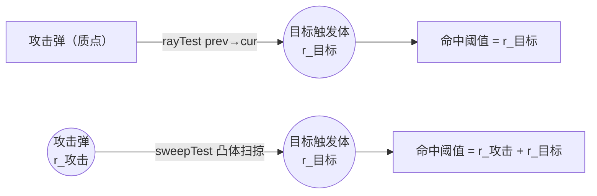

# 武器系统-投射物拦截与受击判定计划

> 关联文档：
>
> - BallisticsFramework 侧：`BallisticsFramework/docs/BFHitResolver-去实体化与命中转发计划.md`
> - 本仓库：[武器系统-组件化投射物与类型体系设计.md](./武器系统-组件化投射物与类型体系设计.md)、[武器系统-制导组件实现备忘.md](./武器系统-制导组件实现备忘.md)
> - wiki：[4.7-投射物.md](./wiki/4-物理与战斗机制/4.7-投射物.md)

## 〇、实施状态

本计划四个阶段均已落地，各阶段一个提交：

| 阶段 | 提交 | 主题 |
| --- | --- | --- |
| 1 运动模型唯一化 | `cbe211dc` | 删刚性投射物、类型键收敛为 `ballistic`、改名 `Ballistic*`、删 `IProjectile` |
| 2 可损毁语义 | `1467d475` | `vulnerability` 块与精确 RHA / 结构血量 |
| 3 触发体与命中检测 | `f67044a3` | `ProjectileHitBox`、三趟判定、`hit_detection` |
| 4 代理实体解析 | `a7153e82` | `MMProjectileEntity` 实现 `BFHitResolver` |

Spark-Core 侧（`CollisionGroups.PROJECTILE` 与 `SNAPSHOT_TRACKED`）落在该仓库的提交 `13c40cd4`。构建校验：本仓库 `./gradlew compileJava`（含两个复合构建）通过。

**本文档的阅读基线。** 正文横跨改造前后两种状态，基线因此显式给出：

- 记录改造起点的部分：§二「改造前锚点」、§五「详细步骤」，以及 §6.1 里对改造起点分叉的分析。这些地方的「现状」「目前」「改为」「删去」都指改造前，且每一处对照都在同句或同表内同时给出两个状态，因此不依赖读者知道旧版本。
- 其余部分（§一、§三、§6.2–§6.5、§七）描述的是改造后系统的当前事实。
- 实现与本文档设计的差异、以及落地时新增的取舍，集中在 §八。

## 一、概述

本计划给投射物补上"被击中并损毁"的能力，使拦截成立。**设计本意是让投射物成为可被命中的目标**：被另一发投射物或外部攻击打中后掉结构血量，血量耗尽即损毁。

围绕这一点，本计划确立一项核心设计决策，并安排四项工作。

### 核心设计决策——运动模型唯一化

现行系统用两套运动模型驱动投射物：`rigid` 由 Bullet 刚体驱动，质点弹由 SoA 积分 + 射线驱动。两套模型在积分、碰撞检测、网络同步、客户端外推四处各自维护一套实现（分叉清单与代价见 §6.1）。

`rigid` 的存在理由是"可被拦截"（wiki 4.7 的表述）：只有具备物理碰撞体的投射物才能被其他弹丸或载具部件命中。本计划的运动学触发体在质点弹路径上完整复制这一能力——触发体把质点弹暴露为 Bullet 世界中的一个体积，供 SoA 射线检测与外部攻击者命中。`rigid` 未被复制的独有能力，只有"与零件/载具的物理接触响应（弹跳、被推动）"，本设计有意放弃。

因此运动模型收敛为 SoA 积分 + 射线一套，删去 `rigid` 类型与 `RigidProjectile`。完整论证（含"未来外力需求同样能在质点弹的积分中实现"）见 §6.1。

### 四项工作

1. **运动模型收敛**（落地上述核心决策）—— 删除 `rigid` 类型与 `RigidProjectile`，飞行与命中检测统一由 SoA 积分 + 射线完成；随之把"飞行弹丸"这族改名为 `Ballistic*`（`KineticProjectileType` → `BallisticProjectileType`、`PointProjectile` → `BallisticProjectile`、JSON `"point"` / `"rigid"` → `"ballistic"`），并把只剩单一实现者的 `IProjectile` 折进 `BallisticProjectile`（§1.3、§1.4）。
2. **可损毁语义** —— 投射物从 `BFHurtTarget` 的空壳实现变为真实实现：护甲等效厚度、结构血量来自内容包配置，被打穿则损毁。
3. **运动学触发体与命中检测** —— 可拦截弹种由代码在服务端挂一个零接触响应的运动学刚体，作为它的可探测体积，供其他投射物与外部攻击者命中；攻击方的命中检测原语（射线 / 凸体扫掠）按弹种可配（§6.5）。
4. **代理实体解析** —— `MMProjectileEntity` 实现 `BFHitResolver`，使原版与其他模组的投射物命中这个实体投影时，伤害经框架的协议外转发落到投射物本体。

第 3 项依赖 BallisticsFramework 侧的 `BFHitResolver` 去实体化（见关联文档），该改动使触发体宿主可以直接承担解析职责。该改动已存在于本地 `../BallisticsFramework` 源码（`1.0.0.alpha.11`：`BFHitResolver`、`ProjectileHitResolverMixin`、`BFHurtInterceptor` 情况 3 均已落地并注册），阶段 3 因此没有外部阻塞。注意 `gradle.properties` 的 `ballistics_framework_version` 仍写作 `1.0.0.alpha.9`，而复合构建实际编译的是该本地源码——引用框架签名时以源码为准。

## 二、改造前锚点

本节记录改造起点的代码状态，类名、路径与行号都按**改造前**的代码书写，用于对照"这次改造动了什么"；改造后的对应实现见 §五 各阶段。

| 事实 | 位置 |
| --- | --- |
| 质点弹没有物理体，`getPhysicsLevel()` 抛异常 | `PointProjectile.java:234-237` |
| 两类投射物已是 `BFHurtTarget`（经 `DestroyableObject`），但实现是空壳：`hurt()` 恒返回 false、`createContextFromVanilla()` 恒返回 null、`getArmorLevel()` 恒为 `UNARMORED_1` | `PointProjectile.java:290-303`、`RigidProjectile.java:691-704` |
| `accumulateDamage()` 空方法体、`handleAccumulatedDamage()` 空方法体 | `PointProjectile.java:217-224`、`RigidProjectile.java:629-637` |
| `getArmorLevel` 恒为 `UNARMORED_1`，其 `medianRha()` 返回 `(lowerRha+upperRha)/2` = 0.5mm | `PointProjectile.java:300-303`、`BF/ArmorLevel.java:27,116` |
| 结构血量的载体是 `DATA_DURABILITY_ID`，默认值 20；`setDurability` 会把入参 clamp 到 `[0, getMaxDurability()]` | `DestroyableObject.java:67,319-325` |
| `PointProjectile.preTick()` 覆写了基类生命周期的前半段，且不调用 `handleAccumulatedDamage()` | `PointProjectile.java:159-167`、`DestroyableObject.java:74-87` |
| `updatePointProjectiles` 对 SoA 中每个条目都做积分与射线检测，没有按类型跳过（`rigid` 条目在服务端因此同时走 Bullet 与 SoA 两条路径） | `ProjectileManager.java:1064-1082` |
| 射线命中分派直接取物理体属主作为目标：`switch (entry.owner())` 分 `SubPart` / 非实体 `BFHurtTarget` / `Entity` 三路 | `ProjectileManager.java:1207`、`1369-1391` |
| 非地形命中的穿透去重在**收集阶段**完成，早于分派；属主未实现 `PhysicsHost` 时不生成密钥，该命中不参与去重 | `ProjectileManager.java:1240-1251`、`Spark-Core/.../PenetrationKey.kt:33-37` |
| 发射时的自身排除：把发射器零件的全部 HitBox 预登记为"已穿透" | `LauncherSubsystem.java:590-591,617-626` |
| 触发体的既有范本：零质量刚体 + `setKinematic(true)` + `setContactResponse(false)` + 独立碰撞组 | `InteractBoxes.java:36-43` |
| `CollisionGroups` 现有五个常量：`NONE=0`（只作 collideWith 掩码，不可作组）、`TERRAIN=1`、`PHYSICS_BODY=2`、`PAWN=4`、`TRIGGER=8` | `Spark-Core/.../CollisionGroups.kt:14-50` |
| `rayTest` / `sweepTest` 完全不按 `collisionGroup` / `collideWithGroups` 过滤（原生射线回调不检查掩码）；`contactTest` 按掩码过滤 | `Spark-Core/.../CollisionSpace.java:231,553-561,718-720` |
| 实时世界射线的消费方之一（生物视野）没有碰撞组过滤，凡有属主且非自身的刚体全部收进目标列表 | `LivingEntityEyesightAttachment.java:89-113` |
| 寿命到期路径不走 `destroy()`：置 `isRemoved` 后从对象表移除 | `ProjectileManager.java:611-627` |
| `MMProjectileEntity.isPickable()` 返回 false；`MMPartEntity.isPickable()` 返回 true，并靠 `PartHitHandler` 接住原版投射物的命中 | `MMProjectileEntity.java:139-142`、`MMPartEntity.java:682-685`、`PartHitHandler.java:25-53` |
| 两套运动模型分叉：积分、碰撞检测、权威快照、客户端外推各有一条按 `rigid`/`point` 分岔的实现 | `ProjectileManager.java:974-978`（外推跳过 rigid）、`:1631-1640`（快照含 rigid）、`RigidProjectile.java`（Bullet 积分与接触回调） |

### 2.1 空壳实现的后果

`hurt()` 恒返回 false、`accumulateDamage` 空方法体，意味着投射物被命中时不会掉血、不会被销毁；`getArmorLevel` 恒为 `UNARMORED_1` 且不覆写 `isArmorPenetrated`，使穿甲判定走默认的离散等级比较，攻击弹的穿深必然"击穿"这层 0.5mm 等效厚度，命中结果因此固定为穿透。`createContextFromVanilla()` 恒返回 null，则使协议外伤害（原版与其他模组的投射物、近战、爆炸）无法为投射物构造命中上下文——阶段 4 的转发路径直接依赖这个返回值。

### 2.2 触发体为何必要

质点弹没有 Bullet 刚体，其他投射物的射线检测无法发现它。可被拦截的弹种需要一个存在于 Bullet 世界中的体积作为命中目标，这就是运动学触发体；它的属主承担"物理体身份 + 穿透区域 + 命中解析"，而护甲与血量语义仍属于它引用的投射物。

## 三、目标与非目标

**目标**

- G1 投射物的护甲与结构血量由内容包定义，命中判定走精确 RHA 比较。
- G2 可拦截弹种在服务端持有运动学触发体，可被 SoA 射线检测命中，且与零件不发生任何碰撞响应。
- G3 运动模型唯一：飞行与命中检测只保留 SoA 积分 + 射线一条路径。

**非目标**

- 引信（延时、近炸、目标识别）不在本次范围。
- 不改穿甲管线与 `BFHurtTarget` 契约。
- 不改投射物对地形/零件/实体的既有命中行为。

## 四、文件清单

| 文件 | 操作 | 说明 |
| --- | --- | --- |
| `Spark-Core .../physics/body/CollisionGroups.kt` | 修改 | 新增 `PROJECTILE = 1 shl 4`（取值 16）；新增快照追踪组集合 `SNAPSHOT_TRACKED` |
| `Spark-Core .../physics/level/WorldSnapshot.kt` | 修改 | 追踪判据改为查询 `SNAPSHOT_TRACKED` |
| `common/mech/projectile/ProjectileHitBox.java` | 新建 | 触发体宿主：`PhysicsHost` + `BFHitResolver`，指向所属投射物 |
| `common/mech/projectile/type/KineticProjectileType.java` → `BallisticProjectileType.java` | 重命名 + 修改 | 新增可选 `vulnerability` 块与 `hit_detection` 选项及其 Codec；`getSerializedName()` 改为返回常量 `"ballistic"` |
| `common/mech/projectile/ProjectileType.java` | 修改 | dispatch 分派键由 `point` / `rigid` 收敛为 `ballistic` |
| `common/mech/projectile/IProjectile.java` | 删除 | 阶段 1：成员与 default 实现折进 `BallisticProjectile`（§1.4） |
| `common/mech/projectile/PointProjectile.java` → `BallisticProjectile.java` | 重命名 + 修改 | 承接 `IProjectile` 的成员；复用基类 `durability`（初值写入 + `getMaxDurability` / `accumulateDamage` / `handleAccumulatedDamage` / `preTick` / `checkDestroyed`，§2.3）；实现 `createContextFromVanilla`（§2.4）；触发体接线与自命中登记（§3.5）；移除空壳覆写 |
| `common/mech/projectile/ProjectileManager.java` | 修改 | 射线白名单、触发体批量刷新、命中分派改走 `resolveHitTarget`、按类型选择 `rayTest` / `sweepTest`、`HitEntry` 归一化两种结果类型、寿命到期分支改走 `destroy()`、`add/update/syncPointProjectile*` 去掉 `Point` |
| `common/entity/MMProjectileEntity.java` | 修改 | 实现 `BFHitResolver`；`isPickable()` 改为 true（见阶段 4） |
| `common/attachment/LivingEntityEyesightAttachment.java` | 修改 | 实时世界射线补碰撞组白名单，排除 `PROJECTILE`（§3.1） |
| `common/mech/projectile/RigidProjectile.java` | 删除 | 阶段 1 |
| `common/mech/projectile/ProjectileTypeEnum.java` | 删除 | 阶段 1：`type` 分派由 `ProjectileType.CODEC` 承担，枚举本身已无信息量（理由见 §1.2） |
| `spark_modules/**/projectiles/*.json`（12 个） | 修改 | 阶段 1：`type` 键统一为 `ballistic`（`155mm_he.json` 由 `rigid` 迁入，其余 11 个由 `point` 改名）；`155mm_he.json` 另在阶段 2 补 `vulnerability` |
| `common/mech/projectile/AGENTS.md` | 修改 | 文件清单与约定同步；该文件当前的 `ProjectileManager.java（971行）`、`总行数 ~2200 行` 与管线图里的 `tickPhysics(dt)` / `handleAccumulatedHits()` 均与实际不符（实际 2166 行、6 文件 4317 行、入口为 `prePhysicsTick` → `updateProjectiles`），一并纠正 |

`docs/wiki/4-物理与战斗机制/4.7-投射物.md` 的改写内容与其余关联文档一并列在 §4.1。

### 4.1 关联文档同步（已执行）

下表登记的是改造前各文档里与"删去 `rigid`、运动模型唯一化"冲突的表述。改造落地时已按表逐处核对改写，类名、JSON `type` 键与 `IProjectile` 表述一并更新。

| 文件 | 位置 | 改造前的冲突点 |
| --- | --- | --- |
| `docs/wiki/4-物理与战斗机制/4.7-投射物.md` | :180-185 | 称"只有具备物理碰撞体的投射物才能被其他弹丸或载具部件命中，质点投射物无法参与这种拦截判定"，并把刚体列为可拦截弹药的推荐模型 |
| `docs/武器系统-组件化投射物与类型体系设计.md` | §2.2 dispatch、§3.2 `restitution`、§3.3、§9.2 示例、§八 文件布局 | 以 `rigid` 为一路运动模型；`ProjectileMotionResult.KEEP_RIGID_RESPONSE`（§3.3）；dispatch 表的 `case "point", "rigid"`；`rigid` 定时弹跳榴弹示例；`RigidProjectile.java` 与 `ProjectileTypeEnum.java` 布局条目 |
| `docs/武器系统-制导组件实现备忘.md` | §7.7、:33、:100-102、:152、:359-366、:394、:409 | 刚体弹的施加方式（`applyCentralForce`、姿态驱动 `facingFromVelocity`）、`flushAuthoritativeState` 广播集合含刚体、`postTick` 同步时机 |
| `docs/武器系统-碰炸引信与爆炸战斗部实现备忘.md` | :27、:59、:91、:108、:165 | 承载 `point`/`rigid`、起爆点取 Bullet 接触点、称 `ProjectileTypeEnum` 区分 POINT/RIGID |
| `docs/相机系统-镜头抖动重构设计.md` | :32 | `RigidProjectile.onCollision()` 作为抖动来源 |
| `docs/武器系统-爆炸系统详细设计.md` | :228、:1400-1405 | 把 `WorldSnapshot` 的内容定义为 `PHYSICS_BODY` 组 |
| `docs/武器系统-爆炸系统接口设计.md` | :533 | 同上的 `WorldSnapshot` 内容定义 |
| `docs/武器系统-光束系统详细设计.md` | :812 | 与飞行弹丸对比的表格里引用的是改造前的类型名 |

表中的位置是改造前逐处登记的锚点。实际改写范围更大：同一份文档里凡是出现被删符号、`point` / `rigid` 取值、或描述已不存在的运动模型的段落都一并改写了（例如 `武器系统-组件化投射物与类型体系设计.md` 的 §2.2、§3.2、§3.3、§9.2、§八 之外还有多处的 `point` / `rigid` 散文描述）。改写准则与本次代码改造一致：只陈述当前事实，不以文档的旧版本为前提。

另外顺带纠正了两处与现行 JSON 结构不符的字段名——`external.radius`（m）实际是 `external.caliber`（mm，半径 = 口径 / 2000），`max_lifetime_ticks` 实际是 `max_lifetime`（秒，内部 ×20 转 tick）。这两处不是本次重构引入的，但它们正好落在本次改写的章节里，留着会让内容包作者写出加载不了的字段。

以下偏差同属"设计文档与已实现代码不一致"，但成因不是本次重构，且修正需要另行选定设计取向或数值，因此**未处理**，登记备查：

- `docs/武器系统-组件化投射物与类型体系设计.md` §9.1 / §9.2 的 `warheads` 示例用的是 `"power": 8.0`，与同一文档 §4.4 及实现里的 `ExplosionParams` 字段（`base_penetration` / `base_damage` / `base_impulse` / `near_radius` / `max_radius` / `front_speed` / `destroy_blocks` / `drop_items` / `causes_fire`）不一致。
- 同一文档 §4.2 的 `GuidanceAttr` 形状（`law` / `navigation_gain` / `max_lateral_acceleration`）与已实现的制导组件不符：实际是 `component/guidance/` 下的 `GuidanceLaw` 自描述接口，JSON 走 `guidance.type` 分派加 `turn_gain` / `limits`。该偏差是制导组件那一轮改造的残留。
- 同一文档的 `attr/` 目录、`SeekerAttr` / `FuzeAttr` / `RayAttr` / `RayProjectileType` 等均属尚未实现的设计目标，按设计保留。
- 该设计文档尚未登记本次新增的 `vulnerability` 与 `hit_detection` 两个可选顶层字段（当前记载位置是本计划 §2.1 / §3.6 与 `common/mech/projectile/AGENTS.md`）。

`WorldSnapshot` 的追踪判据现在查询 `CollisionGroups.SNAPSHOT_TRACKED`（含 `PROJECTILE`）。

### 4.2 改名与删接口的编译波及点

下列位置只受类名/接口名变化影响，编译器会逐处报错，不涉及逻辑改动：

| 位置 | 波及内容 |
| --- | --- |
| `client/input/CameraShakeController.java` | `BallisticProjectileType` 局部变量与 import |
| `network/payload/projectile/ProjectilesSpawnPayload.java` | 同上 |
| `common/item/prop/ProjectileTestItem.java` | 同上（含注释中的类名） |
| `network/payload/projectile/ProjectilesGuidedStatePayload.java` | `syncProjectileState` 改名；注释中的类名 |
| `common/mech/projectile/ProjectileManager.java` | `typeCache` 的数组类型、`getProjectileTypeByIndex` 的返回类型、多处 Javadoc 的类型引用 |
| `common/entity/MMProjectileEntity.java` | 字段与 `bindToProjectile` 的形参类型、Javadoc |

**名字相近但无关、必须保留**：`mixin/ProjectileMixin.java` 与 `mixin_interface/IProjectileMixin.java` 是给原版 `Projectile` 打补丁的 mixin 接口，与被删除的 `IProjectile` 没有关系，§七 的"无残留"判据要按符号本身核对（`IProjectile` 作为类型名消失，`IProjectileMixin` 保留）。

## 五、详细步骤

### 阶段 1：运动模型唯一化（删 rigid、收敛命名）

落地 §6.1 的核心设计决策。本阶段不新增能力，只把运动模型收敛为 SoA 积分 + 射线一条路径，为后续阶段清除"需要同时照顾两条路径"的分支。先做本阶段的原因有两条：一是 `rigid` 的两条分叉（积分、接触检测、权威快照、客户端外推）正是后续阶段要反复绕开的障碍；二是现行投射物的 `hurt()` 是空壳（见 §二 2.1），命中不会掉血、不会损毁，因此删去 `rigid` 不造成"可被击毁"能力的回归。

同一阶段顺带做两件只关命名与结构、不关能力的事：把"飞行弹丸"这族改名为 `Ballistic*`（§1.3），把只剩单一实现者的 `IProjectile` 折进 `BallisticProjectile`（§1.4）。

#### 1.1 内容包迁移与 `type` 键改名

全部投射物 JSON 的 `type` 键统一为 `"ballistic"`：`155mm_he.json` 由 `"rigid"` 迁入，其余 11 个弹种由 `"point"` 改名；`ProjectileType.CODEC` 的分派表随之只留 `case "ballistic"`。

这三处是一次原子改动：JSON 的 `type` 值、`ProjectileType.CODEC` 的分派表、`BallisticProjectileType.getSerializedName()` 必须同时落地。分派表是 `Codec.STRING.dispatch("type", ProjectileType::getSerializedName, ...)`，解码与编码都经过 `getSerializedName()`：只改 JSON 会因分派表未注册该名字而抛"未知投射物类型"；只改分派表而 `getSerializedName()` 仍返回旧值，则编码写回的是旧名字，再次加载又落回未注册分支。

迁移带来的行为变化：命中地形/零件后的去留由 SoA 射线路径决定（可穿透则继续飞行并按能量法衰减速度，不可穿透则销毁，携带战斗部时起爆）。`rigid` 路径以 Bullet 接触响应处理同一情形，两者的去留判定需按 §七 的验证项逐项核对，不假定完全一致。

#### 1.2 删除清单

| 对象 | 位置 |
| --- | --- |
| `RigidProjectile` 整个类 | `common/mech/projectile/RigidProjectile.java` |
| `ProjectileTypeEnum` 整个类 | `ProjectileTypeEnum.java` |
| `KineticProjectileType` 的 `type` 字段、`getType()`（类级 `@Getter` 生成）与 `ENUM_CODEC`，及其 CODEC 中重复读取 `"type"` 的首个字段 | `KineticProjectileType.java:46, 80-81, 92, 121` |
| `KineticProjectileType.getSerializedName()` 的 `type.getSerializedName()` 实现（改为返回常量 `"ballistic"`） | `KineticProjectileType.java:140-143` |
| 工厂分派的两个 switch（`create` / `createWithId`，不再需要分派） | `KineticProjectileType.java:217-224, 242-250` |
| `ProjectileType.CODEC` 的 `case "point", "rigid"`（改为只留 `case "ballistic"`） | `ProjectileType.java:100` |
| `clientExtrapolate` 的 rigid 跳过 | `ProjectileManager.java:974-978` |
| `flushAuthoritativeState` 的 rigid 条件 | `ProjectileManager.java:1631-1640` |
| `postTickAndSync` 的刚体分支 | `ProjectileManager.java:663-672` |
| `writebackRigidState` 与其调用 | `ProjectileManager.java:479-491`、`RigidProjectile.java:604` |
| `addRigidProjectile` 与其 SoA 注册 | `ProjectileManager.java:312-314` |

本表的路径与行号按改名前的现状给出；§1.3 的改名在删除完成后执行。

`ProjectileTypeEnum` 可以整个删掉：JSON 的 `type` 字段已经由 `ProjectileType.CODEC` 的 dispatch 读取用于路由，而 `KineticProjectileType.CODEC` 又用 `ENUM_CODEC.fieldOf("type")` 把它读了第二遍（`KineticProjectileType.java:92`）——这第二遍只是为一个恒等于 `POINT` 的字段赋值。删掉枚举后，`KineticProjectileType` 不再需要 `type` 字段、`getType()` 与 `ENUM_CODEC`，其 CODEC 去掉首个字段；工厂的 `switch (type)` 也只剩一条出口；`getSerializedName()` 则改由常量承担（`ProjectileType.CODEC` 的 dispatch 依赖它）。

#### 1.3 命名收敛：`Point` / `Kinetic` → `Ballistic`

这族投射物是"按弹道飞行的实体弹丸"，成员既含动能弹也含化学能弹（`155mm_he` 就是 HE），所以 `Kinetic` 对它们并不准确；`Ballistic` 覆盖两者，并与尚未实现的光束族（JSON `"pulse"` / `"beam"`）在命名上区分开。

| 现名 | 新名 |
| --- | --- |
| `PointProjectile` | `BallisticProjectile` |
| `KineticProjectileType` | `BallisticProjectileType` |
| `ProjectileManager.addPointProjectile` | `ProjectileManager.addProjectile` |
| `ProjectileManager.updatePointProjectiles` | `ProjectileManager.updateProjectiles` |
| `ProjectileManager.syncPointProjectileState` | `ProjectileManager.syncProjectileState` |
| JSON `type` 键 `"point"` / `"rigid"` | `"ballistic"` |

不动的部分：`ProjectileManager`、`ProjectileHitBox`、`ProjectileType` 三个类名不含 `Point`，保持不变；JSON 的 `"pulse"` / `"beam"` 属另一族且尚无实现（`ProjectileType.java:81` 把这两个名字记为"未来"，`ProjectileType.CODEC` 的 default 分支对未知名字抛异常），本次不涉及。

本文档为免歧义，凡是描述改造起点的路径与行号（§二、§1.2）一律按改造前的名字书写，便于与该起点对照；§一 与各设计小节按改造后的名字书写。编号约定同理：`§x.y` 指阶段内的小节（如 `§2.3` 是阶段 2 的第 3 小节），§二 的小节一律写作 `§二 x.y`。

#### 1.4 删除 `IProjectile` 接口

`IProjectile`（759 行）只有 `BallisticProjectile` 一个实现者，且路线图上不会有第二个：光束族会是 `ProjectileType.CODEC` 的另一条 dispatch 分支，而不是 `IProjectile` 的实现者；未来的诱饵弹 / 箔条等仍是数据驱动的同一个 `BallisticProjectileType`。它当前用 `default` 方法承载了六类职责（动力学协议、伤害回调、命中解析编排、类型委托、稳定性、生命周期），实质上把 god-object 藏进了接口。

删除方式：成员与全部 `default` 实现原样折进 `BallisticProjectile`，后者改为直接实现 `IProjectile` 原本的父接口 `BFDamageHandler`；嵌套的 `IProjectile.AfterHitResult` 随之成为 `BallisticProjectile.AfterHitResult`。搬移时注意可见性：接口的字段与方法隐式 public，`AfterHitResult.DESTROYED` / `passThrough` / `ricochet` 移入类后需要显式声明，否则 `ProjectileManager` 的调用点会编译失败。

需要机械替换的引用点：

| 引用点 | 现状 | 改为 |
| --- | --- | --- |
| `BallisticProjectileType#create` / `#createWithId` / `#fire` | 返回 `IProjectile` / `List<IProjectile>` | 返回 `BallisticProjectile` / `List<BallisticProjectile>` |
| `LauncherSubsystem` | `List<IProjectile> projectiles = type.fire(...)`、`for (IProjectile p : projectiles)`、`registerSelfExclusion(List<IProjectile>)` | 同上替换 |
| `MMProjectileEntity` | 字段 `private IProjectile projectile`、`bindToProjectile(IProjectile)` | 替换为 `BallisticProjectile` |
| `ProjectilesHitPayload` | `if (obj instanceof IProjectile proj)` | `instanceof BallisticProjectile` |
| `ProjectilesGuidedStatePayload` | 调用 `syncPointProjectileState(...)` | 随 §1.3 改名改为 `syncProjectileState(...)` |
| `ProjectileManager` | `instanceof IProjectile` 守卫、`IProjectile.AfterHitResult` 形参、`enqueueWarheadDetonation(IProjectile, Vec3)`、`typeCache` 的泛型声明 | 全部替换为 `BallisticProjectile` / `BallisticProjectile.AfterHitResult` |
| 其余仅受类型名波及 | `CameraShakeController`、`ProjectilesSpawnPayload`、`ProjectileTestItem` | 只改 import 与局部变量类型，编译器逐处报错（§4.2） |

### 阶段 2：可损毁语义

#### 2.1 类型侧新增 `vulnerability`

`BallisticProjectileType` 新增可选记录与 Codec 字段（本块 +1；另有顶层字段 `hit_detection` +1，见 §3.6）：

```json
{
  "type": "ballistic",
  "external": { "...": "..." },
  "terminal": { "...": "..." },
  "vulnerability": {
    "rha": 12.0,
    "durability": 30.0
  }
}
```

| 字段 | 单位 | 语义 |
| --- | --- | --- |
| `rha` | mm | 命中判定用的垂直等效厚度（直接给出等效值） |
| `durability` | 点 | 结构血量，累计伤害达到该值即损毁；与零部件的 `durability` 走同一套机制（§2.3） |

`rha` 与零部件侧的 `rha` **同名不同量纲**：零部件的 `rha` 是 `thickness`（mm）的无量纲抗穿系数（`HitBox.getRHA` = `thickness × rha`，见 `HitBox.java:85-89`），弹体没有材质与厚度结构，因此这里的 `rha` 直接就是等效厚度（mm）。

触发体半径不在此块配置：由口径直接换算（§6.2）。

整块缺省时投射物不持有触发体，`getArmorLevel` 维持 `UNARMORED_1`、`hurt` 维持返回 false，内容包可以按需选择弹种开启拦截。

#### 2.2 `BallisticProjectile` 的受击语义实现

三个方法覆写 `BFHurtTarget` 的护甲语义，直接实现在 `BallisticProjectile` 上（`IProjectile` 已在阶段 1 删除，见 §1.4）；同为 `BFHurtTarget` 成员、但服务于协议外伤害的 `createContextFromVanilla` 单列在 §2.4：

```java
/** 命中等效厚度（mm RHA）。未配置 vulnerability 的弹种按 0.5mm 处理 */
@Override
public float getRHA(BFDamageContext ctx) {
    Vulnerability v = getProjectileType().getVulnerability();
    return v == null ? ArmorLevel.UNARMORED_1.medianRha() : v.rha();
}

/** 护甲等级与精确 RHA 保持一致，供 HUD 与等级语义使用 */
@Override
public ArmorLevel getArmorLevel(BFDamageContext ctx) {
    return ArmorLevel.fromRha(getRHA(ctx));
}

/** 精确穿深比较。默认的离散等级比较会把 11mm 穿深判为击穿 19mm 装甲 */
@Override
public boolean isArmorPenetrated(BFDamageContext ctx) {
    return modifyPenetration(ctx) > getRHA(ctx);
}
```

精确比较与 `SubPart` 的口径一致（`SubPart.java:459-462`）。三个方法的形参都是单个 `BFDamageContext ctx`，与 `BFHurtTarget` 的声明一致；`ArmorLevel.fromRha` 也是 `SubPart.getArmorLevel` 的既有写法（`SubPart.java:448-451`）。

**未击穿不扣耐久（已定）。** 命中管线先判穿甲，再把 `calculateFinalDamage` 的结果交给 `hurt`：未击穿（`BLOCKED`）时默认实现返回 0，上面 `hurt` 的 `amount <= 0f` 早退使其既不掉耐久也不返回 true。这是有意选定的口径——`vulnerability.rha` 表达"必须实打实击穿的等效厚度"，与零件侧的硬门槛语义一致（`HitBox.getRHA` 同样是门槛而非软阈值），而不是"每发最多扣多少"的软阈值。

直接后果是穿深低于目标 `rha` 的攻击弹打不动目标（小口径近防弹对大 RHA 导弹无效）。这属于内容包调参的范畴：要让某型拦截弹打得动某型目标，就把它配到能击穿对应厚度。因此 `hurt` 不需要"最小磨损"这类补偿分支，`vulnerability` 的两个字段各自独立表达"多难打穿"（`rha`）与"能挨几下"（`durability`）。

#### 2.3 结构血量与损毁（复用基类 `durability` + 累加器）

结构血量不新增字段，直接复用 `DestroyableObject` 已有的 `durability`（`SynchedEntityData` 的 `DATA_DURABILITY_ID`，声明在 `DestroyableObject.java:50`、默认值 20 在 `:67`，读写见 `:319-325`）。`BallisticProjectile` 把其中多数方法覆写成空实现或常量，并自行实现了 `preTick()`，改为接回基类机制：

| 方法 | 现状 | 改为 |
| --- | --- | --- |
| `getMaxDurability()` | 返回常量 1 | 返回 `vulnerability == null ? 1f : vulnerability.durability()` |
| `accumulateDamage(float, ctx)` | 空实现 | 未配置 `vulnerability` 时丢弃；否则 `super.accumulateDamage(...)` 入队 |
| `handleAccumulatedDamage()` | 空实现 | 清空队列累加伤害并 `setDurability(...)`；归零时入队战斗部起爆并 `markHit()` |
| `preTick()` | 自行实现 tick 计数与 `checkDestroyed()`，不调用 `handleAccumulatedDamage()` | 在 `checkDestroyed()` 之前插入 `handleAccumulatedDamage()` —— 这是队列唯一的消费点 |
| `checkDestroyed()` | `!isDestroyed() && (hasHit \|\| getLifetime() <= 0)` | 追加 `\|\| getDurability() <= 0` |

上表最后两行是同一个链条的两端：`preTick()` 目前自行实现了基类生命周期的前半段而没有消费伤害队列，因此即使 `accumulateDamage` / `handleAccumulatedDamage` 改对了，入队的伤害也不会被结算。

**结构血量的初始化。** `DATA_DURABILITY_ID` 的默认值是 20（`DestroyableObject.java:67`），不等于配置的 `durability`；`setDurability` 又只做 `clamp(value, 0, getMaxDurability())`（`:319-325`）。因此在创建投射物时必须显式写入一次初值：

```java
setDurability(getMaxDurability());
```

仓库内所有既有的 `durability` 使用者都这样做（`Part.java:632,642`、`VehicleAssemblyServerHelper.java:209`）。缺少这一步的症状是隐蔽的：`durability: 30` 的弹只带 20 点血、`durability: 5` 的弹要挨两发才归零，而 §七 的验证项仍会通过。

线程：伤害一律经 `accumulateDamage` 入队，由主线程 `preTick()` 结算。基类的 `preTick()` 正是"先 `handleAccumulatedDamage()`、再 `checkDestroyed()`"的顺序（`DestroyableObject.java:74-87`），`BallisticProjectile` 的覆写要照此补齐（上表）；`SynchedEntityData` 不跨线程写，物理线程只负责入队。这与零部件的路径相同（`SubPart.java:578` 入队、`:748` 结算）。这也解释了为什么结构血量不放进 SoA 数组：它跟随基类 `durability` 的既有单写者约定。

```java
@Override
public float getMaxDurability() {
    Vulnerability v = projectileType.getVulnerability();
    return v == null ? 1f : v.durability();
}

@Override
public void accumulateDamage(float damage, BFDamageContext ctx) {
    if (projectileType.getVulnerability() == null) return;   // 未开启拦截：不受伤
    super.accumulateDamage(damage, ctx);
}

@Override
protected void handleAccumulatedDamage() {
    float total = 0f;
    BFDamageContext last = null;
    while (!accumulatedDamage.isEmpty()) {
        var pair = accumulatedDamage.poll();
        total += pair.getFirst();
        last = pair.getSecond();
    }
    if (total <= 0f) return;
    setDurability(getDurability() - total);
    if (getDurability() > 0f) return;

    // 结构耗尽：在命中点执行战斗部，随后的 checkDestroyed 会标记销毁
    Vec3 hitPoint = last != null ? last.hitPoint()
            : new Vec3(getPosition().x, getPosition().y, getPosition().z);
    ObjectManager.getOrCreateProjectileManager(level).enqueueWarheadDetonation(this, hitPoint);
    markHit();
}
```

`hurt` 只负责把伤害送进这条队列，不在其中做耐久运算（`BFHurtTarget` 方法，实现落在 `BallisticProjectile`；`accumulateDamage` 来自基类 `DestroyableObject`）：

```java
@Override
public boolean hurt(DamageSource source, float amount) {
    if (getLevel().isClientSide()) return false;
    if (getProjectileType().getVulnerability() == null || amount <= 0f) return false;
    // 命中几何从上下文栈取回；取不到时入队 null，起爆点由 handleAccumulatedDamage 用当前位置兜底
    accumulateDamage(amount, BFDamageApi.getContextFor(this));
    return true;
}
```

起爆复用 `enqueueWarheadDetonation`，与它在 `ProjectileManager` 命中分派中的用法一致。销毁仍由既有 `checkDestroyed()` → `setDestroyed()` → `postTick()` 链完成（`BallisticProjectile` 覆写为命中即销毁、无倒计时）。

#### 2.4 `createContextFromVanilla`：协议外伤害的上下文入口

阶段 4 的转发链依赖这个方法：`BFHurtInterceptor` 情况 3 拿到解析出的目标后，会调用 `actual.createContextFromVanilla(source, amount)`，返回 null 即视为"该目标不接受协议外伤害"而交回原版流程，转发静默失效。`BallisticProjectile` 目前的实现返回 null，需要改为构造上下文，写法与 `SubPart` 的同名方法一致（`SubPart.java:598-607`）：

```java
@Override
@Nullable
public BFDamageContext createContextFromVanilla(DamageSource source, float amount) {
    // 未开启拦截的弹种不接受协议外伤害：交回原版流程
    if (getProjectileType().getVulnerability() == null) return null;
    // 原版伤害缺少弹道信息，返回仅含 source + baseDamage 的低信息量上下文
    return BFDamageContext.builder()
            .source(source)
            .baseDamage(amount)
            .penetration(amount)
            .build();
}
```

`penetration` 取 `amount` 沿用 `SubPart` 的约定：协议外伤害没有弹道模型，伤害值同时充当穿深，因此原版箭矢这类低伤害来源会被 `rha` 挡在门外，与零件侧语义一致（未击穿不扣耐久的口径见 §2.2）。该上下文随后被 `BFDamageApi.hurt` 压入上下文栈，`BallisticProjectile.hurt` 里的 `BFDamageApi.getContextFor(this)` 才取得到值。

### 阶段 3：运动学触发体与命中检测原语

#### 3.1 Spark-Core 侧：碰撞组与快照追踪

**碰撞组**：`CollisionGroups` 新增 `PROJECTILE = 1 shl 4`（取值 16）。不复用 `TRIGGER`（取值 8）：`TRIGGER` 由 `InteractBoxes` 用于玩家交互判定框（`InteractBoxes.java:36-43`），一旦投射物射线检测放行该组，交互框会被误判为命中目标。

`collideWithGroups` 与射线查询是两套彼此独立的过滤，判断新组的可见范围必须分开看：

| 查询 / 接触 | 过滤依据 | 触发体（`group=PROJECTILE`、`collideWith=NONE`）是否被看到 | 需要的动作 |
| --- | --- | --- | --- |
| 接触对（broadphase 配对）与 `contactTest` | `collisionGroup` × `collideWithGroups` 掩码 | 否 | 无。车辆零件为 `group=PHYSICS_BODY, collideWith=PHYSICS_BODY\|PAWN`（`SubPart.java:138-140`），与本组互不包含，双方不产生接触对 |
| `ProjectileManager` 的射线分派 | 显式组白名单（`ProjectileManager.java:1199-1204`） | 可见 | 白名单加入 `PROJECTILE` |
| `LivingEntityEyesightAttachment` 的实时世界射线 | 无组过滤，凡属主非空且非自身即收取 | 可见 | 补组白名单排除 `PROJECTILE`（`LivingEntityEyesightAttachment.java:89-113`） |
| 快照消费者（爆炸 `ExplosionInstance.java:318-322`、`PartHitHandler.java:78-79`、`MMPartEntity.java:240-242`） | 无组过滤，但按 `owner` 类型分派 | 可见，但在 `owner` 判据处被忽略 | 无 |
| `CollisionHandler` 载具碰撞分派、`EntityMixin` 实体扫掠 | 按 `collisionGroup` 硬编码 | 不可见 | 无（`CollisionHandler.java:154-170`、`EntityMixin.java:139-142`） |

射线查询不检查掩码是底层行为，不是本项目的取舍：`rayTest` 的 Java 侧是"清空结果 → 原生查询 → 按 `hitFraction` 排序"，原生射线回调只覆写 `addSingleResult` 而不覆写 `needsCollision`，于是走 Bullet 的默认过滤器（`DefaultFilter` / `AllFilter`），而入世时写进 broadphase proxy 的 group/mask 与刚体 Java 侧的 `collisionGroup` 无关。`contactTest` 相反：其回调显式比较 `(groupA & maskB) != 0 || (groupB & maskA) != 0`。由此可以确定一件事——**`collideWithGroups = NONE` 的刚体仍能被 `rayTest` 命中**，无需留待运行期确认；旁证是玩家默认体本就设成 `PAWN` + `collideWith=NONE`，而投射物靠 `PAWN` 白名单照样打中玩家。新组的射线隔离因此**只能靠每个调用方自己的白名单**，表里第三行是当前唯一缺失的一处。

**快照追踪**：`WorldSnapshot.markAdd` 把追踪范围写成单组判据 `collisionGroup == PHYSICS_BODY`（`WorldSnapshot.kt:52-57`）。触发体在实时世界里属于 `PROJECTILE`，因此不进主线程只读快照；`contactTest` 在改动后也仍看不到它（掩码过滤，见上表），受影响的是 `rayTest` / `sweepTest` / `collectBodiesInAabb` 三类按组白名单或按 `owner` 分派的查询。该判据改为查询显式集合：

```kotlin
/** 参与 WorldSnapshot 追踪的碰撞组——主线程只读查询可见的刚体范围 */
val SNAPSHOT_TRACKED = setOf(PHYSICS_BODY, PROJECTILE)
```

`markAdd` 改为 `if (pco.collisionGroup in CollisionGroups.SNAPSHOT_TRACKED)`。集合放在 `CollisionGroups` 中，与组定义同处一处，后续新增组的可见性只需改这一行。

纳入 `PROJECTILE` 的收益、限制与成本：

| 项 | 说明 |
| --- | --- |
| 收益 | 主线程只读查询的口径统一：凡是按 `owner` 分派的主线程解析器（如爆炸的粗筛 `ExplosionInstance.java:259-285`）都能把投射物纳入候选集，将来新增按投射物的范围判定时不必再改追踪判据 |
| 当前无收益 | 爆炸的命中通路按 `owner instanceof SubPart` 过滤（`ExplosionInstance.java:318-322`），触发体进入候选集后不会产生任何爆炸命中，只增加候选集规模与 `segmentNearAnyCandidate` 的判定开销 |
| 限制 | `syncTransform` 名义上每 tick 同步一次（`WorldSnapshot.kt:128-133`），但它由 `PhysicsLevel.requestStep()` 调用，而 `requestStep()` 在物理线程仍在运行时提前返回，因此快照中的投射物体是 tick 粒度近似且可能跳过若干 tick，不能用于高速拦截判定；精确命中走物理世界射线（`ProjectileManager.java:1194`） |
| 成本 | 投射物生灭会置 `structureDirty`，触发 `syncStructure` 的差集遍历（`WorldSnapshot.kt:100-123`）。高频射击下该项调用频繁，需在实测中确认开销可接受；若不可接受，退路是把 `PROJECTILE` 移出集合，拦截能力不受影响 |

快照刚体的 `userObject` 与主世界一致（`WorldSnapshot.kt:147`），因此主线程查询读到属主后，仍可经 `resolveHitTarget` 解析到投射物。

#### 3.2 `ProjectileHitBox`

新建触发体宿主，形态与 `InteractBoxes` 同构。注意 `resolveHit` 来自 BallisticsFramework 的 `BFHitResolver`（`PhysicsHost` 不含该方法），因此类声明必须同时实现两个接口：

```java
public class ProjectileHitBox implements PhysicsHost, BFHitResolver {
    private final Level level;
    private final BallisticProjectile projectile;
    private final PhysicsRigidBody body;
    private final Map<String, PhysicsCollisionObject> allPhysicsBodies = new HashMap<>();

    // 构造：PhysicsRigidBody(SphereCollisionShape(r), 0f)
    //   r = caliber / 2000（m），与 BallisticProjectile.getRadius() 同源
    //   setKinematic(true)、setContactResponse(false)
    //   setCollisionGroup(PROJECTILE)、setCollideWithGroups(NONE)
    // setOwner(body, this)；addPhysicsBody(level, body)

    /** 每物理步从 SoA 刷新位置（触发体是凸球，朝向对球体求交没有影响，因此不构造旋转） */
    void syncPosition(Vector3f position) { ... }

    /** 从物理世界摘除并清空属主；由 destroy() 调用，幂等 */
    void remove() { ... }

    @Override public PhysicsLevel getPhysicsLevel() { return SparkLevel.getPhysicsLevel(level); }
    @Override public Map<String, PhysicsCollisionObject> getAllPhysicsBodies() { return allPhysicsBodies; }

    /** 解析到所属投射物：命中判定与伤害都落在投射物上 */
    @Override public BFHitResolveResult resolveHit(Vec3 hitPoint, Vec3 delta) {
        return new BFHitResolveResult(projectile, hitPoint, Vec3.ZERO);
    }
}
```

- `setOwner(body, this)` 必须显式调用：`addPhysicsBody` 只把碰撞体加进物理世界，不写属主；没有属主则 `PenetrationKey.fromCollision` 返回 null，该命中不参与去重，§3.4 的解析也无从取到目标。`InteractBoxes` 的顺序是 setOwner → 各项开关 → addPhysicsBody（`InteractBoxes.java:37-42`）。
- `addPhysicsBody` 内部自行提交物理任务，任意线程调用都安全，不需要外层再包 `submitImmediateTask`。
- 穿透区域：`getPenetrationZoneId` 用默认实现（返回 null，整个刚体视为单一区域）。宿主与投射物一一对应，区域标识无需再区分；触发体是凸球，`PhysicsRayTestResult.triangleIndex()` 未定义（约定为 -1），落到同一个默认实现上，密钥因此恒为 `PenetrationKey(hitBox, null)`，去重稳定。若将来覆写 `getPenetrationZoneId`，§3.5 预登记的自命中密钥必须同步改口径。
- `BallisticProjectile.getPhysicsLevel()` 保持抛异常：物理身份由触发体宿主承担，投射物本身仍无刚体。这不影响 `PenetrationKey` 与 `resolveHitTarget`——两者只要求**碰撞体的属主**实现 `PhysicsHost`，属主是 `ProjectileHitBox`。

#### 3.3 位姿刷新：`updateProjectiles` 改为三趟

触发体的位姿必须在**同一物理步的任何射线检测之前**写完，否则攻击弹会按目标上一物理步的位置求交。100 Hz 下 10 ms，两侧各 1000 m/s 的迎头拦截对应约 20 m 的位置偏差，足以让判定落空。

现有主循环在单趟内逐条完成"积分 → 射线检测 → 命中处理"，因此改为：

| 趟 | 内容 |
| --- | --- |
| 趟一（推进） | 死条目清扫、暂停恢复消费、制导/推力/阻力/重力积分、写回 SoA |
| 趟二（同步） | 遍历 SoA，对持有触发体的条目调用 `syncFromSoA(pos, vel)` |
| 趟三（判定） | 逐条执行命中查询（`rayTest`，或按 §3.6 配置改用 `sweepTest`）与命中分派 |

趟二只是对 SoA 的一次遍历，无额外分配。趟一与趟三由现有循环体拆开，逻辑本身不变。

拆分时必须保住现有单趟循环里的两处时序，否则行为会变：

- **暂停恢复仍在积分之前**：命中待决（`hitPending`）的条目要在本步先消费主线程写回的结果（销毁或改速）再决定是否积分，因此趟一内部保持"清扫 → 恢复 → 积分"的顺序。
- **命中分派仍只影响下一物理步**：分派会把穿透后的新速度写回 `velX/Y/Z`，本步的位置已经算完，所以该速度从下一物理步生效。趟三排在积分之后，这个语义不变；同时 `velocityDirectionChanged` 的方向突变中断（跳弹后本帧不再处理后续命中）也仍然逐条生效。

#### 3.4 命中分派接入解析

趟三在拿到命中对象后，先用泛化入口解析属主，再按解析结果分派。解析**只对协议感知的属主发起**——`resolveHitTarget` 的实现是 `instanceof BFHitResolver || instanceof BFHurtTarget`，两者都不满足时返回 null，而这个 null 的语义是"假阳性，继续飞行"，与"不是协议目标、应走原版实体管线"是两回事：

```java
Object owner = PhysicsBodyExtensionKt.getOwner(collObj);
Vec3 delta = hitVel.scale(1.0 / 20.0);
BFHitResolveResult resolved = BFDamageApi.isProtocolAware(owner)
        ? BFDamageApi.resolveHitTarget(owner, hitPointMc, delta)
        : null;

if (resolved != null) {
    BFHurtTarget target = resolved.actualTarget();  // 触发体→投射物、SubPart→零件、协议实体→其自身
    // ……按 target 走既有的零件 / 非实体 BFHurtTarget 分支
} else if (owner instanceof Entity entity) {
    // 非协议实体（生物、矿车、船等）与"协议感知但解析失败"的假阳性都交回实体管线：
    // onEntityHit 内部会再判一次 isProtocolAware，自行决定同步/异步与原版回退
    // ……按 entity 走既有的 handleEntityHit 分支
} else {
    continue;                                       // 无属主或无法分派，跳过
}
```

三种来源因此仍收敛到单一分支：触发体（属主是 `ProjectileHitBox`，实现 `BFHitResolver`）解析到投射物，零件（属主是 `SubPart`，实现 `BFHurtTarget`）解析到自身，实体（属主是实体自身）继续走 `handleEntityHit` → `onEntityHit`。最后这一路承担着"非协议实体回退原版伤害"的职责（`BallisticProjectile.onEntityHit()` 的异步回退分支），**不能**被解析分支吞掉——把 `resolveHitTarget` 的 null 一律当成"跳过"，会让投射物从此打不中生物、矿车与船。渲染代理 `MMPartEntity` / `MMProjectileEntity` 仍在收集阶段过滤（`ProjectileManager.java:1238-1239`）。

攻击弹不会命中自己的触发体：自命中在收集阶段的穿透去重里就被剔除（§3.5 在创建时预登记了自身密钥），因此本节不需要再加"目标是不是自己"的判断。

#### 3.5 投射物接线

- `BallisticProjectile` 新增 `private volatile ProjectileHitBox hitBox`，并补一个 `boolean isInterceptable()`（判据 `getProjectileType().getVulnerability() != null`）作为唯一入口，供触发体创建、HUD 与验证复用，避免"是否持有触发体"与"是否配置了 `vulnerability`"两处判据漂移。
- 创建：`addToLevel()` 中若 `isInterceptable()` 则创建宿主并加入物理世界。该方法本身没有服务端/客户端分支，两端经同一入口注册；触发体只在服务端参与射线判定，因此这里应显式加 `!level.isClientSide()` 守卫，免得客户端为每发弹建一个位姿无人刷新、判定无人查询的空刚体。该方法的调用链（`type.fire` → `create` → `addToLevel`）标注为**物理线程**，而 `addPhysicsBody` 内部自行提交物理任务，所以不需要额外的相位包装。
- 自命中排除：创建宿主后立即把它的密钥登记进穿透去重表，与 `LauncherSubsystem.registerSelfExclusion`（登记发射器零件）同一手法：
  ```java
  ProjectileManager pm = ObjectManager.getOrCreateProjectileManager(level);
  // 触发体自身的密钥：属主是 ProjectileHitBox，区域标识取默认实现的 null
  pm.markPenetrated(getId(), new PenetrationKey(hitBox, null));
  ```
  收集阶段的去重（`ProjectileManager.java:1240-1251`）在分派之前执行，命中时算出的密钥与这里登记的完全相等（同一宿主实例 + 同一个 null 区域标识），于是攻击弹从出膛起就忽略自己的触发体，§3.4 无需再做自身判断。登记一次覆盖整个飞行，该表随 `swapRemove` 一起清理（`ProjectileManager.java:2111`），不泄漏。
- 位姿：宿主只由趟二刷新，投射物自身不做额外写入。
- 销毁：`destroy()` 中先摘除刚体并清空属主，再走既有 SoA 清理，最后 `super.destroy()`。
- 覆盖全部出列路径：除命中路径会调用 `destroy()` 外，寿命到期走的是 `tickAndPreTick()` 的到期分支——它置 `isRemoved` 后直接从对象表移除，**不调用 `destroy()`**（`ProjectileManager.java:611-627`），触发体会留在物理世界中成为仍可被射线命中的幽灵目标。该分支改为调用 `obj.destroy()`：`removeDestroyableObject` 与 `removeProjectile` 重复执行无副作用，因此这个改动是幂等的，且让触发体的摘除只依赖 `destroy()` 一处。

#### 3.6 命中检测原语：射线 / 凸体扫掠按弹种可配

攻击方的命中查询按弹种选择原语。`BallisticProjectileType` 新增可选顶层字段 `hit_detection`：

| 取值 | 查询 | 命中阈值 |
| --- | --- | --- |
| `ray`（缺省） | `world.rayTest(from, to)`：攻击弹的**质心**沿本物理步线段扫掠，零厚度 | 目标半径 |
| `sweep` | `world.sweepTest(shape, fromTransform, toTransform, results, 0.05f)`：以攻击弹自身半径的球做凸体扫掠 | 攻击弹半径 + 目标半径 |

`sweep` 的球体形状取 `SphereCollisionShape(caliber / 2000)`，按类型缓存一次（与触发体半径同源，见 §6.2）。选择发生在趟三，逐条按 `type.getHitDetection()` 分派。

两种原语的结果归一化到同一组字段后喂入既有管线，因此命中分派、`PenetrationKey` 去重与 `subPart.getHitBox(...)` 都不需要区分来源：

| 字段 | `PhysicsRayTestResult` | `PhysicsSweepTestResult` |
| --- | --- | --- |
| 碰撞对象 | `getCollisionObject()` | `getCollisionObject()` |
| 命中比例 | `getHitFraction()` | `getHitFraction()` |
| 命中法线 | `getHitNormalLocal(store)` | `getHitNormalLocal(store)` |
| 三角面 / 子形状索引 | `triangleIndex()` | `triangleIndex()` |

两者的字段与方法**逐项对应**（还有 `partIndex()`），归一化因此不需要适配层，但现有 `HitEntry` 记录持有的是 `PhysicsRayTestResult` 实参（`ProjectileManager.java:2084`，取用处 `:1364`、`:1371`），必须改为持有上表的归一化字段。另注：两个结果类都只有私有构造器、由原生代码实例化，无法在代码里构造假结果，因此它们的验证只能在运行期做。触发体是凸球，`triangleIndex()` 对凸体未定义（约定 -1），§3.2 的 `getPenetrationZoneId` 默认实现正是据此给出单一区域。

`sweep` 模式的边界条件（Bullet 实现约束，见 `CollisionSpace.java:704-709`）：

- 起止变换距离须 ≥ 0.4 物理单位；本物理步位移不足 0.4 m（对应速率 < 40 m/s）时回退 `ray`。
- 若扫掠起点已在某凸体内部且向外移动，该次扫掠会漏检——与射线"起点在凸体内部结果未定义"是同类边界。

位移下限在仓库里已有先例：`EntityMixin` 用同一签名做实体扫掠，对不足 0.5 的位移不是回退射线，而是把方向归一化成长度 1（`EntityMixin.java:117-128`）。本计划选回退 `ray` 的理由是精度优先——归一化会把扫掠距离放大到远超本步实际位移，可能扫到本步并未触及的目标；代价是低速弹（< 40 m/s）在 `sweep` 模式下退化为质心射线，命中阈值少算攻击弹半径。

`allowedCcdPenetration` 取 `0.05f`，与 `EntityMixin` 的实体扫掠同口径。它是扫掠允许的穿透容差（物理单位，本项目 1 单位 = 1 m）：允许起步相位存在不超过该深度的相互侵入，避免形状 margin 造成的即刻假接触。0.05 m 远小于触发体半径（155mm 弹为 0.0775 m），不会把真正错过的目标算成命中。

地形在两种模式下都仍走射线 DDA：`walkBlocksAlongRay` 是 Amanatides–Woo 体素遍历，按射线推进并逐方块去重。投射物半径（≤ 0.1 m）远小于方块尺寸（1 m），体素粒度按射线处理足够；把体素遍历改成"扫掠体覆盖体素 + 球–盒距离"是另一项独立工作，本计划不做。

**"可拦截"不由 `type` 表达。** `type` 保留为 `Codec.dispatch` 的分派键（`ballistic` → `BallisticProjectileType`；将来的光束族会在这里新增一条分支，其类型类尚无实现），因此它表示的是**运动模型**，其对照物是光束，不是"可拦截 / 不可拦截"。可拦截性与检测原语是彼此正交的两个维度：

| 维度 | 由谁表达 | 取值与效果 | 作用面 |
| --- | --- | --- | --- |
| 能否**被别人**击中损毁 | `vulnerability` 块的有无 | 有 → 持有 `ProjectileHitBox` 触发体、可掉 `durability`、可损毁；无 → 不持有触发体、`getMaxDurability()` 为 1、`hurt` 恒 false | 目标侧（本弹作为靶） |
| **自己**如何探测别人 | `hit_detection` | `ray`（质心射线）/ `sweep`（自身半径球扫掠） | 攻击侧（本弹作为攻击者） |

三种组合都合法：

| `vulnerability` | `hit_detection` | 典型弹种 |
| --- | --- | --- |
| 无 | `ray` | 普通动能弹：不被拦截，用射线命中别人 |
| 有 | `ray` | 可拦截的榴弹 / 导弹：用射线命中别人，自身带触发体可被近防炮打掉 |
| 有 | `sweep` | 大直径导弹：自带触发体，同时用体积检测精确命中 |

代码里的判据只有一条：`getProjectileType().getVulnerability() != null`，由 `BallisticProjectile.isInterceptable()` 承载（声明见 §3.5），触发体创建、HUD 与验证都走它，避免"是否持有触发体"与"是否配了 vulnerability"两处判据漂移。

另外，攻击方用 `ray` 同样能命中带触发体的目标——`rayTest` 命中的是触发体球体本身，不需要攻击方也开 `sweep`；`sweep` 只改变"攻击方自身半径是否计入命中阈值"（§6.5）。

本计划把"能被探测"与"能被击毁"绑在一起（触发体随 `vulnerability` 创建）：能被打中的目标必然也会掉 `durability`。将来若需要只被探测、不被击毁的目标（诱饵弹、箔条等），需要把两者拆开，登记在 §八。

### 阶段 4：`MMProjectileEntity` 实现 `BFHitResolver`

`MMProjectileEntity` 已经持有 `BallisticProjectile` 引用（`bindToProjectile`），实现解析即可：

```java
@Override
public BFHitResolveResult resolveHit(Vec3 hitPoint, Vec3 delta) {
    BallisticProjectile p = projectile;
    if (p == null || !p.isAlive()) return null;
    return new BFHitResolveResult(p, hitPoint, Vec3.ZERO);
}
```

这一步单独实现并不足以让原版投射物打到它——前置条件有两个。

**一、实体必须能被投射物选中。** `MMProjectileEntity.isPickable()` 目前返回 false（`MMProjectileEntity.java:139-142`），而原版 `Projectile.canHitEntity` 的判据链是 `Entity.canBeHitByProjectile()` → `isPickable()`，因此原版箭矢永远不会为它生成 `EntityHitResult`，注入在 `Projectile#onHit` 上的解析逻辑没有触发机会。本仓库的对称反例给出了正确形态：`MMPartEntity.isPickable()` 返回 true（`MMPartEntity.java:682-685`），原版投射物才能命中它、并由 `PartHitHandler` 接过事件（`PartHitHandler.java:25-53`）。因此本阶段把 `isPickable()` 改为 true。副作用是它同时进入玩家准星与近战的实体选取，这正是"外部攻击者可以命中投射物"想要的效果。`shouldCreateDefaultPhysicsBody()` 保持返回 false（`MMProjectileEntity.java:77-80`），该实体依旧不持有刚体，渲染与坐标投影职责不变。

**二、投射物要能给出协议外上下文。** 转发的最后一步是 `BFHurtInterceptor` 情况 3：解析出 `actualTarget()` 后调用 `actual.createContextFromVanilla(source, amount)`，返回 null 即交回原版流程。该方法因此必须在 `BallisticProjectile` 上实现（§2.4）。

链路与返回值语义：原版箭矢命中实体 → `ProjectileHitResolverMixin` 在 `Projectile#onHit` 里解析、把结果缓存到投射物上并取消原版命中；伤害随后到达实体的 `hurt`，`BFHurtInterceptor` 情况 3 取用该缓存（近战/爆炸等来源则按伤害来源重建几何），解析到投射物后由 `BFDamageApi.hurt` 走完整协议管线。`cir.setReturnValue(dealt > 0f)` 中的 `setReturnValue` 在"HEAD + `cancellable`"的注入里**同时承担取消原版 `hurt`** 的职责（`BFHurtInterceptor.java:94-96` 的注释记录了这一点），所以代理自身不会吃下这次伤害；那个布尔只表示"是否实际造成了伤害"。两种早退——无法构造几何、目标返回 null 上下文——会放行原版流程，对没有生命值语义的代理实体（`Projectile` 不覆写生命值）不产生副作用。

`ProjectileHitResolverMixin` 的入口条件是"被命中的实体实现 `BFHitResolver`"。阶段 3 的 `ProjectileHitBox` 虽然实现了该接口，但它不是实体，走不到实体 `hurt` 的注入点；因此在本阶段之前，这条转发通路虽有框架支持但无人满足。

## 六、关键设计与取舍

### 6.1 运动模型唯一化：删去 `rigid` 的理由

**分叉的代价。** 现行两套运动模型在四处各自维护一套实现：

| 环节 | `rigid`（Bullet 刚体） | 质点弹（SoA 积分 + 射线） |
| --- | --- | --- |
| 积分 | Bullet 步进：重力由刚体重力承载，阻力与制导以中心力提交 | `updateProjectiles` 半隐式 Euler：重力、阻力、推力、制导四项加速度 |
| 碰撞检测 | Bullet 接触回调（`isColliding` 标志） | `world.rayTest` + DDA 逐方块展开 |
| 网络同步 | `flushAuthoritativeState` 每 tick 广播权威位姿快照 | 关键事件同步 |
| 客户端外推 | 不参与外推（`clientExtrapolate` 跳过） | 五子步外推 |

同一语义（重力系数、阻力系数、制导律）在两套积分里各实现一遍，命中检测有两条入口，同步与外推各有一条分支。保留两套的代价是双路检测（同一命中可能同时经 Bullet 接触回调与 SoA 射线分派）与双份积分逻辑。

分叉在服务端并非"二选一"而是"两套同时在跑"：`updatePointProjectiles` 对 SoA 里的每个条目都做积分与射线检测，全文件仅两处 `isRigid()` 判断，且都在客户端或广播路径上（客户端外推 `:976`、权威快照 `:1634`），没有任何一处在服务端跳过 rigid 条目。于是一发 `rigid` 弹在同一物理步里既被 Bullet 步进、又被 SoA 半隐式 Euler 积分，既走 Bullet 接触回调、又走 `rayTest` 分派；`writebackRigidState`（`:479-491`）只在事后用刚体位姿覆盖 SoA 的位置与速度，无法撤销已经发生的命中分派或销毁。

**删除的正当性。**

- `rigid` 的存在理由是"可被拦截"：只有具备物理碰撞体的投射物才能被其他弹丸或载具部件命中。运动学触发体（§五 阶段 3）在质点弹路径上复制这一能力——触发体把质点弹暴露为 Bullet 世界中的一个体积，供 SoA 射线检测与外部攻击者命中。
- `rigid` 未被复制的独有能力，是"与零件/载具的物理接触响应"（弹跳、被推动、被载具挤压）。本设计有意放弃：投射物语义是"命中即结算"，接触响应对投射物没有必需用途。
- 射线按 `prev → cur` 整段扫掠，对高速弹的命中判定比球体 + CCD 更可靠；`rigid` 的球体体积只在低速、需要真实弹跳的场合才有优势。

**未来外力的可实现性。** 质点弹的积分循环已承载重力、阻力、推力、制导四项加速度。任何新的外力（风场、牵引、爆炸冲量等）都可以作为同构的一项加速度加入该积分，不需要 Bullet 刚体；`rigid` 经 Bullet 中心力通道能做的事，质点弹的积分通道同样能做。因此"未来要给投射物施加外力"不构成保留 `rigid` 的理由。

**不构成能力回归。** 现行 `rigid` 虽可被 Bullet 检出，但投射物的 `hurt()` 是空壳（恒返回 false，见 §二 2.1），命中不会掉血、不会损毁；`rigid` 提供的只是"可被检出"，不是"可被击毁"。删去 `rigid` 丢掉的是前者的检出面，而这一检出面在阶段 3 由触发体转移到质点弹路径；后者的"可被击毁"能力在本计划之前并不存在。

**接触响应的缺口（已知）。** 若将来需要"命中后按 `restitution` 反弹"的弹跳榴弹，需要在质点弹路径上实现速度反射：把 `onTerrainHit` 的"无法穿透即销毁"分支改为按 `restitution` 计算反射速度并保留投射物。当前 `restitution` 对质点弹模型尚未接入命中分支，属已知缺口，不在本计划范围（见 §八）。

### 6.2 触发体半径：直接取口径

触发体半径 = `caliber / 2000`（m），即 `BallisticProjectile.getRadius()` 的既有取值，不引入独立配置项。

依据：口径是投射物**唯一的几何输入**（`BallisticProjectileType.getRadius()`，`BallisticProjectileType.java:176`），同一个值已经同时喂给风阻截面积（`π r²`）与运动学触发体的球半径，因此"风阻半径"与"触发体半径"本来就恒等；再乘一个系数只是给同一数值加人为缩放，没有独立信息量。

若将来出现"气动参考直径 ≠ 物理直径"的弹种（带尾翼、弹托、异形弹），应新增**独立的半径字段**（如 `drag_radius`），而不是改成"半径 × 倍数"——乘子会把这两个概念重新耦合。

触发体只承担粗筛：需要更精确的弹体形状时，可改用 §6.5 的体积对体积检测，或按 §6.5 的窄相思路在命中后用 SoA 的 `prev → cur` 线段做球–线段距离复核。

### 6.3 结构血量为什么不放 SoA

投射物的位置/速度在 SoA 数组里由物理线程单写（`ProjectileManager` 的热路径），而结构血量的写入时机与线程都不固定：拦截结算可能由物理线程或主线程发起。把它放进 SoA，会让"物理线程单写者"的约定多出一个跨线程写入点。

复用基类 `durability` 后，写入统一发生在主线程 `preTick()` 的 `handleAccumulatedDamage()`（§2.3），物理线程只负责入队，SoA 的约定因此不受影响，同时顺带获得 `SynchedEntityData` 的客户端同步。

这个选择的代价是初值必须显式写入：`DATA_DURABILITY_ID` 自带 20 的默认值，与内容包配置无关，所以创建时要补 `setDurability(getMaxDurability())`（§2.3）。语义分工是——`getMaxDurability()` 提供配置的容量，基类字段承载当前值。

### 6.4 备选方案：SoA 内的弹-弹判定

若唯一需求是"投射物互相击中"，在趟三直接对 SoA 内其他投射物做点到线段距离判定即可，不需要 Bullet 刚体、不需要新碰撞组、不涉及相位问题。触发体方案的额外价值在于对外可探测：原版投射物、其他模组的实体扫掠与射线检测都能看到它。选择保留触发体的理由是后者。

### 6.5 命中检测：为什么默认射线、扫掠按弹种可选

`rayTest` 扫的是攻击弹**质心**（零厚度），命中阈值只有目标半径；`sweepTest` 扫的是攻击弹**自身半径的球**，阈值是攻击弹半径 + 目标半径。两者差的正是"攻击弹半径"这一项：小口径（30mm → 15mm）可忽略，"大弹打小弹"时会低估命中截面。



| 方案 | 命中阈值 | 代价 |
| --- | --- | --- |
| `rayTest`（缺省） | 目标半径 | 最低；与地形 DDA、`PenetrationKey` 去重、`HitBox` 识别全部兼容 |
| `rayTest` + 窄相"线段–球"复核 | 攻击弹半径 + 目标半径 | 每次命中多一次距离判定；不换原语 |
| `sweepTest`（按弹种可选） | 攻击弹半径 + 目标半径 | 每次查询带形状，宽相比射线贵；需按口径缓存球形状；起止距离须 ≥ 0.4 物理单位 |

三者不是互斥替代而是精度档次：`rayTest` 是"质点对体积"，后两者是"体积对体积"。因此本计划把原语选择交给弹种（`hit_detection`，§3.6）：缺省 `ray` 保持既有行为与开销；需要精确命中截面的大直径弹（导弹、鱼雷等）显式配 `sweep`。窄相复核作为射线模式的后续增强，不在本计划范围内。

`sweep` 复用同一套命中管线（结果字段一致，见 §3.6），地形在两种模式下都走射线 DDA——因此它是趟三里的一个查询分支，不是第二套管线。相位问题（按上一物理步位置求交）与两种原语都无关，由 §3.3 的三趟解决。

## 七、验证

| 场景 | 期望 |
| --- | --- |
| 配置 `vulnerability` 的弹被另一发弹命中 | 掉结构血量；血量耗尽时在命中点起爆战斗部并消失 |
| 配置 `vulnerability` 的弹刚创建 | 当前耐久等于配置的 `durability`，而不是基类默认的 20 |
| 未配置 `vulnerability` 的弹被命中 | 不受伤、不销毁，行为与当前一致 |
| 攻击弹飞向自己前方的目标 | 自己的触发体不参与判定（自命中已在收集阶段被穿透去重剔除），不出现出膛即自毁 |
| 未击穿（攻击方穿深 ≤ 目标 `rha`） | 目标不掉耐久、不损毁；攻击方视为未造成伤害（口径见 §2.2） |
| 投射物与零件/载具相撞 | 无碰撞响应、无接触对；载具碰撞分派不处理该组 |
| 主线程快照追踪 | 爆炸粗筛的候选集含投射物触发体；实体扫掠仍不处理该组 |
| 生物视野（`LivingEntityEyesightAttachment`） | 视野射线不把经过的投射物收进目标列表 |
| 命中判定相位 | 迎头高速对射能命中，不出现按上一物理步位置的系统性错过 |
| 同一目标重复命中 | 由 `PenetrationKey` 去重，单次飞行内只结算一次 |
| 投射物寿命到期 | 触发体随条目一起从物理世界摘除；此后无残留刚体可被射线命中 |
| 投射物命中生物/矿车/船 | 仍按原版实体管线造成伤害（不得因解析返回 null 而落空） |
| 原版箭矢命中 `MMProjectileEntity` | 伤害落到投射物本体；假阳性（AABB 相交但几何未命中）不造成伤害，也不落到代理实体上 |
| 155mm 迁移为 `ballistic` 后（阶段 1） | 出膛速度、重力/阻力衰减、制导、战斗部起爆与迁移前观测一致；命中地形/零件后的去留按射线路径判定（可穿透继续飞行、不可穿透销毁），逐项核对确认无意外差异 |
| 内容包不含 `rigid` 弹种（阶段 1） | 全部弹种 JSON 的 `type` 为 `ballistic`；`pulse` / `beam` 尚无实现，出现即加载报错，属预期 |
| 阶段 1 改名与接口删除后 | 类型名 `IProjectile` / `PointProjectile` / `KineticProjectileType` / `ProjectileTypeEnum` 全仓无残留（`IProjectileMixin` 是同名无关的 mixin 接口，保留，见 §4.2）；`getSerializedName()` 返回 `"ballistic"`；`compileJava` 通过 |
| `hit_detection = sweep` 的弹命中触发体 | 命中阈值含攻击弹半径（擦边命中成立）；本物理步位移 < 0.4 m 时回退 `ray`，行为正常 |

构建校验：`./gradlew compileJava`（本仓库，含 Spark-Core 与 BallisticsFramework 复合构建）。

改造落地时已静态核对的项：`compileJava` 通过；`IProjectile` / `PointProjectile` / `KineticProjectileType` / `ProjectileTypeEnum` / `RigidProjectile` 作为类型名在 `src/` 下已无残留（`IProjectileMixin` 保留）；`getSerializedName()` 返回 `"ballistic"`；12 个弹种 JSON 的 `type` 均为 `ballistic`；触发体的属主、碰撞组、掩码与自命中预登记按 §3.2 / §3.5 落地。

其余各行依赖运行期观测，本次未执行。`runGameTestServer` 在本仓库当前不可用：专用服务器在 `RegisterEvent` 阶段就因 `cn.solarmoon.spark_core.entry_builder.CommonRegisterBuilder`（`CommonRegisterBuilder.kt:21`）加载了客户端专属类 `net.minecraft.client.gui.screens.Screen` 而中止（`DEDICATED_SERVER` dist），因此走不到内容包加载，也就验证不了弹种 JSON 的解码。这是 Spark-Core 侧的既有问题，与本次改造无关；运行期验证需用 `runClient` 进世界（两侧对射、近防炮拦截、原版箭矢打投射物）。

## 八、实现差异与待办

### 8.1 实现与本文档设计的差异

1. **触发体位姿同步只写位置。** `ProjectileHitBox` 对外只提供 `syncPosition(Vector3f)`：触发体是凸球，朝向对球体求交没有影响，构造旋转只是每弹每步的纯浪费。将来若碰撞形状改为非球体，需要同时补回朝向。
2. **三趟拆分需要一步的临时数据。** 判定趟要在位置已被推进后取回射线线段的起点，因此 `ProjectileManager` 增加了三个单步临时数组 `prevPosX/prevPosY/prevPosZ`（积分前位置）与一个标志数组 `stepAdvanced`（本步是否推进过）。没有后者，暂停恢复里"只改速度、不推进位置"的条目会被以零长度线段发起查询。四者每步重写，不参与对外语义，但按 SoA 约定一并登记在 `addProjectileInternal()` / `swapRemove()` / `ensureCapacity()` 中。
3. **生物视野的过滤写成忽略组而非正向白名单。** `LivingEntityEyesightAttachment` 用 `EYESIGHT_IGNORED_GROUPS = {PROJECTILE}` 排除触发体。正向白名单（只放行 `PHYSICS_BODY` 与 `TRIGGER`）会把 `PAWN` 组的玩家默认体一起挡在视线之外，而该文档的 `getEntity()` 依赖这条射线看到实体，因此选了不会误伤其余组的形态。
4. **`BallisticProjectile.hasHit` 改为 `volatile`。** 结构血量归零发生在主线程的 `handleAccumulatedDamage()`，而该标记的读取方在物理线程与主线程都有。
5. **没有任何随包弹种配 `hit_detection = sweep`。** 该字段缺省为 `ray`，12 个弹种 JSON 都保持缺省，因此扫掠分支在运行期尚未被走过（见 8.2 第 1 条）。`vulnerability` 目前只有 `155mm_he.json` 配置（`rha` 12 / `durability` 30）。

### 8.2 未证实项与待办

1. `sweepTest` 在实时世界上的开销未实测 —— 边界条件已由 `CollisionSpace` 的声明确定（起止距离 ≥ 0.4 物理单位、起点在凸体内部会漏检，`allowedCcdPenetration` 与实体扫掠同取 0.05，见 §3.6），未实测的是"单发弹每物理步带形状查询"的代价，需在配 `hit_detection = sweep` 的弹种上实测。
2. **TODO：把"可探测"与"可击毁"解耦（模型待定）** —— 触发体随 `vulnerability` 创建，于是"能被探测"必然"能被击毁"（§3.6）。要支持只被探测、不被击毁的目标（诱饵弹、箔条等），需要一层独立的可探测性描述。其模型尚未确定，候选为 **RCS（雷达反射截面）** 与 **信号类型–强度数组**（按感知类型给出可探测强度），两者择一或并存待定；确定后再决定它与 `vulnerability` 是并列开关还是复用同一块。
3. **命中后弹跳在 `ballistic` 路径上尚无实现** —— 现行 `onTerrainHit` 对不可穿透的命中直接销毁投射物，不按 `restitution` 计算反射速度。出现该需求时需补齐（见 §6.1）。
4. `contactResponse = false` 的刚体是否仍派发接触事件 —— 本方案不依赖接触事件（命中来自攻击方的射线检测），该项不影响设计成立。
5. **已知口径问题：穿透后速度的基数是主线程 tick 的陈旧值。** `BallisticProjectile.getVelocity()` 读的是 `SynchedEntityData`，由主线程 `postTickAndSync()` 每 tick（20 Hz）回写一次，而 `onTerrainHit` / `onPartHit` 用它作为 `AfterHitResult.passThrough(...)` 的速度基数；物理步是 100 Hz，因此 4/5 个物理步用的是上一个主线程 tick 的速度。穿透后的方向不变、速率保留率按 SoA 的精确速度算出，只有基数偏旧，量级有限。这是一处独立的既有口径问题，与拦截能力无关，需要单独处理。
6. **调试物品在主线程发射投射物。** `ProjectileTestItem` 在服务端 `use()` 里直接调用 `BallisticProjectileType.create(...)`，而该链路要写 SoA 数组并（对可拦截弹种）登记穿透密钥——两者都假定物理线程单写。这条路径因此与物理线程的数据结构并发，属于该调试物品自身的既有缺陷（其类文档本就写明"后续集成至 `LauncherSubsystem` 后移除或改造"）。正式修法是把发射改到物理线程，或直接删掉该调试物品。

## 九、实施顺序与优先级

四个阶段均已实施，提交与状态见 §〇。

| 阶段 | 优先级 | 依赖 |
| --- | --- | --- |
| 1 运动模型唯一化（删 rigid、改名为 `Ballistic*`、删 `IProjectile`） | 高 | 无 |
| 2 可损毁语义 | 高 | 阶段 1 |
| 3 运动学触发体与命中检测原语 | 高 | 阶段 2；BallisticsFramework 侧去实体化已落地（本地 `1.0.0.alpha.11` 源码），无外部阻塞 |
| 4 `MMProjectileEntity` 实现 `BFHitResolver` | 中 | 阶段 3；阶段 2 的 `createContextFromVanilla`（§2.4） |

阶段 1 与阶段 2 各自独立可用：阶段 1 先把运动模型收敛为一条路径，阶段 2 让投射物获得真实护甲与结构血量语义，拦截能力随后由阶段 3 接上。阶段 1 排在阶段 2 之前，是因为它同时清除了阶段 2、阶段 3 需要照顾的第二条路径（例如给 `BallisticProjectile` 增字段时无需同步 `RigidProjectile`）。阶段 4 的转发链要求目标能返回协议外上下文，因此它额外依赖阶段 2 的 `createContextFromVanilla`——只做 `resolveHit` 不会让原版箭矢造成伤害。
