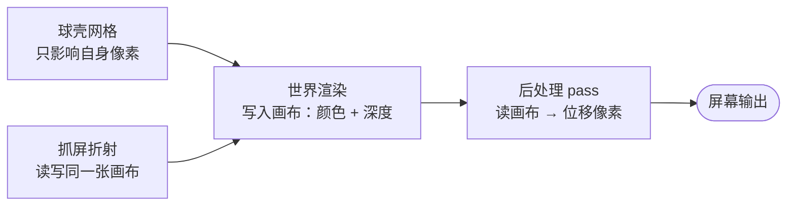
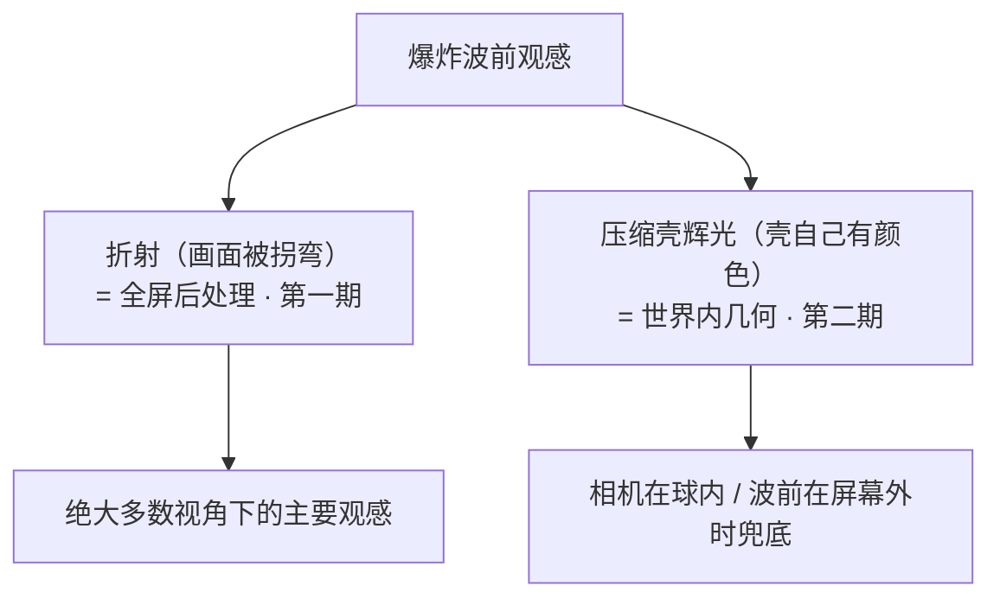

# Machine-Max 武器系统 — 爆炸波前视觉设计

> 状态：设计阶段，待审阅
> 创建时间：2026-09-17
> 适用对象：爆炸波前的屏幕空间折射（第一期）、世界内薄壳辉光（第二期）
>
> **本文自包含**：全部符号、公式与判据均在文内定义，可独立阅读与实现，**不要求先读其他文档**。
> 另有三处对外引用，且都标注了具体位置，不影响本文的完整性：
>
> - `武器系统-爆炸系统详细设计.md` —— 爆炸**逻辑侧**（射线传播、场强折算、终端效应）的设计出处。本文只依赖它的两个**派生量**：波前半径与参数集。§三 列出了本文用到的全部成员，因此不读它也能实现本文。
> - `武器系统-爆炸系统接口设计.md` —— `BlastFrontVisual` 的类图与签名出处。同样地，§3.1 复述了本文用到的成员。
> - `neoforge-21.1.219-minecraft-sources.jar` —— 附录 C 逐条记录了本文断言的**原版实现事实与行号**。它是证据而不是前提：每一条契约都已在正文写明，不读源码也能实现本文。
>
> **本文只描述"画面怎么变"，不描述"伤害怎么算"**：折射参数不参与任何终端判据，反向亦然。

***

## 阅读顺序

```text
第一部分  决策与依据    要做什么、为什么这样做
第二部分  契约与通道    客户端手上有什么、走哪条通道
第三部分  着色器设计    逐项公式与退化情形
第四部分  落地          实施步骤、验收标准、风险
附录 A                   投影、深度与线性代数
附录 B                   参考出处与外部手法
附录 C                   已核验的原版实现事实（含行号证据）
```

两条贯穿全文的约束，先写在前面：

1. **视觉只依赖两个量**：波前半径 $R$ 与参数集。客户端不持有射线，也拿不到逐条射线的 $E_r$（《爆炸系统详细设计》§13 明确"不逐条同步射线"），因此任何"按介质折减调制观感"的想法都必须放弃或另立同步契约。
2. **折射是"读画面"的活**，只能在画面画完之后做（§1.3）。这是本文选择全屏后处理而不是世界内几何的根本原因，不是性能偏好。

***

# 第一部分 · 决策与依据

## 一、目标与范围

### 1.1 要做什么

| 期 | 内容 | 载体 |
| --- | --- | --- |
| 第一期 | **波前折射环**：以投影后的爆心为圆心，在波前所在的细环上做双极径向偏移，带深度剔除与色散 | 全屏后处理 pass |
| 第二期 | **压缩壳辉光**：薄球壳的自发光/加法叠加，用于相机位于球内、波前在屏幕外、以及需要体积感的场合 | 世界内几何 + 自定义 RenderType |

第一期独立可用：没有第二期时，折射在大多数视角下已经是"爆炸在空气里推出一圈涟漪"的完整观感，只是相机钻进爆炸内部时会看不到东西。

### 1.2 不做什么

| 不做 | 理由 |
| --- | --- |
| 粒子 | 不属于折射的职责：起爆粒子由起爆包处理器在起爆点直接生成（`BlastDetonationEffects`），与波前半径无关 |
| 屏幕闪光 | 既有设施覆盖：镜头发抖由 `CameraShakeController` 承担，命中闪白由 `MMClientConfig.RENDER_HIT_WHITENING` 承担 |
| 逐条射线的可视化 | §13 的契约是"只同步起爆事件"，逐射线表现会立刻破坏该契约 |
| 真正的光线弯曲 / 体积光 | 需要沿视线多次采样深度做 ray march，逐像素成本比本文方案高一到两个数量级 |
| 地形破坏的裂纹贴图 | §13 已有契约（由本 tick 的 $D/\text{阈值}$ 驱动），与本文无关 |
| 新增内容包 JSON 字段 | §7.1：折射参数与威力无关，进 JSON 只会让内容包膨胀 |

### 1.3 为什么折射必须走全屏后处理

实时渲染不追踪光线，它每帧**先把整个世界画到一张画布上**（`RenderTarget`：一张颜色纹理 + 一张深度纹理），画布画完之后再交给后续步骤。由此产生一个不可绕过的区分：

| 做法 | 能做的事 | 能不能做折射 |
| --- | --- | --- |
| **在世界内画几何**（球壳网格 + RenderType） | 只能决定"球壳自己覆盖的那些像素显示成什么颜色" | **不能**。球壳背后的像素属于地形与别的载具，球壳的着色器看不到它们 |
| **读画布再写回画布**（全屏后处理 pass） | 把画布当贴图采样，按公式把每个像素换位置取色 | **能**。折射的定义就是"背后的画面被挪了位置" |



图中两条支路都是"在世界内画几何"：

- **球壳网格**（第二期采用）：只往画布写颜色，天然适合做辉光；顺带白拿几何自身的深度测试。
- **抓屏折射**：在世界内画网格、却在片元里读画布（Spark-Core 现有着色器即此路线）。它的遮挡判断是免费的（网格过不了深度测试的像素自然不会被改），但代价是**同一次绘制里同时读和写同一张纹理**——GL 层面属于未定义行为，桌面驱动一般能跑但不保证；而且它只能影响网格自身覆盖到的像素，也拿不到背景的距离信息。本文不采用该路线，理由见 §4.1。

***

## 二、物理依据

### 2.1 折射来自密度梯度

空气的折射率与密度成正比（Gladstone–Dale 关系）：

$$n - 1 = K\,\rho \qquad (K \approx 0.226\ \mathrm{cm^3/g}\ \text{（空气）})$$

爆炸波前是一层**被压缩的空气**：波前处密度突然升高，波后进入稀疏相（低于环境密度）。于是沿径向的折射率剖面是"先是阶跃，再缓慢回落、穿过环境值、降到最低、再回升"，而**光线偏折的方向和大小取决于折射率的空间梯度**，不取决于折射率本身。

这条结论直接决定了两件事：

1. 折射强度在前缘（密度阶跃处）达到峰值，向内侧迅速衰减 —— 观感是**一圈细环**而不是一整团。
2. 梯度在前缘与稀疏相**符号相反** —— 观感是**双极**的：环的外侧像被推出、内侧像被拉回，交界处出现图像反转带。这正是"水珠/透镜"观感的来源。

### 2.2 剖面形状：从 Friedlander 波形到实现用的双极对

超压随距离的标准描述是**修正 Friedlander 波形**（爆炸声学与冲击波力学的通用参考波形）：

$$\frac{p(\tau)}{p_{\max}} = (1-\tau)\,e^{-\tau}, \qquad \tau \ge 0$$

$\tau$ 是从波前起算的归一化距离（向内为正），$\tau=1$ 处压力穿过环境值，之后进入负相。

对 $\tau$ 求导得到**梯度剖面** —— 真正驱动物理偏折的是密度梯度，不是密度本身：

$$\frac{d}{d\tau}\Big[(1-\tau)e^{-\tau}\Big] = (\tau - 2)\,e^{-\tau}$$

该函数在 $\tau = 0$ 处取 $-2$（前缘最陡），在 $\tau = 2$ 处穿过零点，在 $\tau = 3$ 处取到正极值 $e^{-3}\approx 0.05$，之后迅速归零。归一到前缘 $=-1$ 后，**后沿只剩 $+0.025$**，比例约 1:40。

> **为什么不能直接把它当实现。** 1:40 的双极在屏幕上与"单极向内吸"没有可辨识差别，观感会从"环"退化成"一圈鱼眼涂抹"。真实冲击波确实前缘远强于负相，但画面需要的是**看得见的边缘**。因此实现时把两个波瓣的形状分离出来，用一个比例旋钮合成：

```glsl
// 双极剖面：前缘（压缩，向内）峰值在 t=0，后沿（稀疏，向外）峰值在 t=1
// LOBE_BALANCE 控制后沿相对幅度：0 = 只剩前缘；0.7 以上开始像对称的 N 波
float gradient(float t) {
    float lead  = -exp(-4.0 * t * t);                     // t=0 → -1
    float trail =  exp(-4.0 * (t - 1.0) * (t - 1.0));     // t=1 → +1
    return lead + LOBE_BALANCE * trail;
}
```

两个高斯衰减很快：前缘那个在 $t=-1$ 处降到 $1.8\%$，后沿那个在 $t=2.5$ 处降到 $10^{-4}$。因此**剖面自带有限支撑**，有效范围取 $t\in[-1,\ 2.5]$ —— 这是"细环"在公式层面的保证，也意味着代码里可以放心地截断（截断阈值必须取在这个范围之外，否则会在环的外缘留下可见的硬边）。

### 2.3 薄壳 ⇒ 细环，不是气泡

| 量 | 取值 | 后果 |
| --- | --- | --- |
| 壳层厚度 $W$ | 0.2 – 0.5 m（**常量**） | 单个波瓣的厚度，两侧支撑合计 $3.5W$（每瓣的半高全宽约 $0.83W$）。$R$ 增大时 $W$ 不变，环在屏幕上相对变细 |
| 屏幕单瓣宽下限 $W_{\min}$ | 5 – 8 px | 远处不至于细到看不见，也避免采样抖动 |
| 偏移峰值 $\delta_{\max}$ | 10 – 14 px | 足够"看得出来"，又不至于像画面错位 |
| 波瓣平衡 $c_b$ | 0.3 – 0.4 | §2.2 的 `LOBE_BALANCE`：小于它时后缘几乎看不见 |

> **$W$ 必须是常量，不能与 $R$ 成比例。** 若写成 $W = kR$，环会随半径一起变粗，观感立刻退化成"整颗球在扭"，§2.1 的物理依据也就没了。

### 2.4 与"水珠"类比的一致与差别

| | 水珠 | 爆炸波前 | 对实现的影响 |
| --- | --- | --- | --- |
| 梯度位置 | 集中在边缘（薄壳 + 大曲率） | 集中在波前（薄壳） | 一致：两者都是**边缘效应**，中心几乎不偏折 |
| 半径变化 | 静态 | 随时间膨胀 | 不需额外处理：$R(t)$ 已经是现成输入 |
| 强度时程 | 恒定 | 随距离快速衰减 | 需要 $\propto 1/R$ 的振幅衰减（§3.2） |
| 时间尺度 | 任意长 | 可任意长（本模组的波前速度是游戏性选择） | 需要时间包络，否则会"卡住不动"（§3.2） |

结论：**"像水珠"这个方向是对的，但落点是"环 + 双极"，不是"整颗球一起扭"**。公式层面已经排除了后者：剖面只有**有限支撑**，壳体深处与波前外侧的远端都不产生偏移（§5.6）。

***

# 第二部分 · 契约与通道

## 三、客户端手上的数据

### 3.1 既有成员（不改语义）

来自 `BlastFrontVisual`（客户端表现条目，每发起爆一个，由 `ExplosionManager` 持有与淘汰）：

| 成员 | 含义 | 本文用途 |
| --- | --- | --- |
| `origin()` | 起爆点（世界坐标，`Vector3f` / JME） | 换算到视空间（§A.1） |
| `params()` | 参数集 `ExplosionParams` | 取 `frontSpeed`、`nearRadius`、`maxRadius` |
| `seed()` | 起爆种子 | 第二期的噪声相位；第一期不使用 |
| `age()` | 年龄，起爆为 0，每次推进自增 | 推 $R(t)$ |
| `frontRadius()` | $R = age \times frontSpeed / 20$ | 屏幕半径 |

### 3.2 三张必须现算的表

| 派生量 | 公式 | 说明 |
| --- | --- | --- |
| 距离衰减 $a_d$ | $a_d = near\_radius / \max(R,\ near\_radius)$ | 振幅按 $\propto 1/R$ 衰减（振幅是压力的量类，压力按 $1/R$ 衰减）。与逻辑侧 `BlastField.rayIntensity` 在 $E_r = 1$ 时同源：那里是强度 $\propto 1/R^2$，其**平方根**即 $1/R$ |
| 时间包络 $a_t$ | $a_t = \text{smoothstep}(0, s_{in}, s)\cdot\big(1-\text{smoothstep}(s_{out}, 1, s)\big)$，其中 $s = R / max\_radius$ | 两端平滑；末段归零，避免波前到达 `maxRadius` 时被硬切 |
| 强度 $A$ | $A = a_d \cdot a_t \cdot c_{intensity}$ | $c_{intensity}$ 是客户端配置倍率（§7.2），其余两项都在 $(0,1]$ |

屏幕偏移峰值：$\delta = \delta_{\max} \cdot A$。

> **为什么用"归一化进度"而不是"秒"做包络。** $s = R/max\_radius$ 与波前速度无关，因此 1 m/s 与 100 m/s 的爆炸观感形状一致，只有快慢不同 —— 这正好满足"任意传播速度"的设计目标（§8 中 P1 的验收标准查的就是这一项）。若写成"起爆后 0.3 秒内淡入"，则 2 m/s 的爆炸会在波前只走了 0.6 m 时就结束包络，观感完全跑偏。

### 3.3 任意速度下的解耦

被允许进入着色器的量只有：$R$（世界 m）、$\delta$（px）、$W$（m）、爆心的视空间深度 $z_f$（m）、色散系数 $\chi$。**波前速度不进入任何公式**（$R$ 的计算里已经含了它，仅此一次）。因此：

- 极慢（例：2 m/s）：环缓慢外移、缓慢变淡，不会"卡住"，因为 $a_d$ 与 $a_t$ 都在持续下降。
- 极快（例：200 m/s，一帧跨数格）：不会产生拖影 —— 屏幕上移动的是一个**逐帧重新求值的偏移场**，不是一张被拖动的纹理；只要 $R$ 逐帧插值（§3.4），观感就是连续的。
- **不要**引入"按速度调亮度"一类的耦合：那会让不同速度的爆炸看起来是两种东西。

### 3.4 插值与节拍

推进挂在 `PhysicsSnapshotReadyEvent` 上，而该事件由 `LevelTickEvent.Pre` 触发（`PhysicsLevelApplier.mcLevelTask` → `PhysicsLevel.requestStep`），因此**正常情况是每主线程 tick 一次**，与客户端 tick 同拍。

渲染帧率高于 20 时，直接用 `frontRadius()` 会肉眼可见地跳格。做法：

- `BlastFrontVisual` 在每次推进前保存上一帧半径：`prevRadius = frontRadius`（在 `tick()` 开头）。
- 新增 `frontRadius(float partialTick)`：在 `prevRadius` 与 `frontRadius()` 之间线性插值。
- 插值**只用于表现**，不写回年龄；逻辑侧仍按整数步推进。

> **已知无害偏差**：物理线程过载导致快照被跳过时（`PhysicsSnapshotReadyEvent` 的注释明确该事件率会随之变稀），插值进度会落后半帧以内。因为 $R$ 是年龄的**线性**函数，下一帧即自愈，不需要额外补偿。

## 四、通道选型

### 4.1 两条通道的性质对照

| 维度 | 全屏后处理 pass | 世界内网格抓屏折射 |
| --- | --- | --- |
| 能否实现折射 | 能（读画布） | 能，但需在同一绘制里读写同一纹理 |
| 遮挡判定 | 采样深度纹理，逐像素精确 | 依赖网格自身深度测试，等价但粒度粗 |
| 相机在球内 | 退化（球面包住相机，无环可言） | 仍能看到壳层 |
| 多发的成本 | 固定：一个 pass 处理 $N_{\max}$ 发 | 随发数线性增长 |
| 屏幕外 / 被遮挡的发 | 几乎免费（不产生像素） | 几乎免费（被剔除） |
| 复用既有基建 | `PostProcessingManager` + `PostChain` 链路已就绪 | 需自建 RenderType + 采样绑定 |

> **为什么不需要"透视校正"。** 折射是**角度偏折**：一条视线穿过壳层后被偏转的角度，与它最终打到多远的东西无关，因此屏幕位移在像素空间里近似恒定 —— §5.6 里的 $\delta$ 就是一个与背景深度无关的量。真正必须依赖深度的只有一件事：**这个像素该不该被扭曲**（波前是否在它前面）。

### 4.2 分工结论



**两者不是二选一**：折射负责"读画面"，辉光负责"写画面"，能力互补。第一期只有折射时，唯一明显缺口是相机进入壳体内部的那一刻。

***

# 第三部分 · 着色器设计

## 五、后处理通道详细设计

### 5.1 挂载点与生命周期

复用既有基建，不新起一套：

| 事项 | 做法 | 参照物 |
| --- | --- | --- |
| 执行时机 | `RenderLevelLastEvent`（所有世界渲染完成、手部渲染之后） | `PostProcessingManager.onRenderLevelLast` |
| 执行顺序 | **折射最先**，其后才是过载黑视与失色 —— 折射要读未染色的画面 | `PostProcessingManager.onRenderLevelLast` 内调整调用顺序 |
| 加载 | 首帧懒加载 `PostChain` | `CrtMonitorEffect.load()` |
| resize | 缓存窗口尺寸，变化时 `chain.resize(w, h)` | `CrtMonitorEffect.render` 中的尺寸比对 |
| 释放 | 退出世界时 `dispose()` | `PostProcessingManager.disposeAll()` |
| 开关 | 无活跃爆炸 → **整条 pass 不执行**；另有客户端配置总开关 | `CrtMonitorEffect.enabled` 的模式 |

### 5.2 资源清单

```text
assets/machine_max/
├── shaders/post/blast_distortion.json      链定义：main → swap → main
└── shaders/program/
    ├── blast_distortion.json               程序定义：采样器、attributes、uniform 默认值
    ├── blast_distortion.vsh                直通顶点着色器（与 crt_monitor.vsh 同构）
    └── blast_distortion.fsh                本体（§5.6）
```

`post/blast_distortion.json` 与既有的 `post/overload_vision.json` 同构：

```json
{
    "targets": ["swap"],
    "passes": [
        {
            "name": "machine_max:blast_distortion",
            "intarget": "minecraft:main",
            "outtarget": "swap",
            "use_linear_filter": true,
            "auxtargets": [
                { "name": "MCDepthSampler", "id": "minecraft:main:depth" }
            ]
        },
        { "name": "blit", "intarget": "swap", "outtarget": "minecraft:main" }
    ]
}
```

pass 节点只认 `name` / `intarget` / `outtarget` / `use_linear_filter` / `auxtargets` 五个字段；uniform 的声明与默认值写在**程序 JSON**（`shaders/program/blast_distortion.json`）里，链 JSON 不参与。`targets` 除 `swap` 外不需要别的 —— 深度直接引用主目标（§5.7）。

### 5.3 每帧的数据装配（Java 侧）

```java
// BlastDistortionEffect.render(partialTick)
// 1. 收集：ExplosionManager.get(level).visuals() —— 需新增只读视图（与 activeInstances() 同风格）
// 2. 取本帧投影矩阵的 m11 → FocalPx；由同一矩阵标定 DepthA / DepthB（§A.2，链加载时算一次）
// 3. 逐发：世界坐标 → 视空间（先减相机位置，再乘视图旋转矩阵）；算 R、W、δ、χ → 写入 float[32]
// 4. 有发则全量写数组 uniform 并 chain.process(partialTick)，再重新绑定主目标；无发则直接返回
```

全部公式见 **附录 A**。CPU 侧只做标量运算，无 3D 几何、无网格、无物理体访问。

### 5.4 Uniform 契约

> **禁止依赖 `ProjMat`。** 后处理程序里的 `ProjMat` **不是**相机投影矩阵：`PostPass.process()` 每帧执行 `safeGetUniform("ProjMat").set(this.shaderOrthoMatrix)`，而该矩阵来自 `PostChain.updateOrthoMatrix()` 的 `new Matrix4f().setOrtho(0, screenTarget.width, 0, screenTarget.height, 0.1F, 1000.0F)` —— 它是**像素空间正交矩阵**，且每帧被覆盖。仓库内 [inspector_highlight.vsh](file:///d:/Files/Project_MinecraftMods/Machine-Max/src/main/resources/assets/machine_max/shaders/program/inspector_highlight.vsh#L5) 的注释也如此标注，全屏 quad 的顶点本身就是像素坐标。把米制视空间坐标喂进去，`clip.z/clip.w` 没有意义。证据行号见附录 C。

| 名称 | 类型 | 单位 | 谁写 | 含义 |
| --- | --- | --- | --- | --- |
| `DiffuseSampler` | `sampler2D` | — | 链 | 画布颜色 |
| `MCDepthSampler` | `sampler2D` | — | 链（auxtarget） | 画布深度（非线性 0..1） |
| `InSize` / `OutSize` | `vec2` | px | 链 | 输入/输出尺寸 |
| `Time` | `float` | — | 链（= partialTicks） | 帧间插值量；**不是**墙钟时间 |
| `FocalPx` | `float` | px | CPU | 像素焦距 $f$（§A.1） |
| `DepthA` / `DepthB` | `float` | — | CPU | 深度换算系数，满足 $d_{tex} = \text{DepthB}/z - \text{DepthA}$（§A.2） |
| `BlastCount` | **`float`** | — | CPU | 有效发数，$0 \le \text{BlastCount} \le N$ |
| `BlastView` | **`float[32]`** | m | CPU | 8 发 × `(视空间爆心 xyz, 世界半径 R)` |
| `BlastShape` | **`float[32]`** | m, px, —, — | CPU | 8 发 × `(壳层厚度 W, 偏移峰值 δ, 色散系数 χ, 备用)` |

三处类型选择都不是风格问题，而是原版 API 的硬约束（证据见附录 C）：

- **`BlastCount` 必须是 `float`**：`int` uniform 的 `floatValues` 字段为 `null`，而 `PostChain.setUniform(String, float)` 内部就是 `safeGetUniform(name).set(float)`，它在 `int` uniform 上会直接抛 NPE —— 不是静默失效，是崩。着色器里用 `int(BlastCount)` 取整。
- **数组声明为扁平 `float[32]` 而不是 `vec4[8]`**：JSON 侧的上传路径是 `glUniform1fv`，与扁平数组一一对应，无需赌"`glUniform1fv` 能否填充 `vec4` 数组"。
- **`Time` 是 partialTicks**：若将来要做噪声动画，需要自己传墙钟时间。

### 5.5 数组 uniform 的写入与 JSON 契约

`PostChain` 对外只有 `setUniform(String, float)`，**只能写单发标量**；数组必须拿到 `PostPass` 的引用。三条路径：

| 路径 | 做法 | 代价 |
| --- | --- | --- |
| **A（首选）** | `@Accessor` Mixin 暴露 `PostChain#passes`，取目标 `PostPass` 的 `getEffect().safeGetUniform(name)`，强转 `Uniform` 后 `set(float[])` | 一个 Mixin 类，并注册进 `machine_max.mixins.json` 的 `client` 数组 |
| B（无 Mixin） | 把该 pass 从 JSON 里去掉，改为代码中 `chain.addPass(name, in, out, useLinearFilter)` 自建并长期持有返回的 `PostPass` | 链的顺序改由代码决定（`addPass` 追加到末尾，blit 也要一并自建） |
| C（退化） | 只支持最近的两发，全部走标量 uniform | 无数组、无 Mixin，但 $N$ 掉到 2 且 uniform 名字成倍膨胀 |

**JSON 契约**（A、B 同构，逐条已核验）：

- `type` 只认 `int` / `float` / `matrix4x4`。数组写 `"type": "float"` + `"count": 4N`。`count > 4` 的 **int** 数组不可用（解析与上传都只处理前 4 个分量）。
- `values` 的元素个数必须等于 `count`，否则解析阶段直接抛 `ChainedJsonException`；只有"给 1 个元素"是合法的，它会被复制满 `count` 个槽位。
- **解析期只写前 4 个分量**：`count > 4` 的 float uniform 走 `setSafe(afloat[0..3])`，其余槽位是 `memAllocFloat` 出来的**未初始化内存**。因此数组 uniform 必须在每帧渲染前用 `set(float[])` 全量写入，不能依赖 JSON 默认值。
- `safeGetUniform` 在程序未声明该 uniform 时返回 `DUMMY_UNIFORM`（不是 null）；对它的强转会抛 `ClassCastException`，所以写数组前要先确认程序 JSON 里确实声明了它。

### 5.6 片元着色器本体

```glsl
#version 150

uniform sampler2D DiffuseSampler;
uniform sampler2D MCDepthSampler;
uniform vec2  OutSize;
uniform float FocalPx;          // 像素焦距 f（§A.1）
uniform float DepthA;           // d_tex = DepthB / z - DepthA（§A.2）
uniform float DepthB;
uniform float BlastCount;       // 用 float：int uniform 无法经 set(float) 写入（§5.4）
uniform float BlastView[32];    // 每发 4 个：视空间爆心 xyz、世界半径 R
uniform float BlastShape[32];   // 每发 4 个：壳层厚度 W(m)、偏移峰值 δ(px)、色散 χ、备用

in  vec2 texCoord;
out vec4 fragColor;

const float NEAR_Z       = 0.05;   // 原版近平面：用于剔除相机内部与背后的像素
const float DEPTH_EPS_M  = 0.05;   // 深度容差，**米**
const float LOBE_BALANCE = 0.35;   // 后缘相对幅度（§7.3）
const float T_MIN        = -1.0;   // 剖面支撑外边界（§2.2）
const float T_MAX        =  2.5;   // 剖面支撑内边界（§2.2）

// 双极剖面：前缘（向内）峰在 t=0，后缘（向外）峰在 t=1（§2.2）
float gradient(float t) {
    float lead  = -exp(-4.0 * t * t);
    float trail =  exp(-4.0 * (t - 1.0) * (t - 1.0));
    return lead + LOBE_BALANCE * trail;
}

void main() {
    vec4 src = texture(DiffuseSampler, texCoord);
    vec2 px  = texCoord * OutSize;

    // 本像素的视空间视线方向（未归一化时 z 分量为 -1）
    vec2  q   = vec2((px.x - OutSize.x * 0.5) / FocalPx,
                     (OutSize.y * 0.5 - px.y) / FocalPx);
    float L   = sqrt(1.0 + dot(q, q));
    vec3  dir = vec3(q, -1.0) / L;

    // 深度纹理 → 视空间米制距离（任何透视投影的深度都线性于 1/z，见 §A.2）
    float zBuf   = texture(MCDepthSampler, texCoord).r;
    float zScene = DepthB / (zBuf + DepthA);
    if (zScene <= 0.0) zScene = 1e9;          // 背景/远平面：永不遮挡

    vec2  acc  = vec2(0.0);
    float amp  = 0.0;
    float chro = 0.0;

    for (int i = 0; i < int(BlastCount); i++) {
        vec3  C     = vec3(BlastView[i*4], BlastView[i*4+1], BlastView[i*4+2]);
        float R     = BlastView[i*4+3];
        float W     = BlastShape[i*4];
        float delta = BlastShape[i*4+1];
        if (R < NEAR_Z || W <= 0.0) continue;

        // 爆心到本像素视线的垂距：精确值，不做"屏幕圆"近似
        float tc    = dot(C, dir);                    // 眼到垂足的距离
        float perp2 = max(dot(C, C) - tc * tc, 0.0);
        float perp  = sqrt(perp2);

        float t = (R - perp) / W;                     // 到波前的归一化距离，向内为正
        if (t < T_MIN || t > T_MAX) continue;         // 波前之外与壳体深处都不处理

        // 近侧交点：垂距 > R 时退化为"最接近点"，在 perp = R 处连续
        float zFront = (tc - sqrt(max(R * R - perp2, 0.0))) / L;
        if (zFront < NEAR_Z) continue;                // 相机在球内，或交点在相机背后
        if (zScene < zFront - DEPTH_EPS_M) continue;  // 被前景遮挡

        // 屏幕径向方向：爆心的屏幕投影 → 本像素
        vec2 centerPx = vec2(OutSize.x * 0.5 + FocalPx * C.x / -C.z,
                             OutSize.y * 0.5 - FocalPx * C.y / -C.z);
        vec2 dirPx    = px - centerPx;

        float g = gradient(t) * delta;
        acc  += normalize(dirPx + vec2(1e-5, 1e-5)) * g;
        amp  += abs(g);
        chro  = max(chro, abs(g) * BlastShape[i*4+2]);
    }

    if (amp <= 1e-4) { fragColor = src; return; }     // 无生效像素：原样输出

    vec2 uR = texCoord + acc * (1.0 + chro) / OutSize;
    vec2 uG = texCoord + acc / OutSize;
    vec2 uB = texCoord + acc * (1.0 - chro) / OutSize;
    fragColor = vec4(texture(DiffuseSampler, uR).r,
                     texture(DiffuseSampler, uG).g,
                     texture(DiffuseSampler, uB).b,
                     src.a);
}
```

五个设计点：

1. **剖面自带有限支撑** —— `t` 落在 `[T_MIN, T_MAX]` 之外直接跳过：波前之外与壳体深处都没有扰动。这条判断从公式层面排除了"整颗球在扭"的错误形态。
2. **环是精确的锥截面，不是屏幕上的圆** —— 判据是"爆心到视线的垂距落在 $[R-W,\ R+W]$ 附近"，其几何含义正是"这条视线掠过了球壳"。因此屏幕角落处也精确，不存在用屏幕圆半径近似带来的离轴误差（§A.1）。
3. **深度在米制空间比较** —— `DepthA`/`DepthB` 把非线性深度还原成"离相机多少米"，容差因此是 `DEPTH_EPS_M = 0.05 m` 这样的物理量，与深度的非线性无关。
4. **色散用三通道独立采样** —— $\chi$ 取 0.10–0.15，只让偏移量在三个通道间差 ±10% 左右；这一项对"玻璃/水珠"质感的贡献，远大于单纯加大偏移量。
5. **多个爆炸线性叠加** —— 偏移量直接相加，$N=8$ 时每像素至多 8 次视线-球求交（各约 20 条 ALU），无分支发散压力。

### 5.7 深度的获取与比对

**一条 auxtarget 就够**：`PostChain.parsePassNode` 对 `:depth` 后缀先剥掉后缀，再交给 `getRenderTarget`，而后者对 `"minecraft:main"` 直接返回主目标本身（附录 C）。因此主目标的深度可以不经声明、不经拷贝地采样：

```json
"auxtargets": [ { "name": "MCDepthSampler", "id": "minecraft:main:depth" } ]
```

备选：若某版本对 aux id 的解析有出入，改为把主目标深度复制进链的临时目标（`OffscreenFbo.copyMainDepth` 即此路径）后以 `mcdepth:depth` 引用，此时 `mcdepth` **必须**写进 `targets` —— 引用了未在 `targets` 里声明的名字时解析器抛 `ChainedJsonException("Render target '...' can't be used as depth buffer")`，整条链加载不起来。

**采样滤镜**：pass 节点支持 `"use_linear_filter": true`，缺省 false（NEAREST）。细环叠加色散属于亚像素位移，NEAREST 会出现台阶感，因此本 pass 显式打开。

**比对在米制空间做**（推导与标定见 §A.2）：`DepthA`/`DepthB` 把采样到的深度换算成"离相机多少米"，与近侧交点的米制深度直接相减，容差 `DEPTH_EPS_M` 因此有物理含义。这条路同时绕开两个坑：不使用被每帧覆盖的 `ProjMat`（§5.4），也不需要知道原版的近/远平面常量。

### 5.8 退化情形

| 情形 | 判据 | 处理 |
| --- | --- | --- |
| 交点落在相机背后（含相机位于球内） | 该像素的 `zFront < NEAR_Z` | 逐像素跳过，无需 CPU 提前剔除整发 |
| 爆心在相机背后 | CPU 侧 `C.z >= 0` | 跳过该发（屏幕径向方向会翻转） |
| 壳层厚度退化 | `W <= 0` | 跳过（着色器内已判） |
| 环在屏幕上过细 | $W f / z_f < W_{\min}$ | CPU 侧把 $W$ 抬到 $W_{\min} z_f / f$（世界单位），着色器只见到合法值 |
| 深度为背景 | `zScene <= 0` | 视为无穷远，不遮挡 |
| 发数超上限 | `BlastCount > N` | 取 $\delta$ 最大的 $N$ 发，其余丢弃 |
| 无活跃爆炸 | `BlastCount == 0` | pass 不执行（CPU 侧提前返回，零成本） |
| 窗口 resize | 尺寸变化 | `chain.resize(w, h)`；公式全部按像素与米计算，无需其他改动 |

### 5.9 性能预算

| 项 | 量级 |
| --- | --- |
| 每像素成本 | 1 次深度采样 + `N` 次（约 20 条 ALU + 1 次 `sqrt`）+ 3 次颜色采样 |
| 满屏 1920×1080、$N=3$ | 约 200 万像素 × 约 80 条指令 —— 属于后处理常规量级，与既有的 CRT/失色同档 |
| 无爆炸时 | 0（pass 不提交） |
| 不采样的部分 | 环外像素只付出"距离计算 + 提前 continue"的成本 |

> **注意**：这是**每帧固定**成本，与爆炸发数无关（多发摊在同一个 pass 里）。因此"同屏同时很多发"不会造成帧率随发数崩塌，只会让每像素的循环变长。

***

## 六、世界内薄壳通道（第二期）

### 6.1 用途

| 场景 | 折射是否够用 | 辉光壳的作用 |
| --- | --- | --- |
| 常规第三人称观察爆炸 | 够 | 增强"压缩空气被点亮"的体积感 |
| 相机位于球内（爆炸就在脚下/脸上） | 不够（§5.8） | 主承载：视野边缘一圈亮弧 |
| 波前已扩到屏幕外 | 部分够（环不可见） | 主承载：屏幕边缘的辉光与亮度抬升 |

### 6.2 几何与渲染

- 几何：低面数球壳（经纬网格 32×16 量级），随 $R$ 逐帧缩放，不需要重建。
- 材质：加法混合的 `RenderType`（项目已有 `MMRenderTypes` 与 `RenderTypeUtil` 基建，另有将局部高度裁剪的 `hclip` 作为参考），复用 §2.2 的同一个剖面函数，保证两个通道的观感同源。
- **不透明度按"视线在壳层内的行程"给，不按"到中心的距离"给**：单层球面网格上，每个片元到中心的距离恒等于 $R$，那个判据没有分辨力，只会渲染出一整块亮盘。可用的判据是行程长度

$$L_{shell} \approx \frac{2W}{\lvert \hat n \cdot \hat v \rvert}$$

  $\hat n$ 为片元法线、$\hat v$ 为该片元的视线方向：掠射时行程长、正对时行程短，亮环因此自然出现在轮廓上。对 $L_{shell}$ 做一次饱和即得不透明度。这是薄壳辉光的标准做法，等价于"用 $1/\lvert\cos\rvert$ 顶替 Fresnel 项"。
- 剔除：`RenderType` 需关闭深度写入、开启深度测试（被地形遮挡时不发光）。

### 6.3 与折射的叠加顺序

辉光在世界内绘制（进入画布），折射在画布完成后读取画面 —— 顺序天然正确，**辉光会被折射一并扭曲**，这是期望行为。

***

# 第四部分 · 落地

## 七、参数与配置的边界

### 7.1 内容包 JSON：不新增字段

折射参数与爆炸威力无关：$W$、$\delta_{\max}$、$\chi$ 都是"看"的参数，不应由每一发爆炸的内容包定义，否则同一发爆炸在不同包里的观感不一致，且内容包作者需要理解光学量。

### 7.2 客户端配置（`MMClientConfig`）：只放玩家需要改的

| 配置项 | 类型 | 默认 | 说明 |
| --- | --- | --- | --- |
| `BLAST_DISTORTION_ENABLED` | bool | true | 总开关。关闭后 pass 不加载、不执行 |
| `BLAST_DISTORTION_INTENSITY` | double | 1.0 | 强度倍率 $c_{intensity}$，0.0–2.0 |

### 7.3 代码常量（按所有权分两处）

**Java 侧**（`BlastDistortionEffect`）—— 数值策略，不需要重编着色器就能调：

| 常量 | 符号 | 默认 | 单位 |
| --- | --- | --- | --- |
| `SHELL_THICKNESS` | $W$ | 0.30 | m |
| `MIN_RING_WIDTH_PX` | $W_{\min}$ | 7 | px（单瓣） |
| `MAX_OFFSET_PX` | $\delta_{\max}$ | 12 | px |
| `CHROMA_RATIO` | $\chi$ | 0.12 | — |
| `FADE_IN_PROGRESS` | $s_{in}$ | 0.06 | — |
| `FADE_OUT_PROGRESS` | $s_{out}$ | 0.75 | — |
| `MAX_BLASTS` | $N$ | 8 | — |
| `CALIB_Z_NEAR` / `CALIB_Z_FAR` | — | 1 / 256 | m（§A.2 的两点标定深度） |

**着色器侧**（`blast_distortion.fsh` 的 `const`）—— 形态学，改它等于改剖面本身：

| 常量 | 符号 | 默认 | 单位 |
| --- | --- | --- | --- |
| `LOBE_BALANCE` | $c_b$ | 0.35 | — |
| `T_MIN` / `T_MAX` | $t_{\min},\ t_{\max}$ | −1.0 / 2.5 | — |
| `DEPTH_EPS_M` | $\varepsilon$ | 0.05 | m |
| `NEAR_Z` | — | 0.05 | m |

**同名常量不允许同时存在于两处**：一个量只有一个所有者。判据是"改它要不要重编着色器"—— 要重编的留在 GLSL，不要的留在 Java 并作为 uniform 传入。

两处都不进配置，是为了让观感随版本整体演进；一旦某天需要暴露，再逐项上提。

## 八、实施步骤与验收标准

| 步 | 内容 | 验收标准 |
| --- | --- | --- |
| P0 | 骨架：链 + 程序 + 一个**恒定强度**的环（写死 $W$、$\delta$，无深度、无色散） | 屏幕上出现与爆心同步的细环；把环叠在已知位置的方块边缘上，**屏幕中心与屏幕角落都对齐**；波前出屏、相机位于球内时无异常；无爆炸时 pass 不执行（用 profiler 确认） |
| P1 | 剖面：`gradient(t)` + $W$ 常量 + $W_{\min}$ 钳制 + $a_d$、$a_t$ 包络 | 环呈"细环带双极"而非"整球扭"；把 `front_speed` 设为 2 / 20 / 200 m/s，观感形状一致、只有快慢不同 |
| P2 | 深度：先标定 `DepthA` / `DepthB`（§A.2），再按 `DEPTH_EPS_M` 剔除 | 站在墙后看爆炸，墙上的画面不被扯动；爆炸在相机上/下方时近处地面不被扯动；波前越过某个方块时，前后画面在交点处正确切换；把相机放进爆炸内部，环平滑消失且画面无破图 |
| P3 | 色散 + 多发（$N$ 槽位）+ 客户端配置 | 先做一次"只写 1 发、把数组值直接输出成颜色"的最小验证（§5.5 契约）；随后两发相邻爆炸同时可见时互不干扰、偏移叠加自然；关闭配置后 pass 完全不提交 |
| P4 | 第二期：世界内薄壳辉光 | 相机钻进爆炸内部时视野边缘有亮弧；从远处看辉光与折射环位置一致 |

P0–P3 每步都可独立提交、独立回退。P1 完成时已经可用于内容包预览；P2 是"能拿去做正式画面"的门槛。

## 九、风险与待确认

| # | 事项 | 影响 | 处置 |
| --- | --- | --- | --- |
| 1 | 数组 uniform 需要拿到 `PostPass` 引用（§5.5 路径 A 要一个 Mixin） | 阻塞 P3 的多发 | 优先 A；Mixin 触雷则退 B（代码自建 pass），再退 C（$N=2$ 标量） |
| 2 | 数组 uniform 的 JSON 默认值不可用（解析期只写前 4 个分量，其余是未初始化内存） | 漏写一次就会取到垃圾值 | 每帧全量 `set(float[])`，且与 `process()` 处在同一条无分支的代码路径上 |
| 3 | 投影矩阵的 `m11` 与实际画面不一致（望远镜、细雪视效、座舱视角都会改 FOV） | 环与几何错位 | `FocalPx` 每帧从 `RenderLevelLastEvent` 携带的投影矩阵现算；P0 的验收明确要求"中心与角落都对齐" |
| 4 | 深度约定若变化（反向深度等） | 剔除方向反转 | §A.2 的两点标定对"深度线性于 $1/z$"的任何约定都成立，不假设方向；P2 的遮挡验收留作回归项 |
| 5 | 物理快照事件在过载时变稀（§3.4） | 插值落后不超过半帧 | 无需处置（$R$ 与年龄线性，下一帧自愈） |
| 6 | 与既有后处理的执行顺序 | 折射若在染色之后读画面，取到被染色的像素 | 固定顺序：折射 → 过载 → 失色（§5.1） |
| 7 | 部分老旧集显驱动对深度纹理在自定义链中的采样 | 剔除失效或画面异常 | P2 做成可开关；异常时退回 P1 的"无深度剔除"版本，观感仍可用 |
| 8 | 极慢速 + 长寿命下长时间存在屏幕扭曲 | 玩家可能觉得烦 | 由 $a_d$ 与 $a_t$ 双重衰减承担；实机若仍过强，只调 §7.3 的 Java 常量，不引入与速度相关的耦合 |

## 十、文件清单

```text
需要新建
  src/main/java/.../client/render/post/BlastDistortionEffect.java     效果本体（生命周期 + 数据装配）
  src/main/java/.../client/render/post/BlastProjectionUtil.java       视空间换算与 DepthA/DepthB 标定（§A.1、§A.2，纯静态）
  src/main/java/.../mixin/PostChainAccessor.java                      Accessor Mixin（§5.5 路径 A，MC 类故放 mixin/ 而非 mixin_native/）
  src/main/resources/assets/machine_max/shaders/post/blast_distortion.json
  src/main/resources/assets/machine_max/shaders/program/blast_distortion.json
  src/main/resources/assets/machine_max/shaders/program/blast_distortion.vsh
  src/main/resources/assets/machine_max/shaders/program/blast_distortion.fsh

需要改动（均为只增成员、不改动既有语义）
  client/render/post/PostProcessingManager.java    注册、每帧调用（折射最先）、dispose
  common/mech/explosion/BlastFrontVisual.java      加 prevRadius 与 frontRadius(partialTick)
  common/mech/explosion/ExplosionManager.java      加 visuals() 只读视图
  client/MMClientConfig.java                       开关与强度倍率
  src/main/resources/machine_max.mixins.json       把 PostChainAccessor 登记进 client 数组（路径 B 下不需要）
```

> 后四项在服务端不被读取（表现条目只在客户端建立），因此不影响逻辑侧行为。

***

# 附录 A · 投影、深度与线性代数

## A.1 世界坐标 → 视空间

`RenderLevelLastEvent` 携带的两个矩阵可以直接用：

- `getModelViewMatrix()` 是**纯旋转**（`GameRendererMixin` 里的构造是 `new Matrix4f().rotation(camera.rotation().conjugate())`，不含平移），
- `getProjectionMatrix()` 来自 `GameRenderer#getProjectionMatrix(fov)`，fov 已取"世界 FOV 与设置值中的较大者"。

于是 CPU 侧的换算只有两步：先平移 $\vec v = O - C$，再旋转 $\vec v_{view} = M_{view}\vec v$。视空间里 **$z$ 为负表示在相机前方**，前向深度 $z_f = -v_{view,z}$。

像素焦距直接取投影矩阵的 $m_{11}$：

$$f = \lvert m_{11}\rvert\cdot\frac{OutSize.y}{2}$$

（透视投影下 $m_{11} = 1/\tan(\text{fovY}/2)$，与"由 FOV 现算"等价，但少一次换算，并自动跟随望远镜、细雪视效、座舱视角等改变 FOV 的状态。）

**环的位置直接由视空间量求值，不需要爆心的屏幕投影。** 判据是"爆心到该像素视线的垂距"（§5.6），只需 $f$ 与视空间爆心即可精确求值。屏幕上的径向方向仍由爆心的投影给出：

$$
\text{center}_{px} = \Big(\frac{OutSize.x}{2} + f\frac{C_x}{z_f},\ \ \frac{OutSize.y}{2} - f\frac{C_y}{z_f}\Big)
$$

屏幕宽度只在两处用到：最小环宽钳制（§5.8）与"环有多细"的直觉描述。

## A.2 深度比对与 DepthA / DepthB 标定

画布深度纹理存的是非线性深度 $d_{tex}\in[0,1]$。常规做法是反投影成视空间距离，而那需要近/远平面：

$$z_{view} = \frac{2\,z_{near}\,z_{far}}{z_{far}+z_{near}-(2d-1)(z_{far}-z_{near})}$$

这条路要求实现者知道原版构造投影矩阵时所用的近平面（一个不对外暴露的常量），任一处失配都会让剔除边界整体偏移。**本文不用它**，改用两个标量系数把深度线性化 —— 任何透视投影（含反向深度一类的变体）都满足

$$d_{tex} = \frac{\text{DepthB}}{z} - \text{DepthA}$$

$z$ 为前向深度（米）。系数由**两点标定**求得，与投影约定无关：

1. 取两个已知前向深度 $z_1 = \text{CALIB\_Z\_NEAR}$、$z_2 = \text{CALIB\_Z\_FAR}$；
2. 对每个 $z$ 用当前相机投影矩阵投影点 $(0,0,-z)$，得到 $d_1 = d_{tex}(z_1)$、$d_2 = d_{tex}(z_2)$；
3. 反解

$$\text{DepthB} = \frac{d_1-d_2}{1/z_1-1/z_2},\qquad \text{DepthA} = \frac{\text{DepthB}}{z_1}-d_1$$

标定只在链加载与 FOV 变化时各做一次。逆变换同样直接：

$$z = \frac{\text{DepthB}}{d_{tex}+\text{DepthA}}$$

**近侧交点的米制深度**由视线-球求交给出（对应 §5.6 里的三行）：

$$\vec u = \frac{(q_x,\ q_y,\ -1)}{L},\quad L=\sqrt{1+q_x^{2}+q_y^{2}},\quad \perp^{2} = \lvert\vec C\rvert^{2}-\big(\vec C\cdot\vec u\big)^{2}$$

$$z_{front} = \frac{\vec C\cdot\vec u - \sqrt{\max(R^{2}-\perp^{2},\ 0)}}{L}$$

$\perp > R$（视线与球不相交）时根号项取 0，退化为"最接近点"的深度，并在 $\perp = R$ 处与球面解连续 —— 前缘瓣的外半侧正是靠这一点才有深度可比。判据：$z_{scene} < z_{front}-\varepsilon$ ⇒ 该像素比波前更近（被前景遮挡）⇒ 跳过。

第 2 步用球面近似（忽略地形与几何的局部形状），误差在"壳层厚度以内"，对"这一圈要不要被扭曲"这个二值判断足够。

## A.3 符号总表

| 符号 | 含义 | 单位 | 定义处 |
| --- | --- | --- | --- |
| $n$ | 折射率 | — | §2.1（仅物理依据，不进实现） |
| $\rho$ | 空气密度 | kg/m³ | §2.1 |
| $p,\ \tau$ | 超压／从波前起算的归一化距离 | — | §2.2 |
| $c_b$ | 波瓣平衡：后缘相对前缘的幅度（GLSL `LOBE_BALANCE`） | — | §2.2、§7.3 |
| $W$ | 壳层厚度（单瓣） | m | §2.3、§7.3 |
| $W_{\min}$ | 屏幕单瓣宽下限 | px | §2.3、§7.3 |
| $R_{px},\ W_{px}$ | 波前与壳层的屏幕宽度（只用于最小宽度钳制与直觉描述） | px | §A.1、§5.8 |
| $\delta,\ \delta_{\max}$ | 屏幕径向偏移／其峰值上限 | px | §3.2、§7.3 |
| $R$ | 波前半径 | m | §3.1 |
| $A$ | 强度 | 无量纲 $(0,1]$ | §3.2 |
| $a_d,\ a_t$ | 距离衰减／时间包络 | 无量纲 | §3.2 |
| $s$ | 归一化进度 $R/max\_radius$ | — | §3.2 |
| $N$ | 同屏处理的爆炸发数上限 | — | §5.4 |
| $t$ | 像素到波前的归一化距离（向内为正） | — | §5.6 |
| $t_{\min},\ t_{\max}$ | 剖面支撑的外／内边界（GLSL `T_MIN` / `T_MAX`） | — | §2.2、§7.3 |
| $\chi$ | 色散系数 | — | §5.6、§7.3 |
| $\varepsilon$ | 深度容差，米制（GLSL `DEPTH_EPS_M`） | m | §7.3、§A.2 |
| $C$ | 相机位置 | m | §A.1 |
| $O$ | 起爆点世界坐标 | m | §A.1 |
| $M_{view}$ | 视图旋转矩阵（事件携带的 `modelViewMatrix`，纯旋转） | — | §A.1 |
| $m_{11}$ | 投影矩阵对角元 $=1/\tan(\text{fovY}/2)$ | — | §A.1 |
| $f$ | 像素焦距 | px | §A.1 |
| $\vec C$ | 爆心的视空间位置（$z<0$ 表示在前方） | m | §A.1 |
| $z_f$ | 爆心前向深度 $=-C_z$ | m | §A.1 |
| $q$ | 像素的归一化屏幕偏移（视线方向的前两个分量） | — | §5.6 |
| $L$ | 视线模长 $\sqrt{1+q_x^{2}+q_y^{2}}$ | — | §A.2 |
| $\perp$ | 爆心到该像素视线的垂距 | m | §A.2 |
| $z_{front}$ | 近侧交点的米制前向深度 | m | §A.2 |
| $z_{scene}$ | 由深度纹理还原的米制前向深度 | m | §A.2 |
| $\text{DepthA},\ \text{DepthB}$ | 深度线性化系数 | — | §A.2 |

***

# 附录 B · 参考出处与外部手法

## B.1 仓库内可参照的既有实现

| 参照物 | 借用什么 |
| --- | --- |
| `client/render/post/OverloadVisionEffect.java` + `shaders/post/overload_vision.json` | 链的定义范式（`main → swap → blit 回 main`）与 `PostChain` 的生命周期管理 |
| `client/render/post/CrtMonitorEffect.java` | "默认关闭、关闭即不加载不执行"的开关模式 |
| `client/render/post/PostProcessingManager.java` | 挂载点、执行顺序、resize、退出释放 |
| `client/fbo/OffscreenFbo.java` + `shaders/post/inspector_highlight.json` | 把主目标深度取进后处理链的两条写法（`copyDepthFrom` 与 `auxtargets ... :depth`） |
| `shaders/program/crt_monitor.vsh` | 全屏直通顶点着色器、`attributes: ["Position"]`、`OutSize` 的用法 |
| `render/MMRenderTypes.java`、Spark-Core 的 `RenderTypeUtil` / `hclip` | 第二期世界内辉光壳的 RenderType 与裁剪写法 |
| Spark-Core `shaders/core/distort.fsh` | 它证明的是"贴几何体抓屏"这条手法可行。两点细节都不值得移植：`textureGrad` 针对有 mipmap 的几何抓屏，后处理目标没有 mipmap，用不上；"网格自身深度测试换来的免费遮挡"是那条路线专属的取巧，本设计改用深度纹理 |

## B.2 不采用 Spark-Core `distort` 作为实现的原因

| 事实 | 后果 |
| --- | --- |
| 波形是 $\sin(\text{dist}\cdot k - \text{Time}\cdot w)$ 的连续驻波 | 它描述的是"一片持续波动的介质"，不是"一个正在推进的波前" |
| 振幅 $\propto 1/(1+\text{dist})$，与真实衰减形状无关 | 无法表达"前缘最强、向内拖尾"的双极剖面 |
| `WarpCenter` 在 `distort.json` 的 uniform 列表里没有声明 | 运行时常量 (0,0,0)，即**没有波前位置这个输入** |
| 顶点格式在注册处（`POSITION_TEX`）与粒子侧写入处（`POSITION`）不一致 | 直接照搬会踩格式不匹配 |

其中"缺少波前位置"是决定性的：本文的全部观感都建立在"波前在哪"之上。

## B.3 业界手法清单（均不含粒子）

| 手法 | 说明 | 本文是否采用 |
| --- | --- | --- |
| 屏幕空间冲击波失真 | 以投影爆心为圆心做径向 UV 偏移，用深度剔除被遮挡像素；多发合并进同一 pass | 采用（主干） |
| Friedlander 波形作剖面 | 爆炸声学通用波形，天然给出"尖锐前缘 + 浅负相" | 采用（§2.2） |
| 色散 | RGB 三通道取不同偏移量采样，边缘出现彩色 | 采用（§5.6） |
| 环形焦散 | 压缩壳相当于会聚透镜，波前圆周上出现一圈增亮 | 第二期在辉光壳里实现（第一期若加，需要在偏移之外叠一层细环加法亮度） |
| 热浪 / 海市蜃楼 | 域扭曲滚动噪声 + 深度遮罩，用于爆炸**余波**的残余热空气，时程与冲击波解耦 | 不在本文范围（需要独立的寿命与噪声参数；种子 `seed()` 已备） |
| 短促闪光 / 曝光 | 按距离与视角朝向叠加一次短暂亮度 | 不在本文范围（由既有客户端视觉设施承担，§1.2） |
| 光线弯曲 / 体积光 | 沿视线 ray march 深度并多次采样 | 不采用（帧预算） |

## B.4 未决但已知的上游依赖

- 客户端表现条目的建立路径（起爆包 → `ExplosionManager.addVisual`）已存在，本文不改动。
- 若将来需要"按介质折减调制折射强度"（例如爆炸在有掩体的环境里看起来更弱），必须先为上浮一项同步量（例如整发的平均 $E_r$）扩网络契约；本文按 §3.2 的自由场 $1/R$ 近似实现，不做该扩展。

***

# 附录 C · 已核验的 1.21.1 实现事实

本附录是本文所有"原版怎么做的"断言的证据台账。除注明 Spark-Core 的两条外，均取自 `build/moddev/artifacts/neoforge-21.1.219-minecraft-sources.jar`（与 `gradle.properties` 的 `neo_version = 21.1.219` 对应）；行号为该 jar 内源文件的行号，可直接复核。

| # | 事实 | 出处 | 本文的哪些结论依赖它 |
| --- | --- | --- | --- |
| C1 | `PostPass.process()` 每帧把 `ProjMat` 设为 `shaderOrthoMatrix` | `client/renderer/PostPass.java:71` | §5.4 禁止使用 `ProjMat` |
| C2 | `shaderOrthoMatrix = new Matrix4f().setOrtho(0, 宽度, 0, 高度, 0.1, 1000)` | `client/renderer/PostChain.java:288` | §5.4：`ProjMat` 的来源即此矩阵，像素空间正交 |
| C3 | `process()` 提交的全屏 quad 顶点就是像素坐标 `(0,0,500) … (w,h,500)` | `PostPass.java:81-86` | 与 C2 互相印证 |
| C4 | `process()` 里的 `Time` 写的是 partialTicks | `PostPass.java:74` | §5.4：噪声动画需要自备时间 |
| C5 | 链 JSON 的 pass 节点只读 `name` / `intarget` / `outtarget` / `use_linear_filter` / `auxtargets` | `PostChain.java:120-165` | §5.2：链 JSON 里写 `uniforms` 无效 |
| C6 | `use_linear_filter` 缺省 `false` | `PostChain.java:127` | §5.7：需显式打开线性采样 |
| C7 | `:depth` 后缀先被剥掉再查目标；`getRenderTarget("minecraft:main")` 直接返回主目标 | `PostChain.java:145-153`、`350` | §5.7：`id: "minecraft:main:depth"` 可用 |
| C8 | 引用未在 `targets` 声明的目标名时抛 `ChainedJsonException` | `PostChain.java:154-157` | §5.7：备选路径必须声明目标 |
| C9 | int uniform 的 `floatValues` 为 `null`，而 `set(float)` 直接对它调 `.position(0)` | `com/mojang/blaze3d/shaders/Uniform.java:46-52`、`120-124` | §5.4：`BlastCount` 必须是 float |
| C10 | `upload()` 按 `type <= 3` 走整数、`<= 7` 走浮点、其余走矩阵 | `Uniform.java:462-478` | §5.4：类型即通道 |
| C11 | `set(float[])` 长度不足时只记 warn 并忽略 | `Uniform.java:253-261` | §5.5：写入必须给足长度 |
| C12 | 解析 uniform 时，`values` 个数不等于 `count`（且 > 1）直接抛 `ChainedJsonException` | `client/renderer/ShaderInstance.java:364-365` | §5.5：values 要么正好 `count` 个，要么只写 1 个 |
| C13 | `count > 1` 且只有 1 个 value 时，该值被复制满 `count` 个槽位 | `ShaderInstance.java:381-386` | §5.5：允许 `"values": [0.0]` |
| C14 | float 类型只走 `setSafe(afloat[0..3])`；只有矩阵类型走 `set(Arrays.copyOfRange(...))` | `ShaderInstance.java:390-396` | §5.5：数组的 JSON 默认值只写前 4 个分量 |
| C15 | `safeGetUniform` 在 uniform 缺失时返回 `DUMMY_UNIFORM`（非 null） | `ShaderInstance.java:302-305` | §5.4：标量写入对未声明的 pass 安全；§5.5：数组强转前需确认 |
| C16 | `PostChain.setUniform(String, float)` 遍历所有 pass 逐个 `set(float)` | `PostChain.java:335-339` | §5.5：标量无需 pass 引用 |
| C17 | `addPass(...)` 是 public 且返回 `PostPass` | `PostChain.java:281-285` | §5.5 路径 B 可行 |
| C18 | `RenderLevelLastEvent` 的 modelView 是**纯旋转**；投影取自 `getProjectionMatrix(max(getFov(...), options.fov))` | `mixin/GameRendererMixin.java:60-68` | §A.1：CPU 需先减相机位置；FOV 已含设置值 |
| C19 | `PhysicsSnapshotReadyEvent` 由 `LevelTickEvent.Pre` → `PhysicsLevel.requestStep()` 触发，即每主线程 tick 一次 | Spark-Core：`physics/level/PhysicsLevelApplier.kt:61-65`、`PhysicsLevel.kt:247` | §3.4：与客户端 tick 同拍，插值可用 partialTick |
| C20 | 快照事件率会因物理过载变稀 | Spark-Core：`event/PhysicsSnapshotReadyEvent.kt:16` | §3.4 的"已知无害偏差" |
