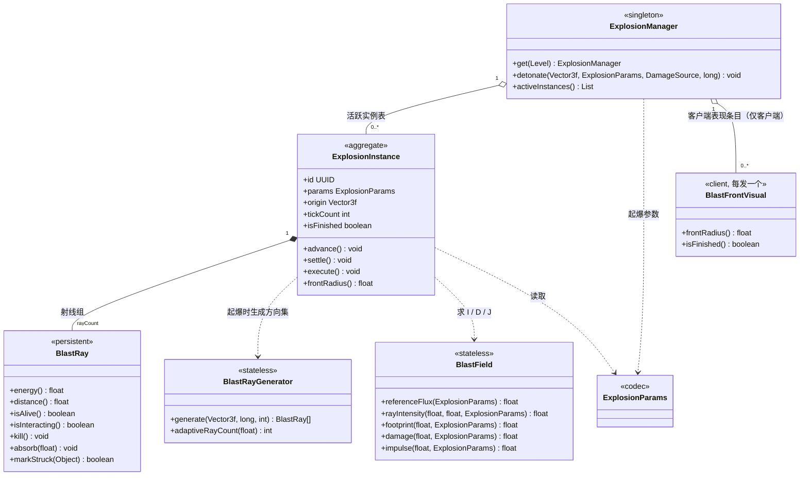
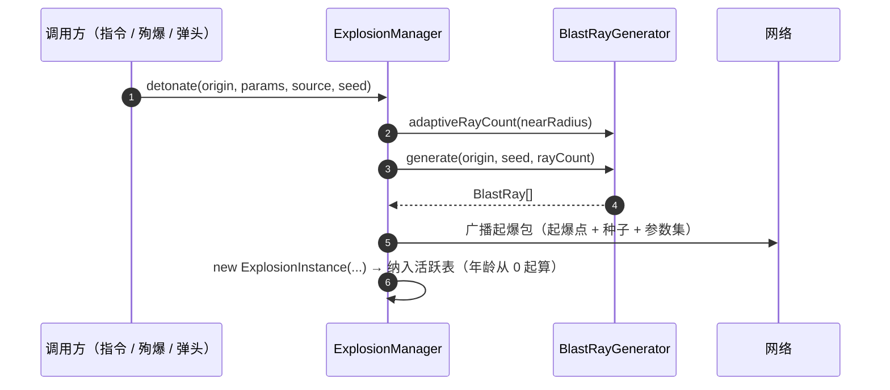
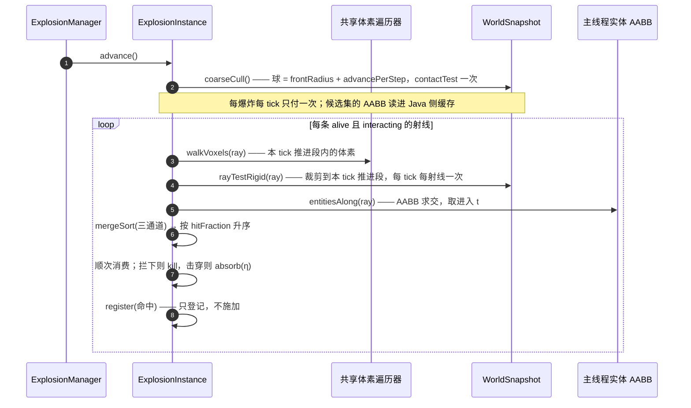
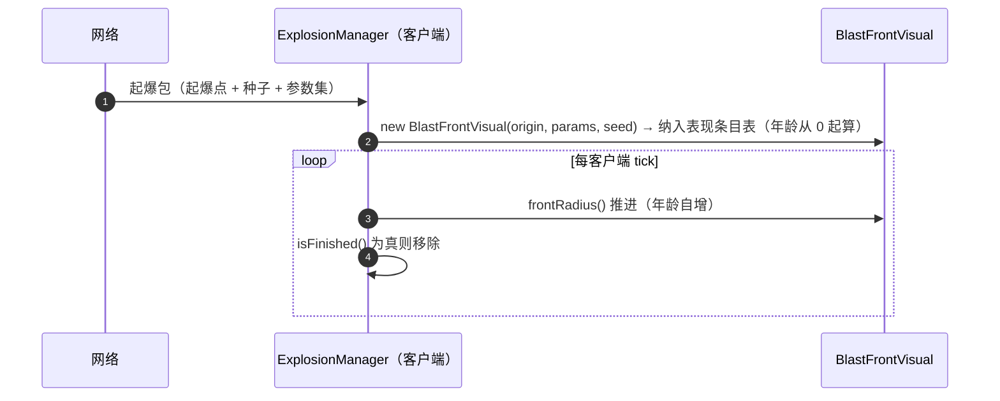

# Machine-Max 武器系统 — 爆炸系统接口设计

> 状态：接口设计（尚未实现，`common/mech/explosion/` 目录在仓库中不存在）
> 用途：把《武器系统-爆炸系统详细设计.md》的口径固化为类、字段与方法签名，供实现直接对照。
>
> **依赖声明（单向）**：本文**不重复**任何公式与判据。凡涉及物理量的定义、取值口径、标定条件与理由，一律以 `§` 号引用《武器系统-爆炸系统详细设计.md》（下称"设计文档"）：
>
> | 需要什么 | 去哪一节 |
> | --- | --- |
> | 记号、量类（强度量 / 广延量） | §7.1、记号表 |
> | 推进规则、三通道合并、粗筛 | §4.3、§4.4 |
> | 场强折算、近场平台 | §6.1、§6.4 |
> | 穿透、伤害、冲量 | §八、§九、§十 |
> | 参数与全局配置 | §12.1、§11.2 |
> | 模块布局与切分依据 | §14 |
>
> **设计文档不依赖本文。** 它只在 §14 末尾以"另见"指向本文，不引用本文的任何内容。设计文档可脱离本文单独阅读与评审；本文则必须先读设计文档。

***

## 阅读顺序

```text
一、总览        类图、责任分配、线程与挂载点
二、入口层      ExplosionParams / ExplosionManager
三、实例层      ExplosionInstance / BlastRay / BlastRayGenerator / BlastField / BlastFrontVisual
四、数据流      起爆、单步推进、结算施加的时序
五、外部契约    BallisticsFramework / Spark-Core / 共享体素遍历器 / 既有 API
六、路线映射    设计文档 §17 的 A–L 阶段分别落到哪些类
七、实现前置    动手前必须先补齐的接口决策
```

**一条贯穿全文的纪律**：这里给出的签名只负责"**把设计文档的口径固定在类型上**"。凡签名里出现了某个量，它的算法就在设计文档的对应 §里，本文只说"谁在什么时候算它"。

***

## 一、总览

### 1.1 类图



**切分依据是状态归属**（设计文档 §14）：有独立生命周期的对象（`ExplosionManager`、`ExplosionInstance`、`BlastRay`）与无状态的纯函数库（`BlastRayGenerator`、`BlastField`）各成一类；推进、累积、施加是同一次爆炸同一次 tick 内的连续步骤，共享 `ExplosionInstance` 的状态，因此是它的方法与字段。

### 1.2 责任分配

| 类 | 职责 | 持有的状态 | 线程 |
| --- | --- | --- | --- |
| `ExplosionManager` | 每 Level 单例、双端各一份；服务端订阅快照就绪事件并驱动活跃实例，客户端只维护表现条目 | 活跃实例表（服务端）/ 表现条目表（客户端） | 主线程 |
| `ExplosionInstance` | 一次爆炸的聚合根；推进 → 结算 → 执行的分段执行 | 射线组、去重集、本 tick 累积表、待摧毁集合 | 主线程 |
| `BlastRay` | 单条射线的持久状态（跨 tick） | 剩余能量、位置、DDA 游标、生命周期去重集 | 主线程 |
| `BlastRayGenerator` | 确定性方向集与射线数自适应 | 无 | 主线程 |
| `BlastField` | $I$ 的**唯一出口**，以及 $D$、$J$ 的换算 | 无 | 主线程 |
| `ExplosionParams` | 单发爆炸的参数（JSON Codec） | 不可变 | 双端 |
| `BlastFrontVisual` | 单发起爆的波前表现（粒子 / 音效 / 半径），每发一个 | 波前年龄、波前半径 | 客户端 |

**没有一条路径在物理线程上执行**：冲量经 `SubPart.hurt` 的 `IMPULSE` 扩展交给刚体侧，由它在物理相位投递（设计文档 §10.3）。

### 1.3 线程与挂载点

```text
主线程（20 tps）
  LevelTickEvent.Pre
    ├─ [HIGHEST] ObjectManager.onPreTick()
    └─ [HIGH]    PhysicsLevelApplier.mcLevelTask() → requestStep()
                   └─ 快照刷新完成 → post PhysicsSnapshotReadyEvent   ← ExplosionManager 挂这里
  LevelTickEvent.Post
    └─ [NORMAL]  ObjectManager.onPostTick()

物理线程（100 tps，5 子步/tick）
  └─ SubPart.hurt 的 IMPULSE 通路（爆炸侧不直接投递）
```

两条要点（设计文档 §3.3、§3.4）：

1. **推进必须挂在快照刷新之后**，即订阅 `PhysicsSnapshotReadyEvent`，而不是本项目的 `ObjectManager.onPreTick`（那是 `HIGHEST`，读到的是刷新前的旧快照）。
2. **"事件即一步"**：收到一次事件就推进一步，不需要待排队步数计数器，也不需要 `isSnapshotFresh` 字段。

***

## 二、入口层

### 2.1 ExplosionParams

```java
/// 单发爆炸的参数（设计文档 §12.1）。JSON Codec 供内容包加载。
public final class ExplosionParams {
    public float   basePenetration();  // mm，强度量，标定于 I = 1（§7.1）
    public float   baseDamage();       // 伤害·m^-2，标定于 I = 1 且参考面积被完全击穿（§7.2）
    public float   jRef();             // 冲量·m^-2，标定于 I = 1（§10.1）
    public float   nearRadius();       // m，参考距离兼近场平台半径（§6.4、§7.1）
    public float   maxRadius();        // m，硬截断半径（§4.3）
    public float   frontSpeed();       // m/s，波前速度，默认 20.0（§4.3）
    public boolean destroyBlocks();    // 是否破坏地形（§12.1）
    public boolean dropItems();        // 摧毁是否掉落（§12.1）
    public boolean causesFire();       // 首期强制 false（§12.3）

    public static final Codec<ExplosionParams> CODEC;
}
```

**参数表里没有任何能量量纲**（设计文档 §6.3）——`base_*` 与 `j_ref` 都以"参考半径处、无遮挡、单位迎流面积"标定，因此签名里不出现总能、当量或焦耳。

**射线数不是参数**：它由 `BlastRayGenerator.adaptiveRayCount(nearRadius)` 在起爆时程序化导出（设计文档 §4.7），JSON 中不可配置。因此 `ExplosionParams` 不提供该访问器，起爆网络包的"参数集"里也没有它——客户端按同一公式重算即可，两侧不可能取值不一致。

### 2.2 ExplosionManager

```java
/// 每 Level 单例的调度器（设计文档 §14）。**双端各一份**，并持有本 Level 的 PhysicsLevel 引用
/// （推进由快照就绪事件驱动）。
/// 服务端只做三件事：接收请求、订阅快照就绪事件、按顺序驱动活跃实例；
/// 客户端不建实例、不结算，只维护表现条目（§3.5）。
public final class ExplosionManager {

    /// 取某 Level 的实例，不存在则创建。实例的存放方式沿用项目既有的
    /// "按维度注册"模式。
    public static ExplosionManager get(Level level);

    /// 三种调用方共用的唯一入口（设计文档 §14.1）。主线程调用。
    /// 内部：生成方向集 → 广播起爆包 → 纳入活跃表（新实例的年龄从 0 起算）。
    /// 起爆包只含“起爆点 + 种子 + 参数集”，不带实例标识（设计文档 §13）。
    public void detonate(Vector3f origin, ExplosionParams params, DamageSource source, long seed);

    /// 活跃实例的只读视图，供调试与测试；调用方不应持有其中的实例。
    public List<ExplosionInstance> activeInstances();

    /// 快照就绪事件的订阅点（设计文档 §3.4）。只处理本 Level 的事件。
    private void onSnapshotReady(PhysicsSnapshotReadyEvent event);
}
```

`onSnapshotReady` 的执行骨架：

```java
void onSnapshotReady(PhysicsSnapshotReadyEvent event) {
    if (event.getPhysicsLevel() != this.physicsLevel) return;   // 只认自己这一 Level

    Iterator<ExplosionInstance> it = active.iterator();
    while (it.hasNext()) {
        ExplosionInstance inst = it.next();
        inst.advance();      // 推进期：DDA + 粗筛 + rayTest + 实体 AABB → 登记（设计文档 §4.3、§4.4）
        inst.settle();       // 结算期与施加：逐射线判穿、每去重键一次 hurt（设计文档 §7.4 ③④）
        inst.execute();      // 执行期：统一摧毁本 tick 标记的方块（设计文档 §9.2）
        if (inst.isFinished) it.remove();
    }
}
```

**三个方法按固定顺序调用，不可合并**——顺序本身承担三项保证：确定性、每去重键每 tick 至多一次、摧毁与世界修改解耦（设计文档 §4.5）。

***

## 三、实例层

### 3.1 ExplosionInstance

```java
/// 一次爆炸的聚合根（设计文档 §14）。
/// 跨 tick 存活，寿命 = max_radius / front_speed 秒；结束时连同 BlastRay[] 一并被回收。
public final class ExplosionInstance {

    /// 只依赖 Level 与起爆点 / 参数 / 归属 / 种子；不持有 ExplosionManager。
    ExplosionInstance(Level level, Vector3f origin, ExplosionParams params, DamageSource source, long seed);

    // ---- 标识与年龄（字段）----
    public final UUID            id;
    public final ExplosionParams params;
    public final Vector3f        origin;
    public int                   tickCount;  // 本实例的年龄：起爆为 0，每次 advance() 自增（客户端复现基准，§13）
    public boolean               isFinished; // 全部射线 alive == false；由 advance()/settle() 在末条射线终止时置位
                                             // （缓存成字段以免每次查询都扫一遍射线组）

    // ---- 派生读取（不另存状态，按需现算）----
    public float frontRadius();              // 已推进距离 = tickCount × advancePerStep，供表现层与诊断（§4.8）

    // ================= 推进期 =================
    /// 推进一次（一次快照就绪事件 = 一步），并登记命中（设计文档 §4.3）。
    /// 步长固定为 frontSpeed / 20（§4.3 的推进规则）。
    void advance();

    // ================= 结算期与施加 =================
    /// 逐去重键结算并对外施加一次（设计文档 §7.4 的第 ③④ 步、§9.5）。
    void settle();

    // ================= 执行期 =================
    /// 统一摧毁本 tick 标记的方块，杜绝遍历顺序依赖（设计文档 §9.2）。
    void execute();

    // ---- 推进期内部步骤（顺序即设计文档 §4.4 的流程）----
    private void coarseCull();                                  // §4.4：每爆炸每 tick 一次的球查询
    private void walkVoxels(BlastRay ray, List<VoxelHit> out);  // §14.2：共享体素遍历器
    private void rayTestRigid(BlastRay ray, List<RigidHit> out); // §4.3：裁剪到本 tick 推进段
    private void entitiesAlong(BlastRay ray, List<EntityHit> out); // §3.2：AABB 求交，取进入 t
    private void mergeSort(BlastRay ray, List<Hit> parts);       // §4.4：三通道并成一条保序序列
    private void register(BlastRay ray, Hit hit);                // §7.4：只登记，不施加

    // ---- 结算期内部步骤（按去重键类型分派，附录 A.2）----
    private void settleSubPart(PenetrationKey key, BlastAccum acc); // §9.3
    private void settleBlock(BlockPos pos, BlastAccum acc);         // §9.2
    private void settleEntity(Entity entity, BlastAccum acc);       // §9.4
}
```

**内部字段**（实现时的形状，供对照）：

| 字段 | 类型 | 用途 |
| --- | --- | --- |
| `rays` | `BlastRay[rayCount]` | 射线组，起爆时生成后终生不变（设计文档 §4.7） |
| `accum` | `Map<Object, BlastAccum>` | 本 tick 的累积表，`settle` 后清空 |
| `pendingDestroy` | `Set<BlockPos>` | 本 tick 标记待摧毁的方块，`execute` 后清空 |

**去重键是混装的三类**（设计文档 §4.2）：零件用 `PenetrationKey(subPart, hitBoxId)`、方块用 `BlockPos`、一般实体用 `Entity`。因此累积表的键类型是 `Object`；分派在 `settle` 里按 `instanceof` 进行（与设计文档附录 A.2 的 `owner` 分派同一条纪律）。

**一般实体不阻挡传播**（设计文档 §8.4）：实体命中只登记，不消耗射线能量、也不终止射线，因此实体键的 $\Delta E$ 是**全部到达射线**的能量之和，与方块 / 零件的"只看被击穿"不同。`settleEntity` 是这条口径的唯一落点。

> **TODO（未来）**：实体应当能阻挡爆炸——穿深不足的射线被它吞掉，从而削弱其身后的目标。本设计刻意不做这一步（实体不在快照里、只有 AABB 求交，且需要一套实体侧等效装甲，投射物侧的 `computeEntityEffectiveRha` 是形状参考）。届时应连同保序消费与施加纪律一起改。详见设计文档 §8.4。

**BlastAccum（非公开的内部结构）**：

```java
/// 本 tick 对**一个去重键**的累积（设计文档 §7.4 结算期、§9.5）。
/// 两个求和范围不同，这是设计口径的直接体现，不可混用：
private static final class BlastAccum {
    float deltaE;              // 击穿射线的能量之和 —— 伤害的分子（§7.2）；实体键按"到达"计（见下文）
    float sumFootprintSqrtI;   // 全部命中射线的冲量项之和（§10.1，与是否击穿无关，§7.5）
    float wNx, wNy, wNz;       // 能量加权的法线累加（§10.3）
    float wPx, wPy, wPz;       // 能量加权的命中点累加（§10.3）
    float weightSum;           // 上面两个均值式的权重分母
    float maxAPen;             // 本键上最大的 A_pen —— 聚合 hurt 的代表穿深（§9.3）
    HitBox hitBox;             // 零件侧：本键对应的命中框（§8.3）
    float rha;                 // 零件侧：getRHA，只含耐久衰减（§8.3）
    int   hitCount;            // 本键命中的射线数，用于诊断与 n = 0 排查（§4.7）
}
```

> `deltaE` 只累加**被击穿**的射线，`sumFootprintSqrtI` 与权重累加**全部命中**的射线——伤害与冲量的求和范围差异是刻意的（设计文档 §10.3 的"口径差别"）。把两者并成一个"命中列表"再分头处理，是这里最容易写错的地方。

### 3.2 BlastRay

```java
/// 跨 tick 持久存在的传播射线。字段定义见设计文档 §4.2，此处只列行为。
public final class BlastRay {

    public float   energy();        // E_r，剩余能量比例，初始 1.0
    public float   distance();      // d_r，已飞行距离
    public boolean isAlive();       // false = 越界或已被拦下，彻底结束
    public boolean isInteracting(); // false = E_r 低于 interactionCutoff，只推进、不再判定

    /// 终止本射线（被拦下或越界），设计文档 §4.3、§7.5。
    public void kill();

    /// 按 η 折减剩余能量（设计文档 §5.1）。
    /// 判定为 PENETRATED 时才调用；BLOCKED / RICOCHET 走 kill()。
    public void absorb(float eta);

    /// 生命周期级去重（设计文档 §4.2）：首次登记该键返回 true，重复返回 false。
    /// 键为 PenetrationKey / BlockPos / Entity 三类之一。
    public boolean markStruck(Object key);
}
```

**DDA 游标**（当前体素、下一跨越参数、步进符号、最近跨越面轴）随射线跨 tick 存活。由于共享体素遍历器同时服务爆炸与光束（§5.3），它不是散落字段，而是 `VoxelCursor` 的一个实例，由 `BlastRay` 独占持有并交给遍历器原地读写（设计文档 §4.2）。

### 3.3 BlastRayGenerator

```java
/// 确定性方向集（设计文档 §4.1）。纯静态，无状态。
public final class BlastRayGenerator {

    /// Fibonacci 球 + 种子抖动，一次性固定方向；推进过程中不得重新随机（设计文档 §4.1）。
    public static BlastRay[] generate(Vector3f origin, long seed, int rayCount);

    /// rayCount 自适应（设计文档 §4.7）。这是该公式的唯一定义处：射线数不进 JSON，
    /// 起爆时由 ExplosionManager 调一次，客户端按同一公式重算（§2.1）。
    public static int adaptiveRayCount(float nearRadius);
}
```

**抖动只在这里发生一次**：`generate` 之后方向不再改变，这是客户端能凭"起爆点 + 种子"复现整条时间线的前提（设计文档 §4.8）。

### 3.4 BlastField

```java
/// 场强与终端的**唯一换算出口**（设计文档 §14.1 的实现纪律 1）。
/// 无状态，全部静态方法。推进循环不允许乘任何含距离的因子——几何衰减只在这里出现。
public final class BlastField {

    private BlastField() {}

    /// 参考场强 Φ_0（定义见设计文档 §6.1）。
    public static float referenceFlux(ExplosionParams p);

    /// 单条射线在其命中点处的归一化强度 I_r（设计文档 §6.1 的闭式，
    /// 含 §6.4 的近场平台钳制）。
    public static float rayIntensity(float energy, float distance, ExplosionParams p);

    /// 单条射线的足迹 A_r（定义见设计文档 §7.1.1）。
    public static float footprint(float distance, ExplosionParams p);

    /// 沉积能量 → 基准伤害 D（设计文档 §7.2）。目标侧的材料修正（blockDamageFactor / modifyDamage）
    /// 不在这里做，由 settleXxx 分派给对应目标。
    public static float damage(float deltaE, ExplosionParams p);

    /// 逐射线冲量项之和 → 冲量 J（设计文档 §10.1）。
    public static float impulse(float sumFootprintSqrtI, ExplosionParams p);
}
```

**把 $I$ 的出口收在一个类里是这份设计最重要的一条结构性约束**（设计文档 §14.1）：终端只**读取** $I$，不修改它。签名上体现为——所有需要强度的调用都必须经过 `rayIntensity`，且它不接收"目标"参数，只接收该射线自己的 $(E_r, d_r)$。

### 3.5 BlastFrontVisual

```java
/// 单发起爆的客户端表现条目（设计文档 §13、§14）。每发起爆一个实例，
/// 由 ExplosionManager 在客户端的表现条目集合中持有与淘汰。
/// 逻辑侧的 frontRadius() 由 ExplosionInstance 提供；本类只在客户端持有表现状态。
public final class BlastFrontVisual {

    /// 收到起爆网络包时建立本地表现（客户端）。三项即可完整复现射线方向集与波前半径；
    /// 年龄同样从 0 起算、每次客户端推进自增，与服务端实例的 tickCount 同一定义。
    public BlastFrontVisual(Vector3f origin, ExplosionParams params, long seed);

    /// 当前波前半径 = 年龄 × front_speed / 20，与逻辑侧同源（设计文档 §4.8、§13）。
    public float frontRadius();

    /// 寿命 = maxRadius / frontSpeed；到点后由 ExplosionManager 从集合中移除。
    public boolean isFinished();
}
```

***

## 四、数据流

### 4.1 起爆



### 4.2 单次推进（每个快照就绪事件一次）



**保序是这一段的全部意义**：地形、快照刚体、一般实体必须在同一个 `hitFraction` 轴上竞争，否则"墙后的车"会绕过地形遮挡（设计文档 §4.4）。

### 4.3 结算与施加

```text
per 去重键（顺序不可颠倒，设计文档 §7.4）：
  ① 逐射线求各自命中点处的强度          BlastField.rayIntensity(...)          §6.1
  ② 逐射线判穿透并折减
       方块    ：爆炸侧比 A_block                                             §8.2
       BF 目标 ：subPart.resolvePenetration(ctx_ray)（纯判定，无副作用）        §8.3
       拦下 → kill；击穿 → absorb(η) 供下游                                    §八
  ③ 汇总广延量（方块/零件按"击穿"，一般实体按"到达"，§8.4）
       ΔE ← 击穿射线的能量和 → BlastField.damage(...)                         §7.2
       J  ← 全部命中射线的冲量项之和 → BlastField.impulse(...)                 §10.1
  ④ 施加（每个去重键每 tick 一次，§9.5）
       零件 → BFDamageApi.hurt(subPart, ctx_agg)                             §9.3
       方块 → D × blockDamageFactor 与 Θ_block 比较后标记                      §9.2
       实体 → BFDamageApi.hurt(entity, ctx_agg)                              §9.4
执行期：统一摧毁 pendingDestroy（§9.2）
```

`settle` 的三条不可违反的约束：

1. **判定逐射线、施加每键一次**——`resolvePenetration` 只读 `ctx`，可逐射线调用；`hurt` 每去重键每 tick 只调一次（设计文档 §9.5）。
2. **$D=0$ 时也调用 `hurt`**——未击穿仍要经 `IMPULSE` 投递冲量（设计文档 §7.5、§9.3）。
3. **代表穿深取本键上最大的 $A_{pen}$**——聚合后的 `hurt` 会二次判定，传最大穿深才能保证"至少一条击穿 ⇒ 仍判 PENETRATED"（设计文档 §9.3）。

### 4.4 客户端复现（仅表现）



客户端**不建 `ExplosionInstance`、不登记命中、不结算、不回发网络包**：表现只需要一个波前半径，按自身年龄推即可（设计文档 §4.8）。年龄是实例 / 条目自带的计数器，不依赖任何全局时钟，因此客户端无需知道服务端已经推进了几步。

***

## 五、外部契约

### 5.1 BallisticsFramework

爆炸侧只通过下面这些入口与 BF 发生关系，**不自行比对装甲、不计算等效厚度**（设计文档 §8.1）。

| 入口 | 方向 | 用途 |
| --- | --- | --- |
| `BFDamageApi.hurt(Object target, BFDamageContext ctx)` | 爆炸 → BF | **唯一的施加入口**（设计文档 §9.3、§9.4） |
| `BFHurtTarget.resolvePenetration(ctx)` | 爆炸 → BF | 逐射线穿透判定，返回 `PenetrationResult`（设计文档 §8.3） |
| `BFHurtTarget.modifyPenetration(ctx)` | 爆炸 → BF | 取 $effPen$ 用于算 $\eta$（设计文档 §8.3） |
| `BFHurtTarget.getRHA(ctx)` | 爆炸 → BF | 取 $rha$ 用于算 $\eta$（设计文档 §8.3） |
| `BFDamageContextBuilder`（由 `BFDamageContext.builder()` 取得） | 爆炸 → BF | 构造逐射线 ctx 与聚合 ctx |
| `BFDamageExtensions.IMPULSE` | 爆炸 → BF | 显式写入合冲量（设计文档 §10.3） |
| `MMDamageExtensions.HIT_BOX` | 爆炸 → BF | 指定本键的命中框，避免回退到"最厚装甲"（设计文档 §8.3） |

**`ctx` 的两处构造口径**（细节在设计文档，这里只列必须写对的字段）：

```java
// 逐射线判定用（设计文档 §8.3）：入射角恒 0，跳弹分支不可达
ctx.penetration(本射线的有效穿深);           // A_pen，设计文档 §8.1
ctx.hitNormal(射线方向的反向);
ctx.hitVelocity(射线方向);

// 聚合施加用（设计文档 §9.3）：入射角恒 0，且冲量方向 = -n̄
ctx.baseDamage(D);                          // 可为 0
ctx.penetration(本键最大的 A_pen);           // 代表穿深
ctx.hitNormal(n̄) .hitVelocity(-n̄) .hitPoint(p̄);
ctx.extensions().set(MMDamageExtensions.HIT_BOX, hitBox);
ctx.extensions().set(BFDamageExtensions.IMPULSE, J);   // 必须显式写入，即使为 0
```

> `hitNormal` 与 `hitVelocity` 的取值是同一个推导的两面：既让入射角恒为 0（抑制跳弹的随机分支），又让冲量方向落在 `normalize(hitVelocity) = -n̄`（推离爆心）。改动其中任何一个都会同时破坏这两条（设计文档 §8.3、§10.3）。

**新增伤害类型**：`machine_max:blast`。**不得使用原版 `minecraft:explosion`**——那会落进 `MMPartEntity.hurt()` 的爆炸分支，其语义（最近 SubPart + 最厚装甲）与本设计不符（设计文档 §9.3、§16）。

### 5.2 Spark-Core

| 项 | 状态 | 说明 |
| --- | --- | --- |
| `PhysicsSnapshotReadyEvent` | **需新增** | 主线程事件，必须在 `requestStep()` 内部走完 `syncStructure` / `syncTransform` / `update` 之后触发；携带 `getPhysicsLevel()` 与 `getPhysicsStep()`（设计文档 §3.4） |
| `WorldSnapshot` | 已存在 | 只读、主线程专用；内容为 `PhysicsRigidBody` ∩ `PHYSICS_BODY`。地形永远不在其中（设计文档 §3.5） |
| `CollisionSpace.rayTest` | 已存在 | 返回全部命中并已按 `hitFraction` 升序排好，合并只需一次归并（设计文档 §4.4） |
| `PhysicsLevel.submitImmediateTask(PPhase, Runnable)` | 已存在 | **爆炸侧不直接使用**；冲量走 `SubPart.hurt` 的既有通路（设计文档 §10.3） |

**爆炸不依赖任何全局时钟**：每个实例 / 表现条目自带年龄计数器（起爆为 0，每次推进自增），`frontRadius` 与寿命都由它给出——`Level.getGameTime()` 与 `PhysicsLevel.tickCount` 都不参与。`PhysicsSnapshotReadyEvent.getPhysicsStep()` 是主线程快照步号，只作事件丢失诊断。推进距离始终按"一次事件一步"计（设计文档 §3.4）。

### 5.3 共享体素遍历器

```java
// 位置：util/mechanic/（与 ArmorUtil 同目录）：它同时服务爆炸与光束，两者都在主线程（设计文档 §14.2）
public final class VoxelRayWalker {

    /// 沿射线推进 distance 米，按 hitFraction 升序收集途经的方块命中。
    /// 跨 section、直接读 LevelChunkSection.getBlockState。
    /// 游标由调用方持有并原地推进：爆炸侧存在 BlastRay 上（跨 tick 复用），
    /// 光束侧每次扫描传一个即可（它不需要跨 tick 续接）。
    /// 本类不做去重——命中的去重键由调用方决定（爆炸按生命周期、光束按 tick）。
    public static void walk(Level level, Vector3f from, Vector3f dir, float distance,
                            VoxelCursor cursor, List<VoxelHit> out);
}
```

**不能复用 `ProjectileManager.walkBlocksAlongRay`**（设计文档 §14.2）：它要求已构建的物理地形 section、读的是构建期从区块拷贝的副本、且裁剪到单个 16³。爆炸与光束只共享 Amanatides–Woo 的步进算术与跨 section 的区块读取路径——投射物侧仍走它自己的物理地形通路，不是本类的使用方。

**必须处理的退化情形**：起点在实心方块内部（首次跨越参数初始化为 0，使起始体素参与判定），以及爆心落在装甲凸体内部时快照 `rayTest` 的未定义行为（设计文档 §14.2）。

### 5.4 既有 API 的其他落点

| API | 用途 |
| --- | --- |
| `ArmorUtil.getBlockArmor` | 方块护甲 $A_{block}$ 的形状来源，乘爆炸侧系数 $k_{armor}$（设计文档 §8.2） |
| `DamageUtil.getMaxBlockDurability(level, state, pos)` | 方块摧毁阈值 $\Theta_{block}$，已含材质分档与体积修正（设计文档 §9.2） |
| `PenetrationKey.fromCollision(...)` | 零件侧去重键的构造，与三角形→HitBox 的映射是两件事（设计文档 §4.2、§8.3） |
| `SubPart.getHitBox(int)` / `getHitBox(long)` | 子形状序号 → 命中框（对简单凸包形状即三角形索引；设计文档 §8.3） |
| `SubPart.hurt` 的 `IMPULSE` 通路 | 冲量的实际投递点；没有该扩展时会回退到伤害基公式，故必须显式写入（设计文档 §10.3） |
| `ProjectileType.getBlockDamageFactor()` | `blockDamageFactor` 的既有来源，语义与投射物侧一致（设计文档 §9.2） |

**明确不使用的**（设计文档 §8.3、§16）：`ArmorUtil.getEquivalentArmor`、`ArmorUtil.shouldRicochet`、`HitBox.hasAngleEffect()`、原版 `Explode()`、`minecraft:explosion` 伤害类型。

***

## 六、实施路线映射

设计文档 §17 的 A–L 阶段分别落到下列类：

| 阶段 | 涉及的类型 |
| --- | --- |
| **A. 共享 DDA 工具** | `VoxelRayWalker`（`util/mechanic/`） |
| **B. 快照就绪事件** | `PhysicsSnapshotReadyEvent`（Spark-Core） |
| **C. 传播内核** | `ExplosionManager`、`ExplosionInstance`、`BlastRay`、`BlastRayGenerator` |
| **D. 场强折算** | `BlastField` |
| **E. 穿透** | `ExplosionInstance.settleBlock` / `settleSubPart`、BF 契约（§5.1） |
| **F. 伤害** | `ExplosionInstance.settle*`、`BlastField.damage` |
| **G. 冲量** | `ExplosionInstance.settle*`（$J$ 与 $\overline n$、$\overline p$ 的累积） |
| **H. 摧毁执行** | `ExplosionInstance.execute`、`pendingDestroy` |
| **I. 复现与表现** | `BlastFrontVisual`、起爆网络包 |
| **J. 伤害类型与调用方** | `detonate(...)` 的两个直连调用方（指令、殉爆）、`machine_max:blast` 注册（弹头起爆在阶段 K） |
| **K. 投射物接入** | `BlastWorldEffect`（`projectile/component/effect/`，依赖上游通用 Effect 体系） |
| **L. UGC 文档** | `ExplosionParams` 的字段说明与校验错误 |

**最小可独立落地的一条路径是 C → D → E → F**：三个调用方里，指令与殉爆都不依赖投射物侧（设计文档 §14.1），因此阶段 K 可以最后再做。

***

## 七、实现前置条件

动手前必须先补齐下列接口决策，否则实现会在这些点上各自发挥：

| 项 | 内容 | 出处 |
| --- | --- | --- |
| `PhysicsSnapshotReadyEvent` | 由 Spark-Core 新增，触发点必须在快照刷新之后 | 设计文档 §3.4 |
| `machine_max:blast` | 新增 `DamageType`；`MMDamageTypes` 目前只有 `part_collision` | 设计文档 §9.3、§16 |
| 起爆网络载荷 | 载荷编号、编解码，以及"起爆点 + 种子 + 参数集"的字段表 | 设计文档 §13 |
| 殉爆环路保护 | 单次爆炸的最大递归深度、每 tick 的最大爆炸实例数、同一目标的殉爆去重 | 设计文档 §12.4 |
| 活跃表的重入 | `settle` / `execute` 内触发殉爆会往活跃表里加实例：需定死遍历方式（如先取快照再遍历）与"新实例是否在本 tick 内处理" | 设计文档 §12.4 |
| 客户端推进挂点 | 客户端是否也收 `PhysicsSnapshotReadyEvent`；若不是，表现条目改挂 `ClientTickEvent`，并接受与逻辑侧节拍分叉 | 设计文档 §13 |
| 累积表顺序 | `accum` 需用有序容器（`LinkedHashMap`）或声明键序对结果无影响——§4.5 的"确定性"依赖它 | 设计文档 §4.5、§7.4 |
| 实体阻挡 | 见 §3.1 的 TODO：实体阻挡爆炸所需的实体侧等效装甲与传播语义尚未设计 | 设计文档 §8.4 |
| `k_armor` | 方块护甲系数的标定值；标定目标为"石头挡住中等装药、泥土被穿透" | 设计文档 §8.2 |
| `causes_fire` | 首期强制 `false`，避免出现没有实现的开关 | 设计文档 §12.3 |
| 全局配置项 | `explosionBlockDamage`、`explosionTerrainDamageMultiplier`、`destructionSourceFilter`、`frontSpeedDefault`、`interactionCutoff`、`k_armor` | 设计文档 §11.2 |