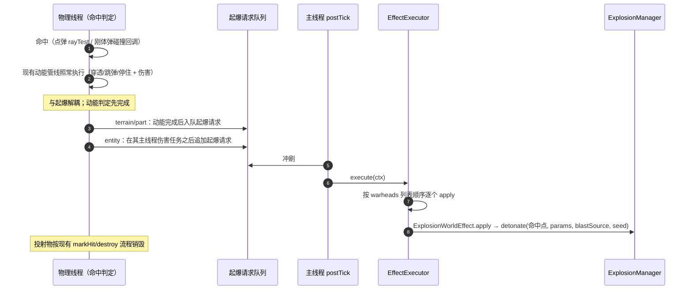

# Machine-Max 武器系统 — 碰炸引信与爆炸战斗部 · 实现备忘

> 定位：本文件是**实现备忘**，不是设计文档。物理模型、公式、判据、字段语义一律以既有设计文档为准，本文只引用、不复制；凡本文只给结论的地方，都能在下列文档中找到完整推导。
>
> 上游设计（下称简称）：
>
> - 《武器系统-组件化投射物与类型体系设计.md》——**投射物设计**：类型体系 §二、终点行为 §三、行为组件 §四（战斗部 §4.4、组件运行时 §4.5、默认行为 §4.6）、管理器对应 §六、文件布局 §八、路线 §十
> - 《武器系统-爆炸系统详细设计.md》——**爆炸设计**：参数表 §12.1、与既有系统边界 §十六
> - 《武器系统-爆炸系统接口设计.md》——**爆炸接口**：`ExplosionManager` §2.2、`ExplosionParams` §2.1、数据流 §四、外部契约 §五
>
> 相关的现行实现（阶段一/二，已落地）：`docs/wiki/4-物理与战斗机制/4.7-投射物.md`。

---

## 一、本阶段目标

一发飞行弹丸命中目标时：**先照常执行动能击穿 / 伤害判定，再在命中点执行 `warheads` 列表中的全部世界效果，随后销毁投射物**。本阶段 `warheads` 唯一实现是参数化爆炸（`machine_max:blast`）。

没有延迟引信、没有近炸、没有时间装订、没有亚步长外推。

---

## 二、范围

### 2.1 范围内

1. **类型体系重构（投射物设计 §二、§十 阶段 A）**：`ProjectileType` 重构为 `abstract` 基类 + `Codec.STRING.dispatch("type", ...)`；新增 `KineticProjectileType` 承载 `point` / `rigid`。dispatch 表本阶段**只注册 `point` / `rigid`**。
2. **通用效果体系（投射物设计 §四）**：`WorldEffect` / `EffectContext` / `EffectExecutor` / `ExplosionWorldEffect`。
3. **`warheads` 字段**：`List<WorldEffect>`，缺省空列表 = 纯动能。
4. **固定碰炸引信**：命中即起爆，**不暴露 `fuze` JSON**。
5. **执行顺序**：先动能判定，后起爆；起爆后销毁投射物。

### 2.2 范围外（本阶段不做）

| 项 | 设计出处 | 说明 |
| --- | --- | --- |
| `delay` / `hit_delay` / `proximity` 三类 Trigger 与 `time_safety` 保险 | 投射物设计 §4.3 | 本阶段无 fuze JSON，固定命中即起爆 |
| 火控时间装订（`FireCommand.fuzeDelaySeconds`、`IProjectile.programFuzeDelay`） | 投射物设计 §4.3.8、§6.1 | 无定时引信即无需装订 |
| `Fuze` / `FuzeTrigger` / `FuzeState` / `FuzePhysicsContext` 运行时 | 投射物设计 §4.3.4–§4.3.6、§4.5 | 同属引信运行时，本阶段不做 |
| 亚步长起爆位置（步内爆心偏移） | 投射物设计 §4.3.7 | 本阶段固定碰炸 `delay=0`，偏移恒为 0，不进入该分支；该机制是后续 `delay` / `hit_delay` 引信所必需，**设计保持有效** |
| `ProjectileMotionResult` | 投射物设计 §3.3 | 固定碰炸不保留载体，现有 `AfterHitResult` 足够 |
| `restitution` / `discard_on_blocked` | 投射物设计 §3.2、§3.3 | 与碰炸无关（有 `warheads` 视作无穿透） |
| Owner 归属（`EffectContext` 的 `directEntity` / `ownerEntity` / `sourceObject`） | 投射物设计 §4.3.3、§4.4、§十 阶段 H | 本阶段一律留 `null` |
| Seeker / Guidance | 投射物设计 §4.1、§4.2、§十 阶段 I | — |
| `RayProjectileType` / `RayManager` / 光束 | 投射物设计 §五、§十 阶段 J/K | dispatch 表中 `pulse` / `beam` 报「未知投射物类型」 |
| 实体阻挡爆炸、`causes_fire`、殉爆递归深度 | 爆炸设计 §8.4、§12.3、§12.4 | 爆炸侧自身遗留，与本次无关 |

---

## 三、本阶段决策

| 决策 | 内容 |
| --- | --- |
| 挂载 | 走设计路径：阶段 A dispatch；`warheads` 挂在 `KineticProjectileType` 上 |
| 调用方接口 | kinetic 专属字段下沉到 `KineticProjectileType`；保留 base 与收窄的清单见 §五 |
| 触发条件 | 任意命中（地形 / 零件 / 实体）即起爆；有 `warheads` 视作无穿透、不继续飞行 |
| 执行顺序 | 命中后**击穿与伤害判定**与**起爆**解耦：先完成动能判定，再起爆 |
| 排序保证 | 按命中路径分别保证：terrain / part 同步路径在动能完成后入队；entity 异步路径把起爆请求**追加在该次动能伤害任务之后** |
| 起爆点 | 固定碰炸下等于实测命中点（点弹取 `rayTest` 命中点，刚体弹取 Bullet 接触点）；不涉及投射物设计 §4.3.7 的步内爆心偏移 |
| 起爆线程 | 必须在**主线程**：`ExplosionManager.detonate` 内含 `PacketDistributor` 与非线程安全的 `active` 表。物理线程入队 → 主线程 `ProjectileManager.postTick()` 冲刷 |
| 归属 | `level.damageSources().source(MMDamageTypes.BLAST)`，不带 owner |
| 哑弹 | 寿命到期不起爆（沿用 `max_lifetime` 硬清理） |
| 客户端 | 不参与起爆；表现由 `ExplosionDetonatePayload` + `BlastFrontVisual` 负责（爆炸接口 §4.4），本阶段不改 |

---

## 四、命名

- 爆炸效果类名：**`ExplosionWorldEffect`**（注册名 `machine_max:blast`）。
- 战斗部字段名：**`warheads`**（复数）。
- 其余类型与字段名沿用设计（`WorldEffect`、`EffectContext`、`EffectExecutor`、`ExplosionParams`）。

---

## 五、文件与类布局

### 5.1 新增

```
common/mech/projectile/type/KineticProjectileType.java     ← 承载 point/rigid
common/mech/projectile/component/effect/WorldEffect.java
common/mech/projectile/component/effect/EffectContext.java
common/mech/projectile/component/effect/EffectExecutor.java
common/mech/projectile/component/effect/ExplosionWorldEffect.java
```

### 5.2 改造

- `ProjectileType.java` → `abstract` 基类，仅保留共享字段 `tags` / `max_lifetime` / `bullet_num` / `visual` / `sounds`，加 `registryKey`、dispatch `CODEC`、静态 `get(level, key)`。
- 新增 `KineticProjectileType`：持有 `ProjectileTypeEnum type`、`ExternalProperties`、`TerminalProperties`、`List<WorldEffect> warheads`，以及 `create` / `createWithId` / `fire`；视觉与音效字段只读基类字段，故连其委托一并留在基类。
- `ProjectileTypeEnum` 不变，仍由 `KineticProjectileType` 内部的 `type` 字段区分 POINT / RIGID（`point` / `rigid` 两个名字路由到同一个 `KineticProjectileType.CODEC`，见投射物设计 §2.2）。
- 注册表：`MMDataRegistries.kt` 增 `WORLD_EFFECT_CODEC`；`MMCodecs.kt` 的 `reg()` 增一行注册 `ExplosionWorldEffect`（见 §八）。
- `ProjectileModule.kt` 的加载入口不变（仍解码 `ProjectileType.CODEC`），现有 `projectiles/*.json` **无需修改**。

### 5.3 调用方处理规则

**保留 base `ProjectileType`**（弹药框架同时服务 kinetic 与未来的 ray 发射器，见投射物设计 §六）：

- `IAmmoConsumer`、`IAmmoSupplier`
- `AmmoLoaderSubsystem`、`RegenLoaderSubsystem`
- `BreechModuleAttr.isAmmoCompatible(ProjectileType)`
- `MMDynamicRes.PROJECTILE_TYPES` / `SERVER_PROJECTILE_TYPES`、`ProjectileType.get(level, key)`
- `ProjectilesSpawnPayload`

**收窄为 `KineticProjectileType`**（这些位置要读 kinetic 专属字段）：

- `ProjectileManager`：`typeCache` 数组类型、`getOrAddType`、`getProjectileTypeByIndex`、`getTypeKeyByIndex`
- `IProjectile.getProjectileType()`（`PointProjectile` / `RigidProjectile` 的字段与返回值）
- `LauncherSubsystem` 内部：`chamberedType`、`pendingFires`、`fireSingle`、音效读取；`receiveAmmo(ProjectileType)` 内做 `instanceof KineticProjectileType` 收窄，非 kinetic 拒绝
- `ClientProjectileRenderer`、`CameraShakeController`（读质量）、`AmmoHud`（仅当读了 kinetic 字段才收窄）

> 迁移时以编译器为准逐个核对；`WeaponControllerSubsystem` 的 `getChamberedType()` 按调用方用途决定返回 base 还是 kinetic。

---

## 六、JSON 形状

```json
{
  "type": "point",
  "tags": ["grenade", "high_explosive"],
  "max_lifetime": 10.0,
  "bullet_num": 1,

  "external": { "...": "字段名与语义不变，见现行 ProjectileType.ExternalProperties 与 wiki 4.7" },
  "terminal": { "...": "字段名与语义不变，见现行 ProjectileType.TerminalProperties" },

  "warheads": [
    {
      "type": "machine_max:blast",
      "base_penetration": 20.0,
      "base_damage": 40.0,
      "base_impulse": 12.0,
      "near_radius": 3.0,
      "max_radius": 8.0,
      "front_speed": 20.0,
      "destroy_blocks": true,
      "drop_items": false,
      "causes_fire": false
    }
  ],

  "visual": { "...": "不变" },
  "sounds": { "...": "不变" }
}
```

- `warheads` 内层对象的字段**直接复用 `ExplosionParams`**（爆炸接口 §2.1、爆炸设计 §12.1），不另立一套参数。
- `external` / `terminal` / `visual` / `sounds` 的字段名一律不变，因此**现有内容包 JSON 零改动**。
- `causes_fire` 沿用爆炸设计 §12.3 的口径：字段保留，值强制 `false`。

---

## 七、执行时序与线程



要点：

- 起爆请求载荷至少含：命中点（JME `Vector3f`）、本次弹种的 `warheads`、归属 `DamageSource`。
- `seed` 由服务端生成（`level.random.nextLong()`），`detonate` 内部随起爆包同步（爆炸接口 §2.2）。
- `ExplosionManager.tick()` 挂在 `PhysicsSnapshotReadyEvent` 上（爆炸接口 §1.3），主线程调用 `detonate` 不会与之并发。
- 爆心偏移（投射物设计 §4.3.7）由引信在**物理线程**算好后随起爆请求一并提交，主线程只按给定起爆点执行效果——不存在跨线程的步内交接。本阶段固定碰炸 `delay=0`，该偏移恒为 0。

---

## 八、WorldEffect 形态与注册

### 8.1 形态：自描述接口；实现类是其参数类型的薄包装

`WorldEffect` 是**接口**，与 Spark-Core 的 `StateCondition` / `StateAction` 同构；每个效果类型是一个实现类，而爆炸效果类是其参数类型 `ExplosionParams` 的薄包装——**字段定义只在 `ExplosionParams` 一处**，包装类不复制字段列表：

```java
public interface WorldEffect {
    MapCodec<? extends WorldEffect> codec();
    void apply(EffectContext context);
}

/// 爆炸战斗部：ExplosionParams 的薄包装
public record ExplosionWorldEffect(ExplosionParams params) implements WorldEffect {

    /// 由 ExplosionParams 的 MapCodec 经 xmap 派生；不重复字段列表。
    /// ExplosionParams 因此暴露 MAP_CODEC，其 CODEC 由 MAP_CODEC.codec() 派生。
    public static final MapCodec<ExplosionWorldEffect> CODEC =
            ExplosionParams.MAP_CODEC.xmap(ExplosionWorldEffect::new, ExplosionWorldEffect::params);

    @Override public MapCodec<? extends WorldEffect> codec() { return CODEC; }

    @Override public void apply(EffectContext context) {
        // 依赖全部来自 context（已含 level / origin / 归属）；转发到 ExplosionManager
    }
}
```

两条约定：

- `apply` **只接收 `EffectContext`**（其中已含 `level`），不额外传 `Level`。
- **只提供 JSON `MapCodec`，不注册 StreamCodec**：`warheads` 不随投射物同步到客户端；起爆由服务端发起，客户端只收起爆包建表现。

> `MapCodec` 本身充当"效果类型"的载体（注册表元素就是它），因此不需要额外的 Serializer / Type 类。
> 同类既有实现可参照 `BasicSubsystemDynamicAttr`：静态 `MapCodec` + `codec()` 返回 `MapCodec<? extends AbstractSubsystemAttr>`，经 `MMDataRegistries` / `MMCodecs` 注册。

### 8.2 注册

沿用项目既有 Codec 注册形式（Spark-Core `StateCondition` ↔ `SparkRegistries`，本项目子系统属性 ↔ `MMDataRegistries` / `MMCodecs`）。

`MMDataRegistries.kt` 增：

```kotlin
@JvmStatic
val WORLD_EFFECT_CODEC = MachineMax.REGISTER.registry<MapCodec<out WorldEffect>>("world_effect_codec") {
    it.sync(true).create()
}
```

聚合 Codec（与 `StateCondition.CODEC` 同构）：

```java
Codec<WorldEffect> CODEC = /* 取 WORLD_EFFECT_CODEC 的静态访问器 */.byNameCodec()
        .dispatch(WorldEffect::codec, Function.identity());
```

`MMCodecs.kt` 的 `reg()` 增一行：

```kotlin
event.register(MMDataRegistries.WORLD_EFFECT_CODEC.key(), id("blast")) { ExplosionWorldEffect.CODEC }
```

> 注册名 `machine_max:blast` 与同名伤害类型分属两个注册表，互不冲突。
> 建议把 `WorldEffect.CODEC` 放在惰性访问点，避免类初始化早于 `MachineMax.REGISTER` 就绪。

---

## 九、实现步骤

1. **阶段 A 重构**：抽出 `ProjectileType` 抽象基类、新建 `KineticProjectileType`、迁移字段与 `create`/`fire`；按 §5.3 清单调整调用方；先确保**现有无 `warheads` 的 JSON 行为不变**。
2. **效果体系**：新增 `WorldEffect` / `EffectContext` / `EffectExecutor` / `ExplosionWorldEffect`，并完成 §八 的两处注册改动。
3. **字段接入**：`KineticProjectileType` CODEC 增加 `warheads`（可选，默认空列表）。
4. **命中注入**：按 §七 在三条命中路径的动能判定之后入队起爆请求。
5. **主线程冲刷**：在 `ProjectileManager.postTick()` 消费队列，按 `warheads` 列表顺序执行效果。
6. **内容包示例**：为一支榴弹类弹药补 `warheads`（爆炸）配置。

---

## 十、验证要点

- **向后兼容**：现有内容包 JSON 无需修改即可加载；无 `warheads` 的弹种行为与当前完全一致。
- **顺序**：有 `warheads` 的弹命中后，先出现动能伤害 / 装甲反应，再出现爆炸；弹体消失。
- **三条路径**：打地形、打载具零件、打实体都触发起爆。
- **起爆点**：等于实测命中点（不沿弹道前移）。
- **哑弹**：`max_lifetime` 到期不起爆。
- **服务端权威**：客户端不产生爆炸，只收 `ExplosionDetonatePayload`。
- **线程**：起爆发生在主线程（`detonate` 的调用点可加断言/日志核对线程名）。

---

## 十一、相邻但不在本阶段的待办

- 爆炸设计 §12.4「殉爆环路保护」：目前只落了「每维度最大活跃实例数」；单次爆炸的最大递归深度、同一目标的殉爆去重仍未做。
- 爆炸设计 §8.4、§12.3：实体阻挡爆炸、`causes_fire` 仍未实现。
- 投射物设计 §4.3 的 `delay` / `hit_delay` / `proximity` 引信：本阶段不实现；其中 §4.3.7 的步内爆心偏移是这些引信所必需，设计保持有效。
