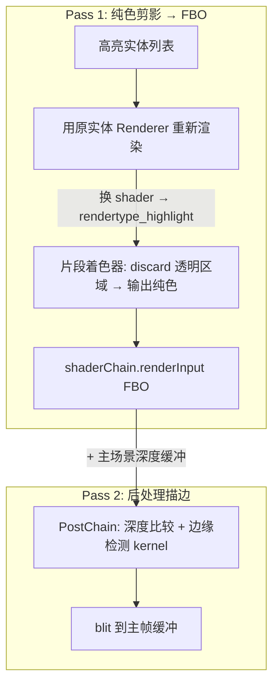
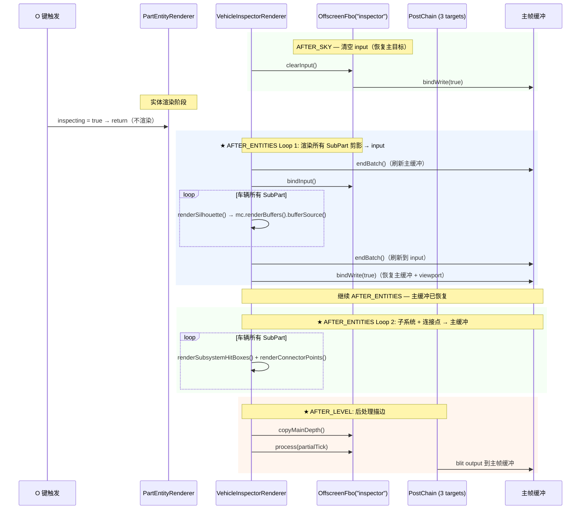

# 渲染系统 — 内构查看描边与离屏 FBO 基础设施

**版本**：1.0\
**日期**：2026-07-19\
**目标**：

1. 将内构查看（按 O 键）的 SubPart 渲染从"半透明 tint 覆盖"改为"纯色剪影 + 后处理描边"，与子系统 HitBox 渲染形成清晰视觉区别
2. 建立可复用的离屏渲染（FBO）基础设施，为未来 CCTV 摄像头等场景提供支持

**参考项目**：[KubeJS 2101](https://github.com/SolarMoonQAKubeJS) 分支的 `highlight` 功能（LGPL，已标注）

***

## 一、背景与现状

### 1.1 当前内构查看模式

| 组件    | 文件                                                                                                                                                                                                  | 当前行为                                           |
| ----- | --------------------------------------------------------------------------------------------------------------------------------------------------------------------------------------------------- | ---------------------------------------------- |
| 按键    | `RawInputHandler`                                                                                                                                                                                   | O 键切换 `VehicleInspectorRenderer.inspecting` 标志 |
| 实体渲染  | [`PartEntityRenderer.java`](file:///d:/Files/Project_MinecraftMods/Machine-Max/src/main/java/io/github/sweetzonzi/machine_max/client/render/renderer/PartEntityRenderer.java#L132-L135)             | inspecting 时用耐久色 tint 覆盖纹理（灰→黑，alpha=128）      |
| 子系统渲染 | [`VehicleInspectorRenderer.java`](file:///d:/Files/Project_MinecraftMods/Machine-Max/src/main/java/io/github/sweetzonzi/machine_max/client/render/renderer/VehicleInspectorRenderer.java#L125-L153) | 子系统 HitBox 骨骼用耐久色填充（绿→红），连接点用 RGB 十字线          |
| 渲染阶段  | `AFTER_ENTITIES`                                                                                                                                                                                    | 叠加在实体之上                                        |

### 1.2 问题

SubPart 的半透明 tint 和子系统 HitBox 的耐久色填充都是**实体填充**，叠加在同一空间位置，难以从视觉上区分"SubPart 结构耐久"和"子系统设备耐久"。

### 1.3 无现有 FBO 基础设施

整个 Machine-Max 代码库中无任何 `RenderTarget`、`PostChain`、`FrameBuffer` 相关代码。所有自定义渲染通过 `MMRenderTypes.java` 定义的 `RenderType` 直接写入 `ITEM_ENTITY_TARGET`。

***

## 二、技术方案

### 2.1 参考实现：KubeJS 2101 分支的 highlight 机制

KubeJS 在 2101 分支实现了按住 K 键高亮描边实体的功能。核心技术路径如下：



关键技巧——三层 Wrapper 实现无侵入的纯色剪影渲染：

- **`WrappedRenderType`**：包装任意 vanilla `RenderType`，只替换 shader 为 `highlightShader`
- **`WrappedVertexConsumer`**：拦截 `setColor()` 调用，强制改为高亮颜色
- **`WrappedMultiBufferSource`**：绑定前两者，产出统一颜色的几何数据

Machine-Max 场景**不需要这些 Wrapper**——我们直接控制 `PartEntityRenderer` 的渲染逻辑，可以直接用定制的 `RenderType` + shader 渲染纯色剪影。

### 2.2 Machine-Max 方案：三目标 FBO + 后处理

采用与 KubeJS 相同的策略——**不在实体渲染阶段触碰 FBO**。PartEntityRenderer 在 inspecting 时直接 return，VehicleInspectorRenderer 在 `AFTER_ENTITIES` 统一绑定 input FBO 后渲染所有 SubPart 剪影。



### 2.3 PartEntityRenderer 改动

极其简单——inspecting 时直接 return，不渲染任何东西：

```java
// PartEntityRenderer.renderNormal() 中
if (inspecting) {
    return;  // 不渲染到主缓冲，由 VehicleInspectorRenderer 在 AFTER_ENTITIES 统一处理
}
```

该判断仅放在 `renderNormal()`：`tickCount < 15` 的新部件继续沿用 `renderFadeIn()`，按当前产品要求不进入 inspector 描边。

### 2.4 VehicleInspectorRenderer 新增 silhouette 渲染

`VehicleInspectorRenderer` 本身就是 `VisualEffectRenderer`（在 `AFTER_ENTITIES` 阶段执行），已有 `part → subPart` 遍历逻辑。新增 silhouette 渲染，使用同一份 vehicle 快照分两轮处理剪影与调试几何：

```java
@Override
public void render(RenderLevelStageEvent event, MultiBufferSource bufferSource, float partialTick) {
    if (!inspecting) return;
    VehicleCore vehicle = getPlayerVehicle();
    if (vehicle == null) return;

    var fbo = FboManager.INSTANCE.get(id("machine_max:inspector"));
    if (fbo == null) return;

    Vec3 camPos = event.getCamera().getPosition();
    PoseStack poseStack = event.getPoseStack();

    // ══════ Loop 1：SubPart 剪影 → input FBO ══════
    mc.renderBuffers().bufferSource().endBatch();
    fbo.bindInput();
    boolean renderedAnything = false;
    for (Part part : vehicle.partMap.values()) {
        for (SubPart subPart : part.subParts.values()) {
            if (subPart.isRemoved() || subPart.isDestroyed()) continue;
            var modelInstance = subPart.getModelController().getModel();
            if (modelInstance == null) continue;

            int color = getInspectColor(subPart.getDurability(), subPart.getMaxDurability()) | 0xFF000000;
            renderSilhouette(subPart, modelInstance, color, camPos, poseStack,
                mc.renderBuffers().bufferSource(), partialTick);
            renderedAnything = true;
        }
    }
    mc.renderBuffers().bufferSource().endBatch();     // 写到 input
    mc.getMainRenderTarget().bindWrite(true);         // 恢复主缓冲
    fbo.setRenderedAnything(renderedAnything);

    // ══════ Loop 2：子系统 HitBox + 连接点 → 主缓冲 ══════
    poseStack.pushPose();
    poseStack.translate(-camPos.x, -camPos.y, -camPos.z);
    for (Part part : vehicle.partMap.values()) {
        for (SubPart subPart : part.subParts.values()) {
            if (subPart.isRemoved() || subPart.isDestroyed()) continue;
            var modelInstance = subPart.getModelController().getModel();
            if (modelInstance == null) continue;

            // 子系统 HitBox（绿→红填充）— 不变
            renderSubsystemHitBoxes(subPart, modelInstance, poseStack, bufferSource, partialTick);
            // 连接点 RGB 十字线 — 不变
            renderConnectorPoints(subPart, poseStack, bufferSource, partialTick);
        }
    }
    poseStack.popPose();
}
```

> **关键**：在绑定 input FBO 之后才向 `mc.renderBuffers().bufferSource()` 提交顶点——所有批次自然写入 input，不需要自定义 BufferSource。`renderSilhouette()` 内部需执行 `translate(-cameraPosition)` 与 `subPart.getRenderWorldPositionMatrix(partialTick)`，因为这里不像实体渲染器那样已有实体局部变换。

### 2.5 定制的 RenderType 和 Shader

`POSITION_COLOR` 没有 UV 属性，剪影会丢失透明贴图孔洞（车窗、格栅）。需使用带 UV 的顶点格式并在片段着色器中采样纹理 `discard` 透明像素。input 直接保存最终样式色：`RGB = SubPart 耐久色`，`A = 1` 表示该像素有几何。

相邻像素 RGB 不同时，后处理将其视为不同耐久区域并绘制内部边界；颜色完全相同的相邻 SubPart 允许合并为同一区域。当前可以继续使用离散耐久色，未来若需要更细的区分，只需把 `getInspectColor()` 改为连续插值，无需改变 FBO 格式或后处理拓扑。

```java
/** 带 UV 采样纹理做 alpha 遮罩，输出不透明耐久样式色 */
private static final Function<ResourceLocation, RenderType> INSPECTOR_SILHOUETTE = Util.memoize(texture ->
    RenderType.create(
        "machine_max_inspector_silhouette",
        DefaultVertexFormat.NEW_ENTITY,
        VertexFormat.Mode.QUADS,
        1536,
        false, false,
        RenderType.CompositeState.builder()
            .setShaderState(new ShaderStateShard(() -> inspectorShader))
            .setTextureState(new TextureStateShard(texture, false, false))
            .setTransparencyState(NO_TRANSPARENCY)
            .setDepthTestState(LEQUAL_DEPTH_TEST)
            .setWriteMaskState(COLOR_DEPTH_WRITE)
            .setCullState(NO_CULL)
            .createCompositeState(false)
    )
);
```

mask 必须关闭混合与上传排序，并使用最近邻过滤；否则区域边界的颜色会被插值，产生伪边缘。传入的耐久色 alpha 必须固定为 255，原贴图 alpha 仅用于 discard：

```glsl
// 基于 KubeJS 的 rendertype_highlight，LGPL © LatvianModder
#version 150
uniform sampler2D Sampler0;
in vec2 texCoord0;
in vec4 vertexColor;
out vec4 fragColor;
void main() {
    vec4 color = texture(Sampler0, texCoord0);
    if (color.a < 0.005) { discard; }
    fragColor = vec4(vertexColor.rgb, 1.0);
}
```

**ShaderInstance 注册**（P1-1 修正：用 `NEW_ENTITY` 绑定 UV0 attribute，P0-5 修正：ID 与路径一致）：

```java
event.registerShader(
    new ShaderInstance(event.getResourceProvider(),
        ResourceLocation.parse("machine_max:rendertype_inspector"),  // → core/rendertype_inspector.json
        DefaultVertexFormat.NEW_ENTITY),
    s -> inspectorShader = s
);
```

> `ShaderInstance` 必须加载 `assets/machine_max/shaders/core/rendertype_inspector.json`，`PostChain` 依赖的 `EffectInstance` 必须加载 `assets/machine_max/shaders/program/inspector_highlight.json`。详见 [六、文件清单](#六文件清单)。

### 2.6 后处理着色器行为说明

保留 KubeJS 的内部浅色填充与遮挡散点，在此基础上增加“相邻耐久色不同即为内部边界”的判断：

| 像素类型          | 输出                         |
| ------------- | -------------------------- |
| 背景邻接有色区域      | 邻居耐久色的外轮廓，不透明              |
| 有色区域邻接背景      | 当前耐久色的内侧轮廓，不透明             |
| 两个有色区域 RGB 不同 | 当前区域耐久色的内部边界，不透明           |
| 有色区域内部且未被场景遮挡 | KubeJS 浅色填充，建议 alpha `0.1` |
| 有色区域内部且被场景遮挡  | KubeJS 棋盘散点，建议 alpha `0.3` |
| 纯背景           | discard                    |

颜色比较使用小阈值而非浮点全等。由于 mask 关闭混合并使用最近邻采样，建议 `COLOR_EPSILON = 0.5 / 255.0`；离散色和未来连续插值色都可以稳定工作。

```glsl
// 修改后的 inspector_highlight.fsh 核心逻辑（示意）
const float COLOR_EPSILON = 0.5 / 255.0;

bool occupied(vec4 value) {
    return value.a > 0.005;
}

bool differentRegionColor(vec3 a, vec3 b) {
    return any(greaterThan(abs(a - b), vec3(COLOR_EPSILON)));
}

void main() {
    vec4 center = texture(DiffuseSampler, texCoord);
    bool centerOccupied = occupied(center);
    bool edge = false;
    vec3 edgeColor = center.rgb;

    for (float i = -OutlineSize; i <= OutlineSize; i += 1.0) {
        for (float j = -OutlineSize; j <= OutlineSize; j += 1.0) {
            vec2 neighborUv = texCoord + vec2(i, j) * sampleStep;
            vec4 neighbor = texture(DiffuseSampler, neighborUv);
            bool neighborOccupied = occupied(neighbor);

            if (centerOccupied != neighborOccupied
                    || (centerOccupied && neighborOccupied
                        && differentRegionColor(center.rgb, neighbor.rgb))) {
                edge = true;
                if (!centerOccupied) edgeColor = neighbor.rgb;
            }
        }
    }

    if (edge) {
        fragColor = vec4(edgeColor, 1.0);
        return;
    }
    if (!centerOccupied) discard;

    float inputDepth = texture(DiffuseDepthSampler, texCoord).r;
    float sceneDepth = texture(MCDepthSampler, texCoord).r;
    if (inputDepth - sceneDepth > 0.0001) {
        // 沿用 KubeJS 的棋盘散点判定；被遮挡区域 alpha = 0.3
        renderOccludedDots(center.rgb);
    } else {
        fragColor = vec4(center.rgb, 0.1);
    }
}
```

外轮廓发生在背景像素时，若要严格遵守场景遮挡，应使用产生轮廓的邻居坐标进行深度比较。第一版可以保持 KubeJS 行为：轮廓始终显示，深度仅决定内部使用浅填充还是散点。

> **单 input 的边界**：同一屏幕像素只保存深度测试后最靠近相机的 SubPart 颜色。完全被另一个 SubPart 覆盖的深层部件不会参与区域检测；当前需求只关心最前层，因此这是预期行为。

### 2.7 三个阶段的事件分工

`VehicleInspectorRenderer` 作为 `VisualEffectRenderer` 只通过 `getRenderStage()` 接收 `AFTER_ENTITIES`，因为该阶段需要 Spark-Core 提供的 `MultiBufferSource`。`AFTER_SKY` 与 `AFTER_LEVEL` 由额外的 NeoForge 事件监听器处理，不能假设一次 `render()` 会收到三个阶段：

```java
// VehicleInspectorRenderer：需要 bufferSource 的主渲染入口
@Override
public RenderLevelStageEvent.Stage getRenderStage() {
    return RenderLevelStageEvent.Stage.AFTER_ENTITIES;
}

// 不需要 bufferSource 的阶段，通过 NeoForge.EVENT_BUS 单独注册
@SubscribeEvent
public static void onRenderLevelStage(RenderLevelStageEvent event) {
    var mc = Minecraft.getInstance();
    var fbo = FboManager.INSTANCE.get(ResourceLocation.parse("machine_max:inspector"));
    if (fbo == null) return;

    if (event.getStage() == RenderLevelStageEvent.Stage.AFTER_SKY) {
        fbo.clearInput(mc);
    } else if (event.getStage() == RenderLevelStageEvent.Stage.AFTER_LEVEL && inspecting) {
        fbo.copyMainDepth(mc);
        fbo.process(event.getPartialTick().getGameTimeDeltaPartialTick(false));
    }
}
```

客户端初始化时执行 `NeoForge.EVENT_BUS.addListener(VehicleInspectorRenderer::onRenderLevelStage)`，或直接使用@EventBusSubscriber注解。额外监听器不处理 `AFTER_ENTITIES`，避免与 `VisualEffectRenderer` 重复渲染。

***

## 三、FBO 基础设施设计

### 3.1 设计原则

- **FboManager 是注册中心（单例），OffscreenFbo 是多实例**：单例只表示统一所有权，不限制实例数量；CCTV 可在使用时动态注册任意多个独立 FBO
- **构造即配置**：不需要 `FboConfig` 记录类型——属性直接作为 `OffscreenFbo` 构造参数。刷新间隔、清屏色等是使用者的职责，不沉淀到框架
- **尺寸参数**：PostChain 模式使用完整窗口分辨率并自动 resize；固定目标模式保存 `width/height`，可通过 `setResolution()` 手动调整
- **PostChain 目标模型**：必须提供 `input` / `output`，可选提供 `mcdepth`；需要场景深度的效果主动调用 `copyMainDepth()`，无 PostChain 的 CCTV 直接持有单个 `RenderTarget`

### 3.2 类结构

```
client/fbo/
  OffscreenFbo.java     — FBO 实例，封装 RenderTarget(s) + PostChain + 生命周期
  FboManager.java       — 单例注册中心，管理动态 register/unregister 与世界级 resize/close
mixin/
  LevelRendererMixin    — 注入 initOutline/resize/close 钩子
```

### 3.3 OffscreenFbo

```java
/**
 * 离屏渲染目标。
 *
 * <h3>两种模式</h3>
 * <ul>
 *   <li><b>PostChain 模式</b>（inspector）：持有 postChain 提供的 input / output
 *       和可选 mcdepth，后处理 blit output 到屏幕</li>
 *   <li><b>单目标模式</b>（CCTV）：直接持有单 RenderTarget，通过
 *       {@link #getColorTextureId()} 暴露纹理供外部采样</li>
 * </ul>
 *
 * <h3>GPU 资源模型</h3>
 * 每个 {@link RenderTarget} 在 GPU 显存中持有 FBO + 颜色纹理 + 可选深度纹理。
 * 全部资源由 {@link RenderTarget#destroyBuffers()} 释放。
 */
public class OffscreenFbo implements AutoCloseable {
    // ── 尺寸参数（所有模式通用）──
    final ResourceLocation id;
    int width, height;           // 当前分辨率
    final boolean autoResize;    // 窗口 resize 时是否自动重算 width/height

    /** 构造时存储的 PostChain ID，loadPostChain() 使用 */
    @Nullable final ResourceLocation postChainId;

    // ── PostChain 模式字段 ──
    @Nullable PostChain postChain;
    @Nullable RenderTarget input, mcdepth, output;

    // ── 单目标模式字段 ──
    @Nullable RenderTarget renderTarget;

    // ── 状态 ──
    boolean renderedAnything;    // 本帧是否有内容写入（控制 process() 是否执行）

    // ═══════════════════ 工厂方法 ═══════════════════

    /** PostChain 模式（如 inspector）：使用完整窗口分辨率并自动 resize */
    public static OffscreenFbo postProcess(ResourceLocation id, ResourceLocation postChainId) {
        var window = Minecraft.getInstance().getWindow();
        return new OffscreenFbo(id, window.getWidth(), window.getHeight(), true, postChainId);
    }

    /** 固定分辨率模式（如 CCTV）：autoResize=false */
    public static OffscreenFbo fixed(ResourceLocation id, int width, int height) {
        return new OffscreenFbo(id, width, height, false, null);
    }

    private OffscreenFbo(ResourceLocation id, int width, int height,
                         boolean autoResize, @Nullable ResourceLocation postChainId) {
        this.id = id;
        this.width = width;
        this.height = height;
        this.autoResize = autoResize;
        this.postChainId = postChainId;

        if (postChainId != null) {
            // PostChain 模式：由 loadPostChain() 延迟加载（需在 GL 上下文就绪后调用）
        } else {
            // 单目标模式：立即创建（P0-4：1.21.1 使用 TextureTarget 而非抽象 RenderTarget）
            renderTarget = new TextureTarget(width, height, true, Minecraft.ON_OSX);
        }
    }

    /** 加载后处理链；失败时保持关闭状态并返回 false */
    public boolean loadPostChain(Minecraft mc) {
        if (postChain != null) {
            postChain.close();
        }
        postChain = null;
        input = mcdepth = output = null;
        PostChain loaded = null;
        try {
            loaded = new PostChain(mc.getTextureManager(), mc.getResourceManager(),
                mc.getMainRenderTarget(), postChainId);
            loaded.resize(width, height);
            var loadedInput = loaded.getTempTarget("input");
            var loadedDepth = loaded.getTempTarget("mcdepth");
            var loadedOutput = loaded.getTempTarget("output");
            if (loadedInput == null || loadedOutput == null) {
                throw new JsonSyntaxException("Post chain must define input and output targets");
            }
            postChain = loaded;
            input = loadedInput;
            mcdepth = loadedDepth;
            output = loadedOutput;
            return true;
        } catch (IOException | JsonSyntaxException e) {
            if (loaded != null) loaded.close();
            MachineMax.LOGGER.warn("Failed to load post chain for FBO '{}'", id, e);
            return false;
        }
    }

    // ═══════════════════ 尺寸 ═══════════════════

    /** 窗口 resize 回调：仅 autoResize 模式重新计算尺寸 */
    void onWindowResize(int windowW, int windowH) {
        if (!autoResize) return;
        width = Math.max(1, windowW);
        height = Math.max(1, windowH);
        applyResize();
    }

    /** 手动设置新分辨率并立即生效（P1-3：setter 内部调用 applyResize） */
    public void setResolution(int w, int h) {
        this.width = w;
        this.height = h;
        applyResize();
    }

    /** 将当前 width/height 应用到 GPU 资源 */
    private void applyResize() {
        if (postChain != null) {
            postChain.resize(width, height);
            input   = postChain.getTempTarget("input");
            mcdepth = postChain.getTempTarget("mcdepth");
            output  = postChain.getTempTarget("output");
        }
        if (renderTarget != null) {
            renderTarget.resize(width, height, Minecraft.ON_OSX);
        }
    }

    // ═══════════════════ PostChain 模式渲染 ═══════════════════

    /** 清空 input 并恢复主渲染目标（AFTER_SKY 调用）。P0-2：clear() 后显式恢复主目标 */
    public void clearInput(Minecraft mc) {
        if (input == null) return;
        input.clear(Minecraft.ON_OSX);
        mc.getMainRenderTarget().bindWrite(true);    // true = 恢复 viewport
        renderedAnything = false;
    }

    /** 绑定 input 以写入剪影。P1-2：切换不同尺寸目标时需用 true 恢复 viewport */
    public void bindInput() {
        if (input != null) input.bindWrite(true);
    }

    /** 从主帧缓冲拷贝深度到 mcdepth（AFTER_LEVEL 调用，此时深度完整） */
    public void copyMainDepth(Minecraft mc) {
        if (mcdepth == null) return;
        mcdepth.clear(Minecraft.ON_OSX);
        mcdepth.copyDepthFrom(mc.getMainRenderTarget());
        mc.getMainRenderTarget().bindWrite(true);
    }

    /** P0-1：由调用方在确认至少渲染了一个 SubPart 后设置 */
    public void setRenderedAnything(boolean value) { this.renderedAnything = value; }

    /** 执行后处理链 + blit output 到屏幕 */
    public void process(float delta) {
        if (postChain == null || output == null || !renderedAnything) return;
        RenderSystem.setShaderColor(1, 1, 1, 1);
        postChain.setUniform("OutlineSize", (float) Minecraft.getInstance().getWindow().getGuiScale());
        postChain.process(delta);
        Minecraft.getInstance().getMainRenderTarget().bindWrite(true);

        RenderSystem.enableBlend();
        RenderSystem.blendFuncSeparate(
            GlStateManager.SourceFactor.SRC_ALPHA, DestFactor.ONE_MINUS_SRC_ALPHA,
            GlStateManager.SourceFactor.ZERO, DestFactor.ONE);
        output.blitToScreen(
            Minecraft.getInstance().getWindow().getWidth(),
            Minecraft.getInstance().getWindow().getHeight(), false);
        RenderSystem.disableBlend();
        RenderSystem.defaultBlendFunc();
        Minecraft.getInstance().getMainRenderTarget().bindWrite(true);
    }

    // ═══════════════════ 单目标模式渲染（CCTV） ═══════════════════

    /** 绑定单目标 FBO 以渲染场景 */
    public void bindWrite() {
        if (renderTarget != null) renderTarget.bindWrite(true);
    }

    public void unbindWrite() {
        Minecraft.getInstance().getMainRenderTarget().bindWrite(true);
    }

    public void clearSingle() {
        if (renderTarget == null) return;
        renderTarget.clear(Minecraft.ON_OSX);
        Minecraft.getInstance().getMainRenderTarget().bindWrite(true);
    }

    /** 获取颜色纹理的 GPU 句柄，用于外部采样 */
    public int getColorTextureId() {
        return renderTarget != null ? renderTarget.getColorTextureId() : -1;
    }

    // ═══════════════════ 生命周期 ═══════════════════

    @Override
    public void close() {
        if (postChain != null) {
            postChain.close();
            postChain = null;
            input = mcdepth = output = null;
        }
        if (renderTarget != null) {
            renderTarget.destroyBuffers();
            renderTarget = null;
        }
    }
}
```

### 3.4 FboManager

```java
/**
 * 全局 FBO 注册中心（单例）。
 * 注册时若同 ID 已存在则先 close 旧实例（防止资源泄漏）。
 * 动态对象通过 unregister() 释放；LevelRendererMixin 负责世界级 resize/close 兜底。
 * 所有方法仅在渲染线程调用。
 */
public enum FboManager {
    INSTANCE;

    private final Map<ResourceLocation, OffscreenFbo> fbos = new LinkedHashMap<>();

    public OffscreenFbo register(OffscreenFbo fbo) {
        RenderSystem.assertOnRenderThreadOrInit();
        var old = fbos.put(fbo.id, fbo);
        if (old != null) old.close();  // 关闭被替换的旧实例
        return fbo;
    }

    public @Nullable OffscreenFbo get(ResourceLocation id) { return fbos.get(id); }

    /** 移除注册项并释放其 GPU 资源；动态 CCTV 的正常清理入口。 */
    public void unregister(ResourceLocation id) {
        RenderSystem.assertOnRenderThreadOrInit();
        var removed = fbos.remove(id);
        if (removed != null) removed.close();
    }

    public void resizeAll(int w, int h)     { fbos.values().forEach(f -> f.onWindowResize(w, h)); }
    public void closeAll() {
        RenderSystem.assertOnRenderThreadOrInit();
        fbos.values().forEach(OffscreenFbo::close);
        fbos.clear();
    }
}
```

### 3.5 Inspector FBO 注册

```java
// 在 initOutline() 中：仅注册成功加载的实例
var inspector = OffscreenFbo.postProcess(
    ResourceLocation.parse("machine_max:inspector"),
    ResourceLocation.parse("machine_max:shaders/post/inspector_highlight.json")
);
if (inspector.loadPostChain(minecraft)) {
    FboManager.INSTANCE.register(inspector);
} else {
    inspector.close();
}

// 在 resize() 中
FboManager.INSTANCE.resizeAll(width, height);

// 在 close() 中（LevelRenderer.close 钩子）
FboManager.INSTANCE.closeAll();
```

***

## 四、渲染时序

```mermaid
gantt
    title 每帧渲染时序（内构查看激活时）
    dateFormat X
    axisFormat %s

    section RenderLevelStageEvent
    AFTER_SKY — 清空 input: crit, 2, 3
    AFTER_ENTITIES — bindInput + 共用 BufferSource 重绘剪影 + 子系统/连接点: 3, 6
    AFTER_LEVEL — copyMainDepth + PostChain process + blit output: 6, 8

    section 实体渲染阶段
    其他实体正常渲染: 0, 5
    PartEntityRenderer 直接return: 0, 5
```



| 阶段               | Hook                                    | 操作                                                                                             |
| ---------------- | --------------------------------------- | ---------------------------------------------------------------------------------------------- |
| `AFTER_SKY`      | `RenderLevelStageEvent`                 | `fbo.clearInput(mc)` — 清空 input 颜色缓冲 → 恢复主目标 `bindWrite(true)`                                 |
| 实体渲染             | `PartEntityRenderer.renderNormal()`     | inspecting 时直接 `return`；`tickCount < 15` 的 `renderFadeIn()` 保持不变                               |
| `AFTER_ENTITIES` | `VisualEffectRenderer#getRenderStage()` | `endBatch() → fbo.bindInput() → 重绘所有 SubPart 剪影 → endBatch() → 恢复主目标`，随后向主缓冲提交子系统 HitBox + 连接点 |
| `AFTER_LEVEL`    | `RenderLevelStageEvent`                 | `fbo.copyMainDepth(mc)` → `fbo.process(partialTick)` → blit output 到屏幕                         |

> **关键时序**：`AFTER_SKY` 时主深度缓冲已清空且地形未渲染——此时拷贝深度得到的是空缓冲。正确的拷贝时机是 `AFTER_LEVEL`，此时场景（地形 + 实体 + 粒子）全部渲染完毕，深度缓冲完整。

***

## 五、生命周期与资源管理

### 5.1 初始化

```java
// LevelRendererMixin — 注入 LevelRenderer.initOutline()
@Inject(method = "initOutline", at = @At("RETURN"))
private void mm$initOffscreenFbos(CallbackInfo ci) {
    FboManager.INSTANCE.closeAll();
    // Inspector: PostChain 模式
    var inspector = OffscreenFbo.postProcess(
        ResourceLocation.parse("machine_max:inspector"),
        ResourceLocation.parse("machine_max:shaders/post/inspector_highlight.json")
    );
    if (inspector.loadPostChain(minecraft)) {
        FboManager.INSTANCE.register(inspector);
    } else {
        inspector.close();
    }
}
```

这里只创建与 LevelRenderer 同生命周期的全局 inspector。CCTV 数量和生命周期由世界内容决定，不在 `initOutline()` 中预注册；其客户端管理器在真正需要渲染时动态调用 `register()`。

### 5.2 窗口 Resize

```java
@Inject(method = "resize", at = @At("RETURN"))
private void mm$resizeOffscreenFbos(int width, int height, CallbackInfo ci) {
    FboManager.INSTANCE.resizeAll(width, height);
}
```

PostChain FBO 自动使用新的完整窗口尺寸；固定分辨率 FBO 保持不变，也可调用 `setResolution()` 并立即应用新尺寸。

### 5.3 退出世界

```java
// 注入 LevelRenderer.close() — initOutline() 在切换世界时不一定触发
@Inject(method = "close", at = @At("HEAD"))
private void mm$closeOffscreenFbos(CallbackInfo ci) {
    FboManager.INSTANCE.closeAll();
}
```

### 5.4 资源清理路径

| 触发时机        | 调用                                       | 效果                                     |
| ----------- | ---------------------------------------- | -------------------------------------- |
| 资源重载 / F3+T | `initOutline` → `closeAll()` + 重新注册      | 全部旧目标释放；inspector 立即重建，动态 CCTV 下次使用时惰性重建 |
| 退出世界        | `LevelRenderer.close()` → `closeAll()`   | 释放所有 GPU 资源                            |
| 窗口 resize   | `resize()`                               | PostChain 内部先 `destroy` 再 `create`，无泄漏 |
| 同 ID 覆盖注册   | `FboManager.register()` 内部 `old.close()` | 被替换实例正确释放                              |
| 动态 CCTV 释放  | `FboManager.unregister(id)`              | 从注册表移除并释放对应单目标 FBO                    |

### 5.5 GPU 资源泄漏分析

| 资源                                    | 负责清理                            | 触发时机                                         |
| ------------------------------------- | ------------------------------- | -------------------------------------------- |
| input / mcdepth / output RenderTarget | `PostChain.close()` 级联          | `OffscreenFbo.close()`                       |
| 单目标 RenderTarget（CCTV）                | `RenderTarget.destroyBuffers()` | `OffscreenFbo.close()`                       |
| Shader Program                        | Minecraft 全局管理                  | 资源重载自动重建                                     |
| 清理入口                                  | `FboManager.closeAll()`         | `initOutline()` + `LevelRenderer.close()` 钩子 |

***

## 六、文件清单

### 6.1 新增文件

| 文件                                                            | 类型    | 行数    | 说明                                            |
| ------------------------------------------------------------- | ----- | ----- | --------------------------------------------- |
| `client/fbo/OffscreenFbo.java`                                | Java  | \~200 | FBO 实例，PostChain/单目标双模式                       |
| `client/fbo/FboManager.java`                                  | Java  | \~60  | 全局 FBO 注册中心，支持动态 register/unregister             |
| `mixin/LevelRendererMixin.java`                               | Mixin | \~45  | `initOutline()` / `resize()` / `close()` 三个钩子 |
| `assets/machine_max/shaders/core/rendertype_inspector.json`   | JSON  | \~15  | ShaderInstance 必需的核心着色器描述（sampler/uniform）    |
| `assets/machine_max/shaders/core/rendertype_inspector.vsh`    | GLSL  | \~15  | 顶点着色器                                         |
| `assets/machine_max/shaders/core/rendertype_inspector.fsh`    | GLSL  | \~15  | 片段着色器（纹理采样 + discard + 纯色输出）                  |
| `assets/machine_max/shaders/program/inspector_highlight.json` | JSON  | \~40  | PostChain 必需的程序描述（attributes/sampler/uniform） |
| `assets/machine_max/shaders/program/inspector_highlight.vsh`  | GLSL  | \~20  | 后处理顶点着色器                                      |
| `assets/machine_max/shaders/program/inspector_highlight.fsh`  | GLSL  | \~70  | 后处理片段着色器（外轮廓 + 耐久色区域边界 + 浅填充/遮挡散点）            |
| `assets/machine_max/shaders/post/inspector_highlight.json`    | JSON  | \~30  | 后处理链定义（targets/passes）                        |

> 路径统一使用 `machine_max` namespace，不再在 `shaders/core`、`shaders/program`、`shaders/post` 下重复嵌套 `machine_max/`。PostChain JSON 中的 pass name 使用 `machine_max:inspector_highlight`。

### 6.2 修改文件

| 文件                                                     | 修改量   | 说明                                                          |
| ------------------------------------------------------ | ----- | ----------------------------------------------------------- |
| `client/render/MMRenderTypes.java`                     | +25 行 | 新增 `INSPECTOR_SILHOUETTE`（按纹理缓存）                            |
| `client/render/renderer/PartEntityRenderer.java`       | -10 行 | inspecting 时删除 tint 覆盖逻辑，改为直接 `return`                      |
| `client/render/renderer/VehicleInspectorRenderer.java` | +65 行 | `AFTER_ENTITIES` 重绘剪影；提供 `AFTER_SKY` / `AFTER_LEVEL` 事件处理方法 |
| `MachineMaxClient.java` 或等效位置                          | +8 行  | 注册 `rendertype_inspector` shader 与额外的关卡阶段监听器                |
| `resources/machine_max.mixins.json`                    | +1 行  | 注册 `LevelRendererMixin`                                     |

**总计：\~370 行 Java + 7 个 shader/JSON 文件（从 KubeJS 拷贝修改）。**

***

## 七、CCTV 扩展性

`FboManager` 的单例身份只表示 GPU 资源由一个注册中心统一持有，并不意味着 CCTV 只能有一个 FBO。每次 `OffscreenFbo.fixed()` 都会创建独立 RenderTarget；世界中可同时注册任意多个不同 ID。

CCTV 不在 `LevelRendererMixin.initOutline()` 中预注册，而是由 CCTV 客户端生命周期管理器随用随建：

```java
private static ResourceLocation cctvFboId(UUID cameraId) {
    return ResourceLocation.fromNamespaceAndPath(
        "machine_max", "cctv/" + cameraId.toString().toLowerCase(Locale.ROOT));
}

/** 首次可见或首次被屏幕引用时调用；必须在渲染线程。 */
public static OffscreenFbo getOrCreateCctvFbo(UUID cameraId) {
    ResourceLocation id = cctvFboId(cameraId);
    OffscreenFbo existing = FboManager.INSTANCE.get(id);
    if (existing != null) return existing;

    return FboManager.INSTANCE.register(OffscreenFbo.fixed(id, 320, 240));
}

/** 摄像头移除、区块卸载或最后一个消费者释放时调用。 */
public static void releaseCctvFbo(UUID cameraId) {
    FboManager.INSTANCE.unregister(cctvFboId(cameraId));
}
```

刷新和采样仍由 CCTV 系统负责：

```java
OffscreenFbo cctv = getOrCreateCctvFbo(cameraId);

// 调用者自行节流，如每 6 tick，且仅在至少一个屏幕可见时更新
cctv.clearSingle();
cctv.bindWrite();
renderWorldFromCamera(cameraPos, cameraRot);
cctv.unbindWrite();

RenderSystem.setShaderTexture(0, cctv.getColorTextureId());
// 绘制到屏幕方块面上...
```

动态生命周期约束：

- ID 以摄像头 UUID 为单位，而不是以显示屏为单位；多个屏幕观看同一摄像头时共享同一纹理
- CCTV 管理器需记录消费者数量，只有最后一个消费者释放或摄像头本体卸载时才 `unregister()`
- 不要只调用 `fbo.close()`；必须通过 `unregister()` 同时移除 Map 中的失效引用
- F3+T 会通过 `closeAll()` 清除动态 FBO；CCTV 不长期缓存跨资源重载的裸引用，下次渲染时通过 `getOrCreateCctvFbo()` 惰性重建
- `TextureTarget` 创建和销毁只能发生在渲染线程；其他线程产生的注册/释放请求必须排入渲染线程
- `OffscreenFbo` 不负责刷新节流。距离、屏幕可见性、刷新率与更新预算均属于 CCTV 系统

基础设施不设置 CCTV 数量上限，但每个活跃摄像头都需要独立颜色/深度纹理和一次额外世界渲染。实际实现仍应按可见性调度更新，避免不可见摄像头消耗 GPU 时间。

CCTV 完整实现还需：

- 相机姿态管理（位置 + 朝向 + FOV）
- `LevelRenderer` 级联调用（从自定义视角重新渲染场景）
- 方块实体渲染集成（将纹理采样到方块面）

这些不在本次计划范围内。

***

## 八、协议声明

着色器管线参考了 [KubeJS](https://github.com/SolarMoonQAKubeJS)（LGPL）的实现，原始版权归 LatvianModder 所有。KubeJS 采用 LGPL 协议，Machine-Max 采用 GPL 协议——LGPL → GPL 为 FSF 明确认可的兼容组合。所有参考的 shader 文件头部都应标注来源。

***

## 九、实施步骤

| 步骤 | 内容                                                                                                           | 依赖      |
| -- | ------------------------------------------------------------------------------------------------------------ | ------- |
| 1  | 创建 `client/fbo/` 包，实现 `OffscreenFbo`、`FboManager`                                                            | 无       |
| 2  | 从 KubeJS 2101 分支拷贝 7 个 shader/JSON 文件，改名、修正路径、注释来源；保留浅填充/遮挡散点，并增加耐久色区域边界检测                                   | 无       |
| 3  | 注册 shader（`RegisterShadersEvent`，格式 `NEW_ENTITY`）+ LevelRenderer 三个 Mixin 钩子（`initOutline`/`resize`/`close`） | 1, 2    |
| 4  | 在 `MMRenderTypes` 中添加 `INSPECTOR_SILHOUETTE`（按纹理缓存）                                                          | 3       |
| 5  | 修改 `PartEntityRenderer`：inspecting 时直接 `return`（删除 tint 覆盖逻辑）                                                | 无       |
| 6  | 修改 `VehicleInspectorRenderer`：`render()` 在 `AFTER_ENTITIES` 重绘剪影；增加 `AFTER_SKY` 清空和 `AFTER_LEVEL` 后处理方法      | 1, 4, 5 |
| 7  | 在客户端初始化中注册额外的 `RenderLevelStageEvent` 监听器（仅处理 AFTER\_SKY/AFTER\_LEVEL）                                       | 1       |
| 8  | 游戏内测试 + 调参                                                                                                   | 全部      |

### 9.1 游戏内验证矩阵

- 相邻 SubPart 使用不同耐久色时出现内部边界；相同耐久色时自然合并
- 离散耐久色与可选连续插值色都不会因纹理过滤产生伪边缘
- 车窗、格栅等透明贴图孔洞不会被填满
- 未遮挡区域保持浅色填充，被地形/其他实体遮挡时显示棋盘散点，外轮廓保持清晰
- `tickCount < 15` 的新部件继续播放淡入且不进入 inspector mask
- 松开 O、玩家离开座位、载具为空或 shader 加载失败时无上一帧残影
- F3+T、窗口 resize、全屏切换和退出世界后 FBO 尺寸及资源生命周期正确
- Fast/Fancy/Fabulous 图形模式下 input、main target 与 viewport 均正确恢复
- 同时创建多个 CCTV 时各自纹理独立；多个屏幕引用同一摄像头时共享同一 FBO
- CCTV 最后一个消费者释放、区块卸载和摄像头移除时会 unregister，F3+T 后能够惰性重建且不存在失效引用
