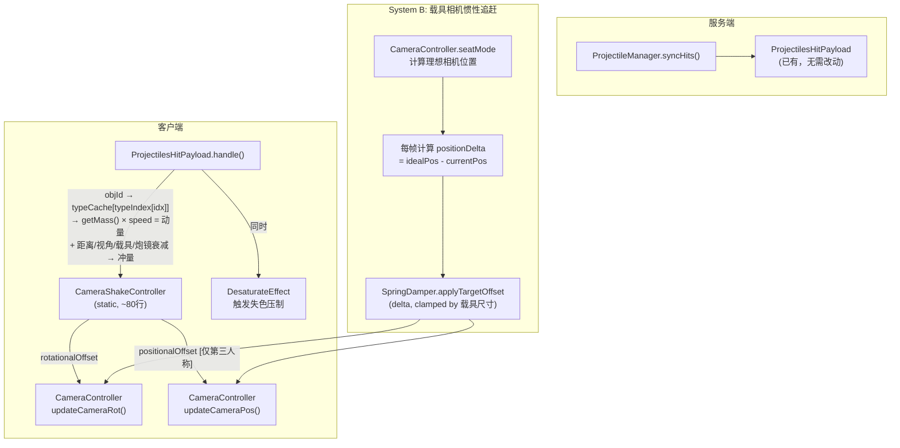
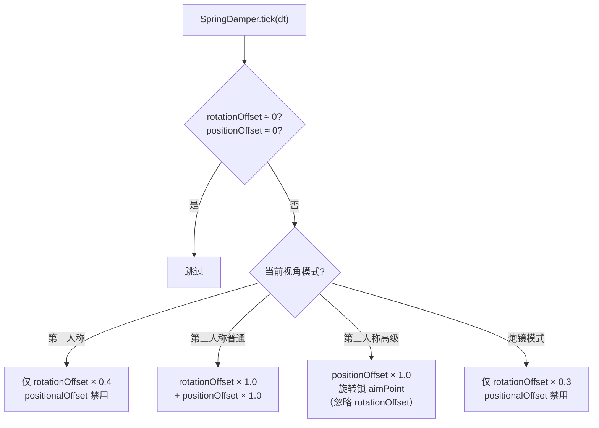
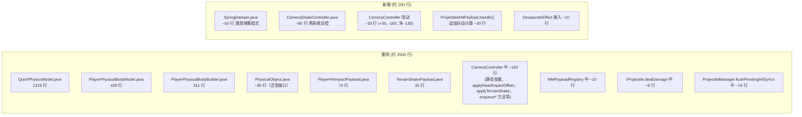

# Machine-Max 相机系统 — 镜头抖动重构设计

> 状态：设计阶段
> 创建时间：2026-07-30
> 关联提交：`28e7dcce`（引入当前抖动实现）
> 关联文件：
> - `src/main/java/io/github/sweetzonzi/machine_max/client/input/CameraController.java`
> - `src/main/java/io/github/sweetzonzi/machine_max/client/render/post/DesaturateEffect.java`
> - `src/main/java/io/github/sweetzonzi/machine_max/util/fl/physics/QuickPhysicsModel.java`
> - `src/main/java/io/github/sweetzonzi/machine_max/util/fl/physics/PlayerPhysicalBodyModel.java`
> - `src/main/java/io/github/sweetzonzi/machine_max/util/fl/physics/PlayerPhysicalBodyBuilder.java`
> - `src/main/java/io/github/sweetzonzi/machine_max/network/payload/PlayerHitImpactPayload.java`
> - `src/main/java/io/github/sweetzonzi/machine_max/network/payload/TerrainShakePayload.java`
> - `src/main/java/io/github/sweetzonzi/machine_max/common/mech/projectile/ProjectileManager.java`
> - `src/main/java/io/github/sweetzonzi/machine_max/common/mech/projectile/IProjectile.java`
> - `src/main/java/io/github/sweetzonzi/machine_max/network/MMPayloadRegistry.java`

## 一、背景与动机

### 1.1 当前实现（提交 `28e7dcce`）

提交 `28e7dcce` 引入了约 2600 行镜头抖动代码，包含两套独立抖动系统：

```
命中事件                              CameraController（渲染帧）
─────────                            ────────────────
IProjectile.dealDamage()
  └→ PlayerHitImpactPayload ────────→ applyHeadImpactOffset()
      (7字段 × 每发命中)                 └→ PlayerPhysicalBodyModel
                                          └→ QuickPhysicsModel（1219行）

RigidProjectile.onCollision()
  └→ ProjectileManager.syncHits()
      └→ TerrainShakePayload ────────→ applyTerrainShake()
          (空包 × 100格内所有玩家)         └→ sin振荡 + 指数衰减

总计: 2个独立网络包 + 3个新物理类 + CameraController +162行
```

### 1.2 当前实现的七个问题

| # | 问题 | 严重程度 | 影响 |
|---|------|----------|------|
| 1 | **无距离衰减** — 100 格外和 1 格外抖动完全相同，`TERRAIN_SHAKE_INITIAL = 0.6f` 固定 | 高 | 远距离炮弹落地不必要地干扰视野 |
| 2 | **无载具判断** — 步行玩家和载具内玩家抖动完全相同 | 高 | 载具应吸收冲击，乘员不应感受全量抖动 |
| 3 | **无视角模式区分** — 第一人称和第三人称抖动完全相同 | 高 | 第一人称位移会晕，应该仅旋转偏移 |
| 4 | **模型过度设计** — `QuickPhysicsModel`（1219行）+ `PlayerPhysicalBodyModel`（429行）+ `PlayerPhysicalBodyBuilder`（311行），合计 ~2000 行模拟"脖子中弹后头部弹性形变"，而实际只需二阶弹簧阻尼 | 中 | 代码膨胀、难以调参、维护成本高 |
| 5 | **网络包冗余** — `PlayerHitImpactPayload` 每发命中单独发送（52字节/包），`TerrainShakePayload` 遍历 O(n²) | 中 | 带宽浪费，密集火力下网络压力 |
| 6 | **状态机脆弱** — `shakeTimes < 3` 阻塞模型置换 + `MIN_SWAP_INTERVAL_MS` 计时器 + `hitHoldFrames` 保持帧，三者构成跨帧状态机，密集火力下容易因计时条件竞争导致模型不置换或异常归零 | 低 | 短期内多次中弹时抖屏可能卡在某个状态无法恢复，但不影响功能正确性（纯客户端隐患） |
| 7 | **炮镜模式也抖动** — `applyHeadImpactOffset` 和 `applyTerrainShake` 在炮镜分支也运行 | 高 | 炮镜瞄准时受影响，体验极差 |

### 1.3 核心设计决策

| 决策 | 理由 |
|------|------|
| 复用 `ProjectilesHitPayload` 广播，不新增网络包 | 客户端已有 `typeCache[typeIndex[idx]].getMass()` 可查投射物质量，冲量 = 质量 × 速度，纯客户端计算 |
| 移除全部三个物理类，用二阶弹簧阻尼替代 | 约 50 行替代约 2000 行，参数从 30+ 个降至 3 个（k, d, mass） |
| CameraShakeController 使用 static，与 CameraController 一致 | 抖屏纯客户端效果，每客户端仅一个本地玩家，static 无冲突 |
| 区分第一/第三人称和炮镜模式 | 提升瞄准体验 |
| 通用弹簧阻尼同时用于两个独立系统：投射物抖屏 + 载具相机惯性追赶 | 统一物理模型，不同触发源、不同参数 |
| 接入现有 `DesaturateEffect` 后处理 | 炮弹命中周围时叠加失色效果，模拟压制感，与抖屏互补 |

---

## 二、架构设计

本设计包含**两个独立系统**，共用同一个 `SpringDamper` 物理模型：

```
                         SpringDamper (二阶弹簧阻尼)
                        /                        \
         System A: 投射物抖屏                  System B: 载具相机惯性追赶
         触发: ProjectilesHitPayload            触发: CameraController 每帧计算
         效果: 视角+位置脉冲偏移                  效果: 相机平滑追赶载具目标位置
         参数: k高, d=临界 (无余振)              参数: k低, d<临界 (有余振)
```

此外还有**System C: DesaturateEffect 压制效果**，与 System A 同步触发。

### 2.1 整体数据流



### 2.2 SpringDamper — 通用二阶弹簧阻尼

```java
/**
 * 通用二阶弹簧阻尼器（mass=1 简化模型）。
 * 支持两种模式：
 * - applyImpulse: 外部冲量（投射物命中），直接加在 velocity 上
 * - setTargetPosition: 设置追赶目标（载具相机），目标移动时自动转化惯性
 * <p>
 * 模型：offset'' = -k*offset - d*offset' （mass=1 约简，impulse 语义为速度增量）
 * 积分：半隐式欧拉。offset 即相机相对于理想位置的偏差。
 * <p>
 * 小 dt 利于积分稳定性，dt 仅在使用 tickCount+partialTick 的游戏暂停期间才会为 0。
 */
public class SpringDamper {
    private final float k;                // 刚度
    private final float d;                // 阻尼系数
    private Vec3 offset = Vec3.ZERO;
    private Vec3 velocity = Vec3.ZERO;

    // 追赶模式状态
    private Vec3 lastTargetPos = null;
    private float maxLag = Float.MAX_VALUE;

    /** 构造。d == 2*sqrt(k) 为临界阻尼 */
    public SpringDamper(float stiffness, float damping) {
        this.k = stiffness;
        this.d = damping;
    }

    /** 施加脉冲冲量（投射物命中），直接加在 velocity 上。mass=1 下 impulse 即速度增量 */
    public void applyImpulse(Vec3 impulse) {
        velocity = velocity.add(impulse);
    }

    /**
     * 设置追赶目标位置（载具相机惯性追赶）。
     * 目标移动时自动将位移差转化为 offset 增量——目标前进，相机滞后。
     * 无 dt 参数，纯粹记录状态。
     */
    public void setTargetPosition(Vec3 worldPos, float maxLag) {
        if (lastTargetPos != null) {
            // 目标移动 → 相机落后 → offset 向反方向增长
            Vec3 delta = worldPos.subtract(lastTargetPos);
            offset = offset.subtract(delta);
        }
        lastTargetPos = worldPos;
        this.maxLag = maxLag;
    }

    /**
     * 每帧积分。dt 由 tickCount + partialTick 差分计算。
     */
    public void tick(float dt) {
        // 钳制最大滞后距离
        double len = offset.length();
        if (len > maxLag && len > 0) {
            offset = offset.scale(maxLag / len);
        }
        // 弹簧恢复力 + 阻尼
        Vec3 acceleration = offset.scale(-k).add(velocity.scale(-d));
        velocity = velocity.add(acceleration.scale(dt));
        offset = offset.add(velocity.scale(dt));
    }

    public Vec3 getOffset() { return offset; }
    public void reset() {
        offset = Vec3.ZERO;
        velocity = Vec3.ZERO;
        lastTargetPos = null;
    }
}
```

**两种使用场景的参数配置**：

| 场景 | stiffness (k) | damping (d) | 行为 |
|------|---------------|-------------|------|
| 投射物抖屏 | 12.0（高） | 6.93（临界） | 快速一震 → 立即恢复，无余振 |
| 载具相机追赶 | 3.0（低） | 1.5（欠阻尼） | 缓慢追赶，有余振，有惯性感 |

---

### 2.3 System A：投射物抖屏

#### 2.3.1 强度计算（纯客户端）

```java
/**
 * 在 ProjectilesHitPayload 客户端处理器中调用。
 * 从投射物 SoA 数据计算冲量，无需服务端额外发送任何数据。
 */
private static void processShakeForHit(ProjectilesHitPayload.HitEntry entry, Player player) {
    // ① 查找投射物在 SoA 中的索引
    ProjectileManager pm = ObjectManager.levelProjectileManagers.get(player.level());
    if (pm == null) return;
    int idx = pm.findIndexByObjId(entry.objId);
    if (idx < 0) return;

    // ② 从 typeCache 获取质量
    ProjectileType type = pm.typeCache[pm.typeIndex[idx]];
    float mass = type.getMass();

    // ③ 计算命中速度
    double speed = Math.sqrt(
        entry.newVelX * entry.newVelX +
        entry.newVelY * entry.newVelY +
        entry.newVelZ * entry.newVelZ);

    // ④ 动量 = 质量 × 速度
    float momentum = mass * (float)speed;

    // ⑤ 距离衰减：1/(1 + d² × factor)
    double distSq = player.distanceToSqr(entry.hitX, entry.hitY, entry.hitZ);
    float distanceFactor = 1.0f / (1.0f + (float)distSq * 0.01f);

    // ⑥ 视角模式因子
    float perspectiveFactor = getPerspectiveShakeFactor();

    // ⑦ 载具因子
    // TODO: CameraController.isOnBoard() 当前不存在（仅有 private boolean onBoard 字段），
    // 实施时需添加 public static isOnBoard() 方法，或改用：
    // IEntityMixin.machine_Max$getControllingSubsystem() instanceof SeatSubsystem
    float vehicleFactor = CameraController.isOnBoard() ? 0.4f : 1.0f;

    // ⑧ 炮镜因子
    float sightFactor = CameraController.isCameraMode() ? 0.3f : 1.0f;

    // ⑨ 最终旋转冲量
    float intensity = momentum * distanceFactor * perspectiveFactor 
                      * vehicleFactor * sightFactor * ROTATION_SCALE;

    // ⑩ 命中方向
    Vec3 hitDir = new Vec3(entry.normalX, entry.normalY, entry.normalZ).normalize();

    // ⑪ 应用
    rotationDamper.applyImpulse(hitDir.scale(intensity));     // 旋转沿法线
    positionDamper.applyImpulse(hitDir.scale(-intensity * 0.3f)); // 位置反向，幅度小
}
```

#### 2.3.2 视角模式应用



| 模式 | 位置偏移 | 旋转偏移 | 说明 |
|------|----------|----------|------|
| **第一人称** | 禁用 | ×0.4 | 相机即眼睛，位移晕；仅旋转模拟头部受震 |
| **第三人称普通** | 启用 | 启用 | 相机物理"被震到"，旋转也受影响 |
| **第三人称高级** | 启用 | 禁用，锁 aimPoint | 位置抖但始终瞄准，对瞄准干扰最小 |
| **炮镜模式** | 禁用 | ×0.3 | 传感器视角不位移 |

---

### 2.4 System B：载具相机惯性追赶

#### 2.4.1 原理

当载具急加速、急刹车、猛落地时，相机应有弹簧阻尼效果——惯性使其滞后，
弹簧拉回时产生余振，产生"重量感"。第一人称也适用，但幅度应小很多
（加一个全局缩放因子即可）。

```
时间 ──────────────────────────────────────────────>

载具位置:  ●────────●  (急刹车)
                    ╲
相机位置:  ●~~~~~~~~~~●  (惯性 → 超出 → 弹簧拉回)
```

每帧计算（`updateCameraPos` 每渲染帧触发，非 20tps）：
1. CameraController 照常计算**理想相机位置**（`idealPos`）——即现有 `updateCameraPos` 逻辑
2. 仅乘坐载具时：`vehicleChaseDamper.setTargetPosition(idealPos, maxOffset)` — 内部自动追踪目标位移
3. 最终叠加（第一人称缩放因子大幅降低幅度）：
   `cameraPos = idealPos + vehicleChaseDamper.getOffset() * FP_VEHICLE_SCALE + positionDamper.getOffset()`

**注意**：离开载具时应调用 `vehicleChaseDamper.reset()` 清空 offset/velocity/lastTargetPos，
否则下次上车时残留的 offset 会导致相机瞬跳。

#### 2.4.2 最大偏移的计算

```java
/**
 * 根据载具包围盒计算最大相机滞后距离。
 * 大载具（坦克/战舰）允许更大的弹簧阻尼滞后。
 * 仅需区分第一/三人称缩放（CameraController 侧处理），无需区分 focusOnCenter/followLocator。
 */
private static float getVehicleMaxOffset() {
    VehicleCore vehicle = CameraController.getActiveVehicle();
    if (vehicle == null) return 0f; // 未乘坐载具，无此效果
    
    // 取载具包围盒对角线长度的一半作为基准
    AABB aabb = vehicle.getBoundingBox();
    double diag = Math.sqrt(
        aabb.getXsize() * aabb.getXsize() +
        aabb.getYsize() * aabb.getYsize() +
        aabb.getZsize() * aabb.getZsize());
    
    // clamp 到合理范围
    return (float)Mth.clamp(diag * 0.3, 0.5, 4.0); // 0.5~4.0 格
}
```

#### 2.4.3 触发时机

| 触发 | 检测方式 | 说明 |
|------|---------|------|
| 急加速/刹车 | `deltaPos.length()` 连续两帧增大 | 现有 `updateCameraPos` 已计算理想位置，自然差分即为加速度 |
| 猛落地 | 载具垂直速度突变（物理线程写入 volatile，主线程读取） | 可通过 `CollisionEffectManager` 获取落地冲击 |
| 急转弯 | 载具角速度 > 阈值 | 从 VehicleCore 读取 |

**统一检测**：不需要显式分类。每帧 `delta = idealPos - cameraActualPos`，
`delta` 本身就编码了所有加速度信息。只需 clamp maxOffset。

#### 2.4.4 与 System A 的叠加

三个 `SpringDamper` 实例互相独立（见 §2.6）：

| 实例 | k | 阻尼比 | 用途 |
|------|---|--------|------|
| `rotationDamper` | 12 | 1.0 临界 | System A 旋抖 |
| `positionDamper` | 12 | 1.0 临界 | System A 位抖 |
| `vehicleChaseDamper` | 3 | 0.43 欠阻尼 | System B 惯性追赶 |

在 CameraController 中最终叠加：
- **旋转**：`seatMode 旋转 + rotationDamper.getOffset() + vehicleChaseDamper.getOffset()`
- **位置**：`idealPos + positionDamper.getOffset() + vehicleChaseDamper.getOffset()`

---

### 2.5 System C：DesaturateEffect 压制效果

已有 [`DesaturateEffect.java`](file:///d:/Files/Project_MinecraftMods/Machine-Max/src/main/java/io/github/sweetzonzi/machine_max/client/render/post/DesaturateEffect.java)
提供全屏失色后处理，通过 `VisualEffectHelper.desaturationLevel` 控制强度。
已有 [`PostProcessingManager.onClientTick`](file:///d:/Files/Project_MinecraftMods/Machine-Max/src/main/java/io/github/sweetzonzi/machine_max/client/render/post/PostProcessingManager.java#L39-L45) 每客户端 tick 执行。

在投射物命中周围时，同时对 `desaturationLevel` 增加一个脉冲值，
让画面短暂轻微失色。脉冲后由每帧 tick 中的指数衰减自动平复。
载具内压制效果应弱化（乘员受装甲保护）。与抖屏互补——抖屏影响瞄准，失色影响感知。

```java
/** 在 ProjectilesHitPayload handler 中同步调用 */
private static void triggerSuppression(float distanceFactor, float momentum) {
    float vehicleFactor = CameraController.isOnBoard() ? 0.3f : 1.0f; // 载具内弱化
    float suppression = distanceFactor * Math.min(momentum / MAX_REFERENCE_MOMENTUM, 1.0f)
                      * SUPPRESSION_SCALE * vehicleFactor;
    VisualEffectHelper.desaturationLevel = Math.min(
        VisualEffectHelper.desaturationLevel + suppression, 0.8f);
}

/**
 * 每 tick 衰减（在 PostProcessingManager.onClientTick 中调用，固定 20tps）。
 * 使用指数衰减，0.95^20 ≈ 0.358，约 1 秒内恢复到 36%。
 */
public static void tickSuppression() {
    if (VisualEffectHelper.desaturationLevel > 0.001f) {
        VisualEffectHelper.desaturationLevel *= 0.95f; // 指数衰减
    } else {
        VisualEffectHelper.desaturationLevel = 0f;
    }
}
```

在 `PostProcessingManager.onClientTick` 中添加一行调用：

```java
@SubscribeEvent
private static void onClientTick(ClientTickEvent.Pre event) {
    if (Minecraft.getInstance().level == null) {
        INSTANCE.disposeAll();
    } else {
        CameraShakeController.tickSuppression(); // 失色压制每帧衰减
    }
}
```

---

### 2.6 CameraShakeController 完整设计

```java
/**
 * 客户端相机抖动与偏移控制器（static，与 CameraController 一致）。
 * 包含三个独立的 SpringDamper 实例：
 * - rotationDamper / positionDamper: System A 投射物抖屏（高k，临界阻尼）
 * - vehicleChaseDamper: System B 载具相机惯性追赶（低k，欠阻尼）
 * <p>
 * 两套刚度必须分开实例，因为挤在一套上会导致抖屏的临界阻尼和追赶的欠阻尼
 * 互相污染——要么抖屏有余振，要么追赶无惯性感。
 * <p>
 * <b>调用线程：</b>渲染线程（updateCameraRot 开头统一 tick）；注意 1.21.1 中渲染线程即主线程
 * <p>
 * <b>计时方案：</b>使用 tickCount + partialTick 差分计算 dt。
 * 之所以不用 System.nanoTime()，是因为 nanoTime() 在游戏暂停时仍然流逝，
 * 恢复后会累积出超大的 dt 导致弹簧突变。tickCount/partialTick 暂停时两者均不增长，dt=0。
 * <p>
 * <b>调用时序：</b>tick() 在每帧渲染调用前（此时才有 partialTick），
 * onVehicleCameraChase() 在同一渲染调用链中设置目标位置，tick 总是在 setTargetPosition 之后执行。*/
 */
public class CameraShakeController {
    // ===== System A: 投射物抖屏 =====
    // 高k + 临界阻尼 → 快速一震后立即恢复，无余振
    private static final SpringDamper rotationDamper = new SpringDamper(12f, 6.93f);
    private static final SpringDamper positionDamper  = new SpringDamper(12f, 6.93f);

    // ===== System B: 载具相机惯性追赶 =====
    // 低k + 欠阻尼 → 缓慢追赶，有余振，有惯性感
    private static final SpringDamper vehicleChaseDamper = new SpringDamper(3f, 1.5f);

    // ===== 帧计时（精确 dt 差分） =====
    private static int lastTickCount = -1;
    private static float lastPartialTick = 0f;

    // ===== 强度缩放常量 =====
    private static final float ROTATION_SCALE    = 0.015f;
    private static final float SUPPRESSION_SCALE = 0.3f;
    /** 第一人称载具惯性缩放 — 大幅降低幅度，仅保留微弱弹簧感 */
    private static final float FP_VEHICLE_SCALE  = 0.15f;

    /**
     * 计算本帧精确 dt（秒）。
     * updateCameraRot 和 updateCameraPos 中均可调用，共享同一计时状态。
     */
    private static float computeDeltaTime(int tickCount, float partialTick) {
        if (lastTickCount < 0) {
            lastTickCount = tickCount;
            lastPartialTick = partialTick;
            return 0.05f; // 首帧用默认值
        }
        float dt = (tickCount - lastTickCount) * 0.05f + (partialTick - lastPartialTick) * 0.05f;
        lastTickCount = tickCount;
        lastPartialTick = partialTick;
        return Math.max(dt, 0.001f); // 防止 dt=0
    }

    /** 由 ProjectilesHitPayload handler 调用 */
    public static void onProjectileHit(ProjectilesHitPayload.HitEntry entry, Player player) {
        // ... 强度计算（见 2.3.1）...
        rotationDamper.applyImpulse(rotationalImpulse);
        positionDamper.applyImpulse(positionalImpulse);
        triggerSuppression(distanceFactor, momentum);
    }

    /**
     * 由 CameraController.updateCameraPos 调用（仅乘坐载具时）。
     * 传入载具理想相机位置，SpringDamper 内部追踪目标位移自动产生弹簧阻尼滞后。
     * 第一人称和第三人称均适用，CameraController 侧用 FP_VEHICLE_SCALE 缩放 offset。
     */
    public static void onVehicleCameraChase(Vec3 idealPos, float maxOffset) {
        vehicleChaseDamper.setTargetPosition(idealPos, maxOffset);
    }

    /**
     * 每帧 tick，CameraController.updateCameraRot 开头调用。
     * 参数由 ViewportEvent.ComputeCameraAngles 提供（来自 Camera.getPartialTick()）。
     */
    public static void tick(int tickCount, float partialTick) {
        float dt = computeDeltaTime(tickCount, partialTick);
        rotationDamper.tick(dt);
        positionDamper.tick(dt);
        vehicleChaseDamper.tick(dt);
    }

    // Getters
    public static Vec3 getRotationOffset()      { return rotationDamper.getOffset(); }
    public static Vec3 getPositionOffset()       { return positionDamper.getOffset(); }
    public static Vec3 getVehicleChaseOffset()   { return vehicleChaseDamper.getOffset(); }
}
```

**为什么需要三个独立实例而非复用同一个**：

| 维度 | rotationDamper + positionDamper | vehicleChaseDamper |
|------|--------------------------------|---------------------|
| 刚度 k | 12.0（高） | 3.0（低） |
| 阻尼比 | 1.0（临界，无余振） | 0.43（欠阻尼，有余振） |
| 触发方式 | `applyImpulse`（瞬时脉冲） | `setTargetOffset`（每帧追赶） |
| 目的 | 中弹瞬间快速震动 | 相机持续平滑惯性 |

---

## 三、网络层变更

### 3.1 需要删除的

| 文件 | 行数 | 说明 |
|------|------|------|
| `PlayerHitImpactPayload.java` | 70 行 | 功能由 `ProjectilesHitPayload` 覆盖 |
| `TerrainShakePayload.java` | 35 行 | 同上 |
| `MMPayloadRegistry.java` 中对上述两包的注册 | 10 行 | 移除注册代码 |

### 3.2 需要修改的

| 文件 | 变更 | 说明 |
|------|------|------|
| `IProjectile.java` `dealDamage()` | 移除 `PlayerHitImpactPayload` 发送代码（~8行） | 命中冲击由客户端自计算 |
| `ProjectileManager.java` `flushPendingHitSyncs()` | 移除 `TerrainShakePayload` 发送代码（~19行） | 抖动由客户端在 `ProjectilesHitPayload` handler 中自行处理 |
| `ProjectilesHitPayload.java` `handle()` | 增加对 `CameraShakeController.processShakeForHit()` 的调用 | 复用 handle 中已有的 `idx`（避免重复 O(n) 扫描），追加抖动计算 |

### 3.3 保持不变

| 文件 | 说明 |
|------|------|
| `ProjectilesHitPayload.java` 数据模型 | `HitEntry` 字段不变，无需新增 `impulse` |
| `ProjectilesSpawnPayload.java` | 不变 |
| `ProjectileManager.java` SoA 数组 | `typeCache`、`typeIndex` 不变 |

**关键认知**：`HitEntry` 已有 `objId`、`newVelX/Y/Z`、`hitX/Y/Z`、`normalX/Y/Z`。客户端通过 `objId` → `typeCache[typeIndex[idx]].getMass()` 获取质量，结合速度计算动量。无需新增任何网络字段。

---

## 四、删除清单总览



净变更：**删除约 2500 行，新增约 200 行，净减少约 2300 行。**

---

## 五、实施步骤

### 第一阶段：基础（System A + System C）

1. 新增 `SpringDamper.java` — 通用二阶弹簧阻尼
2. 新增 `CameraShakeController.java` — static，包含 `rotationDamper` + `positionDamper`
3. 在 `ProjectilesHitPayload.handle()` 中追加 `onProjectileHit()` 调用
4. 在 `DesaturateEffect` 接入 `triggerSuppression()`
5. 在 `CameraController.updateCameraRot/Pos` 中接入 System A 的输出
6. 本地测试：各距离、各视角模式投射物命中的抖屏效果 + 失色压制

### 第二阶段：清理

7. 删除 `QuickPhysicsModel.java`、`PlayerPhysicalBodyModel.java`、`PlayerPhysicalBodyBuilder.java`
8. 删除 `PlayerHitImpactPayload.java`、`TerrainShakePayload.java` 及注册代码
9. 移除 `IProjectile.dealDamage()` 中的 `PlayerHitImpactPayload` 发送
10. 移除 `ProjectileManager.flushPendingHitSyncs()` 中的 `TerrainShakePayload` 发送
11. 清理 `CameraController` 中的静态变量、`applyHeadImpactOffset`、`applyTerrainShake`、`enqueueHitImpact`、`enqueueTerrainShake` 等

### 第三阶段：扩展（System B）

12. 在 `CameraShakeController` 中添加 `vehicleChaseDamper`
13. 在 `CameraController.updateCameraPos` 中添加 `getVehicleMaxOffset()` 和 `onVehicleCameraChase()` 调用
14. 本地测试：载具急加速/刹车/落地的相机惯性追赶效果

### 第四阶段：验证

15. 单人全模式测试：投射物抖屏 + 载具惯性追赶 + 失色压制
16. 多人测试：确认无跨玩家干扰

---

## 六、参数调优参考

### SpringDamper 参数

| 参数 | System A (抖屏) | System B (追赶) | 调节方向 |
|------|----------------|-----------------|----------|
| `stiffness (k)` | 12.0 | 3.0 | 增大 → 更快恢复 |
| `damping (d)` | 6.93（临界） | 1.5（欠阻尼） | 减小 → 更多余振 |
| `d / (2*sqrt(k))` | 1.0 | 0.43 | >1 过阻尼, =1 临界, <1 欠阻尼 |

### 缩放因子

| 参数 | 默认值 | 调节方向 |
|------|--------|----------|
| `ROTATION_SCALE` | 0.015 | 全局旋抖强度 |
| `SUPPRESSION_SCALE` | 0.3 | 失色压制强度 |
| `距离衰减系数` | 0.01 | 增大 → 远距离衰减更快 |
| `第一人称因子` | 0.4 | System A 第一人称旋转偏移缩放 |
| `载具因子` | 0.4 | System A 载具内震感缩放 |
| `炮镜因子` | 0.3 | System A 炮镜模式震感缩放 |
| `FP_VEHICLE_SCALE` | 0.15 | System B 第一人称载具惯性缩放——大幅降低，仅微弱弹簧感 |
| `vehicleChaseDamper.maxLag` | `clamp(diag*0.3, 0.5, 4.0)` | 载具相机最大滞后距离，传入 `setTargetPosition(idealPos, maxLag)` |

---

## 七、未决问题

1. **高级模式（位置抖+旋转锁）的第三人称实现** — 当前 CameraController 中第三人称旋转由 `updateCameraRotSeatMode` 控制。锁 aimPoint 需要在该路径中跳过 `rotationalOffset` 的应用。可行性高，但需改动现有旋转逻辑。此模式搁置，待基础版本稳定后再议。

2. **是否需要暴露 SpringDamper 参数到模组配置** — 暂时硬编码，稳定后考虑暴露。

已决议的问题：

| 问题 | 决议 |
|------|------|
| System B 区分 focusOnCenter/followLocator | 无需区分，仅需区分第一/三人称 |
| System B 旋转维度惯性追赶 | 不需要，仅位置追赶 |
| DesaturateEffect 衰减机制 | 加 `tickSuppression()` 方法，在 `PostProcessingManager.onClientTick` 中调用，指数衰减 |
| SpringDamper mass 参数 | mass=1 简化模型，impulse 即速度增量 |
| dt 计时方案 | tickCount + partialTick 差分（非 nanoTime），保证暂停时 dt=0 |
| vehicleChaseDamper 离开载具 | 调用 `reset()` 清空状态，防止下次上车瞬跳 |
| PhysicalObject.java | 随其他物理类一并删除 |
