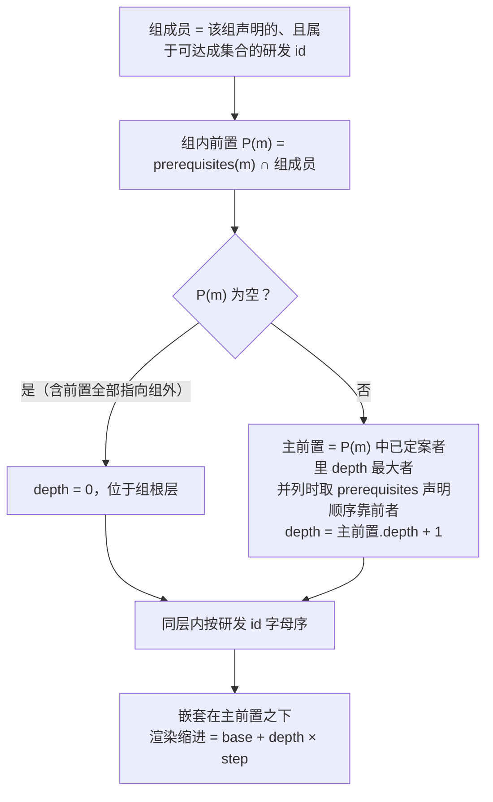
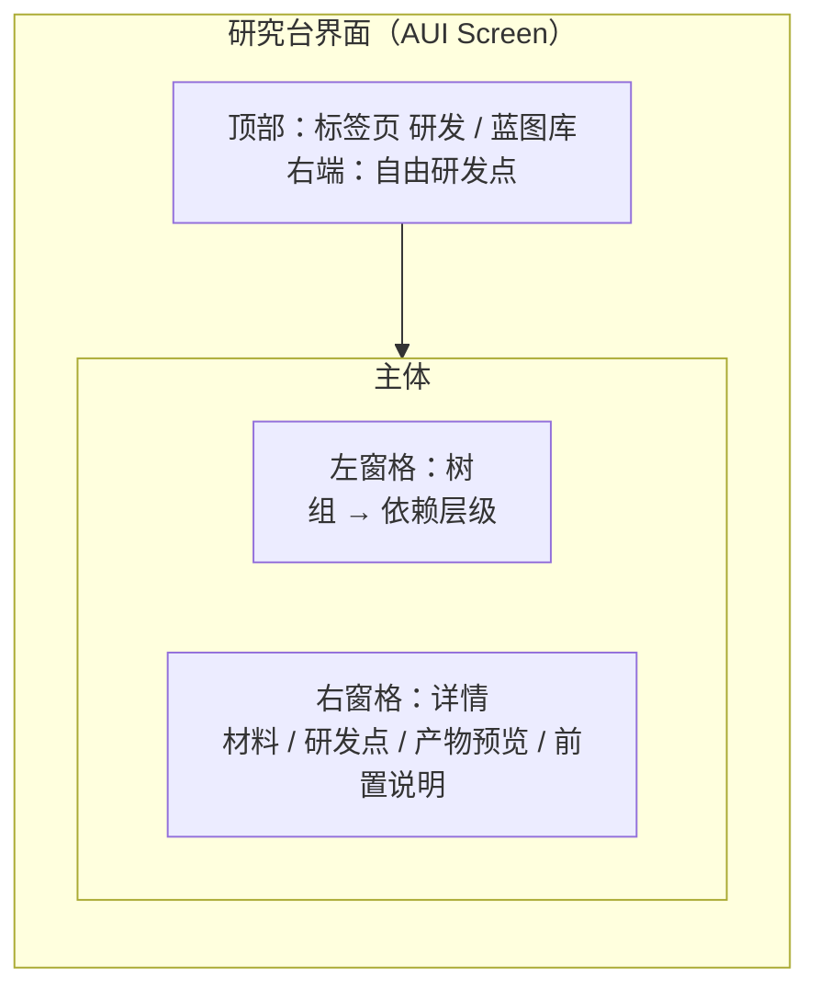

# 研究台界面 — 研发分组、研发路径与蓝图库统一重构计划

**版本**：2.2（已实施）\
**日期**：2026-09-25\
**目标**：让玩家能在研究台里按载具浏览研发项目、看清研发先后关系；研究台的两个标签页统一到一套树形界面

---

## 一、问题

研究台的研发标签页把全部研发项目平铺成一列。官方内容包当前有 **61 条**研发项目，分属 **12 辆**载具，全部混在同一条列表里。

玩家在这个界面上遇到六个问题，前四个出在浏览方式上，后两个出在研发流程上：

1. **看不出归属。** `ae86_wheel`、`kluo_hull`、`van_door` 之类的条目按 id 相邻排列，玩家无法判断哪些零件属于同一辆车，也无法回答"这套载具我还差哪些零件"。
2. **顺序无规律。** 列表顺序取自一个 `HashMap` 的迭代序（`MMDynamicRes.ALL_RESEARCH_RECIPES`），与载具归属无关，且会随内容包变化整体重排。同一个项目在两次打开之间位置不一致。
3. **只能搜索，不能浏览。** 界面唯一的导航手段是搜索框，玩家必须先知道要搜什么才能找到目标；61 条内容在约 195 像素高的视口里需要滚动约 9 屏。
4. **看不见研发先后关系。** 零件之间存在技术依赖（原厂胎 → 赛用胎、基础件 → GT 改件），配方结构上可以声明这种关系，界面上没有任何呈现。
5. **产出要过一道中间站。** 研发完成后蓝图进入"成果暂存"，玩家还要再点一次"取出"才能到手；暂存是一份独立持久化的数据，配套一条同步载荷，背包放不下时产物不进背包、直接掉落在脚下。
6. **重印没有成本。** 再次产出同一份蓝图的条件只有"该条目已研发"与"暂存中没有产物"。把蓝图送给别人或丢掉之后可以无限次免费再产出一份，制造蓝图因此实际可无限复制。

前四个问题的共同原因是：**研发项目只有"一个 id"这一个维度，没有归属维度，也没有关系维度。** 界面无从组织，只能平铺。后两个问题出在流程层：研发的产物被拆成"登记完成"与"交付物品"两件事，而交付这一侧既没有独立成本，又要靠一份暂存数据在各端之间保持一致。

---

## 二、目标形态

### 2.1 两个概念

**组（group）**：一组研发项目的归属标签，通常对应一辆载具或一个系列。组只表示归属，不是排他容器——一个研发项目可以同时属于多个组。典型情形是某个零件同时被多个载具使用，或一个系列存在多个变形版本。组没有独立的定义文件：组因被配方引用而存在，显示名从已有数据派生。

**研发路径**：研发项目之间的先后关系。一个项目可以声明若干前置项目，前置全部完成后该项目才可研发。一辆载具的零件通常从车架出发——车架不设前置，位于该组的根层，其余零件以车架作为前置。

这两个概念相互正交：组回答"这个项目属于谁"，研发路径回答"这个项目要等谁"。分组不会表达依赖，依赖也不会表达归属。

**研发条目与制造蓝图**是两个不同的概念，必须分开：

| 概念 | 是什么 | 关系 |
| --- | --- | --- |
| 研发条目 | 研究台里的一个项目，由研发配方定义 | 完成后登记为已完成；不产出物品 |
| 抄录 | 对已完成研发条目的动作 | 消耗 1 张空白蓝图，产出 1 份该零件的制造蓝图 |
| 制造蓝图 | 物品 `part_fabricating_blueprint`，携带 `part_type` 组件 | 零件可被制造与装配的凭证 |

研发（经抄录）是制造蓝图的来源之一，不是它的定义：一个零件可以没有研发条目而直接拥有制造蓝图。装配门禁的判据同时涉及这两个概念，见 §5.8。

### 2.2 目标界面

研发标签页呈现为可折叠的分组列表，组内按研发路径缩进：

```
▾ ae86                     6/6
    车架                   已完成
    ├ 车体                 已完成
    ├ 轮胎                 可研发
    │   └ 赛用轮胎         前置未完成
    └ 车门                 材料不足
▸ kluo                     3/11
▸ 杂项                     2
```

- 组头显示该组的名称、展开箭头与"已完成数 / 总数"，同时扮演进度总览的角色；不显示图标，也不另设全局进度。
- 无组内前置的项目位于组根层，有前置的按层级缩进。
- 一个项目有多个前置时，嵌套在**最深**的那个前置之下（详规则见 §5.4），其余前置在行内标注"另需 N 项"、在详情面板分类列出。
- 没有声明任何组的项目归入"杂项"，不丢弃。

### 2.3 目标形态如何解决第一章的问题

| 问题 | 解决方式 |
| --- | --- |
| 看不出归属 | 项目收纳在组内，组头给出载具名称与进度 |
| 顺序无规律 | 组之间与组内同层之间都按 id 字母序，结果确定 |
| 只能搜索不能浏览 | 折叠状态下 12 个组头即可一屏看完，组头直接给出"还差几个" |
| 看不见研发先后关系 | 组内按前置关系缩进，前置未完成的条目显示为锁定状态 |
| 产出要过一道中间站 | 研发只登记完成态，蓝图由抄录产出后直接进入玩家背包（§4 决策 17） |
| 重印没有成本 | 蓝图的每一次产出都经抄录，消耗 1 张空白蓝图（§4 决策 17） |

### 2.4 蓝图库标签页

蓝图库是同一个界面的另一个标签页，当前也是扁平列表，分为"我的设计"与"内容包蓝图"两段。它需要的是同一类结构——按来源与归属分层浏览。两个标签页因此共用一套树形渲染与交互，只是各自提供不同的数据。

---

## 三、现状与差距（本节为实施前的基线）

本节记录编写本计划时的代码状态，是后续各章的依据；实施后的最终状态见第十一章。这一章描述的现象正是本计划要消除的差距。

### 3.1 配方类层次

| 类 | 内容 | 直接子类 | 外部引用 |
| --- | --- | --- | --- |
| `AbstractResearchRecipe` | `researchCost`、`researchIngredientPairs` 及材料校验/消耗方法 | `ResearchRecipe` | 无 |
| `ResearchRecipe` | 增加 `prerequisites`、`icon`、`description`；实现原版 `Recipe<FabricatingInput>` | `BlueprintResearchRecipe` | 界面泛型上界 `RecipeHolder<? extends ResearchRecipe>` |
| `BlueprintResearchRecipe` | 增加 `unlock_recipe` | 无 | 多处 |

`AbstractResearchRecipe` 只有一个直接子类，且没有任何其它代码引用它。索引、界面与泛型上界都基于 `ResearchRecipe`，该抽象基类当前没有承担职责。

### 3.2 数据维度

研发配方当前不声明任何归属，`groups` 一类的字段不存在。`prerequisites` 字段在两种类型的 JSON Schema 中均已定义，但 61 条配方无一填写，也没有界面呈现它。

### 3.3 索引

索引在 datapack reload 时由 `MMDynamicRes.DataPackReloader.apply()` 重建：

| 索引 | 键 → 值 | 排序 |
| --- | --- | --- |
| `ALL_RESEARCH_RECIPES` | 研发 id → RecipeHolder | 无 |
| `BLUEPRINT_RESEARCH_RECIPES` | 研发 id → RecipeHolder | 无 |
| `SERVER_RESEARCH_BY_PART` | 零件 id → 研发 id | 无 |
| `SERVER_RESEARCH_BY_FABRICATING_RECIPE` | 制造配方 id → 研发 id | 无 |

索引容器是 `HashMap`，界面直接流式迭代其 `values()`，这是第一章第二个问题的直接成因。

### 3.4 界面

`BlueprintResearchScreen` 是 `AbstractContainerScreen` 子类，在同一个 Screen 内用 `applyTab()` 切换两个标签页。研发标签页的列表控件与蓝图库的列表控件都是 `AbstractScrollWidget` 子类，只能一维平铺，不支持折叠。

研发列表的展示模型 `ResearchState` 有 13 个字段，由 `rebuildEntries()` 每客户端 tick 对全部条目重建一次。

### 3.5 内容包数据

61 条研发配方全部位于 `Machine-Max_Official_Pack`，全部为 `machine_max:blueprint_research` 类型。`machine_max:research`（通用研究）类型注册了类型与序列化器，没有配方使用。这批数据是占位数据，将按研发路径重写。

### 3.6 研发流程与玩家状态

玩家侧的科研状态存放在实体附件 `BlueprintAttachment` 中：研发点余额、已完成研发 id 集合、研发产物映射 `products`（研发 id → 蓝图物品）与可用配方缓存 `availableRecipes`。附件整体经 `ResearchAttachmentSyncPayload` 同步；研发点变化、研发完成、产物变化各有下行载荷，完成、取出、重印三个请求各有上行载荷。

与研发产物相关的四个动作：

| 动作 | 入口 | 消耗 | 结果 |
| --- | --- | --- | --- |
| 研发 | `completeResearch` | 研发材料 + 研发点 | 登记完成态；蓝图研发配方另产出一份蓝图写入 `products` |
| 取出 | `claim` | — | 把 `products` 中该项放入背包，放不下则掉落在脚下；随后清空该项 |
| 重印 | `reclaim` | — | 前置条件为"该条目已研发"且"`products` 中该项为空"，产出一份蓝图写入 `products` |
| 刷新可用配方 | `rebuildAvailableRecipes` | — | 扫描背包与 `products`，把其中的零件制造蓝图录入 `availableRecipes` |

`products` 是研发产物的唯一落点：蓝图不直接进入背包，`availableRecipes` 的构建把它与背包并列作为蓝图的来源。

装配门禁 `canAdvanceAssembly` 的现状判据五条：创造模式；该零件没有零件配方；该零件在 `SERVER_RESEARCH_BY_PART` 中没有对应条目；该零件的研发条目已完成；玩家持有该零件的制造蓝图。第三条放行没有研发条目的零件，§5.8 的判据不含它。

---

## 四、已确认决策

| # | 事项 | 结论 | 理由 |
| --- | --- | --- | --- |
| 1 | 归属写在哪一侧 | 写在**配方**内；组不设独立的定义文件 | 内容包的同名文件覆盖是整文件替换。归属写在别处意味着第三方包要向已有组追加成员就得覆盖那个文件，连带顶掉原作者写入的其它成员；归属写在配方里，第三方包新增自己的文件即可加入。组的显示名由组 id 派生语言键（见 §5.2），一个只放一两个字段的模块没有存在价值 |
| 2 | 是否允许多归属 | 允许，配方以数组声明多个组 | 同一零件被多个载具使用、同一系列存在多个变形版本，都是常态 |
| 3 | `prerequisites` 字段 | 字段定义保留（两种类型的 JSON Schema 均含该字段，内容包未填写） | 它是研发路径的唯一载体。语义为**研发门禁**：前置全部完成后本项目才可研发。典型用途：原厂胎 → 赛用胎、基础件 → GT 改件 |
| 4 | 配方类层次 | 收敛为 `ResearchRecipe` 与 `BlueprintResearchRecipe` 两个类，`AbstractResearchRecipe` 的字段与方法并入 `ResearchRecipe` | `AbstractResearchRecipe` 只有一个直接子类且无外部引用，未承担职责。`ResearchRecipe` 本身就是"研发项目基类"，蓝图研发配方是它的特化类型 |
| 5 | 依赖关系的呈现范围 | 在**组内**呈现依赖层级 | 组是玩家浏览的单位，路径在同一组内才有意义 |
| 6 | 排序 | 不引入优先级字段；组内按 id 字母序 | 12 个组、单组最多十余条，字母序足以定位；引入优先级字段会带来维护成本而无实际收益 |
| 7 | 无所属组的项目 | 归入"杂项"，不丢弃 | 内容包可以只定义研发、不定义组 |
| 8 | 研发等级 | 不存在等级维度，完成态即集合成员关系 | 等级是早期规划的遗留，实现中体现为 `levels > 0` 等价于完成 |
| 9 | 交付流程 | 先出本计划文档审阅 → 再开工；UI 实现前先交付硬编码 HTML 原型确认风格布局 | 界面形态需要先看到实物才能定 |
| 10 | 装配门禁的判据 | 只看两件事：该零件的研发条目是否已完成、玩家是否持有该零件的制造蓝图。不为"没有研发条目"或"研发条目不可达"单独放行 | 研发条目与制造蓝图是两个独立概念，研发只是制造蓝图的来源之一。要让"仅有制造蓝图、无研发途径"的稀有零件成立，就必须以"持有蓝图"作为独立通过条件；一旦为缺失或不可达的研发条目开设放行分支，这类零件的凭证语义就被架空 |
| 11 | 界面形态 | 左树 + 右固定详情：左窗格是可折叠树，右窗格显示选中项详情 | 两个标签页共用同一渲染器；单屏元素数可控，窄屏下只需压缩左栏 |
| 12 | 不可达成项目的处理 | 照常进入研发索引与界面，置于所属组根层，行内标注"不可研发"并注明原因 | 内容包作者能在游戏内直接发现配置错误，不必翻日志。可见性完全由界面层控制，数据层的可达成性判定不受影响 |
| 13 | 迁移范围与蓝图库粒度 | 两个标签页在同一次迁移中完成；蓝图库在阶段 4 先按"我的设计 / 内容包蓝图"两级扁平，阶段 5 再树化 | 同一 Screen 内两种技术栈并存会互相干扰输入与渲染，一次迁完规避该风险；蓝图库与研发树共用渲染器，树化可以后置 |
| 14 | 界面承载方式 | 纯 `Screen` + 全局 `Document`（与载具控制面板一致），`BlueprintResearchMenu` 与菜单屏注册一并移除 | 该 Menu 不绑定方块、无槽位，只为承载科研状态；打开链路换成"服务端发载荷、客户端开屏"，与载具控制面板的既有做法一致 |
| 15 | 通用研究类型的展示 | 树节点模型需要能表达"无产物、无解锁配方"的条目；数据层不新增字段，`machine_max:research` 只用基类已有的成本、材料、前置、图标与描述 | 该类型已注册类型与序列化器，内容包可以直接使用；界面若不承载这类条目，其内容就无处显示 |
| 16 | 组头与进度显示 | 组头只显示组名、展开箭头与该组的"已完成数 / 总数"，不显示图标，也不另设全局进度；一个组可能因内部的不可达成条目而永远达不到完成 | 单组条目最多十余条，组头计数已足以说明进度；组图标的来源是根层条目的 `icon`，会引入一条取数分支而无实际信息量 |
| 17 | 研发流程 | 研发只登记完成态、不产出物品；制造蓝图由**抄录**动作产出，每次消耗 1 张空白蓝图，不消耗研发点。研发配方的研究材料缺省为空，需要以既有零件作为研发前提的条目把该零件写进 `research_ingredients`（如强化储存箱列出储存箱一份）。装配门禁沿用现有判据（研发条目已完成或持有制造蓝图），见 §5.8 | 蓝图产出后直接进入玩家背包，不存在中间存放态；两次消耗各自独立可解释：研发点与研发材料买的是"学会"，空白蓝图买的是"载体"。抄录的每一次产出都付出 1 张空白蓝图，蓝图不能免费无限复制。抄录的动机不依赖门禁：放置 0 组装进度的线框零件必须手持零件制造蓝图（`PartFabricatingBlueprintItem.use()`），蓝图物品因此是生存流程中的必需物 |

---

## 五、数据层设计

### 5.1 配方字段

研发配方的 JSON 顶层字段 `groups`，类型为资源路径数组，可选：

```json
{
  "type": "machine_max:blueprint_research",
  "groups": ["machine_max:ae86", "machine_max:ae86at"],
  "research_cost": 60,
  "prerequisites": ["machine_max:research/ae86_chassis"],
  "icon": "machine_max:textures/icon/ae86/ae86_wheel_icon.png",
  "description": "research.machine_max.ae86_wheel_blueprint.desc",
  "unlock_recipe": "machine_max:part_fabricating/ae86_wheel"
}
```

- 字段可选，缺省为空数组，该配方进入"杂项"。
- 组 id 为资源路径。组的显示名由组 id 派生语言键（见 §5.2），不写进 JSON。
- `prerequisites` 的每一项是**另一条研发配方的完整配方 id**。研发配方位于 `recipe/research/` 下，注册名保留该目录段（只有 `recipe/` 这一段被原版配方加载器去掉），因此前置写作 `machine_max:research/<名字>`，不是裸名 `machine_max:<名字>`。

### 5.2 组的表示与显示名

组因被配方引用而存在，显示名从已有数据派生。组与研发条目取的是两个不同的语言键：

| 展示项 | 语言键来源 | 示例 |
| --- | --- | --- |
| 组的显示名（组头） | 组 id 的 `ResourceLocation.toLanguageKey()`，即 `<namespace>.<path>`；组 id 是裸 RL | `machine_max:ae86` → `machine_max.ae86` |
| 研发条目名（树行与详情页标题） | 研发配方 id 的 `ResourceLocation.toLanguageKey()`；id 含 `research/` 目录段 | `machine_max:research/ae86_chassis` → `machine_max.research.ae86_chassis` |

条目名取的是研发项目自身的名字，与产物名无关：同一零件可以有彼此独立的研发项目名与产物名（也可以直接沿用零件名文案）。官方内容包的语言文件中已经存在 `machine_max.ae86` → `AE86`、`machine_max.ae86at` → `AE86(全地形)` 这类载具名键，组 id 取载具 id 时不需要新增语言条目；`machine_max.research.*` 这一批键需要内容包自行补写。语言键缺失时，组头回退显示组 id，条目名回退显示配方 id 原文。

裸语言键空间是扁平的，组 id 与配方 id 理论上会取到同一个键（组 `machine_max:ae86` 与某条名为 `ae86` 的配方）。此时两处显示同一个名字，无功能影响。

由于组不存在于独立文件中，"引用了未定义的组 id"与"组存在但无成员"这两类不一致状态不可能出现，相应校验项也不需要。

将来若要引入组定义文件（组级描述、组的嵌套层级），做法是新增一个以组 id 命名文件的模块。`groups` 中存放的是裸 id，该模块对既有数据零影响，不需要迁移。

### 5.3 配方类层次

| 类 | 职责 |
| --- | --- |
| `ResearchRecipe` | 研发项目基类。持有研发点成本、研发材料、前置项目、图标与描述；实现原版 `Recipe<FabricatingInput>` 以接入配方数据加载与客户端同步 |
| `BlueprintResearchRecipe` | 蓝图研发项目。在基类之上持有 `unlock_recipe`，指明该条目被抄录时产出的制造蓝图 |

### 5.4 组索引与依赖层级

reload 时构建下列结构，并保持有序：

| 结构 | 内容 |
| --- | --- |
| `GROUP_MEMBERS` | 组 id → 该组成员研发 id 的有序列表 |
| `NODE_DEPTH` | (组 id, 研发 id) → 该条目在该组内的依赖层级与主前置 |

层级计算分两个阶段：先在**全局图**上判定可达成性、提取依赖环，再在**每个组内**分层。

#### 阶段一：全局可达成性与依赖环

图的节点是全部已注册研发 id，边由前置关系产生：`p → m` 表示 m 把 p 声明为前置。判定是**正向传播**：从没有前置的节点出发逐层向外推进，推不到的节点即不可达。

判据必须落在「前置全部已达」上。反向写法（「有前置未达即判为不可达」）缺少起点：它的基线是「已被判为不可达的节点」，而纯环（`A → B → C → B`）内部不存在这样的节点，环会整块留在可达集合里。

```
可达 = 空集；候选 = 全部研发 id
重复:
    就绪 = { m ∈ 候选 : 前置集合 P(m) ⊆ 可达 }   // P(m) 为空时该条件天然成立
    若 就绪 为空，结束
    可达 ∪= 就绪；候选 -= 就绪
不可达成集合 = 候选
```

不可达的节点分三类，三者都与"永久无法研发"等价：

| 类别 | 成因 |
| --- | --- |
| 悬空前置 | 前置引用了不存在的研发 id，该 id 永远不会进入可达集合 |
| 位于依赖环上 | 环上每个节点都在等环上另一个节点，谁都无法先启动 |
| 位于依赖环下游 | 前置不可达成，自身随之不可达成 |

第三类容易被漏判。以 `A → B → C → B` 加上 `D → C` 为例（`P(A)` 为空，`P(B) = {A, C}`，`P(C) = {B, D}`，`P(D) = {C}`）：第一轮只有 A 就绪，此后没有任何节点满足「前置全部已达」，B、C、D 全部留在不可达成集合里，其中只有 B 与 C 是环成员。

这三类不只是排列显示的问题。`ResearchRecipe.isCompletedBy` 要求全部前置都在 `completedResearches` 中，因此环上及下游的项目在游戏逻辑上永远无法完成，而不只是层级算不出来。它们被判定为不可达成，在界面上标注为不可研发（§4 决策 12）。

**环检测在全局图上进行。** 前置是全局的研发 id，环可以跨组：A 属于组 1 并依赖组 2 的 B，B 又依赖 A。按组建图看不到这个环——A 与 B 在各自组内都表现为"无组内前置"，位于根层，界面上没有任何异常，而两者永远研发不了。全局检测正是为了在这种情形下把两者标注出来。

**环路径的提取**用强连通分量（SCC）一次遍历完成：Tarjan 或 Kosaraju 求出全部分量，分量大小 ≥ 2、或大小为 1 且带自环的分量即环上集合，每个这样的分量产出一条环路径写入错误信息，形如 `machine_max:b → machine_max:c → machine_max:b`，其余分量不受影响。

SCC 是图的唯一划分：分量成员与遍历起点无关，一趟遍历覆盖全部环成员，产出的环路径不取决于任何遍历顺序。共享节点的两个环（`A → X → A` 与 `B → X → B`）落在同一个分量里，一并报出。

SCC 只负责产出环路径文本，不参与可达成性判定——悬空前置的节点自身就是一个合法的大小为 1 的分量，SCC 看不出它不可达。

「环下游」不需要单独求：不可达成集合减去环上集合即环下游。

起始节点按 id 字母序选取，保证结果不随容器迭代序变化。遍历采用迭代实现而非递归，长依赖链不会造成栈溢出。

节点把自身列为前置（`m ∈ P(m)`）时永远不会就绪，判定上自动落入不可达成集合，不需要为自环写特例分支；错误信息单独表述为「项目把自己列为前置」。

**记录与处理**：每个含环的强连通分量写一条环路径到 `errorMessages`；环下游节点各写一条，注明所依赖的不可达项目；悬空前置各写一条。可达成集合之外的节点照常进入研发索引，界面按 §4 决策 12 展示。同一节点同时符合多条时按 自环 > 环成员 > 环下游 > 悬空前置 取第一条，只报一条，避免内容包作者重复核对同一处配置。

由此产生的连带效果是这些项目对应的零件虽有研发条目，但该条目永远无法完成，其可装配性完全落在"是否持有制造蓝图"上。装配门禁不为这种情况开设分支，判据见 §5.8。

#### 阶段二：按组分层与主前置



按 Kahn 拓扑序推进：初始队列为该组中 `P(m)` 为空的所有成员，按 id 字母序入队；一个成员出队时把其后继的入度减一，后继入度归零时定案它的 `depth` 与主前置。

主前置必须在入度归零时定案，而不是一访问就定案：只有全部组内前置都定案之后，才能保证选出的主前置确实是 depth 最大者。

阶段一已经把全部不可达节点排除在可达成集合之外，而环上节点必然不可达，因此组内图必定无环，Kahn 分层不会留下无法处理的节点。

不可达的条目仍按 §4 决策 12 显示在所属组内，但不参与这里的入度计算：它们一律置于组根层，不缩进、不承载子节点，行内标注不可研发与原因。这样环上的节点不会因为无法定案而卡住整个组的 Kahn 推进。

确定性落在三处：初始队列顺序、同层排序、环路径提取的起点，一律按 id 字母序。

关键性质：

- `depth(m) = 主前置.depth + 1` 恒成立，缩进层级与嵌套结构自洽。取最深前置而非最浅，正是为了维持这条不变式。
- 主前置并列时取 `prerequisites` 中声明顺序靠前者。内容包作者向数组末尾追加前置时，既有嵌套关系保持不变。
- 组内前置按组计算。同一研发项目属于多个组时，它在不同组内的层级可以不同，这是该模型的正确结果。
- 车架类零件不填前置，位于根层；同车其余零件以前置指向车架，位于其下一层。

### 5.5 边界情况

| 情况 | 处理 |
| --- | --- |
| 前置引用不存在的研发 id | 阶段一判定为不可达成；节点保留在索引与界面，置于组根层并标注"不可研发"，同时记入 `MMDynamicRes.errorMessages` |
| 位于依赖环上 | 判定为不可达成；节点保留在索引与界面，置于组根层并标注"不可研发"；错误信息附上该分量的一条环路径 |
| 节点把自身列为前置 | 判定为不可达成；节点保留在索引与界面，置于组根层并标注"不可研发"；错误信息表述为「项目把自己列为前置」 |
| 位于依赖环下游 | 判定为不可达成；节点保留在索引与界面，置于组根层并标注"不可研发"；错误信息注明所依赖的不可达项目 |
| 前置指向组外（已注册且可达成） | 不计入组内前置；项目位于组内根层，行内标注"另需 N 项"，详情面板列出"需要：<名称>（其他分组）" |
| 组内前置有多个 | 主前置按 §5.4 规则选出；嵌套在主前置之下，其余组内前置计入"另需 N 项"，详情面板列出 |
| `depth` 过大 | 视觉缩进在 `depth ≥ 4` 后停止增长，避免挤压行宽；层级数值本身不截断 |

### 5.6 排序的确定性

组与组内条目的排序在数据层完成，界面只消费结果：

- 组之间：组 id 字母序。
- 组内同层之间：研发 id 字母序。
- 索引容器使用保持插入序的实现，或在构建阶段排序后写入。

### 5.7 校验与错误上报

沿用 `MMDynamicRes` 现有的错误收集通道（`errorFiles` / `errorMessages`，由 `recordIfServer` 写入、只记服务端）。研究分组与依赖相关的校验项：

1. `prerequisites` 引用不存在的研发 id——该节点及依赖它的节点被判定为不可达成。
2. 依赖环（含跨组环与自环）——每个含环的强连通分量记录一条环路径，环上及环下游节点被判定为不可达成。
3. 组缺少语言键（警告级，界面回退显示组 id）。

### 5.8 装配门禁的判据

`BlueprintAttachment.canAdvanceAssembly` 的判定如下，其中属于研发门禁的只有最后两项，且与研发条目的可达性无关：

```
可推进组装 = 玩家处于创造模式
          或 该零件没有零件配方（组装走兜底分支，不消耗材料）
          或 该零件的研发条目已完成
          或 玩家持有该零件的制造蓝图
```

- 研发条目与零件的对应关系来自 `SERVER_RESEARCH_BY_PART`。该映射不存在时，「研发条目已完成」一项恒为假，判定自然落到"持有制造蓝图"上，因此不需要为"没有研发条目"或"研发条目不可达"单独开设放行分支。不可达的研发条目同样在这张映射里，它的「已完成」判定永远为假，判定同样落到"持有制造蓝图"上。
- "持有制造蓝图"经 `availableRecipes` 缓存判定，缓存由背包中的零件制造蓝图构建。
- 一个零件即使没有研发途径，只要玩家持有它的制造蓝图（战利品、交易、其它配方等来源），仍可推进组装——这正是稀有零件所需的形态。
- 官方内容包当前是 61 条研发配方与 61 条零件配方一一对应，每个带零件配方的零件都有对应的研发条目，因此该判据对现有内容没有影响。
- 判据里没有「找不到研发条目就放行」这一分支：只定义零件配方、未定义研发条目的零件，其可装配性同样落在"持有制造蓝图"上。内容包若采用这种写法，需要为该零件补上研发条目，或自行提供蓝图来源。

零件制造蓝图的当前来源只有抄录：`BlueprintAttachment.createBlueprintProduct` 按研发的 `unlock_recipe` 所指配方的类型产出零件制造蓝图或通用制造蓝图，抄录动作在该研发条目已完成的前提下调用它；内容包中没有产出 `part_fabricating_blueprint` 的配方。要让"仅有制造蓝图、无研发途径"的零件成立，需要另外提供蓝图来源（战利品表、交易、工作台配方等）。

---

## 六、界面设计

### 6.1 技术路线

研究台界面迁移到 AUI，采用与载具控制面板相同的架构：一个 `Screen` 承接生命周期，一块 AUI `Document` 承接布局、渲染与元素输入。

动态内容的渲染在 Java 侧完成，页面内不写逻辑脚本。这一选择跟随 AUI 自带资源管理器的做法——它是最接近本需求的既有实现，且已解决本引擎上的已知问题。

界面由纯 `Screen` 承载后，打开链路是：研究台方块右键由服务端发一个打开界面的载荷，客户端据此开屏；科研状态继续走 `BlueprintAttachment` 与既有研发载荷，不依赖 Menu。`BlueprintResearchMenu`、`MMGuiManager` 中的菜单屏注册随迁移移除；JEI 侧的 `IGuiContainerHandler<BlueprintResearchScreen>` 注册要求容器屏，需要换成非容器屏的等效做法或明确放弃该交互。

### 6.2 可借鉴的既有实现

AUI 自带的资源管理器（源码位于 `../AUI`）是一棵可折叠文件树，全部由 Java DOM 驱动，没有页面脚本。它的四项做法直接适用于本项目：

| 问题 | 做法 |
| --- | --- |
| 展开一个节点时重建整棵树，导致子节点入场动画重放 | 只填充或清空该节点的直接子容器，其余 DOM 保持 |
| 修改父元素 class 后，依赖父级选择器的子元素样式不重新匹配 | 对目标元素显式标脏，不依赖继承传导 |
| 反复赋值 `innerText` 不触发文本重渲染 | 一律新建文本元素，不做原地赋值 |
| 页面刷新重建 DOM 后旧元素引用与监听器失效 | 缓存分支元素的直引用并检查存活；监听器用标记位保证只绑一次 |

本节四项做法与 §九 的渲染成本判断，按 `gradle.properties` 中 `aui_version`（1.2.5）对应的源码核对过。`docs/AUI性能边界.md` 调研的是 1.1.6-dev，其中尺寸单位与 Grid 的结论已被后续版本覆盖（1.2.5 支持 `calc()`、`rem`/`em`、`fr`、`minmax()`、`repeat()`），引用前需按 `../AUI` 源码复核。

原型阶段在游戏内实测还暴露了两处与浏览器不一致的引擎语义，实施时一律按右列写法：

| 现象 | 原因与写法 |
| --- | --- |
| 属性值上调 `split("|")` 会按字符切开，`parseInt` 得 NaN | AUI 侧 `getAttribute` 返回的是 Java `String`，Rhino 把其上的方法调用派发到 Java 的同名方法，`split` 走的是 `String.split(regex)` 而不是 ES 语义，而 `|` 是正则交替。凡要对属性值调方法，先用 `String(...)` 收成 JS 字符串原语；属性内部的分隔符只用 `,` 与 `;`——这两个字符在两种语义下都是字面量 |
| 行内「左侧弹性文本 + 右侧固定内容」时，右侧被挤出容器，或弹性文本被压成一个字 | `flex: 1`（等价 `basis: 0%`）与单独出现的 `flex-shrink: 0` 在 AUI 下主轴尺寸回写有条件。弹性文本一律写 `flex: 1 1 auto` + `min-width: 0`，固定项一律写 `flex: 0 0 auto`；定宽栏位不要只写 `width` + `flex-shrink: 0`，直接写 `flex: 0 0 <像素值>`——`basis: auto` 在 AUI 下会按内容尺寸取，栏位会被内容撑宽 |

两处都按 AUI 自带资源管理器的既有写法核对过（`devtools/resource.html` 的文件树行与 `theme/ore/ore.css` 的输入组）。

### 6.3 界面结构



标签页条右端常驻玩家现有自由研发点数，两个标签页共用；数值取自 `BlueprintAttachment.getFreeResearchPoint()`，每 tick 比对后写入 `#tab-points-value`，避免每帧重排。

两个标签页的树结构：

```
研发                                   蓝图库
▾ ae86                6/6             ▾ 我的设计
    车架              已完成             我的 AE86 拉力版     正常
    ├ 车体            已完成             损坏条目             解析失败
    ├ 轮胎            可研发          ▾ 内容包蓝图
    │   └ 赛用轮胎    前置未完成         ▾ Machine-Max 官方包
    └ 车门            材料不足              官方 AE86 草图    正常
▸ kluo                3/11
▸ 杂项                2
```

组头承载"该组已完成数 / 总数"，同时充当进度总览。搜索框作用于整棵树的过滤：命中子节点时保留其祖先链，命中组名时展开该组。

### 6.4 共享渲染器

两个标签页的树共用同一个渲染器。渲染器只消费节点模型，不感知数据来源：

| 节点字段 | 含义 |
| --- | --- |
| id | 稳定标识（研发 id / 蓝图文件名 / 内容包蓝图 id） |
| label | 显示文本（已在 Java 侧完成本地化与参数插值） |
| icon | 图标资源 |
| item | 可选物品，用于物品图标渲染；无产物的条目（如通用研究）留空 |
| depth | 缩进层级 |
| expandable / expanded | 是否可折叠及当前状态 |
| statusText / statusTone | 状态文案与色调（正常 / 已完成 / 锁定 / 不可研发 / 警告 / 错误） |
| actions | 动作列表（开始研究 / 取出 / 删除 / 改名），含启用状态、是否行内展示与点击回调键 |
| children | 子节点 |

研发标签页的节点来自组索引与依赖层级；蓝图库标签页的节点来自本地蓝图目录扫描结果与内容包蓝图索引。

### 6.5 本地化

AUI 的 `<translation>` 元素不支持参数插值。研发界面的多参数文案（前置缺失数量、制造耗时秒数）与蓝图库的文件名与质量统计，都在 Java 侧用 `Component.translatable(...)` 格式化后以纯文本写入节点，`<translation>` 元素只用于无参数文案。

### 6.6 折叠状态与选中项

折叠状态与上次选中项保存在客户端静态字段中，跨界面开关保留，与列表控件记录上次选中研发项的做法一致。

---

## 七、HTML 原型阶段（UI 实现的前置闸门）

在写任何界面 Java 代码之前，先交付一个纯静态原型页面，供确认风格与布局。

### 7.1 交付物

页面与样式都放在 `src/main/resources/assets/apricityui/apricity/machine_max/` 下：

| 文件 | 内容 |
| --- | --- |
| `research_ui_prototype.html` | 页面结构、硬编码样例数据、原型交互脚本 |
| `research_ui.css` | 公共部分：重置、标签页条、双栏骨架、树控件、详情面板骨架、通用按钮与状态色调 |
| `research_ui_research.css` | 研发标签页：橙色主题、产物/研发点/材料/前置区块、不可研发原因框 |
| `research_ui_library.css` | 蓝图库标签页：蓝色主题、来源徽标、蓝图属性区块、解析失败样式 |

样式按「公共 / 研发 / 蓝图库」三份拆分，与载具控制面板的 `vehicle_control.css` + `vehicle_control_tabNN.css` 的组织方式一致：公共骨架只写一次，两个标签页各自只覆盖强调色与专属区块。

### 7.2 原型约束

- 全部数据硬编码在页面内，条目名称、图标与蓝图都取自官方内容包的真实资源，以贴近最终观感。
- 只取 5 个组作取样（AE86 / 大运重卡 / 吉普牧马人 / K螺小车车 / 杂项），覆盖多归属以外的主要形态；条目级数值是编造的样例值。
- 不引入任何 Java 代码，不发网络包，点击只改变本地 DOM 状态。
- 两个标签页都要呈现，因为它们是同一个界面的两部分。
- 研发标签页的样例数据要包含：已完成 / 可研发 / 材料不足 / 前置未完成 四种状态，一层依赖缩进，以及一个置于根层、标注为不可研发的条目（对应 §4 决策 12）。研究材料缺省为空（§4 决策 17），"材料不足"由把前置零件写进 `research_ingredients` 的条目承载。

### 7.3 需要确认的内容

| 项 | 待确认 |
| --- | --- |
| 折叠交互 | 组是默认展开首组还是全部折叠；折叠是否为动画过渡；搜索框清空后是否恢复此前的折叠状态 |
| 依赖缩进 | 缩进步长、缩进连接线是否需要；缩进在 `depth ≥ 4` 停止增长后，更深的层级如何区分（层级数字 / 连接线样式 / 不再区分） |
| 行内动作 | 状态按钮是常驻还是悬停出现；图标还是文字 |
| 详情区位置 | 固定右栏，还是随选中项展开；窄屏如何处理 |
| 视觉主题 | 是否引入 AUI 内置的 Ore 主题，还是沿用载具控制面板的深色工业风 |
| 蓝图库分组 | 蓝图库分几层（来源 / 内容包 / 载具 / 条目） |

### 7.4 迭代方式

原型期间使用 AUI 的 F10 资源管理器打开页面预览，配合自动重载与自动截图迭代样式。若热重载对 classpath 资源不生效，则临时把原型放在游戏目录的 `apricity/` 下迭代，定稿后移入仓库。

原型经确认为最终形态后，才进入 Java 实现阶段。

---

## 八、实施顺序

| 阶段 | 内容 | 依赖 |
| --- | --- | --- |
| 0 | 本计划文档审阅 | — |
| 1 | 配方类层次收敛（`AbstractResearchRecipe` 并入 `ResearchRecipe`）；两处 `== ItemStack.EMPTY` 引用比较（`BlueprintAttachment` 与 `BlueprintResearchScreen`）改用 `isEmpty()`；装配门禁按 §5.8 的判据实现；研发流程按 §4 决策 17 落地（研发不产出物品，蓝图改由抄录产出）；`ResearchCommand` 的等级参数命名清理 | 阶段 0 |
| 2 | 数据层：`groups` 字段（同时加入 `CODEC` 与 `STREAM_CODEC`，否则分组到不了客户端）、全局可达成性与依赖环检测、组索引、按组分层与主前置 | 阶段 0 |
| 3 | HTML 原型（硬编码数据，两个标签页） | 阶段 0 |
| 4 | AUI 界面实现：共享树渲染器、两个标签页、Screen 迁移（含打开链路改为载荷开屏、`BlueprintResearchMenu` 与菜单屏注册移除、JEI 处理器改法） | 阶段 3 确认 |
| 5 | 蓝图库树化：按来源、内容包、载具组织导航 | 阶段 4 |
| 6 | 内容包数据重写（补 `groups` 与 `prerequisites` 形成研发路径；按 §4 决策 17 把 `research_ingredients` 清空，只保留以既有零件为研发前提的条目）与文档同步 | 阶段 2 |

界面层当前存在的问题（研发列表的哈希序、每客户端 tick 全量重建）随阶段 4 的界面替换一并消失，不单独修复。阶段 1 只处理配方结构与逻辑层的缺陷，该层与界面替换相互独立。

---

## 九、风险与注意点

| 风险 | 说明 | 应对 |
| --- | --- | --- |
| AUI 无脏区域渲染 | 每帧遍历整条绘制队列，元素数量增长会影响帧率 | 控制单屏元素数；折叠状态下不为不可见子节点创建 DOM；入场动画仅在条目数少时启用 |
| 界面替换期间两个标签页的技术栈并存 | 一个 Screen 内同时存在 MC widget 与 AUI Document，输入与渲染互相干扰 | 两个标签页在同一次迁移中一并完成 |
| 蓝图库的 3D 预览 | 当前预览依赖 `ItemModelWidget`；AUI 侧的等价位是自定义元素 | 项目已有自定义 AUI 元素的先例（`PartModelElement`），可照此实现；或由 Screen 层承载预览区 |
| 迁移到纯 Screen 的连带改动 | 打开链路、菜单屏注册、JEI 容器屏处理器三处都依赖 Menu 或容器屏，改屏后同时失效 | 打开改为服务端载荷 + 客户端开屏；JEI 处理器改用全局处理器或移除；三处与界面迁移放在同一阶段内完成 |
| 树过滤与折叠的交互 | 过滤命中子节点时若祖先处于折叠态，结果不可见 | 过滤结果自动展开祖先链；搜索框非空时忽略折叠状态 |
| 多归属对进度统计的影响 | 一个条目计入多个组，组内计数相加会高于实际条目数 | 组头按该组可见条目数计数；不另设全局进度，因此不需要去重后的总数（§4 决策 16） |
| 研发路径数据尚未写入 | 依赖层级在当前数据下全部落在根层，视觉效果与平列表一致 | 层级算法与渲染先行实现；数据写入后自然生效，无需改动渲染 |
| 装配门禁对第三方内容包收紧 | 判据不含「找不到研发条目就放行」这一分支；只定义零件配方、未定义研发条目的零件，可装配性只能由"持有制造蓝图"满足 | 内容包文档中写明「带零件配方需配套研发条目」，或为该零件提供蓝图来源（战利品表、交易、工作台配方） |
| 已研发未取出的蓝图流失 | `BlueprintAttachment` 的研发产物映射（`products`）在存档结构中没有位置，旧存档里已研发但未取出的蓝图随之丢失；研发完成态保留，可重新抄录，此前消耗的研发点与材料不退还 | 开发阶段接受。丢失的只是可再产出的一份物品 |

---

## 十、待审阅确认项

1. **渲染逻辑位置**：动态内容的渲染在 Java 侧完成。若希望渲染逻辑位于页面内脚本，需要专门设计 Java 与页面的数据通道，并单独立项。

---

## 附录 A：涉及的核心文件

| 用途 | 文件 |
| --- | --- |
| 研发配方基类 | `common/recipe/ResearchRecipe.java` |
| 蓝图研发配方 | `common/recipe/BlueprintResearchRecipe.java` |
| 配方类层次收敛时删除 | `common/recipe/AbstractResearchRecipe.java` |
| 研发索引与 reload | `external/MMDynamicRes.java` |
| 玩家研发状态 | `common/attachment/BlueprintAttachment.java` |
| 研发配方类型注册 | `common/registry/MMResources.kt` |
| 研发命令 | `common/command/ResearchCommand.kt` |
| 研究台界面 | `client/render/gui/screen/BlueprintResearchScreen.java` |
| 研究台菜单与菜单屏注册（界面迁移时移除） | `common/menu/BlueprintResearchMenu.java`、`common/registry/MMMenus.java`、`client/render/gui/MMGuiManager.java` |
| 界面展示模型 | `client/render/gui/screen/ResearchState.java` |
| 研发列表控件 | `client/render/gui/renderable/ResearchRecipeListWidget.java` |
| 蓝图库列表控件 | `client/render/gui/renderable/BlueprintLibraryListWidget.java` |
| 内容包配方规范 | `docs/wiki/5-内容包制作教程/5.8-研发与制造配方.md` |
| 蓝图库设计 | `docs/蓝图库-玩家设计保存与取用设计.md` |
| AUI 可借鉴实现 | `../AUI/common/src/main/java/com/sighs/apricityui/dev/ResourceManager.java` |

---

## 十一、实施记录

阶段 0 到阶段 6 已全部落地，`./gradlew clean build` 通过。本节记录交付范围与实施中对计划的取舍。

### 11.1 交付物

| 内容 | 位置 |
| --- | --- |
| 配方类层次 | `common/recipe/ResearchRecipe.java`（含 `groups` 字段与材料方法）、`common/recipe/BlueprintResearchRecipe.java` |
| 研发索引、可达成性与依赖环、组索引、按组分层 | `external/MMDynamicRes.java`（`rebuildResearchIndex`、`buildResearchGraph`、`buildGroupDepth`、`stronglyConnectedComponents`） |
| 抄录动作与装配门禁 | `common/attachment/BlueprintAttachment.java`（`canTranscribe`、`transcribe`、`canAdvanceAssembly`） |
| 抄录与开屏载荷 | `network/payload/research/ResearchTranscribePayload.java`、`ResearchScreenOpenPayload.java` 及同名 Handler |
| 界面 | `client/render/gui/screen/BlueprintResearchScreen.java`、`client/render/gui/research/`（`ResearchTreeNode`、`ResearchAction`、`ResearchTreeView`、`ResearchTreeData`、`ResearchDetailRenderer`、`BlueprintLibraryTreeData`、`ResearchHtml`）、`assets/apricityui/apricity/machine_max/research_ui.html` |
| 界面样式 | `research_ui.css`、`research_ui_research.css`、`research_ui_library.css` |
| 自由研发点显示 | 标签页条右端 `#tab-points-value`（`research_ui.html` + `research_ui.css` 的 `.tab-points`），`BlueprintResearchScreen.refreshPoints` 每 tick 比对后写入 |
| 内容包数据 | `spark_modules/Machine-Max_Official_Pack/machine_max/recipe/research/` 下 61 个配方补 `groups` 与 `prerequisites` |

### 11.2 相对计划的取舍

| 事项 | 实施结果 | 原因 |
| --- | --- | --- |
| JEI 查询 | 研究台界面不再支持把材料或产物交给 JEI 查询 | 原处理器以容器屏为前提（`IGuiContainerHandler`），界面改为纯 `Screen` 后不适用；本次未提供非容器屏的等效实现 |
| 蓝图库详情 | 呈现成品属性（零件数、设计质量）、来源、装配模板、作者、创建时间、读写标记与说明 | 材料清单与 3D 预览需要以自定义 AUI 元素渲染物品与模型，本次未引入该元素 |
| 蓝图库动作 | 取出 / 改名 / 删除；内容包蓝图只读，仅可取出 | 与既有能力一致；原型页中的「重印」在实现中不存在 |
| 组的语言键校验 | 界面按 §5.2 回退显示组 id，不记录装载期警告 | 语言表是客户端资源，服务端校验会把内容包已有的组名全判为缺失 |
| 客户端研发索引 | 研发索引与分组依赖索引的重建接在客户端 `RecipesUpdatedEvent` 上，与服务端共用同一套构建代码 | 只有数据包重载（服务端）会构建索引时，连到外部服务器的客户端读不到任何研发数据 |
| `ResearchCommand` | `recipe add <id>` / `remove <id>` / `all` / `clear` | 等级维度不存在，`levels` 参数与 `set` 子命令随之取消 |
| 内容包分组 | 61 条研发配方按载具归属分组，全地形件与 GT 件同时属于基础组与变体组；`dayun_trailer`、`dayun_steel_coil` 归入 `machine_max:dayun_with_trailer`，其余大运条目归 `machine_max:dayun` | §5.1 的多归属示例 |
| 前置 id 形态 | `prerequisites` 统一写完整研发配方 id（`machine_max:research/<名字>`），原为裸名；16 个 schema 的该属性补 description 说明写法 | SparkCore 的配方模块把内容包文件按 `recipe/<子目录…>/<文件名>` 注入，原版加载器只去掉 `recipe/` 一段，故 `recipe/research/x.json` 的注册名是 `machine_max:research/x`，裸名解析不到任何配方 |
| 条目名语言键 | 官方内容包补 `machine_max.research.<名字>` 61×2 条（中/英），取值沿用同名零件名文案 | 条目名取配方 id 的语言键，id 含 `research/` 段后键名变为 `machine_max.research.*`，内容包原先没有这批键 |

### 11.3 原型页的定位

`research_ui_prototype.html` 保留为风格与布局的确认记录，不随实现同步：其动作键与文案（`reclaim`、重印）与实现的抄录动作不同名，样例数据中的研发材料与成本是编造值，实现的字段取值以内容包数据为准。真正的页面骨架是 `research_ui.html`。

### 11.4 待确认项在实现中的落点

§7.3 列出的六项按下列结果落地：研发标签页首次打开时只展开首组，其余折叠；缩进与层级引导线都在行内（每级一个 `.n-guide` 元素，12px + 行内 gap 4px = 每层 16px，深度 4 之后停止增长）——AUI 对嵌套容器水平留白的结算与浏览器不一致，详见 §11.5；行内动作由动作自身的 `inRow` 标记决定：研发条目最多一个动作（开始研究 ▶ / 取出 ↓，都在行内），蓝图库行内只保留「取出」（↓，取用蓝图是蓝图库的常用操作），改名/删除只出现在详情面板底部；行内动作常驻、低透明，悬停或选中时增亮；详情固定右栏（170px），窄屏下树栏收缩；视觉沿用原型与载具控制面板的深色工业风，未引入 Ore 主题；蓝图库分「来源 → 内容包 → 条目」三层。

§十 的渲染逻辑位置按 Java 侧渲染落地：页面无逻辑脚本，节点由 Java 拼成 HTML 片段写入容器。

### 11.5 已经发生的风险

§9 的「已研发未取出的蓝图流失」：研发产物映射已随 `products` 移除，旧存档中已研发但未取出的蓝图不再存在，研发完成态保留、可重新抄录，此前消耗的研发点与材料不退还。

详情页的「说明」栏：内容包 61 条研发配方的 `description` 都写成了 `research.machine_max.<名字>_blueprint.desc`，而语言文件中并没有这批键（既有缺口，不是本次改动引入），界面会回退显示语言键原文。本次未处理，待内容包文案补齐后自然恢复。

首次实测发现并修复：研发树组内条目只显示根层一条。`ResearchTreeData` 原先把「子节点列表」再交给入口方法递归，而该方法以「主前置为空」判定根节点——子节点的主前置是父节点、不在子列表中，于是被判成「没有根」而整批丢弃。装载期无错误、组头计数正确（计数取自 `GROUP_MEMBERS`）正是该缺陷的特征。改为按「主前置 → 直接子节点」表逐层展开。

AUI 的嵌套块水平留白结算与浏览器不一致（在 AUI 仓库用无头测试实测，复现件为 `common/src/test/java/com/sighs/apricityui/layout/TreeNestingProbeTest.java`）：

| 每层缩进来源 | 浏览器 | AUI 实测 |
| --- | --- | --- |
| `margin-left:10px` + `padding-left:5px` + `border-left:1px` | 位置 +16，行宽 -16 | 位置 +26，行宽不变 |
| 只 `padding-left:5px` | 位置 +5，行宽 -5 | 位置 +5 ✓，行宽不变 |
| 只 `margin-left:10px` | 位置 +10，行宽 -10 | 位置 +20，行宽不变 |

即：块级子元素的 `margin-left` 被计入两次；嵌套后代的宽度基准不随祖先内容盒收缩。二者叠加使每深一层行的右端外移 16px，被 `.tree-scroll` 的 `overflow-x: hidden` 裁掉——表现为「非根层级缩进错位、右侧状态与动作被切掉」。

同一轮实测还确认：AUI 会把 `inset box-shadow` 渲染成色块（拿它画层级竖线不可行）。缩进与竖线最终都落在行内：每级一个 `.n-guide` 元素（12px + 行内 gap 4px = 16px/层），竖线是它内部的 `.n-guide-line`（1px 宽、靠 `align-self: stretch` 撑满行高，实测引导线元素 16×行高、线 1px×行高，行宽与右侧元素都在容器内）。以上三处偏差（margin 重复计入、嵌套宽度不收缩、inset box-shadow 渲染）都属未声明的实现差异（其文档把 margin/padding/box-shadow 列为已支持），待其修复后本界面可回到容器留白的写法。

搜索框的宽度受另一条引擎约束支配。AUI 的 UA 样式（`global.css`）给 `input` 写了 `width: 64px; overflow: hidden`；同时 AUI 只在 flex 容器自身宽度确定时（`Size.hasDefiniteAutoResolvedWidth`）才把主轴分配结果应用到子项，而该判定对「父级是行向 flex 容器」的元素返回 false。`.search-box` 的宽度正是父级行向 flex（`.tree-toolbar`）分配的，于是它内部的 `input` 即使写了 `flex: 1 1 auto` 也不会被撑开，宽度停在 64px：占位文字被 `overflow: hidden` 截断，可点击与悬停出 I 形光标的范围也只有那 64px。`.search-box` 上的 `width: 100%` 正是为此而写——它只让自身宽度变确定，最终宽度由父级行向 flex 的分配给出。AUI 侧复现件为 `common/src/test/java/com/sighs/apricityui/layout/SearchBoxFlexProbeTest.java`：搜索框无确定宽度时 `input` 停在 64px，有 `width: 100%` 时 `input` 铺满容器内容盒。

材料图标最初套了一层 `<slot>`，想用 `render="item"` 关掉槽位底板，实测底板照画。原因是 `Slot.shouldRenderBackground()` 的判定顺序为 CSS 变量 → `render-bg` 属性 → `render` 属性，而 `global.css` 在 `body` 上写了 `--aui-slot-render-bg: 1`，继承来的值先命中，HTML 属性根本没机会生效（AUI 自己的回归页同样得再补一条 `background-image: none` 才压住）。现在不再用 `<slot>`，材料图标只发 `<item>` 或 `<ingredient>`。

材料图标第二个坑在 AUI 的 `ItemStackExpressionCompiler.serialize`：1.2.5 构件里它把 `ItemStack.save(provider, prefix)` 的返回值丢掉了（字节码 `invokevirtual ItemStack.save:(HolderLookup$Provider;Tag;)Tag` 之后紧跟 `pop`，随后 `toString()` 的是那个从未被写入的 `new CompoundTag()`），而 1.21.1 的这个重载返回一个新 tag、并不写进传入的 prefix——于是它恒定返回空对象 `{}`。AUI 自己的受控 item 走 drivenStack 而非这段文本，所以这个 bug 在它那边一直没暴露。本界面一度直接拿它拼表达式，实测结果是 `<item>`（`parse`）与 `<ingredient>`（竖线）两条路径同时拿到 `{}`，普通物品与部件材料一起变成空白。

部件材料（`machine_max:part` + `machine_max:part_type` 组件）还揭示了 AUI 的 ingredient JSON 路径也走不通：把 `Ingredient.CODEC.encodeStart` 得到的 JSON 交给 `<ingredient>`，这类自定义 ingredient 解出 0 个候选，而普通物品的 `{"item":…}` 能解出 1 个——即 `jsonCandidates` 确实解不了它。但「缺注册表」与「encode 出的 `items` 是字符串而非数组」这两种可能已被对照实测区分开：同一份 JSON 交给带注册表的 `RegistryOps.create(JsonOps.INSTANCE, registryAccess)` 能解出 1 个候选，可见问题只在 ops 缺注册表，与 `items` 的书写形状无关——upstream 的正解就是让 `jsonCandidates` 改用带注册表的 ops。

界面最终的写法是绕开这两处：拿 `ingredient.getItems()`（组件本来就在解析出的栈上）自己取 `save` 的返回值序列化成 SNBT——单个候选发 `<item>`（`parse` 认 SNBT；不能发给 `<ingredient>`，因为 `compileCandidates` 对以 `{` 开头的单条表达式会当 ingredient JSON 去解），多个候选拼竖线交给 `<ingredient>`（轮播仍由 AUI 自己做）；两条都不可用时退回 ingredient JSON。部件物品本身的 GUI 渲染是正常的（`MMItems` 给 `PART_ITEM` 注册了 `CustomModelItemRenderer`，`PartItem.createItemAnimatable` 的 GUI 分支用 2D 图标模型），此前空白只是因为拿不到带组件的栈。

蓝图库的行内动作：原型页在 `tree-library` 上原本不给行内动作，理由是「蓝图条目有取出/重印/改名/删除四个动作，放进行内会把名称挤没」。实现此前把四个动作都渲染进行内，在更深层级被挤出容器并裁掉。现按动作分类：蓝图库行内只保留「取出」（下箭头图标，与研发项一致，取用蓝图是蓝图库的常用操作），改名与删除放在详情面板底部；研发树的开始研究 ▶ / 取出 ↓ 仍在行内。行内与否由 `ResearchTreeNode.Action` 的 `inRow` 标记决定。

动作键与文案统一：研发侧原先把「抄录该零件的制造蓝图」单列为动作键 `transcribe`、文案「抄录蓝图」，与蓝图库的 `take`「取出」重复。两者对玩家都是「把蓝图拿到手里」，现合并为一个动作键 `take` 与一条文案「取出」（`gui.machine_max.research.action.take`，英文 Extract），`gui.machine_max.research.action.transcribe` 已删除；「抄录」一词只留在文档里描述机制本身。网络载荷 `ResearchTranscribePayload` 与 `BlueprintAttachment.canTranscribe/transcribe` 仍叫 transcribe——它们描述的是「消耗空白蓝图产出蓝图」这套机制，不是界面动作键。

动作的元数据集中在 `ResearchAction` 枚举：动作键（写入 DOM 的 `data-act`）、行内图标、按钮色调、文案语言键都是枚举常量的字段，`ResearchTreeNode.Action` 持有枚举而非字符串。这样一处定义即可覆盖全部动作，且缺配置能在编译期暴露：`switch` 对枚举有穷尽性检查，新增动作时漏改的分支会编译失败；按字符串键分几张平行 Map 查表则做不到——缺键只会静默退化（显示原始键、退化成文字按钮、丢掉色调）。组详情的「展开全部 / 折叠全部」两个按钮也纳入该枚举，因此屏幕侧从 `data-act` 读回字符串后统一经 `ResearchAction.byKey` 反查，无效键直接忽略，分发处只出现枚举常量。

