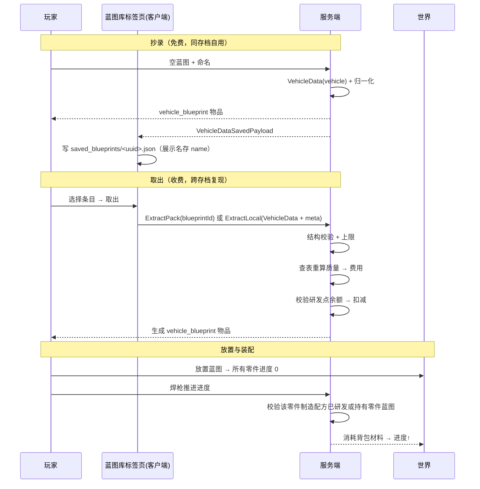
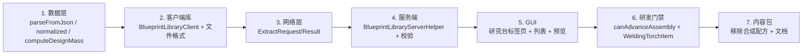

# 蓝图库：玩家设计保存与取用设计

> 状态：**待审阅**
> 分支：1.21.1 · 模组：Machine-Max
> 相关模块：`common/attachment/BlueprintAttachment`、`common/menu/VehicleNamingMenu`、`common/item/prop/{EmptyBlueprintItem,VehicleBlueprintItem,WeldingTorchItem}`、`common/block/research_table/*`、`client/render/gui/screen/BlueprintResearchScreen`、`network/payload/assembly/VehicleDataSavedPayload`、`common/mech/vehicle/data/VehicleData`

***

## 1. 背景与问题

当前「保存载具设计」只能把设计变成**一个物品**，无法被玩家长期持有与复用：

1. **没有玩家蓝图库**。三处 TODO 长期挂空：`MachineMax.java` 的「保存的蓝图在指定路径储存，可被特定方块访问蓝图库」、`BlueprintAttachment.java:439` 的「蓝图库检查」、`MachineMax.java` 的「使用蓝图快速重新组装部分零件缺失的载具」。
2. **本地文件只写不读**。抄录时客户端会把设计写成 `<gamedir>/saved_blueprints/<name>.json`（[VehicleDataSavedPayload.java#L35-L52](file:///d:/Files/Project_MinecraftMods/Machine-Max/src/main/java/io/github/sweetzonzi/machine_max/network/payload/assembly/VehicleDataSavedPayload.java#L35-L52)），但**全仓库没有任何代码读取该目录**。
3. **文件名静默覆盖**。`makeSafeFileName`（[VehicleNamingMenu.java#L89-L107](file:///d:/Files/Project_MinecraftMods/Machine-Max/src/main/java/io/github/sweetzonzi/machine_max/common/menu/VehicleNamingMenu.java#L89-L107)）会把不同设计规范化到同名文件，后保存者静默覆盖先保存者。
4. **`VehicleData`** **只能序列化，不能反序列化**。只有 `serializeToJsonString` / `serializeVehicleDataToJson`（[VehicleData.java#L125-L137](file:///d:/Files/Project_MinecraftMods/Machine-Max/src/main/java/io/github/sweetzonzi/machine_max/common/mech/vehicle/data/VehicleData.java#L125-L137)），没有解析入口，库读取链路缺第一块。
5. **内容包蓝图获取路径与蓝图库割裂**。内容包蓝图由原版 `crafting_shapeless` 配方合成（`spark_modules/**/recipe/blueprint/*.json`），与「蓝图库」不是同一个入口。

此外，研发（研究）目前只解锁**零件制造配方**，且只在手动装配的 HUD 配方切换中被弱使用；制造台与整载具放置均不校验研发。本次一并把研发门禁落到**推进装配进度**这一动作上。

## 2. 设计目标与已确认决策

**目标**：玩家可以保存自己的载具设计，并在任意存档通过研究台取用；内容包蓝图与玩家蓝图在同一列表中呈现；研发门禁有明确、自洽的落点。

**已确认决策**：

| 项      | 决策                                             | 理由                                                    |
| ------ | ---------------------------------------------- | ----------------------------------------------------- |
| 库位置    | 客户端 `<gamedir>/saved_blueprints/*.json`，玩家各自一份 | 天然支持文件分享/备份，无需服务端存储与同步                                |
| 权威源    | 客户端目录；服务端只对上传数据做校验                             | 单人/自建服体验最好                                            |
| 入口     | 复用研究台 `ResearchTable`，GUI 增加「蓝图库」标签页           | 不新增方块                                                 |
| 保存设计   | 保留空蓝图 → 命名 → 产出 `vehicle_blueprint` 物品；库为「中转」  | 兼容现有物品流转与旧存档                                          |
| 取出收费   | **仅取出时**扣研发点，按总质量浮动                            | 同存档自拼自用免费；跨存档复现才付费                                    |
| 内容包蓝图  | 研究台统一发放，移除原版 `recipe/blueprint/*.json` 合成链     | 入口唯一                                                  |
| 研发门禁   | 焊枪推进装配进度时，按零件的**有效制造配方 id** 判定（`customRecipe` 为空时取 `partType` 注册键，即 `Part.getRecipe()` 的回退结果）   | 与现有研究产物（`FabricatingBlueprintItem.RECIPE_TYPE`）一致     |
| 无研究兜底  | 有效配方 id 找不到对应研究条目时**放行**（内容包可能只定义零件、未定义研究）   | 避免内容包缺研究导致零件永久无法装配 |
| 蓝图放置   | 零件进度归零                                         | `VehicleBlueprintItem` 现状即 `readAdditionalData=false` |
| 蓝图物品消耗 | 放置不消耗，图纸永久                                     | 与现状一致                                                 |
| 文件格式   | `VehicleData` 新增 `meta` 字段（作者/时间/描述），只进 `CODEC`        | 旧文件天然兼容；`mass`/`part_count` 现场统计                    |

## 3. 核心语义

> 蓝图库 = **跨存档的图纸库**。
> 同一存档内，玩家自己拼出来的车，抄录免费；换个存档想复现，才付研发点取图。
> 取出的图是**骨架**（所有零件装配进度 0）：进度为 0 的零件**无法工作且一碰就碎**，必须自己投材料 + 已研发，才能焊起来。

这条语义同时解决「整载具蓝图绕过研发」的漏洞：

- 蓝图放置出的零件装配进度为 0，**拆下来只能得到空壳件**，拿不到任何材料（[CrowbarItem.java#L96-L114](file:///d:/Files/Project_MinecraftMods/Machine-Max/src/main/java/io/github/sweetzonzi/machine_max/common/item/prop/CrowbarItem.java#L96-L114) 现状已实现）。
- 要让它跑起来必须投材料 + 已研发，工艺无法白嫖出去。

## 4. 数据格式

### 4.1 元数据字段 `meta`

`VehicleData` 新增一个 `meta` 字段（类型 `BlueprintMeta`，可为空），承载设计元信息：

| 子字段 | 类型 | 说明 |
| --- | --- | --- |
| `author` | String（默认 `""`） | 入库时的玩家名 |
| `created_at` | String（默认 `""`） | ISO-8601 时间戳 |
| `description` | String（默认 `""`） | 玩家填写的设计描述 |

- **`meta` 只进 `CODEC`，不进 `STREAM_CODEC`**：服务端从存档恢复载具时不关心元信息，网络传输 `VehicleData` 时也不携带；需要时由网络包**单独附带**（见 §6.3）。
- 由载具实例构造的 `VehicleData(VehicleCore)` 的 `meta` 为空；只有抄录 / 取出时才写入。
- **不存**的字段：`name`（用 `VehicleData.name`）、`mass`（现场查表统计）、`part_count`（`parts.size()`）、`source`（文件位于 `saved_blueprints/` 即代表玩家设计）。
- `meta` 与其子字段全部可选，**旧存档与旧蓝图文件天然兼容**，无需迁移。
- 需同步修改：`CODEC`、构造函数、`withNewName` / `withNewUUID`（`STREAM_CODEC` 不涉及）。**`equals` / `hashCode` 不纳入 `meta`**（理由见 §6.1）。

### 4.2 抄录时的数据归一化

`VehicleData(VehicleCore)` 会带上世界坐标、UUID、血量比例与零件进度。入库/取出前统一归一化，既减小体积也压缩伪造面：

| 字段                                    | 归一化                          |
| ------------------------------------- | ---------------------------- |
| `pos`                                 | 归零                           |
| `hpRatio`                             | 置 1                          |
| `PartData.assemblingProgress`         | 置 0                          |
| `PartData.materialAssemblingProgress` | 置 0                          |
| `PartData.sharedDurabilityRatio`      | 置 1                          |

### 4.3 统一校验方法

注册表查找需要 `Level`，而 `VehicleData` 构造时没有该上下文，因此把校验抽象为一个独立方法：

```java
List<BlueprintProblem> VehicleData.validate(Level level)
```

**完整校验清单见 §7（唯一权威列表）**，本节只定义接口与错误模型：

- `BlueprintProblem(Kind kind, String detail)`，`Kind`：`MISSING_PART_TYPE` / `MISSING_VARIANT` / `TOO_MANY_PARTS` / `TOO_MANY_RIGID_BODIES` / `TOO_MANY_CONNECTIONS` / `INVALID_VALUE`。
- 方法**不抛异常**，空列表表示通过。
- 调用点在**构造 / 解析之后**，不塞进 `Codec`：`Codec` 无 `Level`，且 `registryKey` 只是 `ResourceLocation`，解码阶段不会失败。但 §7 中的规模 / 边界校验**必须在解码阶段独立完成**，不能只依赖本方法（否则解码期就可能被超大计数撑爆）。
- **异常不向上逃逸到渲染层**：加载阶段只调 `validate`（本身不抛），逐文件 try-catch，失败降级为「错误条目」（见 §6.2）。
- 服务端取出时 `validate` 非空即拒绝，回执 `reason` + `missingPartTypes`，**不扣研发点**。
- 配方（`PartData.customRecipe`）或子零件结构缺失**不阻塞放置**，降级处理：配方缺失回退默认配方；子零件结构不匹配由 §8 的兜底捕获处理。

## 5. 架构与数据流

```mermaid
flowchart TB
  subgraph 客户端
    L[(saved_blueprints/*.json)]
    LIB[BlueprintLibraryClient<br/>扫描/解析/写入]
    U[研究台 · 蓝图库标签页]
    PK[内容包蓝图<br/>MMDynamicRes.BLUEPRINTS]
    L --> LIB --> U
    PK --> U
  end
  subgraph 网络
    U -->|内容包: BlueprintExtractPack(blueprintId)<br/>玩家库: BlueprintExtractLocal(VehicleData + meta)| H
    H -->|BlueprintExtractResult| U
  end
  subgraph 服务端
    H[BlueprintLibraryServerHelper]
    H --> V1[结构校验 + 数值范围 + 上限]
    V1 --> V2[查表重算质量 → 费用]
    V2 --> V3[校验并扣研发点]
    V3 --> V4[生成 vehicle_blueprint 物品]
  end
```

### 5.1 完整时序



## 6. 详细设计

### 6.1 数据层

**位置**：`common/mech/vehicle/data/VehicleData.java`

- 新增 `meta` 字段（类型 `BlueprintMeta`，见 §4.1）。**只进 `CODEC`，不进 `STREAM_CODEC`**；`STREAM_CODEC` 解码时传 `BlueprintMeta.EMPTY`。
- **`equals` / `hashCode` 不纳入 `meta`**：`LEVEL_VEHICLES` 是 `Set<VehicleData>`，元信息不应影响载具身份去重。
- 建议新增 `withMeta(BlueprintMeta)`，与 `withNewName` / `withNewUUID` 保持一致的不可变风格，供抄录 / 取出时附加元信息。
- 新增 `common/mech/vehicle/data/BlueprintMeta.java`：`record BlueprintMeta(String author, String createdAt, String description)`，自带 `CODEC`（子字段全部 `optionalFieldOf`）与 `EMPTY` 常量；`STREAM_CODEC` 仅供网络载荷使用。
- 新增 `public static VehicleData parseFromJson(String json)`：用 `VehicleData.CODEC` + `JsonOps.INSTANCE` 解码，失败抛受检异常或返回 `Optional`，由调用方拒绝。
- 新增 `public VehicleData normalized()`：按 §4.2 返回归一化副本（不可变风格，与 `withNewName`/`withNewUUID` 一致）。
- 新增 `public float computeDesignMass(Level level)`：**现场统计**，按 `PartData.registryKey` + `variant` 查 `PartType` → `VariantAttr`，遍历其 `subParts` 累加 `SubPartAttr.getMass()`（用法参考 [VariantAttr.java#L125](file:///d:/Files/Project_MinecraftMods/Machine-Max/src/main/java/io/github/sweetzonzi/machine_max/common/mech/vehicle/attr/VariantAttr.java#L125)）。**不实例化物理体**，纯查表，服务端可用。
- 新增 `validate(Level)` → `List<BlueprintProblem>`，以及 `BlueprintProblem` / `Kind`（见 §4.3）。
- 零件数直接用 `parts.size()`，不额外提供方法。

### 6.2 客户端蓝图库

**新增**：`client/blueprint/BlueprintLibraryClient.java`

| 职责 | 说明                                                                 |
| -- | ------------------------------------------------------------------ |
| 扫描 | 遍历 `FMLPaths.GAMEDIR/saved_blueprints`，产出 `valid` / `broken` 两个列表 |
| 缓存 | 会话内按 `fileName + lastModified` 记忆化；不做常驻缓存与重载机制                                      |
| 写入 | 抄录时按 `VehicleData.CODEC` 写入；`存入库` 时把手中 `vehicle_blueprint` 的 `VEHICLE_DATA` 写入       |
| 重名 | 文件名与展示名解耦：文件名用 `UUID.json`，展示名取自 JSON 内 `name`；**不再静默覆盖**                                |
| 迁移 | 旧文件缺少新字段时按空值处理，不强制改写                                                     |

**扫描结果分两个列表存放**，不引入快照 record：

- `valid: List<BlueprintLibraryEntry>` —— 解析 + `validate` 通过
- `broken: List<BlueprintLibraryError>` —— 解析失败或 `validate` 有问题

- `BlueprintLibraryEntry` 字段：`fileName`、`payload`（`VehicleData`）。展示所需的 `name` 取自 `payload.name`，`author` / `createdAt` / `description` 取自 `payload.meta`；`mass` / `partCount` 现场统计，不落盘。
- `BlueprintLibraryError` 字段：`fileName`、`reason`（枚举：`PARSE_ERROR` / `MISSING_PARTS` / `OVERSIZED`）、`detail`（缺失的零件 / 变体 id 列表，或异常消息）。

**加载时机与 IO**：不做常驻缓存与重载机制，**打开菜单时现场扫描，主线程限流**：

1. 先 `File.listFiles()` 列出目录（微秒级），立即渲染列表骨架（文件名、大小、修改时间）。
2. 解析 + `validate` **全部在主线程**，但**每 tick 至多处理 1 个文件**（用 tick 驱动队列），处理完即刷新对应条目；解析中的条目显示加载态。
3. 会话内按 `fileName + lastModified` 做一层轻量记忆化，避免反复开关菜单重复解析。
4. 菜单关闭时停止队列；重新打开则重新列举目录（记忆化会跳过已解析文件）。

量级评估：单个蓝图 JSON 约 10~100 KB；即使每 tick 只处理 1 个，几十个文件也只需几十 tick，单次解析量远低于 1 tick 预算。**选择主线程限流而非后台线程，是为了让 `validate` 与内容包数据处于同一线程**——`MMDynamicRes` 的 `PART_RECIPES` / `ALL_FABRICATING_RECIPES` 等是普通 `HashMap`，`prepare()` 会 `clear()` 后重填，后台线程读取存在并发风险。

**排序**：`valid` 按名称 / 创建时间排序；`broken` 统一追加到列表**末尾**，与 `valid` 之间加一条分隔线。

**注意**：文件名不再使用 `makeSafeFileName` 的结果（改为客户端写入时生成 `UUID.json`），因此服务端「已保存到 `saved_blueprints/<fileName>`」的提示需改为「已保存到蓝图库」，避免提示名与实际写入名不一致。

**元数据写入**：抄录时由服务端在 `VehicleNamingMenu.saveVehicleWithName` 中填充 `author`（玩家名）、`created_at`（当前时间）、`description`（`VehicleNamingScreen` 新增的描述输入框）；`name` 沿用现有命名流程。

### 6.3 网络层

**新增**（`network/payload/library/`，注册到 [MMPayloadRegistry.java](file:///d:/Files/Project_MinecraftMods/Machine-Max/src/main/java/io/github/sweetzonzi/machine_max/network/MMPayloadRegistry.java)）：

| 载荷                               | 方向  | 字段                                                                                       |
| -------------------------------- | --- | ---------------------------------------------------------------------------------------- |
| `BlueprintExtractPackPayload` | C→S | `blueprintId`（`ResourceLocation.STREAM_CODEC`）——内容包蓝图，只发 id |
| `BlueprintExtractLocalPayload` | C→S | `VehicleData`（`VehicleData.STREAM_CODEC`）+ `meta`（`BlueprintMeta.STREAM_CODEC`，单独附带）——玩家库蓝图 |
| `BlueprintExtractResultPayload`  | S→C | `success`、`cost`、`reason`（枚举：结构非法 / 零件缺失 / 余额不足 / 未知蓝图 / 上限超限）、`missingPartTypes`（缺失零件 id 列表，仅「零件缺失」时非空） |

约定：

- **两类请求包分开**：
  - 内容包蓝图 → `BlueprintExtractPackPayload`，**只发 `blueprintId`**，服务端自行解析模板（见 §6.4），客户端无法伪造模板数据。
  - 玩家库蓝图 → `BlueprintExtractLocalPayload`，携带完整 `VehicleData` + 单独附带的 `meta`。
- **`meta` 不随 `VehicleData.STREAM_CODEC` 传输**：`BlueprintMeta` 自带 `STREAM_CODEC`，只被 `BlueprintExtractLocalPayload` 使用；`VehicleData.STREAM_CODEC` 不调用它。
- `blueprintId` 用 `ResourceLocation.STREAM_CODEC`；`reason` 用枚举 `StreamCodec`。
- 全部走主线程处理器（对齐 `network/AGENTS.md` 的「严禁物理线程载荷处理器」）。
- 玩家库请求体积可能较大（`VehicleData` 全量），需要设上限并在服务端提前拒绝超限请求。
- **解码期必须有边界**：现有 `VehicleData.STREAM_CODEC` 用 `PartData.MAP_STREAM_CODEC` 的 `readVarInt` 计数、`buffer.readList(...)`，`VehicleData.CODEC` 用 `Codec.unboundedMap`，都是无界的。新载荷必须在自定义 `StreamCodec` / `Codec` 内**先读计数并校验上限**（与 §7 的规模上限一致）再分配 / 循环，不能只靠解码后的 `validate`。

### 6.4 服务端校验与发放

**新增**：`common/blueprint/BlueprintLibraryServerHelper.java`

处理流程：

**入口**：两个处理器分别对应两类请求包，共用后续的算价 / 扣点 / 发放逻辑。

| 入口 | 处理 |
| --- | --- |
| `BlueprintExtractPackPayload` | 按 `blueprintId` 从 `MMDynamicRes.BLUEPRINTS` 取 `BlueprintData`，再由 `BlueprintData.template` 从 `MMDynamicRes.TEMPLATES` 取 `VehicleData`；**不使用任何客户端上传的载具数据** |
| `BlueprintExtractLocalPayload` | 使用客户端上传的 `VehicleData` + `meta`，进入结构校验 |

> 内容包蓝图同样走第 1 步注册表校验兜底：若某个内容包蓝图引用了另一个未安装内容包的零件，取出会被拒绝，而不是生成残缺载具。

> 处理器**不校验菜单 / 方块上下文**；是否放行的判定只有两项——**数据是否合法**、**研发点是否足够**。

后续流程（两类共用）：

1. **校验**（见 §4.3 / §7）：`validate(level)` 返回非空即拒绝，回执 `reason` + `missingPartTypes`，**不扣研发点**。
2. **重算质量与费用**：`VehicleData.computeDesignMass(level)` → `cost = clamp(round(k × mass), min, max)`。
3. **扣点**：`BlueprintAttachment.getFreeResearchPoint() >= cost` 才允许，随后 `setRp(player, rp - cost)`。注意 `setRp` 内部会 `Math.max(0, ...)`（[BlueprintAttachment.java#L318-L325](file:///d:/Files/Project_MinecraftMods/Machine-Max/src/main/java/io/github/sweetzonzi/machine_max/common/attachment/BlueprintAttachment.java#L318-L325)），**必须先校验再扣**，否则会静默扣成 0。
4. **发放**：物品组件严格对齐 [VehicleBlueprintItem.java#L157-L178](file:///d:/Files/Project_MinecraftMods/Machine-Max/src/main/java/io/github/sweetzonzi/machine_max/common/item/prop/VehicleBlueprintItem.java#L157-L178) 的两条解析分支。背包放不下时按 [BlueprintAttachment.claim](file:///d:/Files/Project_MinecraftMods/Machine-Max/src/main/java/io/github/sweetzonzi/machine_max/common/attachment/BlueprintAttachment.java#L290-L304) 的做法掉落为物品实体，避免「已扣研发点但物品丢失」。

   | 来源 | 写入的组件 | 解析路径 |
   | --- | --- | --- |
   | `PACK` | **只写** `VEHICLE_BLUEPRINT_PATH = blueprintId` | `getBlueprintData` → `MMDynamicRes.BLUEPRINTS` → `BlueprintData.template` → `MMDynamicRes.TEMPLATES` |
   | `LOCAL` | **只写** `VEHICLE_DATA = 归一化后的 VehicleData`（含 `meta`） | `getBlueprintData` 返回空 → 直接取内联 `VEHICLE_DATA` |

   - `LOCAL` 的 `meta` 来自载荷独立字段：服务端须先 `vehicleData.withMeta(payload.meta())` 再归一化（`VehicleData.STREAM_CODEC` 不携带 `meta`）。
   - `PACK` **不内联任何载具数据**：图标、提示、模板全部由内容包提供，物品随内容包更新；名称走翻译键（`getNameTranslationKey`）。
   - `LOCAL` **不写 `VEHICLE_BLUEPRINT_PATH`**，否则会被解析成内容包分支；此时图标为空，物品在 GUI 中走 `VehicleAnimatable` 3D 预览（[VehicleBlueprintItem.java#L114-L124](file:///d:/Files/Project_MinecraftMods/Machine-Max/src/main/java/io/github/sweetzonzi/machine_max/common/item/prop/VehicleBlueprintItem.java#L114-L124)），名称取 `VehicleData.name`。
   - `BLUEPRINT_DATA`（内联 `BlueprintData`）本设计不使用。
   - 注意区分：物品里存的是 **blueprintId**（`BlueprintData` 的注册 id），模板 id 由该 `BlueprintData.template` 字段给出，两者不是同一个东西。
5. **回执**：发送 `BlueprintExtractResultPayload`，客户端据此提示成功/失败原因。

### 6.5 GUI：研究台「蓝图库」标签页

**改动**：标签页为纯客户端 UI 状态，放在 [BlueprintResearchScreen.java](file:///d:/Files/Project_MinecraftMods/Machine-Max/src/main/java/io/github/sweetzonzi/machine_max/client/render/gui/screen/BlueprintResearchScreen.java)（增加标签页、列表控件与状态字段）；[BlueprintResearchMenu.java](file:///d:/Files/Project_MinecraftMods/Machine-Max/src/main/java/io/github/sweetzonzi/machine_max/common/menu/BlueprintResearchMenu.java) 无需改动。

**新增控件**：`client/render/gui/renderable/BlueprintLibraryListWidget.java`

| 分区    | 数据来源                          | 可用操作               |
| ----- | ----------------------------- | ------------------ |
| 我的设计  | `valid` + `broken` 两个列表 | 预览、取出、**存入库**（把手中 `vehicle_blueprint` 的 `VEHICLE_DATA` 写入本地库）、删除（本地文件）、重命名 |
| 内容包蓝图 | `MMDynamicRes.BLUEPRINTS`     | 预览、取出              |

**布局**：沿用研发界面的三栏结构——左栏蓝图列表、中栏材料清单、右栏 3D 预览，交互与视觉和研发标签页保持一致。

**材料清单**：选中条目后，按 `VehicleData.parts` 逐件解析配方（与 §6.6 共用同一套**有效配方 id** 解析：`customRecipe` 为空时取 `partType` 注册键）并汇总：

| 零件配方 | 展示内容 |
| --- | --- |
| 可手工组装（`recipe.isManualAssemblablePart()`） | 展开 `getManualAssembleIngredientList()`，显示**原材料**并汇总数量 |
| 不可手工组装 | 显示该配方的产物物品（`getResultItem(registryAccess)`，即 `PartItem` **成品**）并汇总数量 |

每行按「已有 / 所需」展示，复用研发界面的材料校验样式。列表项展示：名称、描述、作者、零件数、质量、**预估费用**、当前研发点余额。

`broken` 条目统一渲染在列表末尾，只显示文件名 + 失败原因（「文件损坏」/「缺少内容包：xxx」），**禁用取出与 3D 预览**（缺失零件可能导致渲染崩溃）。

**预览**：复用 `VehicleAnimatable`，由 `VehicleData` 直接构建。

**注意**：列表数据与材料清单完全在客户端计算，无需 Menu 同步；只有「取出」走网络包。

### 6.6 装配进度研发门禁

**改动点**：[WeldingTorchItem.java#L90-L93](file:///d:/Files/Project_MinecraftMods/Machine-Max/src/main/java/io/github/sweetzonzi/machine_max/common/item/prop/WeldingTorchItem.java#L90-L93) 调用 `part.assemble(...)` 之前。

**新增**：`BlueprintAttachment.canAdvanceAssembly(Player player, Part part)`，由 `Part` 内部解析**有效配方 id**，避免调用方复刻 `getRecipe()` 的回退逻辑：

- `part.getRecipe()` 的取值规则是：`customRecipe` 非 `EMPTY` 且能在 `RecipeManager` 中命中时用 `customRecipe`，否则回退到 `partType.getRegistryKey()`（[Part.java#L877-L894](file:///d:/Files/Project_MinecraftMods/Machine-Max/src/main/java/io/github/sweetzonzi/machine_max/common/mech/vehicle/Part.java#L877-L894)）。**默认零件（`customRecipe == EMPTY`）的有效配方 id 就是 partType 注册键**，不能只看 `customRecipe`。
- 建议给 `Part` 增加 `getRecipeId()`（返回 `Optional<ResourceLocation>`），门禁与 §6.5 的材料清单共用同一份解析逻辑。

**创造模式直接放行**（对齐 [BlueprintAttachment.java#L174-L181](file:///d:/Files/Project_MinecraftMods/Machine-Max/src/main/java/io/github/sweetzonzi/machine_max/common/attachment/BlueprintAttachment.java#L174-L181) 的 `player.isCreative()` 行为）；其余情况按下列条件判定（三者其一）：

1. **找不到对应研究条目 → 放行**（兜底）。内容包可能只定义零件、未定义研究（如 `sdkfz` 包、官方包的 `ae86_armor`），若一律拦截会让这些零件永久无法装配。
2. 该有效配方 id 对应的**研究已完成**。`completedResearches` 存的是 **researchId**，需反查 `BlueprintResearchRecipe.unlockRecipe`；建议在 `MMDynamicRes` 数据包加载时预建 `Map<fabricatingRecipeId, researchId>` 索引，避免每次线性遍历。
3. 玩家背包或产物缓存中持有 `RECIPE_TYPE == 有效配方 id` 的 `FabricatingBlueprintItem`（复用 [BlueprintAttachment.java#L430-L465](file:///d:/Files/Project_MinecraftMods/Machine-Max/src/main/java/io/github/sweetzonzi/machine_max/common/attachment/BlueprintAttachment.java#L430-L465) 的 `rebuildAvailableRecipes` 缓存，**不要每 tick 重新扫描背包**）。

**性能约束**：`assemble` 每约 5 tick 触发一次（[WeldingTorchItem.java#L79-L80](file:///d:/Files/Project_MinecraftMods/Machine-Max/src/main/java/io/github/sweetzonzi/machine_max/common/item/prop/WeldingTorchItem.java#L79-L80) 的门控），校验必须命中缓存。现有 `EntityTickEvent.Post` 已按 `tickCount % 100 == 0` 刷新可用配方（[BlueprintAttachment.java#L482-L493](file:///d:/Files/Project_MinecraftMods/Machine-Max/src/main/java/io/github/sweetzonzi/machine_max/common/attachment/BlueprintAttachment.java#L482-L493)），可直接复用。

**未通过时**：不推进进度，给玩家 actionbar 提示（缺少哪个零件的研发）。

**无配方零件的兜底**：`part.getRecipe()` 返回 `null` 时，[Part.assemble](file:///d:/Files/Project_MinecraftMods/Machine-Max/src/main/java/io/github/sweetzonzi/machine_max/common/mech/vehicle/Part.java#L766-L769) 的慢速兜底分支（每 `progress` 推进 0.01）应保留，但当前写法在 `recipe == null` 时会 NPE，需改为：

```java
} else if (recipe == null && getAssemblingProgress() < 1f) {
    setAssemblingProgress(getAssemblingProgress() + progress * 0.01f);
    return true;
}
```

不要删掉该分支（否则无配方零件永远无法装配），也不要只加空判断 / 去掉 `recipe == null` 限定（否则「非零件配方」会走无材料兜底，等于免费组装）。门禁侧对 `getRecipe() == null` 同样按第 1 条放行。

**拆解不受限**：撬棍拆解（[CrowbarItem.java#L92-L114](file:///d:/Files/Project_MinecraftMods/Machine-Max/src/main/java/io/github/sweetzonzi/machine_max/common/item/prop/CrowbarItem.java#L92-L114)）不加研发校验，维持现状。

### 6.7 内容包数据调整

- 移除 `spark_modules/**/recipe/blueprint/*.json`（原版 `crafting_shapeless`，用零件蓝图合成整车蓝图）。
- 内容包蓝图改由研究台发放，物品格式与现有产物一致（`VEHICLE_BLUEPRINT_PATH`）。
- 同步：语言文件（JEI 提示）、Wiki 文档（`docs/wiki/2-载具系统完全指南/2.6-蓝图系统.md`、`2.7-载具保存与收纳.md`、`5.7-模板、蓝图与装配体.md`）。

## 7. 服务端校验清单

> 本节是**唯一权威**的校验清单，§4.3 只定义 `validate(Level)` 的接口与错误模型。其中「解码期边界」必须由 `Codec` / `StreamCodec` 自身保证，`validate` 只负责解码后的语义校验。

客户端目录是不可信输入，服务端必须把上传的 `VehicleData` 当敌意数据：

| 类别    | 校验                                                                                                         |
| ----- | ---------------------------------------------------------------------------------------------------------- |
| 解码期边界 | 自定义 `StreamCodec` / `Codec` 内**先读计数并校验上限再分配 / 循环**：零件数、刚体数、连接数、字符串长度。不能只依赖解码后的 `validate`（无界集合可能先撑爆内存） |
| 结构    | 解码成功；`parts` 非空；`connections` 引用的 UUID 均存在于 `parts`                                                  |
| 注册表   | 每个 `PartData.registryKey` 存在于 `PartType` 注册表；`variant` 属于该 PartType；**缺失即拒绝并在回执中返回 `missingPartTypes`**                                        |
| 配方    | `PartData.customRecipe` 必须为 `FabricatingRecipe.EMPTY`，或对应 `FabricatingRecipe` 的产物 `PART_TYPE == registryKey`，防止用任意配方替换 |
| 数量上限  | 零件数（`parts.size()`）、刚体数（子零件总数）、连接数各自设上限（建议零件数 ≤ 256），未来应可配置化                                                                    |
| 数值范围  | `assemblingProgress`、`sharedDurabilityRatio`、`hpRatio` ∈ \[0,1]；`materialAssemblingProgress` ∈ \[0, 配方材料数] |
| 数值有限性 | `pos` / `min` / `max` 均为有限值（拒绝 NaN / Inf），且绝对值 ≤ 上限                                                        |
| 字符串长度 | `name` 与 `meta.author` / `meta.description` 均设长度上限（建议 128 / 32 / 512），超限拒绝                                                      |
| 质量上限  | `computeDesignMass` 结果 ≤ 上限                                                                                |
| UUID    | `PartData.uuid` 可被 `UUID.fromString` 解析（重复由 `parts` 以 uuid 为键天然排除）                                          |
| 费用    | 费用与质量**服务端重算**，忽略客户端上报值                                                                                    |

失败一律拒绝并回执原因，不做「部分生成」。

## 8. 注意点与风险

1. **客户端库可被手动改 JSON**，收费可绕过。这是「客户端目录为唯一库」的固有代价，接受；若将来要防，需要引入服务端签名或权威库。
2. **蓝图物品放置不消耗** → 取出 = 一次性解锁。成本体现在「取出费 + 每次放置的材料 + 研发」。这是「图纸」语义。
3. **移除原版合成配方**会影响旧存档中依赖该配方的自动合成/存储系统，且 JEI 中不再显示该配方。
4. **多人服务器**：库在客户端，其他玩家看不到；分享靠传文件。取出请求是服务端权威的，但请求内容由客户端决定。
5. **抄录免费产物品**：同存档内这是合理的（玩家已经拥有该载具）；跨存档只能靠文件 + 付费取出。
6. **请求体积**：`VehicleData` 全量传输，需要设体积上限，避免超大蓝图占满网络。
7. **`rebuildAvailableRecipes`** **的 TODO**：`BlueprintAttachment.java:439` 的「蓝图库检查」在本设计中**不成立**——库在客户端目录，服务端无法扫描；只有「取出的蓝图物品」才算持有。该 TODO 应改为注释说明。
8. **内容包模板可变**：`PACK` 来源取出的物品指向 `blueprintId`，内容包更新后玩家手中的蓝图会跟着变。若需要「冻结快照」，改为内联 `VEHICLE_DATA`。
9. **骨架不可用**：装配进度 0 的载具无法工作且一碰就碎。玩家取出蓝图后若未研发对应零件，拿到的是一具「废骨架」，UI 必须在取出前明确展示所需研发与材料，避免被误解为成品。
10. **跨内容包分享**：对方未安装对应内容包时蓝图会缺零件，必须在校验阶段拦截并明确告知缺什么，而不是构造出一台残缺载具。放置链路已具备 try-catch 兜底（[BaseVehicleItem.java#L66-L95](file:///d:/Files/Project_MinecraftMods/Machine-Max/src/main/java/io/github/sweetzonzi/machine_max/common/item/prop/BaseVehicleItem.java#L66-L95) → `new VehicleCore`），**无需新增**；只需确认提示文案——目前直接拼 `e.getMessage()`，建议对「内容包更新后变体 / 子零件缺失」这类异常改为可读的缺失项提示。

### 附注：发现的一处潜在 NPE

[Part.java#L766-L769](file:///d:/Files/Project_MinecraftMods/Machine-Max/src/main/java/io/github/sweetzonzi/machine_max/common/mech/vehicle/Part.java#L766-L769) 的 `else if (getAssemblingProgress() < 1f && recipe.isManualAssemblablePart())`，在 `recipe == null && 进度 < 1` 时条件求值阶段即 NPE（`recipe != null` 但非零件配方时条件为假，不会进分支）。仓库内 `sdkfz` 包与官方包 `ae86_armor` 均无制造配方，属于可复现路径。修法见 §6.6：改为 `else if (recipe == null && getAssemblingProgress() < 1f)`。

## 9. 实施顺序



1、2 是打底，可以独立验证（能读写库文件）；3、4 完成后可先用命令/调试验证取出链路；5 是体验层；6 是玩法闭环；7 是收尾。

## 10. 待定参数

| 参数         | 建议初值 | 说明                                        |
| ---------- | ---- | ----------------------------------------- |
| 费用系数 `k`   | 0.3  | `cost = clamp(round(k × mass), min, max)` |
| 费用下限 `min` | 100  | 小车不至于太便宜                                  |
| 费用上限 `max` | 2000 | 防大车天价                                     |
| 零件数上限      | 256  | 服务端校验                                     |
| 请求体积上限     | 待定   | 按 `VehicleData` 编码后字节数                    |

参数先硬编码在 `BlueprintLibraryServerHelper`，后续再考虑挪到配置。
