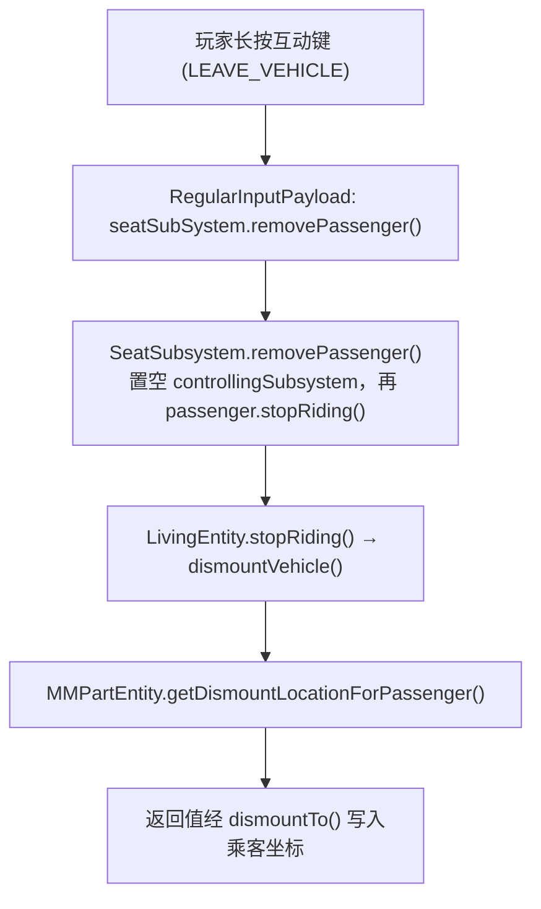
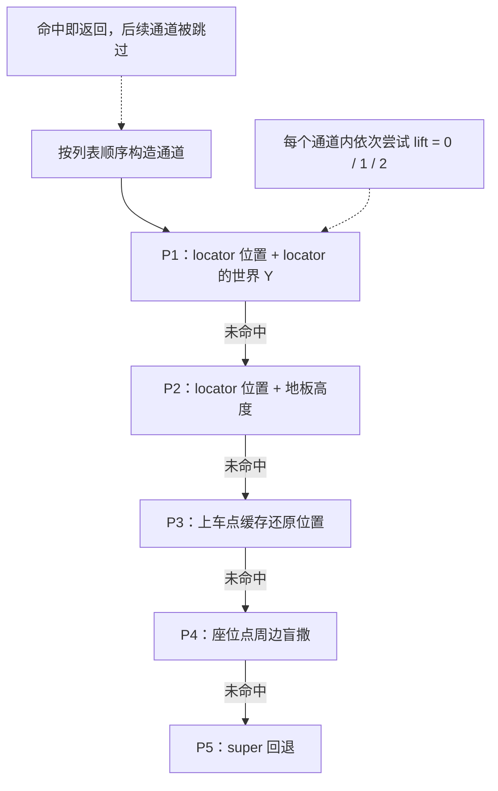

# 载具下车位置选择 — 实现计划

> 本文自包含：仅凭本文即可理解现状、目标、设计与验收方式，阅读时不需要参考其他文档。

## 1. 目标

乘客离开载具部件实体（`MMPartEntity`）时，落点按四级优先链选择：

1. 部件 JSON 中为该座位声明的下车 locator 列表及其周边；
2. 该座位记录的上车位置（刚体局部坐标）及其周边；
3. 座位点周边盲撒（兜底）；
4. 原版 `Entity#getDismountLocationForPassenger` 回退。

在满足上述链路的同时，处理两个 §3.2 描述的现有算法未覆盖的场景：

- **高载具**：乘客当初在车顶或踏板上车，下车时回到同一位置，而不是被"地形求高"拉到车旁地面；
- **上车点被新方块占据**：原上车点放上台阶、半砖、栅栏后，抬升 1~2 格站到障碍物上，而不是直接判失败。

### 1.1 需求追溯

| 需求 | 处理位置 |
| --- | --- |
| 四级回退：指定 locator → 上车位置 → 座位处 → `super` | §4 C1、§5.3、§5.4 |
| 下车 locator 列表按座位实例声明（同型座椅在不同布置位置可不同） | §4 C1、§5.1、§5.3 的 P1/P2 |
| 上车点缓存以相对坐标保存，载具移动后落点跟随载具 | §4 C2、§5.2、§5.5 |
| 缓存仅在上车时覆盖，不引入时间戳 | §4 C3、§5.2 |
| 离座时按乘客身份定位座位，据它取得 locator 声明与缓存 | §4 C10、§5.2、§5.3 |
| 换座交接经世界坐标换算，跨 SubPart 换座同样成立 | §4 C11、§5.2 |
| 候选枚举有界，不设次数上限，首个命中即返回 | §4 C12、§5.3、§5.4 |
| 刚体接触查询在主线程只读快照上执行 | §4 C13、§5.6 |
| 不新增乘客实体重叠检查 | §4 C4、§8 |
| 世界 Y 方向偏移，使矮障碍不导致直接失败 | §4 C5、§5.3 的抬升重试、§5.5 |
| 第 ③ 层作为兜底时不需要跟随车身姿态 | §8 |

### 1.2 非目标

- 第 ③ 层盲撒的方位仍自世界坐标 +X 起算，不与车身朝向对齐；
- 仅为车厢内换座服务的"玩家级"历史位置缓存；
- locator 的"方向 + 距离"解释方式。完整排除清单见 §8。

## 2. 术语

| 术语 | 说明 | 代码位置 |
| --- | --- | --- |
| SubPart | 载具的一个物理刚体单元，对应模型中的一段骨骼子树 | `common/mech/vehicle/SubPart.java` |
| 部件实体 | `MMPartEntity`，SubPart 的原版实体替身，乘客骑乘在它上面 | `common/entity/MMPartEntity.java` |
| 座位子系统 | `SeatSubsystem`，挂在某个 Part 上，持有 `passenger` 字段 | `common/mech/subsystem/SeatSubsystem.java` |
| locator | 模型 `.geo.json` 的 `locators` 组中的命名点，座位点与连接点都用它 | `spark_modules/*/models/part/*.geo.json` |
| 刚体局部空间 | 以刚体质心为原点、随刚体旋转的坐标系 | 定义见下一行两处 |
| 座位点的表达式 | `SubPartAttr.locatorTransforms` 中的变换、`MMMath.worldPointLocalPos()` 与 `MMMath.relPointWorldPos()` 的输入输出，都表达在刚体局部空间 | `SubPartAttr.java:72,280-285`、`MMMath.java:58,73-78` |
| 幽灵体 | `PhysicsGhostObject`，只参与碰撞查询，不参与物理模拟；本流程中常驻物理快照空间 | `MMPartEntity.java:368-382` |
| 世界快照 | `PhysicsWorld.worldSnapshot`：主线程每 tick 刷新一次的只读物理空间，只收录 `PHYSICS_BODY` 组刚体，不参与物理积分 | `Spark-Core/physics/level/WorldSnapshot.kt` |
| 姿势 | `net.minecraft.world.entity.Pose`，下车时按 `passenger.getDismountPoses()` 逐个尝试 | 原版 API |

**关键便利点**：locator 的变换与"上车点缓存"处在同一个坐标系（刚体局部空间），两者可以直接共用同一套"中心 + 环"的候选生成逻辑，不需要做坐标系换算。

**关键时序事实**：`getDismountLocationForPassenger` 由 `LivingEntity.stopRiding()` 内部的 `dismountVehicle()` 调用，客户端与服务端都会走到；调用发生时 `machine_Max$getControllingSubsystem()` 已被 `SeatSubsystem.removePassenger()` 置空（`SeatSubsystem.java:112` 早于 `:113` 的 `stopRiding()`），而 `SeatSubsystem.passenger` 要到 `:118` 才清空。因此**离座时唯一可用的座位定位依据是 `SeatSubsystem.passenger` 的身份匹配**（§5.2）。

## 3. 现状（基线）

### 3.1 调用链



两个与设计强相关的时序事实见 §2 末段：查询发生在 `controllingSubsystem` 置空之后、`seat.passenger` 清空之前。

### 3.2 现有算法（三步）

1. **原点优先**：`subPart != null` 时取 `passenger.getPosition(1).add(0, 0.1, 0)`，遍历所有下车姿势调用校验，通过即返回（`MMPartEntity.java:445-453`）。
2. **候选生成**：`generateCandidatePositions()` 在 XZ 平面上生成 33 个点 —— 1 个原始 XZ 位置，加半径 `{0.5, 1.0, 1.5, 2.0}` × 8 个方向（角度自世界坐标 +X 轴起算）。每个点用 `level().getBlockFloorHeight()` 求地板高度：有效则经 `Vec3.upFromBottomCenterOf()` 落到该列方块中心与地板面，无效则沿用 `originalPos.y` 且保留精确 XZ（`MMPartEntity.java:404-440`）。
3. **逐候选 × 逐姿势校验**，首个通过即返回；全部失败则调用 `super`（`MMPartEntity.java:459-467`）。

`getBlockFloorHeight(BlockPos)` 的返回值是**块内高度偏移**（相对该方块底面，取值 0~1；无地板时为 `-Infinity`），`DismountHelper.isBlockFloorValid(d)` 判据为 `!isInfinite(d) && d < 1.0`，两者配对使用。§5.5 的 P2/P4 沿用这一对语义。

### 3.3 校验函数

`isDismountLocationValid(position, passenger, pose)`（`MMPartEntity.java:387-398`）由两道判定组成：

- 原版 `DismountHelper.canDismountTo(level, passenger, aabb.move(position))`，即按该姿势的乘客包围盒检查方块可通过性（含世界边界判定）；
- 自建幽灵体：`collisionGroup = PAWN`、`collideWithGroups = PHYSICS_BODY`（只与刚体碰撞，不与地形 `TERRAIN` 组碰撞），形状取 `passenger.getLocalBoundsForPose(pose)`，位置设为 `position`，要求 `contactTest()` 返回 0。查询对象是实时物理世界（`getPhysicsLevel().getWorld()`），而该查询在主线程执行。

### 3.4 现有实现的缺陷

| 编号 | 缺陷 | 后果 | 依据 |
| --- | --- | --- | --- |
| D1 | 幽灵盒中心设在 `position`（乘客脚底），而乘客包围盒中心在 `脚底 + 身高/2`，检测体积整体下移半个身高 | 乘客站在车顶、踏板或紧贴车体时必然报告接触，**高载具场景必定失败** | `MMPartEntity.java:376-380` 与 `394-396` |
| D2 | 只在 XZ 平面上采样，无 Y 方向偏移 | 上车点被台阶/半砖/栅栏占据时直接失败 | `MMPartEntity.java:412-422` |
| D3 | 地板高度有效时经 `Vec3.upFromBottomCenterOf()` 吸附到方块中心（XZ 各 +0.5） | 无法表达精确位置，最大引入 0.5√2 ≈ 0.7 格偏差 | `MMPartEntity.java:429` |
| D4 | 采样方位自世界坐标 +X 起算，与车身朝向无关 | 落点方向随机 | `MMPartEntity.java:417-419` |
| D5 | locator 名不存在时 `getLocatorWorldTransform()` / `getLocatorLocalTransform()` 返回单位变换或质心位置 | 拼错名字不报错，落点静默漂移到刚体质心附近 | `SubPart.java:983-1000` |
| D6 | 无逐层观测日志 | 内容作者无法判断某条声明为何未生效 | — |

其中 D1 与 D3 是本次改造必须一并修复的项，否则第 ①② 层无法表达"站在车顶"和"精确回到原位置"。

## 4. 已确认的设计决策

| 编号 | 决策 | 理由 |
| --- | --- | --- |
| C1 | 四级回退链：locator → 上车点 → 座位点 → `super` | 声明优于真实历史，真实历史优于盲撒 |
| C2 | 上车点缓存存**刚体局部 XYZ**，三个分量都参与还原 | 高载具需要精确回到当初站立的高度；只还原 XZ 时高度由"地形求高"决定，会把落点拉到车旁地面 |
| C3 | 缓存只在车外登入时写入并直接覆盖；下车、换座、子系统移除都不清空 | 能坐上去说明该位置当时为空；清空会与"查询发生在离座流程中途"这一时序冲突（§5.2） |
| C4 | 不做乘客实体重叠检查 | 原版允许重叠并通过实体推挤排开 |
| C5 | 抬升沿**世界 +Y**，仅 +1 与 +2，且按通道整体两阶段重试 | 抬升语义是"踩上障碍物"，与载具姿态无关；不向下抬升 |
| C6 | 幽灵盒中心对齐乘客包围盒中心；第 ①② 层允许 ε 穿透 | 修复 D1；车顶下车时脚底与车体顶面相切，需要容忍浮点重叠 |
| C7 | 第 ①② 层使用精确 XZ；第 ③ 层使用方块中心吸附 | 修复 D3；第 ③ 层是盲撒，吸附无副作用 |
| C8 | 缓存不持久化 | 载具存读档后缓存为空即退到第 ③ 层，行为安全 |
| C9 | 采样与换乘判断在两端的 `setPassenger()` 中都执行 | 原版下车流程在两端都会调用 `getDismountLocationForPassenger`，让两端行为一致，无需网络同步 |
| C10 | 离座时按 `SeatSubsystem.passenger == passenger` 身份匹配定位座位；匹配不到则跳过 P1/P2 与 P3（这三条通道都依赖该座位实例），只保留 P4/P5 | 查询时 `controllingSubsystem` 已置空，身份匹配是唯一可靠依据（§2 关键时序事实） |
| C11 | 换座交接把旧缓存经世界坐标换算写入新座位，判据为「同一装配体」 | 缓存表达在旧刚体局部空间，直接复制到另一刚体没有几何意义；同一装配体（跨 SubPart）的换座同样需要交接 |
| C12 | 候选枚举为有界枚举，不设次数上限，首个命中即返回；仅对已尝试候选去重 | 候选总数上界由通道结构决定（§5.3），人为上限会截断兜底通道 |
| C13 | 刚体接触查询在主线程只读的物理快照上执行，只用 `contactTest` | 避免主线程改写属于实时空间的物理体；快照只收录 `PHYSICS_BODY` 组，与"只判载具刚体"的语义一致 |

### 4.1 备选方案与取舍

| 备选方案 | 取舍 |
| --- | --- |
| 全局 `实体 id → 坐标` 映射表 | 不采用。`Entity.getId()` 在跨维度与重登后会重新分配；全局表的生命周期无主（乘客死亡、退服、载具拆解、区块卸载都不经过清理路径）；同车多座位在全局表里需要额外区分；而这些问题的根源是作用域选错 —— 该数据的本质是"某个座位 × 某次上车"，随 `SeatSubsystem` 生命周期存续即自然消解 |
| 缓存带时间戳，换座时保留较新值 | 不采用。能坐上去说明位置当时为空，直接覆盖即语义完整 |
| 缓存只存 XZ，高度交给地形求高 | 不采用。高载具的上车点在车顶或踏板上，只还原 XZ 会把落点拉到车旁地面 |
| 在离座流程中清空缓存 | 不采用。下车位置查询发生在 `SeatSubsystem.removePassenger()` 内部（`stopRiding()` 触发），清空早于查询（§2 关键时序事实） |
| 用 `controllingSubsystem` 反查座位 | 不采用。查询发生时它已被置空；座位定位采用 `SeatSubsystem.passenger` 身份匹配 |
| 换座时直接复制旧座位的局部坐标 | 不采用。局部坐标锚在旧刚体上，跨 SubPart 复制后由新刚体还原会得到无意义的世界点；交接采用世界坐标换算 |
| 把 `dismount_locators` 放进静态属性（型号级） | 不采用。同型号座椅在不同布置位置需要不同的下车方向，型号级字段无法按实例区分；`locator`、`control_group_preset` 等实例级字段已确立在动态属性中 |
| 每层都给大半径环 | 不采用。层内半径越大，越容易在错误的中心附近找到"合法但更差"的位置，从而阻止后面更合适的层被尝试 |
| 所有通道共享一个校验次数上限 | 不采用。候选总数本身有界（§5.3），上限只会在通道尚未试完时提前放弃，尤其会截断第 ③ 层 |
| 新增乘客实体重叠检查 | 不采用。原版允许下车落点与其它实体重叠，并通过实体推挤排开 |
| 在主线程直接对实时物理空间发起接触查询 | 不采用。属"主线程操作物理体"；接触查询采用 `PhysicsWorld.worldSnapshot` |
| 用 `pairTest` 做快照接触查询 | 不采用。`WorldSnapshot.needsCollision()` 恒返回 `false`，`pairTest` 会经过该回调而被整体过滤；`contactTest` 只按碰撞组/掩码过滤（§5.6） |

## 5. 详细设计

### 5.1 数据结构

| 位置 | 新增内容 | 说明 |
| --- | --- | --- |
| `SeatSubsystem` | `private Vector3f boardingLocalOffset;` | 刚体局部空间的上车点，`null` 表示该座位尚无车外登入记录；只在车外登入时写入（C3） |
| `SeatSubsystemAttr` | `public final List<String> dismountLocators;` | JSON 字段 `dismount_locators`，字符串列表，默认空列表，长度上限 4，元素不得为空串 |
| `SubPart` | `public boolean hasLocator(String name)` | 实现为 `attr.getLocatorTransforms().containsKey(name)`，用于 D5 的显式校验 |
| `MMPartEntity` | `private SeatSubsystem findOccupiedSeat(LivingEntity passenger)` | 遍历 `subPart.getSubsystems().values()`，返回第一个满足 `s instanceof SeatSubsystem seat && seat.passenger == passenger` 的座位；无匹配返回 `null`（C10） |

坐标换算复用 `MMMath` 中已有方法，不新增方法：

| 方法 | 用途 |
| --- | --- |
| `MMMath.worldPointLocalPos(Vector3f worldPoint, PhysicsCollisionObject obj)` | 世界点 → 刚体局部（车外登入时采样，`MMMath.java:73-78`） |
| `MMMath.relPointWorldPos(Vector3f localPoint, PhysicsCollisionObject obj)` | 刚体局部 → 世界点（还原上车点、换座交接时换算，`MMMath.java:58-64`） |

部件 JSON 的声明形态：

```json
"subsystem.machine_max.radio_seat": {
  "type": "machine_max:seat",
  "definition": "machine_max:default_passenger_seat",
  "locator": "radio_seat",
  "dismount_locators": ["radio_exit_left", "radio_exit_right"]
}
```

`dismount_locators` 的处理规则：

| 项 | 规则 |
| --- | --- |
| 类型 | 字符串列表，列表顺序即优先级 |
| 默认值 | 空列表，此时不构造 P1/P2 通道 |
| 长度上限 | 4，超出部分在构造期截断并警告 |
| 元素内容 | 不得为空串，违反时构造期抛异常 |
| 名字不存在 | 在构造 `SearchPass` 时用 `SubPart.hasLocator()` 判定，跳过该 locator 的两个通道并记录警告（修复 D5） |
| 与 `locator` 的关系 | 两者可以相同也可以不同；`locator` 决定乘客坐在哪里，`dismount_locators` 决定从哪里离开 |

### 5.2 缓存写入、交接与座位解析

| 场景 | 判定条件 | 行为 |
| --- | --- | --- |
| 从车外登入 | `setPassenger()` 被调用时 `passenger.getVehicle() == null` | 采样并覆盖：`MMMath.worldPointLocalPos(passenger.position(), owner.getSubPart().body)` |
| 载具内换座（同一装配体） | `passenger.getVehicle() != null` 且旧控制子系统是**同一装配体**上的 `SeatSubsystem`，且不是本座位 | 把旧座缓存经世界坐标换算写入本座位（C11） |
| 跨载具换乘 | `passenger.getVehicle()` 属于另一装配体 | 不采样、不交接，沿用本座位上一位乘客的登入点；若从未有记录则缓存为空 |
| 下车 / 死亡 / 子系统移除 | `removePassenger()`、`onDetach()` | 不清空（C3）；缓存随座位实例存续，下次车外登入时被覆盖 |

**身份匹配的时序可行性**：`removePassenger()` 在 `passenger.stopRiding()`（触发下车位置查询）之后才把 `passenger` 字段置空（`SeatSubsystem.java:113` 与 `:118`），因此查询期间 `findOccupiedSeat()` 仍能命中正在离座的那个座位。该匹配同时是 P1/P2 的 `attr.dismountLocators` 与 P3 的 `boardingLocalOffset` 的唯一入口；匹配不到就整体跳过这三条通道，退化为 P4/P5（与 §3.2 现状一致）。

**采样条件必须保持"车外登入"**：若任何 `setPassenger()` 都采样，同车换座会把当前坐姿位置写成新车座的上车点，换座后下车将落到新座位点。

**跨 SubPart 交接的换算**：

```java
// A、B 为不同刚体时，局部坐标必须经世界点中转，否则新刚体还原出的世界点无意义
Vector3f worldPoint = MMMath.relPointWorldPos(offsetA, bodyA);            // 旧座位刚体局部 → 世界
Vector3f offsetB = MMMath.worldPointLocalPos(worldPoint, bodyB);          // 世界 → 新座位刚体局部
```

交接要求 `bodyA`、`bodyB` 均非空，否则跳过交接（本座位缓存保持原值）。读取旧值时旧刚体仍处于同一 tick 的姿态，两端（客户端/服务端）各自计算，结果一致。

`SeatSubsystem` 的改动骨架：

```java
public void setPassenger(LivingEntity passenger) {
    boolean hostReady = owner.getSubPart() != null && owner.getSubPart().entity != null;
    // C3：车外登入时采样并覆盖旧值
    if (hostReady && passenger.getVehicle() == null && owner.getSubPart().body != null) {
        this.boardingLocalOffset = MMMath.worldPointLocalPos(
                PhysicsHelperKt.toBVector3f(passenger.position()), owner.getSubPart().body);
    }
    // C11：同一装配体内的换座，把旧座缓存经世界坐标换算交接过来
    if (hostReady && passenger.getVehicle() != null
            && ((IEntityMixin) passenger).machine_Max$getControllingSubsystem() instanceof SeatSubsystem oldSeat
            && oldSeat != this
            && oldSeat.getSubPart().getPart().assembly == getSubPart().getPart().assembly
            && oldSeat.getBoardingLocalOffset() != null
            && oldSeat.getSubPart().body != null && getSubPart().body != null) {
        Vector3f worldPoint = MMMath.relPointWorldPos(
                oldSeat.getBoardingLocalOffset(), oldSeat.getSubPart().body);
        this.boardingLocalOffset = MMMath.worldPointLocalPos(worldPoint, getSubPart().body);
    }
    // ... 该方法中与缓存无关的原有处理（SeatSubsystem.java:84-106）：
    //     旧座 removePassenger()、startRiding、占用标记、乘客数信号、质量上报。
    //     交接只读取旧座的值；旧座缓存保留，其下次车外登入时被覆盖。
}
```

**两端一致性**：原版下车流程在客户端与服务端都会调用 `getDismountLocationForPassenger`（`LivingEntity.stopRiding()` 内无端判别），`setPassenger()` 本身也是双端方法，因此采样、交接与还原在两个端都执行，该字段不需要网络同步。跨载具换乘时两端都不采样，表现一致。

### 5.3 优先级通道列表

回退链的整体形态：



把回退链表达为有序的 `SearchPass` 列表，每个通道由「中心点 + XZ 环半径 + Y 来源 + 是否容忍穿透」四要素确定：

| 优先级 | 中心 | XZ 环 | Y 来源 | 容忍穿透 |
| --- | --- | --- | --- | --- |
| P1（每个 locator 一项，按列表顺序） | locator 的世界位置 | `{0} ∪ 0.5×8` | locator 世界位置的世界 Y | 是 |
| P2（每个 locator 一项） | 同上 | 同上 | 该列地板高度 | 是 |
| P3 | 该座位缓存的还原位置（`relPointWorldPos(offset, body)`） | `{0} ∪ {0.5, 1.0}×8` | 还原位置的世界 Y | 是 |
| P4 | 乘客当前位置（`passenger.getPosition(1)`） | `{0} ∪ {0.5, 1.0, 1.5, 2.0}×8` | 该列地板高度 | 否 |
| P5 | — | — | — | 调用 `super` |

**抬升重试**：对每个通道，先以 `lift = 0` 跑完整个 XZ 环，再有 `lift = 1`、`lift = 2`（世界 +Y，不向下）。正常场景在第一轮即命中，因此典型开销与 §3.2 持平。

**命名对应**：下文的「第 ① 层」指 P1 与 P2（locator 及其周边），「第 ② 层」指 P3（上车点缓存及其周边），「第 ③ 层」指 P4（座位点及其周边）；C6、C7 与 §5.5 中的层编号与 P 编号按此对应。

**候选总量**：候选数由通道结构决定，不设人为上限（C12）。最坏情况为 locator 数 4 时 P1+P2 共 4×2×9 = 72 个 XZ 点、P3 17 个、P4 33 个，合计 122 个点，各乘以 3 次抬升与乘客的姿势数（玩家为 3 个）后约 1100 次校验；未声明 locator 时下限为 (17+33)×3×3 = 450 次。首个命中即返回是常态路径。

**去重**：所有通道共享一个已尝试候选集合；与已尝试候选距离小于 0.25 格的点跳过，避免 locator 与座位点重合时重复查询物理世界。去重只跳过重复坐标，不提前结束通道。

### 5.4 主流程

```java
@Override
public Vec3 getDismountLocationForPassenger(LivingEntity passenger) {
    if (subPart == null) return super.getDismountLocationForPassenger(passenger);
    List<Pose> poses = passenger.getDismountPoses();
    SeatSubsystem seat = findOccupiedSeat(passenger);              // C10：按身份定位，可能为 null
    List<Vec3> tried = new ArrayList<>();                          // 去重集合，不设次数上限（C12）
    for (SearchPass pass : buildPasses(passenger, seat)) {         // 有序：locator → 上车点 → 座位点
        for (int lift = 0; lift <= 2; lift++) {                    // C5：世界 +Y 抬升重试
            for (Vec3 ringPoint : pass.ring()) {                   // 中心 + 环，层内先行
                Vec3 candidate = pass.resolve(ringPoint, lift);    // 见 §5.5
                if (candidate == null || isDuplicate(tried, candidate, 0.25)) continue;
                tried.add(candidate);
                for (Pose pose : poses) {
                    if (isDismountLocationValid(candidate, passenger, pose, pass.tolerant())) {
                        return candidate;                          // 首个通过即采用
                    }
                }
            }
        }
    }
    return super.getDismountLocationForPassenger(passenger);       // P5
}
```

各通道的构造规则（`buildPasses`）：

- P1/P2：同一 locator 生成两个通道 —— P1 用 locator 世界位置的 Y（表达"作者把下车点画在哪个高度"），P2 用该 XZ 的地板高度（表达"站在 locator 所在列的地面上"）。`seat` 为 `null` 或 `seat.attr.dismountLocators` 为空时不构造这两类通道；每个名字在构造前用 `SubPart.hasLocator()` 校验，名字不存在时跳过该 locator 的两个通道并记录警告（修复 D5）。
- P3：仅当 `seat != null`、`seat.getBoardingLocalOffset() != null` 且 `subPart.body != null` 时构造；中心为 `MMMath.relPointWorldPos(seat.getBoardingLocalOffset(), subPart.body)`。
- P4：始终构造，中心为 `passenger.getPosition(1)`，行为与 §3.2 第 2、3 步一致，并叠加 §5.5 的抬升。

### 5.5 候选点解析（`pass.resolve`）

| 通道 | XZ 处理 | Y 处理 | 构造守卫 |
| --- | --- | --- | --- |
| P1 | 精确值：`center.x + dx`、`center.z + dz` | locator 世界位置的世界 Y `+ lift` | 无（世界 Y 恒为有限值） |
| P2 | 同上 | `pos.getY() + level().getBlockFloorHeight(pos) + lift`，等价于 `Vec3.upFromBottomCenterOf(pos, offset).y + lift` | 偏移非有效地板高度时返回 `null`（由 P1 承接该 XZ） |
| P3 | 同上 | 缓存还原位置的世界 Y `+ lift` | 无 |
| P4 | 吸附到该列的方块中心（即 `Vec3.upFromBottomCenterOf()` 的行为） | 同 P2 | 同 P2 |

**地板高度的有效性判定**：`level().getBlockFloorHeight(pos)` 返回的是**块内偏移**（相对 `pos.getY()`，0~1；无地板时为 `-Infinity`），因此 P2/P4 用它之前先用 `DismountHelper.isBlockFloorValid(offset)` 判断"该列是否存在地板"。这个判断的作用域仅限地板来源的 Y —— P1/P3 的 Y 是世界坐标，套用该判据会因 `offset < 1.0` 不成立而被误判为无效。**候选的接受与否统一由 `isDismountLocationValid` 决定**（§5.6），`resolve` 只负责"这个 Y 值能否构造出候选点"。

**Y 一律取世界 Y**：P1 与 P3 的 Y 是还原后的世界坐标 Y，不是刚体局部变换的 Y 分量；车身俯仰或侧倾时两者不相等，直接用局部 Y 会把落点放错高度。

### 5.6 校验函数改造

```java
private boolean isDismountLocationValid(Vec3 position, LivingEntity passenger, Pose pose, boolean tolerant) {
    AABB bounds = passenger.getLocalBoundsForPose(pose);
    if (!DismountHelper.canDismountTo(this.level(), passenger, bounds.move(position))) return false;
    PhysicsGhostObject ghost = getOrCreateTestGhost(passenger, pose);   // 常驻物理快照空间
    // C6：幽灵盒中心与乘客包围盒中心对齐（修复 D1）
    Vec3 center = position.add(0, bounds.getYsize() * 0.5, 0);
    ghost.setPhysicsLocation(PhysicsHelperKt.toBVector3f(center));
    if (tolerant) return !hasDeeperThan(ghost, PENETRATION_EPSILON);   // ε = 0.02 格
    return snapshot().contactTest(ghost, null) == 0;
}
```

**快照查询的取用与约束**（C13）：

| 项 | 做法 |
| --- | --- |
| 取用 | `getPhysicsLevel().getWorld().getWorldSnapshot()` |
| 幽灵体归属 | 构造时一次性 `addCollisionObject` 加入快照空间，之后只改写形状与位置；查询只在该空间内进行 |
| 查询方式 | 只用 `contactTest(pco, listener)`；`pairTest` 会经过 `WorldSnapshot.needsCollision()`（恒返回 `false`）而被整体过滤 |
| 时效 | 快照由主线程在 `PhysicsLevel.requestStep()` 内按「结构 → 变换 → AABB」刷新，相对实时世界陈旧不超过 1 个主线程 tick |
| 地形 | 地形刚体属 `TERRAIN` 组，既不在快照收录范围（只收 `PHYSICS_BODY`）也不在幽灵体掩码内，地面落点仍完全由 `canDismountTo` 判定 |
| 待验证 | 快照空间上的 `contactTest` 是否按碰撞组正常返回接触，见 §7 的 S0 |

`hasDeeperThan()` 通过 `contactTest(pco, listener)` 的重载（`CollisionSpace.java:231`）收集接触，回调类型为 `PhysicsCollisionListener`，接触点距离取 `PhysicsCollisionEvent.getDistance1()`（负值为穿透深度）；任一接触点距离小于 `-ε` 时判定为深度穿透。

### 5.7 观测日志

每个通道未命中时输出一条 debug 日志，格式固定为：

```
dismount pass=P1 locator=radio_exit_left lift=1 reason=body_contact
```

`reason` 取值：`locator_missing` / `no_floor` / `terrain_blocked` / `body_contact`。日志是判断"作者声明的 locator 为何未生效"的唯一线索，也是 §7 的检索依据。

## 6. 涉及文件

| 层 | 文件 | 改动 |
| --- | --- | --- |
| Java | `common/entity/MMPartEntity.java` | 主流程、`SearchPass`、去重、`findOccupiedSeat()`、校验函数与快照查询改造；顺带清理 `addPassenger()` 中未被使用的局部坐标计算 |
| Java | `common/mech/subsystem/attr/dynamic_attr/SeatSubsystemAttr.java` | 新增 `dismountLocators` 字段与 CODEC 条目、构造期校验 |
| Java | `common/mech/subsystem/SeatSubsystem.java` | 新增 `boardingLocalOffset` 字段、车外登入采样、同装配体换座交接 |
| Java | `common/mech/vehicle/SubPart.java` | 新增 `hasLocator(String)` |
| 插件 | `Machine-Max_BlockbenchPlugin/src/core/subsystem_types.js` | seat 的 `dynamicFields` 增加 `dismount_locators` |
| 插件 | `.../src/codec/codecs/subsystem_codec.js` | `SeatCodec` 增加 `dismount_locators: Codec.STRING.list().default([])` |
| 插件 | `.../src/builtin/builtin/machine_max/docs/{zh_cn,en_us}/schemas/subsystem/dynamic/seat_dynamic_attr.schema.json` | 2 份 schema 同步字段 |
| 内容 | `src/main/resources/spark_modules/{machine_max.builtin,sdkfz,Machine-Max_Official_Pack}/machine_max/docs/{zh_cn,en_us}/schemas/subsystem/dynamic/seat_dynamic_attr.schema.json`、`.../Machine-Max_Pack_Template/namespace/docs/{zh_cn,en_us}/...` | 4 个内容包 × 2 语言的 8 份 schema 同步字段 |
| 内容 | `spark_modules/*/models/part/*.geo.json` + 部件 JSON | 作者在模型中新增下车 locator 并在部件 JSON 中引用 |

schema 同步注意：`Machine-Max_Official_Pack` 的那份已多出 `camera_discovery_targets` 字段，不能以其它副本覆盖式写入，只能逐份插入 `dismount_locators`。

插件侧需要新增「locator 列表」编辑器（现有的 `locator_selector` 为单选，`LocatorPicker.vue.js` 可复用为多值形态）；缺少它时作者只能手改 JSON。

## 7. 验证方式

本项目没有单元测试，验证依赖 `./gradlew runClient` / `runServer` 手动场景。每条场景列出预期结果与观察点：

| 编号 | 场景 | 预期 | 观察点 |
| --- | --- | --- | --- |
| S0 | 把幽灵体置于与载具刚体明显重叠的位置，再置于车顶切面处 | 前者报告接触、后者不报告深穿透 | 快照空间上的 `contactTest` 按 `PHYSICS_BODY` 掩码正常计数；据此校准 ε（Bullet 盒形有默认碰撞 margin） |
| S1 | 平地敞篷车，站在车旁上车后立即下车 | 落点与当前位置一致 | P3 命中，物理查询次数为 1 |
| S2 | 封闭车体，座位声明 `dismount_locators` | 落点位于声明的 locator 处 | 日志显示 P1 命中 |
| S3 | 高载具：玩家站在车顶上车，下车 | 落点在车顶同一位置 | P3 命中；该位置能否通过校验由 D1 的修复与 S0 的 ε 决定 |
| S4 | 上车后在上车点放置半砖，再下车 | 落点站在半砖上 | P3 的 `lift = 1` 命中 |
| S5 | 同一载具内换座 A → B（含跨 SubPart 换座）后下车 | 落点仍在 A 座那一侧 | 交接经世界坐标换算，B 座不依赖自身历史值 |
| S6 | 载具开走 20 格后下车 | 落点跟随载具当前位置 | 缓存为刚体局部坐标，还原时使用当前刚体变换 |
| S7 | 该座位从未有过车外登入且未配 `dismount_locators` 的载具 | 与 §3.2 的现有行为一致 | 走 P4 |
| S8 | `dismount_locators` 中写入不存在的 locator 名 | 日志警告并跳过该通道 | 落点不出现"漂移到刚体质心" |
| S9 | 载具侧翻后下车 | 逐级回退后仍能下车 | 各通道的拒绝原因可在日志中区分 |

**观察方式**：每步的命中通道与拒绝原因由 §5.7 的 debug 日志给出，验证时检索日志中的通道关键字即可；若当前日志级别过滤了 debug 输出，临时提升到 info 级别后再验证。S3、S4 需要先确认乘客的上车动作确实发生在车外（即 `passenger.getVehicle()` 为空），否则缓存不会被写入。

## 8. 本次不做

- 第 ③ 层的采样方位随车身姿态：该层保持自世界坐标 +X 起算。
- 乘客实体重叠检查。
- 缓存时间戳与多人共享区分。
- 缓存持久化。
- 把 locator 解释为"方向 + 距离"而非精确点。
- 跨载具换乘时的缓存继承。
- 候选校验次数上限（候选枚举本身有界，见 C12）。
- 在 `pairTest` 上实现快照接触查询（受 `WorldSnapshot.needsCollision()` 过滤，见 C13）。

## 9. 风险与边界

| 风险 | 说明与缓解 |
| --- | --- |
| 快照接触查询是否受 `needsCollision` 影响 | 由 S0 先行确认；若被过滤，需与 Spark-Core 协调，不在本项目侧改动共享快照空间的过滤开关 |
| 快照相对实时世界陈旧 | 陈旧不超过 1 个主线程 tick（载具 1 tick 位移约 0.02 格），且快照刚体共享原形状，窄相几何一致 |
| 幽灵体常驻快照空间 | 位置与形状在查询之间逐次改写；快照空间只在主线程刷新与查询，无并发访问 |
| 抬升上限 2 格 | 更高的障碍由第 ③ 层或 `super` 承接 |
| 刚体缺失 | 采样、交接与还原前需判空 `owner.getSubPart()`、`body`、`subPart.entity` |
| 载具拆分重组 | SubPart 变换变化会使局部坐标的含义漂移，由逐级校验与回退兜底 |
| 缓存中的 Y 在载具处于高空时对应悬空世界位置 | 由 `canDismountTo` 拒绝后逐级回退 |
| 同一座位被不同乘客先后使用 | 缓存是该座位"最近一次车外登入点"，后者的登入点覆盖前者，落点不区分乘客身份 |
| 乘客骑在其它原版载具上直接进入座位，或跨载具换乘 | `passenger.getVehicle() != null` 且不属于本装配体，不采样也不交接；落点沿用该座位上一位乘客的登入点，若从未有记录则走 P4 |
| 座位解析不到 | `findOccupiedSeat()` 返回 `null` 时跳过第 ①② 层与 P3，退化到 P4/P5 |
| P4 抬升后的 XZ 仍为方块中心 | 抬升只改变高度，水平位置沿用该列的方块中心 |
| 最坏候选枚举量 | 约 1100 次校验，仅在逐级都未命中时发生，且单次查询在主线程只读快照上完成 |

## 10. 落地顺序

1. S0 快照接触查询实验与 ε 校准；幽灵盒中心对齐与 ε 容忍（对应 S0、S3）；
2. `SearchPass` 抽象与主流程改造，第 ③ 层行为覆盖 §3.2 的现有算法并叠加抬升（对应 S1、S7）；
3. locator 层：Java 字段 + 插件字段与编辑器 + 10 份 schema（对应 S2、S8）；
4. 上车点缓存、座位身份解析与换座世界坐标交接（对应 S3、S5、S6）；
5. 抬升重试、去重与观测日志收尾（对应 S4、S9）。
